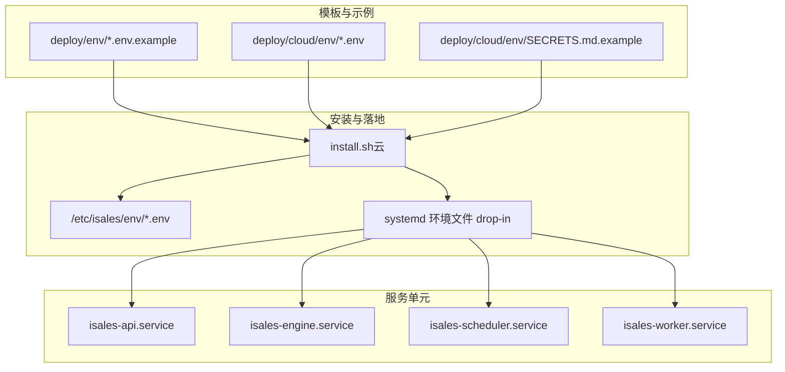
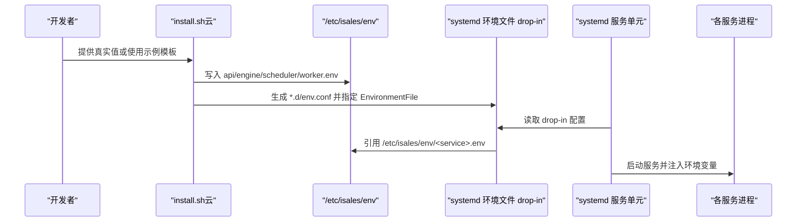
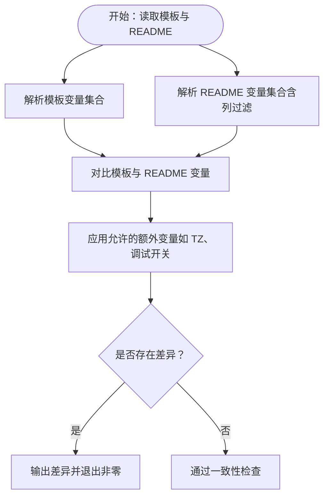
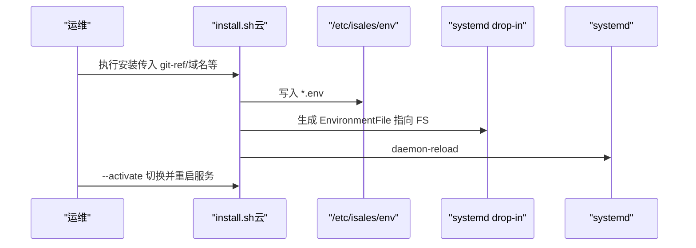
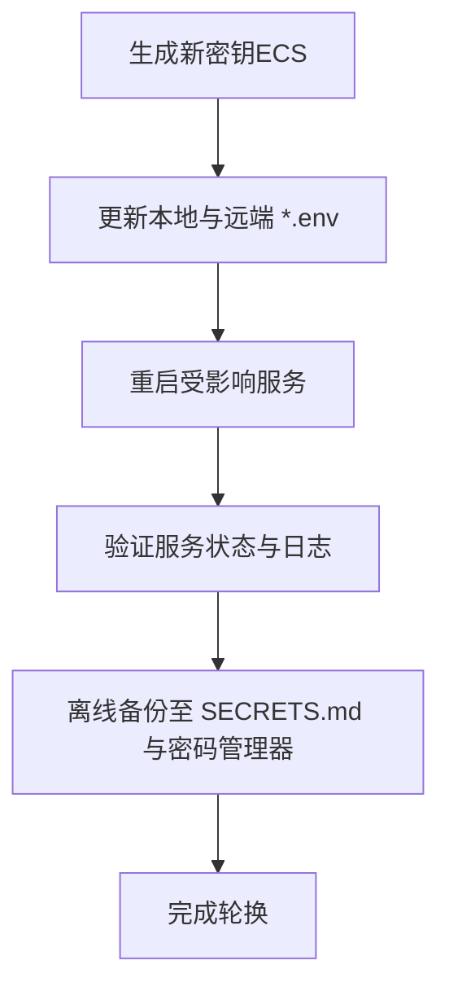
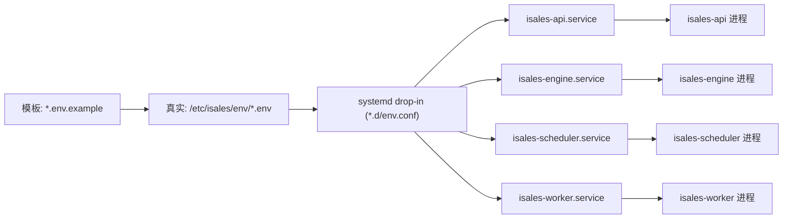

# 环境变量配置

<cite>
**本文引用的文件**
- [api.env.example](file://deploy/env/api.env.example)
- [engine.env.example](file://deploy/env/engine.env.example)
- [scheduler.env.example](file://deploy/env/scheduler.env.example)
- [worker.env.example](file://deploy/env/worker.env.example)
- [modem-controller.env.example](file://deploy/env/modem-controller.env.example)
- [telephony-api.env.example](file://deploy/env/telephony-api.env.example)
- [check_env_consistency.py](file://deploy/linux/scripts/check_env_consistency.py)
- [install.sh（云）](file://deploy/cloud/scripts/install.sh)
- [deploy.sh（Linux）](file://deploy/linux/scripts/deploy.sh)
- [deploy.sh（macOS）](file://deploy/macos/scripts/deploy.sh)
- [isales-api.service](file://deploy/cloud/systemd/isales-api.service)
- [isales-engine.service](file://deploy/cloud/systemd/isales-engine.service)
- [isales-scheduler.service](file://deploy/cloud/systemd/isales-scheduler.service)
- [isales-worker.service](file://deploy/cloud/systemd/isales-worker.service)
- [SECRETS.md.example（云）](file://deploy/cloud/env/SECRETS.md.example)
- [README.md（云环境）](file://deploy/cloud/env/README.md)
</cite>

## 目录
1. [简介](#简介)
2. [项目结构](#项目结构)
3. [核心组件](#核心组件)
4. [架构总览](#架构总览)
5. [详细组件分析](#详细组件分析)
6. [依赖关系分析](#依赖关系分析)
7. [性能与可用性考量](#性能与可用性考量)
8. [故障排查指南](#故障排查指南)
9. [结论](#结论)
10. [附录](#附录)

## 简介
本文件面向 iSales 生产与交付团队，系统化梳理 6 个服务的环境变量模板与配置要求，覆盖数据库连接、Redis 设置、API 密钥与硬件相关参数，并给出一致性检查、敏感信息保护、配置验证机制、最佳实践、安全配置与故障排查方法。文中所有技术细节均来自仓库中的示例模板与自动化脚本。

## 项目结构
围绕环境变量的配置与落地，仓库采用“模板 + 自动化安装 + 服务单元”的组织方式：
- 模板：位于 deploy/env 与 deploy/cloud/env，提供各服务的示例环境变量文件
- 安装脚本：将模板写入 /etc/isales/env 并生成 systemd 环境文件 drop-in
- 服务单元：通过 EnvironmentFile 引用 /etc/isales/env/<service>.env
- 一致性检查：校验模板与各服务 README 中声明的变量是否一致

图表来源
- [install.sh（云）:245-278](file://deploy/cloud/scripts/install.sh#L245-L278)
- [isales-api.service:16-17](file://deploy/cloud/systemd/isales-api.service#L16-L17)
- [isales-engine.service:20-25](file://deploy/cloud/systemd/isales-engine.service#L20-L25)
- [isales-scheduler.service:14-15](file://deploy/cloud/systemd/isales-scheduler.service#L14-L15)
- [isales-worker.service:14-15](file://deploy/cloud/systemd/isales-worker.service#L14-L15)

章节来源
- [install.sh（云）:245-278](file://deploy/cloud/scripts/install.sh#L245-L278)
- [isales-api.service:16-17](file://deploy/cloud/systemd/isales-api.service#L16-L17)
- [isales-engine.service:20-25](file://deploy/cloud/systemd/isales-engine.service#L20-L25)
- [isales-scheduler.service:14-15](file://deploy/cloud/systemd/isales-scheduler.service#L14-L15)
- [isales-worker.service:14-15](file://deploy/cloud/systemd/isales-worker.service#L14-L15)

## 核心组件
本节按服务维度汇总关键环境变量、作用、默认值与安全要点，并标注跨服务一致性要求。

- isales-api
  - 数据库连接：ISALES_DATABASE_URL
  - 缓存连接：ISALES_REDIS_URL
  - 会话与边缘令牌签名：ISALES_JWT_SECRET
  - 管理员账户：ISALES_ADMIN_USER、ISALES_ADMIN_PASSWORD_HASH
  - 一致性要求：与 engine/scheduler/worker/telephony-api 的数据库与 Redis URL 必须一致；JWT 秘钥需与 telephony-api 保持一致
  - 安全要点：管理员密码哈希应使用 bcrypt；JWT 秘钥轮换需同步到所有服务并重启
  - 参考路径：[api.env.example:9-13](file://deploy/env/api.env.example#L9-L13)

- isales-engine
  - 数据库连接：ISALES_DATABASE_URL
  - 缓存连接：ISALES_REDIS_URL
  - 大模型/ASR/TTS/电话模式提供方：ISALES_ENGINE_LLM_PROVIDER、ISALES_ENGINE_ASR_PROVIDER、ISALES_ENGINE_TTS_PROVIDER、ISALES_ENGINE_TELEPHONY_MODE
  - 流水线与超时：ISALES_ENGINE_PIPELINE_DEFAULT_TIMEOUT_MS、ISALES_ENGINE_MAX_NO_PROGRESS_SECONDS、ISALES_ENGINE_GRACEFUL_SHUTDOWN_TIMEOUT_S
  - 时区：TZ
  - 一致性要求：与 api/scheduler/worker 的数据库与 Redis URL 必须一致
  - 安全要点：提供方凭据不再存放于 env，通过 DB SSOT 管理；主密钥 Fernet 仅在 worker env 中声明（当前行为）
  - 参考路径：[engine.env.example:8-20](file://deploy/env/engine.env.example#L8-L20)

- isales-scheduler
  - 数据库连接：ISALES_DATABASE_URL
  - 缓存连接：ISALES_REDIS_URL
  - 调度周期与批处理：ISALES_SCHEDULER_TICK_INTERVAL、ISALES_SCHEDULER_BATCH_SIZE、ISALES_SCHEDULER_HISTORY_N
  - 最大并发：ISALES_MAX_CONCURRENCY
  - 时区：TZ
  - 一致性要求：与 api/engine/worker 的数据库与 Redis URL 必须一致
  - 参考路径：[scheduler.env.example:12-20](file://deploy/env/scheduler.env.example#L12-L20)

- isales-worker
  - 数据库连接：ISALES_DATABASE_URL
  - 缓存连接：ISALES_REDIS_URL
  - 对称加密主密钥：ISALES_FERNET_KEY（用于 provider_credential 表的凭据加解密）
  - Webhook 默认超时：ISALES_WEBHOOK_DEFAULT_TIMEOUT_SECONDS
  - 重试策略：ISALES_WORKER_RETRY_TICK_INTERVAL、ISALES_WORKER_RETRY_BATCH_SIZE
  - 指标上报：ISALES_WORKER_METRICS_TICK_INTERVAL
  - 时区：TZ
  - 一致性要求：与 api/engine/scheduler 的数据库与 Redis URL 必须一致；Fernet 主密钥需与 isales-api 保持一致
  - 安全要点：Fernet 主密钥丢失等于所有 provider 凭据不可恢复，需离线备份与密码管理器双重保管
  - 参考路径：[worker.env.example:9-19](file://deploy/env/worker.env.example#L9-L19)

- isales-telephony-api
  - 数据库连接：ISALES_DATABASE_URL
  - 缓存连接：ISALES_REDIS_URL
  - 会话与边缘令牌签名：ISALES_JWT_SECRET（与 isales-api 使用相同 HS256 签名/验签配对）
  - 一致性要求：与 api/engine/scheduler/worker 的数据库与 Redis URL 必须一致；JWT 秘钥需与 isales-api 保持一致
  - 参考路径：[telephony-api.env.example:9-11](file://deploy/env/telephony-api.env.example#L9-L11)

- isales-telephony modem-controller
  - 数据库连接：ISALES_DATABASE_URL
  - 设备控制套接字：ISALES_MODEM_SOCKET（默认 /var/run/isales/modem.sock）
  - 平台调试开关：ISALES_SKIP_UDEV（开发/模拟环境专用，严禁生产设置）
  - 模拟拨号与通话时长：MOCK_DIAL_DELAY_MS、MOCK_CALL_DURATION_MS（仅模拟器）
  - 一致性要求：与 api/engine/scheduler/worker/telephony-api 的数据库 URL 必须一致
  - 参考路径：[modem-controller.env.example:7-14](file://deploy/env/modem-controller.env.example#L7-L14)

章节来源
- [api.env.example:9-13](file://deploy/env/api.env.example#L9-L13)
- [engine.env.example:8-20](file://deploy/env/engine.env.example#L8-L20)
- [scheduler.env.example:12-20](file://deploy/env/scheduler.env.example#L12-L20)
- [worker.env.example:9-19](file://deploy/env/worker.env.example#L9-L19)
- [telephony-api.env.example:9-11](file://deploy/env/telephony-api.env.example#L9-L11)
- [modem-controller.env.example:7-14](file://deploy/env/modem-controller.env.example#L7-L14)

## 架构总览
下图展示环境变量在安装阶段如何从模板落地到系统，并由 systemd 服务单元加载：

图表来源
- [install.sh（云）:245-278](file://deploy/cloud/scripts/install.sh#L245-L278)
- [isales-api.service:16-17](file://deploy/cloud/systemd/isales-api.service#L16-L17)
- [isales-engine.service:20-25](file://deploy/cloud/systemd/isales-engine.service#L20-L25)
- [isales-scheduler.service:14-15](file://deploy/cloud/systemd/isales-scheduler.service#L14-L15)
- [isales-worker.service:14-15](file://deploy/cloud/systemd/isales-worker.service#L14-L15)

## 详细组件分析

### 组件一：环境变量模板与一致性检查
- 模板来源与职责
  - deploy/env/*.env.example 提供各服务的示例变量，标注“跨服务一致性”要求
  - deploy/cloud/env/*.env 为云侧真实值（受控提交），配合 SECRETS.md.example 进行离线备份
- 一致性检查机制
  - check_env_consistency.py 将模板变量与各服务 README 中声明的变量进行双向比对
  - 支持 telephony README 的列过滤（api/modem），允许模板额外携带平台通用变量（如 TZ）
  - 任何缺失或多余都会导致检查失败并输出详细差异
- 实施建议
  - 修改模板或 README 时，确保双方保持一致
  - 新增变量需在模板中显式列出并在 README 中说明

图表来源
- [check_env_consistency.py:118-156](file://deploy/linux/scripts/check_env_consistency.py#L118-L156)

章节来源
- [check_env_consistency.py:118-156](file://deploy/linux/scripts/check_env_consistency.py#L118-L156)
- [api.env.example:4-7](file://deploy/env/api.env.example#L4-L7)
- [engine.env.example:4-6](file://deploy/env/engine.env.example#L4-L6)
- [scheduler.env.example:4-10](file://deploy/env/scheduler.env.example#L4-L10)
- [worker.env.example:4-7](file://deploy/env/worker.env.example#L4-L7)
- [telephony-api.env.example:4-7](file://deploy/env/telephony-api.env.example#L4-L7)
- [modem-controller.env.example:4-5](file://deploy/env/modem-controller.env.example#L4-L5)

### 组件二：安装脚本与环境变量落地
- install.sh（云）负责：
  - 创建发布目录、克隆/更新仓库、构建共享虚拟环境、编译前端
  - 安装 DingRTC SDK 与绑定、同步 systemd 单元、安装 nginx 配置
  - 写入 systemd 环境文件 drop-in，指向 /etc/isales/env/<service>.env
- 关键点
  - 通过 EnvironmentFile= 指定实际环境文件，实现集中化管理
  - 服务重启顺序遵循部署拓扑规范，避免业务中断
- 与部署脚本的关系
  - deploy.sh（Linux/macOS）负责原子切换 /opt/isales/current 并按顺序重启服务
  - 两者共同保证环境变量在运行时生效

图表来源
- [install.sh（云）:245-278](file://deploy/cloud/scripts/install.sh#L245-L278)
- [deploy.sh（Linux）:82-114](file://deploy/linux/scripts/deploy.sh#L82-L114)
- [deploy.sh（macOS）:91-171](file://deploy/macos/scripts/deploy.sh#L91-L171)

章节来源
- [install.sh（云）:245-278](file://deploy/cloud/scripts/install.sh#L245-L278)
- [deploy.sh（Linux）:82-114](file://deploy/linux/scripts/deploy.sh#L82-L114)
- [deploy.sh（macOS）:91-171](file://deploy/macos/scripts/deploy.sh#L91-L171)

### 组件三：敏感信息保护与轮换流程
- 主密钥与凭据管理
  - provider 凭据不再存储于 env，改为 DB SSOT（对称加密），主密钥为 ISALES_FERNET_KEY
  - 主密钥丢失等于所有凭据不可恢复，必须离线备份至 SECRETS.md 与密码管理器
- 云侧安全策略
  - README.md 明确：真实值可提交到私有仓库，但需在 .gitignore 中白名单例外
  - 建议在 v1.0 正式发布后迁移到 ECS 本地存储，彻底移除 git 中的敏感值
- 轮换与泄露处置
  - 任何密钥轮换需在 ECS 侧生成新值，同步更新所有 *.env 并重启对应服务
  - 若密钥泄露，需强制推送历史清理，并在供应商平台重置对应密钥

图表来源
- [SECRETS.md.example（云）:12-24](file://deploy/cloud/env/SECRETS.md.example#L12-L24)
- [README.md（云环境）:78-94](file://deploy/cloud/env/README.md#L78-L94)

章节来源
- [SECRETS.md.example（云）:12-24](file://deploy/cloud/env/SECRETS.md.example#L12-L24)
- [README.md（云环境）:78-94](file://deploy/cloud/env/README.md#L78-L94)

### 组件四：跨服务一致性与部署窗口
- 一致性清单
  - 数据库 URL：api/engine/scheduler/worker/telephony-api/modem-controller 必须一致
  - Redis URL：api/engine/scheduler/worker 必须一致
  - JWT 秘钥：api 与 telephony-api 必须一致（HS256 签名/验签配对）
  - Fernet 主密钥：api/worker 必须一致（engine 当前行为未在 README 列出）
- 部署窗口
  - engine 重启会丢弃进行中的通话，部署脚本默认限制在低峰时段（可通过参数强制）
  - 低峰时段可通过环境变量 ISALES_LOW_PEAK_START/ISALES_LOW_PEAK_END 调整

章节来源
- [api.env.example:4-7](file://deploy/env/api.env.example#L4-L7)
- [engine.env.example:4-6](file://deploy/env/engine.env.example#L4-L6)
- [scheduler.env.example:4-10](file://deploy/env/scheduler.env.example#L4-L10)
- [worker.env.example:4-7](file://deploy/env/worker.env.example#L4-L7)
- [telephony-api.env.example:4-7](file://deploy/env/telephony-api.env.example#L4-L7)
- [modem-controller.env.example:4-5](file://deploy/env/modem-controller.env.example#L4-L5)
- [deploy.sh（Linux）:53-68](file://deploy/linux/scripts/deploy.sh#L53-L68)
- [deploy.sh（macOS）:62-77](file://deploy/macos/scripts/deploy.sh#L62-L77)

## 依赖关系分析
- 模板到服务单元
  - systemd drop-in 通过 EnvironmentFile 引用 /etc/isales/env/<service>.env
  - 服务单元定义了最小权限与安全加固选项，确保环境变量在受限环境中生效
- 服务间依赖
  - 重启顺序遵循部署拓扑：telephony-api → scheduler → worker → engine → api
  - engine 重启窗口受低峰时段限制，避免影响通话质量

图表来源
- [isales-api.service:16-17](file://deploy/cloud/systemd/isales-api.service#L16-L17)
- [isales-engine.service:20-25](file://deploy/cloud/systemd/isales-engine.service#L20-L25)
- [isales-scheduler.service:14-15](file://deploy/cloud/systemd/isales-scheduler.service#L14-L15)
- [isales-worker.service:14-15](file://deploy/cloud/systemd/isales-worker.service#L14-L15)

章节来源
- [isales-api.service:16-17](file://deploy/cloud/systemd/isales-api.service#L16-L17)
- [isales-engine.service:20-25](file://deploy/cloud/systemd/isales-engine.service#L20-L25)
- [isales-scheduler.service:14-15](file://deploy/cloud/systemd/isales-scheduler.service#L14-L15)
- [isales-worker.service:14-15](file://deploy/cloud/systemd/isales-worker.service#L14-L15)

## 性能与可用性考量
- Redis 与数据库 URL 一致性
  - 保证 api/engine/scheduler/worker 的缓存与数据访问路径一致，避免跨实例数据不一致
- 超时与批处理参数
  - engine 的流水线超时与最大无进度时间需结合业务峰值调优
  - scheduler 的批处理大小与最大并发需与数据库连接池容量匹配
- 时区统一
  - 所有服务的 TZ 应保持一致，避免时间相关逻辑产生偏差

## 故障排查指南
- 环境变量未生效
  - 检查 /etc/isales/env/<service>.env 是否存在且权限为 0640
  - 检查 systemd drop-in 是否正确引用该文件
  - 重新加载 systemd 并重启服务
- 服务启动失败
  - 查看对应服务日志（systemd 或 macOS unified log），定位初始化阶段的错误
  - 特别关注数据库/Redis 连接字符串、JWT/Fernet 主密钥、套接字路径等关键项
- 一致性检查失败
  - 使用一致性检查脚本定位缺失或多余的变量，修正模板或 README
- 部署窗口冲突
  - engine 重启会丢弃进行中的通话，若不在低峰时段，需使用强制参数或调整低峰窗口

章节来源
- [deploy.sh（Linux）:90-114](file://deploy/linux/scripts/deploy.sh#L90-L114)
- [deploy.sh（macOS）:119-171](file://deploy/macos/scripts/deploy.sh#L119-L171)
- [check_env_consistency.py:118-156](file://deploy/linux/scripts/check_env_consistency.py#L118-L156)

## 结论
通过模板化管理、自动化安装与 systemd 集中式加载，iSales 的环境变量配置实现了标准化与可审计性。跨服务一致性、敏感信息保护与轮换流程是保障生产稳定性的关键。建议在正式发布后尽快迁移敏感值至 ECS 本地存储，进一步降低泄露风险。

## 附录
- 配置示例参考路径
  - [api.env.example:9-13](file://deploy/env/api.env.example#L9-L13)
  - [engine.env.example:8-20](file://deploy/env/engine.env.example#L8-L20)
  - [scheduler.env.example:12-20](file://deploy/env/scheduler.env.example#L12-L20)
  - [worker.env.example:9-19](file://deploy/env/worker.env.example#L9-L19)
  - [telephony-api.env.example:9-11](file://deploy/env/telephony-api.env.example#L9-L11)
  - [modem-controller.env.example:7-14](file://deploy/env/modem-controller.env.example#L7-L14)
- 安全与轮换参考路径
  - [SECRETS.md.example（云）:12-24](file://deploy/cloud/env/SECRETS.md.example#L12-L24)
  - [README.md（云环境）:78-94](file://deploy/cloud/env/README.md#L78-L94)
- 一致性检查参考路径
  - [check_env_consistency.py:118-156](file://deploy/linux/scripts/check_env_consistency.py#L118-L156)
- 服务单元与安装参考路径
  - [isales-api.service:16-17](file://deploy/cloud/systemd/isales-api.service#L16-L17)
  - [isales-engine.service:20-25](file://deploy/cloud/systemd/isales-engine.service#L20-L25)
  - [isales-scheduler.service:14-15](file://deploy/cloud/systemd/isales-scheduler.service#L14-L15)
  - [isales-worker.service:14-15](file://deploy/cloud/systemd/isales-worker.service#L14-L15)
  - [install.sh（云）:245-278](file://deploy/cloud/scripts/install.sh#L245-L278)
  - [deploy.sh（Linux）:82-114](file://deploy/linux/scripts/deploy.sh#L82-L114)
  - [deploy.sh（macOS）:91-171](file://deploy/macos/scripts/deploy.sh#L91-L171)