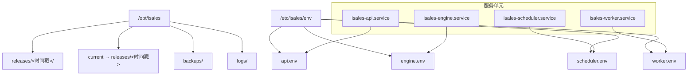
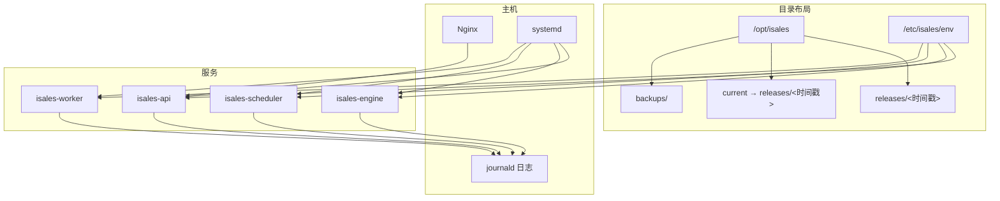
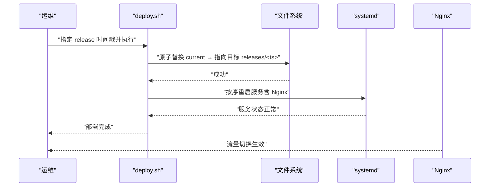
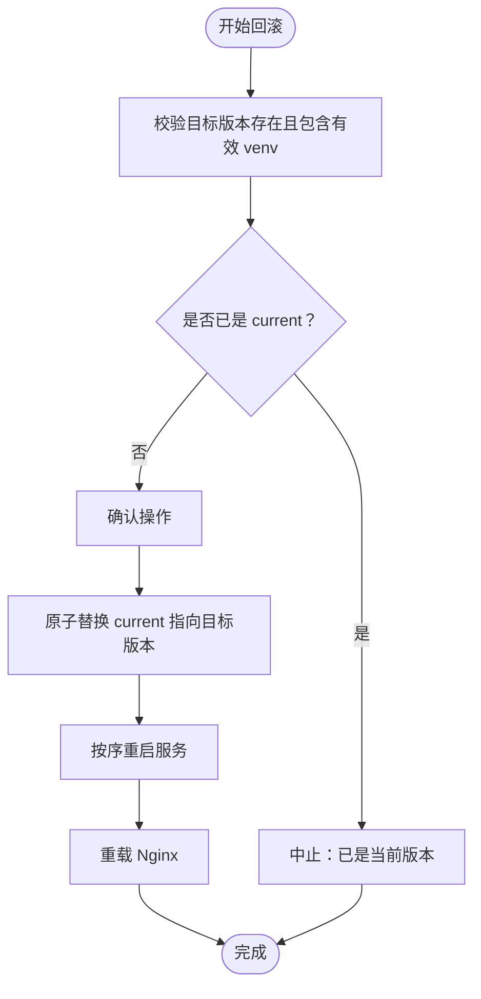
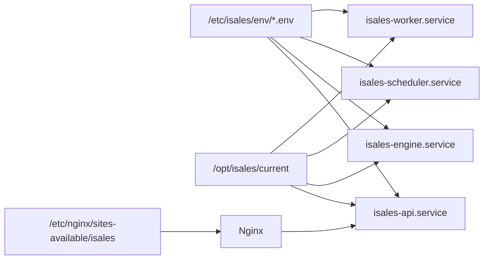

# 目录结构布局

<cite>
**本文引用的文件**
- [deploy/cloud/scripts/install.sh](file://deploy/cloud/scripts/install.sh)
- [deploy/linux/scripts/deploy.sh](file://deploy/linux/scripts/deploy.sh)
- [deploy/linux/scripts/rollback.sh](file://deploy/linux/scripts/rollback.sh)
- [deploy/cloud/systemd/isales-api.service](file://deploy/cloud/systemd/isales-api.service)
- [deploy/cloud/systemd/isales-engine.service](file://deploy/cloud/systemd/isales-engine.service)
- [deploy/cloud/systemd/isales-scheduler.service](file://deploy/cloud/systemd/isales-scheduler.service)
- [deploy/cloud/systemd/isales-worker.service](file://deploy/cloud/systemd/isales-worker.service)
- [deploy/cloud/nginx/isales.conf](file://deploy/cloud/nginx/isales.conf)
- [deploy/cron/isales-backup.cron](file://deploy/cron/isales-backup.cron)
- [deploy/cloud/env/README.md](file://deploy/cloud/env/README.md)
- [deploy/cloud/env/api.env.example](file://deploy/cloud/env/api.env.example)
- [deploy/cloud/env/SECRETS.md.example](file://deploy/cloud/env/SECRETS.md.example)
- [deploy/linux/scripts/_lib.sh](file://deploy/linux/scripts/_lib.sh)
- [deploy/macos/_lib.sh](file://deploy/macos/_lib.sh)
</cite>

## 目录
1. [简介](#简介)
2. [项目结构](#项目结构)
3. [核心组件](#核心组件)
4. [架构总览](#架构总览)
5. [详细组件分析](#详细组件分析)
6. [依赖关系分析](#依赖关系分析)
7. [性能与可靠性考量](#性能与可靠性考量)
8. [故障排查指南](#故障排查指南)
9. [结论](#结论)
10. [附录](#附录)

## 简介
本文件面向 iSales 的运维与开发读者，系统性阐述 /opt/isales 与 /etc/isales/env 的目录组织原则、符号链接与版本控制机制、原子切换流程、权限与安全策略、日志与备份管理、以及临时文件处理等。文档同时给出架构图与流程图，帮助快速理解并正确维护生产环境。

## 项目结构
iSales 的运行时目录采用“发布版本隔离 + 符号链接指向当前版本”的经典模式，配合集中式环境变量目录，形成可审计、可回滚、可并行构建的发布体系。

- /opt/isales
  - releases/<时间戳>/：按时间戳存放每次发布的完整代码与虚拟环境，便于并行保留与回滚。
  - current：指向当前生效的 releases/<时间戳>，通过原子替换实现零停机切换。
  - backups/：集中存放数据库与缓存的定时备份产物，按天归档并保留一定周期。
  - logs/：各服务的标准输出与错误日志（systemd/journald）统一收集于系统日志子系统，不在此目录下单独存放。
- /etc/isales/env：集中存放各服务的环境变量文件，由 systemd drop-in 挂载，确保一致性与最小权限。

图表来源
- [deploy/cloud/scripts/install.sh](file://deploy/cloud/scripts/install.sh)
- [deploy/linux/scripts/deploy.sh](file://deploy/linux/scripts/deploy.sh)
- [deploy/cloud/systemd/isales-api.service](file://deploy/cloud/systemd/isales-api.service)
- [deploy/cloud/systemd/isales-engine.service](file://deploy/cloud/systemd/isales-engine.service)
- [deploy/cloud/systemd/isales-scheduler.service](file://deploy/cloud/systemd/isales-scheduler.service)
- [deploy/cloud/systemd/isales-worker.service](file://deploy/cloud/systemd/isales-worker.service)

章节来源
- [deploy/cloud/scripts/install.sh](file://deploy/cloud/scripts/install.sh)
- [deploy/linux/scripts/deploy.sh](file://deploy/linux/scripts/deploy.sh)
- [deploy/linux/scripts/rollback.sh](file://deploy/linux/scripts/rollback.sh)
- [deploy/cloud/systemd/isales-api.service](file://deploy/cloud/systemd/isales-api.service)
- [deploy/cloud/systemd/isales-engine.service](file://deploy/cloud/systemd/isales-engine.service)
- [deploy/cloud/systemd/isales-scheduler.service](file://deploy/cloud/systemd/isales-scheduler.service)
- [deploy/cloud/systemd/isales-worker.service](file://deploy/cloud/systemd/isales-worker.service)
- [deploy/cloud/nginx/isales.conf](file://deploy/cloud/nginx/isales.conf)
- [deploy/cron/isales-backup.cron](file://deploy/cron/isales-backup.cron)
- [deploy/cloud/env/README.md](file://deploy/cloud/env/README.md)

## 核心组件
- 发布与版本控制
  - 每次安装生成以秒级时间戳命名的 releases/<时间戳>/ 目录，包含完整代码与共享虚拟环境，避免覆盖风险。
  - 通过原子符号链接替换 current 指向，实现“零停机”切换。
- 环境变量集中化
  - /etc/isales/env 下按服务拆分 .env 文件，由 systemd drop-in 的 EnvironmentFile 引入，确保一致性与最小权限。
- 日志与备份
  - 日志通过 journald 收集，不落地到 /opt/isales/logs；数据库与缓存备份落地到 /opt/isales/backups 并由计划任务定期执行。
- 安全与权限
  - 服务以非特权用户运行，systemd 严格保护内核接口与地址族；环境变量文件采用最小权限（属主 root:isales，0640）。

章节来源
- [deploy/cloud/scripts/install.sh](file://deploy/cloud/scripts/install.sh)
- [deploy/linux/scripts/deploy.sh](file://deploy/linux/scripts/deploy.sh)
- [deploy/cron/isales-backup.cron](file://deploy/cron/isales-backup.cron)
- [deploy/cloud/env/README.md](file://deploy/cloud/env/README.md)

## 架构总览
下图展示 iSales 的目录布局与服务启动链路：systemd 读取 /etc/isales/env 下的环境变量，进程从 /opt/isales/current 中加载代码与虚拟环境；Nginx 将请求转发至 isales-api，并将静态资源指向 /opt/isales/current 下的前端构建目录。

图表来源
- [deploy/cloud/systemd/isales-api.service](file://deploy/cloud/systemd/isales-api.service)
- [deploy/cloud/systemd/isales-engine.service](file://deploy/cloud/systemd/isales-engine.service)
- [deploy/cloud/systemd/isales-scheduler.service](file://deploy/cloud/systemd/isales-scheduler.service)
- [deploy/cloud/systemd/isales-worker.service](file://deploy/cloud/systemd/isales-worker.service)
- [deploy/cloud/nginx/isales.conf](file://deploy/cloud/nginx/isales.conf)
- [deploy/cron/isales-backup.cron](file://deploy/cron/isales-backup.cron)

## 详细组件分析

### 目录组织与符号链接机制
- 目录职责
  - releases/<时间戳>/：存放完整发布物（代码 + venv），用于并行保留与回滚。
  - current：指向当前生效的发布目录，采用原子替换，避免部分写入导致的不一致。
  - backups/：数据库与缓存的归档备份，按天存放并保留若干周期。
  - logs/：不在此目录落地日志，统一由 journald 收集。
- 原子切换原理
  - 使用符号链接的原子替换（软链接目标变更）实现“瞬间切换”，无需移动大体积目录，降低停机窗口。
  - 切换前后均进行健康检查与服务重启顺序控制，确保依赖链稳定。

图表来源
- [deploy/linux/scripts/deploy.sh](file://deploy/linux/scripts/deploy.sh)

章节来源
- [deploy/linux/scripts/deploy.sh](file://deploy/linux/scripts/deploy.sh)
- [deploy/cloud/scripts/install.sh](file://deploy/cloud/scripts/install.sh)

### 版本控制与回滚策略
- 版本保留
  - 每次安装生成新的 releases/<时间戳>/，历史版本长期保留，便于回滚。
- 回滚流程
  - 通过 rollback.sh 指定目标时间戳，原子替换 current 指向旧版本，并按序重启服务。
  - 数据库迁移策略：默认不触碰数据库 schema，如需降级请参考运行手册中的“回滚 schema”章节。

图表来源
- [deploy/linux/scripts/rollback.sh](file://deploy/linux/scripts/rollback.sh)

章节来源
- [deploy/linux/scripts/rollback.sh](file://deploy/linux/scripts/rollback.sh)

### 环境变量与安全访问控制
- 集中式环境变量
  - /etc/isales/env 下按服务拆分 api.env、engine.env、scheduler.env、worker.env，由 systemd drop-in 的 EnvironmentFile 引入。
- 权限与所有权
  - 环境文件属主 root:isales，权限 0640，限制读取范围。
  - systemd 服务以非特权用户运行，启用多项内核与命名空间保护，限制地址族与实时特性，提升安全性。
- 敏感信息管理
  - 主密钥（Fernet）与 JWT 等敏感项通过离线备份与密码管理器双重保管，避免泄露造成全局不可恢复。

章节来源
- [deploy/cloud/systemd/isales-api.service](file://deploy/cloud/systemd/isales-api.service)
- [deploy/cloud/systemd/isales-engine.service](file://deploy/cloud/systemd/isales-engine.service)
- [deploy/cloud/systemd/isales-scheduler.service](file://deploy/cloud/systemd/isales-scheduler.service)
- [deploy/cloud/systemd/isales-worker.service](file://deploy/cloud/systemd/isales-worker.service)
- [deploy/cloud/env/README.md](file://deploy/cloud/env/README.md)
- [deploy/cloud/env/api.env.example](file://deploy/cloud/env/api.env.example)
- [deploy/cloud/env/SECRETS.md.example](file://deploy/cloud/env/SECRETS.md.example)

### 日志管理与备份存储
- 日志
  - 服务日志统一由 journald 收集，可通过 journalctl 查询与过滤，不落地到 /opt/isales/logs，避免磁盘膨胀与权限复杂化。
- 备份
  - 计划任务每日 02:30 执行数据库与缓存备份，输出到 /opt/isales/backups/，保留若干周期。
  - 备份脚本位于 /opt/isales/current/deploy/scripts/，随发布物同步更新。

章节来源
- [deploy/cron/isales-backup.cron](file://deploy/cron/isales-backup.cron)
- [deploy/cloud/scripts/install.sh](file://deploy/cloud/scripts/install.sh)

### 临时文件与构建产物
- 构建产物
  - 前端构建产物位于 /opt/isales/current/isales-web/dist，Nginx 通过符号链接指向该目录，实现静态资源的原子切换。
- 临时文件
  - 构建与安装过程产生的临时文件由脚本负责清理或在失败时自动回滚删除，避免残留污染。

章节来源
- [deploy/cloud/scripts/install.sh](file://deploy/cloud/scripts/install.sh)
- [deploy/cloud/nginx/isales.conf](file://deploy/cloud/nginx/isales.conf)

## 依赖关系分析
- systemd 服务依赖 /etc/isales/env 的环境变量文件。
- 服务进程从 /opt/isales/current 加载代码与虚拟环境。
- Nginx 作为反向代理，将 /api 请求转发至 isales-api，并将静态资源指向 /opt/isales/current 下的前端构建目录。
- 备份任务依赖 /opt/isales/current/deploy/scripts/下的备份脚本。

图表来源
- [deploy/cloud/systemd/isales-api.service](file://deploy/cloud/systemd/isales-api.service)
- [deploy/cloud/systemd/isales-engine.service](file://deploy/cloud/systemd/isales-engine.service)
- [deploy/cloud/systemd/isales-scheduler.service](file://deploy/cloud/systemd/isales-scheduler.service)
- [deploy/cloud/systemd/isales-worker.service](file://deploy/cloud/systemd/isales-worker.service)
- [deploy/cloud/nginx/isales.conf](file://deploy/cloud/nginx/isales.conf)

章节来源
- [deploy/cloud/systemd/isales-api.service](file://deploy/cloud/systemd/isales-api.service)
- [deploy/cloud/systemd/isales-engine.service](file://deploy/cloud/systemd/isales-engine.service)
- [deploy/cloud/systemd/isales-scheduler.service](file://deploy/cloud/systemd/isales-scheduler.service)
- [deploy/cloud/systemd/isales-worker.service](file://deploy/cloud/systemd/isales-worker.service)
- [deploy/cloud/nginx/isales.conf](file://deploy/cloud/nginx/isales.conf)

## 性能与可靠性考量
- 零停机切换
  - 原子符号链接替换 current，避免长时间锁目录或复制大文件，显著缩短切换窗口。
- 服务重启顺序
  - 按依赖顺序重启，先低层服务（调度、工作流），后上层服务（引擎、API），最后重载 Nginx，减少抖动。
- 低峰窗口
  - 部署脚本内置低峰窗口检查，避免在业务高峰期重启引擎导致通话中断。
- 备份策略
  - 按天归档数据库与缓存备份，保留若干周期，兼顾恢复点目标与存储成本。

章节来源
- [deploy/linux/scripts/deploy.sh](file://deploy/linux/scripts/deploy.sh)
- [deploy/cron/isales-backup.cron](file://deploy/cron/isales-backup.cron)

## 故障排查指南
- 部署后服务未启动
  - 检查 systemd 单元状态与最近日志，确认 EnvironmentFile 路径与权限正确。
  - 参考服务单元文件中的 ExecStart 与 WorkingDirectory，确认 /opt/isales/current 指向正确。
- Nginx 返回 502 或静态资源 404
  - 检查 /etc/nginx/sites-enabled/isales 是否指向 sites-available/isales。
  - 确认 /var/www/isales-web 指向 /opt/isales/current/isales-web/dist。
- 回滚后功能异常
  - 确认 current 已指向目标版本，且各服务均已重启。
  - 如涉及数据库 schema 变更，请参考运行手册中的“回滚 schema”章节。
- 日志查询
  - 使用 journalctl 查询特定服务日志，结合 syslog 标签定位备份任务日志。

章节来源
- [deploy/linux/scripts/deploy.sh](file://deploy/linux/scripts/deploy.sh)
- [deploy/linux/scripts/rollback.sh](file://deploy/linux/scripts/rollback.sh)
- [deploy/cloud/systemd/isales-api.service](file://deploy/cloud/systemd/isales-api.service)
- [deploy/cloud/systemd/isales-engine.service](file://deploy/cloud/systemd/isales-engine.service)
- [deploy/cloud/systemd/isales-scheduler.service](file://deploy/cloud/systemd/isales-scheduler.service)
- [deploy/cloud/systemd/isales-worker.service](file://deploy/cloud/systemd/isales-worker.service)
- [deploy/cron/isales-backup.cron](file://deploy/cron/isales-backup.cron)

## 结论
通过“releases 隔离 + current 原子切换 + 集中式环境变量 + systemd 安全加固 + 计划任务备份”的组合，iSales 实现了高可靠、可审计、可回滚的生产级部署与运维。遵循本文的目录组织原则与最佳实践，可在保证安全性的同时，最大化缩短发布窗口并降低变更风险。

## 附录
- 目录与文件清单
  - /opt/isales/releases/<时间戳>/
  - /opt/isales/current
  - /opt/isales/backups/
  - /opt/isales/logs/（日志由 journald 统一收集）
  - /etc/isales/env/api.env
  - /etc/isales/env/engine.env
  - /etc/isales/env/scheduler.env
  - /etc/isales/env/worker.env
- 关键脚本与配置
  - 安装与激活：install.sh
  - 发布切换：deploy.sh
  - 回滚：rollback.sh
  - 备份计划：/etc/cron.d/isales-backup
  - Nginx 配置：/etc/nginx/sites-available/isales
  - 环境变量说明：/etc/isales/env/README.md

章节来源
- [deploy/cloud/scripts/install.sh](file://deploy/cloud/scripts/install.sh)
- [deploy/linux/scripts/deploy.sh](file://deploy/linux/scripts/deploy.sh)
- [deploy/linux/scripts/rollback.sh](file://deploy/linux/scripts/rollback.sh)
- [deploy/cron/isales-backup.cron](file://deploy/cron/isales-backup.cron)
- [deploy/cloud/nginx/isales.conf](file://deploy/cloud/nginx/isales.conf)
- [deploy/cloud/env/README.md](file://deploy/cloud/env/README.md)