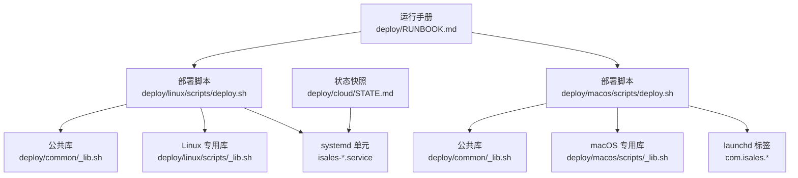
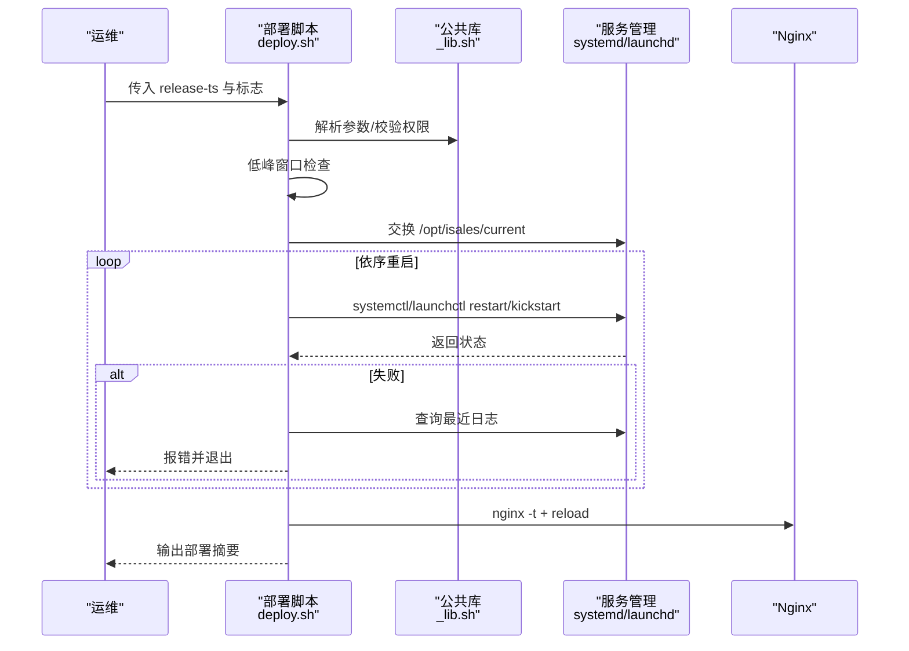
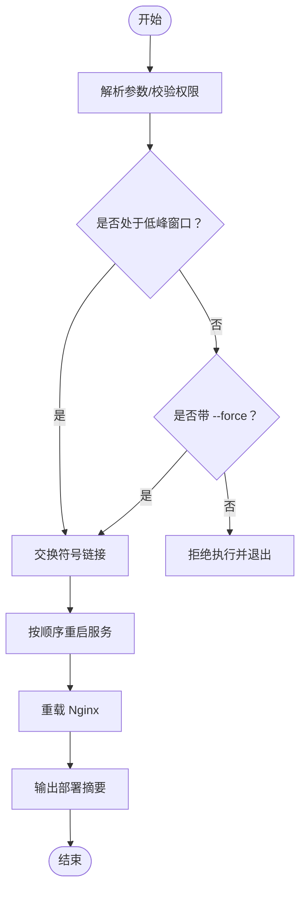
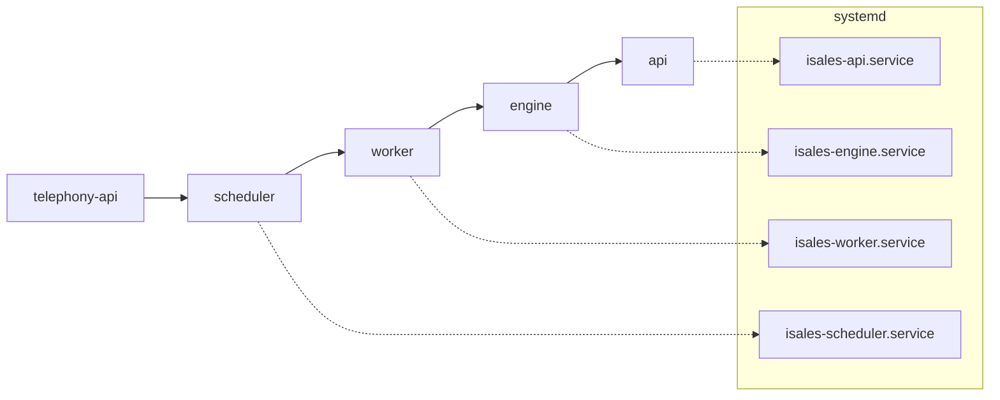
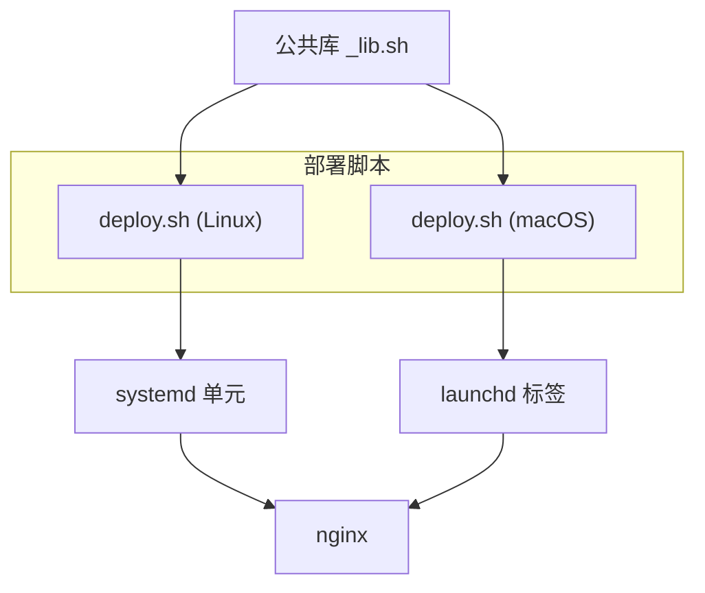

# 部署切换脚本 (deploy.sh)

<cite>
**本文档引用的文件**
- [deploy.sh (Linux)](file://deploy/linux/scripts/deploy.sh)
- [deploy.sh (macOS)](file://deploy/macos/scripts/deploy.sh)
- [_lib.sh (Linux)](file://deploy/linux/scripts/_lib.sh)
- [_lib.sh (公共)](file://deploy/common/_lib.sh)
- [rollback.sh (Linux)](file://deploy/linux/scripts/rollback.sh)
- [rollback.sh (macOS)](file://deploy/macos/scripts/rollback.sh)
- [isales-api.service](file://deploy/cloud/systemd/isales-api.service)
- [isales-engine.service](file://deploy/cloud/systemd/isales-engine.service)
- [isales-scheduler.service](file://deploy/cloud/systemd/isales-scheduler.service)
- [isales-worker.service](file://deploy/cloud/systemd/isales-worker.service)
- [RUNBOOK.md](file://deploy/RUNBOOK.md)
- [STATE.md](file://deploy/cloud/STATE.md)
- [install.sh (云)](file://deploy/cloud/scripts/install.sh)
- [rollback.sh (云)](file://deploy/cloud/scripts/rollback.sh)
</cite>

## 目录
1. [简介](#简介)
2. [项目结构](#项目结构)
3. [核心组件](#核心组件)
4. [架构总览](#架构总览)
5. [详细组件分析](#详细组件分析)
6. [依赖分析](#依赖分析)
7. [性能考虑](#性能考虑)
8. [故障排查指南](#故障排查指南)
9. [结论](#结论)
10. [附录](#附录)

## 简介
本文件面向 iSales 生产环境的部署切换脚本（deploy.sh），系统性阐述其原子性部署机制、服务重启顺序与依赖关系管理、部署前健康检查、部署过程状态监控、部署后验证流程，以及 systemd/macOS launchd 服务管理、启动依赖与优雅重启策略。同时覆盖部署失败的回滚机制、监控告警与故障恢复，并提供完整的部署命令序列、最佳实践与风险控制措施。

## 项目结构
- Linux 与 macOS 分平台实现：
  - Linux 使用 systemd 管理服务，路径为 deploy/linux/scripts/deploy.sh
  - macOS 使用 launchd 管理服务，路径为 deploy/macos/scripts/deploy.sh
- 公共库：
  - deploy/common/_lib.sh 提供日志、参数解析、运行包装、环境引导等通用能力
  - deploy/linux/scripts/_lib.sh 扩展 Linux 特定常量与提示
- 服务单元：
  - deploy/cloud/systemd/*.service 定义各服务的启动行为、超时与安全加固
- 运行手册与状态快照：
  - deploy/RUNBOOK.md 提供部署、回滚、故障处理与硬性门禁
  - deploy/cloud/STATE.md 记录当前生产状态与验证要点

图表来源
- [deploy.sh (Linux):1-139](file://deploy/linux/scripts/deploy.sh#L1-L139)
- [_lib.sh (公共):1-181](file://deploy/common/_lib.sh#L1-L181)
- [_lib.sh (Linux):1-47](file://deploy/linux/scripts/_lib.sh#L1-L47)
- [isales-api.service:1-35](file://deploy/cloud/systemd/isales-api.service#L1-L35)
- [isales-engine.service:1-42](file://deploy/cloud/systemd/isales-engine.service#L1-L42)
- [isales-scheduler.service:1-31](file://deploy/cloud/systemd/isales-scheduler.service#L1-L31)
- [isales-worker.service:1-31](file://deploy/cloud/systemd/isales-worker.service#L1-L31)
- [deploy.sh (macOS):1-201](file://deploy/macos/scripts/deploy.sh#L1-L201)
- [RUNBOOK.md:1-394](file://deploy/RUNBOOK.md#L1-L394)
- [STATE.md:1-817](file://deploy/cloud/STATE.md#L1-L817)

章节来源
- [deploy.sh (Linux):1-139](file://deploy/linux/scripts/deploy.sh#L1-L139)
- [deploy.sh (macOS):1-201](file://deploy/macos/scripts/deploy.sh#L1-L201)
- [_lib.sh (公共):1-181](file://deploy/common/_lib.sh#L1-L181)
- [_lib.sh (Linux):1-47](file://deploy/linux/scripts/_lib.sh#L1-L47)
- [isales-api.service:1-35](file://deploy/cloud/systemd/isales-api.service#L1-L35)
- [isales-engine.service:1-42](file://deploy/cloud/systemd/isales-engine.service#L1-L42)
- [isales-scheduler.service:1-31](file://deploy/cloud/systemd/isales-scheduler.service#L1-L31)
- [isales-worker.service:1-31](file://deploy/cloud/systemd/isales-worker.service#L1-L31)
- [RUNBOOK.md:1-394](file://deploy/RUNBOOK.md#L1-L394)
- [STATE.md:1-817](file://deploy/cloud/STATE.md#L1-L817)

## 核心组件
- 原子性切换
  - 通过交换 /opt/isales/current 符号链接实现零停机切换，确保服务始终指向最新就绪的发布版本
- 低峰窗口门禁
  - 默认 22:00–08:00 低峰窗口；若在非低峰窗口触发引擎重启，需显式 --force，否则拒绝执行
- 重启顺序与依赖
  - Linux/macOS 统一按 telephony-api → scheduler → worker → engine → api 的顺序重启
  - nginx 在 systemd 下使用 reload，在 macOS 下通过 brew services reload
- 健康检查与监控
  - 重启后立即检查服务活跃状态；失败时抓取最近 journal/统一日志并报错退出
  - 提供部署摘要输出，展示各服务状态与主进程 PID
- 回滚机制
  - rollback.sh 与 deploy.sh 相同的重启顺序；不触碰数据库 schema（需手动降级）
- 平台差异
  - Linux 使用 systemctl；macOS 使用 launchctl（含 kickstart、bootstrap、print 等）

章节来源
- [deploy.sh (Linux):10-16](file://deploy/linux/scripts/deploy.sh#L10-L16)
- [deploy.sh (Linux):51-68](file://deploy/linux/scripts/deploy.sh#L51-L68)
- [deploy.sh (Linux):70-114](file://deploy/linux/scripts/deploy.sh#L70-L114)
- [deploy.sh (Linux):116-136](file://deploy/linux/scripts/deploy.sh#L116-L136)
- [deploy.sh (macOS):17-25](file://deploy/macos/scripts/deploy.sh#L17-L25)
- [deploy.sh (macOS):60-78](file://deploy/macos/scripts/deploy.sh#L60-L78)
- [deploy.sh (macOS):79-171](file://deploy/macos/scripts/deploy.sh#L79-L171)
- [deploy.sh (macOS):173-198](file://deploy/macos/scripts/deploy.sh#L173-L198)
- [rollback.sh (Linux):78-114](file://deploy/linux/scripts/rollback.sh#L78-L114)
- [rollback.sh (macOS):84-129](file://deploy/macos/scripts/rollback.sh#L84-L129)

## 架构总览
下图展示部署切换的总体流程：参数解析、低峰校验、符号链接切换、服务有序重启、nginx 重载、汇总输出。

图表来源
- [deploy.sh (Linux):30-136](file://deploy/linux/scripts/deploy.sh#L30-L136)
- [_lib.sh (公共):52-103](file://deploy/common/_lib.sh#L52-L103)
- [deploy.sh (macOS):38-198](file://deploy/macos/scripts/deploy.sh#L38-L198)

章节来源
- [deploy.sh (Linux):30-136](file://deploy/linux/scripts/deploy.sh#L30-L136)
- [deploy.sh (macOS):38-198](file://deploy/macos/scripts/deploy.sh#L38-L198)
- [_lib.sh (公共):52-103](file://deploy/common/_lib.sh#L52-L103)

## 详细组件分析

### 原子性切换与低峰门禁
- 原子性切换
  - 使用 ln -sfn 将 current 指向新的 release 目录，避免文件复制带来的不一致
- 低峰门禁
  - 通过当前小时判断是否处于 LOW_PEAK_START 至 LOW_PEAK_END 时间窗
  - 非低峰且未带 --force 时拒绝执行，防止引擎重启导致进行中通话中断

图表来源
- [deploy.sh (Linux):26-68](file://deploy/linux/scripts/deploy.sh#L26-L68)
- [deploy.sh (Linux):70-114](file://deploy/linux/scripts/deploy.sh#L70-L114)
- [deploy.sh (Linux):116-136](file://deploy/linux/scripts/deploy.sh#L116-L136)
- [deploy.sh (macOS):34-78](file://deploy/macos/scripts/deploy.sh#L34-L78)
- [deploy.sh (macOS):79-171](file://deploy/macos/scripts/deploy.sh#L79-L171)
- [deploy.sh (macOS):173-198](file://deploy/macos/scripts/deploy.sh#L173-L198)

章节来源
- [deploy.sh (Linux):26-68](file://deploy/linux/scripts/deploy.sh#L26-L68)
- [deploy.sh (Linux):70-114](file://deploy/linux/scripts/deploy.sh#L70-L114)
- [deploy.sh (Linux):116-136](file://deploy/linux/scripts/deploy.sh#L116-L136)
- [deploy.sh (macOS):34-78](file://deploy/macos/scripts/deploy.sh#L34-L78)
- [deploy.sh (macOS):79-171](file://deploy/macos/scripts/deploy.sh#L79-L171)
- [deploy.sh (macOS):173-198](file://deploy/macos/scripts/deploy.sh#L173-L198)

### 服务重启顺序与依赖管理
- 重启顺序
  - Linux/macOS 统一：telephony-api → scheduler → worker → engine → api
- 依赖关系
  - engine 依赖 telephony-api（拨号/状态）、依赖 scheduler/worker（调度与后处理）
  - api 依赖 engine（实时通话能力）与 scheduler/worker（后台任务）
- systemd/macOS 启动策略
  - systemd 使用 Restart=on-failure 与 TimeoutStopSec 控制优雅停止
  - macOS 使用 launchctl kickstart 与 print 状态查询

图表来源
- [deploy.sh (Linux):82-88](file://deploy/linux/scripts/deploy.sh#L82-L88)
- [deploy.sh (Linux):90-104](file://deploy/linux/scripts/deploy.sh#L90-L104)
- [deploy.sh (macOS):92-98](file://deploy/macos/scripts/deploy.sh#L92-L98)
- [deploy.sh (macOS):119-143](file://deploy/macos/scripts/deploy.sh#L119-L143)
- [isales-api.service:1-35](file://deploy/cloud/systemd/isales-api.service#L1-L35)
- [isales-engine.service:1-42](file://deploy/cloud/systemd/isales-engine.service#L1-L42)
- [isales-scheduler.service:1-31](file://deploy/cloud/systemd/isales-scheduler.service#L1-L31)
- [isales-worker.service:1-31](file://deploy/cloud/systemd/isales-worker.service#L1-L31)

章节来源
- [deploy.sh (Linux):82-104](file://deploy/linux/scripts/deploy.sh#L82-L104)
- [deploy.sh (macOS):92-143](file://deploy/macos/scripts/deploy.sh#L92-L143)
- [isales-api.service:1-35](file://deploy/cloud/systemd/isales-api.service#L1-L35)
- [isales-engine.service:1-42](file://deploy/cloud/systemd/isales-engine.service#L1-L42)
- [isales-scheduler.service:1-31](file://deploy/cloud/systemd/isales-scheduler.service#L1-L31)
- [isales-worker.service:1-31](file://deploy/cloud/systemd/isales-worker.service#L1-L31)

### 部署前健康检查与部署后验证
- 部署前
  - 校验 release 目录存在且 venv 可执行
  - 低峰窗口门禁（Linux/macOS）
- 部署中
  - 逐个服务重启后立即检查活跃状态；失败则抓取最近日志并报错
- 部署后
  - 输出每个服务的状态与主进程 PID，便于快速核验

章节来源
- [deploy.sh (Linux):45-49](file://deploy/linux/scripts/deploy.sh#L45-L49)
- [deploy.sh (Linux):95-102](file://deploy/linux/scripts/deploy.sh#L95-L102)
- [deploy.sh (Linux):120-128](file://deploy/linux/scripts/deploy.sh#L120-L128)
- [deploy.sh (macOS):54-58](file://deploy/macos/scripts/deploy.sh#L54-L58)
- [deploy.sh (macOS):134-142](file://deploy/macos/scripts/deploy.sh#L134-L142)
- [deploy.sh (macOS):175-190](file://deploy/macos/scripts/deploy.sh#L175-L190)

### systemd 服务管理与优雅重启策略
- 关键字段
  - Type=simple、Restart=on-failure、RestartSec=5
  - engine 的 TimeoutStopSec=35，匹配应用优雅关闭超时
- 安全加固
  - NoNewPrivileges、ProtectSystem、PrivateTmp、RestrictAddressFamilies 等
- 重启策略
  - 通过 systemctl restart 触发；失败时抓取 journal 以定位问题

章节来源
- [isales-api.service:6-31](file://deploy/cloud/systemd/isales-api.service#L6-L31)
- [isales-engine.service:8-39](file://deploy/cloud/systemd/isales-engine.service#L8-L39)
- [isales-scheduler.service:6-27](file://deploy/cloud/systemd/isales-scheduler.service#L6-L27)
- [isales-worker.service:6-27](file://deploy/cloud/systemd/isales-worker.service#L6-L27)

### 回滚机制与故障恢复
- 回滚流程
  - 交换 current 指向历史版本，按相同顺序重启服务
  - Linux/macOS 对应 rollback.sh，均不触碰数据库 schema
- 故障恢复
  - 部署失败时可直接回滚至上一个稳定版本
  - 如需 schema 降级，参考 RUNBOOK 的 rollback-schema 手动执行

章节来源
- [rollback.sh (Linux):78-114](file://deploy/linux/scripts/rollback.sh#L78-L114)
- [rollback.sh (macOS):84-129](file://deploy/macos/scripts/rollback.sh#L84-L129)
- [RUNBOOK.md:84-115](file://deploy/RUNBOOK.md#L84-L115)

### 监控告警与验证清单
- 部署后验证
  - systemctl/status 输出各服务状态与 PID
  - journalctl 查看最近错误日志
- 硬性门禁（上线前必须满足）
  - 备份恢复演练通过
  - 至少一次完整的 install → deploy → rollback → deploy 流程
  - 监控联系人建立、关键告警目标设定
  - 冒烟测试：导入 10-lead 测试场景，确认 call_record/transcript/worker 回调日志/lead 状态推进

章节来源
- [RUNBOOK.md:200-217](file://deploy/RUNBOOK.md#L200-L217)
- [RUNBOOK.md:180-197](file://deploy/RUNBOOK.md#L180-L197)

## 依赖分析
- 组件耦合
  - 部署脚本依赖公共库提供的日志、参数解析与运行包装
  - 服务单元定义了明确的启动顺序与依赖（After/Wants）
- 外部依赖
  - systemd/launchd 服务管理器
  - nginx（systemd reload 或 brew services reload）
  - DingRTC SDK（云侧引擎绑定）

图表来源
- [deploy.sh (Linux):20-22](file://deploy/linux/scripts/deploy.sh#L20-L22)
- [deploy.sh (macOS):28-30](file://deploy/macos/scripts/deploy.sh#L28-L30)
- [_lib.sh (公共):1-181](file://deploy/common/_lib.sh#L1-L181)
- [isales-api.service:1-35](file://deploy/cloud/systemd/isales-api.service#L1-L35)
- [isales-engine.service:1-42](file://deploy/cloud/systemd/isales-engine.service#L1-L42)
- [isales-scheduler.service:1-31](file://deploy/cloud/systemd/isales-scheduler.service#L1-L31)
- [isales-worker.service:1-31](file://deploy/cloud/systemd/isales-worker.service#L1-L31)

章节来源
- [deploy.sh (Linux):20-22](file://deploy/linux/scripts/deploy.sh#L20-L22)
- [deploy.sh (macOS):28-30](file://deploy/macos/scripts/deploy.sh#L28-L30)
- [_lib.sh (公共):1-181](file://deploy/common/_lib.sh#L1-L181)

## 性能考虑
- 低峰窗口
  - 避免引擎重启导致进行中通话中断，降低业务影响
- 重启顺序
  - 先后端、后前端，最后引擎，减少上游依赖缺失导致的失败重试
- 优雅停止
  - engine 的 TimeoutStopSec=35，配合应用优雅关闭逻辑，尽量减少数据丢失

章节来源
- [deploy.sh (Linux):10-16](file://deploy/linux/scripts/deploy.sh#L10-L16)
- [isales-engine.service:16-18](file://deploy/cloud/systemd/isales-engine.service#L16-L18)

## 故障排查指南
- 常见症状与步骤
  - API 登录失败：检查 /etc/isales/env/api.env 中 ISALES_ADMIN_PASSWORD_HASH 是否正确
  - JWT 校验失败：确认 api/engine 的 ISALES_JWT_SECRET 一致
  - nginx 502：curl 直连 127.0.0.1:8000/healthz，确认 api 服务状态
  - engine 队列堆积：检查 redis 队列长度与 engine 服务状态
  - 备份计划未运行：检查 cron 状态与日志标签 isales-backup
- 一键命令
  - 查看所有服务状态与 PID
  - 最近 5 分钟错误日志聚合
  - 活跃通话数与队列深度统计

章节来源
- [RUNBOOK.md:163-197](file://deploy/RUNBOOK.md#L163-L197)

## 结论
deploy.sh 通过符号链接原子切换与严格的服务重启顺序，实现了 iSales 的零停机部署。结合低峰窗口门禁、部署后验证与回滚机制，显著降低了变更风险。配合 systemd/macOS launchd 的安全加固与优雅停止策略，保障了生产环境的稳定性与可观测性。

## 附录

### 部署命令序列（Linux）
- 首次部署
  - provision → 编辑 /etc/isales/env/*.env → install.sh v<version> → migrate.sh → deploy.sh <release-ts> --force --include-modem
- 常规部署
  - install.sh v<new-version> → migrate.sh（可先 dry-run 预览）→ deploy.sh <new-release-ts> → 验证 journalctl 与 systemctl 输出
- 回滚
  - rollback.sh --list → rollback.sh <prior-release-ts>

章节来源
- [RUNBOOK.md:17-81](file://deploy/RUNBOOK.md#L17-L81)
- [RUNBOOK.md:84-95](file://deploy/RUNBOOK.md#L84-L95)

### 部署命令序列（macOS）
- 首次部署
  - provision → 编辑 /etc/isales/env/*.env → install.sh v<version> → migrate.sh → deploy.sh <release-ts> --force --include-modem
- 常规部署
  - install.sh v<new-version> → migrate.sh → deploy.sh <new-release-ts>
- 回滚
  - rollback.sh --list → rollback.sh <prior-release-ts>

章节来源
- [RUNBOOK.md:230-293](file://deploy/RUNBOOK.md#L230-L293)
- [RUNBOOK.md:295-311](file://deploy/RUNBOOK.md#L295-L311)

### 最佳实践与风险控制
- 风险控制
  - 优先在低峰窗口部署；非低峰必须经评审并带 --force
  - 部署前执行 DRY_RUN=migrate.sh 预览迁移
  - 部署后至少一次完整的 install → deploy → rollback → deploy 循环
- 最佳实践
  - 严格遵循 telephony-api → scheduler → worker → engine → api 的重启顺序
  - 部署后立即核验 systemctl 输出与最近日志
  - 保持备份恢复演练季度执行

章节来源
- [RUNBOOK.md:56-81](file://deploy/RUNBOOK.md#L56-L81)
- [RUNBOOK.md:200-217](file://deploy/RUNBOOK.md#L200-L217)