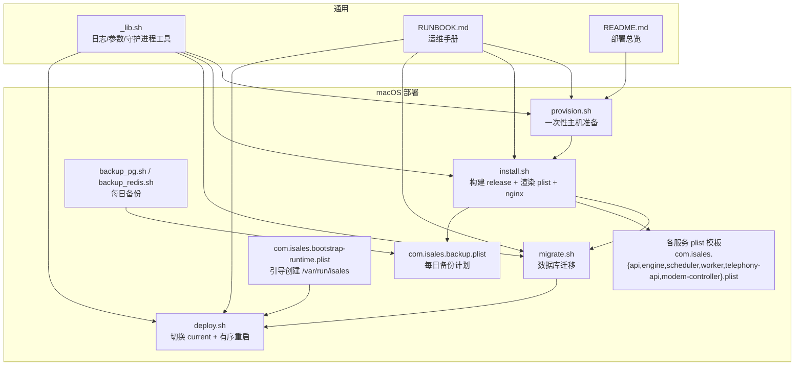
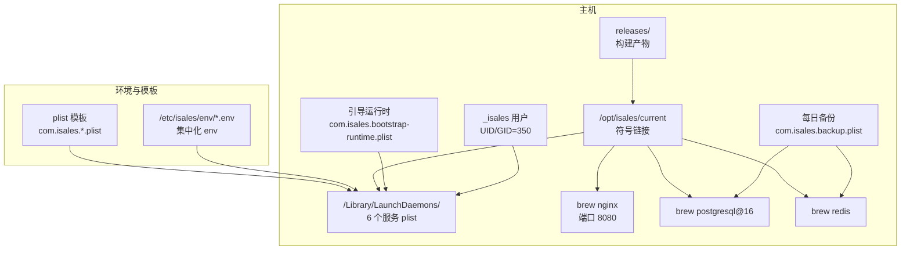
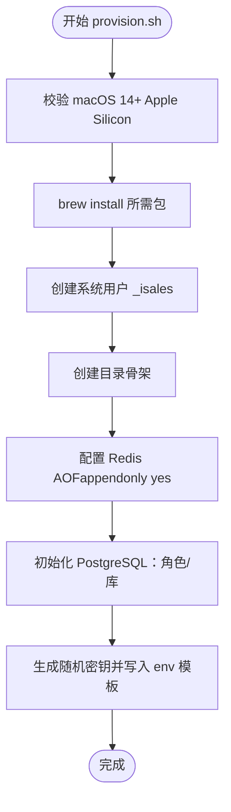
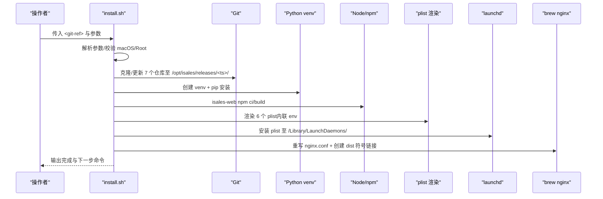
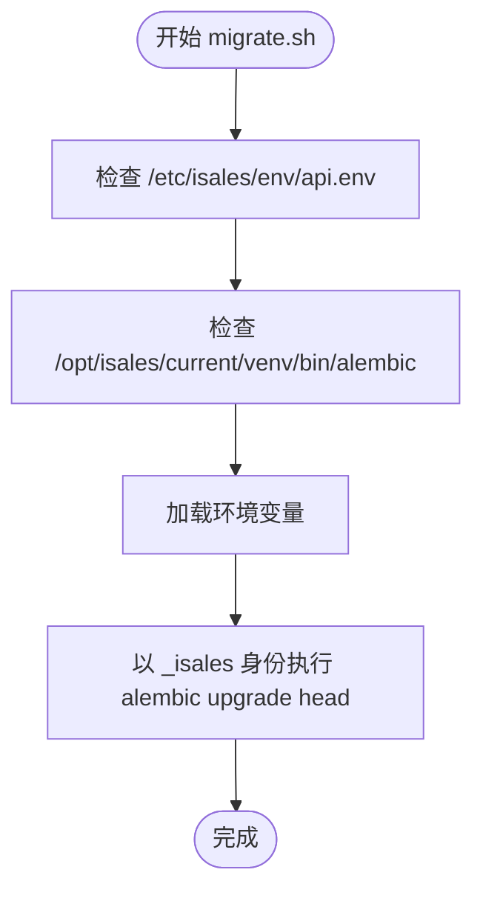
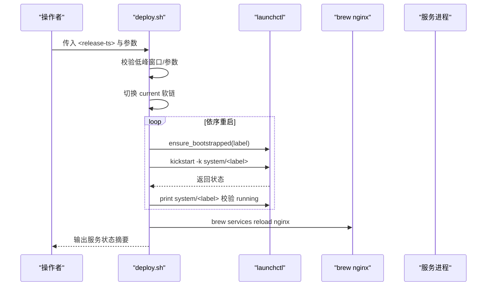
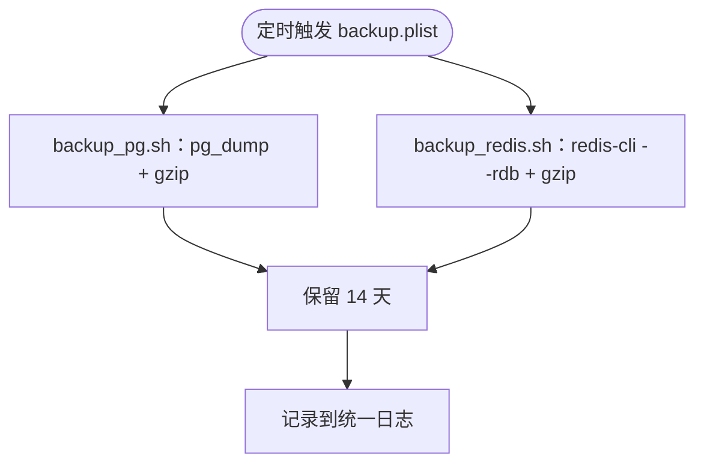
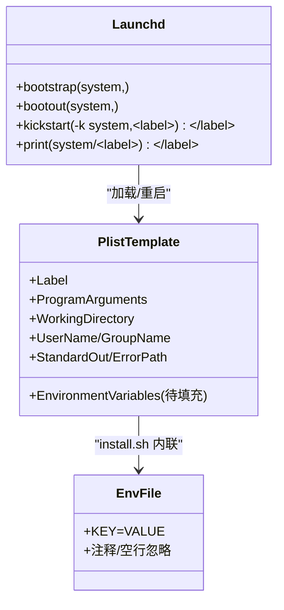
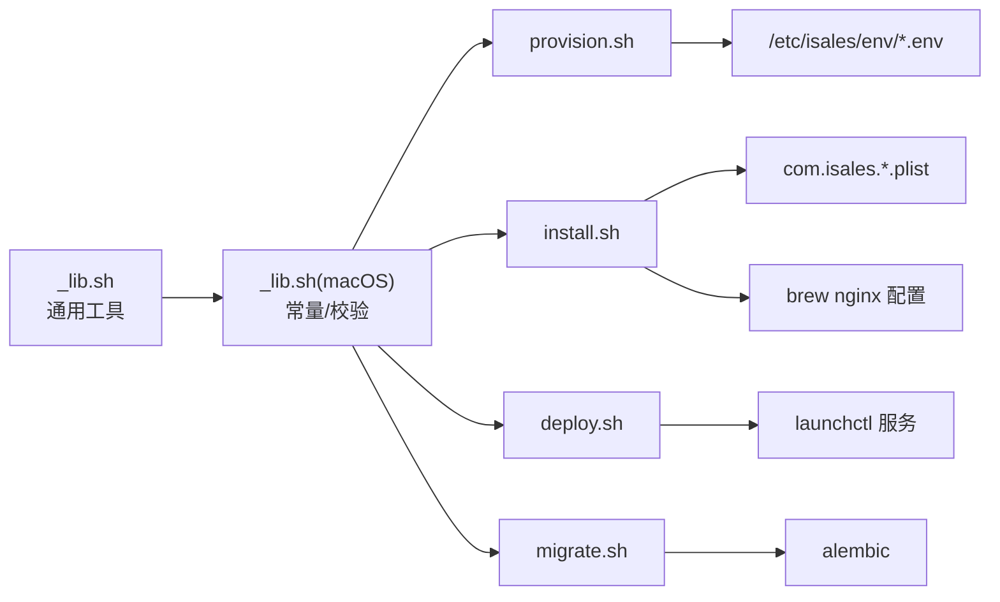

# macOS 部署

<cite>
**本文引用的文件**
- [deploy/macos/README.md](file://deploy/macos/README.md)
- [deploy/macos/scripts/_lib.sh](file://deploy/macos/scripts/_lib.sh)
- [deploy/macos/scripts/provision.sh](file://deploy/macos/scripts/provision.sh)
- [deploy/macos/scripts/install.sh](file://deploy/macos/scripts/install.sh)
- [deploy/macos/scripts/migrate.sh](file://deploy/macos/scripts/migrate.sh)
- [deploy/macos/scripts/deploy.sh](file://deploy/macos/scripts/deploy.sh)
- [deploy/macos/scripts/backup_pg.sh](file://deploy/macos/scripts/backup_pg.sh)
- [deploy/macos/scripts/backup_redis.sh](file://deploy/macos/scripts/backup_redis.sh)
- [deploy/macos/launchd-jobs/com.isales.backup.plist](file://deploy/macos/launchd-jobs/com.isales.backup.plist)
- [deploy/macos/launchd-jobs/com.isales.bootstrap-runtime.plist](file://deploy/macos/launchd-jobs/com.isales.bootstrap-runtime.plist)
- [deploy/macos/plist/com.isales.api.plist](file://deploy/macos/plist/com.isales.api.plist)
- [deploy/macos/plist/com.isales.engine.plist](file://deploy/macos/plist/com.isales.engine.plist)
- [deploy/env/api.env.example](file://deploy/env/api.env.example)
- [deploy/env/engine.env.example](file://deploy/env/engine.env.example)
- [deploy/common/_lib.sh](file://deploy/common/_lib.sh)
- [deploy/RUNBOOK.md](file://deploy/RUNBOOK.md)
- [deploy/README.md](file://deploy/README.md)
</cite>

## 目录
1. [简介](#简介)
2. [项目结构](#项目结构)
3. [核心组件](#核心组件)
4. [架构总览](#架构总览)
5. [详细组件分析](#详细组件分析)
6. [依赖关系分析](#依赖关系分析)
7. [性能考虑](#性能考虑)
8. [故障排查指南](#故障排查指南)
9. [结论](#结论)
10. [附录](#附录)

## 简介
本指南面向在 macOS 14+ Apple Silicon 主机上部署 iSales v1 的工程与运维人员。文档覆盖从主机准备、Homebrew 包管理、launchd 服务配置与系统服务管理，到与 Linux 部署的差异、macOS 特有的硬件支持与音频配置、plist 模板使用、服务启动/停止机制、目录结构与权限管理、备份策略、Python 与前端构建流程，以及完整的部署命令序列与故障排查方法。

## 项目结构
- macOS 部署相关脚本与模板位于 deploy/macos/scripts 与 deploy/macos/plist、deploy/macos/launchd-jobs。
- 通用跨平台工具函数位于 deploy/common/_lib.sh。
- 运维手册与对比清单位于 deploy/RUNBOOK.md 与 deploy/README.md。
- 环境变量模板位于 deploy/env/*.env.example。

图表来源
- [deploy/macos/scripts/provision.sh:1-280](file://deploy/macos/scripts/provision.sh#L1-L280)
- [deploy/macos/scripts/install.sh:1-417](file://deploy/macos/scripts/install.sh#L1-L417)
- [deploy/macos/scripts/migrate.sh:1-73](file://deploy/macos/scripts/migrate.sh#L1-L73)
- [deploy/macos/scripts/deploy.sh:1-201](file://deploy/macos/scripts/deploy.sh#L1-L201)
- [deploy/macos/scripts/backup_pg.sh:1-56](file://deploy/macos/scripts/backup_pg.sh#L1-L56)
- [deploy/macos/scripts/backup_redis.sh:1-66](file://deploy/macos/scripts/backup_redis.sh#L1-L66)
- [deploy/macos/launchd-jobs/com.isales.backup.plist:1-42](file://deploy/macos/launchd-jobs/com.isales.backup.plist#L1-L42)
- [deploy/macos/launchd-jobs/com.isales.bootstrap-runtime.plist:1-39](file://deploy/macos/launchd-jobs/com.isales.bootstrap-runtime.plist#L1-L39)
- [deploy/macos/plist/com.isales.api.plist:1-37](file://deploy/macos/plist/com.isales.api.plist#L1-L37)
- [deploy/macos/plist/com.isales.engine.plist:1-37](file://deploy/macos/plist/com.isales.engine.plist#L1-L37)
- [deploy/common/_lib.sh:1-181](file://deploy/common/_lib.sh#L1-L181)
- [deploy/RUNBOOK.md:1-394](file://deploy/RUNBOOK.md#L1-L394)
- [deploy/README.md:1-112](file://deploy/README.md#L1-L112)

章节来源
- [deploy/macos/README.md:1-98](file://deploy/macos/README.md#L1-L98)
- [deploy/README.md:1-112](file://deploy/README.md#L1-L112)

## 核心组件
- 主机准备与依赖
  - Homebrew Apple Silicon 路径与软件包列表、系统用户 _isales、目录骨架、Redis AOF、PostgreSQL 初始化与随机密钥注入。
- 发布构建与安装
  - 克隆/更新 7 个仓库、创建共享 venv、构建 isales-web、渲染 6 个 launchd plist（将 /etc/isales/env/<svc>.env 内联进 EnvironmentVariables）、安装每日备份 plist、同步 nginx 配置。
- 数据库迁移
  - 从 /etc/isales/env/api.env 读取数据库连接，以 _isales 身份执行 alembic upgrade head。
- 部署与重启
  - 切换 current 软链，按依赖顺序重启服务，必要时重启 nginx（brew services reload），可选重启 modem-controller。
- 备份与恢复
  - 每日备份 PostgreSQL（pg_dump + gzip）与 Redis（redis-cli --rdb + gzip），保留 14 天；提供恢复演练与手动触发方式。
- 运维与排障
  - 与 Linux 的差异对照、常用命令、故障排查清单、预上线门禁。

章节来源
- [deploy/macos/scripts/provision.sh:1-280](file://deploy/macos/scripts/provision.sh#L1-L280)
- [deploy/macos/scripts/install.sh:1-417](file://deploy/macos/scripts/install.sh#L1-L417)
- [deploy/macos/scripts/migrate.sh:1-73](file://deploy/macos/scripts/migrate.sh#L1-L73)
- [deploy/macos/scripts/deploy.sh:1-201](file://deploy/macos/scripts/deploy.sh#L1-L201)
- [deploy/macos/scripts/backup_pg.sh:1-56](file://deploy/macos/scripts/backup_pg.sh#L1-L56)
- [deploy/macos/scripts/backup_redis.sh:1-66](file://deploy/macos/scripts/backup_redis.sh#L1-L66)
- [deploy/RUNBOOK.md:220-394](file://deploy/RUNBOOK.md#L220-L394)

## 架构总览
下图展示 macOS 单主机部署的总体架构与关键交互：launchd 管理 6 个服务进程，Homebrew 提供 PostgreSQL、Redis、nginx，_isales 用户运行服务，/opt/isales/current 指向最新发布版本，备份由 launchd 计划任务触发。

图表来源
- [deploy/macos/README.md:7-32](file://deploy/macos/README.md#L7-L32)
- [deploy/macos/scripts/install.sh:188-320](file://deploy/macos/scripts/install.sh#L188-L320)
- [deploy/macos/launchd-jobs/com.isales.backup.plist:1-42](file://deploy/macos/launchd-jobs/com.isales.backup.plist#L1-L42)
- [deploy/macos/launchd-jobs/com.isales.bootstrap-runtime.plist:1-39](file://deploy/macos/launchd-jobs/com.isales.bootstrap-runtime.plist#L1-L39)

## 详细组件分析

### 主机准备与依赖（provision.sh）
- 功能要点
  - Homebrew 包安装（postgresql@16、redis、nginx、python@3.12、node@20、pkg-config、git），要求通过 sudo 以普通用户身份调用 brew。
  - 创建系统用户 _isales（UID/GID 350，隐藏用户），组 _isales。
  - 创建目录骨架：/opt/isales/{releases,current,backups/{pg,redis},logs}、/etc/isales/env、/var/run/isales。
  - Redis AOF 配置（appendonly yes + appendfsync everysec），Live CONFIG SET 无需重启。
  - PostgreSQL 初始化：启动服务、创建角色 isales、创建数据库 isales，生成随机密码/JWT/Fernet，并为 6 个服务生成初始 env 文件。
- 权限与安全
  - /etc/isales/env/*.env 0640 root:isales，避免直接写入敏感信息。
  - Redis 与 PG 初始化幂等，重复执行打印“已存在，跳过”。

图表来源
- [deploy/macos/scripts/provision.sh:48-280](file://deploy/macos/scripts/provision.sh#L48-L280)
- [deploy/macos/scripts/_lib.sh:17-68](file://deploy/macos/scripts/_lib.sh#L17-L68)

章节来源
- [deploy/macos/scripts/provision.sh:1-280](file://deploy/macos/scripts/provision.sh#L1-L280)
- [deploy/macos/scripts/_lib.sh:1-69](file://deploy/macos/scripts/_lib.sh#L1-L69)

### 发布构建与安装（install.sh）
- 功能要点
  - 解析参数：git-ref、--skip-clone、--release-dir、--dry-run/--force。
  - 步骤：
    1) 准备 release 目录并同步 meta-repo 的 deploy/ 子树。
    2) 克隆/更新 7 个仓库到 release 目录。
    3) 使用 /opt/homebrew/opt/python@3.12 创建共享 venv，pip 安装 isales-common 与 5 个服务（isales-telephony 安装 [macos] extras）。
    4) 在 isales-web 下执行 npm ci 与 npm run build。
    5) 渲染 6 个 launchd plist：将 /etc/isales/env/<svc>.env 解析为键值对内联到 <key>EnvironmentVariables</key>，安装到 /Library/LaunchDaemons/，并安装 com.isales.bootstrap-runtime.plist 与 com.isales.backup.plist。
    6) 重写 nginx 配置（端口 80→8080、docroot 路径替换），创建 dist 符号链接。
- 关键差异
  - launchd 无 EnvironmentFile=，因此通过 Python plistlib 将 env 内联写入 plist。
  - nginx 在 macOS 使用 8080（brew 默认 server 块），避免权限问题。
- 错误处理
  - 失败清理：异常退出时删除不完整 release 目录。
  - plutil 校验 plist 语法。
  - 为 /var/run/isales 提供引导作业，确保重启后服务 socket 可绑定。

图表来源
- [deploy/macos/scripts/install.sh:13-417](file://deploy/macos/scripts/install.sh#L13-L417)

章节来源
- [deploy/macos/scripts/install.sh:1-417](file://deploy/macos/scripts/install.sh#L1-L417)

### 数据库迁移（migrate.sh）
- 功能要点
  - 从 /etc/isales/env/api.env 读取 ISALES_DATABASE_URL，以 _isales 身份在当前 release 的 venv 中执行 alembic upgrade head。
  - 可选 --dry-run 预览迁移历史。
- 注意事项
  - 必须先完成 install.sh 与 provision.sh，否则会报错。

图表来源
- [deploy/macos/scripts/migrate.sh:1-73](file://deploy/macos/scripts/migrate.sh#L1-L73)

章节来源
- [deploy/macos/scripts/migrate.sh:1-73](file://deploy/macos/scripts/migrate.sh#L1-L73)

### 部署与服务重启（deploy.sh）
- 功能要点
  - 低峰窗口保护：默认 22:00–08:00，若当前时间不在窗口且未传入 --force，则拒绝 engine 重启（engine 重启会中断通话）。
  - 切换 current 软链，按顺序重启服务：telephony-api → scheduler → worker → engine → api。
  - nginx 通过 brew services reload（以 $SUDO_USER 身份）重启。
  - 可选重启 modem-controller（硬件耦合）。
  - 服务状态验证：通过 launchctl print system/<label> 检查 state/pid，失败时输出最近 5 分钟统一日志。
- 低峰窗口控制
  - 可通过 ISALES_LOW_PEAK_START/ISALES_LOW_PEAK_END 覆盖默认窗口。

图表来源
- [deploy/macos/scripts/deploy.sh:17-198](file://deploy/macos/scripts/deploy.sh#L17-L198)

章节来源
- [deploy/macos/scripts/deploy.sh:1-201](file://deploy/macos/scripts/deploy.sh#L1-L201)

### 备份与恢复（backup_pg.sh / backup_redis.sh）
- 功能要点
  - 每日 02:30 由 com.isales.backup.plist 触发，备份 PG 与 Redis，输出到 /opt/isales/backups/{pg,redis}/YYYY-MM-DD.{sql.gz,rdb.gz}，保留 14 天。
  - PG：使用 pg_dump（自定义格式）+ gzip。
  - Redis：使用 redis-cli --rdb 导出 + gzip。
  - 失败通过 logger 输出到统一日志，便于排查。
- 恢复演练
  - PG：使用 pg_restore 恢复到测试库，验证 alembic 版本与表数量。
  - Redis：停止 brew redis，替换 dump.rdb，再启动。

图表来源
- [deploy/macos/launchd-jobs/com.isales.backup.plist:1-42](file://deploy/macos/launchd-jobs/com.isales.backup.plist#L1-L42)
- [deploy/macos/scripts/backup_pg.sh:1-56](file://deploy/macos/scripts/backup_pg.sh#L1-L56)
- [deploy/macos/scripts/backup_redis.sh:1-66](file://deploy/macos/scripts/backup_redis.sh#L1-L66)

章节来源
- [deploy/macos/scripts/backup_pg.sh:1-56](file://deploy/macos/scripts/backup_pg.sh#L1-L56)
- [deploy/macos/scripts/backup_redis.sh:1-66](file://deploy/macos/scripts/backup_redis.sh#L1-L66)
- [deploy/RUNBOOK.md:312-343](file://deploy/RUNBOOK.md#L312-L343)

### launchd 服务与 plist 模板
- 模板与内联 env
  - 6 个服务的 plist 模板位于 deploy/macos/plist/，install.sh 运行时将 /etc/isales/env/<svc>.env 解析为键值对，写入 <key>EnvironmentVariables</key>。
  - 模板注释明确：由 install.sh 管理，EnvironmentVariables 在每次安装时重写。
- 引导作业
  - com.isales.bootstrap-runtime.plist：开机重建 /var/run/isales，确保服务 socket 可绑定。
  - com.isales.backup.plist：每日 02:30 执行备份脚本，标准输出/错误捕获用于诊断。
- 服务启动/停止
  - 安装后通过 launchctl bootstrap/launchctl bootout 加载/卸载；重启使用 launchctl kickstart -k system/<label>。

图表来源
- [deploy/macos/plist/com.isales.api.plist:1-37](file://deploy/macos/plist/com.isales.api.plist#L1-L37)
- [deploy/macos/plist/com.isales.engine.plist:1-37](file://deploy/macos/plist/com.isales.engine.plist#L1-L37)
- [deploy/macos/scripts/install.sh:204-320](file://deploy/macos/scripts/install.sh#L204-L320)
- [deploy/macos/launchd-jobs/com.isales.bootstrap-runtime.plist:1-39](file://deploy/macos/launchd-jobs/com.isales.bootstrap-runtime.plist#L1-L39)
- [deploy/macos/launchd-jobs/com.isales.backup.plist:1-42](file://deploy/macos/launchd-jobs/com.isales.backup.plist#L1-L42)

章节来源
- [deploy/macos/plist/com.isales.api.plist:1-37](file://deploy/macos/plist/com.isales.api.plist#L1-L37)
- [deploy/macos/plist/com.isales.engine.plist:1-37](file://deploy/macos/plist/com.isales.engine.plist#L1-L37)
- [deploy/macos/scripts/install.sh:188-320](file://deploy/macos/scripts/install.sh#L188-L320)
- [deploy/macos/launchd-jobs/com.isales.backup.plist:1-42](file://deploy/macos/launchd-jobs/com.isales.backup.plist#L1-L42)
- [deploy/macos/launchd-jobs/com.isales.bootstrap-runtime.plist:1-39](file://deploy/macos/launchd-jobs/com.isales.bootstrap-runtime.plist#L1-L39)

### 与 Linux 部署的差异
- 服务管理
  - Linux：systemctl restart isales-*.service
  - macOS：launchctl kickstart -k system/com.isales.*
- 状态查询
  - Linux：systemctl is-active <svc>
  - macOS：launchctl print system/<label> 查看 state = running
- 日志查询
  - Linux：journalctl -u isales-*
  - macOS：log show --predicate 'subsystem == "com.isales.*"' --last 5m
- 环境注入
  - Linux：EnvironmentFile=/etc/isales/env/<svc>.env
  - macOS：install.sh 用 plistlib 内联到 <EnvironmentVariables>
- 包管理
  - Linux：apt-get install
  - macOS：brew install（必须以非 root 身份；脚本通过 sudo -u "$SUDO_USER" 反向）
- nginx
  - Linux：nginx -t && systemctl reload nginx
  - macOS：nginx -t && brew services reload nginx
- 备份触发
  - Linux：cron（/etc/cron.d/isales-backup）
  - macOS：launchd com.isales.backup（StartCalendarInterval 02:30）
- USB 监听与音频后端
  - Linux：pyudev（netlink）
  - macOS：pyserial.tools.list_ports 1 Hz 轮询 + diff；Core Audio（sounddevice/PortAudio）

章节来源
- [deploy/macos/README.md:71-84](file://deploy/macos/README.md#L71-L84)
- [deploy/RUNBOOK.md:345-381](file://deploy/RUNBOOK.md#L345-L381)

### macOS 特有的硬件支持与音频配置
- USB 监听
  - 采用 pyserial.tools.list_ports 1 Hz 轮询 + 差分检测，适配 macOS 的 USB 设备枚举模型。
- 音频后端
  - 使用 Core Audio（sounddevice/PortAudio），可通过 ISALES_AUDIO_DEVICE_NAME 在 modem-controller.env 中指定设备名称以消除歧义。
- 实用命令
  - 查询音频设备：在 venv 中执行 python3 -c 'import sounddevice as sd; print(sd.query_devices())'
  - 排查串口占用：lsof /dev/cu.usbmodem*

章节来源
- [deploy/RUNBOOK.md:345-381](file://deploy/RUNBOOK.md#L345-L381)

### 目录结构、权限管理与备份策略
- 目录结构（与 Linux 一致）
  - /opt/isales/{releases,current,backups/{pg,redis},logs}
  - /etc/isales/env/{api,engine,scheduler,worker,telephony-api,modem-controller}.env
  - /var/run/isales
- 权限管理
  - 系统用户 _isales（UID/GID 350，隐藏），服务以该用户运行。
  - /etc/isales/env/*.env 0640 root:isales，避免直接写入敏感信息。
- 备份策略
  - PG：pg_dump（自定义格式）+ gzip，保留 14 天。
  - Redis：redis-cli --rdb + gzip，保留 14 天。
  - 触发方式：com.isales.backup.plist（每日 02:30）。

章节来源
- [deploy/macos/README.md:26-31](file://deploy/macos/README.md#L26-L31)
- [deploy/macos/scripts/provision.sh:133-144](file://deploy/macos/scripts/provision.sh#L133-L144)
- [deploy/macos/scripts/backup_pg.sh:11-12](file://deploy/macos/scripts/backup_pg.sh#L11-L12)
- [deploy/macos/scripts/backup_redis.sh:9-10](file://deploy/macos/scripts/backup_redis.sh#L9-L10)

### Homebrew 依赖安装、Python 环境与前端构建
- Homebrew 依赖
  - postgresql@16、redis、nginx、python@3.12、node@20、pkg-config、git。
- Python 环境
  - 使用 /opt/homebrew/opt/python@3.12 创建共享 venv，pip 安装 isales-common 与 5 个服务。
- 前端构建
  - 在 isales-web 目录执行 npm ci 与 npm run build，产物 dist/ 同步到 brew nginx 文档根目录。

章节来源
- [deploy/macos/scripts/_lib.sh:23-35](file://deploy/macos/scripts/_lib.sh#L23-L35)
- [deploy/macos/scripts/install.sh:157-186](file://deploy/macos/scripts/install.sh#L157-L186)

## 依赖关系分析
- 跨平台工具
  - deploy/common/_lib.sh 提供日志、参数解析、守护进程工具、随机密钥生成、env 文件模板渲染等通用能力。
- macOS 专用常量与校验
  - BREW_PREFIX、MACOS_BREW_PACKAGES、ISALES_USER/_GROUP、UID/GID、require_macos 等。
- 服务与模板
  - install.sh 依赖 plist 模板与 env 文件，渲染后写入 /Library/LaunchDaemons/。
- 运维手册
  - RUNBOOK.md 提供 Linux/macOS 对照的命令序列、故障排查与预上线门禁。

图表来源
- [deploy/common/_lib.sh:1-181](file://deploy/common/_lib.sh#L1-L181)
- [deploy/macos/scripts/_lib.sh:1-69](file://deploy/macos/scripts/_lib.sh#L1-L69)
- [deploy/macos/scripts/provision.sh:1-280](file://deploy/macos/scripts/provision.sh#L1-L280)
- [deploy/macos/scripts/install.sh:1-417](file://deploy/macos/scripts/install.sh#L1-L417)
- [deploy/macos/scripts/deploy.sh:1-201](file://deploy/macos/scripts/deploy.sh#L1-L201)
- [deploy/macos/scripts/migrate.sh:1-73](file://deploy/macos/scripts/migrate.sh#L1-L73)

章节来源
- [deploy/common/_lib.sh:1-181](file://deploy/common/_lib.sh#L1-L181)
- [deploy/macos/scripts/_lib.sh:1-69](file://deploy/macos/scripts/_lib.sh#L1-L69)

## 性能考虑
- 低峰窗口部署
  - deploy.sh 默认 22:00–08:00 为低峰，engine 重启会丢弃进行中的通话，建议在此窗口部署或使用 --force。
- nginx 与端口
  - macOS brew nginx 默认监听 8080，避免权限问题；如需 80 需 root 权限或修改策略。
- Redis AOF
  - appendfsync everysec 平衡持久性与性能。
- 音频延迟
  - macOS 端到端 Core Audio p95 延迟建议 ≤ 200 ms，使用真实回环设备测试。

章节来源
- [deploy/macos/scripts/deploy.sh:17-24](file://deploy/macos/scripts/deploy.sh#L17-L24)
- [deploy/macos/scripts/install.sh:345-358](file://deploy/macos/scripts/install.sh#L345-L358)
- [deploy/macos/scripts/provision.sh:168-190](file://deploy/macos/scripts/provision.sh#L168-L190)
- [deploy/RUNBOOK.md:383-391](file://deploy/RUNBOOK.md#L383-L391)

## 故障排查指南
- 常见症状与步骤
  - brew 服务（PG/Redis/nginx）异常：brew services list（以 $SUDO_USER）查看状态，brew services restart <svc>；检查 /opt/homebrew/var/log/<svc>.log。
  - launchd 服务异常：launchctl print system/com.isales.<svc> 查看 state；查看 /opt/isales/logs/<svc>.{out,err}.log；使用 log show --predicate 'subsystem == "com.isales.<svc>"' --last 5m。
  - USB 模块识别：ioreg -p IOUSB | grep -iE 'modem|Quectel|Huawei|SIMCom|ZTE'；system_profiler SPUSBDataType；确认 pyserial 轮询可用。
  - AT 串口被系统占用：lsof /dev/cu.usbmodem*；如被 usbmuxd/commcenter 占用，需记录并长期规避。
  - Core Audio 错误：在 venv 中执行音频设备查询；设置 ISALES_AUDIO_DEVICE_NAME 指定设备。
  - plist env 过期：编辑 /etc/isales/env/* 后需重新 install.sh，或单独 bootout/bootstrap 该 plist。
  - brew install 以 root 失败：始终通过 sudo 调用脚本，使 brew 以普通用户身份运行。
  - nginx bind 80 权限错误：macOS brew 默认 8080，或使用 sudo nginx。
- 一键命令
  - 查看所有服务状态：for svc in api engine scheduler worker telephony-api modem-controller; do ...; done
  - 最近 5 分钟错误日志：log show --predicate 'subsystem BEGINSWITH "com.isales."' --last 5m | grep -i error
  - brew 服务概览：sudo -u "$SUDO_USER" /opt/homebrew/bin/brew services list
  - 活跃通话数：/opt/homebrew/bin/redis-cli get isales:concurrency:active

章节来源
- [deploy/RUNBOOK.md:345-381](file://deploy/RUNBOOK.md#L345-L381)

## 结论
macOS 14+ Apple Silicon 的 iSales 部署以 Homebrew 为基础，通过 install.sh 将 env 内联到 launchd plist，结合 provision.sh 的幂等准备与 deploy.sh 的低峰重启策略，形成稳定可靠的单主机部署方案。与 Linux 的差异主要体现在服务管理、包管理、nginx 端口与 USB/音频后端。遵循本文档的命令序列与排障方法，可在门店/现场工作站场景中高效、安全地交付与维护系统。

## 附录
- 首次部署命令序列（macOS）
  - 1) 安装 Homebrew（如未装）
  - 2) 主机 provision：sudo bash deploy/macos/scripts/provision.sh
  - 3) 编辑集中化 env（填入真实 secret）
  - 4) 安装新 release：sudo bash deploy/macos/scripts/install.sh <版本号>
  - 5) 数据库迁移：sudo bash deploy/macos/scripts/migrate.sh
  - 6) 切 current 软链 + 有序重启：sudo bash deploy/macos/scripts/deploy.sh <release-ts> --force --include-modem
- 运维手册与对比
  - 详见 deploy/RUNBOOK.md（折叠节包含 macOS 对应命令与排障）

章节来源
- [deploy/macos/README.md:48-69](file://deploy/macos/README.md#L48-L69)
- [deploy/RUNBOOK.md:230-293](file://deploy/RUNBOOK.md#L230-L293)