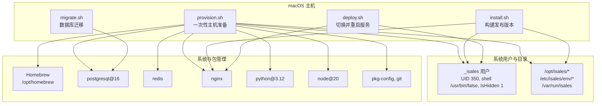
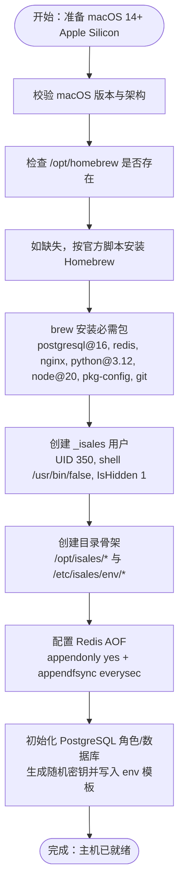
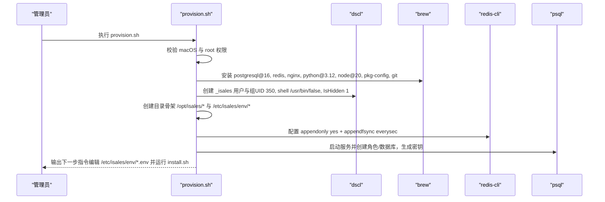
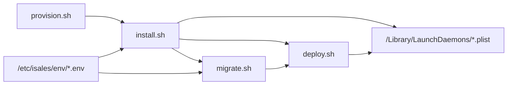

# 主机环境要求

<cite>
**本文引用的文件**
- [provision.sh](file://deploy/macos/scripts/provision.sh)
- [README.md（macOS 部署）](file://deploy/macos/README.md)
- [_lib.sh（macOS）](file://deploy/macos/scripts/_lib.sh)
- [_lib.sh（通用）](file://deploy/common/_lib.sh)
- [install.sh](file://deploy/macos/scripts/install.sh)
- [migrate.sh](file://deploy/macos/scripts/migrate.sh)
- [deploy.sh](file://deploy/macos/scripts/deploy.sh)
- [api.env.example](file://deploy/env/api.env.example)
- [engine.env.example](file://deploy/env/engine.env.example)
- [scheduler.env.example](file://deploy/env/scheduler.env.example)
- [worker.env.example](file://deploy/env/worker.env.example)
- [com.isales.api.plist](file://deploy/macos/plist/com.isales.api.plist)
- [com.isales.bootstrap-runtime.plist](file://deploy/macos/launchd-jobs/com.isales.bootstrap-runtime.plist)
- [README.md（根目录）](file://README.md)
</cite>

## 目录
1. [简介](#简介)
2. [项目结构](#项目结构)
3. [核心组件](#核心组件)
4. [架构总览](#架构总览)
5. [详细组件分析](#详细组件分析)
6. [依赖关系分析](#依赖关系分析)
7. [性能考虑](#性能考虑)
8. [故障排查指南](#故障排查指南)
9. [结论](#结论)
10. [附录](#附录)

## 简介
本文件面向在 macOS 14+ Sonoma（Apple Silicon）上部署 iSales 的运维与开发人员，系统性阐述主机环境要求与硬件限制、Homebrew 包管理器的安装与配置、系统用户与目录结构、以及 provision.sh 自动安装流程的步骤与要点。内容严格基于仓库中的脚本与文档，确保可执行、可验证、可复现。

## 项目结构
围绕 macOS 主机环境，以下文件与目录最为关键：
- macOS 专用部署脚本与常量：deploy/macos/scripts/_lib.sh、provision.sh、install.sh、migrate.sh、deploy.sh
- macOS 服务与运行时配置：deploy/macos/plist、deploy/macos/launchd-jobs
- 集中式环境变量模板：deploy/env/*.env.example
- macOS 部署说明与快速开始：deploy/macos/README.md
- 顶层部署与运行手册入口：README.md

图表来源
- [provision.sh:1-280](file://deploy/macos/scripts/provision.sh#L1-L280)
- [_lib.sh（macOS）:17-56](file://deploy/macos/scripts/_lib.sh#L17-L56)
- [install.sh:36-81](file://deploy/macos/scripts/install.sh#L36-L81)
- [migrate.sh:38-49](file://deploy/macos/scripts/migrate.sh#L38-L49)
- [deploy.sh:54-59](file://deploy/macos/scripts/deploy.sh#L54-L59)

章节来源
- [README.md（macOS 部署）:1-98](file://deploy/macos/README.md#L1-L98)
- [README.md（根目录）:39-44](file://README.md#L39-L44)

## 核心组件
- 系统要求与硬件限制
  - 操作系统：macOS 14+（Sonoma）及以上
  - 架构：Apple Silicon（arm64）
  - Homebrew：必须位于 /opt/homebrew（Apple Silicon 默认路径）
- 包管理与依赖
  - 必需系统包：postgresql@16、redis、nginx、python@3.12、node@20、pkg-config、git
- 系统用户与目录
  - 系统用户：_isales（UID 350，组 _isales，GID 350）
  - 特殊属性：UserShell 设为 /usr/bin/false，IsHidden 1
  - 目录布局：/opt/isales、/etc/isales/env、/var/run/isales，与 Linux 一致
- 自动化安装流程
  - provision.sh：Homebrew 包安装、系统用户创建、目录骨架、Redis AOF、PostgreSQL 初始化与 env 文件生成
  - install.sh：克隆/更新仓库、创建虚拟环境、构建前端、渲染并安装 launchd plist、同步 nginx 配置
  - migrate.sh：在当前版本上执行 Alembic 迁移
  - deploy.sh：原子切换 current、按序重启服务、可选重启 USB 调制解调器控制器

章节来源
- [README.md（macOS 部署）:34-47](file://deploy/macos/README.md#L34-L47)
- [_lib.sh（macOS）:17-56](file://deploy/macos/scripts/_lib.sh#L17-L56)
- [provision.sh:18-25](file://deploy/macos/scripts/provision.sh#L18-L25)
- [install.sh:21-35](file://deploy/macos/scripts/install.sh#L21-L35)
- [migrate.sh:9-19](file://deploy/macos/scripts/migrate.sh#L9-L19)
- [deploy.sh:17-22](file://deploy/macos/scripts/deploy.sh#L17-L22)

## 架构总览
下图展示 macOS 主机环境要求与自动化安装流程的整体关系：

图表来源
- [provision.sh:45-265](file://deploy/macos/scripts/provision.sh#L45-L265)
- [_lib.sh（macOS）:17-35](file://deploy/macos/scripts/_lib.sh#L17-L35)
- [_lib.sh（macOS）:41-56](file://deploy/macos/scripts/_lib.sh#L41-L56)

章节来源
- [provision.sh:45-265](file://deploy/macos/scripts/provision.sh#L45-L265)
- [_lib.sh（macOS）:17-56](file://deploy/macos/scripts/_lib.sh#L17-L56)

## 详细组件分析

### 系统要求与硬件限制
- 操作系统与架构
  - 必须为 macOS 14+（Sonoma），且为 Apple Silicon（arm64）。脚本通过 uname -s、uname -m、sw_vers -productVersion 做严格校验。
- Homebrew 路径
  - Apple Silicon 默认路径为 /opt/homebrew，脚本中 BREW_PREFIX 固定为该值。Intel Mac 与 macOS 13- 将被拒绝。
- 系统包依赖清单
  - postgresql@16、redis、nginx、python@3.12、node@20、pkg-config、git。这些由 provision.sh 统一安装，install.sh 与 migrate.sh 也依赖它们的存在。

章节来源
- [_lib.sh（macOS）:57-68](file://deploy/macos/scripts/_lib.sh#L57-L68)
- [_lib.sh（macOS）:23-35](file://deploy/macos/scripts/_lib.sh#L23-L35)
- [README.md（macOS 部署）:38-43](file://deploy/macos/README.md#L38-L43)

### Homebrew 安装与配置
- 安装方式
  - 使用官方安装脚本进行一次性安装（需普通用户身份）。
- 运行方式
  - provision.sh 通过 sudo 调用 brew，但以原始用户（SUDO_USER）身份运行，避免 root 权限下的 Homebrew 行为限制。
- 包管理注意事项
  - brew list 检查时支持带版本后缀的包名；provision.sh 对已安装包跳过安装，保证幂等性。

章节来源
- [README.md（macOS 部署）:50-52](file://deploy/macos/README.md#L50-L52)
- [provision.sh:48-78](file://deploy/macos/scripts/provision.sh#L48-L78)
- [provision.sh:50-62](file://deploy/macos/scripts/provision.sh#L50-L62)

### 系统用户与目录结构
- 用户与组
  - 用户名：_isales，组：_isales，UID/GID：350。UserShell 设为 /usr/bin/false，IsHidden 为 1，符合 Apple 系统账户约定。
- 目录布局
  - /opt/isales：存放 releases、backups、logs、current 等
  - /etc/isales/env：集中化 env 文件（api、engine、scheduler、worker、telephony-api、modem-controller）
  - /var/run/isales：运行时 socket 目录，由引导任务在每次启动后重建
- 目录权限与所有权
  - provision.sh 对目录进行幂等创建与权限修正，确保 _isales 用户可读写。

章节来源
- [_lib.sh（macOS）:41-56](file://deploy/macos/scripts/_lib.sh#L41-L56)
- [provision.sh:80-144](file://deploy/macos/scripts/provision.sh#L80-L144)
- [com.isales.bootstrap-runtime.plist:1-39](file://deploy/macos/launchd-jobs/com.isales.bootstrap-runtime.plist#L1-L39)

### provision.sh 自动安装流程详解
- 步骤概览
  - 步骤 1：brew 安装系统包（幂等）
  - 步骤 2：创建 _isales 用户与组（幂等）
  - 步骤 3：创建目录骨架（幂等）
  - 步骤 4：配置 Redis AOF（追加一次性的“受管块”）
  - 步骤 5：初始化 PostgreSQL 角色/数据库，生成随机密钥并写入 env 模板
- dscl 用户创建细节
  - 先创建组，再创建用户，并强制设置 UniqueID、PrimaryGroupID、UserShell、RealName、NFSHomeDirectory、IsHidden 等属性。
- Redis AOF 配置
  - 在 redis.conf 中追加“受管块”，并通过 redis-cli 实时生效（CONFIG SET + CONFIG REWRITE），避免 brew services 重启导致的引导失败。
- PostgreSQL 初始化
  - 启动 postgresql@16 服务，创建 isales 角色与 isales 数据库，生成 JWT 与 Fernet 密钥，渲染 6 个服务的 env 文件。

图表来源
- [provision.sh:45-265](file://deploy/macos/scripts/provision.sh#L45-L265)

章节来源
- [provision.sh:45-265](file://deploy/macos/scripts/provision.sh#L45-L265)

### install.sh 构建流程与环境注入
- 发布目录与虚拟环境
  - 在 /opt/isales/releases/<timestamp>/ 下克隆/更新 7 个仓库，创建共享 venv，安装 isales-common 与各服务（telephony 使用 macOS 专属 extras）。
- 前端构建
  - 使用 node@20 执行 npm ci 与 npm run build，产出 dist/。
- launchd 配置注入
  - 通过系统 Python3 解析 /etc/isales/env/<svc>.env，将键值对内联写入 /Library/LaunchDaemons/<svc>.plist 的 EnvironmentVariables 字典，随后安装并启动。
- nginx 配置
  - 将 isales-web 的 nginx.conf 模板重写为目标路径（macOS brew 的 docroot 与监听端口），并创建符号链接指向 dist。

章节来源
- [install.sh:21-35](file://deploy/macos/scripts/install.sh#L21-L35)
- [install.sh:79-81](file://deploy/macos/scripts/install.sh#L79-L81)
- [install.sh:137-155](file://deploy/macos/scripts/install.sh#L137-L155)
- [install.sh:159-175](file://deploy/macos/scripts/install.sh#L159-L175)
- [install.sh:179-186](file://deploy/macos/scripts/install.sh#L179-L186)
- [install.sh:239-320](file://deploy/macos/scripts/install.sh#L239-L320)
- [install.sh:324-399](file://deploy/macos/scripts/install.sh#L324-L399)

### migrate.sh 数据库迁移
- 从 /etc/isales/env/api.env 读取 ISALES_DATABASE_URL，以 _isales 身份在当前版本 venv 中执行 alembic upgrade head。
- 若处于 DRY-RUN，则输出历史记录而非执行升级。

章节来源
- [migrate.sh:9-19](file://deploy/macos/scripts/migrate.sh#L9-L19)
- [migrate.sh:38-49](file://deploy/macos/scripts/migrate.sh#L38-L49)
- [migrate.sh:61-72](file://deploy/macos/scripts/migrate.sh#L61-L72)

### deploy.sh 切换与重启
- 原子切换 current 指向新发布目录
- 按依赖顺序重启服务（telephony-api → scheduler → worker → engine → api），并校验状态
- 通过 brew services reload nginx（以原 sudo 用户身份）或直接 kickstart user/<uid>/homebrew.mxcl.nginx
- 可选重启 modem-controller（硬件耦合）

章节来源
- [deploy.sh:79-87](file://deploy/macos/scripts/deploy.sh#L79-L87)
- [deploy.sh:119-171](file://deploy/macos/scripts/deploy.sh#L119-L171)
- [deploy.sh:145-162](file://deploy/macos/scripts/deploy.sh#L145-L162)

## 依赖关系分析
- 脚本间依赖
  - provision.sh 为 install.sh 提供 Homebrew 工具链与系统用户；install.sh 为 migrate.sh 与 deploy.sh 提供可运行的发布版本。
  - migrate.sh 依赖 /etc/isales/env/*.env；deploy.sh 依赖已安装的 launchd plist 与 nginx 配置。
- 环境变量模板
  - api.env、engine.env、scheduler.env、worker.env 等模板定义了跨服务一致的数据库与 Redis 连接串，以及各服务特有参数。

图表来源
- [provision.sh:269-277](file://deploy/macos/scripts/provision.sh#L269-L277)
- [install.sh:403-414](file://deploy/macos/scripts/install.sh#L403-L414)
- [migrate.sh:40-49](file://deploy/macos/scripts/migrate.sh#L40-L49)
- [deploy.sh:192-198](file://deploy/macos/scripts/deploy.sh#L192-L198)

章节来源
- [api.env.example:1-14](file://deploy/env/api.env.example#L1-L14)
- [engine.env.example:1-21](file://deploy/env/engine.env.example#L1-L21)
- [scheduler.env.example:1-21](file://deploy/env/scheduler.env.example#L1-L21)
- [worker.env.example:1-20](file://deploy/env/worker.env.example#L1-L20)

## 性能考虑
- Redis AOF
  - appendonly yes + appendfsync everysec 在可靠性与性能之间取得平衡；provision.sh 通过 CONFIG SET 实时启用，避免重启带来的中断。
- nginx
  - 在 macOS 上使用 8080 端口（brew nginx 以非 root 用户运行），install.sh 对默认示例块进行注释，确保自定义 default_server 生效。
- 低峰窗口
  - deploy.sh 在 22:00–08:00（本地时区）默认拒绝重启 engine（可能中断通话），可通过 --force 覆盖。

章节来源
- [provision.sh:146-190](file://deploy/macos/scripts/provision.sh#L146-L190)
- [install.sh:324-399](file://deploy/macos/scripts/install.sh#L324-L399)
- [deploy.sh:60-77](file://deploy/macos/scripts/deploy.sh#L60-L77)

## 故障排查指南
- Homebrew 未安装或路径不正确
  - 确认 /opt/homebrew 存在；若缺失，按官方脚本安装；provision.sh 会在找不到 BREW_PREFIX/bin/brew 时报错。
- 以 root 身份直接运行 brew
  - provision.sh 会拒绝（必须通过 sudo 且保留 SUDO_USER），否则无法确定 brew 的“所有者”。
- macOS 版本或架构不符
  - require_macos 会拒绝非 macOS、非 arm64 或 macOS 13- 的环境。
- Redis 未启动或配置未生效
  - provision.sh 会尝试通过 redis-cli 实时启用 AOF；若未运行，提示下次启动时生效。
- PostgreSQL 未启动或 psql 不可用
  - provision.sh 会尝试启动 postgresql@16；install.sh/migrate.sh 依赖 psql 与 venv。
- launchd plist 未加载或环境变量未生效
  - install.sh 会将 /etc/isales/env/<svc>.env 内联到 plist 的 EnvironmentVariables；修改 env 后需重新运行 install.sh 或重新引导该 plist。
- nginx 无法重载
  - deploy.sh 通过 brew services reload 或直接 kickstart user/<uid>/homebrew.mxcl.nginx；确保 SUDO_USER 可用。

章节来源
- [provision.sh:45-47](file://deploy/macos/scripts/provision.sh#L45-L47)
- [provision.sh:64-67](file://deploy/macos/scripts/provision.sh#L64-L67)
- [provision.sh:180-189](file://deploy/macos/scripts/provision.sh#L180-L189)
- [install.sh:200-237](file://deploy/macos/scripts/install.sh#L200-L237)
- [deploy.sh:145-162](file://deploy/macos/scripts/deploy.sh#L145-L162)

## 结论
本文基于仓库中的脚本与文档，系统梳理了 iSales 在 macOS 14+ Apple Silicon 上的主机环境要求与自动化安装流程。遵循 Homebrew /opt/homebrew、必需系统包、系统用户与目录结构、以及 provision.sh → install.sh → migrate.sh → deploy.sh 的标准流程，可实现可重复、可审计、可回滚的生产级部署。

## 附录
- 快速开始（来自文档）
  - 安装 Homebrew（如未装）
  - 运行 provision.sh
  - 编辑 /etc/isales/env/*.env
  - 运行 install.sh、migrate.sh、deploy.sh

章节来源
- [README.md（macOS 部署）:48-69](file://deploy/macos/README.md#L48-L69)
- [README.md（根目录）:39-44](file://README.md#L39-L44)