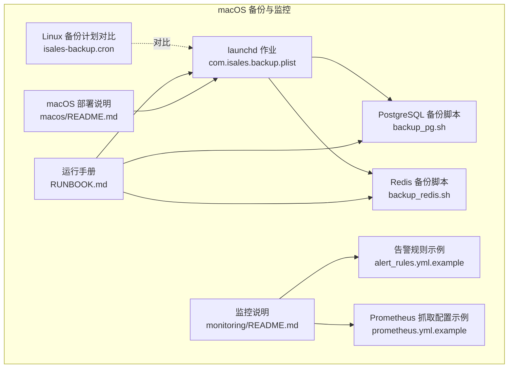
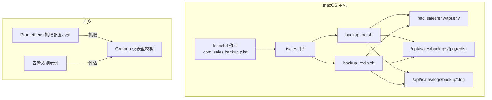
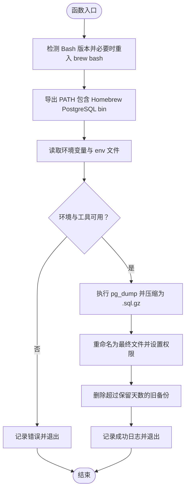
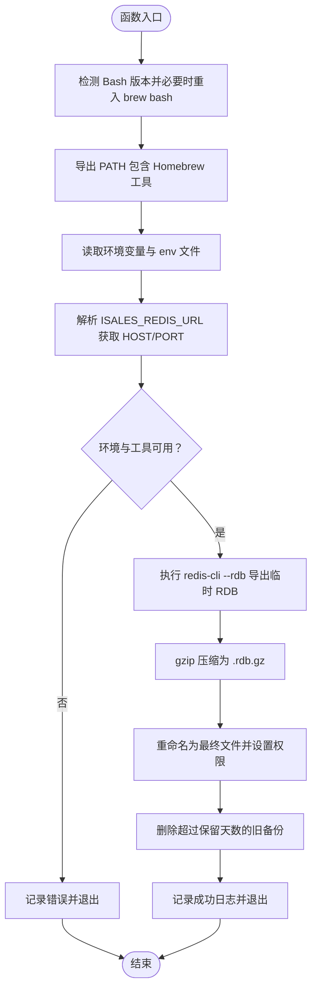
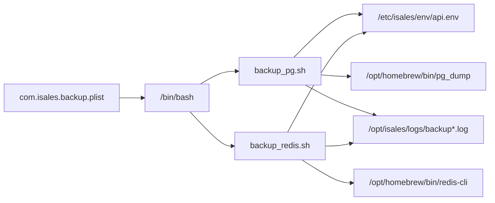

# 备份与监控

<cite>
**本文引用的文件**
- [com.isales.backup.plist](file://deploy/macos/launchd-jobs/com.isales.backup.plist)
- [backup_pg.sh](file://deploy/macos/scripts/backup_pg.sh)
- [backup_redis.sh](file://deploy/macos/scripts/backup_redis.sh)
- [isales-backup.cron](file://deploy/cron/isales-backup.cron)
- [macos 部署说明](file://deploy/macos/README.md)
- [监控说明](file://deploy/monitoring/README.md)
- [监控告警规则示例](file://deploy/monitoring/alert_rules.yml.example)
- [Prometheus 抓取配置示例](file://deploy/monitoring/prometheus.yml.example)
- [macOS 运行手册](file://deploy/RUNBOOK.md)
- [_lib.sh（macOS）](file://deploy/macos/scripts/_lib.sh)
</cite>

## 目录
1. [简介](#简介)
2. [项目结构](#项目结构)
3. [核心组件](#核心组件)
4. [架构总览](#架构总览)
5. [组件详解](#组件详解)
6. [依赖关系分析](#依赖关系分析)
7. [性能考量](#性能考量)
8. [故障排查指南](#故障排查指南)
9. [结论](#结论)
10. [附录](#附录)

## 简介
本章节面向 macOS 环境下的 iSales 备份与监控，系统性说明以下内容：
- 备份策略与实现：PostgreSQL 与 Redis 的定时备份脚本及其输出、保留策略
- launchd 服务 com.isales.backup 的配置与执行机制：StartCalendarInterval 的设置与每日 02:30 的触发
- 备份文件的存储位置、命名规则与保留策略
- 备份验证与恢复流程（含 PostgreSQL 与 Redis）
- 监控配置与告警机制（当前可用的 Redis/PG 健康与性能指标）
- 备份失败的故障排查方法与数据恢复最佳实践

## 项目结构
macOS 备份与监控相关的关键文件分布如下：
- launchd 作业定义：com.isales.backup.plist
- 备份脚本：backup_pg.sh、backup_redis.sh
- Linux 平台的备份计划（对比参考）：isales-backup.cron
- macOS 部署说明与差异：macOS 部署说明
- 监控模板：监控说明、监控告警规则示例、Prometheus 抓取配置示例
- 运行手册：macOS 运行手册（包含恢复演练与故障排查）

图表来源
- [com.isales.backup.plist:1-42](file://deploy/macos/launchd-jobs/com.isales.backup.plist#L1-L42)
- [backup_pg.sh:1-56](file://deploy/macos/scripts/backup_pg.sh#L1-L56)
- [backup_redis.sh:1-66](file://deploy/macos/scripts/backup_redis.sh#L1-L66)
- [isales-backup.cron:1-14](file://deploy/cron/isales-backup.cron#L1-L14)
- [监控说明:1-65](file://deploy/monitoring/README.md#L1-L65)
- [监控告警规则示例:1-77](file://deploy/monitoring/alert_rules.yml.example#L1-L77)
- [Prometheus 抓取配置示例:1-63](file://deploy/monitoring/prometheus.yml.example#L1-L63)
- [macOS 运行手册:1-394](file://deploy/RUNBOOK.md#L1-L394)
- [macos 部署说明:1-98](file://deploy/macos/README.md#L1-L98)

章节来源
- [com.isales.backup.plist:1-42](file://deploy/macos/launchd-jobs/com.isales.backup.plist#L1-L42)
- [backup_pg.sh:1-56](file://deploy/macos/scripts/backup_pg.sh#L1-L56)
- [backup_redis.sh:1-66](file://deploy/macos/scripts/backup_redis.sh#L1-L66)
- [isales-backup.cron:1-14](file://deploy/cron/isales-backup.cron#L1-L14)
- [macos 部署说明:1-98](file://deploy/macos/README.md#L1-L98)
- [监控说明:1-65](file://deploy/monitoring/README.md#L1-L65)
- [监控告警规则示例:1-77](file://deploy/monitoring/alert_rules.yml.example#L1-L77)
- [Prometheus 抓取配置示例:1-63](file://deploy/monitoring/prometheus.yml.example#L1-L63)
- [macOS 运行手册:1-394](file://deploy/RUNBOOK.md#L1-L394)

## 核心组件
- launchd 服务 com.isales.backup：每日 02:30 触发 PostgreSQL 与 Redis 备份，使用 _isales 用户运行，输出统一到日志文件，通过环境变量 BREW_PREFIX 指定 Homebrew 路径。
- PostgreSQL 备份脚本 backup_pg.sh：从集中化 env 读取数据库连接信息，使用 pg_dump 生成自定义格式压缩备份，输出至 /opt/isales/backups/pg/YYYY-MM-DD.sql.gz，默认保留 14 天。
- Redis 备份脚本 backup_redis.sh：解析 ISALES_REDIS_URL，使用 redis-cli --rdb 导出 RDB，再 gzip 压缩，输出至 /opt/isales/backups/redis/YYYY-MM-DD.rdb.gz，默认保留 14 天。
- 监控与告警：提供 Prometheus 抓取与 Grafana 仪表盘模板，包含 Redis 队列堆积、设备标记比率、回调失败率、PG 连接压力等基础告警规则。

章节来源
- [com.isales.backup.plist:10-40](file://deploy/macos/launchd-jobs/com.isales.backup.plist#L10-L40)
- [backup_pg.sh:11-23](file://deploy/macos/scripts/backup_pg.sh#L11-L23)
- [backup_redis.sh:9-21](file://deploy/macos/scripts/backup_redis.sh#L9-L21)
- [监控说明:10-14](file://deploy/monitoring/README.md#L10-L14)
- [监控告警规则示例:12-76](file://deploy/monitoring/alert_rules.yml.example#L12-L76)
- [Prometheus 抓取配置示例:18-57](file://deploy/monitoring/prometheus.yml.example#L18-L57)

## 架构总览
下图展示 macOS 备份与监控的整体架构：launchd 作业按固定时间触发备份脚本，备份脚本读取集中化环境变量，分别对 PostgreSQL 与 Redis 执行备份，并进行保留清理；同时，备份日志统一记录以便诊断；监控侧通过 Prometheus 抓取节点与数据库导出器指标，结合 Grafana 展示与告警规则进行健康检查。

图表来源
- [com.isales.backup.plist:10-40](file://deploy/macos/launchd-jobs/com.isales.backup.plist#L10-L40)
- [backup_pg.sh:16-21](file://deploy/macos/scripts/backup_pg.sh#L16-L21)
- [backup_redis.sh:14-19](file://deploy/macos/scripts/backup_redis.sh#L14-L19)
- [监控说明:10-14](file://deploy/monitoring/README.md#L10-L14)
- [监控告警规则示例:8-77](file://deploy/monitoring/alert_rules.yml.example#L8-L77)
- [Prometheus 抓取配置示例:17-63](file://deploy/monitoring/prometheus.yml.example#L17-L63)

## 组件详解

### launchd 服务 com.isales.backup
- 触发机制：StartCalendarInterval 设置为每日 02:30（小时 2，分钟 30），RunAtLoad 为 false，确保仅按计划执行。
- 运行用户：_isales（系统用户），组也为 _isales，具备只读访问 /etc/isales/env/api.env 的权限。
- 执行命令：调用 /bin/bash -c 顺序执行 PostgreSQL 备份脚本与 Redis 备份脚本。
- 日志输出：StandardOutPath 与 StandardErrorPath 指向 /opt/isales/logs/backup.out.log 与 backup.err.log，便于诊断。
- 环境变量：通过 EnvironmentVariables 注入 BREW_PREFIX=/opt/homebrew，确保脚本使用 Homebrew 提供的工具链。

章节来源
- [com.isales.backup.plist:22-39](file://deploy/macos/launchd-jobs/com.isales.backup.plist#L22-L39)

### PostgreSQL 备份脚本 backup_pg.sh
- 输出位置与命名：/opt/isales/backups/pg/YYYY-MM-DD.sql.gz
- 保留策略：默认保留 14 天，通过 find -mtime +14 删除过期文件
- 环境变量：
  - BREW_PREFIX：默认 /opt/homebrew，用于定位 PostgreSQL 客户端工具
  - ISALES_PG_BACKUP_RETAIN：覆盖默认保留天数
  - ISALES_ENV_FILE：默认 /etc/isales/env/api.env，读取数据库连接信息
- 连接信息解析：从 env 中提取 ISALES_DATABASE_URL，将 asyncpg 前缀替换为标准前缀后用于 pg_dump
- 备份流程：
  - 使用 pg_dump --format=custom 生成临时文件，再 gzip 压缩为最终文件
  - 成功后修改权限为 0640
  - 记录统一日志（syslog 标签 isales-backup）
- 错误处理：若工具缺失、无法读取 env、连接信息缺失、pg_dump 失败，均记录错误并退出非零

图表来源
- [backup_pg.sh:14-55](file://deploy/macos/scripts/backup_pg.sh#L14-L55)

章节来源
- [backup_pg.sh:11-23](file://deploy/macos/scripts/backup_pg.sh#L11-L23)
- [backup_pg.sh:33-55](file://deploy/macos/scripts/backup_pg.sh#L33-L55)

### Redis 备份脚本 backup_redis.sh
- 输出位置与命名：/opt/isales/backups/redis/YYYY-MM-DD.rdb.gz
- 保留策略：默认保留 14 天，通过 find -mtime +14 删除过期文件
- 环境变量：
  - BREW_PREFIX：默认 /opt/homebrew
  - ISALES_REDIS_BACKUP_RETAIN：覆盖默认保留天数
  - ISALES_ENV_FILE：默认 /etc/isales/env/api.env
- 连接信息解析：从 env 中提取 ISALES_REDIS_URL，解析 HOST 与 PORT（默认 127.0.0.1:6379）
- 备份流程：
  - 使用 redis-cli --rdb 导出临时 RDB 文件，再 gzip 压缩为最终文件
  - 成功后修改权限为 0640
  - 记录统一日志（syslog 标签 isales-backup）
- 错误处理：若工具缺失、无法读取 env、连接信息缺失、导出或压缩失败，均记录错误并退出非零

图表来源
- [backup_redis.sh:12-65](file://deploy/macos/scripts/backup_redis.sh#L12-L65)

章节来源
- [backup_redis.sh:9-21](file://deploy/macos/scripts/backup_redis.sh#L9-L21)
- [backup_redis.sh:34-65](file://deploy/macos/scripts/backup_redis.sh#L34-L65)

### 备份验证与恢复流程
- 验证
  - 手动触发：通过 launchctl kickstart -k system/com.isales.backup 触发一次备份
  - 日志检查：使用 log show 查询 isales-backup 子系统最近 5 分钟日志
  - 文件完整性：确认输出文件存在且可 gunzip -t 校验
- PostgreSQL 恢复演练
  - 新建测试数据库，使用 pg_restore 恢复指定日期的备份
  - 校验表结构与关键业务表条目（如 alembic 版本、campaign 数量）
- Redis 恢复演练
  - 停止 Redis 服务，将对应日期的 RDB 替换为 dump.rdb，再启动服务
  - 使用 redis-cli 校验键空间大小与关键键族是否存在

章节来源
- [macos 部署说明:19-20](file://deploy/macos/README.md#L19-L20)
- [macOS 运行手册:118-159](file://deploy/RUNBOOK.md#L118-L159)
- [macOS 运行手册:319-341](file://deploy/RUNBOOK.md#L319-L341)

### 监控配置与告警机制
- 监控模板
  - Prometheus 抓取配置示例：定义各服务与节点、PostgreSQL 导出器的抓取目标
  - 告警规则示例：包含 Redis 队列堆积、设备标记比率、回调失败率、PG 连接压力等基础告警
  - Grafana 仪表盘模板：提供概览面板（进行中通话/队列深度/接通率/每服务错误日志数）
- 当前状态
  - 服务 /metrics 端点尚未全部实现，示例中对各服务标注了 TODO
  - 建议在各服务实现 /metrics 后移除注释并重新加载 Prometheus

章节来源
- [监控说明:10-14](file://deploy/monitoring/README.md#L10-L14)
- [监控告警规则示例:12-76](file://deploy/monitoring/alert_rules.yml.example#L12-L76)
- [Prometheus 抓取配置示例:18-57](file://deploy/monitoring/prometheus.yml.example#L18-L57)

## 依赖关系分析
- 组件耦合
  - com.isales.backup.plist 依赖 backup_pg.sh 与 backup_redis.sh 的可执行性与 PATH 环境
  - 备份脚本依赖 /etc/isales/env/api.env 的正确性与可读性
  - 备份脚本依赖 Homebrew 提供的 PostgreSQL 与 Redis 工具链（由 BREW_PREFIX 控制）
- 外部依赖
  - macOS 14+（Apple Silicon），Homebrew 路径 /opt/homebrew
  - PostgreSQL 16、Redis、nginx、Python 3.12、Node 20 等软件包
- 潜在循环依赖
  - 备份脚本不依赖服务，服务也不依赖备份，无直接循环依赖
- 接口契约
  - 备份脚本通过统一 syslog 标签 isales-backup 输出日志，便于集中采集与检索

图表来源
- [com.isales.backup.plist:16-39](file://deploy/macos/launchd-jobs/com.isales.backup.plist#L16-L39)
- [backup_pg.sh:16-21](file://deploy/macos/scripts/backup_pg.sh#L16-L21)
- [backup_redis.sh:14-19](file://deploy/macos/scripts/backup_redis.sh#L14-L19)

章节来源
- [com.isales.backup.plist:16-39](file://deploy/macos/launchd-jobs/com.isales.backup.plist#L16-L39)
- [backup_pg.sh:16-21](file://deploy/macos/scripts/backup_pg.sh#L16-L21)
- [backup_redis.sh:14-19](file://deploy/macos/scripts/backup_redis.sh#L14-L19)
- [_lib.sh（macOS）:17-21](file://deploy/macos/scripts/_lib.sh#L17-L21)

## 性能考量
- 备份窗口选择：每日 02:30 为低峰时段，避免与业务高峰冲突
- 备份粒度与保留：PostgreSQL 使用自定义格式压缩备份，Redis 使用 RDB 压缩备份，均保留 14 天，平衡恢复灵活性与存储占用
- 工具链一致性：通过 BREW_PREFIX 固定工具链版本，减少跨版本兼容问题
- 日志与可观测性：统一 syslog 标签与日志文件路径，便于自动化采集与检索

## 故障排查指南
- 备份未执行
  - 检查 launchd 服务状态与日志：log show --predicate 'subsystem == "isales-backup"' --last 5m
  - 手动触发一次备份：sudo launchctl kickstart -k system/com.isales.backup
- 备份失败
  - 查看 backup.out.log 与 backup.err.log
  - 确认 /etc/isales/env/api.env 是否存在且可读
  - 确认 pg_dump 与 redis-cli 是否安装于 Homebrew 路径
- PostgreSQL 连接问题
  - 检查数据库服务状态与磁盘空间
  - 校验 ISALES_DATABASE_URL 是否正确（支持 asyncpg 前缀转换）
- Redis 连接问题
  - 校验 ISALES_REDIS_URL 的 HOST/PORT 是否可达
  - 确认 Redis 服务状态与内存配置
- 恢复演练
  - PostgreSQL：使用 pg_restore 恢复到测试库，校验表与数据
  - Redis：停止服务替换 dump.rdb 后重启，校验键空间

章节来源
- [com.isales.backup.plist:31-34](file://deploy/macos/launchd-jobs/com.isales.backup.plist#L31-L34)
- [backup_pg.sh:27-40](file://deploy/macos/scripts/backup_pg.sh#L27-L40)
- [backup_redis.sh:28-45](file://deploy/macos/scripts/backup_redis.sh#L28-L45)
- [macOS 运行手册:346-394](file://deploy/RUNBOOK.md#L346-L394)

## 结论
本文档基于仓库现有配置，系统梳理了 macOS 环境下 iSales 的备份与监控方案：通过 launchd 作业在每日 02:30 自动执行 PostgreSQL 与 Redis 备份，备份文件按日期归档并保留 14 天；配套的日志与运行手册提供了验证与恢复演练路径；监控模板提供了 Redis/PG 健康与性能的基础观测与告警。建议在各服务实现 /metrics 后完善 Prometheus 抓取配置，进一步提升可观测性。

## 附录
- 备份文件存储位置与命名
  - PostgreSQL：/opt/isales/backups/pg/YYYY-MM-DD.sql.gz
  - Redis：/opt/isales/backups/redis/YYYY-MM-DD.rdb.gz
- 保留策略
  - 默认保留 14 天，脚本自动清理过期文件
- 环境变量
  - ISALES_ENV_FILE：默认 /etc/isales/env/api.env
  - ISALES_PG_BACKUP_RETAIN：覆盖 PostgreSQL 保留天数
  - ISALES_REDIS_BACKUP_RETAIN：覆盖 Redis 保留天数
  - BREW_PREFIX：默认 /opt/homebrew

章节来源
- [backup_pg.sh:19-23](file://deploy/macos/scripts/backup_pg.sh#L19-L23)
- [backup_redis.sh:17-21](file://deploy/macos/scripts/backup_redis.sh#L17-L21)
- [backup_pg.sh:20-20](file://deploy/macos/scripts/backup_pg.sh#L20-L20)
- [backup_redis.sh:18-18](file://deploy/macos/scripts/backup_redis.sh#L18-L18)
- [com.isales.backup.plist:35-39](file://deploy/macos/launchd-jobs/com.isales.backup.plist#L35-L39)