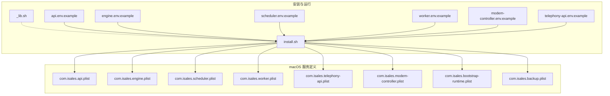
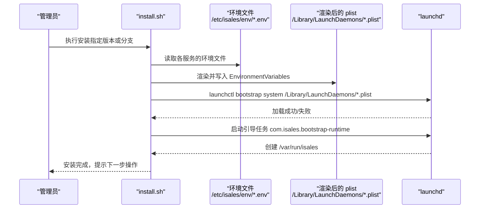
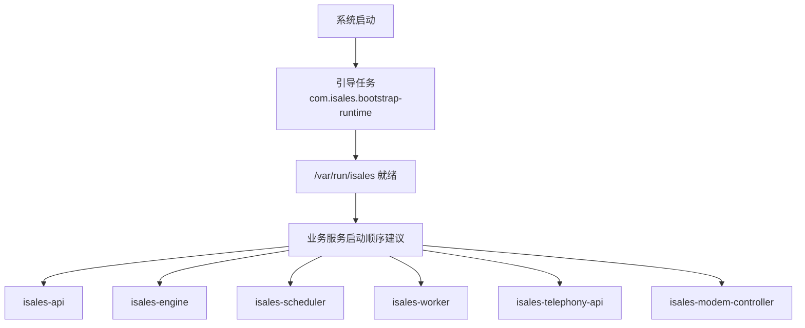

# 服务管理配置

<cite>
**本文引用的文件**
- [com.isales.api.plist](file://deploy/macos/plist/com.isales.api.plist)
- [com.isales.engine.plist](file://deploy/macos/plist/com.isales.engine.plist)
- [com.isales.modem-controller.plist](file://deploy/macos/plist/com.isales.modem-controller.plist)
- [com.isales.scheduler.plist](file://deploy/macos/plist/com.isales.scheduler.plist)
- [com.isales.telephony-api.plist](file://deploy/macos/plist/com.isales.telephony-api.plist)
- [com.isales.worker.plist](file://deploy/macos/plist/com.isales.worker.plist)
- [com.isales.backup.plist](file://deploy/macos/launchd-jobs/com.isales.backup.plist)
- [com.isales.bootstrap-runtime.plist](file://deploy/macos/launchd-jobs/com.isales.bootstrap-runtime.plist)
- [install.sh](file://deploy/macos/scripts/install.sh)
- [_lib.sh](file://deploy/macos/scripts/_lib.sh)
- [api.env.example](file://deploy/env/api.env.example)
- [engine.env.example](file://deploy/env/engine.env.example)
- [scheduler.env.example](file://deploy/env/scheduler.env.example)
- [worker.env.example](file://deploy/env/worker.env.example)
- [modem-controller.env.example](file://deploy/env/modem-controller.env.example)
- [telephony-api.env.example](file://deploy/env/telephony-api.env.example)
</cite>

## 目录
1. [简介](#简介)
2. [项目结构](#项目结构)
3. [核心组件](#核心组件)
4. [架构总览](#架构总览)
5. [详细组件分析](#详细组件分析)
6. [依赖关系与启动顺序](#依赖关系与启动顺序)
7. [性能与可靠性考量](#性能与可靠性考量)
8. [故障排查指南](#故障排查指南)
9. [结论](#结论)

## 简介
本文面向 iSales 在 macOS 上的 launchd 服务管理配置，系统性说明 6 个核心服务（API、引擎、调度器、工作者、电话 API、调制解调器控制器）的 plist 模板、职责边界、启动参数与运行环境；解释安装脚本如何将环境变量内联到 plist，并通过 launchctl 进行加载与管理；提供日志收集与故障排查方法，以及服务依赖与启动顺序的最佳实践。

## 项目结构
- macOS 服务定义位于 deploy/macos/plist/，包含 6 个服务的 plist 模板。
- 启动辅助与一次性任务位于 deploy/macos/launchd-jobs/，包含每日备份与引导重建运行时目录的任务。
- 安装脚本 install.sh 负责渲染 plist 并通过 launchctl 加载。
- 环境变量模板位于 deploy/env/，按服务提供示例文件，安装时由脚本内联到对应服务的 plist。

图表来源
- [install.sh:188-320](file://deploy/macos/scripts/install.sh#L188-L320)
- [com.isales.api.plist:1-37](file://deploy/macos/plist/com.isales.api.plist#L1-L37)
- [com.isales.engine.plist:1-37](file://deploy/macos/plist/com.isales.engine.plist#L1-L37)
- [com.isales.scheduler.plist:1-37](file://deploy/macos/plist/com.isales.scheduler.plist#L1-L37)
- [com.isales.worker.plist:1-37](file://deploy/macos/plist/com.isales.worker.plist#L1-L37)
- [com.isales.telephony-api.plist:1-37](file://deploy/macos/plist/com.isales.telephony-api.plist#L1-L37)
- [com.isales.modem-controller.plist:1-48](file://deploy/macos/plist/com.isales.modem-controller.plist#L1-L48)
- [com.isales.bootstrap-runtime.plist:1-39](file://deploy/macos/launchd-jobs/com.isales.bootstrap-runtime.plist#L1-L39)
- [com.isales.backup.plist:1-42](file://deploy/macos/launchd-jobs/com.isales.backup.plist#L1-L42)

章节来源
- [install.sh:188-320](file://deploy/macos/scripts/install.sh#L188-L320)
- [_lib.sh:1-69](file://deploy/macos/scripts/_lib.sh#L1-L69)

## 核心组件
- 服务账户与权限
  - 所有服务均以 _isales 用户与组运行，遵循 macOS 系统账户命名约定。
  - 引导任务 com.isales.bootstrap-runtime 以 root 权限运行，负责在每次开机后重建 /var/run/isales 目录并授予属主权限，确保后续服务可绑定 Unix 域套接字。
- 工作目录与可执行路径
  - 各服务的 WorkingDirectory 指向其源码所在目录，ProgramArguments 指向虚拟环境中的可执行入口。
- 日志输出
  - 每个服务均配置 StandardOutPath 与 StandardErrorPath，便于统一采集与排障。
- 自动重启策略
  - KeepAlive 的 SuccessfulExit 设为 false，确保服务异常退出时由 launchd 重启，避免静默失败。
- 环境变量注入
  - launchd 不支持 EnvironmentFile=，安装脚本通过内置 Python 解析 /etc/isales/env/<svc>.env，将键值对写入 plist 的 EnvironmentVariables 字段，再写回 /Library/LaunchDaemons/<svc>.plist。

章节来源
- [com.isales.api.plist:10-37](file://deploy/macos/plist/com.isales.api.plist#L10-L37)
- [com.isales.engine.plist:10-37](file://deploy/macos/plist/com.isales.engine.plist#L10-L37)
- [com.isales.modem-controller.plist:10-48](file://deploy/macos/plist/com.isales.modem-controller.plist#L10-L48)
- [com.isales.scheduler.plist:10-37](file://deploy/macos/plist/com.isales.scheduler.plist#L10-L37)
- [com.isales.telephony-api.plist:10-37](file://deploy/macos/plist/com.isales.telephony-api.plist#L10-L37)
- [com.isales.worker.plist:10-37](file://deploy/macos/plist/com.isales.worker.plist#L10-L37)
- [com.isales.bootstrap-runtime.plist:13-37](file://deploy/macos/launchd-jobs/com.isales.bootstrap-runtime.plist#L13-L37)
- [install.sh:204-237](file://deploy/macos/scripts/install.sh#L204-L237)

## 架构总览
下图展示安装阶段如何将环境变量内联到各服务 plist，并通过 launchctl 加载；同时引导任务在系统启动时先于业务服务创建运行时目录。

图表来源
- [install.sh:239-320](file://deploy/macos/scripts/install.sh#L239-L320)
- [com.isales.bootstrap-runtime.plist:13-37](file://deploy/macos/launchd-jobs/com.isales.bootstrap-runtime.plist#L13-L37)

章节来源
- [install.sh:239-320](file://deploy/macos/scripts/install.sh#L239-L320)

## 详细组件分析

### API 服务（com.isales.api）
- 职责范围
  - 提供对外 HTTP 接口，处理业务请求与鉴权。
- 启动参数与运行环境
  - 可执行程序：/opt/isales/current/venv/bin/isales-api
  - 工作目录：/opt/isales/current/isales-api
  - 用户/组：_isales/_isales
  - 日志：StandardOutPath 与 StandardErrorPath 指向 /opt/isales/logs/api.*.log
  - 自动重启：KeepAlive.SuccessfulExit=false
- 关键环境变量（来自 api.env.example）
  - 数据库连接、Redis 连接、JWT 密钥、管理员凭据等
- 安全与一致性
  - JWT 密钥需与 telephony-api 保持一致，数据库与 Redis URL 需与其他服务一致

章节来源
- [com.isales.api.plist:10-37](file://deploy/macos/plist/com.isales.api.plist#L10-L37)
- [api.env.example:1-14](file://deploy/env/api.env.example#L1-L14)

### 引擎服务（com.isales.engine）
- 职责范围
  - AI 管道与通话状态机的核心执行单元，负责调度与处理。
- 启动参数与运行环境
  - 可执行程序：/opt/isales/current/venv/bin/isales-engine
  - 工作目录：/opt/isales/current/isales-engine
  - 用户/组：_isales/_isales
  - 日志：/opt/isales/logs/engine.*.log
  - 自动重启：KeepAlive.SuccessfulExit=false
- 关键环境变量（来自 engine.env.example）
  - 数据库/Redis 连接、LLM/ASR/TTS 提供商、时区、超时与优雅停机参数等

章节来源
- [com.isales.engine.plist:10-37](file://deploy/macos/plist/com.isales.engine.plist#L10-L37)
- [engine.env.example:1-21](file://deploy/env/engine.env.example#L1-L21)

### 调度器服务（com.isales.scheduler）
- 职责范围
  - 周期性任务调度与批处理，负责任务分发与并发控制。
- 启动参数与运行环境
  - 可执行程序：/opt/isales/current/venv/bin/isales-scheduler
  - 工作目录：/opt/isales/current/isales-scheduler
  - 用户/组：_isales/_isales
  - 日志：/opt/isales/logs/scheduler.*.log
  - 自动重启：KeepAlive.SuccessfulExit=false
- 关键环境变量（来自 scheduler.env.example）
  - 数据库/Redis 连接、调度周期、批大小、历史窗口与并发上限等

章节来源
- [com.isales.scheduler.plist:10-37](file://deploy/macos/plist/com.isales.scheduler.plist#L10-L37)
- [scheduler.env.example:1-21](file://deploy/env/scheduler.env.example#L1-L21)

### 工作者服务（com.isales.worker）
- 职责范围
  - 异步回调与 Webhook 处理，重试与指标上报。
- 启动参数与运行环境
  - 可执行程序：/opt/isales/current/venv/bin/isales-worker
  - 工作目录：/opt/isales/current/isales-worker
  - 用户/组：_isales/_isales
  - 日志：/opt/isales/logs/worker.*.log
  - 自动重启：KeepAlive.SuccessfulExit=false
- 关键环境变量（来自 worker.env.example）
  - 数据库/Redis 连接、Fernet 密钥、默认超时、重试与指标周期等

章节来源
- [com.isales.worker.plist:10-37](file://deploy/macos/plist/com.isales.worker.plist#L10-L37)
- [worker.env.example:1-20](file://deploy/env/worker.env.example#L1-L20)

### 电话 API 服务（com.isales.telephony-api）
- 职责范围
  - 电话相关 API，负责设备选择与通话控制接口。
- 启动参数与运行环境
  - 可执行程序：/opt/isales/current/venv/bin/telephony-api
  - 工作目录：/opt/isales/current/isales-telephony
  - 用户/组：_isales/_isales
  - 日志：/opt/isales/logs/telephony-api.*.log
  - 自动重启：KeepAlive.SuccessfulExit=false
- 关键环境变量（来自 telephony-api.env.example）
  - 数据库/Redis 连接、JWT 密钥（需与 api 一致）

章节来源
- [com.isales.telephony-api.plist:10-37](file://deploy/macos/plist/com.isales.telephony-api.plist#L10-L37)
- [telephony-api.env.example:1-12](file://deploy/env/telephony-api.env.example#L1-L12)

### 调制解调器控制器（com.isales.modem-controller）
- 职责范围
  - 与调制解调器通信，提供 AT 指令交互与设备驱动抽象。
- 启动参数与运行环境
  - 可执行程序：/opt/isales/current/venv/bin/modem-controller
  - 工作目录：/opt/isales/current/isales-telephony
  - 用户/组：_isales/_isales
  - 日志：/opt/isales/logs/modem-controller.*.log
  - 自动重启：KeepAlive.SuccessfulExit=false
- 关键环境变量（来自 modem-controller.env.example）
  - 数据库连接、IPC 套接字路径（默认 /var/run/isales/modem.sock）
  - 生产环境严禁设置允许模拟的开关
- 特殊要求
  - 必须在引导任务完成后才能绑定套接字，否则首次启动可能抖动

章节来源
- [com.isales.modem-controller.plist:10-48](file://deploy/macos/plist/com.isales.modem-controller.plist#L10-L48)
- [modem-controller.env.example:1-15](file://deploy/env/modem-controller.env.example#L1-L15)

### 引导任务（com.isales.bootstrap-runtime）
- 职责范围
  - 每次开机重建 /var/run/isales 目录，确保后续服务可绑定 Unix 域套接字。
- 启动方式
  - RunAtLoad=true，LaunchOnlyOnce=true，执行后立即退出。
- 权限
  - 以 root 运行，随后 chown 给 _isales 用户/组。

章节来源
- [com.isales.bootstrap-runtime.plist:13-37](file://deploy/macos/launchd-jobs/com.isales.bootstrap-runtime.plist#L13-L37)

### 备份任务（com.isales.backup）
- 职责范围
  - 每日 02:30 备份 PostgreSQL 与 Redis。
- 启动方式
  - 使用 StartCalendarInterval 指定时间。
- 环境变量
  - 内置 BREW_PREFIX，脚本从 /opt/isales/current/deploy/macos/scripts/ 调用备份脚本。
- 日志
  - 输出到 /opt/isales/logs/backup.*.log

章节来源
- [com.isales.backup.plist:10-42](file://deploy/macos/launchd-jobs/com.isales.backup.plist#L10-L42)

## 依赖关系与启动顺序
- 引导依赖
  - 必须先加载引导任务，确保 /var/run/isales 存在，再加载需要绑定 Unix 域套接字的服务（如 modem-controller）。
- 服务间依赖
  - 数据库与 Redis：所有服务共享相同的 ISALES_DATABASE_URL 与 ISALES_REDIS_URL。
  - JWT：telephony-api 与 api 的 ISALES_JWT_SECRET 必须一致。
  - Fernet：api 与 worker 的密钥需一致。
- 启动顺序建议
  - 先启动数据库与 Redis（由系统服务管理），再启动 iSales 各服务。
  - 引导任务在系统启动早期执行，随后按需启动 API、Engine、Scheduler、Worker、Telephony-API、Modem-Controller。
  - 若首次启动 modem-controller 失败，等待引导任务完成后再观察日志。

图表来源
- [com.isales.bootstrap-runtime.plist:13-37](file://deploy/macos/launchd-jobs/com.isales.bootstrap-runtime.plist#L13-L37)
- [install.sh:257-272](file://deploy/macos/scripts/install.sh#L257-L272)

章节来源
- [install.sh:257-272](file://deploy/macos/scripts/install.sh#L257-L272)

## 性能与可靠性考量
- 自动重启
  - 所有服务 KeepAlive.SuccessfulExit=false，保证异常退出后自动恢复。
- 日志集中化
  - 所有服务输出到 /opt/isales/logs 下的独立文件，便于统一采集与分析。
- 环境变量内联
  - 通过安装脚本一次性写入 plist，避免运行时动态解析带来的开销与错误。
- 时区与一致性
  - 多数服务设置 TZ=Asia/Shanghai，确保定时任务与日志时间戳一致。

章节来源
- [com.isales.api.plist:20-37](file://deploy/macos/plist/com.isales.api.plist#L20-L37)
- [com.isales.engine.plist:20-37](file://deploy/macos/plist/com.isales.engine.plist#L20-L37)
- [com.isales.scheduler.plist:20-37](file://deploy/macos/plist/com.isales.scheduler.plist#L20-L37)
- [com.isales.worker.plist:20-37](file://deploy/macos/plist/com.isales.worker.plist#L20-L37)
- [com.isales.telephony-api.plist:20-37](file://deploy/macos/plist/com.isales.telephony-api.plist#L20-L37)
- [com.isales.modem-controller.plist:20-48](file://deploy/macos/plist/com.isales.modem-controller.plist#L20-L48)

## 故障排查指南
- 常见问题定位
  - 无法绑定 Unix 域套接字：检查引导任务是否已创建 /var/run/isales，确认引导任务已加载且无错误。
  - 调制解调器未就绪：确认 ISALES_MODEM_SERIAL_PATH 已正确配置，且未设置生产禁用开关。
  - JWT 或密钥不匹配：核对 api 与 telephony-api 的 ISALES_JWT_SECRET，以及 api 与 worker 的密钥一致性。
- 日志查看
  - 使用系统日志工具查看服务输出与错误：
    - 查看特定服务日志：journalctl -u <服务名> -f
    - 使用 macOS 日志系统：log show --predicate 'subsystem contains "com.isales"' --info --show-time
    - 过滤关键词：结合服务标签与错误关键字进行筛选
- 服务状态与控制
  - 列出已加载的作业：launchctl print system
  - 启动/停止/重启服务：launchctl bootstrap system /Library/LaunchDaemons/<服务>.plist；launchctl bootout system /Library/LaunchDaemons/<服务>.plist
  - 重新加载：若仅修改了 plist，可先 bootout 再 bootstrap，确保新配置生效
- 环境变量验证
  - 确认 /etc/isales/env/<svc>.env 已存在且格式正确（KEY=VALUE，支持注释与引号去除）
  - 安装脚本会校验生成的 plist（plutil -lint），若失败请检查环境文件语法

章节来源
- [install.sh:289-320](file://deploy/macos/scripts/install.sh#L289-L320)
- [com.isales.backup.plist:35-42](file://deploy/macos/launchd-jobs/com.isales.backup.plist#L35-L42)

## 结论
本文基于仓库中的实际配置与脚本，系统梳理了 iSales 在 macOS 上的 launchd 服务管理方案：6 个核心服务的职责、启动参数、运行环境与日志策略；安装脚本如何将环境变量内联到 plist 并通过 launchctl 加载；引导任务与业务服务的依赖关系与启动顺序；以及日志与故障排查方法。遵循本文建议可有效提升部署稳定性与运维效率。