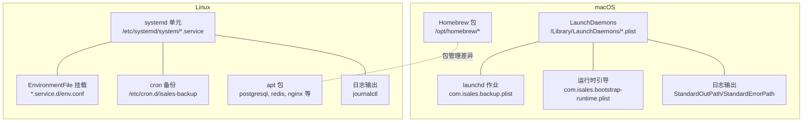
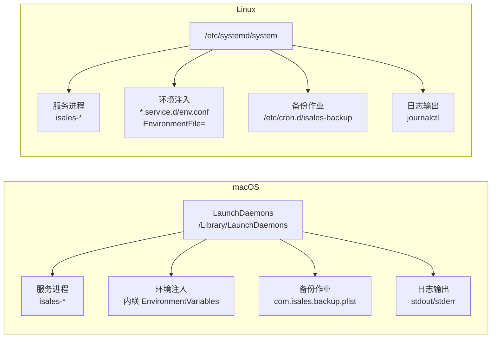
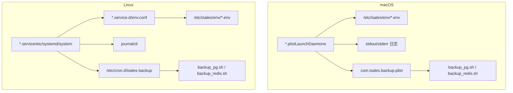

# 环境差异对比

<cite>
**本文引用的文件**
- [com.isales.backup.plist](file://deploy/macos/launchd-jobs/com.isales.backup.plist)
- [com.isales.bootstrap-runtime.plist](file://deploy/macos/launchd-jobs/com.isales.bootstrap-runtime.plist)
- [com.isales.api.plist](file://deploy/macos/plist/com.isales.api.plist)
- [com.isales.engine.plist](file://deploy/macos/plist/com.isales.engine.plist)
- [com.isales.worker.plist](file://deploy/macos/plist/com.isales.worker.plist)
- [com.isales.scheduler.plist](file://deploy/macos/plist/com.isales.scheduler.plist)
- [com.isales.modem-controller.plist](file://deploy/macos/plist/com.isales.modem-controller.plist)
- [com.isales.telephony-api.plist](file://deploy/macos/plist/com.isales.telephony-api.plist)
- [isales-api.service](file://deploy/cloud/systemd/isales-api.service)
- [isales-engine.service](file://deploy/cloud/systemd/isales-engine.service)
- [isales-worker.service](file://deploy/cloud/systemd/isales-worker.service)
- [isales-scheduler.service](file://deploy/cloud/systemd/isales-scheduler.service)
- [_lib.sh（macOS）](file://deploy/macos/scripts/_lib.sh)
- [_lib.sh（Linux）](file://deploy/linux/scripts/_lib.sh)
- [install.sh（macOS）](file://deploy/macos/scripts/install.sh)
- [install.sh（Linux）](file://deploy/linux/scripts/install.sh)
- [backup_pg.sh（macOS）](file://deploy/macos/scripts/backup_pg.sh)
- [backup_redis.sh（macOS）](file://deploy/macos/scripts/backup_redis.sh)
- [backup_pg.sh（Linux）](file://deploy/linux/scripts/backup_pg.sh)
- [backup_redis.sh（Linux）](file://deploy/linux/scripts/backup_redis.sh)
</cite>

## 目录
1. [简介](#简介)
2. [项目结构](#项目结构)
3. [核心组件](#核心组件)
4. [架构总览](#架构总览)
5. [详细组件分析](#详细组件分析)
6. [依赖关系分析](#依赖关系分析)
7. [性能考量](#性能考量)
8. [故障排查指南](#故障排查指南)
9. [结论](#结论)
10. [附录：差异速查表与迁移注意事项](#附录差异速查表与迁移注意事项)

## 简介
本文件面向在 macOS 与 Linux 环境部署 iSales 的工程人员，系统性对比两类平台在服务管理、日志查询、包管理、备份策略等方面的差异，并重点解释 launchd 与 systemd 在服务状态查询、重启命令与日志查看上的不同；同时说明环境变量注入机制（systemd 的 EnvironmentFile 与 launchd 的 EnvironmentVariables）差异，以及 Homebrew 与 apt 的使用差异；最后补充音频后端与 USB 监听的技术差异（Core Audio 与 ALSA、pyserial 与 pyudev），并给出完整差异速查表与迁移注意事项。

## 项目结构
围绕 macOS 与 Linux 的部署差异，仓库中分别提供了两套实现：
- macOS：使用 launchd 管理服务，通过 LaunchDaemons 安装 plist；备份由 launchd 作业调度；包管理采用 Homebrew。
- Linux：使用 systemd 管理服务，通过单元文件与 drop-in 环境文件集中注入环境；备份由 cron 调度；包管理采用 apt。

图表来源
- [com.isales.backup.plist:1-42](file://deploy/macos/launchd-jobs/com.isales.backup.plist#L1-L42)
- [com.isales.bootstrap-runtime.plist:1-39](file://deploy/macos/launchd-jobs/com.isales.bootstrap-runtime.plist#L1-L39)
- [isales-api.service:1-35](file://deploy/cloud/systemd/isales-api.service#L1-L35)
- [_lib.sh（macOS）:1-69](file://deploy/macos/scripts/_lib.sh#L1-L69)
- [_lib.sh（Linux）:1-47](file://deploy/linux/scripts/_lib.sh#L1-L47)

章节来源
- [com.isales.backup.plist:1-42](file://deploy/macos/launchd-jobs/com.isales.backup.plist#L1-L42)
- [com.isales.bootstrap-runtime.plist:1-39](file://deploy/macos/launchd-jobs/com.isales.bootstrap-runtime.plist#L1-L39)
- [isales-api.service:1-35](file://deploy/cloud/systemd/isales-api.service#L1-L35)
- [_lib.sh（macOS）:1-69](file://deploy/macos/scripts/_lib.sh#L1-L69)
- [_lib.sh（Linux）:1-47](file://deploy/linux/scripts/_lib.sh#L1-L47)

## 核心组件
- macOS 侧
  - 服务定义：各服务以独立 plist 文件形式存在，统一由 LaunchDaemons 管理。
  - 环境变量：通过安装流程将 /etc/isales/env/<svc>.env 内容内联到 plist 的 EnvironmentVariables 字典中。
  - 运行时引导：启动一次性任务确保 /var/run/isales 存在，避免 socket 绑定失败。
  - 备份：每日定时任务，使用 launchd 的 StartCalendarInterval。
  - 日志：stdout/stderr 输出重定向至指定路径，便于诊断。
  - 包管理：Homebrew，路径前缀为 /opt/homebrew。

- Linux 侧
  - 服务定义：systemd 单元文件位于 /etc/systemd/system/，通过 ExecStart 与 WorkingDirectory 指向当前版本目录。
  - 环境变量：通过 *.service.d/env.conf 的 EnvironmentFile= 挂载集中环境文件。
  - 备份：cron 定时任务，写入 /etc/cron.d/isales-backup。
  - 日志：journalctl 查询 systemd 服务日志。
  - 包管理：apt，包含 postgresql、redis、nginx、nodejs、python3.12 等。

章节来源
- [com.isales.api.plist:1-37](file://deploy/macos/plist/com.isales.api.plist#L1-L37)
- [com.isales.engine.plist:1-37](file://deploy/macos/plist/com.isales.engine.plist#L1-L37)
- [com.isales.modem-controller.plist:1-48](file://deploy/macos/plist/com.isales.modem-controller.plist#L1-L48)
- [isales-api.service:1-35](file://deploy/cloud/systemd/isales-api.service#L1-L35)
- [isales-engine.service:1-42](file://deploy/cloud/systemd/isales-engine.service#L1-L42)
- [backup_pg.sh（macOS）:1-56](file://deploy/macos/scripts/backup_pg.sh#L1-L56)
- [backup_redis.sh（macOS）:1-66](file://deploy/macos/scripts/backup_redis.sh#L1-L66)
- [backup_pg.sh（Linux）:1-50](file://deploy/linux/scripts/backup_pg.sh#L1-L50)
- [backup_redis.sh（Linux）:1-61](file://deploy/linux/scripts/backup_redis.sh#L1-L61)

## 架构总览
下图展示两类平台的服务生命周期与环境注入路径差异：

图表来源
- [install.sh（macOS）:239-320](file://deploy/macos/scripts/install.sh#L239-L320)
- [com.isales.backup.plist:1-42](file://deploy/macos/launchd-jobs/com.isales.backup.plist#L1-L42)
- [isales-api.service:16-17](file://deploy/cloud/systemd/isales-api.service#L16-L17)
- [install.sh（Linux）:196-236](file://deploy/linux/scripts/install.sh#L196-L236)

## 详细组件分析

### 服务管理方式：launchd vs systemd
- 启动与加载
  - macOS：通过 launchctl bootstrap/launchctl bootout 加载或卸载 LaunchDaemons 下的 plist。
  - Linux：通过 systemctl enable/disable 控制开机自启，systemctl daemon-reload 重新加载单元文件。

- 服务状态查询
  - macOS：使用 launchctl print system/<label> 或 launchctl print system 查看状态。
  - Linux：使用 systemctl status <service> 或 journalctl -u <service>。

- 重启命令
  - macOS：先 bootout 再 bootstrap，或使用 launchctl kickstart。
  - Linux：systemctl restart <service>。

- 日志查看
  - macOS：查看 plist 中 StandardOutPath/StandardErrorPath 指定的日志文件。
  - Linux：使用 journalctl -u <service> 或 journalctl -f 实时跟踪。

- 环境变量注入
  - macOS：install.sh 在安装时解析 /etc/isales/env/<svc>.env 并内联到 plist 的 EnvironmentVariables 字典。
  - Linux：install.sh 在 /etc/systemd/system/<svc>.service.d/ 写入 env.conf，设置 EnvironmentFile=/etc/isales/env/<svc>.env。

- 运行时引导
  - macOS：com.isales.bootstrap-runtime.plist 作为一次性任务在系统启动时重建 /var/run/isales。
  - Linux：无此类一次性任务，socket 绑定通常在服务启动时完成。

- 备份策略
  - macOS：com.isales.backup.plist 使用 StartCalendarInterval 每日定时执行备份脚本。
  - Linux：/etc/cron.d/isales-backup 由 cron 调度执行备份脚本。

章节来源
- [install.sh（macOS）:239-320](file://deploy/macos/scripts/install.sh#L239-L320)
- [com.isales.backup.plist:22-28](file://deploy/macos/launchd-jobs/com.isales.backup.plist#L22-L28)
- [install.sh（Linux）:196-236](file://deploy/linux/scripts/install.sh#L196-L236)
- [isales-api.service:16-17](file://deploy/cloud/systemd/isales-api.service#L16-L17)

### 包管理工具：Homebrew vs apt
- macOS（Homebrew）
  - 前缀：/opt/homebrew
  - 关键包：postgresql@16、redis、nginx、python@3.12、node@20、pkg-config、git
  - 特点：Apple Silicon 默认安装到 /opt/homebrew，Intel 不受支持。

- Linux（apt）
  - 关键包：postgresql-15、redis-server、nginx、python3.12、nodejs、npm、git、pkg-config、libudev-dev、libasound2-dev
  - 特点：系统包管理器，依赖库与音频设备支持更贴近传统发行版。

章节来源
- [_lib.sh（macOS）:17-35](file://deploy/macos/scripts/_lib.sh#L17-L35)
- [_lib.sh（Linux）:17-33](file://deploy/linux/scripts/_lib.sh#L17-L33)

### 备份策略：launchd 作业 vs cron
- macOS
  - 作业：com.isales.backup.plist 每日 02:30 执行备份脚本，输出到 /opt/isales/backups/pg 与 /opt/isales/backups/redis。
  - 脚本：backup_pg.sh 与 backup_redis.sh 读取 /etc/isales/env/api.env，分别调用 pg_dump 与 redis-cli --rdb。
  - 日志：脚本通过 logger 输出到系统日志，stdout/stderr 也重定向到 /opt/isales/logs。

- Linux
  - 作业：/etc/cron.d/isales-backup 由 cron 调度，逻辑与 macOS 类似。
  - 脚本：backup_pg.sh 与 backup_redis.sh 同步实现，读取 /etc/isales/env/api.env。
  - 日志：通过 logger 输出到 syslog。

章节来源
- [com.isales.backup.plist:22-28](file://deploy/macos/launchd-jobs/com.isales.backup.plist#L22-L28)
- [backup_pg.sh（macOS）:1-56](file://deploy/macos/scripts/backup_pg.sh#L1-L56)
- [backup_redis.sh（macOS）:1-66](file://deploy/macos/scripts/backup_redis.sh#L1-L66)
- [backup_pg.sh（Linux）:1-50](file://deploy/linux/scripts/backup_pg.sh#L1-L50)
- [backup_redis.sh（Linux）:1-61](file://deploy/linux/scripts/backup_redis.sh#L1-L61)

### 音频后端与 USB 监听：Core Audio vs ALSA，pyserial vs pyudev
- 音频后端
  - macOS：使用 Core Audio（通过 isales-telephony 的 [macos] 可选依赖安装，满足音频采集与播放需求）。
  - Linux：使用 ALSA（通过 libasound2-dev 提供开发头文件与库）。

- USB 监听
  - macOS：使用 pyserial 访问 /dev/cu.* 设备（如 /dev/cu.usbmodem*）。
  - Linux：使用 pyudev 监听 /dev/tty* 设备热插拔事件，自动发现可用串口。

章节来源
- [install.sh（macOS）:166-174](file://deploy/macos/scripts/install.sh#L166-L174)
- [_lib.sh（Linux）:25-26](file://deploy/linux/scripts/_lib.sh#L25-L26)
- [com.isales.modem-controller.plist:33-43](file://deploy/macos/plist/com.isales.modem-controller.plist#L33-L43)

## 依赖关系分析
两类平台在服务、环境与备份方面的主要依赖如下：

图表来源
- [install.sh（macOS）:239-320](file://deploy/macos/scripts/install.sh#L239-L320)
- [install.sh（Linux）:196-236](file://deploy/linux/scripts/install.sh#L196-L236)
- [com.isales.backup.plist:1-42](file://deploy/macos/launchd-jobs/com.isales.backup.plist#L1-L42)
- [backup_pg.sh（macOS）:1-56](file://deploy/macos/scripts/backup_pg.sh#L1-L56)
- [backup_redis.sh（macOS）:1-66](file://deploy/macos/scripts/backup_redis.sh#L1-L66)
- [backup_pg.sh（Linux）:1-50](file://deploy/linux/scripts/backup_pg.sh#L1-L50)
- [backup_redis.sh（Linux）:1-61](file://deploy/linux/scripts/backup_redis.sh#L1-L61)

## 性能考量
- 启动路径与资源占用
  - macOS：一次性引导任务在启动阶段快速创建运行时目录，避免后续服务因 socket 绑定失败而反复重启。
  - Linux：systemd 单元具备更强的资源隔离与限制能力，结合 drop-in 环境文件可按需注入最小化配置。

- 日志与可观测性
  - macOS：stdout/stderr 重定向到固定路径，便于快速定位问题；脚本亦通过 logger 输出统一日志源。
  - Linux：journalctl 支持时间过滤、分页与实时跟踪，适合生产环境长期观测。

- 备份窗口与资源
  - 两类平台均选择非高峰时段执行备份，避免对业务造成影响；macOS 使用 StartCalendarInterval，Linux 使用 cron。

## 故障排查指南
- 服务未启动或频繁重启
  - macOS：检查 launchctl 状态与 plist lint 结果，确认 EnvironmentVariables 是否正确内联，查看 stdout/stderr 日志文件。
  - Linux：使用 systemctl status 与 journalctl -u 排查错误，确认 EnvironmentFile 是否指向正确的 /etc/isales/env 文件。

- 环境变量未生效
  - macOS：确认 install.sh 已将 /etc/isales/env/<svc>.env 内容内联到 plist 的 EnvironmentVariables。
  - Linux：确认 *.service.d/env.conf 中的 EnvironmentFile= 是否覆盖了单元文件中的旧路径。

- 备份失败
  - macOS：检查 backup_pg.sh/backup_redis.sh 的返回码与 logger 输出，确认 /etc/isales/env/api.env 可读且包含所需变量。
  - Linux：检查 /etc/cron.d/isales-backup 权限与 crontab 日志，确认脚本可读取 /etc/isales/env。

- USB 设备无法识别
  - macOS：确认 /dev/cu.usbmodem* 设备存在，modem-controller 的环境变量中已设置 ISALES_MODEM_SERIAL_PATH。
  - Linux：确认 udev 规则与权限组，确保应用用户可访问 /dev/tty* 设备。

章节来源
- [install.sh（macOS）:255-295](file://deploy/macos/scripts/install.sh#L255-L295)
- [install.sh（Linux）:226-235](file://deploy/linux/scripts/install.sh#L226-L235)
- [backup_pg.sh（macOS）:33-47](file://deploy/macos/scripts/backup_pg.sh#L33-L47)
- [backup_redis.sh（macOS）:34-51](file://deploy/macos/scripts/backup_redis.sh#L34-L51)
- [backup_pg.sh（Linux）:25-33](file://deploy/linux/scripts/backup_pg.sh#L25-L33)
- [backup_redis.sh（Linux）:27-40](file://deploy/linux/scripts/backup_redis.sh#L27-L40)
- [com.isales.modem-controller.plist:33-43](file://deploy/macos/plist/com.isales.modem-controller.plist#L33-L43)

## 结论
macOS 与 Linux 在 iSales 部署上采用不同的服务管理与环境注入机制：前者以内联环境变量的方式通过 launchd 管理服务与备份，后者通过 systemd 与 drop-in 环境文件集中注入环境并使用 cron 执行备份。两者在包管理、音频后端与 USB 监听方面也存在平台差异。理解这些差异有助于在两类环境中进行一致性的运维与排障。

## 附录：差异速查表与迁移注意事项

### 服务管理与日志速查
- 启动与加载
  - macOS：launchctl bootstrap/launchctl bootout；查看 /Library/LaunchDaemons 下的 plist。
  - Linux：systemctl enable/disable；查看 /etc/systemd/system 下的 service。

- 状态查询
  - macOS：launchctl print system/<label>。
  - Linux：systemctl status <service> 或 journalctl -u <service>。

- 重启命令
  - macOS：launchctl bootout + bootstrap 或 kickstart。
  - Linux：systemctl restart <service>。

- 日志查看
  - macOS：查看 plist 的 StandardOutPath/StandardErrorPath。
  - Linux：journalctl -u <service> 或 journalctl -f。

- 环境变量注入
  - macOS：install.sh 将 /etc/isales/env/<svc>.env 内联到 plist 的 EnvironmentVariables。
  - Linux：install.sh 在 *.service.d/env.conf 写入 EnvironmentFile= 指向 /etc/isales/env/<svc>.env。

- 运行时引导
  - macOS：com.isales.bootstrap-runtime.plist 一次性任务重建 /var/run/isales。
  - Linux：无一次性任务，socket 绑定在服务启动时完成。

- 备份策略
  - macOS：com.isales.backup.plist 使用 StartCalendarInterval。
  - Linux：/etc/cron.d/isales-backup。

章节来源
- [install.sh（macOS）:239-320](file://deploy/macos/scripts/install.sh#L239-L320)
- [com.isales.backup.plist:22-28](file://deploy/macos/launchd-jobs/com.isales.backup.plist#L22-L28)
- [install.sh（Linux）:196-236](file://deploy/linux/scripts/install.sh#L196-L236)

### 包管理工具速查
- macOS（Homebrew）
  - 前缀：/opt/homebrew
  - 关键包：postgresql@16、redis、nginx、python@3.12、node@20、pkg-config、git
  - 注意：仅支持 Apple Silicon，默认路径为 /opt/homebrew。

- Linux（apt）
  - 关键包：postgresql-15、redis-server、nginx、python3.12、nodejs、npm、git、pkg-config、libudev-dev、libasound2-dev
  - 注意：ALSA 开发库与 udev 头文件用于音频与 USB 监听。

章节来源
- [_lib.sh（macOS）:17-35](file://deploy/macos/scripts/_lib.sh#L17-L35)
- [_lib.sh（Linux）:17-33](file://deploy/linux/scripts/_lib.sh#L17-L33)

### 音频后端与 USB 监听速查
- 音频后端
  - macOS：Core Audio（isales-telephony 的 [macos] 可选依赖）。
  - Linux：ALSA（libasound2-dev）。

- USB 监听
  - macOS：pyserial 访问 /dev/cu.*。
  - Linux：pyudev 监听 /dev/tty*。

章节来源
- [install.sh（macOS）:166-174](file://deploy/macos/scripts/install.sh#L166-L174)
- [_lib.sh（Linux）:25-26](file://deploy/linux/scripts/_lib.sh#L25-L26)
- [com.isales.modem-controller.plist:33-43](file://deploy/macos/plist/com.isales.modem-controller.plist#L33-L43)

### 迁移注意事项
- 环境变量迁移
  - 将 /etc/isales/env/<svc>.env 的内容从 systemd 的 EnvironmentFile 挂载迁移到 macOS 的 plist 内联注入。
  - 确保所有服务的 WorkingDirectory 与 ExecStart 路径与当前版本目录保持一致。

- 备份迁移
  - 将 Linux 的 /etc/cron.d/isales-backup 转换为 macOS 的 StartCalendarInterval 作业。
  - 确认脚本在目标平台的 PATH 与依赖可用。

- 日志与可观测性
  - macOS：统一收集 stdout/stderr 日志文件；必要时保留 logger 输出。
  - Linux：使用 journalctl 作为主要日志入口，配合时间过滤与分页。

- USB 与音频
  - macOS：确认 /dev/cu.usbmodem* 设备存在并设置 ISALES_MODEM_SERIAL_PATH。
  - Linux：确保 udev 规则与权限组允许应用用户访问 /dev/tty*。

- 运行时引导
  - macOS：确保一次性引导任务在启动后正确创建 /var/run/isales。
  - Linux：无需一次性任务，但需保证服务启动顺序与 socket 绑定成功。

章节来源
- [install.sh（macOS）:239-320](file://deploy/macos/scripts/install.sh#L239-L320)
- [install.sh（Linux）:140-173](file://deploy/linux/scripts/install.sh#L140-L173)
- [com.isales.modem-controller.plist:33-43](file://deploy/macos/plist/com.isales.modem-controller.plist#L33-L43)