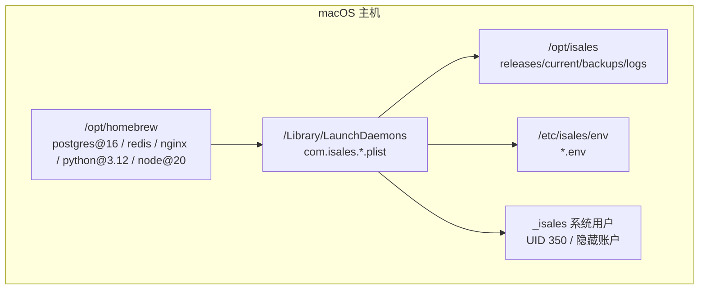
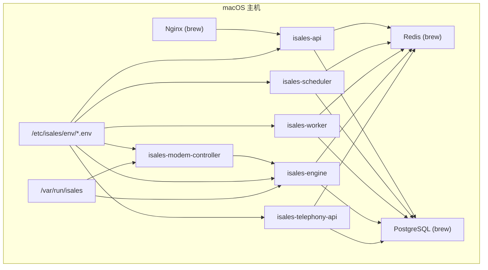
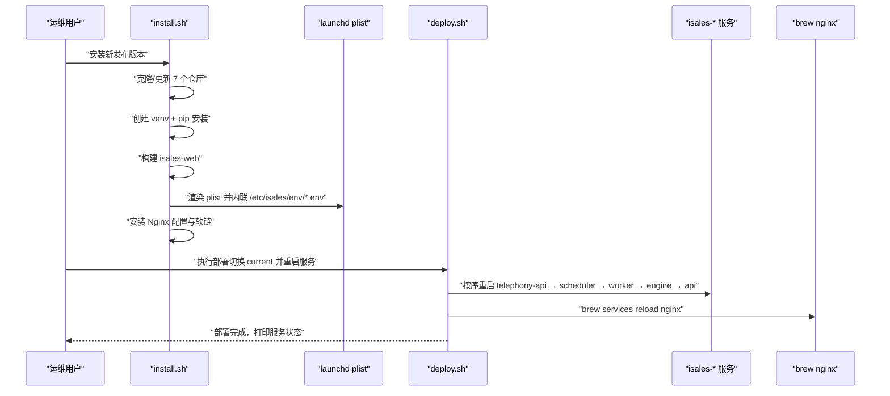
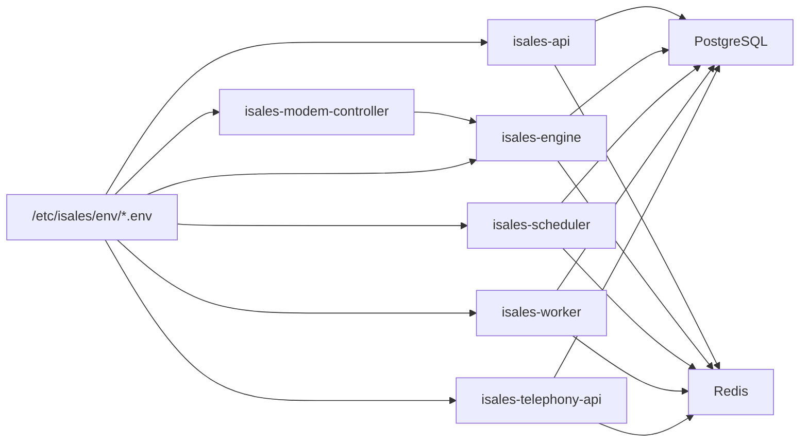

# 部署概览

<cite>
**本文引用的文件**
- [README.md](file://deploy/macos/README.md)
- [provision.sh](file://deploy/macos/scripts/provision.sh)
- [_lib.sh](file://deploy/macos/scripts/_lib.sh)
- [install.sh](file://deploy/macos/scripts/install.sh)
- [deploy.sh](file://deploy/macos/scripts/deploy.sh)
- [api.env.example](file://deploy/env/api.env.example)
- [engine.env.example](file://deploy/env/engine.env.example)
- [scheduler.env.example](file://deploy/env/scheduler.env.example)
- [worker.env.example](file://deploy/env/worker.env.example)
- [telephony-api.env.example](file://deploy/env/telephony-api.env.example)
- [modem-controller.env.example](file://deploy/env/modem-controller.env.example)
- [com.isales.api.plist](file://deploy/macos/plist/com.isales.api.plist)
- [com.isales.engine.plist](file://deploy/macos/plist/com.isales.engine.plist)
- [com.isales.scheduler.plist](file://deploy/macos/plist/com.isales.scheduler.plist)
- [com.isales.worker.plist](file://deploy/macos/plist/com.isales.worker.plist)
</cite>

## 目录
1. [简介](#简介)
2. [项目结构](#项目结构)
3. [核心组件](#核心组件)
4. [架构总览](#架构总览)
5. [详细组件分析](#详细组件分析)
6. [依赖关系分析](#依赖关系分析)
7. [性能考虑](#性能考虑)
8. [故障排查指南](#故障排查指南)
9. [结论](#结论)
10. [附录](#附录)

## 简介
本文件面向 iSales v1 在 macOS 14+ Apple Silicon 平台的单主机部署模型，提供从设计理念、架构特点到运维细节的全景式说明。重点对比与 Linux 部署的关键差异，包括服务管理方式（launchd vs systemd）、包管理工具（brew vs apt）、日志查询方法（log show vs journalctl）、以及统一的目录结构与系统用户策略。同时，系统性阐述 6 个核心服务的职责分工，并给出完整部署流程与快速开始指南。

## 项目结构
macOS 部署采用“统一目录 + launchd 服务 + Homebrew 包”的组合方案：
- 统一目录结构：/opt/isales（发布版本、当前软链、备份、日志）与 /etc/isales/env（集中化环境变量）
- 服务管理：/Library/LaunchDaemons 下的 6 个服务 plist，以及每日备份与运行时引导任务
- 包管理：Homebrew（/opt/homebrew）安装 PostgreSQL、Redis、Nginx、Python、Node 等
- 系统用户：_isales（UID 350，隐藏用户），用于隔离服务运行与权限收敛

图表来源
- [README.md: 26-32:26-32](file://deploy/macos/README.md#L26-L32)
- [_lib.sh: 21](file://deploy/macos/scripts/_lib.sh#L21)
- [_lib.sh: 45-55:45-55](file://deploy/macos/scripts/_lib.sh#L45-L55)

章节来源
- [README.md: 26-32:26-32](file://deploy/macos/README.md#L26-L32)
- [_lib.sh: 21](file://deploy/macos/scripts/_lib.sh#L21)
- [_lib.sh: 45-55:45-55](file://deploy/macos/scripts/_lib.sh#L45-L55)

## 核心组件
- 统一目录与环境
  - /opt/isales：发布版本目录、当前软链、备份与日志
  - /etc/isales/env：各服务的集中化环境变量文件，由 install.sh 内联到 launchd plist 的 EnvironmentVariables
- 系统用户策略
  - _isales：隐藏系统用户（UID 350），所有服务以该用户运行，最小权限原则
- 6 个核心服务
  - isales-api：HTTP + WebSocket API
  - isales-engine：实时通话引擎
  - isales-scheduler：线索调度
  - isales-worker：Celery 异步处理器
  - isales-telephony-api：设备/SIM CRUD 的 Telephony API
  - isales-modem-controller：USB GSM 调制解调器守护进程
- 辅助任务
  - com.isales.bootstrap-runtime：开机引导创建 /var/run/isales
  - com.isales.backup：每日备份（PG/Redis）

章节来源
- [README.md: 13-19:13-19](file://deploy/macos/README.md#L13-L19)
- [README.md: 26-32:26-32](file://deploy/macos/README.md#L26-L32)
- [_lib.sh: 45-55:45-55](file://deploy/macos/scripts/_lib.sh#L45-L55)

## 架构总览
下图展示 macOS 单主机部署的整体交互：Homebrew 提供数据库与中间件，launchd 托管 6 个服务，Nginx 作为反向代理与静态资源服务，_isales 用户承载服务运行与数据持久化。

图表来源
- [README.md: 21-24:21-24](file://deploy/macos/README.md#L21-L24)
- [README.md: 26-32:26-32](file://deploy/macos/README.md#L26-L32)
- [com.isales.api.plist: 12-18:12-18](file://deploy/macos/plist/com.isales.api.plist#L12-L18)
- [com.isales.engine.plist: 12-18:12-18](file://deploy/macos/plist/com.isales.engine.plist#L12-L18)
- [com.isales.scheduler.plist: 12-18:12-18](file://deploy/macos/plist/com.isales.scheduler.plist#L12-L18)
- [com.isales.worker.plist: 12-18:12-18](file://deploy/macos/plist/com.isales.worker.plist#L12-L18)

## 详细组件分析

### 服务职责与配置要点
- isales-api
  - 运行于 _isales 用户，工作目录位于当前版本的 isales-api 子目录
  - 日志输出至 /opt/isales/logs/api.{out,err}.log
  - 通过 /etc/isales/env/api.env 注入数据库、Redis、JWT 等参数
- isales-engine
  - 实时通话引擎，负责 AI 管道、ASR/TTS、通话状态机
  - 依赖 Redis 与 PostgreSQL，日志输出至 /opt/isales/logs/engine.{out,err}.log
- isales-scheduler
  - 周期性调度线索，批量大小、并发度、历史窗口等参数可配置
  - 通过 /etc/isales/env/scheduler.env 控制调度行为
- isales-worker
  - Celery 异步处理器，负责 Webhook 回调、指标采集、重试逻辑
  - 通过 /etc/isales/env/worker.env 配置加密密钥与重试策略
- isales-telephony-api
  - 设备与 SIM 的 CRUD 接口，与 isales-api 共享 JWT 签发/验签密钥
  - 通过 /etc/isales/env/telephony-api.env 注入数据库与 Redis
- isales-modem-controller
  - USB GSM 调制解调器守护进程，与引擎通过 Unix Socket 通信
  - 通过 /etc/isales/env/modem-controller.env 指定 IPC 套接字路径

章节来源
- [com.isales.api.plist: 12-34:12-34](file://deploy/macos/plist/com.isales.api.plist#L12-L34)
- [com.isales.engine.plist: 12-34:12-34](file://deploy/macos/plist/com.isales.engine.plist#L12-L34)
- [com.isales.scheduler.plist: 12-34:12-34](file://deploy/macos/plist/com.isales.scheduler.plist#L12-L34)
- [com.isales.worker.plist: 12-34:12-34](file://deploy/macos/plist/com.isales.worker.plist#L12-L34)
- [api.env.example: 9-13:9-13](file://deploy/env/api.env.example#L9-L13)
- [engine.env.example: 8-20:8-20](file://deploy/env/engine.env.example#L8-L20)
- [scheduler.env.example: 12-20:12-20](file://deploy/env/scheduler.env.example#L12-L20)
- [worker.env.example: 9-19:9-19](file://deploy/env/worker.env.example#L9-L19)
- [telephony-api.env.example: 9-11:9-11](file://deploy/env/telephony-api.env.example#L9-L11)
- [modem-controller.env.example: 7-10:7-10](file://deploy/env/modem-controller.env.example#L7-L10)

### 部署流程与控制流（install.sh → deploy.sh）
- install.sh 步骤
  - 准备发布目录并同步元仓库 deploy/ 子树
  - 克隆/更新 7 个仓库到指定 Git Ref
  - 使用 Homebrew 的 python@3.12 创建共享虚拟环境并安装依赖
  - 构建 isales-web（npm ci + npm run build），生成 dist/
  - 将 /etc/isales/env/<svc>.env 内联到 /Library/LaunchDaemons/com.isales.<svc>.plist 的 EnvironmentVariables
  - 安装 Nginx 配置与静态资源软链
- deploy.sh 步骤
  - 低峰窗口校验（默认 22:00–08:00 当地时间），强制重启引擎前需显式传入 --force
  - 切换 /opt/isales/current 软链指向新版本
  - 按顺序重启服务（telephony-api → scheduler → worker → engine → api）
  - 通过 brew services 重启 Nginx（以原 sudo 用户身份执行 user/<uid> 的 nginx）
  - 可选重启调制解调器控制器（--include-modem）

图表来源
- [install.sh: 108-133:108-133](file://deploy/macos/scripts/install.sh#L108-L133)
- [install.sh: 137-155:137-155](file://deploy/macos/scripts/install.sh#L137-L155)
- [install.sh: 159-175:159-175](file://deploy/macos/scripts/install.sh#L159-L175)
- [install.sh: 179-186:179-186](file://deploy/macos/scripts/install.sh#L179-L186)
- [install.sh: 189-320:189-320](file://deploy/macos/scripts/install.sh#L189-L320)
- [install.sh: 324-399:324-399](file://deploy/macos/scripts/install.sh#L324-L399)
- [deploy.sh: 17-24:17-24](file://deploy/macos/scripts/deploy.sh#L17-L24)
- [deploy.sh: 119-171:119-171](file://deploy/macos/scripts/deploy.sh#L119-L171)
- [deploy.sh: 145-162:145-162](file://deploy/macos/scripts/deploy.sh#L145-L162)

章节来源
- [install.sh: 108-133:108-133](file://deploy/macos/scripts/install.sh#L108-L133)
- [install.sh: 137-155:137-155](file://deploy/macos/scripts/install.sh#L137-L155)
- [install.sh: 159-175:159-175](file://deploy/macos/scripts/install.sh#L159-L175)
- [install.sh: 179-186:179-186](file://deploy/macos/scripts/install.sh#L179-L186)
- [install.sh: 189-320:189-320](file://deploy/macos/scripts/install.sh#L189-L320)
- [install.sh: 324-399:324-399](file://deploy/macos/scripts/install.sh#L324-L399)
- [deploy.sh: 17-24:17-24](file://deploy/macos/scripts/deploy.sh#L17-L24)
- [deploy.sh: 119-171:119-171](file://deploy/macos/scripts/deploy.sh#L119-L171)
- [deploy.sh: 145-162:145-162](file://deploy/macos/scripts/deploy.sh#L145-L162)

### 环境变量与一致性校验
- 数据库与缓存连接
  - 所有服务均使用 /etc/isales/env 下的 *.env 注入 ISALES_DATABASE_URL 与 ISALES_REDIS_URL
  - API、Engine、Scheduler、Worker、Telephony-API 之间需保持数据库与 Redis URL 一致
- 认证与加密
  - API 与 Telephony-API 共享 ISALES_JWT_SECRET（HS256 签发/验签对）
  - Worker 需要 ISALES_FERNET_KEY 与 isales-api 保持一致
- 时区与本地化
  - 多数服务通过 TZ=Asia/Shanghai 指定时区

章节来源
- [api.env.example: 4-13:4-13](file://deploy/env/api.env.example#L4-L13)
- [engine.env.example: 4-6:4-6](file://deploy/env/engine.env.example#L4-L6)
- [scheduler.env.example: 4-10:4-10](file://deploy/env/scheduler.env.example#L4-L10)
- [worker.env.example: 4-7:4-7](file://deploy/env/worker.env.example#L4-L7)
- [telephony-api.env.example: 4-11:4-11](file://deploy/env/telephony-api.env.example#L4-L11)

### 目录结构与系统用户
- 目录骨架
  - /opt/isales：发布版本、当前软链、备份（PG/Redis）、日志
  - /etc/isales/env：集中化 *.env
  - /var/run/isales：Unix 域套接字绑定目录，开机由引导任务重建
- 系统用户
  - _isales：UID 350，隐藏用户（IsHidden 1），shell /usr/bin/false
  - 所有服务以该用户运行，降低权限暴露面

章节来源
- [README.md: 26-32:26-32](file://deploy/macos/README.md#L26-L32)
- [_lib.sh: 45-55:45-55](file://deploy/macos/scripts/_lib.sh#L45-L55)

## 依赖关系分析
- 服务间依赖
  - API、Engine、Scheduler、Worker、Telephony-API 共同依赖 PostgreSQL 与 Redis
  - Engine 与 Modem-Controller 通过 /var/run/isales 通信
- 外部依赖
  - Homebrew 提供 postgresql@16、redis、nginx、python@3.12、node@20、pkg-config、git
- 环境注入差异
  - Linux：systemd EnvironmentFile=
  - macOS：install.sh 使用 plistlib 将 /etc/isales/env/*.env 内联到 plist 的 EnvironmentVariables

图表来源
- [README.md: 21-24:21-24](file://deploy/macos/README.md#L21-L24)
- [README.md: 26-32:26-32](file://deploy/macos/README.md#L26-L32)
- [api.env.example: 9-10:9-10](file://deploy/env/api.env.example#L9-L10)
- [engine.env.example: 8-9:8-9](file://deploy/env/engine.env.example#L8-L9)
- [scheduler.env.example: 12-13:12-13](file://deploy/env/scheduler.env.example#L12-L13)
- [worker.env.example: 9-10:9-10](file://deploy/env/worker.env.example#L9-L10)
- [telephony-api.env.example: 9-10:9-10](file://deploy/env/telephony-api.env.example#L9-L10)
- [modem-controller.env.example: 7,10](file://deploy/env/modem-controller.env.example#L7)

章节来源
- [README.md: 21-24:21-24](file://deploy/macos/README.md#L21-L24)
- [README.md: 26-32:26-32](file://deploy/macos/README.md#L26-L32)
- [api.env.example: 9-10:9-10](file://deploy/env/api.env.example#L9-L10)
- [engine.env.example: 8-9:8-9](file://deploy/env/engine.env.example#L8-L9)
- [scheduler.env.example: 12-13:12-13](file://deploy/env/scheduler.env.example#L12-L13)
- [worker.env.example: 9-10:9-10](file://deploy/env/worker.env.example#L9-L10)
- [telephony-api.env.example: 9-10:9-10](file://deploy/env/telephony-api.env.example#L9-L10)
- [modem-controller.env.example: 7,10](file://deploy/env/modem-controller.env.example#L7)

## 性能考虑
- 低峰窗口部署
  - deploy.sh 默认在 22:00–08:00 当地时间拒绝重启引擎（避免中断通话），可通过 --force 强制
- Redis AOF
  - provision.sh 将 appendonly=yes 与 appendfsync=everysec 写入 redis.conf，并通过 CONFIG SET 生效，兼顾持久化与吞吐
- Nginx 文档根与监听端口
  - install.sh 将模板中的 /var/www 替换为 $BREW_PREFIX/var/www，并将监听端口从 80 改为 8080（brew nginx 以非 root 用户运行）
- 进程生命周期
  - launchd KeepAlive 配置为 SuccessfulExit=false，确保异常退出时自动重启

章节来源
- [deploy.sh: 23-24:23-24](file://deploy/macos/scripts/deploy.sh#L23-L24)
- [deploy.sh: 62-77:62-77](file://deploy/macos/scripts/deploy.sh#L62-L77)
- [provision.sh: 148-190:148-190](file://deploy/macos/scripts/provision.sh#L148-L190)
- [install.sh: 324-399:324-399](file://deploy/macos/scripts/install.sh#L324-L399)
- [com.isales.api.plist: 24-28:24-28](file://deploy/macos/plist/com.isales.api.plist#L24-L28)

## 故障排查指南
- 服务状态与日志
  - macOS：使用 launchctl print system/<label> 查看 state；使用 log show 查询最近 5 分钟日志
  - Linux：使用 systemctl is-active <svc> 与 journalctl -u <svc> -n 50
- 环境变量生效
  - macOS：编辑 /etc/isales/env/*.env 后必须重新运行 install.sh 或手动 bootout/bootstrap 对应 plist，否则不生效
- Nginx 重启
  - macOS：通过 brew services reload nginx（以原 sudo 用户身份执行 user/<uid> 的 nginx）
- PostgreSQL/Redis 初始化
  - provision.sh 已创建角色、数据库与随机密钥；若已有则跳过
- 引导任务
  - com.isales.bootstrap-runtime 在重启后重建 /var/run/isales，确保引擎与调制解调器的套接字可用

章节来源
- [README.md: 71-84:71-84](file://deploy/macos/README.md#L71-L84)
- [README.md: 85-93:85-93](file://deploy/macos/README.md#L85-L93)
- [deploy.sh: 137-142:137-142](file://deploy/macos/scripts/deploy.sh#L137-L142)
- [provision.sh: 210-265:210-265](file://deploy/macos/scripts/provision.sh#L210-L265)
- [install.sh: 254-272:254-272](file://deploy/macos/scripts/install.sh#L254-L272)

## 结论
macOS 单主机部署以统一目录与集中化环境为核心，结合 Homebrew 包管理与 launchd 服务托管，形成与 Linux 部署高度一致的运行时体验。通过严格的低峰窗口、AOF 持久化、内联环境注入与隐藏系统用户策略，实现安全、可控、可观测的生产级部署形态。6 个核心服务职责清晰、依赖明确，配合 Nginx 与数据库/缓存栈，满足门店/现场拨号工作站的高可用需求。

## 附录

### 快速开始指南
- 1. 安装 Homebrew（如未安装）
- 2. 主机初始化（provision.sh：安装 brew 包、创建 _isales 用户、目录骨架、初始化 Redis AOF、初始化 PostgreSQL 角色/数据库）
- 3. 编辑集中化 env（/etc/isales/env/*.env，填写真实密钥与连接串）
- 4. 安装新发布版本（install.sh：克隆仓库、创建 venv、构建前端、渲染 plist、安装 Nginx）
- 5. 数据库迁移（migrate.sh）
- 6. 切换 current 并重启服务（deploy.sh：按序重启、可选重启调制解调器）

章节来源
- [README.md: 48-69:48-69](file://deploy/macos/README.md#L48-L69)

### 与 Linux 部署的关键差异速查
- 服务管理：systemctl vs launchctl（重启命令、状态查询）
- 日志查询：journalctl vs log show
- 环境注入：systemd EnvironmentFile= vs install.sh 内联到 plist 的 EnvironmentVariables
- 包管理：apt vs brew（需以非 root 身份运行）
- nginx：systemd reload vs brew services reload
- 备份触发：Linux cron vs macOS launchd（每日 02:30）
- USB 监听与音频后端：Linux netlink + ALSA vs macOS 轮询 + Core Audio

章节来源
- [README.md: 71-84:71-84](file://deploy/macos/README.md#L71-L84)