# 部署脚本详解

<cite>
**本文档引用的文件**
- [provision.sh](file://deploy/macos/scripts/provision.sh)
- [install.sh](file://deploy/macos/scripts/install.sh)
- [migrate.sh](file://deploy/macos/scripts/migrate.sh)
- [deploy.sh](file://deploy/macos/scripts/deploy.sh)
- [rollback.sh](file://deploy/macos/scripts/rollback.sh)
- [_lib.sh](file://deploy/macos/scripts/_lib.sh)
- [common/_lib.sh](file://deploy/common/_lib.sh)
- [README.md](file://deploy/macos/README.md)
- [api.env.example](file://deploy/env/api.env.example)
- [com.isales.api.plist](file://deploy/macos/plist/com.isales.api.plist)
- [backup_pg.sh](file://deploy/macos/scripts/backup_pg.sh)
- [backup_redis.sh](file://deploy/macos/scripts/backup_redis.sh)
- [com.isales.bootstrap-runtime.plist](file://deploy/macos/launchd-jobs/com.isales.bootstrap-runtime.plist)
- [com.isales.backup.plist](file://deploy/macos/launchd-jobs/com.isales.backup.plist)
</cite>

## 目录
1. [简介](#简介)
2. [项目结构](#项目结构)
3. [核心组件](#核心组件)
4. [架构概览](#架构概览)
5. [详细组件分析](#详细组件分析)
6. [依赖关系分析](#依赖关系分析)
7. [性能考虑](#性能考虑)
8. [故障排除指南](#故障排除指南)
9. [结论](#结论)

## 简介

iSales macOS 部署脚本是一套完整的自动化部署工具集，专为 macOS 14+ (Apple Silicon) 设计。这套脚本提供了从主机预配置到服务部署的完整生命周期管理，确保 iSales 系统能够在单台 macOS 主机上稳定运行。

该部署系统采用现代 DevOps 最佳实践，通过分层架构实现了高度的模块化和可维护性。每个脚本都有明确的职责分工，遵循"单一职责原则"，并通过标准化的接口进行交互。

## 项目结构

iSales macOS 部署系统采用清晰的分层组织结构：

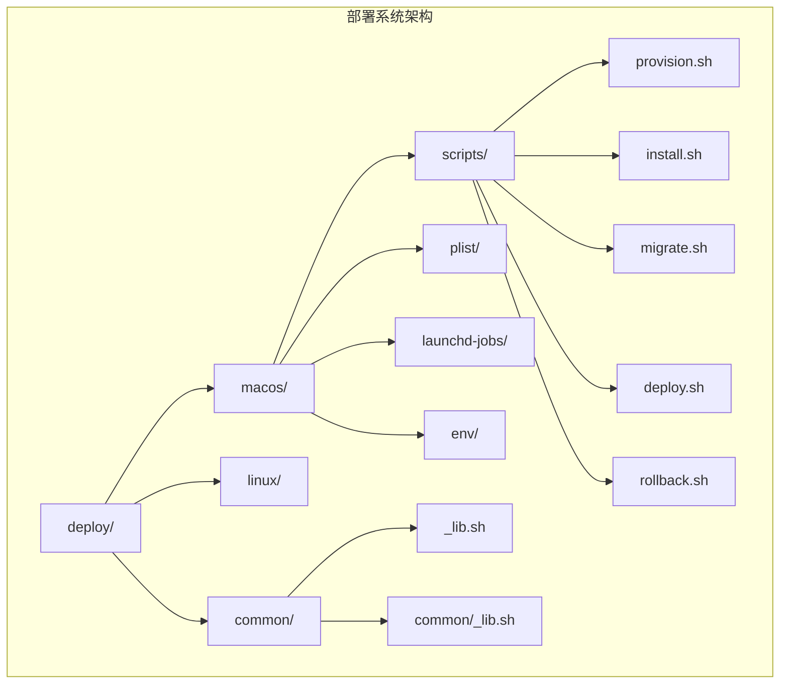

**图表来源**
- [provision.sh:1-280](file://deploy/macos/scripts/provision.sh#L1-L280)
- [install.sh:1-417](file://deploy/macos/scripts/install.sh#L1-L417)
- [_lib.sh:1-69](file://deploy/macos/scripts/_lib.sh#L1-L69)

**章节来源**
- [README.md:1-98](file://deploy/macos/README.md#L1-L98)

## 核心组件

### 主要部署脚本概览

iSales macOS 部署系统包含五个核心脚本，每个都承担特定的部署职责：

| 脚本名称 | 主要功能 | 执行时机 | 关键特性 |
|---------|----------|----------|----------|
| provision.sh | 主机预配置 | 首次部署前 | Homebrew 包安装、系统用户创建、目录结构初始化 |
| install.sh | 版本安装 | 新版本发布时 | Git 仓库克隆、Python 虚拟环境创建、npm 构建 |
| migrate.sh | 数据库迁移 | 安装后部署前 | Alembic 迁移执行、数据库模式升级 |
| deploy.sh | 服务部署 | 正式上线时 | 原子性切换软链接、服务有序重启 |
| rollback.sh | 回滚机制 | 发生问题时 | 版本回退、服务重启、安全确认 |

### 平台特定配置

系统针对 macOS 平台进行了专门优化：

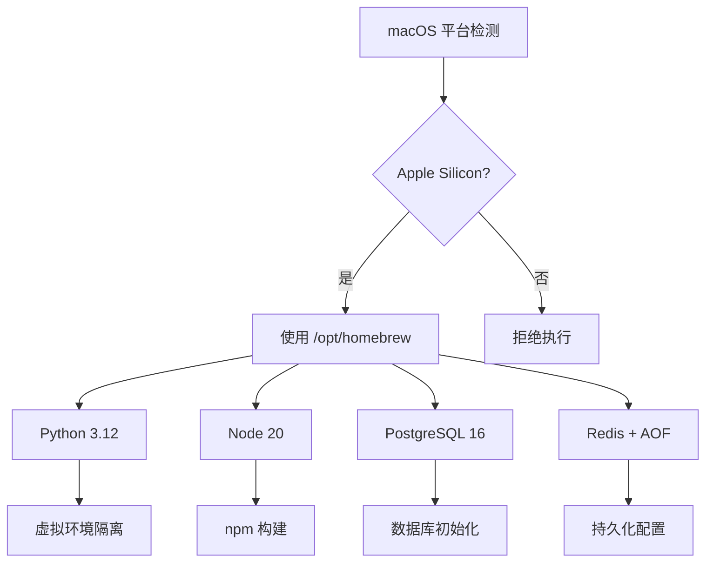

**图表来源**
- [_lib.sh:17-35](file://deploy/macos/scripts/_lib.sh#L17-L35)
- [_lib.sh:57-68](file://deploy/macos/scripts/_lib.sh#L57-L68)

**章节来源**
- [_lib.sh:1-69](file://deploy/macos/scripts/_lib.sh#L1-L69)

## 架构概览

### 整体部署流程

iSales macOS 部署系统采用流水线式的部署架构，确保每个步骤的原子性和可恢复性：

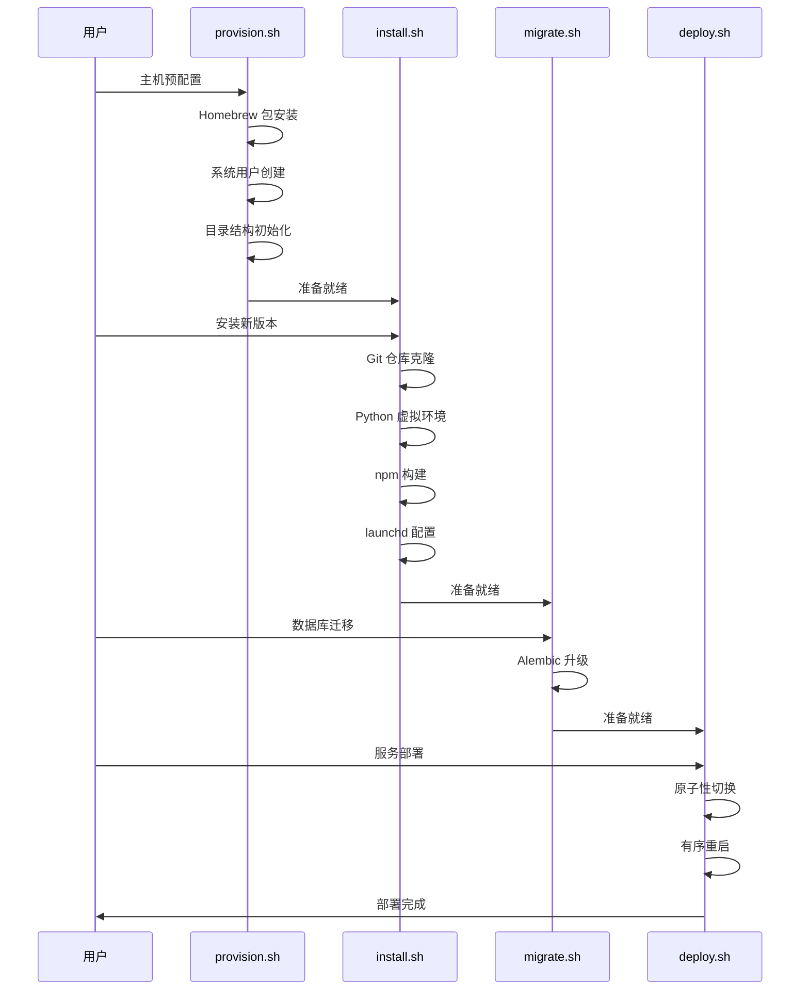

**图表来源**
- [provision.sh:269-277](file://deploy/macos/scripts/provision.sh#L269-L277)
- [install.sh:403-414](file://deploy/macos/scripts/install.sh#L403-L414)
- [migrate.sh:61-72](file://deploy/macos/scripts/migrate.sh#L61-L72)
- [deploy.sh:192-198](file://deploy/macos/scripts/deploy.sh#L192-L198)

### 服务架构设计

系统采用 launchd 服务管理器，提供高可靠性的服务运行环境：

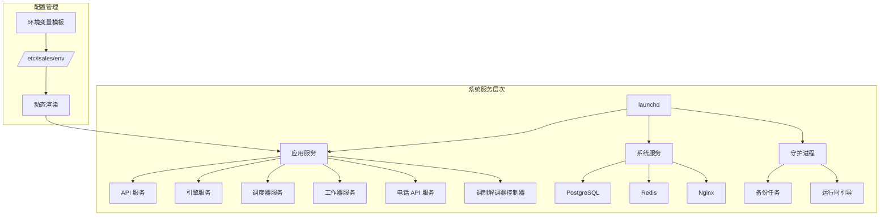

**图表来源**
- [README.md:7-32](file://deploy/macos/README.md#L7-L32)
- [com.isales.api.plist:1-37](file://deploy/macos/plist/com.isales.api.plist#L1-L37)

**章节来源**
- [README.md:1-98](file://deploy/macos/README.md#L1-L98)

## 详细组件分析

### provision.sh - 主机预配置

#### 功能概述

provision.sh 是整个部署流程的第一步，负责将 macOS 主机配置为 iSales 系统的运行环境。该脚本具有幂等性，可以安全地重复执行而不会破坏现有配置。

#### 核心步骤详解

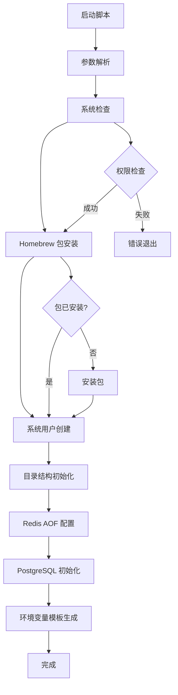

**图表来源**
- [provision.sh:48-78](file://deploy/macos/scripts/provision.sh#L48-L78)
- [provision.sh:82-116](file://deploy/macos/scripts/provision.sh#L82-L116)
- [provision.sh:133-144](file://deploy/macos/scripts/provision.sh#L133-L144)

#### 关键特性

1. **幂等性保证**: 重复执行不会破坏现有配置
2. **安全执行**: 通过 SUDO_USER 确保 Homebrew 以正确用户身份运行
3. **系统集成**: 使用 dscl 创建符合 macOS 标准的系统用户

#### 参数说明

| 参数 | 类型 | 描述 | 默认值 |
|------|------|------|--------|
| --dry-run | 标志 | 仅显示将要执行的操作 | false |
| --help | 标志 | 显示帮助信息 | - |

**章节来源**
- [provision.sh:1-280](file://deploy/macos/scripts/provision.sh#L1-L280)

### install.sh - 版本安装

#### 功能概述

install.sh 负责将指定版本的 iSales 代码部署到目标主机。该脚本执行完整的构建流程，包括代码获取、依赖安装、构建和配置。

#### 完整构建流程

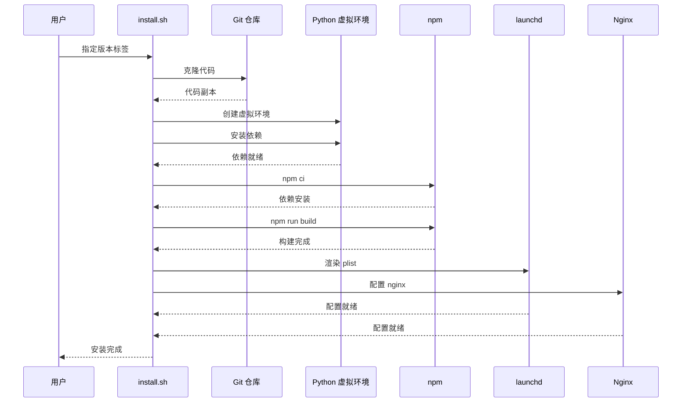

**图表来源**
- [install.sh:108-155](file://deploy/macos/scripts/install.sh#L108-L155)
- [install.sh:157-175](file://deploy/macos/scripts/install.sh#L157-L175)
- [install.sh:177-186](file://deploy/macos/scripts/install.sh#L177-L186)

#### 支持的服务列表

| 服务名称 | 依赖项 | 特殊配置 |
|----------|--------|----------|
| isales-api | FastAPI | 标准安装 |
| isales-engine | 实时通话引擎 | 标准安装 |
| isales-scheduler | 调度服务 | 标准安装 |
| isales-worker | Celery 工作器 | 标准安装 |
| isales-telephony | 电话服务 | `[macos]` 额外依赖 |
| isales-web | Web 前端 | 需要 npm 构建 |

#### 环境变量注入机制

install.sh 采用独特的环境变量注入方式，通过 Python plistlib 将环境变量直接内联到 launchd 配置中：

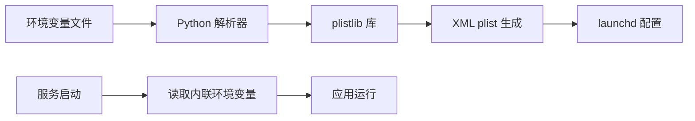

**图表来源**
- [install.sh:208-237](file://deploy/macos/scripts/install.sh#L208-L237)
- [com.isales.api.plist:33-34](file://deploy/macos/plist/com.isales.api.plist#L33-L34)

**章节来源**
- [install.sh:1-417](file://deploy/macos/scripts/install.sh#L1-L417)

### migrate.sh - 数据库迁移

#### 功能概述

migrate.sh 专门负责执行数据库模式迁移，使用 Alembic 工具确保数据库结构与代码版本保持同步。

#### 迁移执行流程

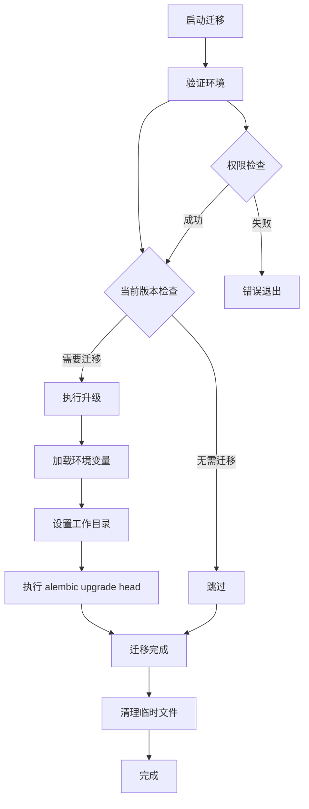

**图表来源**
- [migrate.sh:41-48](file://deploy/macos/scripts/migrate.sh#L41-L48)
- [migrate.sh:61-72](file://deploy/macos/scripts/migrate.sh#L61-L72)

#### 安全特性

1. **用户权限控制**: 以 `_isales` 用户身份执行，避免权限问题
2. **环境变量隔离**: 通过环境变量传递数据库连接信息
3. **工作目录保护**: 切换到可访问的目录避免导入错误

**章节来源**
- [migrate.sh:1-73](file://deploy/macos/scripts/migrate.sh#L1-L73)

### deploy.sh - 服务部署

#### 功能概述

deploy.sh 是部署流程的最后一步，负责将新版本通过原子性操作切换到生产环境，并按正确的顺序重启相关服务。

#### 有序重启策略

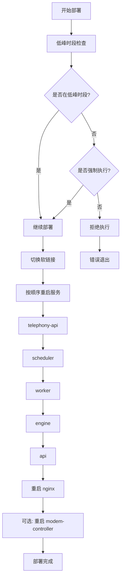

**图表来源**
- [deploy.sh:60-77](file://deploy/macos/scripts/deploy.sh#L60-L77)
- [deploy.sh:81-87](file://deploy/macos/scripts/deploy.sh#L81-L87)
- [deploy.sh:119-171](file://deploy/macos/scripts/deploy.sh#L119-L171)

#### 服务重启顺序

部署系统严格遵循服务间的依赖关系：

1. **com.isales.telephony-api**: 电话 API 服务
2. **com.isales.scheduler**: 调度服务
3. **com.isales.worker**: 工作器服务
4. **com.isales.engine**: 引擎服务
5. **com.isales.api**: API 服务

#### 低峰时段保护

系统内置了智能的低峰时段保护机制，防止在业务高峰期执行可能影响通话质量的引擎重启：

- **默认窗口**: 22:00-08:00 (本地时间)
- **强制执行**: 通过 `--force` 参数绕过保护
- **实时检查**: 每次部署时动态计算当前时间

**章节来源**
- [deploy.sh:1-201](file://deploy/macos/scripts/deploy.sh#L1-L201)

### rollback.sh - 回滚机制

#### 功能概述

rollback.sh 提供了完整的版本回滚能力，允许在出现问题时快速恢复到之前的稳定版本。

#### 回滚执行流程

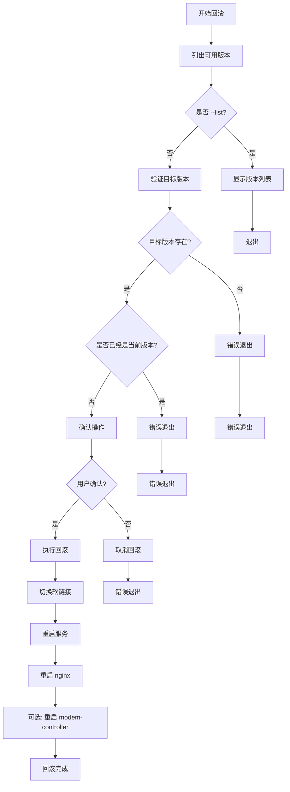

**图表来源**
- [rollback.sh:47-69](file://deploy/macos/scripts/rollback.sh#L47-L69)
- [rollback.sh:84-93](file://deploy/macos/scripts/rollback.sh#L84-L93)
- [rollback.sh:105-125](file://deploy/macos/scripts/rollback.sh#L105-L125)

#### 安全特性

1. **版本验证**: 确保目标版本存在且包含完整依赖
2. **用户确认**: 防止误操作的关键安全措施
3. **原子性操作**: 通过软链接切换实现无中断回滚
4. **服务重启**: 自动重启相关服务确保一致性

**章节来源**
- [rollback.sh:1-129](file://deploy/macos/scripts/rollback.sh#L1-L129)

## 依赖关系分析

### 脚本间依赖关系

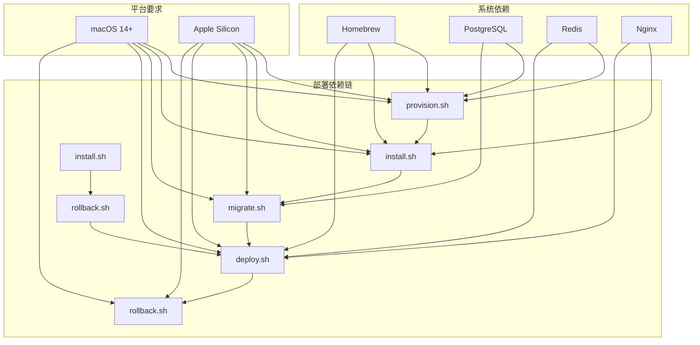

**图表来源**
- [provision.sh:45-46](file://deploy/macos/scripts/provision.sh#L45-L46)
- [install.sh:64-65](file://deploy/macos/scripts/install.sh#L64-L65)
- [migrate.sh:35-36](file://deploy/macos/scripts/migrate.sh#L35-L36)
- [deploy.sh:51-52](file://deploy/macos/scripts/deploy.sh#L51-L52)

### 环境变量依赖

系统通过集中化的环境变量管理系统确保各服务间的一致性：

```mermaid
erDiagram
ENV_FILE {
string ISALES_DATABASE_URL
string ISALES_REDIS_URL
string ISALES_JWT_SECRET
string ISALES_ADMIN_USER
string ISALES_ADMIN_PASSWORD_HASH
}
SERVICE {
string service_name
string env_file
string config_path
}
ENV_FILE ||--|| SERVICE : "配置"
subgraph "服务类型"
API_SERVICE {
string api.env
string isales-api
}
ENGINE_SERVICE {
string engine.env
string isales-engine
}
SCHEDULER_SERVICE {
string scheduler.env
string isales-scheduler
}
WORKER_SERVICE {
string worker.env
string isales-worker
}
TELEPHONY_SERVICE {
string telephony-api.env
string isales-telephony-api
}
MODEM_SERVICE {
string modem-controller.env
string isales-modem-controller
}
end
ENV_FILE ||--o{ API_SERVICE : "提供"
ENV_FILE ||--o{ ENGINE_SERVICE : "提供"
ENV_FILE ||--o{ SCHEDULER_SERVICE : "提供"
ENV_FILE ||--o{ WORKER_SERVICE : "提供"
ENV_FILE ||--o{ TELEPHONY_SERVICE : "提供"
ENV_FILE ||--o{ MODEM_SERVICE : "提供"
```

**图表来源**
- [api.env.example:1-14](file://deploy/env/api.env.example#L1-L14)
- [README.md:4-13](file://deploy/macos/README.md#L4-L13)

**章节来源**
- [api.env.example:1-14](file://deploy/env/api.env.example#L1-L14)
- [README.md:1-98](file://deploy/macos/README.md#L1-L98)

## 性能考虑

### 部署性能优化

1. **并行执行**: install.sh 中的 npm 构建和 Python 依赖安装可以并行进行
2. **缓存利用**: Homebrew 和 pip 缓存减少重复下载
3. **增量更新**: provision.sh 支持幂等执行，避免重复配置
4. **内存管理**: 使用临时文件和清理机制避免内存泄漏

### 运行时性能监控

系统提供了多种监控和诊断工具：

- **日志系统**: 每个服务都有独立的日志文件
- **健康检查**: 通过 launchctl 状态查询
- **性能指标**: 通过系统监控工具收集

## 故障排除指南

### 常见错误及解决方案

#### 权限相关错误

| 错误信息 | 原因 | 解决方案 |
|----------|------|----------|
| "must run as root" | 缺少 sudo 权限 | 使用 `sudo bash <script>` |
| "Homebrew not found" | Homebrew 未安装 | 安装 Homebrew 后重试 |
| "Permission denied" | 用户权限不足 | 确保使用正确的用户身份 |

#### 系统兼容性错误

| 错误信息 | 原因 | 解决方案 |
|----------|------|----------|
| "Apple Silicon required" | 非 Apple Silicon 架构 | 使用支持的硬件 |
| "macOS 14+ required" | 系统版本过低 | 升级到 macOS 14+ |
| "uname -m: x86_64" | 架构不匹配 | 使用 Apple Silicon 设备 |

#### 依赖缺失错误

| 错误信息 | 原因 | 解决方案 |
|----------|------|----------|
| "pg_dump not installed" | PostgreSQL 未安装 | 运行 provision.sh |
| "redis-cli not found" | Redis 未安装 | 运行 provision.sh |
| "nginx -t failed" | Nginx 配置错误 | 检查配置文件 |

#### 调试技巧

1. **Dry Run 模式**: 使用 `--dry-run` 参数预览操作
2. **详细日志**: 查看 `/opt/isales/logs/` 目录下的日志文件
3. **服务状态**: 使用 `launchctl print system/<label>` 检查服务状态
4. **环境变量**: 验证 `/etc/isales/env/` 下的配置文件

#### 诊断命令

```bash
# 检查服务状态
launchctl print system/com.isales.api

# 查看最近日志
log show --predicate 'subsystem == "com.isales.api"' --last 5m

# 验证配置
plutil -lint /Library/LaunchDaemons/com.isales.api.plist

# 检查磁盘空间
df -h /opt/isales
```

**章节来源**
- [deploy.sh:137-140](file://deploy/macos/scripts/deploy.sh#L137-L140)
- [README.md:95-98](file://deploy/macos/README.md#L95-L98)

## 结论

iSales macOS 部署脚本系统展现了现代 DevOps 实践的最佳实践。通过精心设计的模块化架构和严格的执行流程，该系统确保了部署过程的可靠性、可维护性和安全性。

### 主要优势

1. **模块化设计**: 每个脚本都有明确的职责，便于维护和测试
2. **幂等性保证**: 支持重复执行而不破坏现有配置
3. **安全机制**: 多层权限控制和确认机制
4. **监控诊断**: 完善的日志记录和状态查询能力
5. **回滚机制**: 快速恢复到稳定版本的能力

### 未来改进方向

1. **自动化测试**: 增加单元测试和集成测试覆盖率
2. **配置管理**: 考虑引入配置管理工具如 Ansible
3. **监控集成**: 集成更完善的监控和告警系统
4. **文档完善**: 增加更多的使用示例和最佳实践

这套部署脚本为 iSales 系统在 macOS 平台上的稳定运行提供了坚实的基础，体现了专业的软件工程实践和运维理念。