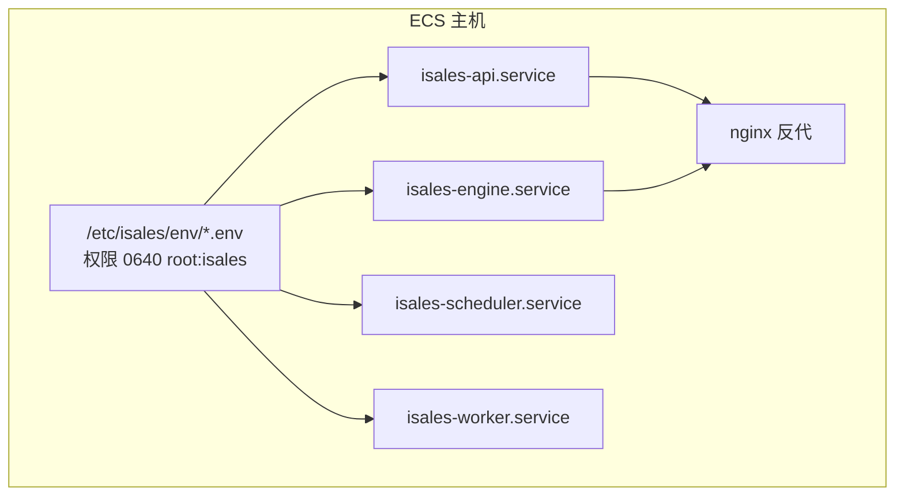
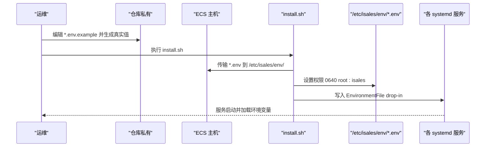
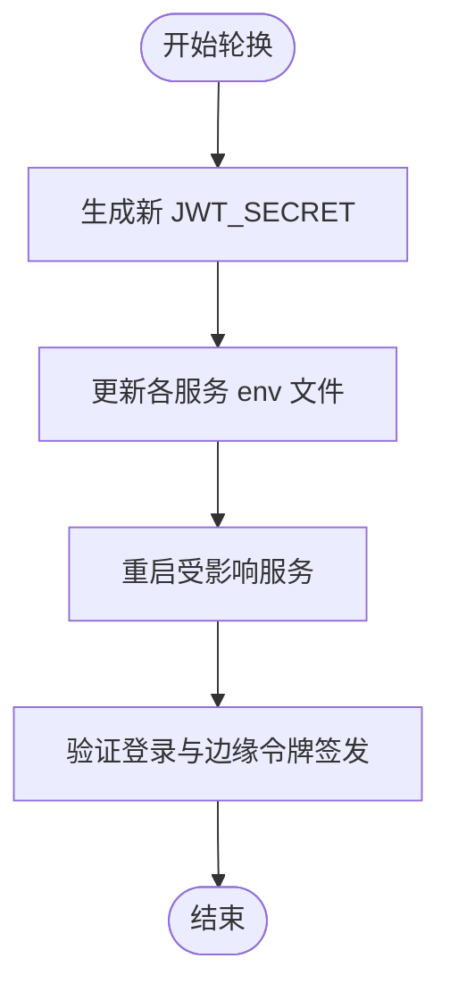
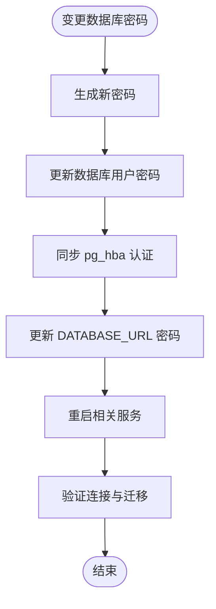
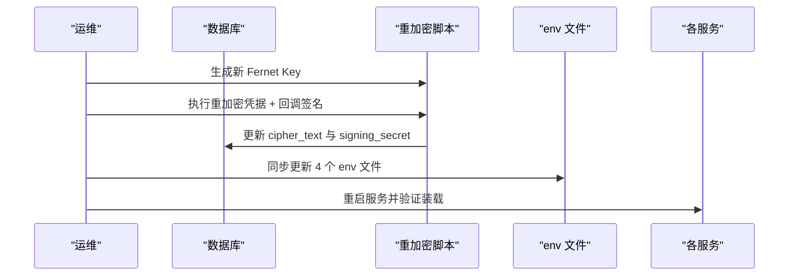
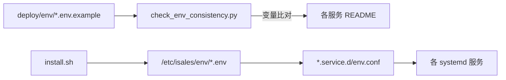

# 安全敏感变量

<cite>
**本文引用的文件**
- [SECRETS.md.example](file://deploy/cloud/env/SECRETS.md.example)
- [api.env.example](file://deploy/cloud/env/api.env.example)
- [engine.env.example](file://deploy/cloud/env/engine.env.example)
- [scheduler.env.example](file://deploy/cloud/env/scheduler.env.example)
- [worker.env.example](file://deploy/cloud/env/worker.env.example)
- [api.env.example（单主机）](file://deploy/env/api.env.example)
- [install.sh](file://deploy/cloud/scripts/install.sh)
- [check_env_consistency.py](file://deploy/linux/scripts/check_env_consistency.py)
- [RUNBOOK.md](file://deploy/RUNBOOK.md)
- [RUNBOOK-cloud.md](file://deploy/RUNBOOK-cloud.md)
- [cloud README.md](file://deploy/cloud/README.md)
- [cloud env README.md](file://deploy/cloud/env/README.md)
- [cloud STATE.md](file://deploy/cloud/STATE.md)
- [backup_pg.sh](file://deploy/linux/scripts/backup_pg.sh)
- [backup_redis.sh](file://deploy/linux/scripts/backup_redis.sh)
- [backup_pg.sh（macOS）](file://deploy/macos/scripts/backup_pg.sh)
- [backup_redis.sh（macOS）](file://deploy/macos/scripts/backup_redis.sh)
</cite>

## 目录
1. [简介](#简介)
2. [项目结构](#项目结构)
3. [核心组件](#核心组件)
4. [架构总览](#架构总览)
5. [详细组件分析](#详细组件分析)
6. [依赖关系分析](#依赖关系分析)
7. [性能考量](#性能考量)
8. [故障排查指南](#故障排查指南)
9. [结论](#结论)
10. [附录](#附录)

## 简介
本指南聚焦于安全敏感环境变量的配置与管理，覆盖以下关键变量：JWT_SECRET、DATABASE_URL（含密码）、ADMIN_PASSWORD_HASH、ISALES_FERNET_KEY（主密钥）等。文档提供密钥轮换策略、访问权限控制、加密存储方法、文件权限与位置、备份策略、最佳实践、常见漏洞防范与应急响应流程，帮助在生产环境中安全地部署与维护。

## 项目结构
- 环境变量集中存放于 /etc/isales/env/*.env，并通过 systemd drop-in EnvironmentFile 挂载到各服务进程。
- 云侧部署脚本负责生成/同步环境文件、安装依赖、启动服务。
- 运维手册提供轮换、恢复、排障与备份演练流程。
- 云侧状态文件记录当前已部署的变量与状态。

图表来源
- [install.sh:245-278](file://deploy/cloud/scripts/install.sh#L245-L278)
- [cloud README.md:47-51](file://deploy/cloud/README.md#L47-L51)

章节来源
- [cloud README.md:1-118](file://deploy/cloud/README.md#L1-L118)
- [install.sh:245-278](file://deploy/cloud/scripts/install.sh#L245-L278)

## 核心组件
- JWT_SECRET：用于前端用户会话与云-边设备令牌的 HS256 签名，轮换会导致用户重登与边缘设备重新签发令牌。
- DATABASE_URL：包含 PostgreSQL 用户名与密码，需与 pg_hba 配置一致，且仅内网可达。
- ADMIN_PASSWORD_HASH：管理员初始密码的 bcrypt 哈希，明文仅存于密码管理器。
- ISALES_FERNET_KEY：Fernet 对称密钥，4 个服务共享，用于 provider_credential 与 callback_config.signing_secret 的加密存储。

章节来源
- [api.env.example:8-21](file://deploy/cloud/env/api.env.example#L8-L21)
- [engine.env.example:8-27](file://deploy/cloud/env/engine.env.example#L8-L27)
- [scheduler.env.example:6-10](file://deploy/cloud/env/scheduler.env.example#L6-L10)
- [worker.env.example:6-25](file://deploy/cloud/env/worker.env.example#L6-L25)
- [cloud env README.md:28-47](file://deploy/cloud/env/README.md#L28-L47)

## 架构总览
云侧采用“集中化环境变量 + systemd drop-in”的方式，确保变量在进程启动时注入，且具备最小权限与统一轮换策略。

图表来源
- [install.sh:245-278](file://deploy/cloud/scripts/install.sh#L245-L278)
- [cloud env README.md:67-76](file://deploy/cloud/env/README.md#L67-L76)

章节来源
- [install.sh:245-278](file://deploy/cloud/scripts/install.sh#L245-L278)
- [cloud env README.md:67-76](file://deploy/cloud/env/README.md#L67-L76)

## 详细组件分析

### JWT_SECRET 安全配置
- 用途：前端用户会话签名与云-边设备令牌（edge-token）签发与验证，双方共享同一密钥。
- 轮换影响：轮换将导致所有用户强制重登，且边缘设备需重新签发令牌。
- 生成与存储：建议使用强随机源生成，仅在部署时写入各服务的 env 文件，并在 SECRETS.md（gitignored）与密码管理器中备份。

图表来源
- [api.env.example:10-13](file://deploy/cloud/env/api.env.example#L10-L13)
- [engine.env.example:63-64](file://deploy/cloud/env/engine.env.example#L63-L64)

章节来源
- [api.env.example:10-13](file://deploy/cloud/env/api.env.example#L10-L13)
- [engine.env.example:63-64](file://deploy/cloud/env/engine.env.example#L63-L64)
- [cloud env README.md:78-94](file://deploy/cloud/env/README.md#L78-L94)

### DATABASE_URL（含密码）安全配置
- 位置：各服务 env 文件中，值指向内网 RDS/Redis。
- 密码管理：密码变更需同步修改数据库用户密码与 pg_hba 配置，Redis 密码变更需编辑配置并重启服务。
- 访问控制：数据库仅监听 127.0.0.1，配合 pg_hba 使用 scram-sha-256 认证，禁止远程访问。

图表来源
- [api.env.example:8-9](file://deploy/cloud/env/api.env.example#L8-L9)
- [engine.env.example:8-9](file://deploy/cloud/env/engine.env.example#L8-L9)
- [cloud STATE.md:144-147](file://deploy/cloud/STATE.md#L144-L147)

章节来源
- [api.env.example:8-9](file://deploy/cloud/env/api.env.example#L8-L9)
- [engine.env.example:8-9](file://deploy/cloud/env/engine.env.example#L8-L9)
- [cloud STATE.md:144-147](file://deploy/cloud/STATE.md#L144-L147)
- [cloud env README.md:82-90](file://deploy/cloud/env/README.md#L82-L90)

### ADMIN_PASSWORD_HASH（bcrypt）安全配置
- 生成：使用 bcrypt 生成哈希，成本因子 12；明文密码仅存于密码管理器。
- 设置：在 api.env 中设置 ISALES_ADMIN_USER 与 ISALES_ADMIN_PASSWORD_HASH。
- 登录验证：若登录失败，检查哈希是否正确，必要时重新生成并重启 isales-api。

章节来源
- [RUNBOOK.md:33-35](file://deploy/RUNBOOK.md#L33-L35)
- [api.env.example（单主机）:11-13](file://deploy/env/api.env.example#L11-L13)
- [RUNBOOK.md:175-176](file://deploy/RUNBOOK.md#L175-L176)

### ISALES_FERNET_KEY（主密钥）安全配置
- 用途：provider_credential 表与 callback_config.signing_secret 的对称加密主密钥，4 个服务共享。
- 生成与备份：生成后同时写入 4 个 env 文件、SECRETS.md（gitignored）与密码管理器。
- 轮换流程：生成新密钥后，需重加密数据库中的凭据与回调签名密钥，然后同步更新 env 文件并重启服务。
- 灾难恢复：主密钥丢失意味着所有凭据不可恢复，需重建凭据并通知用户重新录入。

图表来源
- [SECRETS.md.example:12-24](file://deploy/cloud/env/SECRETS.md.example#L12-L24)
- [RUNBOOK-cloud.md:495-544](file://deploy/RUNBOOK-cloud.md#L495-L544)
- [cloud env README.md:41-47](file://deploy/cloud/env/README.md#L41-L47)

章节来源
- [SECRETS.md.example:12-24](file://deploy/cloud/env/SECRETS.md.example#L12-L24)
- [RUNBOOK-cloud.md:495-544](file://deploy/RUNBOOK-cloud.md#L495-L544)
- [cloud env README.md:41-47](file://deploy/cloud/env/README.md#L41-L47)

## 依赖关系分析
- 环境变量一致性：通过检查脚本确保模板与各服务 README 中声明的变量一致，避免遗漏或冗余。
- 交叉服务一致性：DATABASE_URL、REDIS_URL、JWT_SECRET 在 api/engine/scheduler/worker 之间必须一致。
- 依赖链：install.sh 负责生成/同步 env 文件并写入 systemd drop-in；服务启动时加载这些变量。

图表来源
- [check_env_consistency.py:34-53](file://deploy/linux/scripts/check_env_consistency.py#L34-L53)
- [install.sh:245-278](file://deploy/cloud/scripts/install.sh#L245-L278)

章节来源
- [check_env_consistency.py:34-53](file://deploy/linux/scripts/check_env_consistency.py#L34-L53)
- [install.sh:245-278](file://deploy/cloud/scripts/install.sh#L245-L278)

## 性能考量
- 环境变量读取：进程启动时一次性读取，对运行时性能影响可忽略。
- 轮换窗口：JWT_SECRET 与 Fernet 主密钥轮换涉及服务重启，需安排在低峰期以减少对业务的影响。
- 备份与恢复：数据库与缓存的备份脚本默认输出文件权限为 0640，确保备份文件的访问控制。

章节来源
- [backup_pg.sh:42-42](file://deploy/linux/scripts/backup_pg.sh#L42-L42)
- [backup_redis.sh:54-54](file://deploy/linux/scripts/backup_redis.sh#L54-L54)
- [backup_pg.sh（macOS）:49-49](file://deploy/macos/scripts/backup_pg.sh#L49-L49)
- [backup_redis.sh（macOS）:59-59](file://deploy/macos/scripts/backup_redis.sh#L59-L59)

## 故障排查指南
- 登录失败：检查 ISALES_ADMIN_PASSWORD_HASH 是否为有效 bcrypt 哈希，必要时重新生成并重启 isales-api。
- JWT 认证异常：核对 api 与 telephony-api（或 engine）的 ISALES_JWT_SECRET 是否一致。
- 数据库连接问题：确认 DATABASE_URL 密码与 pg_hba 配置一致，且仅本地可访问。
- 备份脚本权限：检查备份输出文件权限是否为 0640，避免泄露备份内容。

章节来源
- [RUNBOOK.md:175-177](file://deploy/RUNBOOK.md#L175-L177)
- [cloud STATE.md:144-147](file://deploy/cloud/STATE.md#L144-L147)
- [backup_pg.sh:42-42](file://deploy/linux/scripts/backup_pg.sh#L42-L42)
- [backup_redis.sh:54-54](file://deploy/linux/scripts/backup_redis.sh#L54-L54)

## 结论
通过对 JWT_SECRET、DATABASE_URL（含密码）、ADMIN_PASSWORD_HASH、ISALES_FERNET_KEY 等关键变量的集中化管理与严格的权限控制，结合标准化的轮换与灾难恢复流程，可在生产环境中显著提升系统的安全性与可维护性。建议在项目进入协作阶段后，将敏感变量迁移到非 Git 存储，进一步降低历史泄露风险。

## 附录

### 安全配置最佳实践
- 最小权限原则：环境文件权限 0640，仅 root 与 isales 组可读；服务通过 systemd drop-in 加载。
- 定期轮换：制定季度轮换计划，优先轮换 JWT_SECRET 与数据库密码；Fernet 主密钥轮换需停机窗口。
- 审计跟踪：所有轮换与恢复操作均在 SECRETS.md 中记录，保留操作日志与变更摘要。
- 访问控制：数据库仅监听本地回环地址，结合 pg_hba 使用 scram-sha-256；Redis requirepass 仅本地可达。
- 加密存储：敏感字段（如 provider 凭据、回调签名密钥）采用 Fernet 对称加密，密钥集中管理并备份。

章节来源
- [cloud env README.md:78-106](file://deploy/cloud/env/README.md#L78-L106)
- [SECRETS.md.example:41-46](file://deploy/cloud/env/SECRETS.md.example#L41-L46)
- [cloud STATE.md:144-147](file://deploy/cloud/STATE.md#L144-L147)