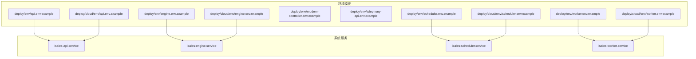
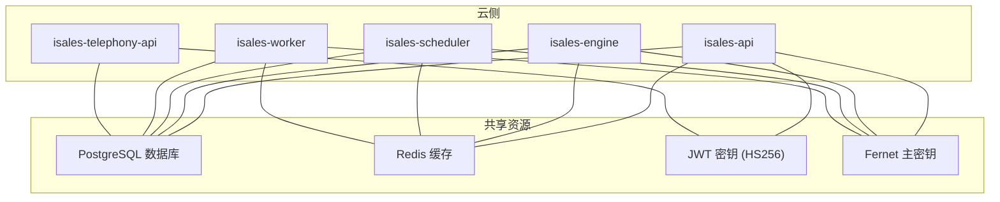
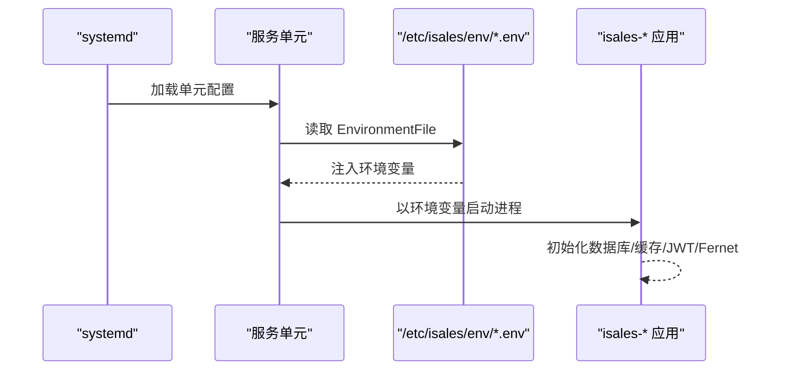
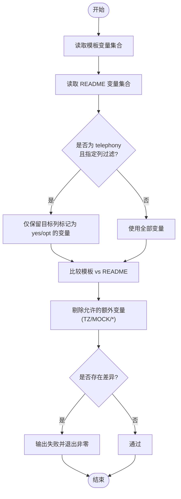

# 服务环境变量配置

<cite>
**本文引用的文件**
- [deploy/env/api.env.example](file://deploy/env/api.env.example)
- [deploy/env/engine.env.example](file://deploy/env/engine.env.example)
- [deploy/env/scheduler.env.example](file://deploy/env/scheduler.env.example)
- [deploy/env/worker.env.example](file://deploy/env/worker.env.example)
- [deploy/env/modem-controller.env.example](file://deploy/env/modem-controller.env.example)
- [deploy/env/telephony-api.env.example](file://deploy/env/telephony-api.env.example)
- [deploy/cloud/env/api.env.example](file://deploy/cloud/env/api.env.example)
- [deploy/cloud/env/engine.env.example](file://deploy/cloud/env/engine.env.example)
- [deploy/cloud/env/scheduler.env.example](file://deploy/cloud/env/scheduler.env.example)
- [deploy/cloud/env/worker.env.example](file://deploy/cloud/env/worker.env.example)
- [deploy/cloud/systemd/isales-api.service](file://deploy/cloud/systemd/isales-api.service)
- [deploy/cloud/systemd/isales-engine.service](file://deploy/cloud/systemd/isales-engine.service)
- [deploy/cloud/systemd/isales-scheduler.service](file://deploy/cloud/systemd/isales-scheduler.service)
- [deploy/cloud/systemd/isales-worker.service](file://deploy/cloud/systemd/isales-worker.service)
- [deploy/linux/scripts/check_env_consistency.py](file://deploy/linux/scripts/check_env_consistency.py)
</cite>

## 目录
1. [简介](#简介)
2. [项目结构](#项目结构)
3. [核心组件](#核心组件)
4. [架构总览](#架构总览)
5. [详细组件分析](#详细组件分析)
6. [依赖关系分析](#依赖关系分析)
7. [性能与可用性考量](#性能与可用性考量)
8. [故障排查指南](#故障排查指南)
9. [结论](#结论)
10. [附录](#附录)

## 简介
本文件面向运维与开发团队，系统化梳理 isales 体系中各服务的环境变量配置要求，覆盖以下服务：isales-api、isales-engine、isales-scheduler、isales-worker、isales-modem-controller、isales-telephony-api。内容包括：
- 核心环境变量清单与用途说明
- 数据库与缓存连接参数
- JWT 与对称加密密钥（Fernet）的跨服务一致性要求
- 服务间依赖关系与配置同步策略
- 配置模板解读、参数说明与部署示例路径

## 项目结构
围绕环境变量与系统服务配置，相关文件主要分布在 deploy 目录：
- deploy/env：本地/边缘拓扑的环境变量模板
- deploy/cloud/env：云边拓扑的环境变量模板
- deploy/cloud/systemd：各服务 systemd 单元文件，定义环境文件挂载点
- deploy/linux/scripts：环境一致性检查脚本，确保模板与服务 README 的变量声明一致

图表来源
- [deploy/env/api.env.example:1-14](file://deploy/env/api.env.example#L1-L14)
- [deploy/env/engine.env.example:1-21](file://deploy/env/engine.env.example#L1-L21)
- [deploy/env/scheduler.env.example:1-21](file://deploy/env/scheduler.env.example#L1-L21)
- [deploy/env/worker.env.example:1-20](file://deploy/env/worker.env.example#L1-L20)
- [deploy/env/modem-controller.env.example:1-15](file://deploy/env/modem-controller.env.example#L1-L15)
- [deploy/env/telephony-api.env.example:1-12](file://deploy/env/telephony-api.env.example#L1-L12)
- [deploy/cloud/systemd/isales-api.service:16-17](file://deploy/cloud/systemd/isales-api.service#L16-L17)
- [deploy/cloud/systemd/isales-engine.service:20-25](file://deploy/cloud/systemd/isales-engine.service#L20-L25)
- [deploy/cloud/systemd/isales-scheduler.service:14-15](file://deploy/cloud/systemd/isales-scheduler.service#L14-L15)
- [deploy/cloud/systemd/isales-worker.service:14-15](file://deploy/cloud/systemd/isales-worker.service#L14-L15)

章节来源
- [deploy/env/api.env.example:1-14](file://deploy/env/api.env.example#L1-L14)
- [deploy/env/engine.env.example:1-21](file://deploy/env/engine.env.example#L1-L21)
- [deploy/env/scheduler.env.example:1-21](file://deploy/env/scheduler.env.example#L1-L21)
- [deploy/env/worker.env.example:1-20](file://deploy/env/worker.env.example#L1-L20)
- [deploy/env/modem-controller.env.example:1-15](file://deploy/env/modem-controller.env.example#L1-L15)
- [deploy/env/telephony-api.env.example:1-12](file://deploy/env/telephony-api.env.example#L1-L12)
- [deploy/cloud/systemd/isales-api.service:16-17](file://deploy/cloud/systemd/isales-api.service#L16-L17)
- [deploy/cloud/systemd/isales-engine.service:20-25](file://deploy/cloud/systemd/isales-engine.service#L20-L25)
- [deploy/cloud/systemd/isales-scheduler.service:14-15](file://deploy/cloud/systemd/isales-scheduler.service#L14-L15)
- [deploy/cloud/systemd/isales-worker.service:14-15](file://deploy/cloud/systemd/isales-worker.service#L14-L15)

## 核心组件
本节按服务维度汇总关键环境变量及其作用域，并标注跨服务一致性要求。

- isales-api
  - 数据库连接：ISALES_DATABASE_URL
  - 缓存连接：ISALES_REDIS_URL
  - JWT 密钥：ISALES_JWT_SECRET
  - 管理员账户：ISALES_ADMIN_USER、ISALES_ADMIN_PASSWORD_HASH
  - 一致性要求：与 engine/scheduler/worker/telephony-api 的数据库与缓存 URL 必须一致；JWT 密钥需与 telephony-api 保持一致（HS256 签发/验签配对）
  - 示例参考：[deploy/env/api.env.example:9-13](file://deploy/env/api.env.example#L9-L13)，[deploy/cloud/env/api.env.example:8-15](file://deploy/cloud/env/api.env.example#L8-L15)

- isales-engine
  - 数据库连接：ISALES_DATABASE_URL
  - 缓存连接：ISALES_REDIS_URL
  - AI 提供商：ISALES_ENGINE_LLM_PROVIDER、ISALES_ENGINE_ASR_PROVIDER、ISALES_ENGINE_TTS_PROVIDER
  - 电话模式：ISALES_ENGINE_TELEPHONY_MODE（mock/real/rtc）
  - 管道超时与优雅停机：ISALES_ENGINE_PIPELINE_DEFAULT_TIMEOUT_MS、ISALES_ENGINE_MAX_NO_PROGRESS_SECONDS、ISALES_ENGINE_GRACEFUL_SHUTDOWN_TIMEOUT_S
  - 云边拓扑关键：ISALES_ENGINE_CLOUD_EDGE_GRPC_BIND、ISALES_ENGINE_EDGE_DEVICE_ID、ISALES_JWT_SECRET（与 api 一致）
  - Fernet 主密钥：ISALES_FERNET_KEY（与 api/engine/worker/scheduler 一致）
  - 示例参考：[deploy/env/engine.env.example:8-18](file://deploy/env/engine.env.example#L8-L18)，[deploy/cloud/env/engine.env.example:8-64](file://deploy/cloud/env/engine.env.example#L8-L64)

- isales-scheduler
  - 数据库连接：ISALES_DATABASE_URL
  - 缓存连接：ISALES_REDIS_URL
  - 调度参数：ISALES_SCHEDULER_TICK_INTERVAL、ISALES_SCHEDULER_BATCH_SIZE、ISALES_SCHEDULER_HISTORY_N、ISALES_MAX_CONCURRENCY
  - Fernet 主密钥：ISALES_FERNET_KEY（与 api/engine/worker/scheduler 一致）
  - 示例参考：[deploy/env/scheduler.env.example:12-18](file://deploy/env/scheduler.env.example#L12-L18)，[deploy/cloud/env/scheduler.env.example:6-10](file://deploy/cloud/env/scheduler.env.example#L6-L10)

- isales-worker
  - 数据库连接：ISALES_DATABASE_URL
  - 缓存连接：ISALES_REDIS_URL
  - 加密密钥：ISALES_FERNET_KEY（与 api/engine/worker/scheduler 一致）
  - Webhook 默认超时与重试：ISALES_WEBHOOK_DEFAULT_TIMEOUT_SECONDS、ISALES_WORKER_RETRY_TICK_INTERVAL、ISALES_WORKER_RETRY_BATCH_SIZE
  - 指标上报周期：ISALES_WORKER_METRICS_TICK_INTERVAL
  - 云边拓扑：OSS 上传参数（ISALES_OSS_ENDPOINT、ISALES_OSS_BUCKET、ISALES_OSS_ACCESS_KEY_ID、ISALES_OSS_ACCESS_KEY_SECRET）
  - 示例参考：[deploy/env/worker.env.example:9-17](file://deploy/env/worker.env.example#L9-L17)，[deploy/cloud/env/worker.env.example:6-13](file://deploy/cloud/env/worker.env.example#L6-L13)

- isales-modem-controller
  - 数据库连接：ISALES_DATABASE_URL
  - IPC 套接字：ISALES_MODEM_SOCKET（默认 /var/run/isales/modem.sock）
  - 示例参考：[deploy/env/modem-controller.env.example:7-10](file://deploy/env/modem-controller.env.example#L7-L10)

- isales-telephony-api
  - 数据库连接：ISALES_DATABASE_URL
  - 缓存连接：ISALES_REDIS_URL
  - JWT 密钥：ISALES_JWT_SECRET（需与 isales-api 一致，用于用户会话与边缘设备 JWT 验证）
  - 示例参考：[deploy/env/telephony-api.env.example:9-11](file://deploy/env/telephony-api.env.example#L9-L11)，[deploy/cloud/env/api.env.example:10-12](file://deploy/cloud/env/api.env.example#L10-L12)

章节来源
- [deploy/env/api.env.example:4-13](file://deploy/env/api.env.example#L4-L13)
- [deploy/env/engine.env.example:4-18](file://deploy/env/engine.env.example#L4-L18)
- [deploy/env/scheduler.env.example:4-18](file://deploy/env/scheduler.env.example#L4-L18)
- [deploy/env/worker.env.example:4-17](file://deploy/env/worker.env.example#L4-L17)
- [deploy/env/modem-controller.env.example:4-10](file://deploy/env/modem-controller.env.example#L4-L10)
- [deploy/env/telephony-api.env.example:4-11](file://deploy/env/telephony-api.env.example#L4-L11)
- [deploy/cloud/env/api.env.example:3-13](file://deploy/cloud/env/api.env.example#L3-L13)
- [deploy/cloud/env/engine.env.example:3-64](file://deploy/cloud/env/engine.env.example#L3-L64)
- [deploy/cloud/env/scheduler.env.example:3-10](file://deploy/cloud/env/scheduler.env.example#L3-L10)
- [deploy/cloud/env/worker.env.example:3-13](file://deploy/cloud/env/worker.env.example#L3-L13)

## 架构总览
下图展示云边拓能力下的服务与共享资源关系，以及跨服务一致性约束。

图表来源
- [deploy/cloud/env/api.env.example:3-13](file://deploy/cloud/env/api.env.example#L3-L13)
- [deploy/cloud/env/engine.env.example:3-27](file://deploy/cloud/env/engine.env.example#L3-L27)
- [deploy/cloud/env/scheduler.env.example:3-10](file://deploy/cloud/env/scheduler.env.example#L3-L10)
- [deploy/cloud/env/worker.env.example:3-25](file://deploy/cloud/env/worker.env.example#L3-L25)

## 详细组件分析

### isales-api 配置详解
- 核心变量
  - ISALES_DATABASE_URL：数据库连接串（驱动 asyncpg）
  - ISALES_REDIS_URL：Redis 连接串
  - ISALES_JWT_SECRET：用户会话与边缘设备 JWT HS256 密钥
  - ISALES_ADMIN_USER / ISALES_ADMIN_PASSWORD_HASH：管理员账户凭据
- 安全与合规
  - JWT 密钥必须与 telephony-api 保持一致，以实现跨服务签发/验签一致性
  - Fernet 主密钥在云边拓扑中也需与 engine/worker/scheduler 一致（见下方“跨服务一致性”）
- 部署示例
  - 本地/边缘：[deploy/env/api.env.example:9-13](file://deploy/env/api.env.example#L9-L13)
  - 云边拓扑：[deploy/cloud/env/api.env.example:17-21](file://deploy/cloud/env/api.env.example#L8-L15, file://deploy/cloud/env/api.env.example#L17-L21)

章节来源
- [deploy/env/api.env.example:9-13](file://deploy/env/api.env.example#L9-L13)
- [deploy/cloud/env/api.env.example:8-15](file://deploy/cloud/env/api.env.example#L8-L15)

### isales-engine 配置详解
- 核心变量
  - ISALES_DATABASE_URL / ISALES_REDIS_URL：数据库与缓存连接
  - AI 提供商：LLM/ASR/TTS 提供商选择（mock/volcengine/openai/dashscope）
  - 电话模式：mock/real/rtc（rtc 通过 gRPC 控制边缘设备）
  - 管道与优雅停机：超时、无进度阈值、停机超时
  - 云边 gRPC：绑定地址、边缘设备 ID、JWT 密钥（与 api 一致）
  - Fernet 主密钥：与 api/engine/worker/scheduler 一致
- 云边能力
  - 通过 ISALES_ENGINE_CLOUD_EDGE_GRPC_BIND 将 gRPC 终止于 nginx，再由 engine 在内网回环监听
  - 使用阿里 DingRTC SDK（Linux 路径与 LD_LIBRARY_PATH 已在模板中体现）
- 部署示例
  - 本地/边缘：[deploy/env/engine.env.example:8-18](file://deploy/env/engine.env.example#L8-L18)
  - 云边拓扑：[deploy/cloud/env/engine.env.example:8-64](file://deploy/cloud/env/engine.env.example#L8-L64)

章节来源
- [deploy/env/engine.env.example:8-18](file://deploy/env/engine.env.example#L8-L18)
- [deploy/cloud/env/engine.env.example:8-64](file://deploy/cloud/env/engine.env.example#L8-L64)

### isales-scheduler 配置详解
- 核心变量
  - ISALES_DATABASE_URL / ISALES_REDIS_URL：数据库与缓存连接
  - 调度参数：tick 间隔、批大小、历史窗口、最大并发
  - Fernet 主密钥：与 api/engine/worker/scheduler 一致
- 云边拆分
  - 设备选择从 telephony-api HTTP 接口迁移至直接查询 PostgreSQL（FOR UPDATE SKIP LOCKED），减少中间层耦合
- 部署示例
  - 本地/边缘：[deploy/env/scheduler.env.example:12-18](file://deploy/env/scheduler.env.example#L12-L18)
  - 云边拓扑：[deploy/cloud/env/scheduler.env.example:6-22](file://deploy/cloud/env/scheduler.env.example#L6-L22)

章节来源
- [deploy/env/scheduler.env.example:12-18](file://deploy/env/scheduler.env.example#L12-L18)
- [deploy/cloud/env/scheduler.env.example:6-22](file://deploy/cloud/env/scheduler.env.example#L6-L22)

### isales-worker 配置详解
- 核心变量
  - ISALES_DATABASE_URL / ISALES_REDIS_URL：数据库与缓存连接
  - 加密：ISALES_FERNET_KEY（与 api/engine/worker/scheduler 一致）
  - Webhook：默认超时、重试 tick 与批大小
  - 指标：指标上报 tick
  - 云边：OSS 上传端点、桶、AK/SK
- 部署示例
  - 本地/边缘：[deploy/env/worker.env.example:9-17](file://deploy/env/worker.env.example#L9-L17)
  - 云边拓扑：[deploy/cloud/env/worker.env.example:21-25](file://deploy/cloud/env/worker.env.example#L6-L13, file://deploy/cloud/env/worker.env.example#L21-L25)

章节来源
- [deploy/env/worker.env.example:9-17](file://deploy/env/worker.env.example#L9-L17)
- [deploy/cloud/env/worker.env.example:6-13](file://deploy/cloud/env/worker.env.example#L6-L13)

### isales-modem-controller 配置详解
- 核心变量
  - ISALES_DATABASE_URL：数据库连接
  - ISALES_MODEM_SOCKET：engine 与 modem-controller 的 IPC 套接字路径（默认 /var/run/isales/modem.sock）
- 部署示例
  - 本地/边缘：[deploy/env/modem-controller.env.example:7-10](file://deploy/env/modem-controller.env.example#L7-L10)

章节来源
- [deploy/env/modem-controller.env.example:7-10](file://deploy/env/modem-controller.env.example#L7-L10)

### isales-telephony-api 配置详解
- 核心变量
  - ISALES_DATABASE_URL / ISALES_REDIS_URL：数据库与缓存连接
  - ISALES_JWT_SECRET：与 isales-api 一致，用于用户会话与边缘设备 JWT 验证
- 部署示例
  - 本地/边缘：[deploy/env/telephony-api.env.example:9-11](file://deploy/env/telephony-api.env.example#L9-L11)
  - 云边拓扑：[deploy/cloud/env/api.env.example:10-12](file://deploy/cloud/env/api.env.example#L10-L12)

章节来源
- [deploy/env/telephony-api.env.example:9-11](file://deploy/env/telephony-api.env.example#L9-L11)
- [deploy/cloud/env/api.env.example:10-12](file://deploy/cloud/env/api.env.example#L10-L12)

## 依赖关系分析
- 系统服务与环境文件
  - 各服务 systemd 单元通过 EnvironmentFile 挂载统一的 /etc/isales/env/<service>.env，确保进程启动时加载一致的环境变量
  - 云边拓扑下，engine 服务还通过环境变量注入 ARTC SDK 的库路径与应用密钥等

图表来源
- [deploy/cloud/systemd/isales-api.service:16-17](file://deploy/cloud/systemd/isales-api.service#L16-L17)
- [deploy/cloud/systemd/isales-engine.service:20-25](file://deploy/cloud/systemd/isales-engine.service#L20-L25)
- [deploy/cloud/systemd/isales-scheduler.service:14-15](file://deploy/cloud/systemd/isales-scheduler.service#L14-L15)
- [deploy/cloud/systemd/isales-worker.service:14-15](file://deploy/cloud/systemd/isales-worker.service#L14-L15)

- 跨服务一致性检查
  - 通过脚本对模板与各服务 README 的变量声明进行比对，确保“模板变量集”与“README 声明变量集”的一致性
  - 支持 telephony README 的列过滤（api/modem），并允许少量平台约定变量（如 TZ）

图表来源
- [deploy/linux/scripts/check_env_consistency.py:55-115](file://deploy/linux/scripts/check_env_consistency.py#L55-L115)
- [deploy/linux/scripts/check_env_consistency.py:118-156](file://deploy/linux/scripts/check_env_consistency.py#L118-L156)

章节来源
- [deploy/cloud/systemd/isales-api.service:16-17](file://deploy/cloud/systemd/isales-api.service#L16-L17)
- [deploy/cloud/systemd/isales-engine.service:20-25](file://deploy/cloud/systemd/isales-engine.service#L20-L25)
- [deploy/cloud/systemd/isales-scheduler.service:14-15](file://deploy/cloud/systemd/isales-scheduler.service#L14-L15)
- [deploy/cloud/systemd/isales-worker.service:14-15](file://deploy/cloud/systemd/isales-worker.service#L14-L15)
- [deploy/linux/scripts/check_env_consistency.py:118-156](file://deploy/linux/scripts/check_env_consistency.py#L118-L156)

## 性能与可用性考量
- 数据库与缓存
  - 云边拓扑建议使用内网域名与高可用实例，降低网络抖动与延迟
  - Redis 与 PostgreSQL 的连接串应与各服务保持一致，避免跨实例导致的事务一致性问题
- JWT 与加密
  - JWT 密钥与 Fernet 主密钥的旋转将导致服务间认证失败或数据不可读，需制定严格的轮换流程与同步机制
- 调度与处理
  - 合理设置调度 tick 与批大小，避免过载；为 engine 的优雅停机预留足够时间窗，防止正在通话被中断
- 日志与可观测性
  - 建议开启服务级日志采集与指标上报，结合 Prometheus/Grafana 进行监控告警

## 故障排查指南
- 环境变量不一致
  - 现象：服务启动后报数据库/缓存连接失败、鉴权失败、无法解密凭据
  - 排查：运行环境一致性检查脚本，核对模板与 README 的变量声明差异
  - 参考：[deploy/linux/scripts/check_env_consistency.py:118-156](file://deploy/linux/scripts/check_env_consistency.py#L118-L156)
- JWT 与 Fernet 问题
  - 现象：用户登录失效、边缘设备令牌验证失败、回调签名异常
  - 排查：确认 isales-api 与 telephony-api 的 ISALES_JWT_SECRET 一致；确认 api/engine/worker/scheduler 的 ISALES_FERNET_KEY 一致
  - 参考：[deploy/env/api.env.example:4-7](file://deploy/env/api.env.example#L4-L7)，[deploy/env/telephony-api.env.example:4-7](file://deploy/env/telephony-api.env.example#L4-L7)，[deploy/cloud/env/engine.env.example:23-27](file://deploy/cloud/env/engine.env.example#L23-L27)
- 云边通信异常
  - 现象：engine 无法通过 gRPC 控制边缘设备
  - 排查：确认 nginx 已正确终止 TLS 并转发至 engine 的内网绑定地址；校验 ISALES_ENGINE_EDGE_DEVICE_ID 与边缘设备 JWT 的 sub 一致
  - 参考：[deploy/cloud/env/engine.env.example:56-64](file://deploy/cloud/env/engine.env.example#L56-L64)

章节来源
- [deploy/linux/scripts/check_env_consistency.py:118-156](file://deploy/linux/scripts/check_env_consistency.py#L118-L156)
- [deploy/env/api.env.example:4-7](file://deploy/env/api.env.example#L4-L7)
- [deploy/env/telephony-api.env.example:4-7](file://deploy/env/telephony-api.env.example#L4-L7)
- [deploy/cloud/env/engine.env.example:56-64](file://deploy/cloud/env/engine.env.example#L56-L64)

## 结论
- 本文件提供了 isales 各服务的环境变量配置清单与跨服务一致性要求，明确了数据库、缓存、JWT 与 Fernet 的同步机制
- 云边拓扑下，engine 与 telephony-api 的 JWT 密钥需与 api 保持一致；Fernet 主密钥需在 api/engine/worker/scheduler 四者之间保持一致
- 建议在部署前执行环境一致性检查脚本，并在密钥轮换时制定严格的同步与回滚预案

## 附录
- 配置模板与示例路径
  - isales-api
    - 本地/边缘：[deploy/env/api.env.example:9-13](file://deploy/env/api.env.example#L9-L13)
    - 云边拓扑：[deploy/cloud/env/api.env.example:8-15](file://deploy/cloud/env/api.env.example#L8-L15)
  - isales-engine
    - 本地/边缘：[deploy/env/engine.env.example:8-18](file://deploy/env/engine.env.example#L8-L18)
    - 云边拓扑：[deploy/cloud/env/engine.env.example:8-64](file://deploy/cloud/env/engine.env.example#L8-L64)
  - isales-scheduler
    - 本地/边缘：[deploy/env/scheduler.env.example:12-18](file://deploy/env/scheduler.env.example#L12-L18)
    - 云边拓扑：[deploy/cloud/env/scheduler.env.example:6-22](file://deploy/cloud/env/scheduler.env.example#L6-L22)
  - isales-worker
    - 本地/边缘：[deploy/env/worker.env.example:9-17](file://deploy/env/worker.env.example#L9-L17)
    - 云边拓扑：[deploy/cloud/env/worker.env.example:6-13](file://deploy/cloud/env/worker.env.example#L6-L13)
  - isales-modem-controller
    - 本地/边缘：[deploy/env/modem-controller.env.example:7-10](file://deploy/env/modem-controller.env.example#L7-L10)
  - isales-telephony-api
    - 本地/边缘：[deploy/env/telephony-api.env.example:9-11](file://deploy/env/telephony-api.env.example#L9-L11)
    - 云边拓扑：[deploy/cloud/env/api.env.example:10-12](file://deploy/cloud/env/api.env.example#L10-L12)