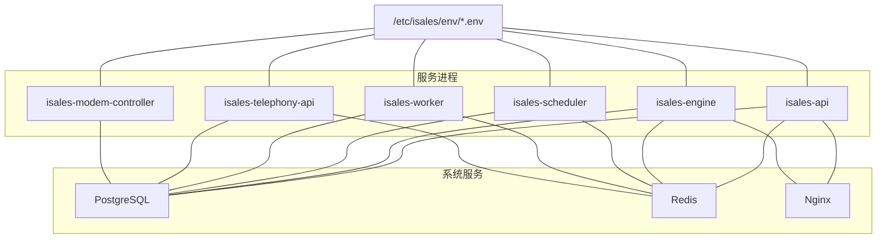
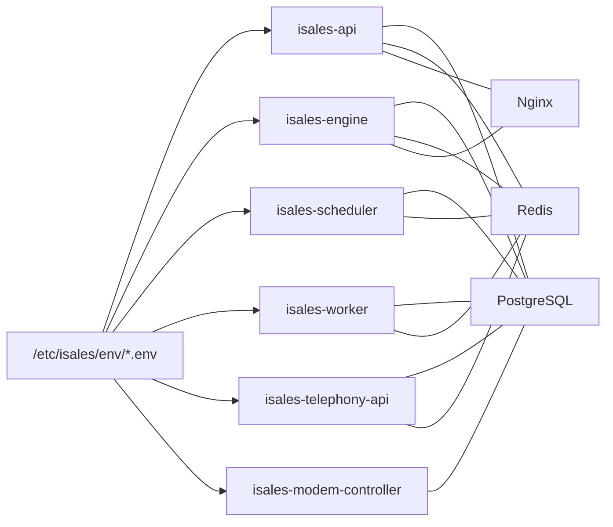

# 环境变量配置

<cite>
**本文引用的文件**
- [deploy/README.md](file://deploy/README.md)
- [deploy/cloud/README.md](file://deploy/cloud/README.md)
- [deploy/cloud/systemd/isales-api.service](file://deploy/cloud/systemd/isales-api.service)
- [deploy/cloud/systemd/isales-engine.service](file://deploy/cloud/systemd/isales-engine.service)
- [deploy/env/api.env.example](file://deploy/env/api.env.example)
- [deploy/env/engine.env.example](file://deploy/env/engine.env.example)
- [deploy/env/scheduler.env.example](file://deploy/env/scheduler.env.example)
- [deploy/env/worker.env.example](file://deploy/env/worker.env.example)
- [deploy/env/telephony-api.env.example](file://deploy/env/telephony-api.env.example)
- [deploy/env/modem-controller.env.example](file://deploy/env/modem-controller.env.example)
- [deploy/cloud/env/api.env.example](file://deploy/cloud/env/api.env.example)
- [deploy/cloud/env/engine.env.example](file://deploy/cloud/env/engine.env.example)
- [deploy/cloud/env/scheduler.env.example](file://deploy/cloud/env/scheduler.env.example)
- [deploy/cloud/env/worker.env.example](file://deploy/cloud/env/worker.env.example)
- [deploy/cloud/env/SECRETS.md.example](file://deploy/cloud/env/SECRETS.md.example)
- [deploy/linux/scripts/check_env_consistency.py](file://deploy/linux/scripts/check_env_consistency.py)
</cite>

## 目录
1. [简介](#简介)
2. [项目结构](#项目结构)
3. [核心组件](#核心组件)
4. [架构总览](#架构总览)
5. [详细组件分析](#详细组件分析)
6. [依赖关系分析](#依赖关系分析)
7. [性能考量](#性能考量)
8. [故障排查指南](#故障排查指南)
9. [结论](#结论)
10. [附录](#附录)

## 简介
本指南面向 iSales 生产与开发环境的环境变量配置，覆盖 7 个服务的模板与配置要点，重点包括：
- 数据库与 Redis 连接
- API 密钥与硬件参数（如 RTC）
- 安全敏感参数（JWT、Fernet 主密钥等）与轮换策略
- 一致性检查机制与模板使用方法
- 生产与开发环境差异
- 配置验证方法、常见问题与解决方案
- 完整配置示例与部署前检查清单

## 项目结构
iSales 提供两套部署形态：
- 单主机形态（Linux/macOS）：7 个服务在同一主机运行，数据库、Redis、Nginx 作为系统服务。
- 云边分离形态（Cloud-Edge Split）：云端 4 个服务（api/engine/scheduler/worker）与边缘设备分离。

两者均采用集中化环境文件（/etc/isales/env/*.env）并通过 systemd/launchd 管理服务。

```mermaid
graph TB
subgraph "单主机形态Linux/macOS"
A1["isales-api"]
A2["isales-engine"]
A3["isales-scheduler"]
A4["isales-worker"]
A5["isales-telephony-api"]
A6["isales-modem-controller"]
SYS1["PostgreSQL"]
SYS2["Redis"]
SYS3["Nginx"]
end
subgraph "云边分离形态Cloud-Edge Split"
C1["isales-api云端"]
C2["isales-engine云端 gRPC 服务器"]
C3["isales-scheduler云端"]
C4["isales-worker云端"]
E1["边缘设备<br/>modem-controller + audio-bridge"]
end
A1 --- SYS1
A1 --- SYS2
A2 --- SYS1
A2 --- SYS2
A3 --- SYS1
A3 --- SYS2
A4 --- SYS1
A4 --- SYS2
A5 --- SYS1
A5 --- SYS2
A6 --- SYS1
A6 --- SYS2
C1 --- SYS1
C1 --- SYS2
C2 --- SYS1
C2 --- SYS2
C3 --- SYS1
C3 --- SYS2
C4 --- SYS1
C4 --- SYS2
C2 <- --> E1
```

图表来源
- [deploy/README.md:14-49](file://deploy/README.md#L14-L49)
- [deploy/cloud/README.md:10-53](file://deploy/cloud/README.md#L10-L53)

章节来源
- [deploy/README.md:1-112](file://deploy/README.md#L1-L112)
- [deploy/cloud/README.md:1-118](file://deploy/cloud/README.md#L1-L118)

## 核心组件
本节概述 7 个服务的职责与关键环境变量类别，并给出跨服务一致性约束。

- isales-api
  - 负责 Web/API 服务、用户会话、回调签名等。
  - 关键变量：数据库/Redis URL、JWT 密钥、管理员凭据、Fernet 主密钥。
  - 一致性：与 engine/scheduler/worker 的数据库/Redis URL 一致；与 telephony-api 的 JWT 密钥一致。

- isales-engine
  - 实时通话引擎，负责 AI 能力、ASR/TTS、RTC 集成、cloud-edge gRPC 服务器。
  - 关键变量：数据库/Redis URL、AI/ASR/TTS 提供商、RTC 参数、gRPC 绑定、Fernet 主密钥、管道超时等。
  - 一致性：与 api/scheduler/worker 的数据库/Redis URL 一致；与 api 的 JWT 密钥一致。

- isales-scheduler
  - 线索调度器，负责设备选择与拨号队列推送。
  - 关键变量：数据库/Redis URL、调度周期、批大小、并发度等。
  - 一致性：与 api/engine/worker 的数据库 URL 一致。

- isales-worker
  - 异步后处理（录音上传、Webhook 回调、指标采集等）。
  - 关键变量：数据库/Redis URL、OSS 凭据、Fernet 主密钥、Webhook 超时与重试等。
  - 一致性：与 api/engine/scheduler 的数据库 URL 一致；Fernet 主密钥需与 api 一致。

- isales-telephony-api
  - 设备与 SIM 管理 API，负责设备 CRUD。
  - 关键变量：数据库/Redis URL、JWT 密钥。
  - 一致性：与 api/engine/worker 的数据库/Redis URL 一致；与 api 的 JWT 密钥一致。

- isales-modem-controller
  - USB GSM 调制解调器守护进程，负责真实拨号。
  - 关键变量：数据库 URL、IPC 套接字路径、模拟拨号参数（仅测试）。
  - 一致性：与 api/engine/scheduler/worker/telephony-api 的数据库 URL 一致。

章节来源
- [deploy/env/api.env.example:1-14](file://deploy/env/api.env.example#L1-L14)
- [deploy/env/engine.env.example:1-21](file://deploy/env/engine.env.example#L1-L21)
- [deploy/env/scheduler.env.example:1-21](file://deploy/env/scheduler.env.example#L1-L21)
- [deploy/env/worker.env.example:1-20](file://deploy/env/worker.env.example#L1-L20)
- [deploy/env/telephony-api.env.example:1-12](file://deploy/env/telephony-api.env.example#L1-L12)
- [deploy/env/modem-controller.env.example:1-15](file://deploy/env/modem-controller.env.example#L1-L15)
- [deploy/cloud/env/api.env.example:1-24](file://deploy/cloud/env/api.env.example#L1-L24)
- [deploy/cloud/env/engine.env.example:1-76](file://deploy/cloud/env/engine.env.example#L1-L76)
- [deploy/cloud/env/scheduler.env.example:1-25](file://deploy/cloud/env/scheduler.env.example#L1-L25)
- [deploy/cloud/env/worker.env.example:1-28](file://deploy/cloud/env/worker.env.example#L1-L28)

## 架构总览
下图展示 7 个服务在单主机形态下的环境文件与系统服务的关系，以及数据库/Redis/Nginx 的依赖。



图表来源
- [deploy/README.md:14-49](file://deploy/README.md#L14-L49)
- [deploy/cloud/systemd/isales-api.service:16-17](file://deploy/cloud/systemd/isales-api.service#L16-L17)
- [deploy/cloud/systemd/isales-engine.service:20-25](file://deploy/cloud/systemd/isales-engine.service#L20-L25)

章节来源
- [deploy/README.md:1-112](file://deploy/README.md#L1-L112)

## 详细组件分析

### isales-api 环境变量模板与要求
- 数据库与 Redis
  - ISALES_DATABASE_URL：指向 PostgreSQL（异步驱动）。
  - ISALES_REDIS_URL：指向 Redis。
- 安全与认证
  - ISALES_JWT_SECRET：用于前端用户会话与 cloud-edge 边设备令牌签发/校验（HS256）。
  - ISALES_ADMIN_USER / ISALES_ADMIN_PASSWORD_HASH：管理员账户与哈希密码。
- 加密与隐私
  - ISALES_FERNET_KEY：与 engine/worker/scheduler 一致，用于敏感数据加密。
- 时区
  - TZ：统一服务时区。

一致性检查要点
- 与 engine/scheduler/worker 的数据库/Redis URL 必须一致。
- 与 telephony-api 的 JWT 密钥必须一致。

章节来源
- [deploy/env/api.env.example:1-14](file://deploy/env/api.env.example#L1-L14)
- [deploy/cloud/env/api.env.example:1-24](file://deploy/cloud/env/api.env.example#L1-L24)

### isales-engine 环境变量模板与要求
- 数据库与 Redis
  - ISALES_DATABASE_URL / ISALES_REDIS_URL。
- AI/ASR/TTS 提供商
  - ISALES_ENGINE_LLM_PROVIDER / ISALES_ENGINE_ASR_PROVIDER / ISALES_ENGINE_TTS_PROVIDER。
- 通话模式
  - ISALES_ENGINE_TELEPHONY_MODE：mock/real/rtc。
- 阿里 RTC（DingRTC）
  - ISALES_RTC_APP_ID / ISALES_RTC_APP_KEY（云侧专用）。
  - ISALES_ENGINE_RTC_SDK_KIND：vendor/in_memory。
  - SDK 路径与 LD_LIBRARY_PATH（安装脚本注入）。
- cloud-edge gRPC
  - ISALES_ENGINE_CLOUD_EDGE_GRPC_BIND：绑定地址（通常 127.0.0.1:50051）。
  - ISALES_ENGINE_EDGE_DEVICE_ID：与 edge 设备 ID 对齐。
  - ISALES_JWT_SECRET：与 api 一致。
- 性能与超时
  - ISALES_ENGINE_PIPELINE_DEFAULT_TIMEOUT_MS / ISALES_ENGINE_MAX_NO_PROGRESS_SECONDS / ISALES_ENGINE_GRACEFUL_SHUTDOWN_TIMEOUT_S。
- 加密与隐私
  - ISALES_FERNET_KEY：与 api/worker/scheduler 一致。

一致性检查要点
- 数据库/Redis URL 与 api/scheduler/worker 一致。
- JWT 密钥与 api 一致。

章节来源
- [deploy/env/engine.env.example:1-21](file://deploy/env/engine.env.example#L1-L21)
- [deploy/cloud/env/engine.env.example:1-76](file://deploy/cloud/env/engine.env.example#L1-L76)

### isales-scheduler 环境变量模板与要求
- 数据库与 Redis
  - ISALES_DATABASE_URL / ISALES_REDIS_URL。
- 调度策略
  - ISALES_SCHEDULER_TICK_INTERVAL / ISALES_SCHEDULER_BATCH_SIZE / ISALES_SCHEDULER_HISTORY_N。
  - ISALES_MAX_CONCURRENCY：最大并发。
- 加密与隐私
  - ISALES_FERNET_KEY：与 api/engine/worker 一致（尽管不直接读取凭据）。

一致性检查要点
- 数据库 URL 与 api/engine/worker 一致。

章节来源
- [deploy/env/scheduler.env.example:1-21](file://deploy/env/scheduler.env.example#L1-L21)
- [deploy/cloud/env/scheduler.env.example:1-25](file://deploy/cloud/env/scheduler.env.example#L1-L25)

### isales-worker 环境变量模板与要求
- 数据库与 Redis
  - ISALES_DATABASE_URL / ISALES_REDIS_URL。
- 云存储
  - ISALES_OSS_ENDPOINT / ISALES_OSS_BUCKET / ISALES_OSS_ACCESS_KEY_ID / ISALES_OSS_ACCESS_KEY_SECRET。
- Webhook 与指标
  - ISALES_WEBHOOK_DEFAULT_TIMEOUT_SECONDS / ISALES_WORKER_RETRY_TICK_INTERVAL / ISALES_WORKER_RETRY_BATCH_SIZE / ISALES_WORKER_METRICS_TICK_INTERVAL。
- 加密与隐私
  - ISALES_FERNET_KEY：与 api/engine/scheduler 一致，用于解密 callback_config.signing_secret 并进行 HMAC-SHA256 签名。

一致性检查要点
- 数据库 URL 与 api/engine/scheduler 一致。
- Fernet 主密钥与 api 一致。

章节来源
- [deploy/env/worker.env.example:1-20](file://deploy/env/worker.env.example#L1-L20)
- [deploy/cloud/env/worker.env.example:1-28](file://deploy/cloud/env/worker.env.example#L1-L28)

### isales-telephony-api 环境变量模板与要求
- 数据库与 Redis
  - ISALES_DATABASE_URL / ISALES_REDIS_URL。
- 安全与认证
  - ISALES_JWT_SECRET：与 api 的 HS256 签发/校验配对。

一致性检查要点
- 数据库/Redis URL 与 api/engine/worker 一致。
- JWT 密钥与 api 一致。

章节来源
- [deploy/env/telephony-api.env.example:1-12](file://deploy/env/telephony-api.env.example#L1-L12)

### isales-modem-controller 环境变量模板与要求
- 数据库
  - ISALES_DATABASE_URL。
- 通信与调试
  - ISALES_MODEM_SOCKET：engine 与 modem-controller 的 IPC 套接字路径。
  - 可选调试开关（仅测试环境）：ISALES_SKIP_UDEV、MOCK_DIAL_DELAY_MS、MOCK_CALL_DURATION_MS。

一致性检查要点
- 数据库 URL 与 api/engine/scheduler/worker/telephony-api 一致。

章节来源
- [deploy/env/modem-controller.env.example:1-15](file://deploy/env/modem-controller.env.example#L1-L15)

### 云边分离形态（Cloud-Edge Split）的关键差异
- 云端服务（api/engine/scheduler/worker）与边缘设备分离，engine 作为 cloud-edge gRPC 服务器，nginx 终止 TLS 并转发至 engine。
- 云端不再包含 telephony-api 与 modem-controller。
- 云侧模板强调跨服务一致性与安全密钥同步。

章节来源
- [deploy/cloud/README.md:1-118](file://deploy/cloud/README.md#L1-L118)
- [deploy/cloud/systemd/isales-api.service:16-17](file://deploy/cloud/systemd/isales-api.service#L16-L17)
- [deploy/cloud/systemd/isales-engine.service:20-25](file://deploy/cloud/systemd/isales-engine.service#L20-L25)

## 依赖关系分析
- 集中式环境文件
  - 所有服务通过 systemd/launchd 的 EnvironmentFile 指向 /etc/isales/env/*.env。
- 数据库与 Redis
  - api/engine/scheduler/worker/telephony-api/modem-controller 均依赖数据库与 Redis。
- 安全密钥
  - JWT 密钥在 api 与 telephony-api 之间必须一致；Fernet 主密钥在 api/engine/worker/scheduler 之间必须一致。
- RTC 与 gRPC
  - engine 通过 gRPC 与边缘设备通信；nginx 终止 TLS 并校验 bearer token。



图表来源
- [deploy/README.md:41-47](file://deploy/README.md#L41-L47)
- [deploy/cloud/systemd/isales-api.service:16-17](file://deploy/cloud/systemd/isales-api.service#L16-L17)
- [deploy/cloud/systemd/isales-engine.service:20-25](file://deploy/cloud/systemd/isales-engine.service#L20-L25)

章节来源
- [deploy/README.md:1-112](file://deploy/README.md#L1-L112)

## 性能考量
- 调度与并发
  - scheduler 的批大小与并发度直接影响吞吐与资源占用，建议根据业务量与数据库性能调优。
- 超时与优雅停机
  - engine 的管道超时与最大无进度时间影响通话稳定性；优雅停机超时需与 systemd TimeoutStopSec 匹配。
- Webhook 与指标
  - worker 的 webhook 超时与重试间隔需平衡可靠性与延迟。

章节来源
- [deploy/env/engine.env.example:15-18](file://deploy/env/engine.env.example#L15-L18)
- [deploy/env/scheduler.env.example:15-18](file://deploy/env/scheduler.env.example#L15-L18)
- [deploy/env/worker.env.example:14-17](file://deploy/env/worker.env.example#L14-L17)

## 故障排查指南
- 环境变量一致性检查
  - 使用一致性检查脚本验证模板与各服务 README 的变量声明是否匹配。
  - 若存在“仅在模板存在”或“仅在 README 存在”的变量，将导致部署失败。
- 常见错误与解决
  - 数据库/Redis URL 不一致：修正为相同值并重启相关服务。
  - JWT/Fernet 密钥不一致：统一密钥后重启所有服务。
  - RTC/SDK 路径缺失：按云侧 README 步骤安装 DingRTC SDK 并设置 LD_LIBRARY_PATH。
  - 调度器/工作器无法连接数据库：检查 alembic 迁移状态与权限。
- 密钥轮换与灾难恢复
  - Fernet 主密钥丢失：需重建密钥并迁移 provider_credential 表；参考 SECRETS.md 示例。
  - JWT 密钥轮换：需引导用户重新登录并重新签发 edge 令牌。

章节来源
- [deploy/linux/scripts/check_env_consistency.py:118-156](file://deploy/linux/scripts/check_env_consistency.py#L118-L156)
- [deploy/cloud/env/SECRETS.md.example:1-86](file://deploy/cloud/env/SECRETS.md.example#L1-L86)

## 结论
- 环境变量配置的核心在于“一致性”与“安全性”。跨服务的数据库/Redis URL、JWT 密钥与 Fernet 主密钥必须严格同步。
- 云边分离形态下，engine 作为 gRPC 服务器与 nginx 协作，需确保 TLS 终止与 bearer 校验正确配置。
- 建议在部署前执行一致性检查与密钥备份，并制定密钥轮换与灾难恢复流程。

## 附录

### 配置验证方法
- 使用一致性检查脚本扫描模板与 README 的变量差异。
- 部署后验证服务日志与健康检查接口。
- 对关键服务（engine、api、worker）进行端到端拨测。

章节来源
- [deploy/linux/scripts/check_env_consistency.py:118-156](file://deploy/linux/scripts/check_env_consistency.py#L118-L156)

### 常见错误与解决方案
- “变量在模板中存在但在 README 中缺失”：删除模板中的冗余变量或补充 README。
- “变量在 README 中存在但在模板中缺失”：在模板中添加该变量并赋值。
- “数据库/Redis URL 不一致”：统一为相同值并重启服务。
- “JWT/Fernet 密钥不一致”：统一密钥后重启所有服务。
- “RTC SDK 未找到”：确认安装 DingRTC SDK 并设置 LD_LIBRARY_PATH。

章节来源
- [deploy/linux/scripts/check_env_consistency.py:136-148](file://deploy/linux/scripts/check_env_consistency.py#L136-L148)
- [deploy/cloud/systemd/isales-engine.service:20-25](file://deploy/cloud/systemd/isales-engine.service#L20-L25)

### 配置示例与部署前检查清单
- 配置示例
  - 参考各服务的 .env.example 文件，按需填写数据库/Redis URL、JWT/Fernet 密钥、OSS/RTC 参数等。
- 部署前检查清单
  - 确认所有服务的数据库/Redis URL 一致。
  - 确认 api 与 telephony-api 的 JWT 密钥一致。
  - 确认 api/engine/worker/scheduler 的 Fernet 主密钥一致。
  - 确认 engine 的 gRPC 绑定与 nginx 配置一致。
  - 确认 DingRTC SDK 已安装且 LD_LIBRARY_PATH 正确。
  - 运行一致性检查脚本并通过验证。
  - 完成 alembic 迁移并重启服务。

章节来源
- [deploy/cloud/README.md:69-92](file://deploy/cloud/README.md#L69-L92)
- [deploy/README.md:61-81](file://deploy/README.md#L61-L81)