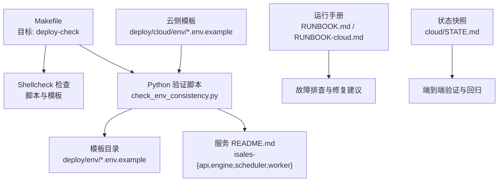
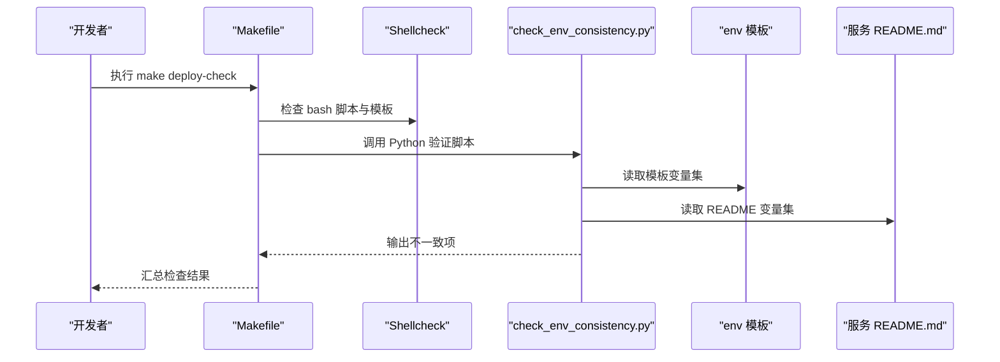
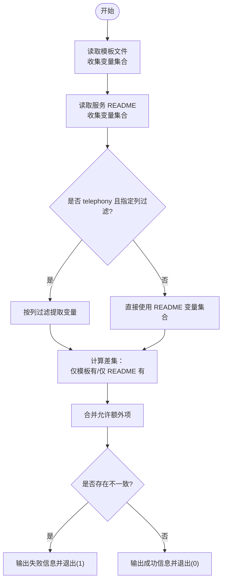
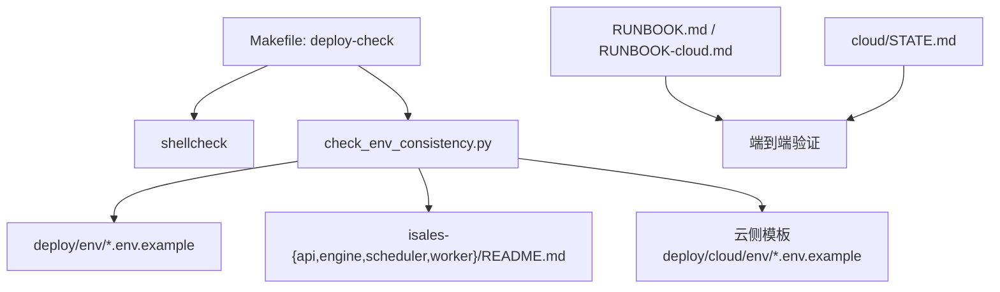

# 配置验证与检查

<cite>
**本文引用的文件**
- [check_env_consistency.py](file://deploy/linux/scripts/check_env_consistency.py)
- [Makefile](file://Makefile)
- [deploy/README.md](file://deploy/README.md)
- [deploy/cloud/README.md](file://deploy/cloud/README.md)
- [deploy/cloud/STATE.md](file://deploy/cloud/STATE.md)
- [deploy/RUNBOOK.md](file://deploy/RUNBOOK.md)
- [deploy/RUNBOOK-cloud.md](file://deploy/RUNBOOK-cloud.md)
- [deploy/cloud/env/README.md](file://deploy/cloud/env/README.md)
- [deploy/cloud/env/SECRETS.md.example](file://deploy/cloud/env/SECRETS.md.example)
- [deploy/cloud/env/api.env.example](file://deploy/cloud/env/api.env.example)
- [deploy/cloud/env/engine.env.example](file://deploy/cloud/env/engine.env.example)
- [deploy/cloud/env/scheduler.env.example](file://deploy/cloud/env/scheduler.env.example)
- [deploy/cloud/env/worker.env.example](file://deploy/cloud/env/worker.env.example)
- [deploy/env/api.env.example](file://deploy/env/api.env.example)
- [deploy/env/engine.env.example](file://deploy/env/engine.env.example)
- [deploy/env/scheduler.env.example](file://deploy/env/scheduler.env.example)
- [deploy/env/worker.env.example](file://deploy/env/worker.env.example)
</cite>

## 目录
1. [简介](#简介)
2. [项目结构](#项目结构)
3. [核心组件](#核心组件)
4. [架构总览](#架构总览)
5. [详细组件分析](#详细组件分析)
6. [依赖关系分析](#依赖关系分析)
7. [性能考量](#性能考量)
8. [故障排查指南](#故障排查指南)
9. [结论](#结论)
10. [附录](#附录)

## 简介
本文件围绕环境变量配置的验证与检查机制展开，重点覆盖以下方面：
- 配置一致性检查脚本的工作原理与规则
- 部署前的配置验证流程与自动化集成
- 数据库连接验证、Redis 连接测试与 JWT 密钥匹配检查的实践
- 自定义验证规则与扩展方法
- 配置错误的诊断方法、常见问题排查与修复建议
- 配置模板的版本管理、变更追踪与回滚机制
- 在持续集成中的自动化集成与最佳实践

## 项目结构
本项目的配置验证与检查主要分布在以下位置：
- 验证脚本：`deploy/linux/scripts/check_env_consistency.py`
- Makefile 中的部署检查目标：`deploy-check`
- 环境变量模板：`deploy/env/*.env.example`（单主机）与 `deploy/cloud/env/*.env.example`（云-边）
- 运行手册与状态说明：`deploy/RUNBOOK.md`、`deploy/RUNBOOK-cloud.md`、`deploy/cloud/STATE.md`
- 云侧密钥与模板说明：`deploy/cloud/env/README.md`、`deploy/cloud/env/SECRETS.md.example`

图表来源
- [Makefile:19-29](file://Makefile#L19-L29)
- [check_env_consistency.py:118-156](file://deploy/linux/scripts/check_env_consistency.py#L118-L156)

章节来源
- [Makefile:19-29](file://Makefile#L19-L29)
- [deploy/README.md:83-102](file://deploy/README.md#L83-L102)
- [deploy/cloud/README.md:94-111](file://deploy/cloud/README.md#L94-L111)

## 核心组件
- 配置一致性检查脚本：解析模板与服务 README，提取变量集合，进行双向比对，输出缺失项与额外项。
- Makefile 部署检查目标：统一触发 shellcheck 与 Python 验证脚本，形成标准化的部署前检查流水线。
- 环境变量模板：提供跨服务共享的关键变量（如数据库 URL、Redis URL、JWT 密钥、Fernet 主密钥）及其一致性约束注释。
- 运行手册与状态说明：提供故障排查清单、端到端验证步骤与回滚流程。

章节来源
- [check_env_consistency.py:118-156](file://deploy/linux/scripts/check_env_consistency.py#L118-L156)
- [Makefile:19-29](file://Makefile#L19-L29)
- [deploy/env/api.env.example:1-14](file://deploy/env/api.env.example#L1-L14)
- [deploy/cloud/env/api.env.example:1-24](file://deploy/cloud/env/api.env.example#L1-L24)

## 架构总览
配置验证的总体流程如下：
- 通过 Makefile 的 `deploy-check` 目标启动检查
- Shellcheck 检查脚本与模板的语法与风格
- Python 脚本扫描模板与对应服务 README，提取变量列表
- 对比模板变量与 README 声明的变量，输出不一致项
- 结合运行手册与状态说明，进行端到端验证与回滚

图表来源
- [Makefile:22-29](file://Makefile#L22-L29)
- [check_env_consistency.py:118-156](file://deploy/linux/scripts/check_env_consistency.py#L118-L156)

## 详细组件分析

### 配置一致性检查脚本
- 功能概述
  - 解析模板文件中的变量（包括注释中的变量行），收集模板变量集合
  - 从服务 README 中提取变量集合（支持表格列过滤，如 telephony 的 api/modem 列）
  - 对比模板变量与 README 变量，输出“仅在模板存在”和“仅在 README 存在”的差异
  - 支持服务特定的“额外允许项”，用于忽略模板中非 README 文档化的变量
- 关键规则
  - 变量命名：模板与 README 均采用大写、下划线、数字的命名规范
  - README 变量提取：支持行内代码标记与表格列过滤
  - 服务映射：将模板名称映射到对应服务仓库，并按 telephony 的列过滤
  - 允许额外项：跨服务共享的平台约定变量（如 TZ）与特定服务的调试开关
- 输出与退出码
  - 任何不一致均导致非零退出码，便于 CI/CD 中断

图表来源
- [check_env_consistency.py:59-115](file://deploy/linux/scripts/check_env_consistency.py#L59-L115)
- [check_env_consistency.py:118-156](file://deploy/linux/scripts/check_env_consistency.py#L118-L156)

章节来源
- [check_env_consistency.py:118-156](file://deploy/linux/scripts/check_env_consistency.py#L118-L156)
- [check_env_consistency.py:44-53](file://deploy/linux/scripts/check_env_consistency.py#L44-L53)

### 部署前配置验证流程
- Makefile 目标
  - shellcheck：检查 bash 脚本与模板的语法与风格
  - Python 验证：调用 `check_env_consistency.py` 进行模板与 README 的变量一致性检查
- 执行方式
  - 在本地或 CI 环境中运行 `make deploy-check`
  - 如需跳过 shellcheck，可在本地安装后继续执行 Python 验证

章节来源
- [Makefile:22-29](file://Makefile#L22-L29)

### 数据库连接验证与 Redis 连接测试
- 数据库连接验证
  - 使用模板中的数据库 URL 进行连接测试（推荐在部署前使用数据库客户端连接）
  - 核对用户名、密码、主机、端口与数据库名是否与 README 一致
- Redis 连接测试
  - 使用模板中的 Redis URL 进行连接测试（推荐在部署前使用 Redis 客户端连接）
  - 核对主机、端口、数据库索引与密码（如启用）是否与 README 一致
- 端到端验证
  - 云侧状态说明提供了端到端 smoke 步骤，包括 gRPC 连通性、心跳、令牌签发与引擎监听状态

章节来源
- [deploy/cloud/STATE.md:442-487](file://deploy/cloud/STATE.md#L442-L487)
- [deploy/cloud/STATE.md:527-552](file://deploy/cloud/STATE.md#L527-L552)

### JWT 密钥匹配检查
- 范围与影响
  - 用户会话 JWT 与边缘设备令牌共享同一密钥（HS256）
  - 密钥轮换会导致用户重新登录与边缘设备重新签发令牌
- 检查要点
  - 确保所有相关服务的 JWT 密钥一致
  - 云侧状态说明展示了密钥在 API 与引擎之间的使用场景

章节来源
- [deploy/cloud/STATE.md:545-545](file://deploy/cloud/STATE.md#L545-L545)
- [deploy/cloud/env/api.env.example:6-13](file://deploy/cloud/env/api.env.example#L6-L13)

### 自定义验证规则与扩展
- 模板变量集合扩展
  - 在模板中添加新的变量时，确保 README 中同步声明，以避免“仅模板存在”的差异
- README 变量提取增强
  - README 中的表格列过滤仅适用于 telephony 的 api/modem 列，其他服务请在文本中明确列出变量
- 允许额外项
  - 如需忽略某些模板变量，可在脚本的允许额外项字典中添加，但需谨慎评估风险

章节来源
- [check_env_consistency.py:77-115](file://deploy/linux/scripts/check_env_consistency.py#L77-L115)
- [check_env_consistency.py:44-53](file://deploy/linux/scripts/check_env_consistency.py#L44-L53)

## 依赖关系分析
- 组件耦合
  - Python 验证脚本依赖模板与服务 README 的存在性
  - Makefile 目标依赖 shellcheck 可用性与 Python 环境
- 外部依赖
  - 数据库与 Redis 的连接测试依赖相应客户端工具
  - 云侧 gRPC 连通性依赖边缘设备令牌与网络可达性

图表来源
- [Makefile:22-29](file://Makefile#L22-L29)
- [check_env_consistency.py:118-156](file://deploy/linux/scripts/check_env_consistency.py#L118-L156)

章节来源
- [Makefile:22-29](file://Makefile#L22-L29)
- [check_env_consistency.py:118-156](file://deploy/linux/scripts/check_env_consistency.py#L118-L156)

## 性能考量
- 验证脚本复杂度
  - 变量提取与集合运算为线性复杂度，模板与 README 的规模通常较小，验证耗时可忽略
- CI 集成建议
  - 将 shellcheck 与 Python 验证并行执行，缩短整体检查时间
  - 在大型仓库中，可按服务维度分批运行，减少不必要的重复检查

## 故障排查指南
- 常见症状与定位
  - “仅模板存在”差异：检查 README 是否遗漏变量声明
  - “仅 README 存在”差异：检查模板是否缺少变量定义
  - 数据库/Redis 连接失败：核对 URL、认证与网络可达性
  - JWT 密钥不一致：统一密钥并重启相关服务
- 一键排查清单
  - 使用运行手册中的健康检查命令与日志查看命令快速定位问题
  - 云侧状态说明提供了端到端 smoke 步骤，可用于回归验证

章节来源
- [deploy/RUNBOOK.md:163-196](file://deploy/RUNBOOK.md#L163-L196)
- [deploy/RUNBOOK-cloud.md:584-599](file://deploy/RUNBOOK-cloud.md#L584-L599)
- [deploy/cloud/STATE.md:442-487](file://deploy/cloud/STATE.md#L442-L487)

## 结论
本项目的配置验证与检查机制通过 Makefile 统一入口、shellcheck 与 Python 脚本协同，实现了对模板与服务文档的一致性校验。结合运行手册与状态说明，能够有效保障部署前的配置质量，降低因配置不一致导致的运行时问题。建议在 CI/CD 中固化该检查流程，并根据需要扩展自定义验证规则与端到端验证步骤。

## 附录

### 配置模板与一致性约束
- 单主机模板
  - API/Engine/Scheduler/Worker 的模板文件包含跨服务共享的数据库 URL、Redis URL、时区等变量
- 云-边模板
  - 云侧模板进一步包含 JWT 密钥、Fernet 主密钥、RTC AppId/AppKey、gRPC 绑定地址等变量
  - README 与 SECRETS.md 提供密钥生成、轮换与灾难恢复的操作指引

章节来源
- [deploy/env/api.env.example:1-14](file://deploy/env/api.env.example#L1-L14)
- [deploy/env/engine.env.example:1-21](file://deploy/env/engine.env.example#L1-L21)
- [deploy/env/scheduler.env.example:1-21](file://deploy/env/scheduler.env.example#L1-L21)
- [deploy/env/worker.env.example:1-20](file://deploy/env/worker.env.example#L1-L20)
- [deploy/cloud/env/api.env.example:1-24](file://deploy/cloud/env/api.env.example#L1-L24)
- [deploy/cloud/env/engine.env.example:1-76](file://deploy/cloud/env/engine.env.example#L1-L76)
- [deploy/cloud/env/scheduler.env.example:1-25](file://deploy/cloud/env/scheduler.env.example#L1-L25)
- [deploy/cloud/env/worker.env.example:1-28](file://deploy/cloud/env/worker.env.example#L1-L28)
- [deploy/cloud/env/README.md:12-26](file://deploy/cloud/env/README.md#L12-L26)
- [deploy/cloud/env/SECRETS.md.example:12-46](file://deploy/cloud/env/SECRETS.md.example#L12-L46)

### 版本管理、变更追踪与回滚
- 版本管理
  - 云侧状态说明记录了每次部署的状态快照与变更摘要，便于回溯与审计
- 变更追踪
  - 运行手册与状态说明提供了变更影响范围与验证步骤
- 回滚机制
  - 云侧与单主机均提供回滚脚本与流程，回滚时注意数据库 schema 的兼容性

章节来源
- [deploy/cloud/STATE.md:19-28](file://deploy/cloud/STATE.md#L19-L28)
- [deploy/RUNBOOK.md:84-115](file://deploy/RUNBOOK.md#L84-L115)
- [deploy/RUNBOOK-cloud.md:281-297](file://deploy/RUNBOOK-cloud.md#L281-L297)