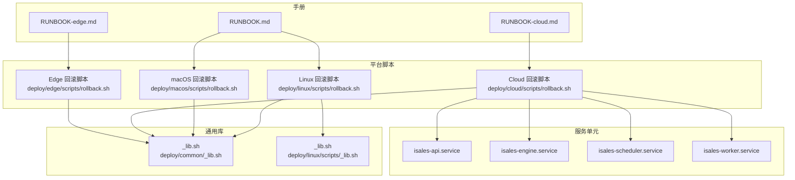
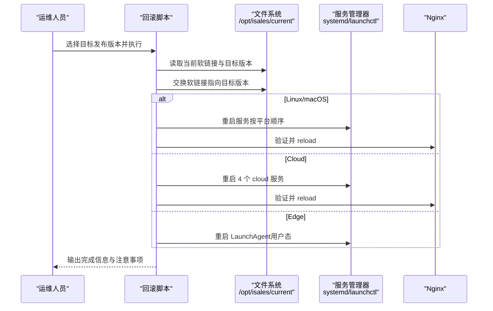
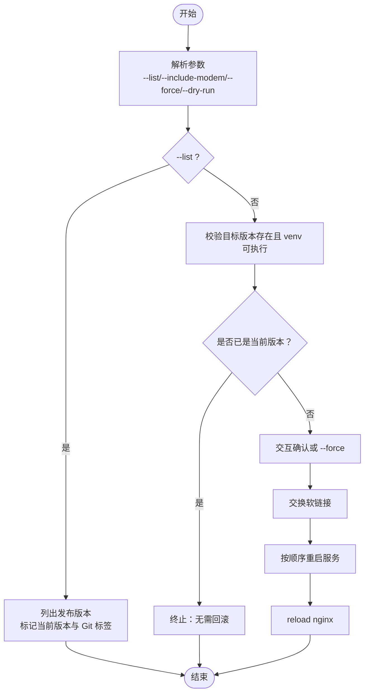
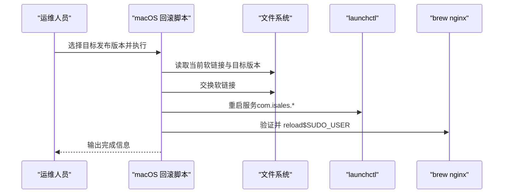
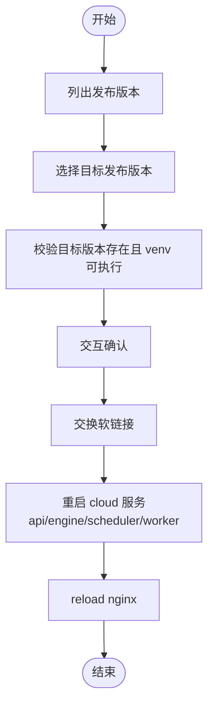
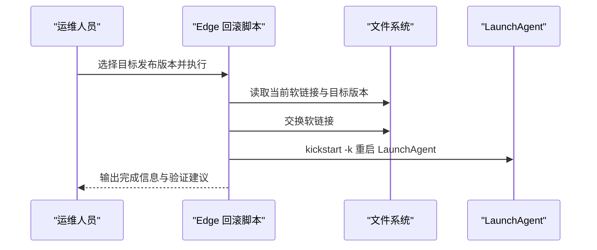
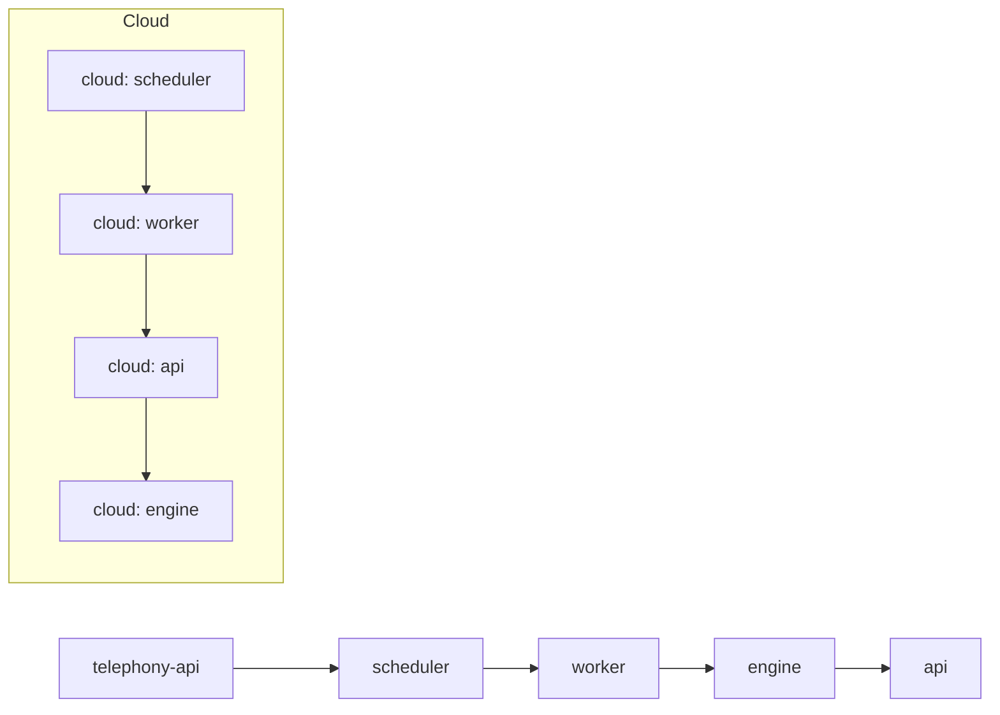
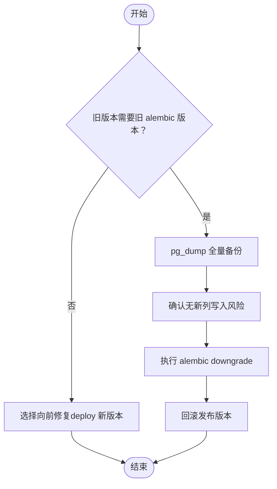
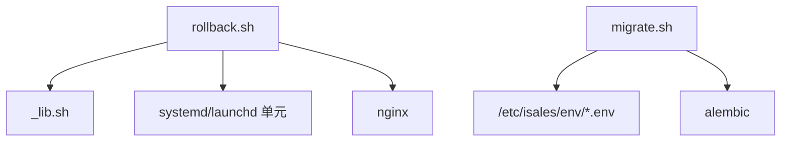

# 回滚操作

<cite>
**本文引用的文件**
- [deploy/cloud/scripts/rollback.sh](file://deploy/cloud/scripts/rollback.sh)
- [deploy/linux/scripts/rollback.sh](file://deploy/linux/scripts/rollback.sh)
- [deploy/macos/scripts/rollback.sh](file://deploy/macos/scripts/rollback.sh)
- [deploy/edge/scripts/rollback.sh](file://deploy/edge/scripts/rollback.sh)
- [deploy/cloud/systemd/isales-api.service](file://deploy/cloud/systemd/isales-api.service)
- [deploy/cloud/systemd/isales-engine.service](file://deploy/cloud/systemd/isales-engine.service)
- [deploy/cloud/systemd/isales-scheduler.service](file://deploy/cloud/systemd/isales-scheduler.service)
- [deploy/cloud/systemd/isales-worker.service](file://deploy/cloud/systemd/isales-worker.service)
- [deploy/common/_lib.sh](file://deploy/common/_lib.sh)
- [deploy/linux/scripts/_lib.sh](file://deploy/linux/scripts/_lib.sh)
- [deploy/linux/scripts/migrate.sh](file://deploy/linux/scripts/migrate.sh)
- [deploy/macos/scripts/migrate.sh](file://deploy/macos/scripts/migrate.sh)
- [deploy/RUNBOOK.md](file://deploy/RUNBOOK.md)
- [deploy/RUNBOOK-cloud.md](file://deploy/RUNBOOK-cloud.md)
- [deploy/RUNBOOK-edge.md](file://deploy/RUNBOOK-edge.md)
</cite>

## 目录
1. [简介](#简介)
2. [项目结构](#项目结构)
3. [核心组件](#核心组件)
4. [架构总览](#架构总览)
5. [详细组件分析](#详细组件分析)
6. [依赖关系分析](#依赖关系分析)
7. [性能考量](#性能考量)
8. [故障排查指南](#故障排查指南)
9. [结论](#结论)
10. [附录](#附录)

## 简介
本指南面向 iSales 生产运维工程师，系统化讲解“回滚”操作的触发条件、操作步骤、注意事项与最佳实践。重点覆盖：
- 回滚脚本的使用方法、版本列表查看与目标版本选择
- 数据库模式回滚的危险性与安全策略（向前修复 vs 向下兼容）
- 回滚过程中的服务重启顺序、数据一致性保障与回滚后验证
- 回滚失败的应急处理、数据恢复与重新部署策略
- 回滚操作的最佳实践与风险控制措施

## 项目结构
围绕回滚相关的核心文件分布如下：
- Linux/macOS/cloud/edge 各平台均提供独立的回滚脚本，统一通过软链接切换至目标发布版本，并按平台约定顺序重启服务
- 通用库提供日志、交互确认、Dry-run/Force 等能力
- systemd/launchd 服务单元定义了各服务的启动、超时与环境变量来源
- 运行手册（RUNBOOK）提供了回滚流程、schema 回滚例外流程、备份恢复演练与应急速查

**图表来源**
- [deploy/cloud/scripts/rollback.sh:1-114](file://deploy/cloud/scripts/rollback.sh#L1-L114)
- [deploy/linux/scripts/rollback.sh:1-114](file://deploy/linux/scripts/rollback.sh#L1-L114)
- [deploy/macos/scripts/rollback.sh:1-129](file://deploy/macos/scripts/rollback.sh#L1-L129)
- [deploy/edge/scripts/rollback.sh:1-95](file://deploy/edge/scripts/rollback.sh#L1-L95)
- [deploy/common/_lib.sh:1-181](file://deploy/common/_lib.sh#L1-L181)
- [deploy/linux/scripts/_lib.sh:1-47](file://deploy/linux/scripts/_lib.sh#L1-L47)
- [deploy/cloud/systemd/isales-api.service:1-35](file://deploy/cloud/systemd/isales-api.service#L1-L35)
- [deploy/cloud/systemd/isales-engine.service:1-42](file://deploy/cloud/systemd/isales-engine.service#L1-L42)
- [deploy/cloud/systemd/isales-scheduler.service:1-31](file://deploy/cloud/systemd/isales-scheduler.service#L1-L31)
- [deploy/cloud/systemd/isales-worker.service:1-31](file://deploy/cloud/systemd/isales-worker.service#L1-L31)
- [deploy/RUNBOOK.md:84-116](file://deploy/RUNBOOK.md#L84-L116)
- [deploy/RUNBOOK-cloud.md:281-298](file://deploy/RUNBOOK-cloud.md#L281-L298)
- [deploy/RUNBOOK-edge.md:123-135](file://deploy/RUNBOOK-edge.md#L123-L135)

**章节来源**
- [deploy/RUNBOOK.md:84-116](file://deploy/RUNBOOK.md#L84-L116)
- [deploy/RUNBOOK-cloud.md:281-298](file://deploy/RUNBOOK-cloud.md#L281-L298)
- [deploy/RUNBOOK-edge.md:123-135](file://deploy/RUNBOOK-edge.md#L123-L135)

## 核心组件
- 回滚脚本（Linux/macOS/cloud/edge）
  - 功能：列出可用发布版本、校验目标版本、交换软链接、按平台顺序重启服务、必要时 reload nginx
  - 差异：cloud 版本不触达边缘侧服务；edge 版本为 per-user 操作，保留本地 SQLite 离线缓冲
- 通用库（_lib.sh）
  - 提供日志、交互确认、Dry-run/Force、命令执行包装、环境模板引导等能力
- 服务单元（systemd/launchd）
  - 定义服务 ExecStart、工作目录、重启策略、超时、环境变量来源与安全加固项
- 运行手册（RUNBOOK）
  - 明确回滚流程、schema 回滚例外流程、备份恢复演练与应急速查

**章节来源**
- [deploy/cloud/scripts/rollback.sh:1-114](file://deploy/cloud/scripts/rollback.sh#L1-L114)
- [deploy/linux/scripts/rollback.sh:1-114](file://deploy/linux/scripts/rollback.sh#L1-L114)
- [deploy/macos/scripts/rollback.sh:1-129](file://deploy/macos/scripts/rollback.sh#L1-L129)
- [deploy/edge/scripts/rollback.sh:1-95](file://deploy/edge/scripts/rollback.sh#L1-L95)
- [deploy/common/_lib.sh:1-181](file://deploy/common/_lib.sh#L1-L181)
- [deploy/RUNBOOK.md:84-116](file://deploy/RUNBOOK.md#L84-L116)
- [deploy/RUNBOOK-cloud.md:281-298](file://deploy/RUNBOOK-cloud.md#L281-L298)
- [deploy/RUNBOOK-edge.md:123-135](file://deploy/RUNBOOK-edge.md#L123-L135)

## 架构总览
回滚在平台层面遵循“软链接切换 + 有序重启”的通用模式，同时考虑服务依赖与运行时影响。

**图表来源**
- [deploy/cloud/scripts/rollback.sh:94-114](file://deploy/cloud/scripts/rollback.sh#L94-L114)
- [deploy/linux/scripts/rollback.sh:89-114](file://deploy/linux/scripts/rollback.sh#L89-L114)
- [deploy/macos/scripts/rollback.sh:95-129](file://deploy/macos/scripts/rollback.sh#L95-L129)
- [deploy/edge/scripts/rollback.sh:86-95](file://deploy/edge/scripts/rollback.sh#L86-L95)

**章节来源**
- [deploy/cloud/scripts/rollback.sh:82-114](file://deploy/cloud/scripts/rollback.sh#L82-L114)
- [deploy/linux/scripts/rollback.sh:78-114](file://deploy/linux/scripts/rollback.sh#L78-L114)
- [deploy/macos/scripts/rollback.sh:84-129](file://deploy/macos/scripts/rollback.sh#L84-L129)
- [deploy/edge/scripts/rollback.sh:78-95](file://deploy/edge/scripts/rollback.sh#L78-L95)

## 详细组件分析

### Linux 回滚脚本
- 触发条件
  - 发布版本存在且包含有效 Python 虚拟环境
  - 当前软链接与目标版本不同
  - 交互确认通过（或使用 --force）
- 操作步骤
  - 列表模式：按修改时间倒序展示可用发布版本，标注当前版本与 Git 标签
  - 交换软链接并重启服务（telephony-api → scheduler → worker → engine → api）
  - 可选重启 modem-controller（通过 --include-modem）
  - reload nginx
- 注意事项
  - 默认不触碰数据库 schema；如旧版本需要旧 alembic 版本，请参考 RUNBOOK 的 schema 回滚例外流程
  - 若目标版本缺少引擎所需的 DingRTC 绑定，需先在该版本上运行安装流程

**图表来源**
- [deploy/linux/scripts/rollback.sh:22-114](file://deploy/linux/scripts/rollback.sh#L22-L114)
- [deploy/common/_lib.sh:50-103](file://deploy/common/_lib.sh#L50-L103)

**章节来源**
- [deploy/linux/scripts/rollback.sh:1-114](file://deploy/linux/scripts/rollback.sh#L1-L114)
- [deploy/RUNBOOK.md:84-116](file://deploy/RUNBOOK.md#L84-L116)

### macOS 回滚脚本
- 触发条件与步骤与 Linux 类似，差异在于服务管理采用 launchctl，nginx 通过 Homebrew 服务 reload
- 特殊点
  - 使用 /opt/homebrew/bin/bash 以满足 bash 4+ 要求
  - nginx reload 需要在 $SUDO_USER 下执行 brew services reload
  - 保留数据库 schema 不变，必要时参考 RUNBOOK 的 schema 回滚例外流程

**图表来源**
- [deploy/macos/scripts/rollback.sh:95-129](file://deploy/macos/scripts/rollback.sh#L95-L129)

**章节来源**
- [deploy/macos/scripts/rollback.sh:1-129](file://deploy/macos/scripts/rollback.sh#L1-L129)
- [deploy/RUNBOOK.md:295-310](file://deploy/RUNBOOK.md#L295-L310)

### Cloud 回滚脚本
- 仅重启 4 个 cloud 服务（api/engine/scheduler/worker），不触达边缘侧服务
- 不改动数据库 schema；如确需旧 schema，请参考 RUNBOOK-cloud 的 schema 回滚例外流程
- reload nginx

**图表来源**
- [deploy/cloud/scripts/rollback.sh:40-114](file://deploy/cloud/scripts/rollback.sh#L40-L114)

**章节来源**
- [deploy/cloud/scripts/rollback.sh:1-114](file://deploy/cloud/scripts/rollback.sh#L1-L114)
- [deploy/RUNBOOK-cloud.md:281-298](file://deploy/RUNBOOK-cloud.md#L281-L298)

### Edge 回滚脚本
- per-user 操作（非 root），用于边缘 Mac mini
- 保留用户态 SQLite 离线缓冲（~/Library/Application Support/isales/sqlite/edge_buffer.db），回滚不丢弃
- 通过 launchctl kickstart -k 重启 LaunchAgent

**图表来源**
- [deploy/edge/scripts/rollback.sh:86-95](file://deploy/edge/scripts/rollback.sh#L86-L95)

**章节来源**
- [deploy/edge/scripts/rollback.sh:1-95](file://deploy/edge/scripts/rollback.sh#L1-L95)
- [deploy/RUNBOOK-edge.md:123-135](file://deploy/RUNBOOK-edge.md#L123-L135)

### 服务重启顺序与依赖
- Linux/macOS（telephony-api → scheduler → worker → engine → api）
- Cloud（scheduler → worker → api → engine）
- systemd/launchd 服务单元定义了 ExecStart、工作目录、重启策略与超时，确保优雅停止与重启

**图表来源**
- [deploy/linux/scripts/rollback.sh:91-101](file://deploy/linux/scripts/rollback.sh#L91-L101)
- [deploy/cloud/scripts/rollback.sh:96-107](file://deploy/cloud/scripts/rollback.sh#L96-L107)
- [deploy/cloud/systemd/isales-api.service:6-14](file://deploy/cloud/systemd/isales-api.service#L6-L14)
- [deploy/cloud/systemd/isales-engine.service:8-18](file://deploy/cloud/systemd/isales-engine.service#L8-L18)
- [deploy/cloud/systemd/isales-scheduler.service:6-13](file://deploy/cloud/systemd/isales-scheduler.service#L6-L13)
- [deploy/cloud/systemd/isales-worker.service:6-13](file://deploy/cloud/systemd/isales-worker.service#L6-L13)

**章节来源**
- [deploy/linux/scripts/rollback.sh:91-101](file://deploy/linux/scripts/rollback.sh#L91-L101)
- [deploy/cloud/scripts/rollback.sh:96-107](file://deploy/cloud/scripts/rollback.sh#L96-L107)
- [deploy/cloud/systemd/isales-api.service:6-14](file://deploy/cloud/systemd/isales-api.service#L6-L14)
- [deploy/cloud/systemd/isales-engine.service:8-18](file://deploy/cloud/systemd/isales-engine.service#L8-L18)
- [deploy/cloud/systemd/isales-scheduler.service:6-13](file://deploy/cloud/systemd/isales-scheduler.service#L6-L13)
- [deploy/cloud/systemd/isales-worker.service:6-13](file://deploy/cloud/systemd/isales-worker.service#L6-L13)

### 数据库模式回滚与安全策略
- 默认策略：回滚脚本不触碰数据库 schema，保持 forward-applied（多数 v1 schema 变更可逆/新增）
- 危险性：当旧版本需要旧 alembic revision 时，向下兼容存在风险（例如新增列被旧代码误用）
- 安全策略
  - 优先选择“向前修复”（forward-fix）：在新版本中修复问题并通过 deploy.sh 发布
  - 仅在确证无新列写入场景下执行“向下兼容”（downgrade），并先行全量备份
- 运维流程
  - 通过 RUNBOOK 的“rollback-schema 例外流程”执行 alembic downgrade
  - 回滚发布版本后，再根据需要执行 schema 回滚

**图表来源**
- [deploy/RUNBOOK.md:97-116](file://deploy/RUNBOOK.md#L97-L116)
- [deploy/RUNBOOK-cloud.md:459-476](file://deploy/RUNBOOK-cloud.md#L459-L476)

**章节来源**
- [deploy/RUNBOOK.md:97-116](file://deploy/RUNBOOK.md#L97-L116)
- [deploy/RUNBOOK-cloud.md:459-476](file://deploy/RUNBOOK-cloud.md#L459-L476)

### 回滚后的验证步骤
- 服务健康
  - Linux/macOS：systemctl/status 查看各服务状态
  - Cloud：验证 nginx 与 4 个 cloud 服务
  - Edge：查看 LaunchAgent 日志与 gRPC 连通性
- 数据一致性
  - 通过 RUNBOOK 的备份恢复演练验证数据库与缓存一致性
- 业务验证
  - 运行 smoke test，确认 API 健康、前端可访问、边缘设备重连成功

**章节来源**
- [deploy/RUNBOOK.md:163-196](file://deploy/RUNBOOK.md#L163-L196)
- [deploy/RUNBOOK-cloud.md:300-323](file://deploy/RUNBOOK-cloud.md#L300-L323)
- [deploy/RUNBOOK-edge.md:123-135](file://deploy/RUNBOOK-edge.md#L123-L135)

## 依赖关系分析
- 回滚脚本依赖通用库提供日志、交互确认、Dry-run/Force、命令执行包装
- 服务单元定义了服务生命周期与环境变量来源，回滚后由 systemd/launchctl 重新加载
- 迁移脚本与回滚脚本解耦，便于回滚时跳过 schema 变更

**图表来源**
- [deploy/common/_lib.sh:1-181](file://deploy/common/_lib.sh#L1-L181)
- [deploy/linux/scripts/migrate.sh:32-60](file://deploy/linux/scripts/migrate.sh#L32-L60)
- [deploy/macos/scripts/migrate.sh:42-72](file://deploy/macos/scripts/migrate.sh#L42-L72)

**章节来源**
- [deploy/common/_lib.sh:1-181](file://deploy/common/_lib.sh#L1-L181)
- [deploy/linux/scripts/migrate.sh:1-61](file://deploy/linux/scripts/migrate.sh#L1-L61)
- [deploy/macos/scripts/migrate.sh:1-72](file://deploy/macos/scripts/migrate.sh#L1-L72)

## 性能考量
- 回滚窗口选择：尽量在业务低峰期执行，避免影响正在进行的通话与任务队列
- 服务重启顺序：先重启下游服务，最后重启 engine，减少边缘 gRPC 流中断时间
- nginx reload：在回滚过程中进行，避免长时间停机
- 边缘设备：自动重连，回滚期间可能出现短暂中断，但不会丢失离线缓冲数据

[本节为通用指导，不涉及具体文件分析]

## 故障排查指南
- 常见症状与处置
  - nginx 502：检查 nginx 状态与配置语法，验证后端服务健康
  - engine 通话中断：检查 engine 重启策略与超时配置
  - 边缘设备离线：检查 gRPC 与 TLS 配置、DNS 与端口可达性
  - 数据库连接打满：调整连接池配置
- 应急速查
  - 参考 RUNBOOK 的“应急速查”章节，快速定位问题并采取行动
- 备份恢复
  - 定期执行备份恢复演练，确保备份可用与一致性验证

**章节来源**
- [deploy/RUNBOOK.md:163-196](file://deploy/RUNBOOK.md#L163-L196)
- [deploy/RUNBOOK-cloud.md:584-599](file://deploy/RUNBOOK-cloud.md#L584-L599)
- [deploy/RUNBOOK-edge.md:241-254](file://deploy/RUNBOOK-edge.md#L241-L254)

## 结论
回滚是生产环境中应对突发问题的关键手段。iSales 的回滚流程通过“软链接切换 + 有序重启”的方式，最小化对业务的影响。默认不触碰数据库 schema，优先采用向前修复策略；仅在确证风险可控时执行 schema 回滚。配合备份恢复演练与应急速查，可显著提升回滚成功率与恢复速度。

[本节为总结性内容，不涉及具体文件分析]

## 附录
- 回滚脚本使用要点
  - 列出版本：--list
  - 强制执行：--force
  - 预演模式：--dry-run
  - Linux/macOS：--include-modem（可选）
- 服务单元关键参数
  - ExecStart、WorkingDirectory、Restart、TimeoutStopSec、EnvironmentFile
- 迁移脚本与回滚脚本的关系
  - 迁移脚本负责 schema 升级，回滚脚本负责发布版本切换与服务重启

**章节来源**
- [deploy/common/_lib.sh:50-103](file://deploy/common/_lib.sh#L50-L103)
- [deploy/cloud/systemd/isales-api.service:6-14](file://deploy/cloud/systemd/isales-api.service#L6-L14)
- [deploy/cloud/systemd/isales-engine.service:8-18](file://deploy/cloud/systemd/isales-engine.service#L8-L18)
- [deploy/cloud/systemd/isales-scheduler.service:6-13](file://deploy/cloud/systemd/isales-scheduler.service#L6-L13)
- [deploy/cloud/systemd/isales-worker.service:6-13](file://deploy/cloud/systemd/isales-worker.service#L6-L13)
- [deploy/linux/scripts/migrate.sh:1-61](file://deploy/linux/scripts/migrate.sh#L1-L61)
- [deploy/macos/scripts/migrate.sh:1-72](file://deploy/macos/scripts/migrate.sh#L1-L72)