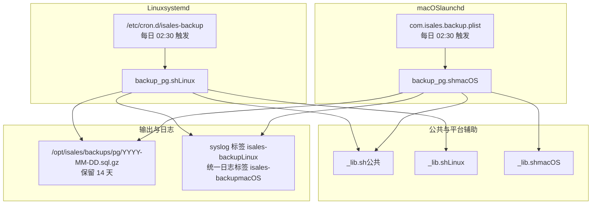
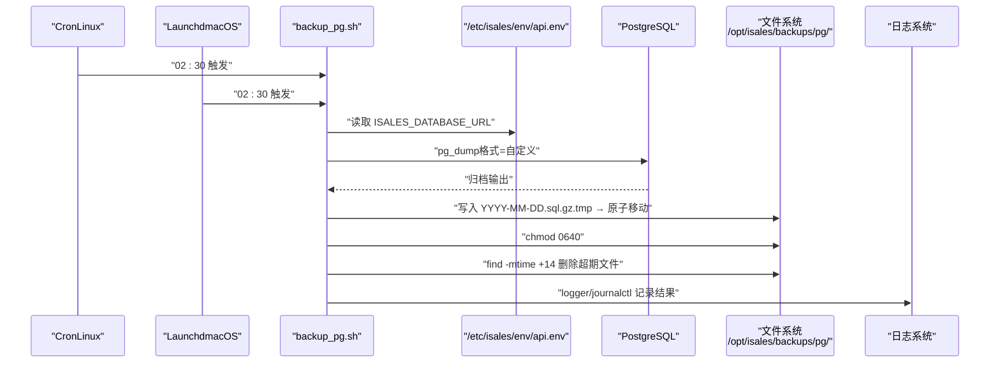
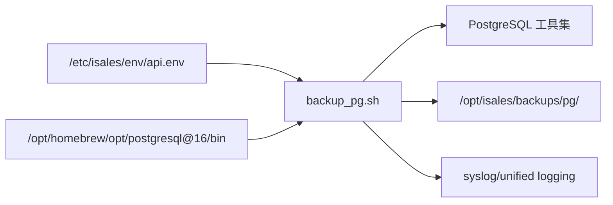

# PostgreSQL 备份与恢复

<cite>
**本文引用的文件**
- [isales-backup.cron](file://deploy/cron/isales-backup.cron)
- [backup_pg.sh（Linux）](file://deploy/linux/scripts/backup_pg.sh)
- [backup_pg.sh（macOS）](file://deploy/macos/scripts/backup_pg.sh)
- [_lib.sh（Linux）](file://deploy/linux/scripts/_lib.sh)
- [_lib.sh（macOS）](file://deploy/macos/scripts/_lib.sh)
- [_lib.sh（公共）](file://deploy/common/_lib.sh)
- [com.isales.backup.plist](file://deploy/macos/launchd-jobs/com.isales.backup.plist)
- [RUNBOOK.md](file://deploy/RUNBOOK.md)
- [RUNBOOK-cloud.md](file://deploy/RUNBOOK-cloud.md)
- [api.env（单机）](file://deploy/env/api.env.example)
- [api.env（云边）](file://deploy/cloud/env/api.env.example)
</cite>

## 目录
1. [简介](#简介)
2. [项目结构](#项目结构)
3. [核心组件](#核心组件)
4. [架构总览](#架构总览)
5. [详细组件分析](#详细组件分析)
6. [依赖关系分析](#依赖关系分析)
7. [性能考量](#性能考量)
8. [故障排查指南](#故障排查指南)
9. [结论](#结论)
10. [附录](#附录)

## 简介
本指南面向 iSales 生产环境，围绕 PostgreSQL 数据库的备份与恢复提供完整操作说明。内容覆盖：
- 自动备份配置与触发机制（Linux cron 与 macOS launchd）
- 手动备份触发与备份文件管理（命名规范、存储位置、保留策略）
- 备份恢复演练流程（测试实例创建、数据恢复验证、完整性检查）
- 备份文件验证方法（gunzip -t）
- 恢复过程中的数据一致性保障与错误处理
- 备份失败应急处理、最佳实践与生产环境恢复安全注意事项

## 项目结构
iSales 的备份与恢复能力由平台无关的公共脚本与平台特定实现共同组成，并通过系统任务调度器统一触发。

图表来源
- [isales-backup.cron:1-14](file://deploy/cron/isales-backup.cron#L1-L14)
- [backup_pg.sh（Linux）:1-50](file://deploy/linux/scripts/backup_pg.sh#L1-L50)
- [backup_pg.sh（macOS）:1-56](file://deploy/macos/scripts/backup_pg.sh#L1-L56)
- [_lib.sh（公共）:1-181](file://deploy/common/_lib.sh#L1-L181)
- [_lib.sh（Linux）:1-47](file://deploy/linux/scripts/_lib.sh#L1-L47)
- [_lib.sh（macOS）:1-69](file://deploy/macos/scripts/_lib.sh#L1-L69)
- [com.isales.backup.plist:1-42](file://deploy/macos/launchd-jobs/com.isales.backup.plist#L1-L42)

章节来源
- [isales-backup.cron:1-14](file://deploy/cron/isales-backup.cron#L1-L14)
- [backup_pg.sh（Linux）:1-50](file://deploy/linux/scripts/backup_pg.sh#L1-L50)
- [backup_pg.sh（macOS）:1-56](file://deploy/macos/scripts/backup_pg.sh#L1-L56)
- [_lib.sh（公共）:1-181](file://deploy/common/_lib.sh#L1-L181)
- [_lib.sh（Linux）:1-47](file://deploy/linux/scripts/_lib.sh#L1-L47)
- [_lib.sh（macOS）:1-69](file://deploy/macos/scripts/_lib.sh#L1-L69)
- [com.isales.backup.plist:1-42](file://deploy/macos/launchd-jobs/com.isales.backup.plist#L1-L42)

## 核心组件
- 自动备份任务
  - Linux：cron 条目每日 02:30 触发 PostgreSQL 备份脚本
  - macOS：launchd 作业每日 02:30 触发 PostgreSQL 备份脚本
- 备份脚本
  - 读取集中式环境文件中的数据库连接 URL，剥离 asyncpg 驱动后缀，使用 pg_dump 生成压缩归档
  - 生成文件命名遵循 YYYY-MM-DD 格式，位于 /opt/isales/backups/pg/
  - 保留策略：默认保留最近 14 天，超期自动清理
  - 失败时记录日志并返回非零退出码
- 平台辅助
  - 公共库提供日志、参数解析、权限校验等通用能力
  - macOS 脚本显式将 PostgreSQL 16 的 bin 目录加入 PATH，确保使用正确版本工具
- 恢复演练
  - 提供测试实例创建、数据恢复与完整性验证的完整流程
  - 使用 gunzip -t 验证备份文件有效性

章节来源
- [isales-backup.cron:1-14](file://deploy/cron/isales-backup.cron#L1-L14)
- [backup_pg.sh（Linux）:1-50](file://deploy/linux/scripts/backup_pg.sh#L1-L50)
- [backup_pg.sh（macOS）:1-56](file://deploy/macos/scripts/backup_pg.sh#L1-L56)
- [_lib.sh（公共）:1-181](file://deploy/common/_lib.sh#L1-L181)
- [RUNBOOK.md:118-161](file://deploy/RUNBOOK.md#L118-L161)

## 架构总览
下图展示备份与恢复的关键交互：任务调度器触发脚本，脚本读取环境、调用数据库工具生成备份，并在完成后进行保留清理与日志记录。

图表来源
- [isales-backup.cron:10-13](file://deploy/cron/isales-backup.cron#L10-L13)
- [com.isales.backup.plist:22-28](file://deploy/macos/launchd-jobs/com.isales.backup.plist#L22-L28)
- [backup_pg.sh（Linux）:35-46](file://deploy/linux/scripts/backup_pg.sh#L35-L46)
- [backup_pg.sh（macOS）:42-52](file://deploy/macos/scripts/backup_pg.sh#L42-L52)
- [api.env（单机）:9-9](file://deploy/env/api.env.example#L9-L9)
- [api.env（云边）:8-8](file://deploy/cloud/env/api.env.example#L8-L8)

## 详细组件分析

### 自动备份配置与触发
- Linux（cron）
  - 通过 /etc/cron.d/isales-backup 定义每日 02:30 的备份任务，运行用户为 isales
  - 触发顺序：先执行 PostgreSQL 备份脚本，再执行 Redis 备份脚本
- macOS（launchd）
  - 通过 com.isales.backup.plist 定义每日 02:30 的备份任务，运行用户为 _isales
  - 使用 StartCalendarInterval 指定时间点，ProgramArguments 串行执行两个脚本
  - 环境变量 BREW_PREFIX 指向 Homebrew 路径，确保工具链可用

章节来源
- [isales-backup.cron:1-14](file://deploy/cron/isales-backup.cron#L1-L14)
- [com.isales.backup.plist:1-42](file://deploy/macos/launchd-jobs/com.isales.backup.plist#L1-L42)

### 备份脚本实现（Linux 与 macOS）
- 通用流程
  - 创建备份目录（如不存在）
  - 校验 pg_dump 可用性
  - 从集中式环境文件读取数据库连接 URL，剥离 asyncpg 后缀以适配 libpq
  - 使用 pg_dump 生成自定义格式归档并通过 gzip 压缩
  - 原子写入：先写 .tmp，成功后再 rename 为目标文件
  - 设置文件权限 0640
  - 清理超期文件（默认保留 14 天）
  - 记录日志（Linux 使用 syslog 标签，macOS 使用统一日志标签）
- 平台差异
  - macOS 脚本显式将 PostgreSQL 16 的 bin 目录加入 PATH，确保使用正确版本工具
  - macOS 脚本在旧版本 bash 场景下自动重定向至 Homebrew bash

章节来源
- [backup_pg.sh（Linux）:1-50](file://deploy/linux/scripts/backup_pg.sh#L1-L50)
- [backup_pg.sh（macOS）:1-56](file://deploy/macos/scripts/backup_pg.sh#L1-L56)
- [_lib.sh（公共）:1-181](file://deploy/common/_lib.sh#L1-L181)

### 备份文件管理（命名规范与保留策略）
- 存储位置
  - /opt/isales/backups/pg/YYYY-MM-DD.sql.gz
- 命名规范
  - 日期格式 YYYY-MM-DD，便于按日检索与审计
- 保留策略
  - 默认保留 14 天，超期自动删除
  - 保留天数可通过环境变量覆盖（Linux 脚本内存在变量，cron 中未直接使用）

章节来源
- [isales-backup.cron:4-7](file://deploy/cron/isales-backup.cron#L4-L7)
- [backup_pg.sh（Linux）:9-12](file://deploy/linux/scripts/backup_pg.sh#L9-L12)
- [backup_pg.sh（Linux）:45-46](file://deploy/linux/scripts/backup_pg.sh#L45-L46)
- [backup_pg.sh（macOS）:19-23](file://deploy/macos/scripts/backup_pg.sh#L19-L23)
- [backup_pg.sh（macOS）:52-52](file://deploy/macos/scripts/backup_pg.sh#L52-L52)

### 备份恢复演练（测试实例创建、数据恢复验证与完整性检查）
- 测试实例创建
  - Linux：使用 sudo -u postgres 创建独立数据库用于恢复测试
  - macOS：使用 _isales 用户创建独立数据库用于恢复测试
- 数据恢复
  - 使用 gunzip -c 解压备份文件，通过 pg_restore 恢复到测试数据库
- 完整性检查
  - 列表对象：使用 psql 执行 \dt 等命令查看对象数量与类型
  - 关键指标核对：查询 alembic_version 与业务表（如 campaign）的行数，与备份日期对应的预期值比对
- 验证方法
  - 使用 gunzip -t 对备份文件进行自检，确保可解压

章节来源
- [RUNBOOK.md:118-161](file://deploy/RUNBOOK.md#L118-L161)
- [RUNBOOK.md:312-343](file://deploy/RUNBOOK.md#L312-L343)

### 备份文件验证与错误处理
- 验证方法
  - gunzip -t /opt/isales/backups/pg/YYYY-MM-DD.sql.gz
- 错误处理
  - 脚本在 pg_dump 失败时将错误输出写入临时文件，捕获后删除 .tmp 文件并记录日志
  - 日志标签：Linux 使用 isales-backup；macOS 使用 isales-backup（统一日志）
  - 退出码：失败返回非零，便于自动化监控与告警

章节来源
- [backup_pg.sh（Linux）:35-41](file://deploy/linux/scripts/backup_pg.sh#L35-L41)
- [backup_pg.sh（Linux）:38-40](file://deploy/linux/scripts/backup_pg.sh#L38-L40)
- [backup_pg.sh（Linux）:48-49](file://deploy/linux/scripts/backup_pg.sh#L48-L49)
- [backup_pg.sh（macOS）:42-48](file://deploy/macos/scripts/backup_pg.sh#L42-L48)
- [backup_pg.sh（macOS）:45-47](file://deploy/macos/scripts/backup_pg.sh#L45-L47)
- [backup_pg.sh（macOS）:54-55](file://deploy/macos/scripts/backup_pg.sh#L54-L55)

### 手动备份触发
- Linux
  - 通过 cron 触发，也可手动执行脚本进行即时备份
- macOS
  - 使用 sudo launchctl kickstart -k system/com.isales.backup 手动触发
  - 通过 log show --predicate 'subsystem == "isales-backup"' --last 5m --no-pager 查看日志

章节来源
- [isales-backup.cron:10-13](file://deploy/cron/isales-backup.cron#L10-L13)
- [com.isales.backup.plist:22-28](file://deploy/macos/launchd-jobs/com.isales.backup.plist#L22-L28)
- [RUNBOOK.md:319-323](file://deploy/RUNBOOK.md#L319-L323)

### 环境变量与数据库连接
- 环境文件
  - 单机版：/etc/isales/env/api.env
  - 云边拓扑：/etc/isales/env/api.env（示例文件）
- 关键变量
  - ISALES_DATABASE_URL：脚本读取并剥离 asyncpg 后缀，转换为 libpq 可识别的 URL
- 平台差异
  - Linux：脚本直接读取环境文件
  - macOS：脚本在 PATH 中显式加入 PostgreSQL 16 的 bin 目录，确保 pg_dump 可用

章节来源
- [backup_pg.sh（Linux）:23-33](file://deploy/linux/scripts/backup_pg.sh#L23-L33)
- [backup_pg.sh（macOS）:33-40](file://deploy/macos/scripts/backup_pg.sh#L33-L40)
- [api.env（单机）:9-9](file://deploy/env/api.env.example#L9-L9)
- [api.env（云边）:8-8](file://deploy/cloud/env/api.env.example#L8-L8)

## 依赖关系分析
- 组件耦合
  - 备份脚本依赖集中式环境文件提供的数据库连接信息
  - Linux 与 macOS 脚本共享公共库能力（日志、参数解析、权限校验）
  - macOS 脚本额外依赖 Homebrew 的 PostgreSQL 16 工具链
- 外部依赖
  - PostgreSQL 客户端工具（pg_dump、pg_restore、psql）
  - 系统任务调度器（cron 或 launchd）
  - 日志系统（syslog 或统一日志）
- 潜在风险
  - 环境文件权限不足导致读取失败
  - 数据库连接字符串格式不正确导致 pg_dump 失败
  - PATH 未包含 PostgreSQL 二进制导致工具不可用（macOS）

图表来源
- [backup_pg.sh（Linux）:23-33](file://deploy/linux/scripts/backup_pg.sh#L23-L33)
- [backup_pg.sh（macOS）:16-17](file://deploy/macos/scripts/backup_pg.sh#L16-L17)
- [backup_pg.sh（macOS）:33-40](file://deploy/macos/scripts/backup_pg.sh#L33-L40)
- [api.env（单机）:9-9](file://deploy/env/api.env.example#L9-L9)
- [api.env（云边）:8-8](file://deploy/cloud/env/api.env.example#L8-L8)

章节来源
- [backup_pg.sh（Linux）:23-33](file://deploy/linux/scripts/backup_pg.sh#L23-L33)
- [backup_pg.sh（macOS）:16-17](file://deploy/macos/scripts/backup_pg.sh#L16-L17)
- [backup_pg.sh（macOS）:33-40](file://deploy/macos/scripts/backup_pg.sh#L33-L40)

## 性能考量
- 备份窗口
  - 选择每日 02:30，避开业务高峰时段，降低对在线服务的影响
- 备份格式
  - 使用 pg_dump 自定义格式，兼顾压缩与恢复效率
- 保留策略
  - 14 天保留期平衡存储成本与恢复灵活性
- 平台差异
  - macOS 脚本显式设置 PATH，避免因工具版本不匹配导致性能退化或失败

## 故障排查指南
- 备份未执行
  - 检查任务调度器状态与权限
    - Linux：systemctl status cron；journalctl -t isales-backup
    - macOS：launchctl print system/com.isales.backup；log show --predicate 'subsystem == "isales-backup"'
- pg_dump 不可用
  - 确认 PostgreSQL 客户端工具安装与 PATH 配置
  - macOS：确认 /opt/homebrew/opt/postgresql@16/bin 已加入 PATH
- 环境文件读取失败
  - 确认 /etc/isales/env/api.env 存在且具备可读权限
  - 确认 ISALES_DATABASE_URL 格式正确（剥离 asyncpg 后缀）
- 备份文件损坏
  - 使用 gunzip -t 验证压缩文件完整性
- 恢复演练失败
  - 确认测试数据库创建成功
  - 使用 pg_restore 恢复并执行完整性检查（对象列表与关键表行数）

章节来源
- [RUNBOOK.md:163-196](file://deploy/RUNBOOK.md#L163-L196)
- [backup_pg.sh（Linux）:17-21](file://deploy/linux/scripts/backup_pg.sh#L17-L21)
- [backup_pg.sh（macOS）:27-31](file://deploy/macos/scripts/backup_pg.sh#L27-L31)
- [com.isales.backup.plist:22-28](file://deploy/macos/launchd-jobs/com.isales.backup.plist#L22-L28)

## 结论
iSales 的 PostgreSQL 备份与恢复体系通过平台无关的公共脚本与平台特定实现相结合，实现了稳定的自动化备份、清晰的文件管理与可重复的恢复演练流程。遵循本文的操作指南，可在生产环境中安全、可靠地完成备份与恢复任务，并通过定期演练与验证确保数据一致性与可恢复性。

## 附录

### 备份与恢复最佳实践
- 定期演练：至少每季度执行一次恢复演练，验证备份文件可用性与恢复流程
- 一致性检查：恢复后核对 alembic_version 与关键业务表行数
- 失败应急：发现备份失败时，立即检查日志与环境配置，修复后重新触发备份
- 安全注意事项：严格控制备份文件权限与访问，防止未授权读取

### 生产环境恢复安全注意事项
- 测试先行：在隔离环境中完成恢复演练，确认无误后再应用于生产
- 权限最小化：仅授予备份脚本与恢复流程所需的最小权限
- 审计留痕：所有备份与恢复操作均应记录日志，便于追溯与审计