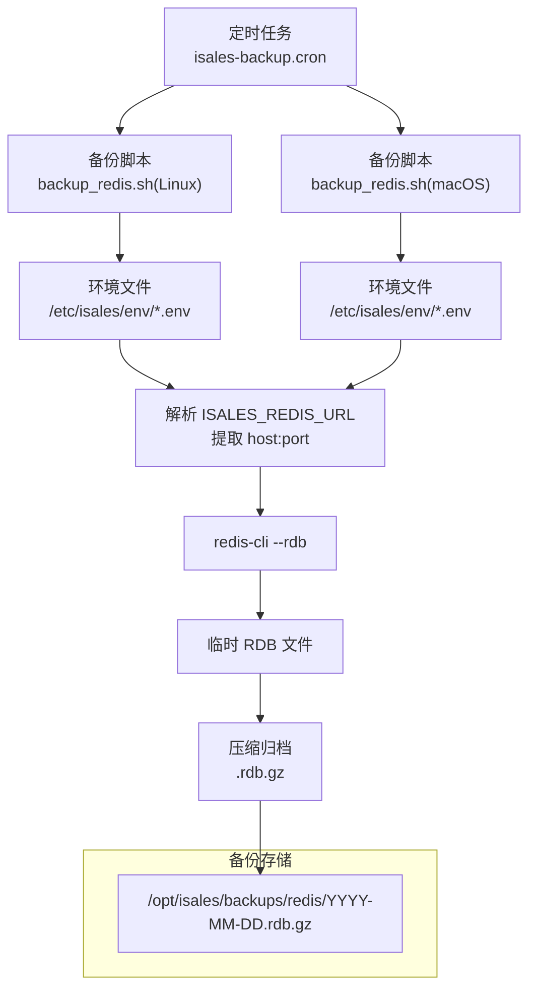
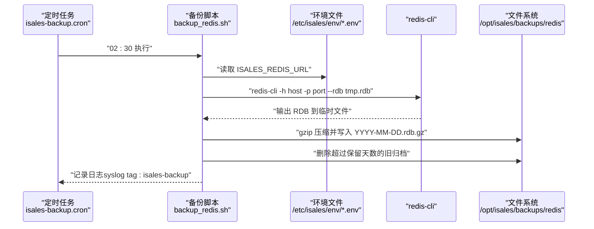
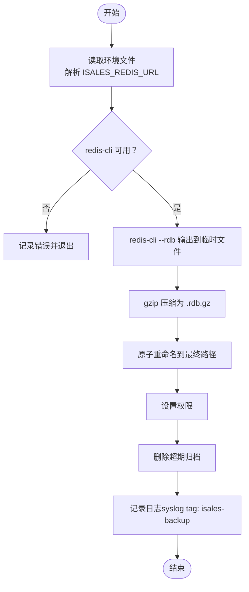
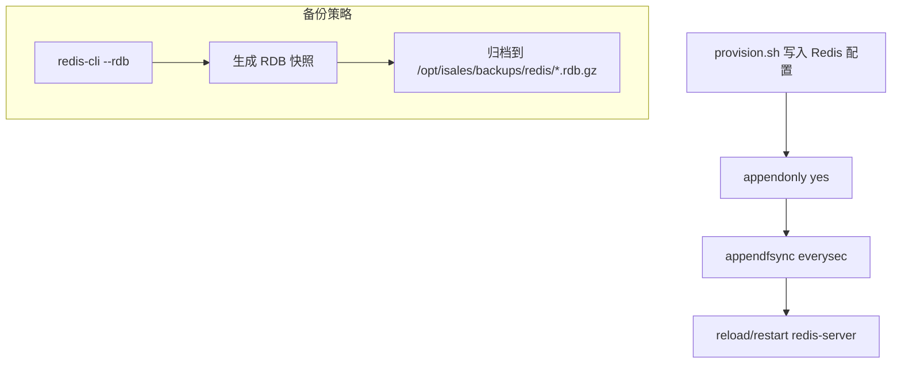
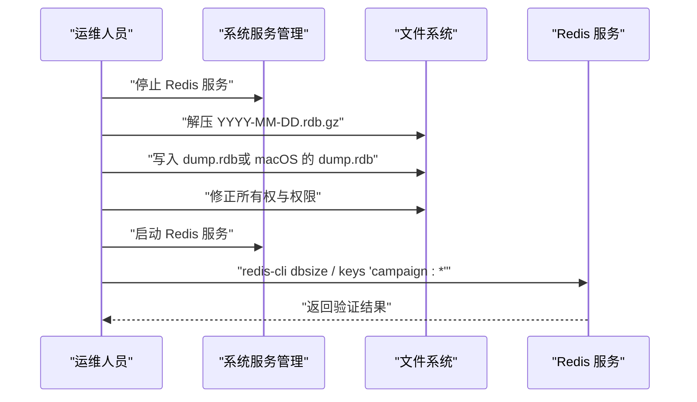
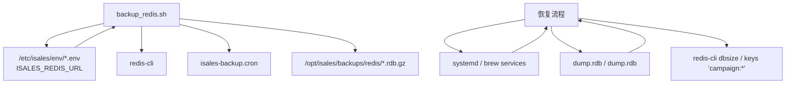

# Redis 备份与恢复

<cite>
**本文引用的文件**
- [backup_redis.sh（Linux）](file://deploy/linux/scripts/backup_redis.sh)
- [backup_redis.sh（macOS）](file://deploy/macos/scripts/backup_redis.sh)
- [isales-backup.cron](file://deploy/cron/isales-backup.cron)
- [provision.sh（Linux）](file://deploy/linux/scripts/provision.sh)
- [provision.sh（macOS）](file://deploy/macos/scripts/provision.sh)
- [RUNBOOK.md](file://deploy/RUNBOOK.md)
- [isales-api.service](file://deploy/cloud/systemd/isales-api.service)
- [isales-engine.service](file://deploy/cloud/systemd/isales-engine.service)
- [api.env（云边拓扑）](file://deploy/cloud/env/api.env)
- [engine.env（云边拓扑）](file://deploy/cloud/env/engine.env)
- [scheduler.env（云边拓扑）](file://deploy/cloud/env/scheduler.env)
</cite>

## 目录
1. [简介](#简介)
2. [项目结构](#项目结构)
3. [核心组件](#核心组件)
4. [架构总览](#架构总览)
5. [详细组件分析](#详细组件分析)
6. [依赖关系分析](#依赖关系分析)
7. [性能考量](#性能考量)
8. [故障排除指南](#故障排除指南)
9. [结论](#结论)
10. [附录](#附录)

## 简介
本指南面向 iSales Redis 缓存数据库的备份与恢复操作，聚焦于 RDB 快照备份与恢复流程。文档覆盖以下关键点：
- 自动备份配置：基于 cron 的每日定时任务，拉取远程 RDB 快照并压缩归档。
- 手动备份触发：在恢复演练或发布前进行手动触发。
- 备份文件管理：统一存储路径、命名规范与保留策略。
- RDB 与 AOF 的区别：当前生产环境启用 AOF（appendonly yes），但备份使用 redis-cli --rdb 拉取一致快照，避免直接读取 AOF 文件带来的权限与多文件兼容问题。
- 恢复流程：停止服务、替换 dump.rdb（或 macOS 的 dump.rdb 路径）、权限修正、重启服务。
- 数据验证：键空间大小检查（dbsize）与特定键族验证（如 campaign:*）。
- 注意事项与一致性保障：备份窗口、权限与所有权、日志与监控、演练频率。

## 项目结构
围绕 Redis 备份与恢复的相关文件分布如下：
- 备份脚本：Linux 与 macOS 各自提供 backup_redis.sh，均通过 redis-cli --rdb 远程拉取 RDB 并压缩归档。
- 定时任务：isales-backup.cron 在每日 02:30 触发 PostgreSQL 与 Redis 的备份。
- 部署与持久化：provision.sh 在 Linux/macOS 上启用 AOF，并将配置写入系统 Redis 配置目录。
- 运行手册：RUNBOOK.md 提供了 RDB 恢复步骤、验证方法与演练要求。
- 服务与环境：systemd 单元与 env 文件定义了 Redis 连接地址（ISALES_REDIS_URL），用于备份脚本解析目标主机与端口。

图表来源
- [isales-backup.cron:10-13](file://deploy/cron/isales-backup.cron#L10-L13)
- [backup_redis.sh（Linux）:10-14](file://deploy/linux/scripts/backup_redis.sh#L10-L14)
- [backup_redis.sh（macOS）:17-21](file://deploy/macos/scripts/backup_redis.sh#L17-L21)
- [provision.sh（Linux）:99-127](file://deploy/linux/scripts/provision.sh#L99-L127)
- [provision.sh（macOS）:21-178](file://deploy/macos/scripts/provision.sh#L21-L178)

章节来源
- [isales-backup.cron:1-14](file://deploy/cron/isales-backup.cron#L1-L14)
- [backup_redis.sh（Linux）:1-61](file://deploy/linux/scripts/backup_redis.sh#L1-L61)
- [backup_redis.sh（macOS）:1-66](file://deploy/macos/scripts/backup_redis.sh#L1-L66)
- [provision.sh（Linux）:99-127](file://deploy/linux/scripts/provision.sh#L99-L127)
- [provision.sh（macOS）:21-178](file://deploy/macos/scripts/provision.sh#L21-L178)

## 核心组件
- 备份脚本（Linux/macOS）
  - 作用：通过 redis-cli --rdb 远程拉取一致 RDB 快照，写入临时文件后压缩为 .rdb.gz，移动到统一备份目录，设置权限并清理过期归档。
  - 关键行为：
    - 解析环境文件中的 ISALES_REDIS_URL，提取 host 与 port，默认 127.0.0.1:6379。
    - 使用 redis-cli -h/-p --rdb 输出到临时 RDB 文件。
    - gzip 压缩并原子重命名为最终归档文件。
    - 清理超过保留天数的旧归档。
    - 记录系统日志（syslog tag：isales-backup）。
- 定时任务
  - 每日 02:30 执行 PostgreSQL 与 Redis 的备份脚本。
- 生产环境持久化
  - provision.sh 将 appendonly yes 与 appendfsync everysec 写入系统 Redis 配置，确保 AOF 持久化开启。
- 恢复流程与验证
  - RUNBOOK.md 提供了停止服务、替换 dump.rdb（或 macOS 的 dump.rdb 路径）、权限修正、重启服务以及 dbsize 与 campaign:* 键族验证的步骤。

章节来源
- [backup_redis.sh（Linux）:10-61](file://deploy/linux/scripts/backup_redis.sh#L10-L61)
- [backup_redis.sh（macOS）:17-66](file://deploy/macos/scripts/backup_redis.sh#L17-L66)
- [isales-backup.cron:10-13](file://deploy/cron/isales-backup.cron#L10-L13)
- [provision.sh（Linux）:99-127](file://deploy/linux/scripts/provision.sh#L99-L127)
- [provision.sh（macOS）:21-178](file://deploy/macos/scripts/provision.sh#L21-L178)
- [RUNBOOK.md:144-159](file://deploy/RUNBOOK.md#L144-L159)
- [RUNBOOK.md:334-341](file://deploy/RUNBOOK.md#L334-L341)

## 架构总览
下图展示了从定时任务到备份脚本、再到 Redis 的调用链路，以及备份文件的落盘与清理流程。

图表来源
- [isales-backup.cron:10-13](file://deploy/cron/isales-backup.cron#L10-L13)
- [backup_redis.sh（Linux）:33-57](file://deploy/linux/scripts/backup_redis.sh#L33-L57)
- [backup_redis.sh（macOS）:39-62](file://deploy/macos/scripts/backup_redis.sh#L39-L62)

章节来源
- [isales-backup.cron:10-13](file://deploy/cron/isales-backup.cron#L10-L13)
- [backup_redis.sh（Linux）:33-57](file://deploy/linux/scripts/backup_redis.sh#L33-L57)
- [backup_redis.sh（macOS）:39-62](file://deploy/macos/scripts/backup_redis.sh#L39-L62)

## 详细组件分析

### 组件一：自动备份配置（cron + 备份脚本）
- 自动备份
  - 每日 02:30 执行，同时触发 PostgreSQL 与 Redis 的备份。
  - Redis 备份通过 redis-cli --rdb 远程抓取一致快照，避免直接读取 AOF 文件导致的权限与兼容性问题。
- 备份脚本（Linux/macOS）
  - 读取环境文件中的 ISALES_REDIS_URL，解析 host 与 port。
  - 使用 redis-cli --rdb 输出到临时 RDB 文件，再 gzip 压缩为 YYYY-MM-DD.rdb.gz。
  - 设置文件权限并清理超期归档。
  - 记录系统日志，便于审计与排障。

图表来源
- [backup_redis.sh（Linux）:21-57](file://deploy/linux/scripts/backup_redis.sh#L21-L57)
- [backup_redis.sh（macOS）:28-62](file://deploy/macos/scripts/backup_redis.sh#L28-L62)
- [isales-backup.cron:10-13](file://deploy/cron/isales-backup.cron#L10-L13)

章节来源
- [isales-backup.cron:10-13](file://deploy/cron/isales-backup.cron#L10-L13)
- [backup_redis.sh（Linux）:21-57](file://deploy/linux/scripts/backup_redis.sh#L21-L57)
- [backup_redis.sh（macOS）:28-62](file://deploy/macos/scripts/backup_redis.sh#L28-L62)

### 组件二：Redis AOF 与 RDB 的区别与持久化配置
- 当前生产环境启用 AOF（appendonly yes），并采用每秒同步（appendfsync everysec），以提升数据安全性。
- 备份策略采用 redis-cli --rdb 拉取一致快照，而非直接读取 AOF 文件，避免：
  - 权限问题（AOF 文件通常由 redis 用户拥有）。
  - Redis 7 多文件 AOF 目录兼容性问题。
- provision.sh 在 Linux 与 macOS 上分别写入系统 Redis 配置，确保 AOF 开启并生效。

图表来源
- [provision.sh（Linux）:99-127](file://deploy/linux/scripts/provision.sh#L99-L127)
- [provision.sh（macOS）:21-178](file://deploy/macos/scripts/provision.sh#L21-L178)
- [backup_redis.sh（Linux）:42-47](file://deploy/linux/scripts/backup_redis.sh#L42-L47)
- [backup_redis.sh（macOS）:47-52](file://deploy/macos/scripts/backup_redis.sh#L47-L52)

章节来源
- [provision.sh（Linux）:99-127](file://deploy/linux/scripts/provision.sh#L99-L127)
- [provision.sh（macOS）:21-178](file://deploy/macos/scripts/provision.sh#L21-L178)
- [backup_redis.sh（Linux）:42-47](file://deploy/linux/scripts/backup_redis.sh#L42-L47)
- [backup_redis.sh（macOS）:47-52](file://deploy/macos/scripts/backup_redis.sh#L47-L52)

### 组件三：恢复流程（RDB 替换 dump.rdb）
- 停止 Redis 服务（systemd 或 brew services）。
- 解压指定日期的 .rdb.gz，写入系统 Redis 的 dump.rdb（或 macOS 的 dump.rdb 路径）。
- 修正文件所有权与权限，确保 Redis 进程可读。
- 启动 Redis 服务。
- 验证：执行 dbsize 检查键空间大小；查询 campaign:* 键族确认业务数据存在。

图表来源
- [RUNBOOK.md:144-159](file://deploy/RUNBOOK.md#L144-L159)
- [RUNBOOK.md:334-341](file://deploy/RUNBOOK.md#L334-L341)

章节来源
- [RUNBOOK.md:144-159](file://deploy/RUNBOOK.md#L144-L159)
- [RUNBOOK.md:334-341](file://deploy/RUNBOOK.md#L334-L341)

### 组件四：数据验证方法
- 键空间大小检查：使用 redis-cli dbsize，确保恢复后键数量大于零。
- 业务键族验证：查询 campaign:* 键族，确认营销活动相关数据存在。
- 其他常用命令（参考 RUNBOOK）：
  - 获取并发活跃通话计数：redis-cli get isales:concurrency:active
  - 查看队列深度：redis-cli --scan --pattern 'engine:*' | xargs -I% redis-cli llen %

章节来源
- [RUNBOOK.md:154-156](file://deploy/RUNBOOK.md#L154-L156)
- [RUNBOOK.md:191-195](file://deploy/RUNBOOK.md#L191-L195)

## 依赖关系分析
- 备份脚本依赖：
  - redis-cli 可用性与网络可达性（ISALES_REDIS_URL）。
  - 环境文件（/etc/isales/env/*.env）中包含 ISALES_REDIS_URL。
  - systemd 或 brew services（macOS）用于停止/启动 Redis。
- 恢复流程依赖：
  - 正确的 dump.rdb 路径（Linux: /var/lib/redis/dump.rdb；macOS: /opt/homebrew/var/db/redis/dump.rdb）。
  - 文件所有权与权限（redis 用户可读）。
- 日志与监控：
  - 备份脚本使用 syslog tag isales-backup，便于检索与审计。

图表来源
- [backup_redis.sh（Linux）:33-57](file://deploy/linux/scripts/backup_redis.sh#L33-L57)
- [backup_redis.sh（macOS）:39-62](file://deploy/macos/scripts/backup_redis.sh#L39-L62)
- [isales-backup.cron:10-13](file://deploy/cron/isales-backup.cron#L10-L13)
- [RUNBOOK.md:144-159](file://deploy/RUNBOOK.md#L144-L159)
- [RUNBOOK.md:334-341](file://deploy/RUNBOOK.md#L334-L341)

章节来源
- [backup_redis.sh（Linux）:33-57](file://deploy/linux/scripts/backup_redis.sh#L33-L57)
- [backup_redis.sh（macOS）:39-62](file://deploy/macos/scripts/backup_redis.sh#L39-L62)
- [isales-backup.cron:10-13](file://deploy/cron/isales-backup.cron#L10-L13)
- [RUNBOOK.md:144-159](file://deploy/RUNBOOK.md#L144-L159)
- [RUNBOOK.md:334-341](file://deploy/RUNBOOK.md#L334-L341)

## 性能考量
- 备份窗口：每日 02:30 执行，避开业务高峰时段，减少对在线服务的影响。
- 备份方式：使用 redis-cli --rdb 拉取一致快照，避免扫描 AOF 文件带来的额外 I/O。
- 存储与保留：统一归档路径与保留天数（默认 14 天），降低存储压力与管理复杂度。
- 验证成本：恢复后仅需执行 dbsize 与少量键族查询，验证成本低且快速。

## 故障排除指南
- 备份失败
  - 现象：redis-cli --rdb 失败或 gzip 失败。
  - 排查：检查 redis-cli 是否安装、ISALES_REDIS_URL 是否正确、网络连通性、目标 Redis 是否可写。
  - 日志：查看 syslog 中 tag 为 isales-backup 的条目。
- 恢复失败
  - 现象：Redis 启动后无法加载 dump.rdb。
  - 排查：确认 dump.rdb 路径正确、文件权限为 redis 用户可读、无损坏（可先 gunzip -t 校验压缩包）。
  - 验证：恢复后立即执行 dbsize 与 campaign:* 键族查询。
- 常见症状与处理（参考 RUNBOOK）
  - Redis OOM：检查内存使用并调整 maxmemory 或淘汰策略。
  - 备份 cron 未运行：检查 cron 服务状态与 /etc/cron.d/isales-backup 权限。

章节来源
- [backup_redis.sh（Linux）:21-25](file://deploy/linux/scripts/backup_redis.sh#L21-L25)
- [backup_redis.sh（macOS）:28-32](file://deploy/macos/scripts/backup_redis.sh#L28-L32)
- [RUNBOOK.md:167-178](file://deploy/RUNBOOK.md#L167-L178)
- [RUNBOOK.md:178-178](file://deploy/RUNBOOK.md#L178-L178)

## 结论
本指南明确了 iSales Redis 的备份与恢复实践：以每日定时任务拉取 RDB 快照为核心，结合 AOF 持久化与严格的恢复验证流程，确保数据安全与可恢复性。建议在季度演练与重大发布前进行恢复演练，并持续关注备份日志与系统健康状态。

## 附录

### A. 备份文件存储位置与命名规范
- 存储路径：/opt/isales/backups/redis/
- 文件命名：YYYY-MM-DD.rdb.gz
- 保留策略：默认保留 14 天，超过期限自动清理。

章节来源
- [backup_redis.sh（Linux）:10-14](file://deploy/linux/scripts/backup_redis.sh#L10-L14)
- [backup_redis.sh（macOS）:17-21](file://deploy/macos/scripts/backup_redis.sh#L17-L21)
- [isales-backup.cron:4-8](file://deploy/cron/isales-backup.cron#L4-L8)

### B. 环境变量与 Redis 连接
- 环境文件示例：/etc/isales/env/api.env、/etc/isales/env/engine.env、/etc/isales/env/scheduler.env
- 关键变量：ISALES_REDIS_URL（格式：redis://[user[:pass]@]host:port[/db]）
- systemd 单元：isales-api.service、isales-engine.service 通过 EnvironmentFile 引入环境变量。

章节来源
- [api.env（云边拓扑）:6-7](file://deploy/cloud/env/api.env#L6-L7)
- [engine.env（云边拓扑）:4-5](file://deploy/cloud/env/engine.env#L4-L5)
- [scheduler.env（云边拓扑）:4-5](file://deploy/cloud/env/scheduler.env#L4-L5)
- [isales-api.service:16-17](file://deploy/cloud/systemd/isales-api.service#L16-L17)
- [isales-engine.service:20-25](file://deploy/cloud/systemd/isales-engine.service#L20-L25)

### C. 恢复演练与演练频率
- 恢复演练步骤：停止服务、替换 dump.rdb、权限修正、重启服务、验证 dbsize 与 campaign:*。
- 演练频率：至少每季度一次，重大发布前必须演练并通过。

章节来源
- [RUNBOOK.md:144-159](file://deploy/RUNBOOK.md#L144-L159)
- [RUNBOOK.md:159-159](file://deploy/RUNBOOK.md#L159-L159)
- [RUNBOOK.md:206-206](file://deploy/RUNBOOK.md#L206-L206)