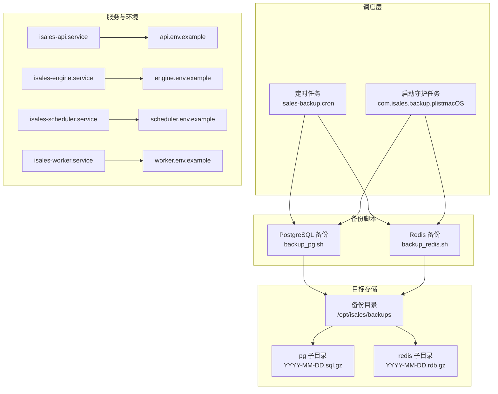
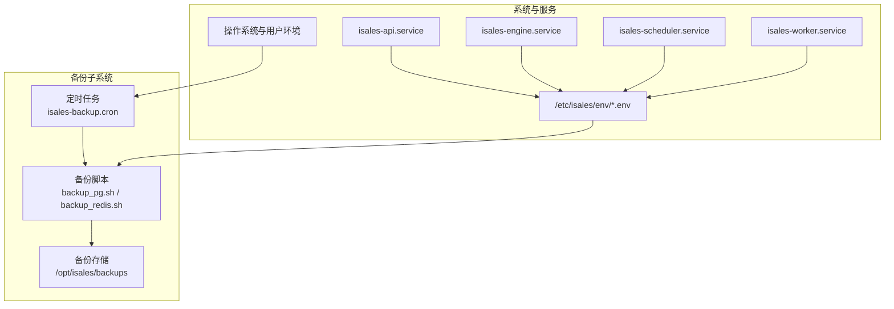
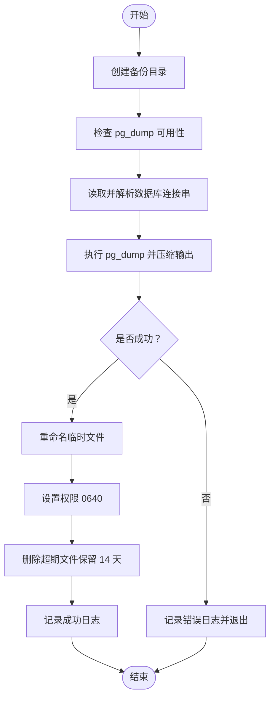
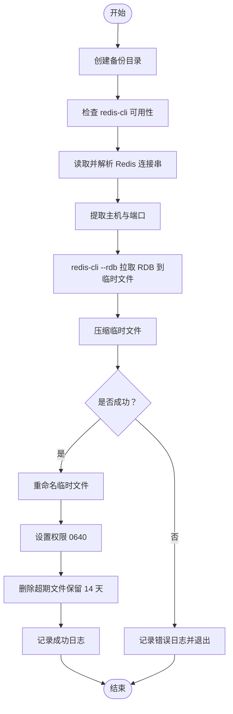
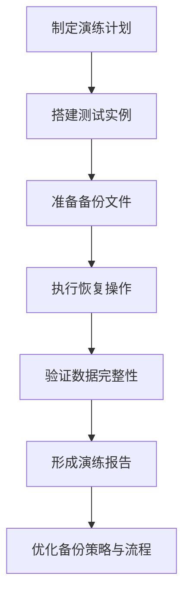
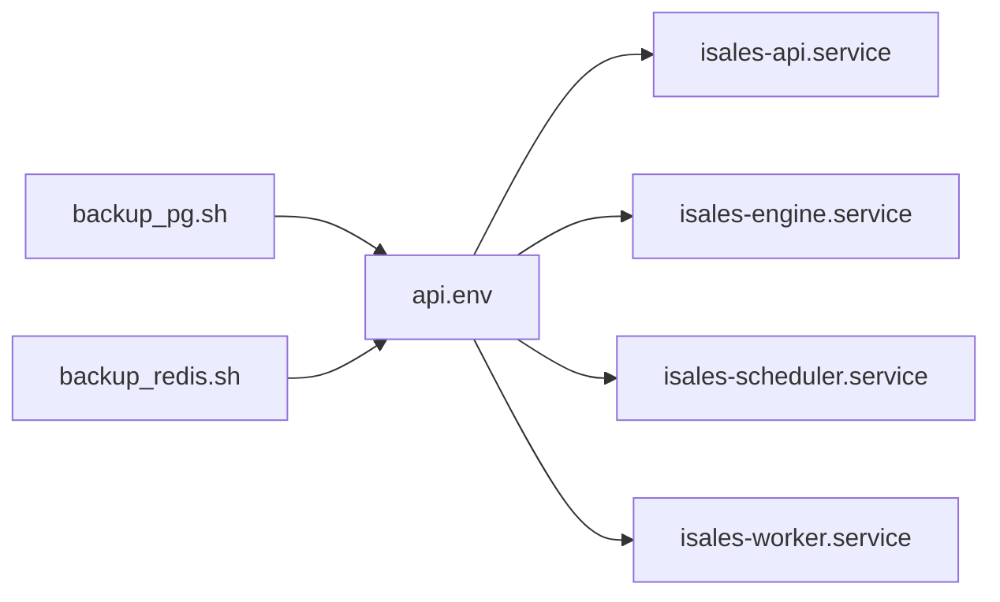

# 备份与恢复

<cite>
**本文引用的文件**
- [isales-backup.cron](file://deploy/cron/isales-backup.cron)
- [backup_pg.sh（Linux）](file://deploy/linux/scripts/backup_pg.sh)
- [backup_redis.sh（Linux）](file://deploy/linux/scripts/backup_redis.sh)
- [backup_pg.sh（macOS）](file://deploy/macos/scripts/backup_pg.sh)
- [backup_redis.sh（macOS）](file://deploy/macos/scripts/backup_redis.sh)
- [install.sh（Cloud）](file://deploy/cloud/scripts/install.sh)
- [rollback.sh（Cloud）](file://deploy/cloud/scripts/rollback.sh)
- [_lib.sh（通用）](file://deploy/common/_lib.sh)
- [isales-api.service](file://deploy/cloud/systemd/isales-api.service)
- [isales-engine.service](file://deploy/cloud/systemd/isales-engine.service)
- [isales-scheduler.service](file://deploy/cloud/systemd/isales-scheduler.service)
- [isales-worker.service](file://deploy/cloud/systemd/isales-worker.service)
- [api.env.example](file://deploy/cloud/env/api.env.example)
- [engine.env.example](file://deploy/cloud/env/engine.env.example)
- [scheduler.env.example](file://deploy/cloud/env/scheduler.env.example)
- [worker.env.example](file://deploy/cloud/env/worker.env.example)
</cite>

## 目录
1. [简介](#简介)
2. [项目结构](#项目结构)
3. [核心组件](#核心组件)
4. [架构总览](#架构总览)
5. [详细组件分析](#详细组件分析)
6. [依赖关系分析](#依赖关系分析)
7. [性能考量](#性能考量)
8. [故障排查指南](#故障排查指南)
9. [结论](#结论)
10. [附录](#附录)

## 简介
本指南面向 iSales 的运维与平台工程团队，系统性阐述备份与恢复策略与流程，覆盖 PostgreSQL 与 Redis 的自动备份、备份文件管理与保留策略、备份恢复演练、备份文件存储位置与安全保护、手动备份触发、备份文件验证、恢复过程中的数据一致性保障，以及备份失败的应急处理与最佳实践。文档同时结合仓库中现有的自动化脚本与 systemd 单元配置，给出可落地的操作步骤与可视化图示。

## 项目结构
围绕备份与恢复的关键文件主要分布在以下位置：
- 自动化调度：Linux/macOS 使用 cron/launchd 触发每日备份任务
- 备份脚本：分别针对 PostgreSQL 与 Redis 的备份实现
- 环境变量与服务单元：定义数据库与缓存连接参数及运行环境
- 回滚脚本：在回滚过程中对备份文件的使用与一致性影响进行说明

图表来源
- [isales-backup.cron:10-13](file://deploy/cron/isales-backup.cron#L10-L13)
- [backup_pg.sh（Linux）:9-13](file://deploy/linux/scripts/backup_pg.sh#L9-L13)
- [backup_redis.sh（Linux）:10-14](file://deploy/linux/scripts/backup_redis.sh#L10-L14)
- [backup_pg.sh（macOS）:19-23](file://deploy/macos/scripts/backup_pg.sh#L19-L23)
- [backup_redis.sh（macOS）:17-21](file://deploy/macos/scripts/backup_redis.sh#L17-L21)
- [isales-api.service:16-17](file://deploy/cloud/systemd/isales-api.service#L16-L17)
- [isales-engine.service:20-25](file://deploy/cloud/systemd/isales-engine.service#L20-L25)
- [isales-scheduler.service:14-15](file://deploy/cloud/systemd/isales-scheduler.service#L14-L15)
- [isales-worker.service:14-15](file://deploy/cloud/systemd/isales-worker.service#L14-L15)
- [api.env.example:8-9](file://deploy/cloud/env/api.env.example#L8-L9)
- [engine.env.example:8-9](file://deploy/cloud/env/engine.env.example#L8-L9)
- [scheduler.env.example:6-7](file://deploy/cloud/env/scheduler.env.example#L6-L7)
- [worker.env.example:6-7](file://deploy/cloud/env/worker.env.example#L6-L7)

章节来源
- [isales-backup.cron:1-14](file://deploy/cron/isales-backup.cron#L1-L14)
- [backup_pg.sh（Linux）:1-50](file://deploy/linux/scripts/backup_pg.sh#L1-L50)
- [backup_redis.sh（Linux）:1-61](file://deploy/linux/scripts/backup_redis.sh#L1-L61)
- [backup_pg.sh（macOS）:1-56](file://deploy/macos/scripts/backup_pg.sh#L1-L56)
- [backup_redis.sh（macOS）:1-66](file://deploy/macos/scripts/backup_redis.sh#L1-L66)

## 核心组件
- 定时任务与触发器
  - Linux：每日 02:30 执行 PostgreSQL 与 Redis 备份，输出至 /opt/isales/backups/pg 与 /opt/isales/backups/redis，并保留最近 14 天
  - macOS：通过 launchd 作业触发相同逻辑（脚本路径与行为与 Linux 版本一致）
- 备份脚本
  - PostgreSQL：使用 pg_dump 生成自定义格式压缩输出，权限设置为 0640，保留策略基于 mtime
  - Redis：使用 redis-cli --rdb 远程拉取 RDB 并压缩输出，权限设置为 0640，保留策略基于 mtime
- 环境与连接
  - 数据库与缓存连接字符串来自 /etc/isales/env 下各服务的 env 文件，备份脚本从对应文件读取并解析
- 日志与错误处理
  - 失败时通过 syslog 标签 isales-backup 记录错误，便于集中检索与告警联动

章节来源
- [isales-backup.cron:2-8](file://deploy/cron/isales-backup.cron#L2-L8)
- [backup_pg.sh（Linux）:10-13](file://deploy/linux/scripts/backup_pg.sh#L10-L13)
- [backup_redis.sh（Linux）:11-14](file://deploy/linux/scripts/backup_redis.sh#L11-L14)
- [backup_pg.sh（macOS）:20-23](file://deploy/macos/scripts/backup_pg.sh#L20-L23)
- [backup_redis.sh（macOS）:18-21](file://deploy/macos/scripts/backup_redis.sh#L18-L21)
- [api.env.example:8-9](file://deploy/cloud/env/api.env.example#L8-L9)
- [engine.env.example:8-9](file://deploy/cloud/env/engine.env.example#L8-L9)
- [scheduler.env.example:6-7](file://deploy/cloud/env/scheduler.env.example#L6-L7)
- [worker.env.example:6-7](file://deploy/cloud/env/worker.env.example#L6-L7)

## 架构总览
下图展示 iSales 备份体系在系统中的位置与交互关系，包括调度、脚本、存储与服务依赖。

图表来源
- [isales-backup.cron:10-13](file://deploy/cron/isales-backup.cron#L10-L13)
- [backup_pg.sh（Linux）:9-13](file://deploy/linux/scripts/backup_pg.sh#L9-L13)
- [backup_redis.sh（Linux）:10-14](file://deploy/linux/scripts/backup_redis.sh#L10-L14)
- [isales-api.service:16-17](file://deploy/cloud/systemd/isales-api.service#L16-L17)
- [isales-engine.service:20-25](file://deploy/cloud/systemd/isales-engine.service#L20-L25)
- [isales-scheduler.service:14-15](file://deploy/cloud/systemd/isales-scheduler.service#L14-L15)
- [isales-worker.service:14-15](file://deploy/cloud/systemd/isales-worker.service#L14-L15)

## 详细组件分析

### PostgreSQL 备份组件
- 触发与时间点
  - Linux：每日 02:30 执行
  - macOS：通过 launchd 作业触发（脚本同源）
- 输入与输出
  - 输入：从 /etc/isales/env/api.env 读取 ISALES_DATABASE_URL（去除 asyncpg 前缀后供 libpq 使用）
  - 输出：/opt/isales/backups/pg/YYYY-MM-DD.sql.gz，权限 0640
- 处理流程
  - 检查 pg_dump 可用性
  - 读取并解析数据库连接串
  - 使用 pg_dump 生成自定义格式压缩输出
  - 成功后重命名临时文件、设置权限、清理超期文件
  - 失败记录日志并退出
- 保留策略
  - 基于 mtime 删除超过 RETAIN_DAYS 的旧文件，默认 14 天
- 错误处理
  - 缺少工具或环境文件不可读时直接退出并记录错误
  - pg_dump 失败时捕获 stderr 并记录

图表来源
- [backup_pg.sh（Linux）:17-49](file://deploy/linux/scripts/backup_pg.sh#L17-L49)
- [backup_pg.sh（macOS）:27-52](file://deploy/macos/scripts/backup_pg.sh#L27-L52)

章节来源
- [isales-backup.cron](file://deploy/cron/isales-backup.cron#L13)
- [backup_pg.sh（Linux）:1-50](file://deploy/linux/scripts/backup_pg.sh#L1-L50)
- [backup_pg.sh（macOS）:1-56](file://deploy/macos/scripts/backup_pg.sh#L1-L56)
- [api.env.example](file://deploy/cloud/env/api.env.example#L8)

### Redis 备份组件
- 触发与时间点
  - Linux：每日 02:30 执行
  - macOS：通过 launchd 作业触发（脚本同源）
- 输入与输出
  - 输入：从 /etc/isales/env/api.env 读取 ISALES_REDIS_URL，解析主机与端口
  - 输出：/opt/isales/backups/redis/YYYY-MM-DD.rdb.gz，权限 0640
- 处理流程
  - 检查 redis-cli 可用性
  - 解析 Redis 连接串，提取主机与端口（默认 127.0.0.1:6379）
  - 使用 redis-cli --rdb 拉取 RDB 到临时文件并压缩
  - 成功后重命名临时文件、设置权限、清理超期文件
  - 失败记录日志并退出
- 保留策略
  - 基于 mtime 删除超过 RETAIN_DAYS 的旧文件，默认 14 天

图表来源
- [backup_redis.sh（Linux）:21-60](file://deploy/linux/scripts/backup_redis.sh#L21-L60)
- [backup_redis.sh（macOS）:28-62](file://deploy/macos/scripts/backup_redis.sh#L28-L62)

章节来源
- [isales-backup.cron](file://deploy/cron/isales-backup.cron#L13)
- [backup_redis.sh（Linux）:1-61](file://deploy/linux/scripts/backup_redis.sh#L1-L61)
- [backup_redis.sh（macOS）:1-66](file://deploy/macos/scripts/backup_redis.sh#L1-L66)
- [api.env.example](file://deploy/cloud/env/api.env.example#L9)

### 备份恢复演练（概念性流程）
为确保备份可用性与恢复可行性，建议定期开展演练，包括：
- 测试实例创建
  - 在隔离环境中安装与配置服务（参考 Cloud 安装脚本），准备 /etc/isales/env 示例文件并补齐密钥
  - 仅启用必要服务（如 api、engine、scheduler、worker），避免与生产冲突
- 数据恢复验证
  - 将备份文件导入数据库与缓存（注意版本兼容与权限）
  - 验证关键业务数据完整性与一致性
- 完整性检查
  - 对比备份时间点前后关键指标（如通话记录数、队列状态等）
  - 检查日志与监控告警，确认无异常

（本图为概念性流程，不直接映射具体源码文件）

### 备份文件存储位置、访问权限与安全保护
- 存储位置
  - PostgreSQL：/opt/isales/backups/pg/YYYY-MM-DD.sql.gz
  - Redis：/opt/isales/backups/redis/YYYY-MM-DD.rdb.gz
- 访问权限
  - 备份文件权限统一设置为 0640，属主为 root，属组为 isales
- 安全保护
  - 备份文件所在目录由 isales 用户拥有，建议配合最小权限原则与文件系统级访问控制
  - 环境文件（/etc/isales/env/*.env）权限为 0640，属主为 root，属组为 isales，避免泄露敏感连接信息

章节来源
- [backup_pg.sh（Linux）](file://deploy/linux/scripts/backup_pg.sh#L43)
- [backup_redis.sh（Linux）](file://deploy/linux/scripts/backup_redis.sh#L55)
- [backup_pg.sh（macOS）](file://deploy/macos/scripts/backup_pg.sh#L50)
- [backup_redis.sh（macOS）](file://deploy/macos/scripts/backup_redis.sh#L60)
- [api.env.example:1-2](file://deploy/cloud/env/api.env.example#L1-L2)
- [engine.env.example:1-2](file://deploy/cloud/env/engine.env.example#L1-L2)
- [scheduler.env.example:1-2](file://deploy/cloud/env/scheduler.env.example#L1-L2)
- [worker.env.example:1-2](file://deploy/cloud/env/worker.env.example#L1-L2)

### 手动备份触发、备份文件验证与恢复一致性
- 手动触发
  - Linux：直接执行 /opt/isales/current/deploy/scripts/backup_pg.sh 与 /opt/isales/current/deploy/scripts/backup_redis.sh
  - macOS：执行对应脚本（路径与行为与 Linux 版本一致）
- 备份文件验证
  - 检查文件存在性与权限（0640）
  - 校验日期与命名规范（YYYY-MM-DD）
  - 对于 PostgreSQL，可使用 pg_restore 预检查归档文件有效性
- 恢复一致性
  - 恢复前应停止相关服务（如 api、engine、scheduler、worker），避免并发写入导致数据不一致
  - 恢复后按依赖顺序重启服务，确保下游依赖就绪后再启动上游服务
  - 回滚脚本可用于快速切换到上一个稳定发布版本，减少恢复窗口

章节来源
- [isales-backup.cron](file://deploy/cron/isales-backup.cron#L13)
- [backup_pg.sh（Linux）:1-50](file://deploy/linux/scripts/backup_pg.sh#L1-L50)
- [backup_redis.sh（Linux）:1-61](file://deploy/linux/scripts/backup_redis.sh#L1-L61)
- [rollback.sh（Cloud）:99-107](file://deploy/cloud/scripts/rollback.sh#L99-L107)

## 依赖关系分析
- 备份脚本依赖
  - PostgreSQL：需要 pg_dump 工具与数据库连接串
  - Redis：需要 redis-cli 与 Redis 连接串
  - 环境文件：/etc/isales/env/*.env 提供统一的连接参数
- 服务依赖
  - 四个 systemd 服务均通过 EnvironmentFile 引用 /etc/isales/env 下的配置文件
  - 备份脚本在执行时读取相同连接参数，确保备份与生产一致

图表来源
- [backup_pg.sh（Linux）:30-33](file://deploy/linux/scripts/backup_pg.sh#L30-L33)
- [backup_redis.sh（Linux）:33-34](file://deploy/linux/scripts/backup_redis.sh#L33-L34)
- [api.env.example:8-9](file://deploy/cloud/env/api.env.example#L8-L9)
- [isales-api.service:16-17](file://deploy/cloud/systemd/isales-api.service#L16-L17)
- [isales-engine.service:20-25](file://deploy/cloud/systemd/isales-engine.service#L20-L25)
- [isales-scheduler.service:14-15](file://deploy/cloud/systemd/isales-scheduler.service#L14-L15)
- [isales-worker.service:14-15](file://deploy/cloud/systemd/isales-worker.service#L14-L15)

章节来源
- [backup_pg.sh（Linux）:30-33](file://deploy/linux/scripts/backup_pg.sh#L30-L33)
- [backup_redis.sh（Linux）:33-34](file://deploy/linux/scripts/backup_redis.sh#L33-L34)
- [api.env.example:8-9](file://deploy/cloud/env/api.env.example#L8-L9)
- [isales-api.service:16-17](file://deploy/cloud/systemd/isales-api.service#L16-L17)
- [isales-engine.service:20-25](file://deploy/cloud/systemd/isales-engine.service#L20-L25)
- [isales-scheduler.service:14-15](file://deploy/cloud/systemd/isales-scheduler.service#L14-L15)
- [isales-worker.service:14-15](file://deploy/cloud/systemd/isales-worker.service#L14-L15)

## 性能考量
- 备份窗口与资源占用
  - 备份在每日凌晨 02:30 执行，尽量避开业务高峰时段
  - PostgreSQL 使用自定义格式压缩输出，兼顾体积与恢复效率
  - Redis 通过远程 --rdb 拉取快照，避免直接访问/var/lib/redis 的权限问题
- 保留策略与磁盘空间
  - 默认保留 14 天，可根据磁盘容量与合规要求调整 RETAIN_DAYS 环境变量
- 服务重启与优雅停机
  - 回滚脚本按顺序重启服务，engine 的 TimeoutStopSec 设定考虑了通话结束的宽限时间

（本节为通用指导，不直接分析具体文件）

## 故障排查指南
- 常见问题与定位
  - 缺少工具：pg_dump 或 redis-cli 未安装，脚本会记录错误并退出
  - 权限不足：无法读取 /etc/isales/env/*.env 或写入 /opt/isales/backups
  - 连接失败：数据库或 Redis 地址/端口错误，或网络不可达
- 日志定位
  - 查看系统日志中标签为 isales-backup 的条目，定位失败原因
- 应急处理
  - 若备份失败，先修复问题（安装工具、修正连接串、放行网络），再重新触发备份
  - 如需回滚，使用 Cloud 回滚脚本切换到上一个稳定发布版本，减少恢复窗口

章节来源
- [backup_pg.sh（Linux）:17-33](file://deploy/linux/scripts/backup_pg.sh#L17-L33)
- [backup_redis.sh（Linux）:21-34](file://deploy/linux/scripts/backup_redis.sh#L21-L34)
- [isales-backup.cron](file://deploy/cron/isales-backup.cron#L8)
- [rollback.sh（Cloud）:99-107](file://deploy/cloud/scripts/rollback.sh#L99-L107)

## 结论
iSales 的备份与恢复体系以自动化脚本为核心，结合统一的环境变量与 systemd 服务配置，实现了 PostgreSQL 与 Redis 的每日自动备份、标准化输出与保留策略。通过严格的权限控制与日志记录，提升了备份的可靠性与可观测性。建议在现有基础上完善备份恢复演练、扩展异地备份与加密存储，并持续优化保留策略与恢复窗口，以满足更高的业务连续性要求。

## 附录
- 关键文件与职责速览
  - isales-backup.cron：每日定时任务，触发备份
  - backup_pg.sh / backup_redis.sh：PostgreSQL 与 Redis 备份脚本
  - /etc/isales/env/*.env：数据库与缓存连接参数
  - systemd 服务单元：统一加载环境变量并运行服务
  - rollback.sh：回滚到上一个稳定发布版本

章节来源
- [isales-backup.cron:1-14](file://deploy/cron/isales-backup.cron#L1-L14)
- [backup_pg.sh（Linux）:1-50](file://deploy/linux/scripts/backup_pg.sh#L1-L50)
- [backup_redis.sh（Linux）:1-61](file://deploy/linux/scripts/backup_redis.sh#L1-L61)
- [backup_pg.sh（macOS）:1-56](file://deploy/macos/scripts/backup_pg.sh#L1-L56)
- [backup_redis.sh（macOS）:1-66](file://deploy/macos/scripts/backup_redis.sh#L1-L66)
- [api.env.example:1-24](file://deploy/cloud/env/api.env.example#L1-L24)
- [engine.env.example:1-76](file://deploy/cloud/env/engine.env.example#L1-L76)
- [scheduler.env.example:1-25](file://deploy/cloud/env/scheduler.env.example#L1-L25)
- [worker.env.example:1-28](file://deploy/cloud/env/worker.env.example#L1-L28)
- [isales-api.service:1-35](file://deploy/cloud/systemd/isales-api.service#L1-L35)
- [isales-engine.service:1-42](file://deploy/cloud/systemd/isales-engine.service#L1-L42)
- [isales-scheduler.service:1-31](file://deploy/cloud/systemd/isales-scheduler.service#L1-L31)
- [isales-worker.service:1-31](file://deploy/cloud/systemd/isales-worker.service#L1-L31)
- [rollback.sh（Cloud）:1-114](file://deploy/cloud/scripts/rollback.sh#L1-L114)
- [_lib.sh（通用）:1-181](file://deploy/common/_lib.sh#L1-L181)