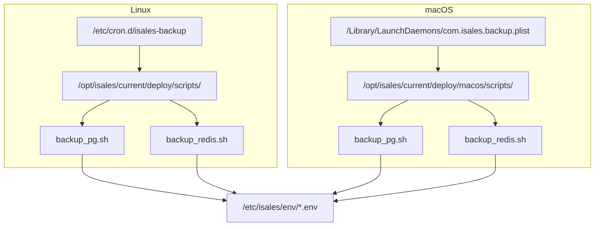
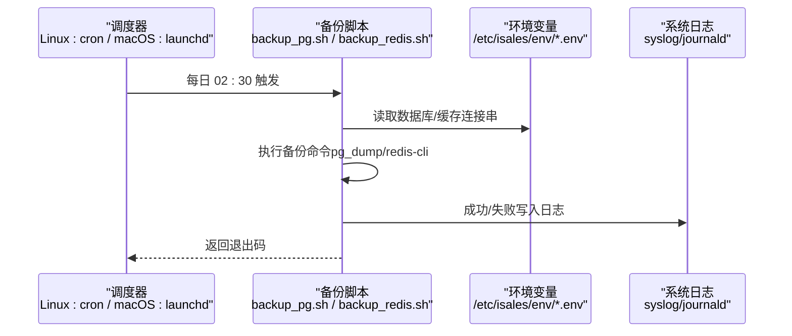
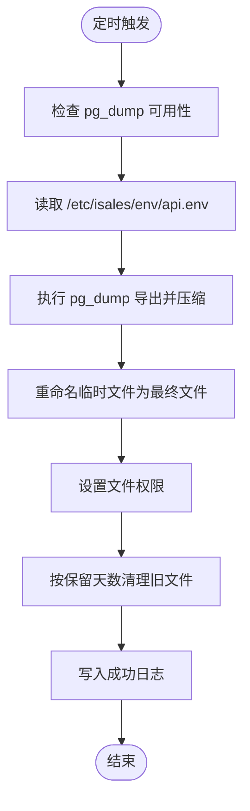
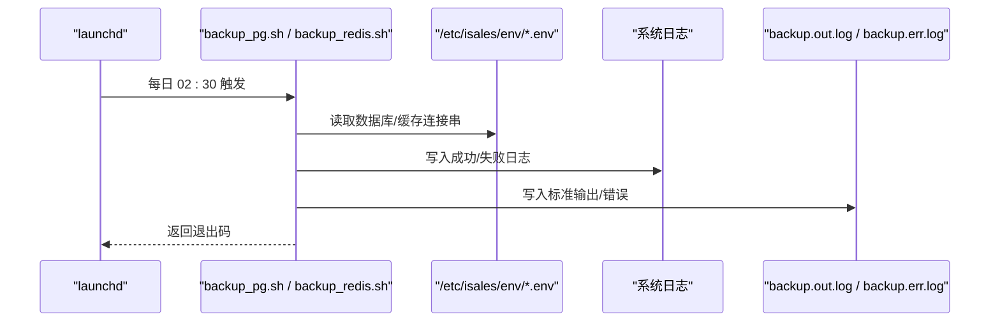
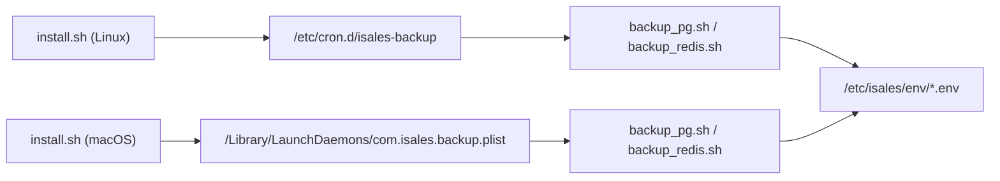

# 备份自动化配置

<cite>
**本文引用的文件**
- [deploy/cron/isales-backup.cron](file://deploy/cron/isales-backup.cron)
- [deploy/linux/scripts/_lib.sh](file://deploy/linux/scripts/_lib.sh)
- [deploy/macos/launchd-jobs/com.isales.backup.plist](file://deploy/macos/launchd-jobs/com.isales.backup.plist)
- [deploy/linux/scripts/backup_pg.sh](file://deploy/linux/scripts/backup_pg.sh)
- [deploy/macos/scripts/backup_pg.sh](file://deploy/macos/scripts/backup_pg.sh)
- [deploy/linux/scripts/backup_redis.sh](file://deploy/linux/scripts/backup_redis.sh)
- [deploy/macos/scripts/backup_redis.sh](file://deploy/macos/scripts/backup_redis.sh)
- [deploy/linux/scripts/install.sh](file://deploy/linux/scripts/install.sh)
- [deploy/macos/scripts/install.sh](file://deploy/macos/scripts/install.sh)
- [deploy/common/_lib.sh](file://deploy/common/_lib.sh)
- [deploy/env/api.env.example](file://deploy/env/api.env.example)
- [deploy/env/engine.env.example](file://deploy/env/engine.env.example)
- [deploy/cloud/monitoring/alert_rules.yml.example](file://deploy/cloud/monitoring/alert_rules.yml.example)
- [deploy/cloud/monitoring/prometheus.yml.example](file://deploy/cloud/monitoring/prometheus.yml.example)
- [deploy/cloud/systemd/isales-api.service](file://deploy/cloud/systemd/isales-api.service)
- [deploy/cloud/systemd/isales-scheduler.service](file://deploy/cloud/systemd/isales-scheduler.service)
</cite>

## 目录
1. [简介](#简介)
2. [项目结构](#项目结构)
3. [核心组件](#核心组件)
4. [架构总览](#架构总览)
5. [详细组件分析](#详细组件分析)
6. [依赖关系分析](#依赖关系分析)
7. [性能考量](#性能考量)
8. [故障排查指南](#故障排查指南)
9. [结论](#结论)
10. [附录](#附录)

## 简介
本指南面向 iSales 备份自动化系统，聚焦于 Linux 与 macOS 平台下的备份任务自动化配置，涵盖以下主题：
- Cron 定时任务与 launchd 日程任务的配置与差异
- 备份脚本的执行顺序、日志记录与错误处理
- 系统服务与权限管理（用户、组、文件权限）
- 监控与告警、日志采集与故障检测
- 备份文件清理策略、存储空间与磁盘监控
- 调试方法、性能优化与安全配置
- 维护与故障排除最佳实践

## 项目结构
备份自动化涉及如下关键位置：
- Linux：/etc/cron.d/isales-backup 调度每日备份；备份脚本位于 /opt/isales/current/deploy/scripts/
- macOS：/Library/LaunchDaemons/com.isales.backup.plist 调度每日备份；备份脚本位于 /opt/isales/current/deploy/macos/scripts/
- 公共库：deploy/common/_lib.sh 提供日志、参数解析、权限校验等通用能力
- 环境变量模板：/etc/isales/env/*.env，备份脚本从其中读取数据库与缓存连接信息
- 安装流程：install.sh 将调度项与脚本部署到目标平台

图表来源
- [deploy/cron/isales-backup.cron:10-13](file://deploy/cron/isales-backup.cron#L10-L13)
- [deploy/macos/launchd-jobs/com.isales.backup.plist:16-28](file://deploy/macos/launchd-jobs/com.isales.backup.plist#L16-L28)
- [deploy/linux/scripts/backup_pg.sh:9-13](file://deploy/linux/scripts/backup_pg.sh#L9-L13)
- [deploy/macos/scripts/backup_pg.sh:19-23](file://deploy/macos/scripts/backup_pg.sh#L19-L23)
- [deploy/linux/scripts/backup_redis.sh:10-14](file://deploy/linux/scripts/backup_redis.sh#L10-L14)
- [deploy/macos/scripts/backup_redis.sh:17-21](file://deploy/macos/scripts/backup_redis.sh#L17-L21)

章节来源
- [deploy/cron/isales-backup.cron:1-14](file://deploy/cron/isales-backup.cron#L1-L14)
- [deploy/macos/launchd-jobs/com.isales.backup.plist:1-42](file://deploy/macos/launchd-jobs/com.isales.backup.plist#L1-L42)
- [deploy/common/_lib.sh:1-181](file://deploy/common/_lib.sh#L1-L181)

## 核心组件
- 调度器
  - Linux：cron 条目定义每日 02:30 执行，依次运行 PostgreSQL 与 Redis 备份脚本
  - macOS：launchd 的 StartCalendarInterval 在同时间点执行相同脚本序列
- 备份脚本
  - PostgreSQL：使用 pg_dump 导出自定义格式并压缩，输出至 /opt/isales/backups/pg/YYYY-MM-DD.sql.gz，默认保留 14 天
  - Redis：通过 redis-cli --rdb 抓取 RDB 快照并压缩，输出至 /opt/isales/backups/redis/YYYY-MM-DD.rdb.gz，默认保留 14 天
- 日志与错误处理
  - Linux：使用 logger 写入 syslog，标签为 isales-backup；失败时输出错误到标准错误
  - macOS：统一通过 logger 输出到系统日志；同时支持 StandardOutPath/StandardErrorPath 文件输出用于诊断
- 环境变量
  - 备份脚本从 /etc/isales/env/*.env 读取数据库与缓存连接串；默认读取 api.env
- 安装与部署
  - Linux：install.sh 将 /etc/cron.d/isales-backup 同步到目标路径
  - macOS：install.sh 渲染并安装 com.isales.backup.plist 到 /Library/LaunchDaemons，并通过 launchctl 加载

章节来源
- [deploy/cron/isales-backup.cron:10-13](file://deploy/cron/isales-backup.cron#L10-L13)
- [deploy/macos/launchd-jobs/com.isales.backup.plist:22-34](file://deploy/macos/launchd-jobs/com.isales.backup.plist#L22-L34)
- [deploy/linux/scripts/backup_pg.sh:17-48](file://deploy/linux/scripts/backup_pg.sh#L17-L48)
- [deploy/macos/scripts/backup_pg.sh:27-54](file://deploy/macos/scripts/backup_pg.sh#L27-L54)
- [deploy/linux/scripts/backup_redis.sh:21-59](file://deploy/linux/scripts/backup_redis.sh#L21-L59)
- [deploy/macos/scripts/backup_redis.sh:28-64](file://deploy/macos/scripts/backup_redis.sh#L28-L64)
- [deploy/linux/scripts/install.sh:240-255](file://deploy/linux/scripts/install.sh#L240-L255)
- [deploy/macos/scripts/install.sh:298-320](file://deploy/macos/scripts/install.sh#L298-L320)

## 架构总览
下图展示备份自动化在两个平台的执行路径与交互：

图表来源
- [deploy/cron/isales-backup.cron](file://deploy/cron/isales-backup.cron#L13)
- [deploy/macos/launchd-jobs/com.isales.backup.plist:22-28](file://deploy/macos/launchd-jobs/com.isales.backup.plist#L22-L28)
- [deploy/linux/scripts/backup_pg.sh:30-48](file://deploy/linux/scripts/backup_pg.sh#L30-L48)
- [deploy/macos/scripts/backup_pg.sh:33-54](file://deploy/macos/scripts/backup_pg.sh#L33-L54)
- [deploy/linux/scripts/backup_redis.sh:33-59](file://deploy/linux/scripts/backup_redis.sh#L33-L59)
- [deploy/macos/scripts/backup_redis.sh:39-64](file://deploy/macos/scripts/backup_redis.sh#L39-L64)

## 详细组件分析

### Linux 平台：Cron 调度与备份流程
- 调度配置
  - 时间：每日 02:30（24 小时制）
  - 用户：isales
  - 命令链：先执行 PostgreSQL 备份，再执行 Redis 备份
- 备份脚本行为
  - PostgreSQL：检查 pg_dump 可用性；从 /etc/isales/env/api.env 读取数据库连接串（剥离 asyncpg 前缀以适配 libpq）；导出后压缩；保留天数可由环境变量覆盖
  - Redis：检查 redis-cli 可用性；解析 ISALES_REDIS_URL；抓取 RDB 并压缩；保留天数可由环境变量覆盖
- 日志与错误
  - 使用 logger 写入 syslog，标签为 isales-backup；失败时输出错误到标准错误
- 安装流程
  - install.sh 将 /etc/cron.d/isales-backup 同步到目标路径，确保备份计划生效

图表来源
- [deploy/linux/scripts/backup_pg.sh:17-48](file://deploy/linux/scripts/backup_pg.sh#L17-L48)

章节来源
- [deploy/cron/isales-backup.cron:10-13](file://deploy/cron/isales-backup.cron#L10-L13)
- [deploy/linux/scripts/backup_pg.sh:17-48](file://deploy/linux/scripts/backup_pg.sh#L17-L48)
- [deploy/linux/scripts/backup_redis.sh:21-59](file://deploy/linux/scripts/backup_redis.sh#L21-L59)
- [deploy/linux/scripts/install.sh:240-255](file://deploy/linux/scripts/install.sh#L240-L255)

### macOS 平台：launchd 调度与备份流程
- 调度配置
  - 时间：每日 02:30（24 小时制）
  - 用户/组：_isales（仅读访问 /etc/isales/env/api.env）
  - 输出：标准输出/错误重定向到 /opt/isales/logs/backup.out.log 与 backup.err.log
- 备份脚本行为
  - PostgreSQL：与 Linux 版本逻辑一致，但会显式将 Homebrew PostgreSQL 路径加入 PATH
  - Redis：与 Linux 版本逻辑一致，但会显式将 Homebrew 工具加入 PATH
- 日志与错误
  - 通过 logger 输出到系统日志；同时保留文件输出便于诊断
- 安装流程
  - install.sh 渲染并安装 com.isales.backup.plist 到 /Library/LaunchDaemons，随后通过 launchctl bootstrap 加载

图表来源
- [deploy/macos/launchd-jobs/com.isales.backup.plist:22-34](file://deploy/macos/launchd-jobs/com.isales.backup.plist#L22-L34)
- [deploy/macos/scripts/backup_pg.sh:27-54](file://deploy/macos/scripts/backup_pg.sh#L27-L54)
- [deploy/macos/scripts/backup_redis.sh:28-64](file://deploy/macos/scripts/backup_redis.sh#L28-L64)

章节来源
- [deploy/macos/launchd-jobs/com.isales.backup.plist:1-42](file://deploy/macos/launchd-jobs/com.isales.backup.plist#L1-L42)
- [deploy/macos/scripts/backup_pg.sh:16-56](file://deploy/macos/scripts/backup_pg.sh#L16-L56)
- [deploy/macos/scripts/backup_redis.sh:14-66](file://deploy/macos/scripts/backup_redis.sh#L14-L66)
- [deploy/macos/scripts/install.sh:298-320](file://deploy/macos/scripts/install.sh#L298-L320)

### 环境变量与跨平台一致性
- 数据库与缓存连接
  - PostgreSQL：从 /etc/isales/env/api.env 读取 ISALES_DATABASE_URL（备份脚本会剥离 asyncpg 前缀以适配 libpq）
  - Redis：从 /etc/isales/env/api.env 读取 ISALES_REDIS_URL
- 服务间一致性
  - api.env 与 engine.env 等需保持数据库与缓存 URL 一致，避免备份与业务服务之间的连接不一致
- 默认保留天数
  - 可通过环境变量覆盖（例如 ISALES_PG_BACKUP_RETAIN、ISALES_REDIS_BACKUP_RETAIN）

章节来源
- [deploy/linux/scripts/backup_pg.sh:30-33](file://deploy/linux/scripts/backup_pg.sh#L30-L33)
- [deploy/macos/scripts/backup_pg.sh:33-40](file://deploy/macos/scripts/backup_pg.sh#L33-L40)
- [deploy/linux/scripts/backup_redis.sh:33-40](file://deploy/linux/scripts/backup_redis.sh#L33-L40)
- [deploy/macos/scripts/backup_redis.sh:39-46](file://deploy/macos/scripts/backup_redis.sh#L39-L46)
- [deploy/env/api.env.example:9-11](file://deploy/env/api.env.example#L9-L11)
- [deploy/env/engine.env.example:8-9](file://deploy/env/engine.env.example#L8-L9)

### 安全与权限管理
- Linux
  - 调度用户：isales
  - 备份输出目录：/opt/isales/backups/pg 与 /opt/isales/backups/redis，文件权限设置为 0640
  - 环境文件：/etc/isales/env/*.env，建议最小权限（仅备份用户可读）
- macOS
  - 调度用户/组：_isales（仅读访问 /etc/isales/env/api.env）
  - 备份输出目录：同上，文件权限设置为 0640
  - 日志文件：/opt/isales/logs/backup.out.log 与 backup.err.log，建议最小权限
- 通用安全建议
  - 限制备份用户的特权，避免不必要的系统访问
  - 对环境文件进行最小权限控制（0640 或更严格）
  - 使用只读方式访问敏感配置（macOS 备份用户仅读）

章节来源
- [deploy/cron/isales-backup.cron](file://deploy/cron/isales-backup.cron#L13)
- [deploy/macos/launchd-jobs/com.isales.backup.plist:12-15](file://deploy/macos/launchd-jobs/com.isales.backup.plist#L12-L15)
- [deploy/linux/scripts/backup_pg.sh](file://deploy/linux/scripts/backup_pg.sh#L43)
- [deploy/macos/scripts/backup_pg.sh](file://deploy/macos/scripts/backup_pg.sh#L50)
- [deploy/linux/scripts/backup_redis.sh](file://deploy/linux/scripts/backup_redis.sh#L55)
- [deploy/macos/scripts/backup_redis.sh](file://deploy/macos/scripts/backup_redis.sh#L60)

## 依赖关系分析
- 脚本依赖
  - PostgreSQL：pg_dump（libpq）
  - Redis：redis-cli
  - 环境变量：/etc/isales/env/*.env
- 平台差异
  - Linux：cron 调度，使用 logger 写 syslog
  - macOS：launchd 调度，支持 stdout/stderr 文件输出与系统日志
- 安装流程耦合
  - Linux：install.sh 将 /etc/cron.d/isales-backup 同步到目标
  - macOS：install.sh 渲染并安装 com.isales.backup.plist，通过 launchctl 加载

图表来源
- [deploy/linux/scripts/install.sh:240-255](file://deploy/linux/scripts/install.sh#L240-L255)
- [deploy/macos/scripts/install.sh:298-320](file://deploy/macos/scripts/install.sh#L298-L320)
- [deploy/cron/isales-backup.cron](file://deploy/cron/isales-backup.cron#L13)
- [deploy/macos/launchd-jobs/com.isales.backup.plist:20-28](file://deploy/macos/launchd-jobs/com.isales.backup.plist#L20-L28)

章节来源
- [deploy/linux/scripts/install.sh:240-255](file://deploy/linux/scripts/install.sh#L240-L255)
- [deploy/macos/scripts/install.sh:298-320](file://deploy/macos/scripts/install.sh#L298-L320)

## 性能考量
- 备份窗口与资源占用
  - 选择非业务高峰期执行（当前为 02:30），避免与高峰时段冲突
- 压缩与 I/O
  - 使用 gzip 压缩减少存储占用；注意压缩过程对 CPU 的额外开销
- 磁盘空间与保留策略
  - 默认保留 14 天；可根据磁盘容量与合规要求调整保留天数
- 并发与顺序
  - 脚本按顺序执行（先 PostgreSQL，后 Redis），避免并发竞争
- 网络与远端缓存
  - Redis 备份通过网络抓取 RDB，需考虑网络带宽与延迟

[本节为通用指导，无需列出具体文件来源]

## 故障排查指南
- 常见问题定位
  - 环境变量缺失或不可读：检查 /etc/isales/env/api.env 是否存在且可读
  - 工具未安装：确认 pg_dump 与 redis-cli 可用
  - 权限不足：核对 isales/_isales 用户对备份输出目录与日志文件的权限
- 日志与审计
  - Linux：使用 journalctl -t isales-backup 查看备份日志
  - macOS：查看 /opt/isales/logs/backup.out.log 与 backup.err.log，以及系统日志
- 调试步骤
  - 手动运行备份脚本（带 --dry-run 或直接执行）验证环境变量与路径
  - 检查 cron/launchd 的最近执行状态与返回码
  - 使用 find 命令验证备份文件是否生成与保留策略是否生效
- 监控与告警
  - 结合 Prometheus/PromQL 与告警规则，关注备份失败、磁盘空间不足、工具不可用等指标
  - 参考云边拓扑监控示例规则与抓取配置

章节来源
- [deploy/linux/scripts/backup_pg.sh:25-33](file://deploy/linux/scripts/backup_pg.sh#L25-L33)
- [deploy/macos/scripts/backup_pg.sh:33-40](file://deploy/macos/scripts/backup_pg.sh#L33-L40)
- [deploy/linux/scripts/backup_redis.sh:28-34](file://deploy/linux/scripts/backup_redis.sh#L28-L34)
- [deploy/macos/scripts/backup_redis.sh:35-41](file://deploy/macos/scripts/backup_redis.sh#L35-L41)
- [deploy/cloud/monitoring/alert_rules.yml.example:1-116](file://deploy/cloud/monitoring/alert_rules.yml.example#L1-L116)
- [deploy/cloud/monitoring/prometheus.yml.example:1-77](file://deploy/cloud/monitoring/prometheus.yml.example#L1-L77)

## 结论
iSales 备份自动化在 Linux 与 macOS 平台上采用一致的备份策略（PostgreSQL 与 Redis），并通过 cron/launchd 实现每日定时执行。通过公共库与安装脚本，系统实现了跨平台的一致性与可维护性。建议结合监控与告警体系，持续优化保留策略与资源占用，确保备份任务稳定可靠。

[本节为总结性内容，无需列出具体文件来源]

## 附录

### 平台差异对照表
- 调度方式：Linux 使用 /etc/cron.d/isales-backup；macOS 使用 /Library/LaunchDaemons/com.isales.backup.plist
- 执行用户：Linux 为 isales；macOS 为 _isales（仅读）
- 日志输出：Linux 使用 syslog；macOS 支持系统日志与文件输出
- 工具路径：macOS 备份脚本显式将 Homebrew 工具加入 PATH

章节来源
- [deploy/cron/isales-backup.cron:10-13](file://deploy/cron/isales-backup.cron#L10-L13)
- [deploy/macos/launchd-jobs/com.isales.backup.plist:12-15](file://deploy/macos/launchd-jobs/com.isales.backup.plist#L12-L15)
- [deploy/macos/scripts/backup_pg.sh](file://deploy/macos/scripts/backup_pg.sh#L17)
- [deploy/macos/scripts/backup_redis.sh](file://deploy/macos/scripts/backup_redis.sh#L15)

### 环境变量与默认值
- PostgreSQL
  - ISALES_DATABASE_URL：来自 /etc/isales/env/api.env（备份脚本剥离 asyncpg 前缀）
  - ISALES_PG_BACKUP_RETAIN：默认 14 天
- Redis
  - ISALES_REDIS_URL：来自 /etc/isales/env/api.env
  - ISALES_REDIS_BACKUP_RETAIN：默认 14 天

章节来源
- [deploy/linux/scripts/backup_pg.sh:10-13](file://deploy/linux/scripts/backup_pg.sh#L10-L13)
- [deploy/macos/scripts/backup_pg.sh:20-23](file://deploy/macos/scripts/backup_pg.sh#L20-L23)
- [deploy/linux/scripts/backup_redis.sh:11-14](file://deploy/linux/scripts/backup_redis.sh#L11-L14)
- [deploy/macos/scripts/backup_redis.sh:18-21](file://deploy/macos/scripts/backup_redis.sh#L18-L21)
- [deploy/env/api.env.example:9-11](file://deploy/env/api.env.example#L9-L11)

### 安装与维护要点
- Linux
  - 使用 install.sh 同步 cron 配置并完成部署
- macOS
  - 使用 install.sh 渲染并安装 launchd plist，加载后验证启动状态
- 通用
  - 通过公共库提供的日志与参数解析能力，增强脚本健壮性
  - 服务单元（systemd）示例展示了最小权限与安全加固配置，可作为备份脚本运行环境的安全参考

章节来源
- [deploy/linux/scripts/install.sh:240-255](file://deploy/linux/scripts/install.sh#L240-L255)
- [deploy/macos/scripts/install.sh:298-320](file://deploy/macos/scripts/install.sh#L298-L320)
- [deploy/common/_lib.sh:33-48](file://deploy/common/_lib.sh#L33-L48)
- [deploy/cloud/systemd/isales-api.service:16-31](file://deploy/cloud/systemd/isales-api.service#L16-L31)
- [deploy/cloud/systemd/isales-scheduler.service:15-28](file://deploy/cloud/systemd/isales-scheduler.service#L15-L28)