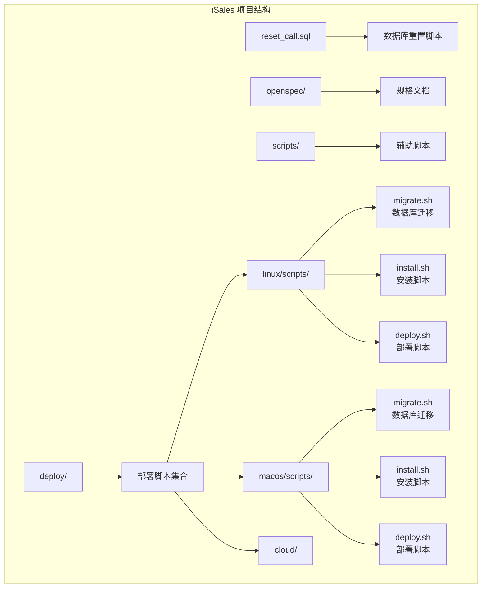
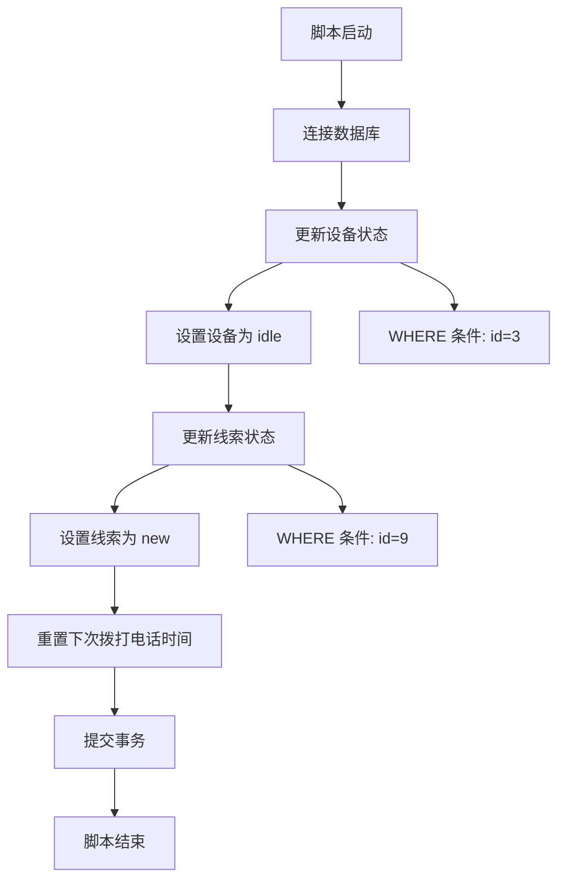
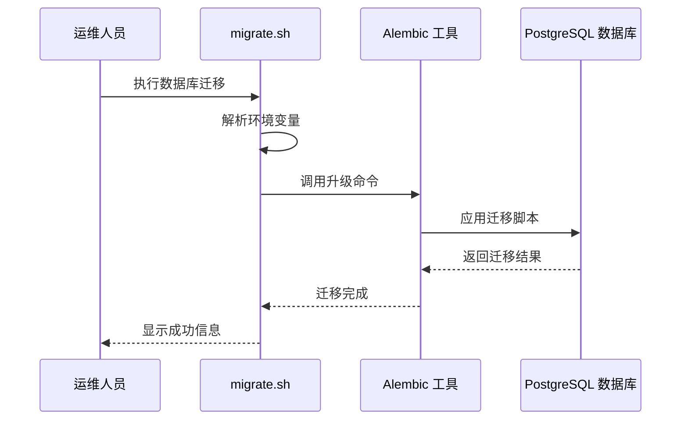
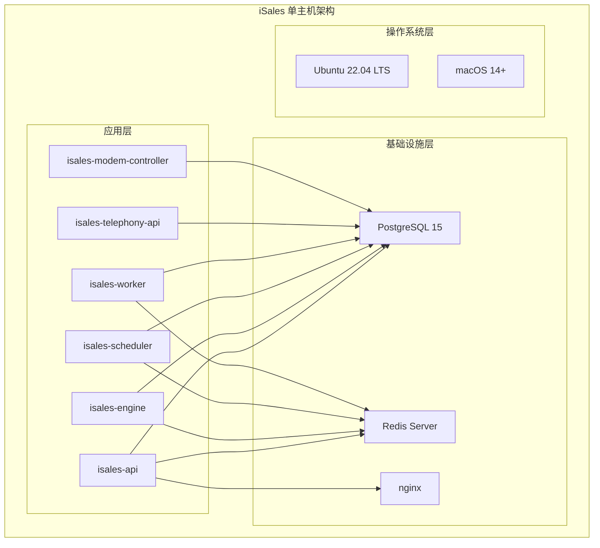
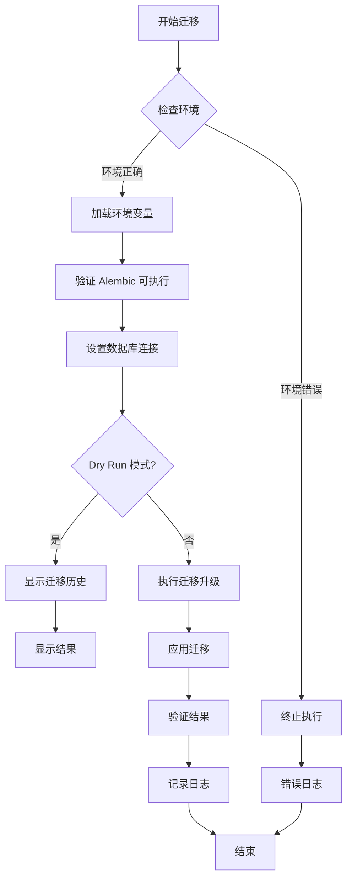
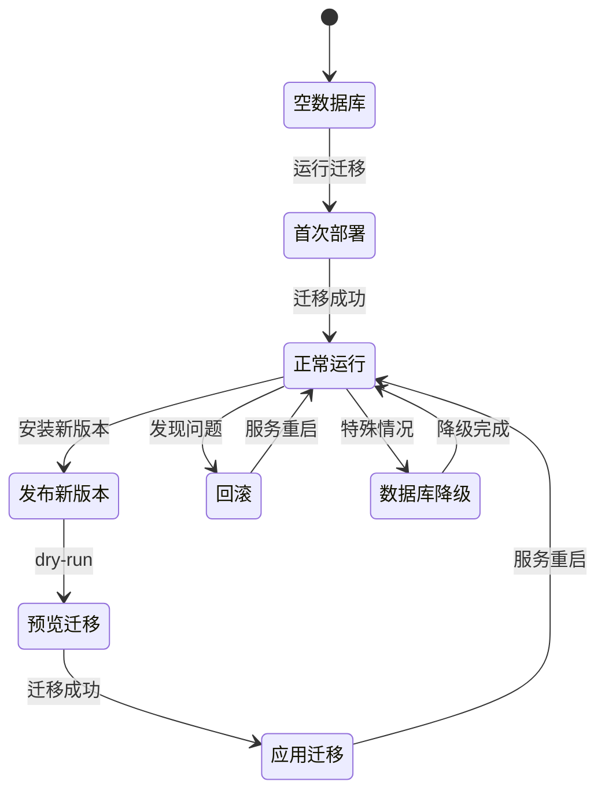
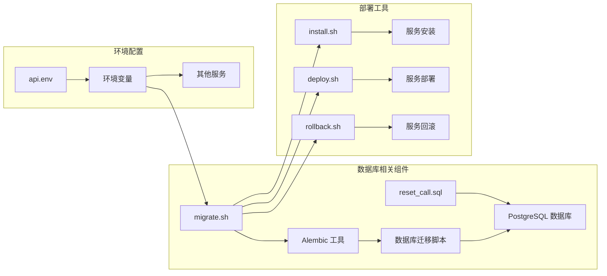

# 数据库迁移脚本 reset_call.sql 文档

<cite>
**本文档引用的文件**
- [reset_call.sql](file://reset_call.sql)
- [migrate.sh](file://deploy/linux/scripts/migrate.sh)
- [migrate.sh](file://deploy/macos/scripts/migrate.sh)
- [README.md](file://README.md)
- [deploy/README.md](file://deploy/README.md)
- [RUNBOOK.md](file://deploy/RUNBOOK.md)
- [api.env.example](file://deploy/env/api.env.example)
- [api.env](file://deploy/cloud/env/api.env)
- [STATE.md](file://deploy/cloud/STATE.md)
</cite>

## 目录
1. [简介](#简介)
2. [项目结构概览](#项目结构概览)
3. [核心组件分析](#核心组件分析)
4. [架构概览](#架构概览)
5. [详细组件分析](#详细组件分析)
6. [依赖关系分析](#依赖关系分析)
7. [性能考虑](#性能考虑)
8. [故障排除指南](#故障排除指南)
9. [结论](#结论)

## 简介

`reset_call.sql` 是一个专门设计用于重置特定通话状态的数据库迁移脚本。该脚本位于 iSales 项目的根目录，是一个简短但功能明确的 SQL 脚本，旨在修复生产环境中出现的通话状态异常问题。

iSales 是一个基于 Python 的销售自动化平台，包含多个微服务组件，支持 Linux 和 macOS 两种部署模型。该平台使用 PostgreSQL 作为主要数据库存储，通过 Alembic 进行数据库模式迁移管理。

## 项目结构概览

iSales 项目采用多仓库架构，包含以下主要组件：

**图表来源**
- [reset_call.sql](file://reset_call.sql)
- [migrate.sh](file://deploy/linux/scripts/migrate.sh)
- [migrate.sh](file://deploy/macos/scripts/migrate.sh)

**章节来源**
- [README.md:1-86](file://README.md#L1-L86)
- [deploy/README.md:1-112](file://deploy/README.md#L1-L112)

## 核心组件分析

### reset_call.sql 脚本分析

`reset_call.sql` 是一个极其简洁的数据库操作脚本，包含两条 UPDATE 语句：

**图表来源**
- [reset_call.sql:1-3](file://reset_call.sql#L1-L3)

该脚本的核心功能是：
1. **设备状态重置**：将 ID 为 3 的设备状态重置为 'idle'
2. **线索状态重置**：将 ID 为 9 的线索状态重置为 'new'，并设置下次拨打电话时间为当前时间

**章节来源**
- [reset_call.sql:1-3](file://reset_call.sql#L1-L3)

### 数据库迁移管理系统

iSales 使用 Alembic 作为数据库迁移管理工具，提供了跨平台的一致性迁移机制：

**图表来源**
- [migrate.sh](file://deploy/linux/scripts/migrate.sh)
- [migrate.sh](file://deploy/macos/scripts/migrate.sh)

**章节来源**
- [migrate.sh:1-60](file://deploy/linux/scripts/migrate.sh#L1-L60)
- [migrate.sh:1-72](file://deploy/macos/scripts/migrate.sh#L1-L72)

## 架构概览

iSales 采用单主机部署架构，支持 Linux 和 macOS 两种平台：

**图表来源**
- [deploy/README.md:15-49](file://deploy/README.md#L15-L49)

**章节来源**
- [deploy/README.md:1-112](file://deploy/README.md#L1-L112)

## 详细组件分析

### 数据库连接配置

iSales 使用统一的数据库连接配置，确保所有服务使用相同的数据库连接字符串：

| 环境变量 | 描述 | 示例值 |
|---------|------|--------|
| `ISALES_DATABASE_URL` | PostgreSQL 连接字符串 | `postgresql+asyncpg://isales:<password>@localhost:5432/isales` |
| `ISALES_REDIS_URL` | Redis 连接字符串 | `redis://localhost:6379/0` |
| `ISALES_JWT_SECRET` | JWT 签名密钥 | `<随机十六进制字符串>` |

**章节来源**
- [api.env.example:9-11](file://deploy/env/api.env.example#L9-L11)
- [api.env:6-10](file://deploy/cloud/env/api.env#L6-L10)

### 迁移脚本执行流程

数据库迁移脚本的执行遵循严格的流程控制：

**图表来源**
- [migrate.sh:49-60](file://deploy/linux/scripts/migrate.sh#L49-L60)
- [migrate.sh:61-72](file://deploy/macos/scripts/migrate.sh#L61-L72)

**章节来源**
- [migrate.sh:1-60](file://deploy/linux/scripts/migrate.sh#L1-L60)
- [migrate.sh:1-72](file://deploy/macos/scripts/migrate.sh#L1-L72)

### 生产环境部署策略

iSales 提供了完整的生产环境部署和回滚策略：

**图表来源**
- [RUNBOOK.md:56-81](file://deploy/RUNBOOK.md#L56-L81)
- [RUNBOOK.md:84-115](file://deploy/RUNBOOK.md#L84-L115)

**章节来源**
- [RUNBOOK.md:17-52](file://deploy/RUNBOOK.md#L17-L52)
- [RUNBOOK.md:56-81](file://deploy/RUNBOOK.md#L56-L81)

## 依赖关系分析

### 组件间依赖关系

**图表来源**
- [reset_call.sql](file://reset_call.sql)
- [migrate.sh](file://deploy/linux/scripts/migrate.sh)
- [api.env.example](file://deploy/env/api.env.example)

**章节来源**
- [deploy/README.md:85-102](file://deploy/README.md#L85-L102)
- [STATE.md:216-231](file://deploy/cloud/STATE.md#L216-L231)

### 数据库模式管理

iSales 使用 Alembic 进行数据库模式管理，支持增量迁移和版本控制：

| 迁移类型 | 描述 | 使用场景 |
|---------|------|----------|
| 初始化迁移 | 创建所有基础表结构 | 首次部署 |
| 增量迁移 | 添加新表或修改现有表 | 日常开发 |
| 降级迁移 | 回滚到之前的数据库版本 | 紧急回滚 |
| 预览迁移 | 查看即将应用的迁移列表 | 发布前检查 |

**章节来源**
- [IMPLEMENTATION_PLAN.md:74-79](file://IMPLEMENTATION_PLAN.md#L74-L79)
- [RUNBOOK.md:97-115](file://deploy/RUNBOOK.md#L97-L115)

## 性能考虑

### 数据库操作优化

对于 `reset_call.sql` 脚本中的数据库操作，建议考虑以下性能因素：

1. **索引优化**：确保 `device.id` 和 `lead.id` 字段上有适当的索引
2. **批量操作**：如果需要重置多个记录，考虑使用批量 UPDATE 语句
3. **事务管理**：确保操作在单个事务中执行，避免部分更新
4. **锁竞争**：在高并发环境下，注意避免长时间锁定相关表

### 迁移脚本性能

Alembic 迁移脚本的性能特点：

- **增量迁移**：只应用未应用的迁移，提高效率
- **并行执行**：支持多线程迁移，加速大型数据库迁移
- **回滚保护**：提供安全的回滚机制，防止数据丢失
- **预检查**：支持 dry-run 模式，提前发现潜在问题

## 故障排除指南

### 常见问题及解决方案

| 问题类型 | 症状 | 解决方案 |
|---------|------|----------|
| 数据库连接失败 | `psql: connection refused` | 检查 PostgreSQL 服务状态和磁盘空间 |
| 迁移失败 | Alembic 报错 | 检查数据库权限和迁移脚本语法 |
| 环境变量错误 | 连接字符串无效 | 验证 `/etc/isales/env/api.env` 配置 |
| 权限问题 | 无法执行脚本 | 确保使用正确的用户权限执行 |

### 调试步骤

1. **检查数据库连接**：使用 `psql` 直接连接数据库验证连接
2. **验证环境变量**：确认 `ISALES_DATABASE_URL` 设置正确
3. **查看迁移历史**：使用 `alembic history` 检查迁移状态
4. **检查服务状态**：验证 PostgreSQL 和 Redis 服务正常运行

**章节来源**
- [RUNBOOK.md:165-179](file://deploy/RUNBOOK.md#L165-L179)
- [RUNBOOK.md:180-196](file://deploy/RUNBOOK.md#L180-L196)

## 结论

`reset_call.sql` 虽然只是一个简单的数据库重置脚本，但它体现了 iSales 项目在数据库管理和运维方面的几个重要特点：

1. **简洁性**：脚本设计简单明了，专注于解决特定问题
2. **安全性**：通过精确的 WHERE 条件限制影响范围
3. **可维护性**：清晰的注释和结构便于理解和维护
4. **集成性**：与整体的 Alembic 迁移系统无缝集成

该脚本的成功实施展示了 iSales 项目在数据库运维方面的专业性和可靠性，为生产环境的稳定运行提供了有力保障。通过标准化的部署流程和完善的故障排除机制，确保了系统的高可用性和可维护性。