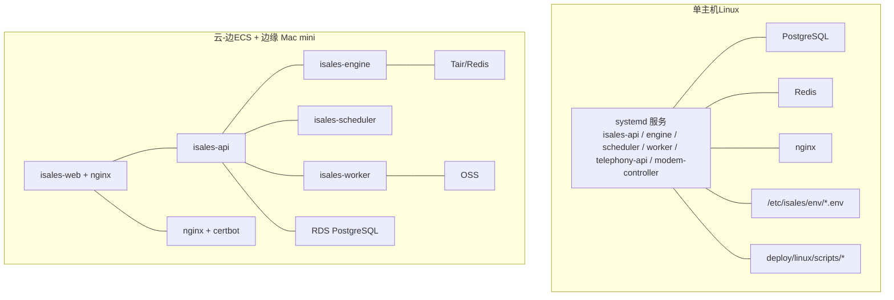
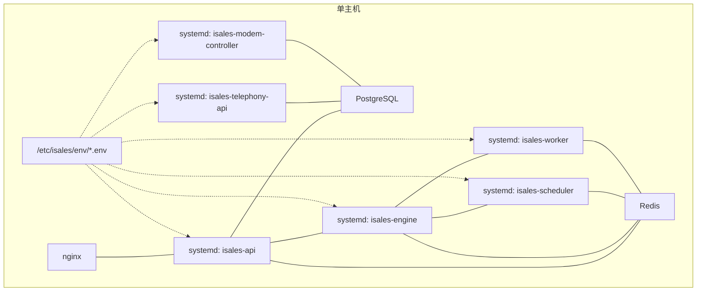
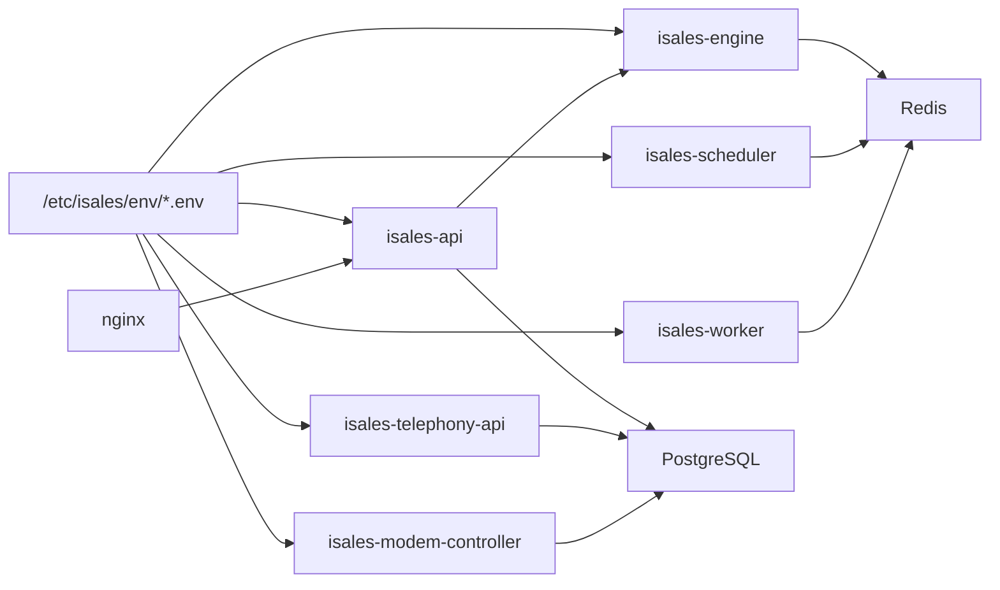
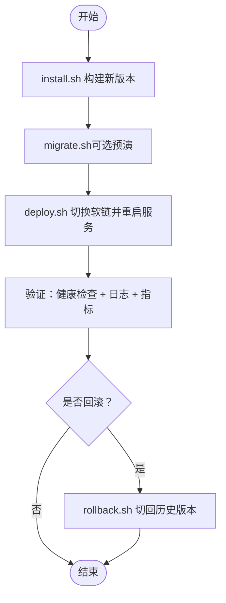
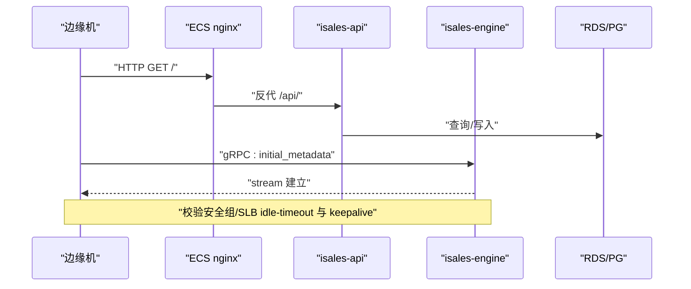

# 故障排查

<cite>
**本文引用的文件**
- [RUNBOOK.md](file://deploy/RUNBOOK.md)
- [RUNBOOK-cloud.md](file://deploy/RUNBOOK-cloud.md)
- [RUNBOOK-edge.md](file://deploy/RUNBOOK-edge.md)
- [README.md（部署总览）](file://deploy/README.md)
- [监控说明](file://deploy/monitoring/README.md)
- [Prometheus 配置示例](file://deploy/monitoring/prometheus.yml.example)
- [告警规则示例](file://deploy/monitoring/alert_rules.yml.example)
- [Grafana 仪表盘模板](file://deploy/monitoring/grafana/isales-overview.json)
- [通用脚本库](file://deploy/common/_lib.sh)
- [单主机环境模板：api.env](file://deploy/env/api.env.example)
- [单主机环境模板：engine.env](file://deploy/env/engine.env.example)
- [单主机环境模板：modem-controller.env](file://deploy/env/modem-controller.env.example)
- [云边拓扑环境模板：api.env](file://deploy/cloud/env/api.env.example)
</cite>

## 目录
1. [简介](#简介)
2. [项目结构](#项目结构)
3. [核心组件](#核心组件)
4. [架构总览](#架构总览)
5. [详细组件分析](#详细组件分析)
6. [依赖关系分析](#依赖关系分析)
7. [性能考量](#性能考量)
8. [故障排查指南](#故障排查指南)
9. [结论](#结论)
10. [附录](#附录)

## 简介
本指南面向 iSales 生产运维与现场工程师，提供系统化的故障排查流程、优先级与标准化步骤，覆盖日志分析、服务状态检查、网络连通性验证、数据库与缓存问题定位、硬件设备断连与认证配置错误处理，并结合监控指标与告警的解读与处置流程。文档同时给出实用命令、诊断工具与自动化检查思路，以及故障预防、应急响应与问题升级机制。

## 项目结构
iSales 采用“单主机”与“云-边”两种部署拓扑，配套统一的目录骨架与集中化环境变量管理。核心目录与职责如下：
- 部署与运维脚本：deploy/linux/scripts 与 deploy/macos/scripts，提供 provision、install、migrate、deploy、rollback、backup 等能力
- 环境变量模板：deploy/env/*.env.example 与 deploy/cloud/env/*.env.example，定义跨服务一致性约束
- 监控模板：deploy/monitoring/ 提供 Prometheus、AlertRules、Grafana 仪表盘模板
- 运维手册：deploy/RUNBOOK.md（单主机/Linux）与 deploy/RUNBOOK-cloud.md、deploy/RUNBOOK-edge.md（云-边）

图表来源
- [README.md（部署总览）:14-49](file://deploy/README.md#L14-L49)
- [RUNBOOK-cloud.md:10-18](file://deploy/RUNBOOK-cloud.md#L10-L18)

章节来源
- [README.md（部署总览）:1-112](file://deploy/README.md#L1-L112)
- [RUNBOOK.md:1-394](file://deploy/RUNBOOK.md#L1-L394)
- [RUNBOOK-cloud.md:1-599](file://deploy/RUNBOOK-cloud.md#L1-L599)
- [RUNBOOK-edge.md:1-254](file://deploy/RUNBOOK-edge.md#L1-L254)

## 核心组件
- 服务组件
  - isales-api：FastAPI HTTP + WebSocket，负责 Web 管理端与外部接口
  - isales-engine：实时通话引擎，负责 AI 管道、RTC 通话与任务编排
  - isales-scheduler：线索调度，产出拨出队列
  - isales-worker：Celery 异步后处理，回调与归档
  - isales-telephony-api：设备/SIM 管理接口
  - isales-modem-controller：USB GSM modem 守护进程
- 基础设施
  - PostgreSQL（本地或 RDS）
  - Redis（本地或 Tair/Redis）
  - nginx（反代 + isales-web 静态资源）
- 监控与告警
  - Prometheus 抓取各服务与节点指标
  - AlertRules 定义基础告警
  - Grafana 仪表盘展示关键指标

章节来源
- [README.md（部署总览）:14-49](file://deploy/README.md#L14-L49)
- [监控说明:1-65](file://deploy/monitoring/README.md#L1-L65)
- [Prometheus 配置示例:1-63](file://deploy/monitoring/prometheus.yml.example#L1-L63)
- [告警规则示例:1-77](file://deploy/monitoring/alert_rules.yml.example#L1-L77)

## 架构总览
iSales 的两类拓扑均以“集中化环境变量 + 统一目录骨架 + 服务化管理”为核心。单主机通过 systemd 管理服务与系统服务；云-边拓扑将 API、引擎、调度、Worker 与 Web 分离部署于 ECS，边缘 Mac mini 通过 gRPC 与 ECS 通信，使用 RTC 通道进行音频通话。

图表来源
- [README.md（部署总览）:14-49](file://deploy/README.md#L14-L49)

章节来源
- [README.md（部署总览）:1-112](file://deploy/README.md#L1-L112)
- [RUNBOOK-cloud.md:10-18](file://deploy/RUNBOOK-cloud.md#L10-L18)

## 详细组件分析

### 服务健康与状态检查
- Linux（systemd）
  - 使用 systemctl status 与 journalctl 检查服务状态与最近错误日志
  - 常用命令：列出服务状态、近 5 分钟错误日志、引擎健康日志
- macOS（launchd）
  - 使用 launchctl 与 log show 检查服务状态与统一日志
  - 常用命令：列出服务状态、近 5 分钟错误日志、brew 服务列表

章节来源
- [RUNBOOK.md:180-196](file://deploy/RUNBOOK.md#L180-L196)
- [RUNBOOK.md:359-379](file://deploy/RUNBOOK.md#L359-L379)

### 数据库连接问题
- 症状
  - psql: connection refused
  - 连接池压力高告警
- 诊断步骤
  - 检查 PostgreSQL 服务状态与磁盘空间
  - 查看系统日志与最近错误
  - 检查连接数占上限比例
- 解决方案
  - 修复磁盘空间与权限
  - 调整连接池大小或降低并发
  - 必要时进行 schema 回退（云-边拓扑）

章节来源
- [RUNBOOK.md:167-178](file://deploy/RUNBOOK.md#L167-L178)
- [告警规则示例:60-77](file://deploy/monitoring/alert_rules.yml.example#L60-L77)
- [RUNBOOK-cloud.md:459-476](file://deploy/RUNBOOK-cloud.md#L459-L476)

### Redis 内存溢出
- 症状
  - OOM command not allowed
- 诊断步骤
  - 使用 redis-cli info memory 获取内存指标
  - 检查 key 空间与过期策略
- 解决方案
  - 调整 maxmemory 与淘汰策略
  - 优化 key 生命周期与热点键

章节来源
- [RUNBOOK.md:168-168](file://deploy/RUNBOOK.md#L168-L168)

### 硬件设备断连（modem-controller）
- 症状
  - 设备断连、立即退出、MockATClient 日志
- 诊断步骤
  - 观察 udev 事件与串口路径变化
  - 检查环境变量 ISALES_MODEM_SERIAL_PATH
  - 重插 USB 并核对权限与规则
- 解决方案
  - 设置正确的串口路径并重启服务
  - 避免生产环境开启 mock 模式

章节来源
- [RUNBOOK.md:169-171](file://deploy/RUNBOOK.md#L169-L171)

### 认证配置错误
- 症状
  - API 登录失败、JWT 校验失败、服务间鉴权异常
- 诊断步骤
  - 检查 ISALES_ADMIN_PASSWORD_HASH（bcrypt）
  - 核对 ISALES_JWT_SECRET 在 api 与 telephony-api 是否一致
- 解决方案
  - 重新生成哈希并重启服务
  - 保持跨服务密钥一致并重新部署

章节来源
- [RUNBOOK.md:174-178](file://deploy/RUNBOOK.md#L174-L178)
- [单主机环境模板：api.env:1-14](file://deploy/env/api.env.example#L1-L14)
- [单主机环境模板：engine.env:1-21](file://deploy/env/engine.env.example#L1-L21)
- [云边拓扑环境模板：api.env:1-24](file://deploy/cloud/env/api.env.example#L1-L24)

### 引擎拨号队列积压
- 症状
  - engine:dial 队列深度 > 阈值并持续告警
- 诊断步骤
  - 使用 redis-cli llen engine:dial 检查队列长度
  - 检查引擎是否宕机或下游阻塞
- 解决方案
  - 重启 isales-engine
  - 评估上游推送速率与下游处理能力

章节来源
- [RUNBOOK.md:172-172](file://deploy/RUNBOOK.md#L172-L172)
- [告警规则示例:12-24](file://deploy/monitoring/alert_rules.yml.example#L12-L24)

### Worker 卡住（回调未执行）
- 症状
  - celery inspect active 无任务、call-ended 队列为空
- 诊断步骤
  - 检查 worker 状态与 active 任务
  - 核对 engine:worker:call-ended 队列
- 解决方案
  - 重启 worker
  - 检查下游回调地址与签名密钥

章节来源
- [RUNBOOK.md:173-173](file://deploy/RUNBOOK.md#L173-L173)

### nginx 502 与 gRPC 50051
- 症状
  - /api/ 502、/ws/ 502、gRPC 50051 无法连通
- 诊断步骤
  - curl 直连健康检查端点
  - 检查 isales-api 服务状态与日志
  - 验证 gRPC 端口监听与 TLS 握手
- 解决方案
  - 重启 isales-engine
  - 检查安全组与 SLB idle-timeout 配置

章节来源
- [RUNBOOK.md:174-175](file://deploy/RUNBOOK.md#L174-L175)
- [RUNBOOK-cloud.md:351-393](file://deploy/RUNBOOK-cloud.md#L351-L393)

### 备份与恢复演练
- 症状
  - 备份任务未运行、恢复后数据不一致
- 诊断步骤
  - 检查 cron 任务与日志标签
  - 验证 RDB/SQL 文件可加载
- 解决方案
  - 修复权限与计划任务
  - 恢复后比对 alembic 版本与关键表行数

章节来源
- [RUNBOOK.md:178-178](file://deploy/RUNBOOK.md#L178-L178)
- [RUNBOOK.md:120-157](file://deploy/RUNBOOK.md#L120-L157)

### 云-边 gRPC 连通性与长连接保活
- 症状
  - 边缘设备频繁断线、stream 生命周期短
- 诊断步骤
  - 检查安全组与 SLB idle-timeout
  - 使用 grpcurl 与日志观察活跃流
- 解决方案
  - 调整安全组与 SLB 参数
  - 确保两端 keepalive 配置一致

章节来源
- [RUNBOOK-cloud.md:351-393](file://deploy/RUNBOOK-cloud.md#L351-L393)

### 边缘机网络与硬件诊断
- 症状
  - DNS 解析失败、端口不可达、modem 串口变化
- 诊断步骤
  - nc / openssl s_client 验证连通与证书
  - screen 手动 AT 指令检查
- 解决方案
  - 更新串口路径并重启服务
  - 优化 WAN 质量（mtr）

章节来源
- [RUNBOOK-edge.md:166-221](file://deploy/RUNBOOK-edge.md#L166-L221)

## 依赖关系分析
- 环境变量一致性
  - ISALES_DATABASE_URL、ISALES_REDIS_URL、ISALES_JWT_SECRET 等跨服务必须一致
- 服务依赖顺序
  - 单主机：telephony-api → scheduler → worker → engine → api
  - 云-边：nginx → api → engine（gRPC）→ scheduler → worker
- 监控端点现状
  - 当前多数服务尚未实现 /metrics，需逐步补齐

图表来源
- [单主机环境模板：api.env:1-14](file://deploy/env/api.env.example#L1-L14)
- [单主机环境模板：engine.env:1-21](file://deploy/env/engine.env.example#L1-L21)
- [单主机环境模板：modem-controller.env:1-15](file://deploy/env/modem-controller.env.example#L1-L15)
- [云边拓扑环境模板：api.env:1-24](file://deploy/cloud/env/api.env.example#L1-L24)

章节来源
- [Prometheus 配置示例:1-63](file://deploy/monitoring/prometheus.yml.example#L1-L63)
- [告警规则示例:1-77](file://deploy/monitoring/alert_rules.yml.example#L1-L77)

## 性能考量
- 队列与吞吐
  - 关注 engine:dial 队列深度与 worker 回调失败率
- 数据库压力
  - 连接数占比超过阈值触发告警，需优化连接池或降低并发
- 通话延迟
  - 云-边拓扑中，gRPC keepalive 与网络空闲超时直接影响长连接稳定性

章节来源
- [告警规则示例:12-24](file://deploy/monitoring/alert_rules.yml.example#L12-L24)
- [告警规则示例:60-77](file://deploy/monitoring/alert_rules.yml.example#L60-L77)
- [RUNBOOK-cloud.md:351-393](file://deploy/RUNBOOK-cloud.md#L351-L393)

## 故障排查指南

### 一、标准化流程与优先级
- 优先级
  1) 业务可用性（Web/移动端能否访问）
  2) API 与 gRPC 服务可用性
  3) 核心队列与数据库压力
  4) 硬件与网络连通性
  5) 认证与密钥一致性
- 标准化步骤
  - 快速自愈：重启相关服务、检查端口与健康检查
  - 深入诊断：查看日志、监控指标、队列深度、数据库连接
  - 验证恢复：冒烟测试、关键指标回归

章节来源
- [RUNBOOK.md:180-196](file://deploy/RUNBOOK.md#L180-L196)
- [RUNBOOK-cloud.md:446-457](file://deploy/RUNBOOK-cloud.md#L446-L457)

### 二、日志分析
- Linux
  - journalctl -u isales-* --since '5 min ago' -p err
  - journalctl -u isales-engine -n 50
- macOS
  - log show --predicate 'subsystem BEGINSWITH "com.isales."'
  - log stream --predicate 'subsystem == "com.isales.<svc>"'

章节来源
- [RUNBOOK.md:188-189](file://deploy/RUNBOOK.md#L188-L189)
- [RUNBOOK.md:371-372](file://deploy/RUNBOOK.md#L371-L372)

### 三、服务状态检查
- Linux
  - systemctl status isales-{api,engine,scheduler,worker,telephony-api,modem-controller}
- macOS
  - launchctl print system/com.isales.<svc> 与 brew services list

章节来源
- [RUNBOOK.md:183-186](file://deploy/RUNBOOK.md#L183-L186)
- [RUNBOOK.md:362-375](file://deploy/RUNBOOK.md#L362-L375)

### 四、网络连通性验证
- 云-边 gRPC
  - nc -zv 域名 50051
  - openssl s_client -connect 域名:50051
  - grpcurl -H "authorization: Bearer $TOKEN" 域名:50051 list
- 边缘机
  - mtr -r -c 20 域名

章节来源
- [RUNBOOK-cloud.md:337-393](file://deploy/RUNBOOK-cloud.md#L337-L393)
- [RUNBOOK-edge.md:166-194](file://deploy/RUNBOOK-edge.md#L166-L194)

### 五、数据库与缓存问题
- PostgreSQL
  - systemctl status postgresql；检查磁盘与日志
  - 连接数占比告警：检查应用连接池与并发
- Redis
  - redis-cli info memory；调整 maxmemory 与淘汰策略

章节来源
- [RUNBOOK.md:167-168](file://deploy/RUNBOOK.md#L167-L168)
- [告警规则示例:60-77](file://deploy/monitoring/alert_rules.yml.example#L60-L77)

### 六、硬件与认证问题
- modem-controller
  - udevadm monitor；重插 USB；检查串口路径
- 认证
  - 核对 ISALES_ADMIN_PASSWORD_HASH（bcrypt）
  - 核对 ISALES_JWT_SECRET 一致性

章节来源
- [RUNBOOK.md:169-178](file://deploy/RUNBOOK.md#L169-L178)

### 七、监控指标与告警处理
- 告警类型
  - Dial Queue Backlog、Device Flagged Rate、Callback Failure Rate、PG Connections High
- 处理流程
  - 立即核对相关指标趋势与阈值
  - 检查队列深度、回调日志、数据库连接
  - 采取相应措施（扩容/限流/修复上游）

章节来源
- [监控说明:1-65](file://deploy/monitoring/README.md#L1-L65)
- [告警规则示例:1-77](file://deploy/monitoring/alert_rules.yml.example#L1-L77)
- [Grafana 仪表盘模板:1-87](file://deploy/monitoring/grafana/isales-overview.json#L1-L87)

### 八、实用命令与自动化检查
- 通用
  - 服务状态概览、近 5 分钟错误日志、活动通话数、队列深度
- 云-边
  - gRPC 连通性测试、日志流观察、设备心跳查询
- 边缘机
  - DNS/TLS/端口连通性、AT 指令、mtr 质量

章节来源
- [RUNBOOK.md:180-196](file://deploy/RUNBOOK.md#L180-L196)
- [RUNBOOK-cloud.md:325-443](file://deploy/RUNBOOK-cloud.md#L325-L443)
- [RUNBOOK-edge.md:166-221](file://deploy/RUNBOOK-edge.md#L166-L221)

### 九、应急响应与升级机制
- 三段式升级
  - 本地演练 → 低峰窗口 → 正式发布
- 回滚策略
  - 仅切换软链 + 重启服务（schema 通常不回退）
- 紧急预案
  - 备份恢复演练、凭据轮换、主密钥灾难恢复

章节来源
- [RUNBOOK.md:84-115](file://deploy/RUNBOOK.md#L84-L115)
- [RUNBOOK-cloud.md:281-296](file://deploy/RUNBOOK-cloud.md#L281-L296)
- [RUNBOOK-cloud.md:479-581](file://deploy/RUNBOOK-cloud.md#L479-L581)

## 结论
通过标准化的故障排查流程、完善的监控告警与严格的环境一致性管理，iSales 能够在单主机与云-边两种拓扑下实现快速定位与恢复。建议在日常运维中坚持“先自愈、后深挖、再验证”的原则，并定期演练备份恢复与回滚流程，确保在真实故障中高效响应。

## 附录

### A. 环境变量一致性检查清单
- ISALES_DATABASE_URL：api/engine/scheduler/worker/telephony-api（单主机）或 api/engine/worker（云-边）
- ISALES_REDIS_URL：api/engine/scheduler/worker
- ISALES_JWT_SECRET：api 与 telephony-api 一致
- ISALES_FERNET_KEY：api/engine/worker/scheduler 一致（云-边）

章节来源
- [单主机环境模板：api.env:1-14](file://deploy/env/api.env.example#L1-L14)
- [单主机环境模板：engine.env:1-21](file://deploy/env/engine.env.example#L1-L21)
- [单主机环境模板：modem-controller.env:1-15](file://deploy/env/modem-controller.env.example#L1-L15)
- [云边拓扑环境模板：api.env:1-24](file://deploy/cloud/env/api.env.example#L1-L24)

### B. 发布与回滚流程图（单主机）

图表来源
- [RUNBOOK.md:56-81](file://deploy/RUNBOOK.md#L56-L81)
- [RUNBOOK.md:84-96](file://deploy/RUNBOOK.md#L84-L96)

### C. 云-边拓扑健康检查序列图

图表来源
- [RUNBOOK-cloud.md:337-393](file://deploy/RUNBOOK-cloud.md#L337-L393)