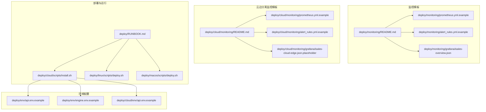
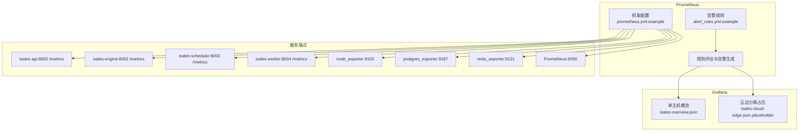
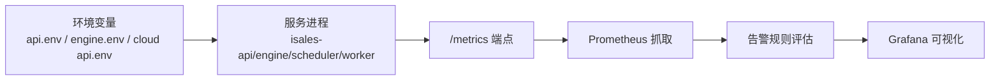

# 监控告警

<cite>
**本文引用的文件**
- [deploy/monitoring/README.md](file://deploy/monitoring/README.md)
- [deploy/cloud/monitoring/README.md](file://deploy/cloud/monitoring/README.md)
- [deploy/monitoring/prometheus.yml.example](file://deploy/monitoring/prometheus.yml.example)
- [deploy/cloud/monitoring/prometheus.yml.example](file://deploy/cloud/monitoring/prometheus.yml.example)
- [deploy/monitoring/alert_rules.yml.example](file://deploy/monitoring/alert_rules.yml.example)
- [deploy/cloud/monitoring/alert_rules.yml.example](file://deploy/cloud/monitoring/alert_rules.yml.example)
- [deploy/monitoring/grafana/isales-overview.json](file://deploy/monitoring/grafana/isales-overview.json)
- [deploy/cloud/monitoring/grafana/isales-cloud-edge.json.placeholder](file://deploy/cloud/monitoring/grafana/isales-cloud-edge.json.placeholder)
- [deploy/cloud/scripts/install.sh](file://deploy/cloud/scripts/install.sh)
- [deploy/linux/scripts/deploy.sh](file://deploy/linux/scripts/deploy.sh)
- [deploy/macos/scripts/deploy.sh](file://deploy/macos/scripts/deploy.sh)
- [deploy/RUNBOOK.md](file://deploy/RUNBOOK.md)
- [DESIGN.md](file://DESIGN.md)
- [deploy/env/api.env.example](file://deploy/env/api.env.example)
- [deploy/env/engine.env.example](file://deploy/env/engine.env.example)
- [deploy/cloud/env/api.env.example](file://deploy/cloud/env/api.env.example)
</cite>

## 目录
1. [简介](#简介)
2. [项目结构](#项目结构)
3. [核心组件](#核心组件)
4. [架构总览](#架构总览)
5. [组件详解](#组件详解)
6. [依赖关系分析](#依赖关系分析)
7. [性能考量](#性能考量)
8. [故障排查指南](#故障排查指南)
9. [结论](#结论)
10. [附录](#附录)

## 简介
本指南面向 iSales 生产环境的监控与告警体系，覆盖 Prometheus 指标采集、Grafana 可视化、告警规则与通知、部署与配置管理、数据导出与容量规划支持、以及运维最佳实践与维护管理。文档同时给出云边分离拓扑（cloud-edge）与单主机（single-host）两套模板，帮助运营团队按需选择并落地。

## 项目结构
监控相关资产主要分布在以下路径：
- 单主机监控模板：deploy/monitoring/
- 云边分离监控模板：deploy/cloud/monitoring/
- 部署与运行手册：deploy/RUNBOOK.md
- 设计与规范索引：DESIGN.md
- 环境变量示例：deploy/env/*.env.example 与 deploy/cloud/env/*.env.example

下图展示监控子系统的文件分布与职责边界：

图表来源
- [deploy/monitoring/README.md:1-65](file://deploy/monitoring/README.md#L1-L65)
- [deploy/cloud/monitoring/README.md:1-37](file://deploy/cloud/monitoring/README.md#L1-L37)
- [deploy/monitoring/prometheus.yml.example:1-63](file://deploy/monitoring/prometheus.yml.example#L1-L63)
- [deploy/cloud/monitoring/prometheus.yml.example:1-77](file://deploy/cloud/monitoring/prometheus.yml.example#L1-L77)
- [deploy/monitoring/alert_rules.yml.example:1-77](file://deploy/monitoring/alert_rules.yml.example#L1-L77)
- [deploy/cloud/monitoring/alert_rules.yml.example:1-116](file://deploy/cloud/monitoring/alert_rules.yml.example#L1-L116)
- [deploy/monitoring/grafana/isales-overview.json:1-87](file://deploy/monitoring/grafana/isales-overview.json#L1-L87)
- [deploy/cloud/monitoring/grafana/isales-cloud-edge.json.placeholder:1-34](file://deploy/cloud/monitoring/grafana/isales-cloud-edge.json.placeholder#L1-L34)
- [deploy/RUNBOOK.md:1-394](file://deploy/RUNBOOK.md#L1-L394)
- [deploy/cloud/scripts/install.sh:1-300](file://deploy/cloud/scripts/install.sh#L1-L300)
- [deploy/linux/scripts/deploy.sh:1-139](file://deploy/linux/scripts/deploy.sh#L1-L139)
- [deploy/macos/scripts/deploy.sh:1-201](file://deploy/macos/scripts/deploy.sh#L1-L201)
- [deploy/env/api.env.example:1-14](file://deploy/env/api.env.example#L1-L14)
- [deploy/env/engine.env.example:1-21](file://deploy/env/engine.env.example#L1-L21)
- [deploy/cloud/env/api.env.example:1-24](file://deploy/cloud/env/api.env.example#L1-L24)

章节来源
- [deploy/monitoring/README.md:1-65](file://deploy/monitoring/README.md#L1-L65)
- [deploy/cloud/monitoring/README.md:1-37](file://deploy/cloud/monitoring/README.md#L1-L37)

## 核心组件
- Prometheus 抓取配置：定义服务端口、指标路径与抓取周期，支持单主机与云边分离两种拓扑。
- 告警规则：基于直方图分位数、增量计数器与比率计算，覆盖边缘离线、媒体缓冲压力、引擎管道延迟预算、回调失败率与数据库连接压力等。
- Grafana 仪表盘：提供概览面板（活动通话、队列深度、连通率、服务错误日志），云边分离模板提供占位清单以便按需构建。
- 部署与运行：install.sh 安装云侧服务与 systemd 单元，deploy.sh 控制重启顺序与低峰窗口门禁，RUNBOOK.md 提供硬性上线门禁与排障清单。

章节来源
- [deploy/monitoring/prometheus.yml.example:1-63](file://deploy/monitoring/prometheus.yml.example#L1-L63)
- [deploy/cloud/monitoring/prometheus.yml.example:1-77](file://deploy/cloud/monitoring/prometheus.yml.example#L1-L77)
- [deploy/monitoring/alert_rules.yml.example:1-77](file://deploy/monitoring/alert_rules.yml.example#L1-L77)
- [deploy/cloud/monitoring/alert_rules.yml.example:1-116](file://deploy/cloud/monitoring/alert_rules.yml.example#L1-L116)
- [deploy/monitoring/grafana/isales-overview.json:1-87](file://deploy/monitoring/grafana/isales-overview.json#L1-L87)
- [deploy/cloud/monitoring/grafana/isales-cloud-edge.json.placeholder:1-34](file://deploy/cloud/monitoring/grafana/isales-cloud-edge.json.placeholder#L1-L34)
- [deploy/cloud/scripts/install.sh:1-300](file://deploy/cloud/scripts/install.sh#L1-L300)
- [deploy/linux/scripts/deploy.sh:1-139](file://deploy/linux/scripts/deploy.sh#L1-L139)
- [deploy/macos/scripts/deploy.sh:1-201](file://deploy/macos/scripts/deploy.sh#L1-L201)
- [deploy/RUNBOOK.md:1-394](file://deploy/RUNBOOK.md#L1-L394)

## 架构总览
下图展示 Prometheus 抓取、规则评估与 Grafana 可视化的整体流程，并标注云边分离与单主机两类拓扑的差异点。

图表来源
- [deploy/monitoring/prometheus.yml.example:1-63](file://deploy/monitoring/prometheus.yml.example#L1-L63)
- [deploy/cloud/monitoring/prometheus.yml.example:1-77](file://deploy/cloud/monitoring/prometheus.yml.example#L1-L77)
- [deploy/monitoring/alert_rules.yml.example:1-77](file://deploy/monitoring/alert_rules.yml.example#L1-L77)
- [deploy/cloud/monitoring/alert_rules.yml.example:1-116](file://deploy/cloud/monitoring/alert_rules.yml.example#L1-L116)
- [deploy/monitoring/grafana/isales-overview.json:1-87](file://deploy/monitoring/grafana/isales-overview.json#L1-L87)
- [deploy/cloud/monitoring/grafana/isales-cloud-edge.json.placeholder:1-34](file://deploy/cloud/monitoring/grafana/isales-cloud-edge.json.placeholder#L1-L34)

## 组件详解

### Prometheus 抓取配置
- 单主机模板：定义 5 个服务与 node_exporter、postgres_exporter 的抓取作业，端口与路径遵循约定，部分服务的 /metrics 尚未实现，待后续补全。
- 云边分离模板：移除 telephony-api 与 modem-controller 的抓取，新增 cloud-edge 专属指标（如流计数、心跳时间、断线次数、ARTC 会话数、首 TTS 直方图等），并强调边缘机内部指标不集中聚合，由 cloud 端记录“离线次数 + 心跳间隔”。

章节来源
- [deploy/monitoring/prometheus.yml.example:1-63](file://deploy/monitoring/prometheus.yml.example#L1-L63)
- [deploy/cloud/monitoring/prometheus.yml.example:1-77](file://deploy/cloud/monitoring/prometheus.yml.example#L1-L77)
- [deploy/cloud/monitoring/README.md:9-37](file://deploy/cloud/monitoring/README.md#L9-L37)

### 告警规则与阈值
- 单主机规则（baseline）：
  - Dial 队列堆积：基于 redis 列表长度阈值与持续时间。
  - 设备被标记比例：小时级比率阈值。
  - 回调失败率：尝试与失败计数比值阈值。
  - PostgreSQL 连接压力：当前连接数与 max_connections 比值阈值。
- 云边分离规则（starting defaults）：
  - 边缘离线：心跳秒数超过阈值。
  - 边缘重连风暴：5 分钟内断线次数超过阈值。
  - ARTC 推送音频缓冲满：30 秒窗口内超过阈值。
  - ARTC 会话数漂移：与引擎活动通话数差值超过阈值。
  - 引擎管道首 TTS P95：严格遵循设计决策 4 的 800ms 预算。
  - 回调失败率与 PG 连接压力（复用 baseline）。

章节来源
- [deploy/monitoring/alert_rules.yml.example:1-77](file://deploy/monitoring/alert_rules.yml.example#L1-L77)
- [deploy/cloud/monitoring/alert_rules.yml.example:1-116](file://deploy/cloud/monitoring/alert_rules.yml.example#L1-L116)
- [deploy/cloud/monitoring/README.md:24-24](file://deploy/cloud/monitoring/README.md#L24-L24)

### Grafana 仪表盘
- 单主机概览面板：活动通话统计、引擎 dial 队列深度、连通率、服务错误日志柱状图。
- 云边分离占位清单：按“云边流健康、ARTC 媒体平面、引擎管道延迟预算、基础设施”四行组织，指导实际构建。

章节来源
- [deploy/monitoring/grafana/isales-overview.json:1-87](file://deploy/monitoring/grafana/isales-overview.json#L1-L87)
- [deploy/cloud/monitoring/grafana/isales-cloud-edge.json.placeholder:1-34](file://deploy/cloud/monitoring/grafana/isales-cloud-edge.json.placeholder#L1-L34)

### 部署与运行流程
- install.sh（云边分离）：克隆/更新仓库、创建共享虚拟环境、构建 isales-web、安装 DingRTC SDK 与绑定、同步 systemd 单元、写入环境文件 drop-in、可选激活。
- deploy.sh（Linux/macOS）：低峰窗口门禁、原子切换 /opt/isales/current、按拓扑顺序重启服务、验证状态、可选重启 modem-controller。
- RUNBOOK.md：首次部署、例行发布、回滚、备份恢复演练、故障速查、上线硬性门禁（含监控部署与至少 2 条有效告警）。

章节来源
- [deploy/cloud/scripts/install.sh:1-300](file://deploy/cloud/scripts/install.sh#L1-L300)
- [deploy/linux/scripts/deploy.sh:1-139](file://deploy/linux/scripts/deploy.sh#L1-L139)
- [deploy/macos/scripts/deploy.sh:1-201](file://deploy/macos/scripts/deploy.sh#L1-L201)
- [deploy/RUNBOOK.md:1-394](file://deploy/RUNBOOK.md#L1-L394)

### 关键性能指标与阈值设定
- 边缘离线：心跳秒数阈值（云边分离模板中与 watchdog 阈值对齐）。
- 边缘断线风暴：5 分钟内断线次数阈值。
- ARTC 推送音频缓冲满：30 秒窗口内次数阈值。
- ARTC 会话数漂移：与活动通话数差值阈值。
- 引擎管道首 TTS P95：800ms 预算（P95）。
- 回调失败率：15 分钟窗口内失败/尝试比值阈值。
- PG 连接压力：当前连接数/max_connections 比值阈值。

章节来源
- [deploy/cloud/monitoring/alert_rules.yml.example:14-116](file://deploy/cloud/monitoring/alert_rules.yml.example#L14-L116)
- [deploy/monitoring/alert_rules.yml.example:12-77](file://deploy/monitoring/alert_rules.yml.example#L12-L77)

### 告警级别与通知
- 告警级别：warning/critical（示例中部分规则标注为 warning，PG 连接压力标注为 critical）。
- 通知渠道：README 中建议对接钉钉/飞书 webhook（运营商关注 edge offline 与延迟预算）。
- 告警去重与升级：模板未包含 Alertmanager 配置，建议结合企业现有 Alertmanager 实践进行去重（如 group_wait/group_interval）、静默与升级策略。

章节来源
- [deploy/cloud/monitoring/README.md:32-32](file://deploy/cloud/monitoring/README.md#L32-L32)
- [deploy/cloud/monitoring/alert_rules.yml.example:18-116](file://deploy/cloud/monitoring/alert_rules.yml.example#L18-L116)

### 可视化、历史趋势与容量规划
- 可视化：Grafana 面板提供活动通话、队列深度、连通率与错误日志趋势。
- 历史趋势：Prometheus 存储历史样本，结合面板时间范围与刷新频率进行趋势分析。
- 容量规划：PG 连接压力与 Redis 队列深度是关键容量信号；结合回调失败率与引擎吞吐趋势评估上游依赖与资源上限。

章节来源
- [deploy/monitoring/grafana/isales-overview.json:1-87](file://deploy/monitoring/grafana/isales-overview.json#L1-L87)
- [deploy/monitoring/alert_rules.yml.example:60-77](file://deploy/monitoring/alert_rules.yml.example#L60-L77)

### 部署安装与配置管理
- 单主机安装（operator 自有监控栈）：复制模板至 Prometheus 主机，启用 node_exporter 与可选 postgres_exporter，导入 Grafana 仪表盘。
- 云边分离安装：在 ECS 上安装 Prometheus/Grafana/node_exporter，复制 cloud 模板，导入云边分离仪表盘占位，配置 Alertmanager 钉钉/飞书 webhook。
- 环境变量一致性：跨服务数据库、Redis、JWT/对称密钥需保持一致，避免认证与连接异常。

章节来源
- [deploy/monitoring/README.md:16-29](file://deploy/monitoring/README.md#L16-L29)
- [deploy/cloud/monitoring/README.md:26-36](file://deploy/cloud/monitoring/README.md#L26-L36)
- [deploy/env/api.env.example:4-13](file://deploy/env/api.env.example#L4-L13)
- [deploy/env/engine.env.example:4-9](file://deploy/env/engine.env.example#L4-L9)
- [deploy/cloud/env/api.env.example:3-21](file://deploy/cloud/env/api.env.example#L3-L21)

### 监控数据导出
- Prometheus 提供查询接口与规则评估结果，可通过 Prometheus HTTP API 或 Grafana 导出面板数据。
- 建议结合企业日志/指标平台进行长期归档与合规导出。

章节来源
- [deploy/monitoring/prometheus.yml.example:10-16](file://deploy/monitoring/prometheus.yml.example#L10-L16)
- [deploy/cloud/monitoring/prometheus.yml.example:10-16](file://deploy/cloud/monitoring/prometheus.yml.example#L10-L16)

## 依赖关系分析
- 服务端点依赖：各服务需实现 /metrics 并暴露端口，Prometheus 依据配置抓取。
- 环境变量依赖：数据库、Redis、JWT/对称密钥需跨服务一致，否则导致连接失败或鉴权异常。
- 部署顺序依赖：engine 重启会中断活动通话，需在低峰窗口执行，且按拓扑顺序重启以保证依赖链稳定。

图表来源
- [deploy/env/api.env.example:4-13](file://deploy/env/api.env.example#L4-L13)
- [deploy/env/engine.env.example:4-9](file://deploy/env/engine.env.example#L4-L9)
- [deploy/cloud/env/api.env.example:3-21](file://deploy/cloud/env/api.env.example#L3-L21)
- [deploy/monitoring/prometheus.yml.example:18-62](file://deploy/monitoring/prometheus.yml.example#L18-L62)
- [deploy/cloud/monitoring/prometheus.yml.example:21-76](file://deploy/cloud/monitoring/prometheus.yml.example#L21-L76)

章节来源
- [deploy/RUNBOOK.md:56-81](file://deploy/RUNBOOK.md#L56-L81)
- [deploy/linux/scripts/deploy.sh:10-13](file://deploy/linux/scripts/deploy.sh#L10-L13)
- [deploy/macos/scripts/deploy.sh:17-22](file://deploy/macos/scripts/deploy.sh#L17-L22)

## 性能考量
- 抓取与评估间隔：默认 30s，可根据数据量与存储成本调整。
- 规则表达式复杂度：直方图分位数与 rate 计算对内存与 CPU 有一定开销，建议在低峰时段评估规则。
- 指标基数控制：标签维度过多会放大存储与查询成本，建议限制高基数标签使用。
- 传输与存储：云边分离场景建议将边缘机内部指标留在边缘侧，减少跨网络传输与聚合压力。

章节来源
- [deploy/monitoring/prometheus.yml.example:10-12](file://deploy/monitoring/prometheus.yml.example#L10-L12)
- [deploy/cloud/monitoring/README.md:34-36](file://deploy/cloud/monitoring/README.md#L34-L36)

## 故障排查指南
- 监控未生效：
  - 检查 /metrics 端点是否实现并暴露端口。
  - 使用 promtool 校验告警规则语法。
  - Grafana 导入 JSON 是否解析成功。
- 告警误报/漏报：
  - 调整阈值与持续时间，结合历史趋势与容量规划。
  - 对高频抖动指标增加抑制或静默窗口。
- 部署窗口与服务重启：
  - 低峰窗口门禁与重启顺序必须严格执行，避免影响正在通话。
- 环境变量不一致：
  - 核对数据库、Redis、JWT/对称密钥一致性，必要时重新安装并写入 drop-in。

章节来源
- [deploy/monitoring/README.md:49-57](file://deploy/monitoring/README.md#L49-L57)
- [deploy/RUNBOOK.md:56-81](file://deploy/RUNBOOK.md#L56-L81)
- [deploy/linux/scripts/deploy.sh:51-68](file://deploy/linux/scripts/deploy.sh#L51-L68)
- [deploy/macos/scripts/deploy.sh:60-77](file://deploy/macos/scripts/deploy.sh#L60-L77)

## 结论
iSales 监控告警体系提供了两套模板以适配不同拓扑：单主机与云边分离。通过标准化的抓取配置、可调阈值的告警规则、直观的 Grafana 仪表盘以及严格的部署与运行流程，能够有效支撑生产稳定性与容量规划。建议结合企业现有 Alertmanager 与日志平台完善通知、去重与归档策略，并在低峰窗口执行变更以降低对业务的影响。

## 附录
- 上线硬性门禁（摘自 RUNBOOK）：
  - 首次部署完成并通过备份恢复演练；
  - 至少两条告警具备有意义的目标（其余可为 TODO）；
  - 冒烟测试通过（模拟活动通话、回调与转写）；
  - 明确 on-call 轮值与联系渠道。

章节来源
- [deploy/RUNBOOK.md:200-217](file://deploy/RUNBOOK.md#L200-L217)