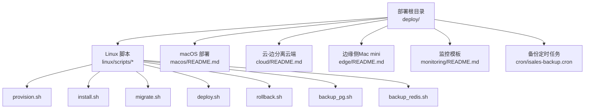
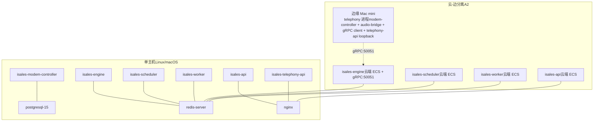
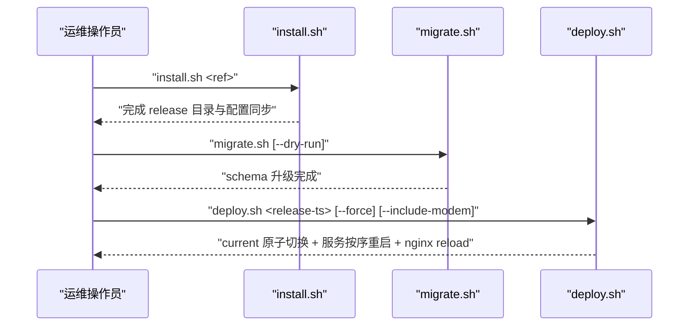
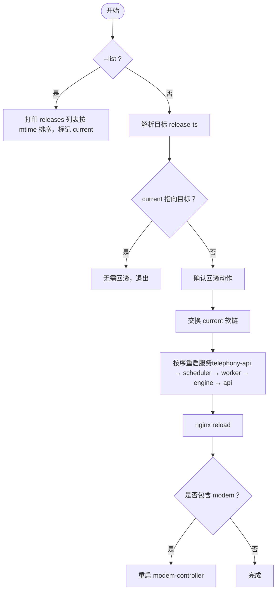
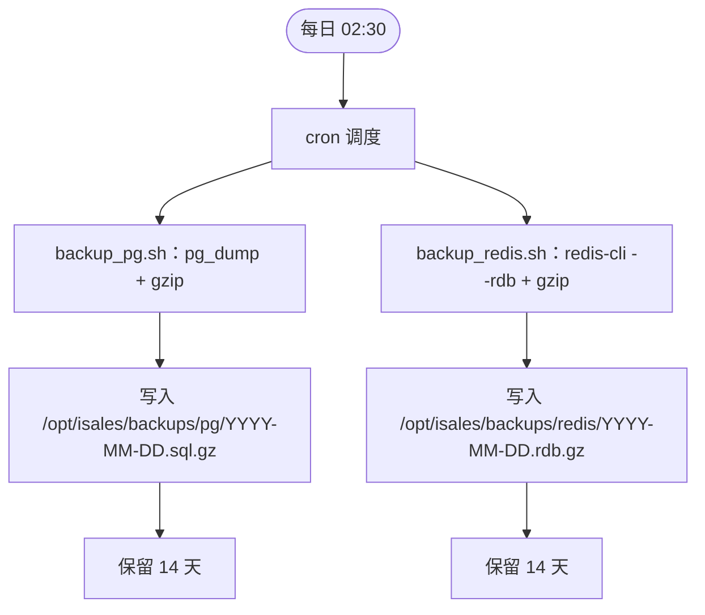
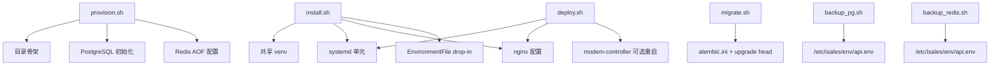

# 运维操作手册

<cite>
**本文引用的文件**
- [deploy/README.md](file://deploy/README.md)
- [deploy/RUNBOOK.md](file://deploy/RUNBOOK.md)
- [deploy/cloud/README.md](file://deploy/cloud/README.md)
- [deploy/edge/README.md](file://deploy/edge/README.md)
- [deploy/macos/README.md](file://deploy/macos/README.md)
- [deploy/linux/scripts/install.sh](file://deploy/linux/scripts/install.sh)
- [deploy/linux/scripts/deploy.sh](file://deploy/linux/scripts/deploy.sh)
- [deploy/linux/scripts/migrate.sh](file://deploy/linux/scripts/migrate.sh)
- [deploy/linux/scripts/rollback.sh](file://deploy/linux/scripts/rollback.sh)
- [deploy/linux/scripts/provision.sh](file://deploy/linux/scripts/provision.sh)
- [deploy/linux/scripts/backup_pg.sh](file://deploy/linux/scripts/backup_pg.sh)
- [deploy/linux/scripts/backup_redis.sh](file://deploy/linux/scripts/backup_redis.sh)
- [deploy/cron/isales-backup.cron](file://deploy/cron/isales-backup.cron)
- [deploy/monitoring/README.md](file://deploy/monitoring/README.md)
- [deploy/cloud/monitoring/prometheus.yml.example](file://deploy/cloud/monitoring/prometheus.yml.example)
</cite>

## 目录
1. [简介](#简介)
2. [项目结构](#项目结构)
3. [核心组件](#核心组件)
4. [架构总览](#架构总览)
5. [详细组件分析](#详细组件分析)
6. [依赖关系分析](#依赖关系分析)
7. [性能考量](#性能考量)
8. [故障排查指南](#故障排查指南)
9. [结论](#结论)
10. [附录](#附录)

## 简介
本手册面向 iSales v1 生产环境的运维工程师，覆盖发版部署、回滚恢复、备份策略、监控配置、最佳实践、故障排查与应急响应流程。系统支持两类单主机部署模型：Linux + systemd 与 macOS 14+ + launchd；同时提供云-边分离（A2）部署形态的云端侧配置与监控模板。手册结合仓库内脚本与文档，给出可操作的步骤、自动化工具与检查清单。

## 项目结构
- 部署与运维脚本集中在 deploy 目录，按平台与拓扑拆分：
  - linux/scripts：Linux systemd 部署流水线（provision/install/migrate/deploy/rollback/backup）
  - macos/：macOS launchd 平台的平行实现
  - cloud/：云-边分离形态的云端侧 systemd、nginx、env、监控模板
  - edge/：云-边分离形态的边缘侧（Mac mini）部署说明
  - monitoring/：Prometheus/Grafana 监控模板
  - cron/：每日备份定时任务
- 文档与运行手册：
  - deploy/README.md：总体拓扑与目录骨架
  - deploy/RUNBOOK.md：首启、发版、回滚、备份恢复、故障排查、预上线硬性门禁
  - deploy/cloud/README.md：云-边分离云端拓扑与要求
  - deploy/edge/README.md：边缘侧拓扑与要求
  - deploy/macos/README.md：macOS 部署差异速查与注意事项



图表来源
- [deploy/README.md:12-112](file://deploy/README.md#L12-L112)
- [deploy/cloud/README.md:10-118](file://deploy/cloud/README.md#L10-L118)
- [deploy/edge/README.md:10-99](file://deploy/edge/README.md#L10-L99)
- [deploy/macos/README.md:7-98](file://deploy/macos/README.md#L7-L98)

章节来源
- [deploy/README.md:12-112](file://deploy/README.md#L12-L112)
- [deploy/RUNBOOK.md:17-394](file://deploy/RUNBOOK.md#L17-L394)

## 核心组件
- 主机准备与依赖
  - Linux：Ubuntu 22.04 amd64，Python 3.12/3.12-venv，Node.js ≥20，系统包 postgresql-15、redis-server、nginx、git、pkg-config、libudev-dev、libasound2-dev；系统用户 isales:isales（无 shell）
  - macOS：macOS 14+ Apple Silicon，Homebrew，默认路径 /opt/homebrew，Python@3.12、Node@20，brew 服务 postgresql@16、redis、nginx
- 目录骨架与环境
  - /opt/isales/releases/<ts>/：每次 install.sh 落盘的新版本目录
  - /opt/isales/current：原子软链指向当前版本
  - /opt/isales/backups/{pg,redis}：每日备份输出
  - /etc/isales/env/*.env：集中化环境文件（0640 root:isales）
- 服务与系统服务
  - Linux systemd：isales-api、isales-engine、isales-scheduler、isales-worker、isales-telephony-api、isales-modem-controller；系统服务 postgresql-15、redis-server、nginx
  - macOS launchd：com.isales.api、com.isales.engine、…、com.isales.backup；brew 服务 postgresql@16、redis、nginx

章节来源
- [deploy/README.md:51-68](file://deploy/README.md#L51-L68)
- [deploy/macos/README.md:34-46](file://deploy/macos/README.md#L34-L46)

## 架构总览
- 单主机（Linux/单机 macOS）：7 个服务进程 + 系统服务（PG/Redis/Nginx），目录骨架统一，环境集中化
- 云-边分离（A2）：云端 ECS（api/engine/scheduler/worker + web nginx），边缘 Mac mini（telephony 进程内含 modem-controller + audio-bridge + gRPC client + telephony-api loopback），边缘不暴露公网端口



图表来源
- [deploy/README.md:14-49](file://deploy/README.md#L14-L49)
- [deploy/cloud/README.md:10-53](file://deploy/cloud/README.md#L10-L53)
- [deploy/edge/README.md:10-40](file://deploy/edge/README.md#L10-L40)

## 详细组件分析

### 发版部署流水线（Linux）
- 流水线步骤
  - provision.sh：apt 包、isales 用户、目录骨架、Redis AOF、PostgreSQL 初始化与随机密钥注入
  - install.sh：克隆/更新 7 个仓库 → 创建共享 venv → 构建 isales-web → 同步 systemd 单元与 nginx 配置 → 写入 EnvironmentFile drop-in → 安装备份 cron
  - migrate.sh：在 current 上执行 alembic upgrade head（可 dry-run 查看历史）
  - deploy.sh：低峰窗口校验 → 原子切换 current → 按序重启服务（telephony-api → scheduler → worker → engine → api）→ nginx reload → 可选重启 modem-controller
- 低峰窗口
  - 默认 22:00–08:00（可通过环境变量调整）；engine 重启会丢弃活跃通话，非低峰需加 --force



图表来源
- [deploy/linux/scripts/install.sh:259-275](file://deploy/linux/scripts/install.sh#L259-L275)
- [deploy/linux/scripts/migrate.sh:13-61](file://deploy/linux/scripts/migrate.sh#L13-L61)
- [deploy/linux/scripts/deploy.sh:10-139](file://deploy/linux/scripts/deploy.sh#L10-L139)

章节来源
- [deploy/linux/scripts/install.sh:15-275](file://deploy/linux/scripts/install.sh#L15-L275)
- [deploy/linux/scripts/migrate.sh:9-61](file://deploy/linux/scripts/migrate.sh#L9-L61)
- [deploy/linux/scripts/deploy.sh:15-139](file://deploy/linux/scripts/deploy.sh#L15-L139)

### 回滚恢复（Linux）
- rollback.sh：交换 current 软链 → 按相同顺序重启服务 → 可选重启 modem-controller
- 注意：默认不触碰数据库 schema；若旧版本需要更老的 alembic 版本，参考 RUNBOOK 手动降级并做好 pg_dump 备份
- 可列出历史 release：--list，显示 mtime 排序与当前标记



图表来源
- [deploy/linux/scripts/rollback.sh:1-114](file://deploy/linux/scripts/rollback.sh#L1-L114)

章节来源
- [deploy/linux/scripts/rollback.sh:1-114](file://deploy/linux/scripts/rollback.sh#L1-L114)
- [deploy/RUNBOOK.md:84-115](file://deploy/RUNBOOK.md#L84-L115)

### 备份策略与恢复演练
- 备份类型与位置
  - PostgreSQL：/opt/isales/backups/pg/YYYY-MM-DD.sql.gz（pg_dump custom 格式，gzip 压缩）
  - Redis：/opt/isales/backups/redis/YYYY-MM-DD.rdb.gz（redis-cli --rdb 远程拉取，gzip 压缩）
  - 保留期：默认 14 天
- 触发方式
  - Linux：cron（/etc/cron.d/isales-backup）每日 02:30 触发 backup_pg.sh 与 backup_redis.sh
- 恢复演练（PG/Redis）
  - PG：新建测试库 → pg_restore 恢复 → 验证 alembic_version 与关键表行数
  - Redis：停止 redis-server → 替换 dump.rdb → 启动 → 验证 dbsize/keys



图表来源
- [deploy/cron/isales-backup.cron:1-14](file://deploy/cron/isales-backup.cron#L1-L14)
- [deploy/linux/scripts/backup_pg.sh:1-50](file://deploy/linux/scripts/backup_pg.sh#L1-L50)
- [deploy/linux/scripts/backup_redis.sh:1-61](file://deploy/linux/scripts/backup_redis.sh#L1-L61)

章节来源
- [deploy/RUNBOOK.md:118-160](file://deploy/RUNBOOK.md#L118-L160)
- [deploy/linux/scripts/backup_pg.sh:1-50](file://deploy/linux/scripts/backup_pg.sh#L1-L50)
- [deploy/linux/scripts/backup_redis.sh:1-61](file://deploy/linux/scripts/backup_redis.sh#L1-L61)
- [deploy/cron/isales-backup.cron:1-14](file://deploy/cron/isales-backup.cron#L1-L14)

### 监控与告警配置
- 模板与建议
  - Prometheus：提供示例配置（job 名称、端口、TODO 注释），operator 将其复制到自身 Prometheus 主机并重启
  - Grafana：提供概览仪表盘 JSON，通过 UI 导入
  - 告警规则：baseline 告警（拨号队列积压、设备标记速率、回调失败率、PG 连接压力）
- 云-边分离监控要点
  - 云端 ECS：engine 提供云-边流指标（stream 数量、心跳时间、ARTC 会话数等）
  - 云-边网络：gRPC:50051 仅内网访问，边缘不暴露公网端口

```mermaid
graph LR
P["Prometheus"] <- --> J1["job: isales-api"]
P <- --> J2["job: isales-engine"]
P <- --> J3["job: isales-scheduler"]
P <- --> J4["job: isales-worker"]
P <- --> N["job: node_exporter"]
P <- --> PG["job: postgres_exporter (可选)"]
P <- --> RD["job: redis_exporter (可选)"]
G["Grafana"] --> D["isales-overview.json 仪表盘"]
```

图表来源
- [deploy/monitoring/README.md:10-65](file://deploy/monitoring/README.md#L10-L65)
- [deploy/cloud/monitoring/prometheus.yml.example:17-77](file://deploy/cloud/monitoring/prometheus.yml.example#L17-L77)

章节来源
- [deploy/monitoring/README.md:10-65](file://deploy/monitoring/README.md#L10-L65)
- [deploy/cloud/monitoring/prometheus.yml.example:17-77](file://deploy/cloud/monitoring/prometheus.yml.example#L17-L77)

### macOS 部署（Apple Silicon）
- 差异点
  - 服务管理：launchctl（system/gui）替代 systemctl
  - 包管理：brew（/opt/homebrew）替代 apt
  - 环境注入：install.sh 将 /etc/isales/env/<svc>.env 内联到 plist 的 EnvironmentVariables
  - 备份：com.isales.backup（StartCalendarInterval 02:30）替代 cron
  - USB/音频：pyserial/list_ports 轮询 + diff，Core Audio（sounddevice/PortAudio）
- 预发布硬性门禁（macOS 特有）
  - provision.sh 二次运行幂等
  - plist 内联 env 与 /etc/isales/env/<svc>.env 完全一致
  - 真实 USB modem 注册成功
  - 至少 3 次外呼端到端验证
  - Core Audio p95 延迟 ≤200ms
  - 至少一次完整 install → deploy → rollback → deploy 循环

章节来源
- [deploy/macos/README.md:71-98](file://deploy/macos/README.md#L71-L98)
- [deploy/RUNBOOK.md:220-394](file://deploy/RUNBOOK.md#L220-L394)

### 云-边分离（A2）云端侧
- 拓扑与端口
  - isales-api/engine/scheduler/worker：systemd 单元，端口 8000/8002/8003/8004
  - nginx：443 → api/web，50051 → engine gRPC（TLS 终结 + bearer 校验）
  - 托管中间件：RDS PostgreSQL 16、Redis Tair/标准 Redis、OSS、阿里 RTC PaaS
- DingRTC SDK：OS 级 SDK 解压至 /opt/isales/vendor/，engine 注入
- 监控：提供云-边专属指标（engine/stream/ARTC）

章节来源
- [deploy/cloud/README.md:10-118](file://deploy/cloud/README.md#L10-L118)
- [deploy/cloud/monitoring/prometheus.yml.example:27-52](file://deploy/cloud/monitoring/prometheus.yml.example#L27-L52)

## 依赖关系分析
- 脚本耦合
  - install.sh 依赖 /etc/isales/env/*.env 与各服务仓库；生成 systemd 单元与 nginx 配置
  - deploy.sh 依赖 install.sh 产出的 current 与 systemd 单元；按序重启服务
  - migrate.sh 依赖 current/venv 与 alembic.ini；读取 /etc/isales/env/api.env
  - provision.sh 依赖 _lib.sh 的常量与函数；幂等创建用户、目录、PG/Redis 初始化
  - 备份脚本依赖 /etc/isales/env/*.env 中的连接信息
- 外部依赖
  - Linux：apt 包、systemd、journald、cron
  - macOS：brew、launchd、brew services、Unified Logging
  - 云-边：阿里云 RDS/Redis/OSS、阿里 RTC PaaS、gRPC:50051



图表来源
- [deploy/linux/scripts/provision.sh:13-224](file://deploy/linux/scripts/provision.sh#L13-L224)
- [deploy/linux/scripts/install.sh:15-275](file://deploy/linux/scripts/install.sh#L15-L275)
- [deploy/linux/scripts/migrate.sh:9-61](file://deploy/linux/scripts/migrate.sh#L9-L61)
- [deploy/linux/scripts/deploy.sh:10-139](file://deploy/linux/scripts/deploy.sh#L10-L139)
- [deploy/linux/scripts/backup_pg.sh:1-50](file://deploy/linux/scripts/backup_pg.sh#L1-L50)
- [deploy/linux/scripts/backup_redis.sh:1-61](file://deploy/linux/scripts/backup_redis.sh#L1-L61)

章节来源
- [deploy/linux/scripts/provision.sh:13-224](file://deploy/linux/scripts/provision.sh#L13-L224)
- [deploy/linux/scripts/install.sh:15-275](file://deploy/linux/scripts/install.sh#L15-L275)
- [deploy/linux/scripts/migrate.sh:9-61](file://deploy/linux/scripts/migrate.sh#L9-L61)
- [deploy/linux/scripts/deploy.sh:10-139](file://deploy/linux/scripts/deploy.sh#L10-L139)
- [deploy/linux/scripts/backup_pg.sh:1-50](file://deploy/linux/scripts/backup_pg.sh#L1-L50)
- [deploy/linux/scripts/backup_redis.sh:1-61](file://deploy/linux/scripts/backup_redis.sh#L1-L61)

## 性能考量
- 低峰窗口发版
  - engine restart 会丢弃活跃通话，应在 22:00–08:00 之间进行；非低峰需明确 --force
- Redis 持久化与内存
  - Redis 使用 AOF（appendonly yes），必要时调整 maxmemory 与淘汰策略
- 队列深度与并发
  - 关注 engine:dial 队列长度；异常堆积时检查 engine 是否存活
- 监控指标
  - 云-边分离：engine 的云-边流指标、ARTC 会话数、管道阶段耗时等
  - 基线告警：拨号队列积压、设备标记速率、回调失败率、PG 连接压力

章节来源
- [deploy/linux/scripts/deploy.sh:15-16](file://deploy/linux/scripts/deploy.sh#L15-L16)
- [deploy/RUNBOOK.md:163-196](file://deploy/RUNBOOK.md#L163-L196)
- [deploy/cloud/monitoring/prometheus.yml.example:27-52](file://deploy/cloud/monitoring/prometheus.yml.example#L27-L52)

## 故障排查指南
- 常见症状与处置
  - psql 连接被拒：检查 postgresql 状态与磁盘空间，查看 journalctl -u postgresql
  - Redis OOM：查看内存信息，调整 maxmemory 或淘汰策略
  - modem-controller 设备断连：udev 监听 USB 事件，重插 USB，查看服务日志
  - modem-controller 立即退出且提示需要串口：核对 /etc/isales/env/modem-controller.env，设置 ISALES_MODEM_SERIAL_PATH，避免生产开启模拟模式
  - engine:dial 队列 > 500：检查 engine 是否存活，必要时重启
  - worker 卡住：检查 celery active 任务，确认 engine:worker:call-ended 队列
  - nginx 502：直连健康检查 /api/healthz，定位 api 服务状态
  - 备份 cron 未运行：检查 cron 状态与 /etc/cron.d/isales-backup 权限
- 有用的命令
  - 一键查看所有 iSales 服务状态
  - 最近 5 分钟错误日志
  - 活跃通话数与队列深度汇总

章节来源
- [deploy/RUNBOOK.md:163-196](file://deploy/RUNBOOK.md#L163-L196)

## 结论
本手册基于仓库内脚本与文档，给出了 iSales v1 生产环境的标准化运维流程：以 provision/install/migrate/deploy/rollback/backup 为主线，结合监控模板与基线告警，辅以预发布硬性门禁与故障排查清单，确保变更可控、可观测、可恢复。对于云-边分离形态，提供云端 ECS 与边缘 Mac mini 的差异化部署与监控指引。

## 附录

### 运维检查清单（预上线）
- Linux/macOS
  - 首次部署完成
  - 备份恢复演练：PG（版本匹配 + 表行数）、Redis（dbsize>0）
  - 至少一次完整 install → deploy → rollback → deploy 循环
  - 监控：prometheus.yml 已部署，至少 2/4 告警具备有意义阈值
  - 冒烟测试：导入 10 条线索测试，确认 call_record/transcript/worker 回调日志/lead 状态推进
  - 值班轮值：明确告警联系人与通道
- macOS 特有
  - provision.sh 二次运行幂等
  - install.sh 生成 plist 的 EnvironmentVariables 与 /etc/isales/env/<svc>.env 完全一致
  - 真实 USB modem 注册成功
  - 至少 3 次外呼端到端验证
  - Core Audio p95 延迟 ≤200ms
  - launchd 备份计划可产生有效备份（gunzip -t）

章节来源
- [deploy/RUNBOOK.md:200-217](file://deploy/RUNBOOK.md#L200-L217)
- [deploy/RUNBOOK.md:383-394](file://deploy/RUNBOOK.md#L383-L394)