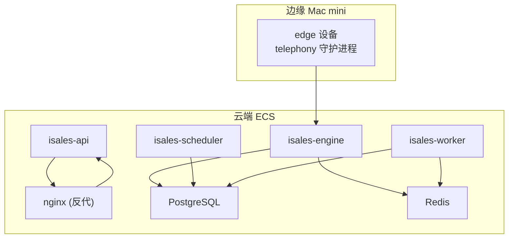
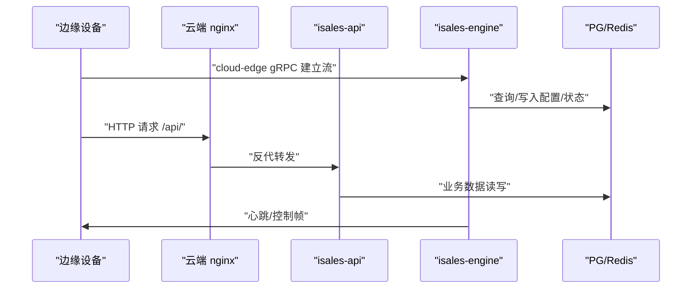
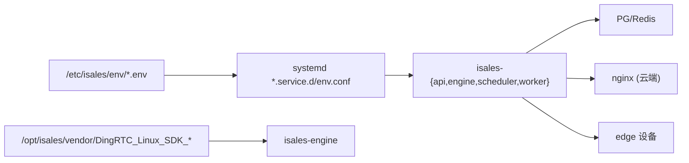

# 运维检查清单

<cite>
**本文引用的文件**
- [deploy/README.md](file://deploy/README.md)
- [deploy/RUNBOOK.md](file://deploy/RUNBOOK.md)
- [deploy/RUNBOOK-cloud.md](file://deploy/RUNBOOK-cloud.md)
- [deploy/cloud/README.md](file://deploy/cloud/README.md)
- [deploy/cloud/STATE.md](file://deploy/cloud/STATE.md)
- [deploy/cloud/monitoring/README.md](file://deploy/cloud/monitoring/README.md)
- [deploy/cloud/monitoring/alert_rules.yml.example](file://deploy/cloud/monitoring/alert_rules.yml.example)
- [deploy/cloud/monitoring/prometheus.yml.example](file://deploy/cloud/monitoring/prometheus.yml.example)
- [deploy/cloud/scripts/install.sh](file://deploy/cloud/scripts/install.sh)
- [deploy/cloud/scripts/rollback.sh](file://deploy/cloud/scripts/rollback.sh)
- [deploy/cloud/scripts/install-dingrtc-sdk.sh](file://deploy/cloud/scripts/install-dingrtc-sdk.sh)
- [deploy/cron/isales-backup.cron](file://deploy/cron/isales-backup.cron)
- [deploy/linux/scripts/backup_pg.sh](file://deploy/linux/scripts/backup_pg.sh)
- [deploy/linux/scripts/backup_redis.sh](file://deploy/linux/scripts/backup_redis.sh)
- [deploy/linux/scripts/check_env_consistency.py](file://deploy/linux/scripts/check_env_consistency.py)
- [deploy/RUNBOOK-edge.md](file://deploy/RUNBOOK-edge.md)
</cite>

## 目录
1. [简介](#简介)
2. [项目结构](#项目结构)
3. [核心组件](#核心组件)
4. [架构总览](#架构总览)
5. [详细组件分析](#详细组件分析)
6. [依赖关系分析](#依赖关系分析)
7. [性能考量](#性能考量)
8. [故障排查指南](#故障排查指南)
9. [结论](#结论)
10. [附录](#附录)

## 简介
本指南面向 iSales 平台的运维工程师，提供一套完整的运维检查清单与执行标准，覆盖服务健康检查、系统资源监控、配置验证、发布前硬性检查、预上线检查、巡检频率与记录、紧急情况快速检查流程与应急响应等内容。文档以仓库内的部署与运维脚本、Runbook、监控模板为依据，确保检查项与实际代码实现一致，便于一线工程师快速落地。

## 项目结构
iSales 提供两种部署形态：
- 单主机形态（Linux + systemd，主线）
- 云-边分离形态（A2），云端 5 服务 + 边缘 Mac mini

云端部署目录包含 systemd 单元、nginx 配置、环境变量模板、安装/回滚/监控脚本等；边缘侧提供设备激活、令牌签发、离线缓冲排障等流程。

图示来源
- [deploy/cloud/README.md:10-52](file://deploy/cloud/README.md#L10-52)
- [deploy/README.md:12-48](file://deploy/README.md#L12-48)

章节来源
- [deploy/cloud/README.md:1-118](file://deploy/cloud/README.md#L1-L118)
- [deploy/README.md:1-112](file://deploy/README.md#L1-L112)

## 核心组件
- 服务进程与职责
  - isales-api：FastAPI HTTP + WebSocket，对外提供 Web 管理端与 Boss 控制台后端
  - isales-engine：实时通话引擎，承载 cloud-edge gRPC 服务端与 RTC 集成
  - isales-scheduler：线索调度器，负责外呼派发
  - isales-worker：异步后处理，负责通话摘要与回调
  - nginx：反向代理，将 /api/ 与 /ws/ 转发至 isales-api
- 数据与中间件
  - PostgreSQL（云端内置，或托管 RDS）
  - Redis（云端内置，或托管 Tair）
  - DingRTC Linux SDK（OS 级 vendor，引擎绑定）
- 配置与环境
  - /etc/isales/env/ 下集中化 EnvironmentFile，各服务 systemd drop-in 指向对应 env 文件
  - 云-边分离形态下，engine gRPC 绑定公网地址，需配合安全组与网络策略

章节来源
- [deploy/cloud/README.md:10-52](file://deploy/cloud/README.md#L10-52)
- [deploy/README.md:12-48](file://deploy/README.md#L12-48)
- [deploy/cloud/STATE.md:129-242](file://deploy/cloud/STATE.md#L129-L242)

## 架构总览
云-边分离架构下，边缘设备通过公网 gRPC 与云端引擎建立双向流，引擎负责 RTC 房间接入与 AI 对话管线，调度器与工作器分别承担线索派发与后处理。nginx 在云端提供 Web SPA 与 API 反代。

图示来源
- [deploy/RUNBOOK-cloud.md:325-393](file://deploy/RUNBOOK-cloud.md#L325-L393)
- [deploy/cloud/README.md:20-28](file://deploy/cloud/README.md#L20-28)

章节来源
- [deploy/RUNBOOK-cloud.md:1-599](file://deploy/RUNBOOK-cloud.md#L1-L599)
- [deploy/cloud/README.md:1-118](file://deploy/cloud/README.md#L1-L118)

## 详细组件分析

### 发布前硬性检查清单（Pre-launch Hard Gates）
发布前必须通过的硬性检查，确保生产环境具备基本的恢复能力与功能验证能力：

- 首次部署流程已完成（Linux 主线）
- 备份恢复演练通过（PG 恢复校验 alembic 版本与 campaign 数量匹配；Redis 恢复后 dbsize > 0）
- 至少完成一次完整的 install → deploy → rollback → deploy 流程
- 监控联系已建立（Prometheus 配置已部署；至少 2/4 告警有意义）
- 冒烟测试：导入 10 条线索的测试场景，验证 call_record 行与 transcript 填充、worker callback_log 成功尝试、lead.status 推进
- 值班轮值建立：明确 on-call 联系渠道与响应流程

章节来源
- [deploy/RUNBOOK.md:200-216](file://deploy/RUNBOOK.md#L200-L216)

### 预上线检查清单与通过条件
预上线阶段的检查重点与通过标准：

- 环境一致性检查
  - 使用环境变量一致性检查脚本，确保 env.example 与各服务 README 声明的变量集合一致（允许少量平台约定变量）
- 配置验证
  - 云端 engine gRPC 绑定地址、JWT 密钥、RTC AppId/AppKey、数据库/Redis URL、Fernet 主密钥等关键变量核对
- 服务可用性验证
  - systemctl 状态检查（api/engine/scheduler/worker/nginx）
  - 健康检查：curl -fsS https://cloud.isales.example.com/api/health
  - 引擎 gRPC 监听状态：journalctl -u isales-engine grep "grpc.*listening"
- 前端独立发版验证
  - SPA 静态文件替换后，nginx graceful reload，验证页面可访问

章节来源
- [deploy/RUNBOOK.md:163-196](file://deploy/RUNBOOK.md#L163-L196)
- [deploy/RUNBOOK-cloud.md:123-172](file://deploy/RUNBOOK-cloud.md#L123-L172)
- [deploy/RUNBOOK-cloud.md:247-271](file://deploy/RUNBOOK-cloud.md#L247-L271)
- [deploy/linux/scripts/check_env_consistency.py:1-161](file://deploy/linux/scripts/check_env_consistency.py#L1-L161)

### 运维巡检频率与检查重点
- 日常巡检
  - 服务状态：systemctl status isales-{api,engine,scheduler,worker,telephony-api}（单主机）或 isales-{api,engine,scheduler,worker}（云端）
  - 错误日志：journalctl --since "5 min ago" -p err -u "isales-*"
  - 活跃通话数：redis-cli get isales:concurrency:active
  - 队列深度：redis-cli --scan --pattern "engine:*" | xargs -I% redis-cli llen %
- 备份巡检
  - 备份计划：每日 02:30，PG 与 Redis 分别生成 YYYY-MM-DD.sql.gz 与 YYYY-MM-DD.rdb.gz
  - 备份保留：默认 14 天
  - 验证：gunzip -t 校验压缩包有效
- 监控巡检
  - Prometheus/Grafana 面板与告警规则（边缘离线、重连风暴、TTS 推流反压、引擎首 TTS 延迟预算、回调失败率、PG 连接数）

章节来源
- [deploy/RUNBOOK.md:180-196](file://deploy/RUNBOOK.md#L180-L196)
- [deploy/cron/isales-backup.cron:1-14](file://deploy/cron/isales-backup.cron#L1-L14)
- [deploy/linux/scripts/backup_pg.sh:1-50](file://deploy/linux/scripts/backup_pg.sh#L1-L50)
- [deploy/linux/scripts/backup_redis.sh:1-61](file://deploy/linux/scripts/backup_redis.sh#L1-L61)
- [deploy/cloud/monitoring/README.md:1-37](file://deploy/cloud/monitoring/README.md#L1-L37)
- [deploy/cloud/monitoring/alert_rules.yml.example:1-116](file://deploy/cloud/monitoring/alert_rules.yml.example#L1-L116)
- [deploy/cloud/monitoring/prometheus.yml.example:1-77](file://deploy/cloud/monitoring/prometheus.yml.example#L1-L77)

### 紧急情况快速检查流程与应急响应
- 通用应急步骤
  - 服务状态：systemctl is-active isales-{api,engine,scheduler,worker}（单主机）或 isales-{api,engine,scheduler,worker}（云端）
  - 关键日志：journalctl -u isales-engine -n 50 | grep -i "grpc.*listening"
  - 端口监听：ss -tln | grep -E ":50051|:8000"
  - nginx：nginx -t；systemctl reload nginx
- 云-边 gRPC 连通性问题
  - 检查安全组/SLB idle-timeout 配置，确保 HTTP/2 keepalive 参数满足要求
  - 使用 grpcurl 测试鉴权 token 下的 list 调用
  - 边缘侧 mtr 检查 WAN 抖动
- RTC 房间问题
  - 通过 ECS 上的 PCM 监听脚本验证 SDK 集成是否正常
- 回滚与 schema 例外
  - 仅切换 current 软链 + 重启 4 云服务 + reload nginx（schema 不动）
  - 如确需 schema 回退，参考 RUNBOOK-cloud 的 rollback-schema 例外流程

章节来源
- [deploy/RUNBOOK.md:163-196](file://deploy/RUNBOOK.md#L163-L196)
- [deploy/RUNBOOK-cloud.md:325-393](file://deploy/RUNBOOK-cloud.md#L325-L393)
- [deploy/RUNBOOK-cloud.md:584-599](file://deploy/RUNBOOK-cloud.md#L584-L599)
- [deploy/cloud/scripts/rollback.sh:1-114](file://deploy/cloud/scripts/rollback.sh#L1-L114)

### 配置验证与环境一致性
- 环境变量一致性检查
  - 自动扫描 deploy/env/*.env.example 与各服务 README 的变量声明，确保双方匹配（允许少量平台约定变量）
- 云端关键变量核对
  - JWT_SECRET、ISALES_DATABASE_URL、ISALES_ENGINE_CLOUD_EDGE_GRPC_BIND、RTC AppId/AppKey、Fernet 主密钥等
- 边缘设备令牌
  - 云端签发静态长 token，边缘写入 edge.env 并重启 LaunchAgent

章节来源
- [deploy/linux/scripts/check_env_consistency.py:1-161](file://deploy/linux/scripts/check_env_consistency.py#L1-L161)
- [deploy/RUNBOOK-cloud.md:139-142](file://deploy/RUNBOOK-cloud.md#L139-L142)
- [deploy/RUNBOOK-edge.md:68-106](file://deploy/RUNBOOK-edge.md#L68-L106)

### 备份恢复演练与验证
- PG 备份恢复
  - 通过 gunzip + pg_restore 恢复到独立实例，验证 alembic_version 与关键表行数
- Redis 备份恢复
  - 停止 redis-server，替换 dump.rdb，启动后验证 dbsize 与关键键空间
- 备份计划与保留
  - 每日 02:30 自动触发，保留 14 天；日志标签 isales-backup

章节来源
- [deploy/RUNBOOK.md:118-159](file://deploy/RUNBOOK.md#L118-L159)
- [deploy/RUNBOOK-cloud.md:300-323](file://deploy/RUNBOOK-cloud.md#L300-L323)
- [deploy/cron/isales-backup.cron:1-14](file://deploy/cron/isales-backup.cron#L1-L14)
- [deploy/linux/scripts/backup_pg.sh:1-50](file://deploy/linux/scripts/backup_pg.sh#L1-L50)
- [deploy/linux/scripts/backup_redis.sh:1-61](file://deploy/linux/scripts/backup_redis.sh#L1-L61)

### 监控与告警
- 指标范围
  - 云端专属：cloud-edge 流数量、心跳间隔、断线次数、ARTC 会话数、TTS 推流反压、引擎管线首 TTS 分位
  - 边缘看护：设备离线次数、硬件告警
- 告警阈值（示例）
  - 边缘离线：120s 无心跳
  - 重连风暴：5 分钟内断线 > 5 次
  - TTS 推流反压：30s 窗口 > 3 次
  - 首 TTS 延迟预算：P95 > 800ms
  - 回调失败率：15m > 20%
  - PG 连接数：> max_connections × 0.8

章节来源
- [deploy/cloud/monitoring/README.md:1-37](file://deploy/cloud/monitoring/README.md#L1-L37)
- [deploy/cloud/monitoring/alert_rules.yml.example:1-116](file://deploy/cloud/monitoring/alert_rules.yml.example#L1-L116)
- [deploy/cloud/monitoring/prometheus.yml.example:1-77](file://deploy/cloud/monitoring/prometheus.yml.example#L1-L77)

### 发布与回滚流程
- 常规发版
  - install 新版本（不动 current）→ 迁移（如有）→ activate（切换 current + 重启）
  - 云端：仅重启 4 云服务 + reload nginx；边缘自动重连
- 回滚
  - 切换 current 软链 + 重启顺序（scheduler → worker → api → engine）+ reload nginx
  - schema 不动；如确需回退 schema，参考 RUNBOOK-cloud 的例外流程

章节来源
- [deploy/RUNBOOK-cloud.md:230-296](file://deploy/RUNBOOK-cloud.md#L230-L296)
- [deploy/cloud/scripts/install.sh:68-94](file://deploy/cloud/scripts/install.sh#L68-L94)
- [deploy/cloud/scripts/rollback.sh:96-114](file://deploy/cloud/scripts/rollback.sh#L96-L114)

## 依赖关系分析
- 服务耦合
  - 重启顺序遵循依赖关系：engine 作为边缘入口，最后重启以减少流中断
- 外部依赖
  - DingRTC SDK（OS 级 vendor，非 release-pinned），pybind binding 由 install.sh 构建到 release venv
  - nginx 仅在云端形态下提供 Web SPA 反代
- 配置耦合
  - /etc/isales/env/*.env 与 systemd drop-in 的 EnvironmentFile 关联
  - 云-边 gRPC 鉴权依赖 JWT_SECRET 一致

图示来源
- [deploy/cloud/README.md:40-52](file://deploy/cloud/README.md#L40-L52)
- [deploy/cloud/scripts/install.sh:245-278](file://deploy/cloud/scripts/install.sh#L245-L278)
- [deploy/cloud/scripts/install-dingrtc-sdk.sh:1-158](file://deploy/cloud/scripts/install-dingrtc-sdk.sh#L1-L158)

章节来源
- [deploy/cloud/README.md:1-118](file://deploy/cloud/README.md#L1-L118)
- [deploy/cloud/scripts/install.sh:1-300](file://deploy/cloud/scripts/install.sh#L1-L300)

## 性能考量
- 延迟预算
  - 引擎首 TTS P95 预算为 800ms，超限时可考虑降级策略（如降低多角色 PK 并行度）
- 网络稳定性
  - gRPC 长连接需抑制中间网络 idle，确保 HTTP/2 keepalive 参数满足要求
- 数据库连接池
  - 避免连接数接近 max_connections，必要时调整连接池上限

章节来源
- [deploy/cloud/monitoring/alert_rules.yml.example:69-86](file://deploy/cloud/monitoring/alert_rules.yml.example#L69-L86)
- [deploy/RUNBOOK-cloud.md:351-393](file://deploy/RUNBOOK-cloud.md#L351-L393)

## 故障排查指南
- 常见症状与处置
  - 数据库连接拒绝：检查 postgresql 服务与磁盘空间
  - Redis OOM：查看内存信息，调整 maxmemory 或淘汰策略
  - modem-controller 设备断连：检查 udev 事件与串口路径
  - engine dial 队列堆积：检查 engine 是否重启
  - nginx 502：直连 8000 端口验证 api 健康
  - 备份 cron 未运行：检查 cron 状态与日志标签
- 一键命令
  - 全量服务状态概览、最近 5 分钟错误日志、活跃通话数、队列深度

章节来源
- [deploy/RUNBOOK.md:163-196](file://deploy/RUNBOOK.md#L163-L196)
- [deploy/RUNBOOK-cloud.md:584-599](file://deploy/RUNBOOK-cloud.md#L584-L599)

## 结论
本运维检查清单以仓库内的 Runbook、脚本与监控模板为依据，覆盖发布前硬性检查、预上线验证、日常巡检、紧急响应与备份恢复演练。建议将检查项纳入自动化巡检脚本，并结合监控告警形成闭环，确保 iSales 在云-边分离形态下的稳定运行。

## 附录

### 检查清单模板（示例）
- 发布前硬性检查
  - [ ] 首次部署流程完成
  - [ ] 备份恢复演练通过（PG/Redis）
  - [ ] 至少一次 install → deploy → rollback → deploy 循环
  - [ ] 监控已部署并至少 2/4 告警生效
  - [ ] 冒烟测试：call_record/transcript/worker callback_log/lead.status 正常推进
  - [ ] 值班轮值建立
- 预上线检查
  - [ ] 环境变量一致性检查通过
  - [ ] 关键变量核对（JWT_SECRET/数据库/Redis/RTC/Fernet）
  - [ ] 服务可用性验证（systemctl/status/curl 健康检查）
  - [ ] 前端独立发版验证（nginx reload 后页面可访问）
- 日常巡检
  - [ ] 服务状态与错误日志
  - [ ] 活跃通话数与队列深度
  - [ ] 备份计划执行与压缩包校验
  - [ ] 监控面板与告警收敛
- 紧急检查
  - [ ] 服务状态与端口监听
  - [ ] 云-边 gRPC 连通性与 keepalive
  - [ ] RTC 房间与 PCM 监听
  - [ ] 回滚与 schema 例外流程准备

### 检查结果记录与持续改进
- 记录格式建议
  - 检查日期、检查项、检查人、发现的问题、处理措施、验证结果、下次检查时间
- 持续改进
  - 将高频问题纳入自动化巡检与告警
  - 定期复盘发布与回滚过程，优化重启顺序与依赖管理
  - 边界条件与极端场景（如大规模断线风暴、RTC 会话泄漏）补充演练