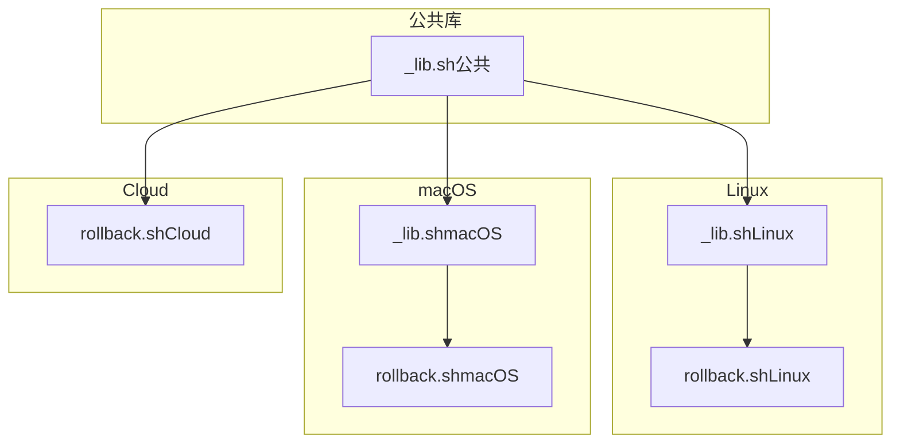
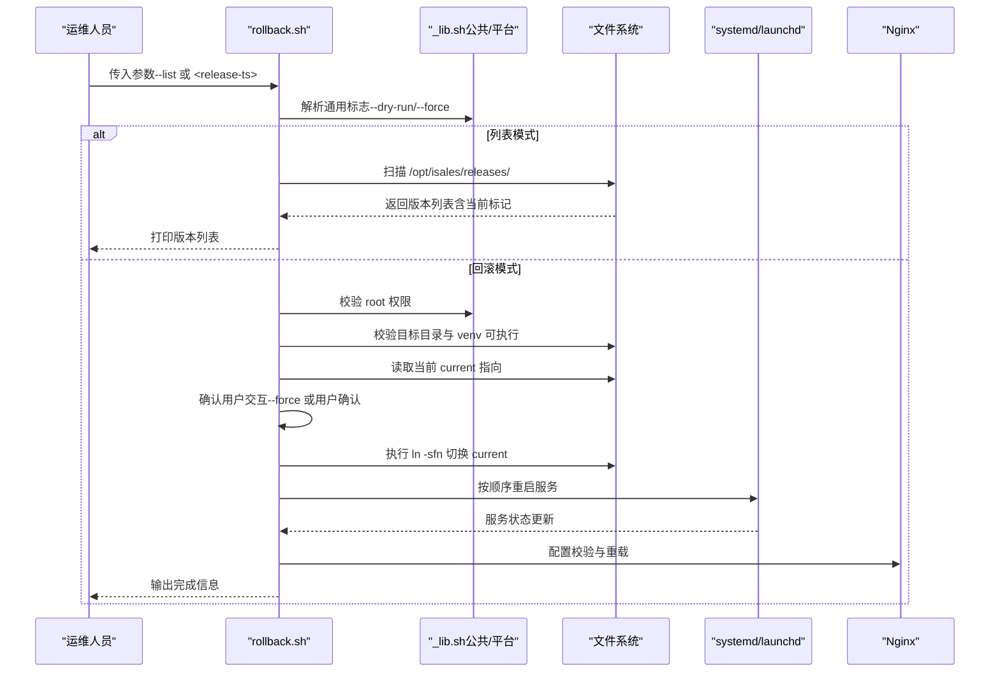
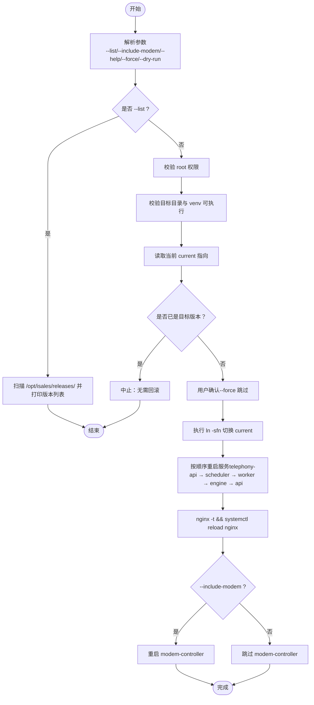
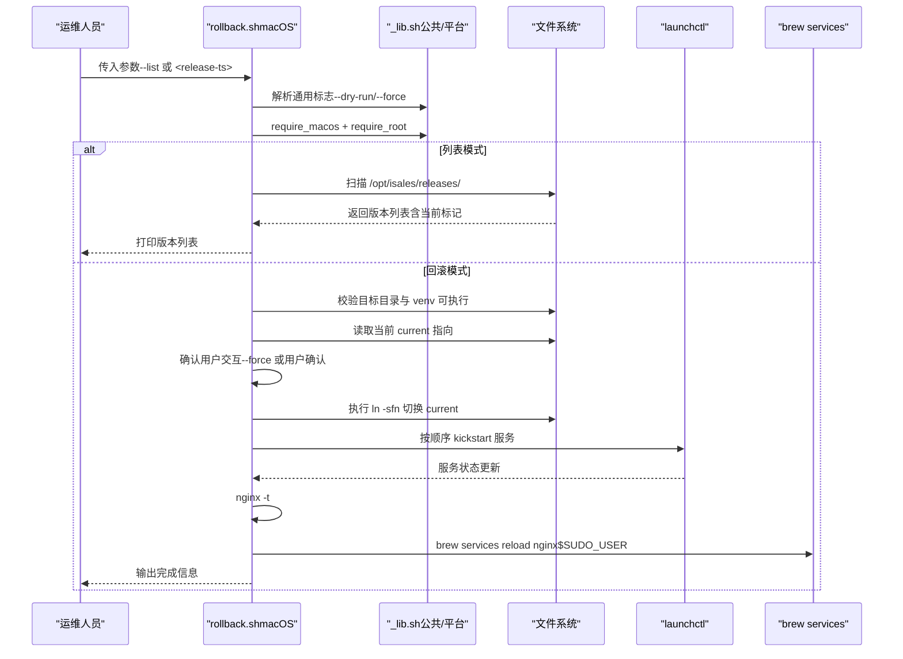
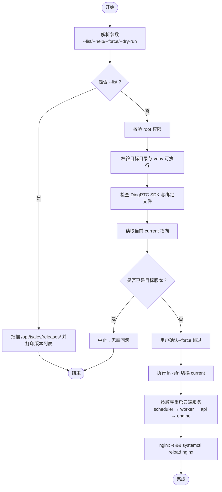
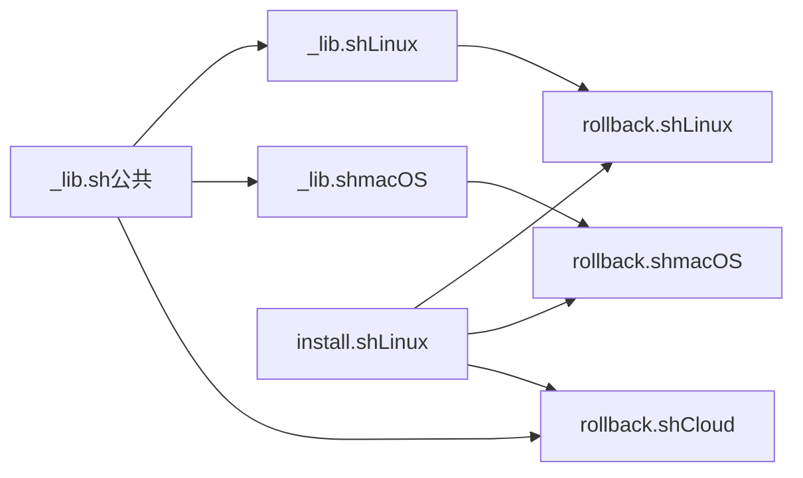

# 回滚程序

<cite>
**本文引用的文件**
- [rollback.sh（Linux）](file://deploy/linux/scripts/rollback.sh)
- [rollback.sh（macOS）](file://deploy/macos/scripts/rollback.sh)
- [rollback.sh（Cloud）](file://deploy/cloud/scripts/rollback.sh)
- [_lib.sh（Linux）](file://deploy/linux/scripts/_lib.sh)
- [_lib.sh（macOS）](file://deploy/macos/scripts/_lib.sh)
- [_lib.sh（公共）](file://deploy/common/_lib.sh)
- [install.sh（Linux）](file://deploy/linux/scripts/install.sh)
- [RUNBOOK.md](file://deploy/RUNBOOK.md)
- [RUNBOOK-cloud.md](file://deploy/RUNBOOK-cloud.md)
- [RUNBOOK-edge.md](file://deploy/RUNBOOK-edge.md)
- [README.md（Cloud）](file://deploy/cloud/README.md)
- [README.md（macOS）](file://deploy/macos/README.md)
- [README.md（Edge）](file://deploy/edge/README.md)
</cite>

## 目录
1. [简介](#简介)
2. [项目结构](#项目结构)
3. [核心组件](#核心组件)
4. [架构总览](#架构总览)
5. [详细组件分析](#详细组件分析)
6. [依赖关系分析](#依赖关系分析)
7. [性能考量](#性能考量)
8. [故障排查指南](#故障排查指南)
9. [结论](#结论)
10. [附录](#附录)

## 简介
本指南面向 iSales 生产运维人员，系统讲解回滚程序的设计与执行流程，覆盖：
- 回滚列表查看、目标版本选择与执行步骤
- 回滚脚本工作原理（符号链接切换、服务重启顺序）
- 数据库模式回滚的危险性与手动降级风险评估
- 为什么回滚不触碰数据库模式，以及向前修复通常比向下回退更安全的原因
- 回滚前的数据备份建议与验证步骤
- Linux 与 macOS 平台差异与注意事项
- 回滚失败的应急处理与回滚后的系统验证方法
- 回滚操作最佳实践与风险控制措施

## 项目结构
回滚能力在三个部署形态中分别实现：
- Linux（systemd）：[rollback.sh（Linux）](file://deploy/linux/scripts/rollback.sh)
- macOS（launchd）：[rollback.sh（macOS）](file://deploy/macos/scripts/rollback.sh)
- Cloud（云-边拆分）：[rollback.sh（Cloud）](file://deploy/cloud/scripts/rollback.sh)

公共辅助库与平台差异由以下文件提供：
- 公共库：[_lib.sh（公共）](file://deploy/common/_lib.sh)
- Linux 特性：[_lib.sh（Linux）](file://deploy/linux/scripts/_lib.sh)
- macOS 特性：[_lib.sh（macOS）](file://deploy/macos/scripts/_lib.sh)

图表来源
- [rollback.sh（Linux）](file://deploy/linux/scripts/rollback.sh)
- [rollback.sh（macOS）](file://deploy/macos/scripts/rollback.sh)
- [rollback.sh（Cloud）](file://deploy/cloud/scripts/rollback.sh)
- [_lib.sh（Linux）](file://deploy/linux/scripts/_lib.sh)
- [_lib.sh（macOS）](file://deploy/macos/scripts/_lib.sh)
- [_lib.sh（公共）](file://deploy/common/_lib.sh)

章节来源
- [rollback.sh（Linux）](file://deploy/linux/scripts/rollback.sh)
- [rollback.sh（macOS）](file://deploy/macos/scripts/rollback.sh)
- [rollback.sh（Cloud）](file://deploy/cloud/scripts/rollback.sh)
- [_lib.sh（Linux）](file://deploy/linux/scripts/_lib.sh)
- [_lib.sh（macOS）](file://deploy/macos/scripts/_lib.sh)
- [_lib.sh（公共）](file://deploy/common/_lib.sh)

## 核心组件
- 回滚脚本（Linux/macOS/Cloud）：负责列出可用发布版本、校验目标版本、执行符号链接切换、按顺序重启服务、可选重启硬件耦合服务（modem-controller），以及在 Cloud 场景下检查 DingRTC SDK 与绑定文件。
- 公共库（_lib.sh）：提供日志、参数解析、权限校验、确认交互、Dry-run 模式、文件写入等通用能力。
- 平台库（Linux/macOS）：注入平台特定常量（包列表、Homebrew 前缀、用户/组、macOS 限制校验等），并继承公共库能力。
- 发布安装脚本（install.sh）：展示如何通过符号链接实现原子切换，为回滚提供一致的切换语义。

章节来源
- [rollback.sh（Linux）](file://deploy/linux/scripts/rollback.sh)
- [rollback.sh（macOS）](file://deploy/macos/scripts/rollback.sh)
- [rollback.sh（Cloud）](file://deploy/cloud/scripts/rollback.sh)
- [_lib.sh（Linux）](file://deploy/linux/scripts/_lib.sh)
- [_lib.sh（macOS）](file://deploy/macos/scripts/_lib.sh)
- [_lib.sh（公共）](file://deploy/common/_lib.sh)
- [install.sh（Linux）](file://deploy/linux/scripts/install.sh)

## 架构总览
回滚的核心流程如下：
- 列表模式：扫描 /opt/isales/releases/，打印按时间排序的版本列表，并标注当前版本与可选的 Git 标签引用。
- 目标选择：用户传入目标发布时间戳（release-ts）。
- 校验：确保目标目录存在、Python 虚拟环境可执行、避免重复切换。
- 符号链接切换：将 /opt/isales/current 指向目标版本目录。
- 服务重启：按依赖顺序重启各服务（Linux/macOS 顺序略有差异；Cloud 仅重启云端服务）。
- 可选硬件服务：根据参数决定是否重启 modem-controller。
- Cloud 特殊检查：验证 DingRTC SDK 与绑定文件是否存在，缺失则发出警告。

图表来源
- [rollback.sh（Linux）](file://deploy/linux/scripts/rollback.sh)
- [rollback.sh（macOS）](file://deploy/macos/scripts/rollback.sh)
- [rollback.sh（Cloud）](file://deploy/cloud/scripts/rollback.sh)
- [_lib.sh（公共）](file://deploy/common/_lib.sh)
- [_lib.sh（Linux）](file://deploy/linux/scripts/_lib.sh)
- [_lib.sh（macOS）](file://deploy/macos/scripts/_lib.sh)

## 详细组件分析

### Linux 回滚脚本（systemd）
- 功能要点
  - 列表模式：打印 /opt/isales/releases/ 下的版本，标注当前版本与可选 Git 标签引用。
  - 参数：支持 --list、--include-modem、--help、--force、--dry-run。
  - 校验：目标目录存在、Python 虚拟环境可执行、避免重复切换。
  - 切换：执行 ln -sfn 将 /opt/isales/current 指向目标版本。
  - 重启顺序：telephony-api → scheduler → worker → engine → api。
  - 可选服务：modem-controller（硬件耦合），默认跳过。
  - Nginx：配置校验后重载。
- 与 install.sh 的一致性
  - install.sh 通过将 systemd 单元中的 ExecStart/WorkingDirectory 指向 /opt/isales/current，保证回滚时无需修改单元文件即可实现原子切换。

图表来源
- [rollback.sh（Linux）](file://deploy/linux/scripts/rollback.sh)
- [install.sh（Linux）](file://deploy/linux/scripts/install.sh)

章节来源
- [rollback.sh（Linux）](file://deploy/linux/scripts/rollback.sh)
- [install.sh（Linux）](file://deploy/linux/scripts/install.sh)

### macOS 回滚脚本（launchd）
- 功能要点
  - 列表模式：打印 /opt/isales/releases/ 下的版本，标注当前版本与可选 Git 标签引用。
  - 参数：支持 --list、--include-modem、--help、--force、--dry-run。
  - 校验：macOS 限定（Apple Silicon、macOS 14+）、root 权限。
  - 切换：执行 ln -sfn 将 /opt/isales/current 指向目标版本。
  - 重启顺序：com.isales.telephony-api → com.isales.scheduler → com.isales.worker → com.isales.engine → com.isales.api。
  - 可选服务：modem-controller（硬件耦合），默认跳过。
  - Nginx：通过 Homebrew 以 $SUDO_USER 身份重载。
- 平台差异
  - 使用 launchctl kickstart -k 重启服务。
  - Homebrew 前缀与用户环境变量处理（brew services reload）。

图表来源
- [rollback.sh（macOS）](file://deploy/macos/scripts/rollback.sh)
- [_lib.sh（macOS）](file://deploy/macos/scripts/_lib.sh)
- [_lib.sh（公共）](file://deploy/common/_lib.sh)

章节来源
- [rollback.sh（macOS）](file://deploy/macos/scripts/rollback.sh)
- [_lib.sh（macOS）](file://deploy/macos/scripts/_lib.sh)
- [_lib.sh（公共）](file://deploy/common/_lib.sh)

### Cloud 回滚脚本（云-边拆分）
- 功能要点
  - 列表模式：打印 /opt/isales/releases/ 下的版本，标注当前版本与可选 Git 标签引用。
  - 参数：支持 --list、--help、--force、--dry-run。
  - 校验：目标目录存在、Python 虚拟环境可执行；额外检查 DingRTC SDK 与绑定文件。
  - 切换：执行 ln -sfn 将 /opt/isales/current 指向目标版本。
  - 重启顺序：scheduler → worker → api → engine（云端服务）。
  - Nginx：配置校验后重载。
  - 注意：不触碰 modem-controller 与 telephony-api（这些在边缘设备上运行）。
- Cloud 特殊说明
  - DingRTC SDK 位于 OS 级别目录（/opt/isales/vendor/DingRTC_Linux_SDK_*），不随发布版本切换；绑定文件（dingrtc_pywrap*.so）随发布版本放置于 venv，回滚后需确保目标发布版本包含该绑定文件。
  - 若缺少绑定文件或 SDK，回滚后引擎导入会失败，需重新执行安装流程。

图表来源
- [rollback.sh（Cloud）](file://deploy/cloud/scripts/rollback.sh)

章节来源
- [rollback.sh（Cloud）](file://deploy/cloud/scripts/rollback.sh)

### 回滚脚本通用能力（公共库）
- 日志与输出：log_info、log_warn、log_err、log_dry。
- 参数解析：parse_common_flags 设置 DRY_RUN/FORCE，并收集剩余参数。
- 权限与确认：require_root、confirm（支持 --force 与 Dry-run）。
- 执行器：run（Dry-run 模式下仅打印命令，不实际执行）。
- 文件写入：write_file（幂等写入，强制权限与属主）。
- 环境引导：bootstrap_env_file（从模板生成 /etc/isales/env/<name>.env）。
- 随机密钥：random_secret（32 字节 URL 安全 Base64）。

章节来源
- [_lib.sh（公共）](file://deploy/common/_lib.sh)

### 平台差异与注意事项
- Linux（systemd）
  - 服务管理：systemctl restart。
  - Nginx：nginx -t && systemctl reload nginx。
  - modem-controller：默认跳过，可通过 --include-modem 显式重启。
- macOS（launchd）
  - 服务管理：launchctl kickstart -k system/<label>。
  - Nginx：通过 brew services reload nginx（需要 $SUDO_USER）。
  - macOS 限定：Apple Silicon、macOS 14+、Homebrew 前缀 /opt/homebrew。
  - 用户/组：_isales 用户与组（UID/GID 350）。
- Cloud（云-边拆分）
  - 仅重启云端服务（api/engine/scheduler/worker），不触碰边缘服务（modem-controller/telephony-api）。
  - DingRTC SDK 与绑定文件检查，防止引擎导入失败。

章节来源
- [rollback.sh（Linux）](file://deploy/linux/scripts/rollback.sh)
- [rollback.sh（macOS）](file://deploy/macos/scripts/rollback.sh)
- [rollback.sh（Cloud）](file://deploy/cloud/scripts/rollback.sh)
- [_lib.sh（Linux）](file://deploy/linux/scripts/_lib.sh)
- [_lib.sh（macOS）](file://deploy/macos/scripts/_lib.sh)
- [README.md（Cloud）](file://deploy/cloud/README.md)
- [README.md（macOS）](file://deploy/macos/README.md)
- [README.md（Edge）](file://deploy/edge/README.md)

## 依赖关系分析
- 回滚脚本依赖公共库（_lib.sh）提供的日志、参数解析、权限与确认等能力。
- Linux/macOS 回滚脚本进一步依赖各自平台库（_lib.sh）注入的平台常量与校验逻辑。
- 回滚与安装的一致性：install.sh 将 systemd 单元中的 ExecStart/WorkingDirectory 指向 /opt/isales/current，从而保证回滚时无需修改单元文件即可实现原子切换。

图表来源
- [_lib.sh（公共）](file://deploy/common/_lib.sh)
- [_lib.sh（Linux）](file://deploy/linux/scripts/_lib.sh)
- [_lib.sh（macOS）](file://deploy/macos/scripts/_lib.sh)
- [rollback.sh（Linux）](file://deploy/linux/scripts/rollback.sh)
- [rollback.sh（macOS）](file://deploy/macos/scripts/rollback.sh)
- [rollback.sh（Cloud）](file://deploy/cloud/scripts/rollback.sh)
- [install.sh（Linux）](file://deploy/linux/scripts/install.sh)

章节来源
- [_lib.sh（公共）](file://deploy/common/_lib.sh)
- [_lib.sh（Linux）](file://deploy/linux/scripts/_lib.sh)
- [_lib.sh（macOS）](file://deploy/macos/scripts/_lib.sh)
- [rollback.sh（Linux）](file://deploy/linux/scripts/rollback.sh)
- [rollback.sh（macOS）](file://deploy/macos/scripts/rollback.sh)
- [rollback.sh（Cloud）](file://deploy/cloud/scripts/rollback.sh)
- [install.sh（Linux）](file://deploy/linux/scripts/install.sh)

## 性能考量
- 回滚过程主要为符号链接切换与服务重启，耗时取决于服务数量与启动时间。
- Linux/macOS 的重启顺序考虑了依赖关系，尽量减少上游服务重启导致下游服务反复失败。
- Cloud 场景下，仅重启云端服务，避免边缘设备不必要的中断。
- Dry-run 模式可用于预演，降低误操作风险。

## 故障排查指南
- 常见症状与处理
  - nginx 502：检查 isales-api 健康状态与端口监听；确认回滚后 nginx 配置已重载。
  - 服务无法启动：查看对应服务日志（systemd 或 launchd），确认 venv 可执行与环境变量正确。
  - modem-controller 设备断开：检查 USB 事件、串口路径与权限；必要时重启该服务。
  - 引擎导入失败：Cloud 场景下检查 DingRTC 绑定文件是否存在，必要时重新执行安装流程。
- 回滚失败应急
  - 立即回切到上一个稳定版本（再次执行回滚脚本）。
  - 若服务无法重启，使用平台日志工具定位错误（journalctl 或 log show），并根据 RUNBOOK 中的“应急速查”进行处置。
- 回滚后验证
  - Linux/macOS：systemctl/status 或 launchctl/print 检查服务状态。
  - Cloud：curl 检查 /api/healthz；观察边缘设备自动重连情况。
  - 数据库：如需 schema 降级，参考 RUNBOOK 的“rollback-schema”章节，先进行全量备份再执行降级。

章节来源
- [RUNBOOK.md](file://deploy/RUNBOOK.md)
- [RUNBOOK-cloud.md](file://deploy/RUNBOOK-cloud.md)
- [RUNBOOK-edge.md](file://deploy/RUNBOOK-edge.md)

## 结论
- 回滚程序通过符号链接切换实现原子回滚，配合平台化的服务重启顺序，确保系统快速恢复。
- 回滚不触碰数据库模式，避免破坏性变更；如确需降级，应在 RUNBOOK 的“rollback-schema”章节指导下谨慎执行。
- Cloud 场景下，回滚仅影响云端服务，边缘设备自动重连，中断窗口可控。
- 建议在回滚前进行 Dry-run 预演、备份关键数据与配置，并在低峰时段执行。

## 附录

### 回滚前的数据备份与验证建议
- 数据库备份
  - Linux/macOS：使用 pg_dump（或 brew psql/pg_restore）备份至 /opt/isales/backups/pg/，并验证恢复。
  - Cloud：使用 RDS 自动备份或手动导出快照，验证可恢复性。
- Redis 备份
  - 使用 RDB/AOF 备份，恢复后验证键空间与数据量。
- 配置与密钥
  - 备份 /etc/isales/env/*.env 与 /opt/isales/current/venv/bin/ 相关绑定文件。
- 验证步骤
  - 恢复演练：在隔离环境中执行一次完整恢复流程，验证 alembic 版本与关键表行数匹配。
  - 回滚演练：在低峰时段执行一次回滚与回切，验证服务可用性与日志无异常。

章节来源
- [RUNBOOK.md](file://deploy/RUNBOOK.md)
- [RUNBOOK-cloud.md](file://deploy/RUNBOOK-cloud.md)

### 为什么回滚不触碰数据库模式
- 多数 v1.0 的 schema 改动是“可前向兼容”的（例如新增列、新增表），旧版本代码通常仍可运行。
- 降级（downgrade）可能删除列或表，导致新版本写入的数据不可见，存在数据丢失风险。
- RUNBOOK 明确指出：若旧版本需要更早的 alembic revision，需手动执行降级并做好全量备份。

章节来源
- [RUNBOOK.md](file://deploy/RUNBOOK.md)
- [RUNBOOK-cloud.md](file://deploy/RUNBOOK-cloud.md)

### 向前修复通常比向下回退更安全
- 前向修复（deploy.sh）可应用增量迁移，避免破坏性降级。
- 回滚仅切换代码与配置，不改变数据库结构，风险更低。
- 若不确定是否需要降级，优先发布修复版本并通过 deploy.sh 应用。

章节来源
- [RUNBOOK.md](file://deploy/RUNBOOK.md)
- [RUNBOOK-cloud.md](file://deploy/RUNBOOK-cloud.md)

### 回滚操作最佳实践与风险控制
- 低峰执行：避开业务高峰期，减少对边缘设备与在线通话的影响。
- Dry-run 预演：先用 --dry-run 检查命令与依赖顺序。
- 严格确认：使用 --force 仅在明确风险可控时开启；否则等待用户确认。
- 备份先行：确保数据库与 Redis 的可恢复备份可用。
- 服务顺序：遵循脚本内置的重启顺序，避免依赖链断裂。
- Cloud 特别注意：确保 DingRTC SDK 与绑定文件存在，避免引擎导入失败。

章节来源
- [rollback.sh（Linux）](file://deploy/linux/scripts/rollback.sh)
- [rollback.sh（macOS）](file://deploy/macos/scripts/rollback.sh)
- [rollback.sh（Cloud）](file://deploy/cloud/scripts/rollback.sh)
- [RUNBOOK.md](file://deploy/RUNBOOK.md)
- [RUNBOOK-cloud.md](file://deploy/RUNBOOK-cloud.md)