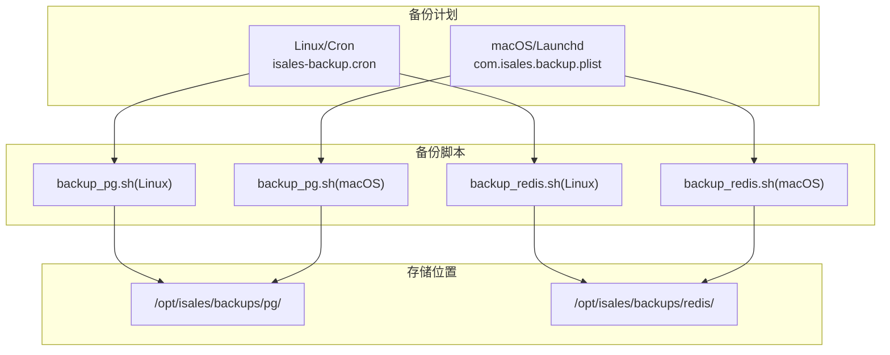
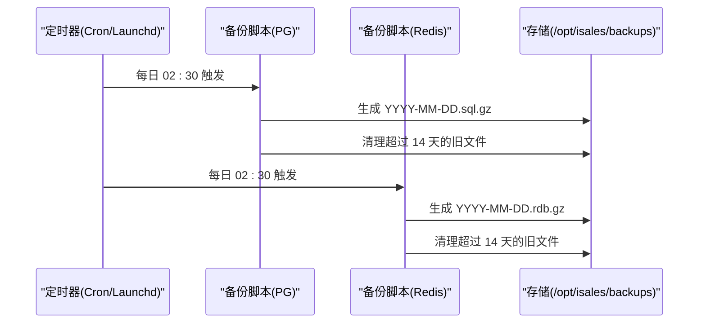
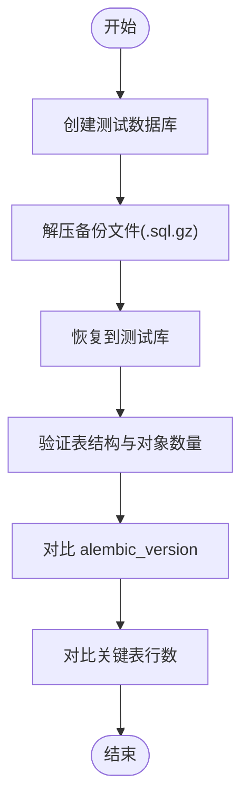
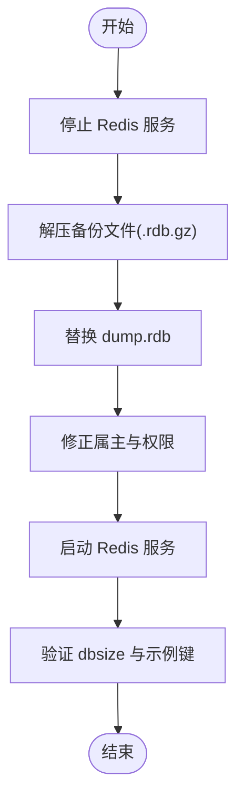
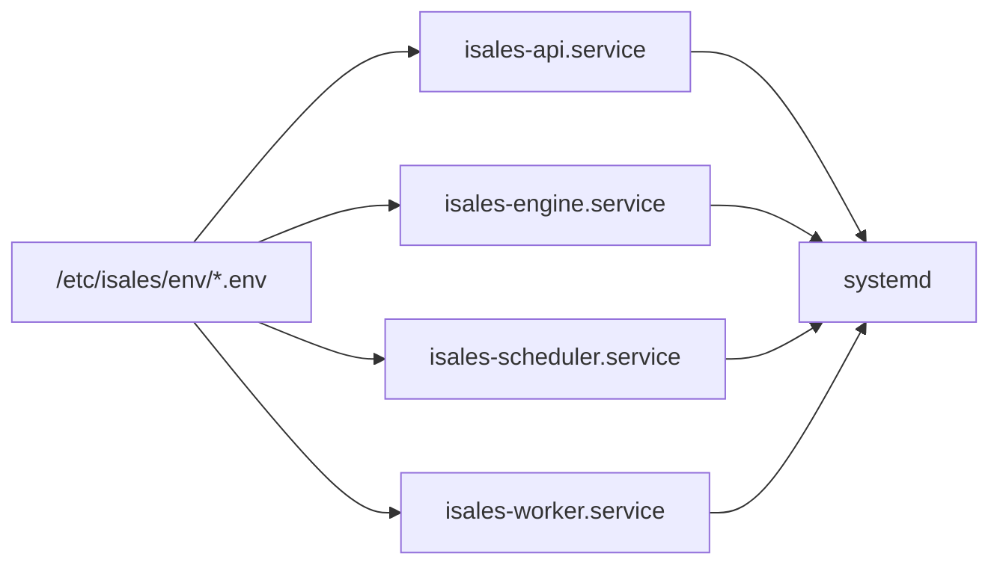

# 备份恢复演练

<cite>
**本文引用的文件**
- [isales-backup.cron](file://deploy/cron/isales-backup.cron)
- [backup_pg.sh（Linux）](file://deploy/linux/scripts/backup_pg.sh)
- [backup_redis.sh（Linux）](file://deploy/linux/scripts/backup_redis.sh)
- [backup_pg.sh（macOS）](file://deploy/macos/scripts/backup_pg.sh)
- [backup_redis.sh（macOS）](file://deploy/macos/scripts/backup_redis.sh)
- [_lib.sh（Linux）](file://deploy/linux/scripts/_lib.sh)
- [_lib.sh（macOS）](file://deploy/macos/scripts/_lib.sh)
- [RUNBOOK.md](file://deploy/RUNBOOK.md)
- [install.sh（Cloud）](file://deploy/cloud/scripts/install.sh)
- [rollback.sh（Cloud）](file://deploy/cloud/scripts/rollback.sh)
- [isales-api.service](file://deploy/cloud/systemd/isales-api.service)
- [isales-engine.service](file://deploy/cloud/systemd/isales-engine.service)
- [isales-scheduler.service](file://deploy/cloud/systemd/isales-scheduler.service)
- [isales-worker.service](file://deploy/cloud/systemd/isales-worker.service)
- [cloud README](file://deploy/cloud/README.md)
</cite>

## 目录
1. [简介](#简介)
2. [项目结构](#项目结构)
3. [核心组件](#核心组件)
4. [架构总览](#架构总览)
5. [详细组件分析](#详细组件分析)
6. [依赖关系分析](#依赖关系分析)
7. [性能考量](#性能考量)
8. [故障排查指南](#故障排查指南)
9. [结论](#结论)
10. [附录](#附录)

## 简介
本指南面向 iSales 平台的备份恢复演练，覆盖 PostgreSQL 与 Redis 的备份架构、存储位置、文件格式与保留策略；解释每日自动备份触发机制与备份文件命名规范；给出 PostgreSQL 恢复演练的完整流程（临时实例创建、数据恢复、完整性验证）；详述 Redis RDB 快照恢复过程（服务停止、文件替换、权限设置）；提供验证方法（表结构检查、数据量核对、版本号匹配）；明确演练的重要性与执行频率；包含失败应急处理与演练后的系统验证步骤，并总结最佳实践与质量保证措施。

## 项目结构
围绕备份与恢复的关键文件分布如下：
- 备份计划与触发
  - Linux/Cron：/etc/cron.d/isales-backup
  - macOS/Launchd：com.isales.backup.plist
- 备份脚本
  - Linux：deploy/linux/scripts/backup_pg.sh、backup_redis.sh
  - macOS：deploy/macos/scripts/backup_pg.sh、backup_redis.sh
- 恢复演练与运维参考
  - deploy/RUNBOOK.md 提供恢复演练步骤与验证方法
- 云侧部署与服务单元
  - deploy/cloud/scripts/install.sh、rollback.sh
  - deploy/cloud/systemd/*.service

图表来源
- [isales-backup.cron:10-13](file://deploy/cron/isales-backup.cron#L10-L13)
- [backup_pg.sh（Linux）:1-50](file://deploy/linux/scripts/backup_pg.sh#L1-L50)
- [backup_redis.sh（Linux）:1-61](file://deploy/linux/scripts/backup_redis.sh#L1-L61)
- [backup_pg.sh（macOS）:1-56](file://deploy/macos/scripts/backup_pg.sh#L1-L56)
- [backup_redis.sh（macOS）:1-66](file://deploy/macos/scripts/backup_redis.sh#L1-L66)

章节来源
- [isales-backup.cron:1-14](file://deploy/cron/isales-backup.cron#L1-L14)
- [backup_pg.sh（Linux）:1-50](file://deploy/linux/scripts/backup_pg.sh#L1-L50)
- [backup_redis.sh（Linux）:1-61](file://deploy/linux/scripts/backup_redis.sh#L1-L61)
- [backup_pg.sh（macOS）:1-56](file://deploy/macos/scripts/backup_pg.sh#L1-L56)
- [backup_redis.sh（macOS）:1-66](file://deploy/macos/scripts/backup_redis.sh#L1-L66)

## 核心组件
- 备份计划与触发
  - Linux：每日 02:30 触发，调用 backup_pg.sh 与 backup_redis.sh
  - macOS：通过 launchd 日常任务在 02:30 触发，使用相同备份脚本
- 备份输出与保留
  - PostgreSQL：/opt/isales/backups/pg/YYYY-MM-DD.sql.gz，保留 14 天
  - Redis：/opt/isales/backups/redis/YYYY-MM-DD.rdb.gz，保留 14 天
- 日志与告警
  - Linux：syslog 标签 isales-backup
  - macOS：统一日志标签 isales-backup
- 恢复演练与验证
  - PostgreSQL：创建测试数据库，恢复并校验 alembic 版本与关键表行数
  - Redis：停止服务、替换 dump.rdb、启动服务并校验键空间大小与示例键

章节来源
- [isales-backup.cron:2-8](file://deploy/cron/isales-backup.cron#L2-L8)
- [backup_pg.sh（Linux）:9-13](file://deploy/linux/scripts/backup_pg.sh#L9-L13)
- [backup_redis.sh（Linux）:10-14](file://deploy/linux/scripts/backup_redis.sh#L10-L14)
- [backup_pg.sh（macOS）:19-23](file://deploy/macos/scripts/backup_pg.sh#L19-L23)
- [backup_redis.sh（macOS）:17-21](file://deploy/macos/scripts/backup_redis.sh#L17-L21)
- [RUNBOOK.md:118-161](file://deploy/RUNBOOK.md#L118-L161)

## 架构总览
下图展示备份与恢复演练的整体流程：备份计划触发备份脚本，备份脚本读取环境变量、生成压缩归档并清理过期文件；恢复演练时分别针对 PostgreSQL 与 Redis 执行恢复与验证。

图表来源
- [isales-backup.cron](file://deploy/cron/isales-backup.cron#L13)
- [backup_pg.sh（Linux）:42-49](file://deploy/linux/scripts/backup_pg.sh#L42-L49)
- [backup_redis.sh（Linux）:54-60](file://deploy/linux/scripts/backup_redis.sh#L54-L60)
- [backup_pg.sh（macOS）:48-55](file://deploy/macos/scripts/backup_pg.sh#L48-L55)
- [backup_redis.sh（macOS）:59-65](file://deploy/macos/scripts/backup_redis.sh#L59-L65)

## 详细组件分析

### PostgreSQL 备份与恢复演练
- 备份文件格式与保留
  - 文件名：YYYY-MM-DD.sql.gz
  - 保留策略：保留最近 14 天
  - 输出目录：/opt/isales/backups/pg/
- 触发机制
  - Linux：cron 在每日 02:30 执行 backup_pg.sh
  - macOS：launchd 在每日 02:30 执行 backup_pg.sh
- 恢复演练步骤
  1) 创建测试数据库
  2) 解压并恢复到测试库
  3) 验证表结构与版本信息
- 验证方法
  - 使用 psql 查看表列表与统计信息
  - 对比 alembic_version 与目标发布版本一致性
  - 对比关键业务表（如 campaign）的行数与生产快照一致

图表来源
- [backup_pg.sh（Linux）:9-13](file://deploy/linux/scripts/backup_pg.sh#L9-L13)
- [backup_pg.sh（macOS）:19-23](file://deploy/macos/scripts/backup_pg.sh#L19-L23)
- [RUNBOOK.md:124-142](file://deploy/RUNBOOK.md#L124-L142)

章节来源
- [isales-backup.cron:2-8](file://deploy/cron/isales-backup.cron#L2-L8)
- [backup_pg.sh（Linux）:1-50](file://deploy/linux/scripts/backup_pg.sh#L1-L50)
- [backup_pg.sh（macOS）:1-56](file://deploy/macos/scripts/backup_pg.sh#L1-L56)
- [RUNBOOK.md:118-161](file://deploy/RUNBOOK.md#L118-L161)

### Redis RDB 快照恢复演练
- 备份文件格式与保留
  - 文件名：YYYY-MM-DD.rdb.gz
  - 保留策略：保留最近 14 天
  - 输出目录：/opt/isales/backups/redis/
- 触发机制
  - Linux：cron 在每日 02:30 执行 backup_redis.sh
  - macOS：launchd 在每日 02:30 执行 backup_redis.sh
- 恢复演练步骤
  1) 停止 Redis 服务
  2) 解压备份文件并替换 dump.rdb
  3) 设置正确属主与权限
  4) 启动 Redis 服务
  5) 验证键空间大小与示例键存在
- 注意事项
  - Linux：/var/lib/redis/dump.rdb
  - macOS：/opt/homebrew/var/db/redis/dump.rdb

图表来源
- [backup_redis.sh（Linux）:10-14](file://deploy/linux/scripts/backup_redis.sh#L10-L14)
- [backup_redis.sh（macOS）:17-21](file://deploy/macos/scripts/backup_redis.sh#L17-L21)
- [RUNBOOK.md:144-157](file://deploy/RUNBOOK.md#L144-L157)

章节来源
- [isales-backup.cron:2-8](file://deploy/cron/isales-backup.cron#L2-L8)
- [backup_redis.sh（Linux）:1-61](file://deploy/linux/scripts/backup_redis.sh#L1-L61)
- [backup_redis.sh（macOS）:1-66](file://deploy/macos/scripts/backup_redis.sh#L1-L66)
- [RUNBOOK.md:118-161](file://deploy/RUNBOOK.md#L118-L161)

### 环境变量与平台差异
- 环境变量来源
  - Linux/macOS：默认从 /etc/isales/env/api.env 读取 ISALES_DATABASE_URL 与 ISALES_REDIS_URL
  - 可通过环境变量覆盖保留天数：ISALES_PG_BACKUP_RETAIN、ISALES_REDIS_BACKUP_RETAIN
- 平台差异
  - Linux：使用系统包管理器安装 PostgreSQL/Redis/依赖
  - macOS：通过 Homebrew 安装 PostgreSQL@16、Redis 等，并在 PATH 中显式加入 brew bin

章节来源
- [backup_pg.sh（Linux）:10-11](file://deploy/linux/scripts/backup_pg.sh#L10-L11)
- [backup_redis.sh（Linux）:10-11](file://deploy/linux/scripts/backup_redis.sh#L10-L11)
- [backup_pg.sh（macOS）:16-17](file://deploy/macos/scripts/backup_pg.sh#L16-L17)
- [backup_redis.sh（macOS）:14-15](file://deploy/macos/scripts/backup_redis.sh#L14-L15)
- [_lib.sh（Linux）:19-33](file://deploy/linux/scripts/_lib.sh#L19-L33)
- [_lib.sh（macOS）:23-35](file://deploy/macos/scripts/_lib.sh#L23-L35)

## 依赖关系分析
- 备份脚本依赖
  - PostgreSQL：pg_dump、pg_restore、psql（Linux 或 Homebrew）
  - Redis：redis-cli（用于拉取远端 RDB）
- 服务单元与环境
  - 云侧 systemd 单元通过 EnvironmentFile 引入 /etc/isales/env 下的环境文件
  - 云侧安装脚本负责同步 systemd 单元与环境文件

图表来源
- [isales-api.service](file://deploy/cloud/systemd/isales-api.service#L16)
- [isales-engine.service:20-25](file://deploy/cloud/systemd/isales-engine.service#L20-L25)
- [isales-scheduler.service](file://deploy/cloud/systemd/isales-scheduler.service#L15)
- [isales-worker.service](file://deploy/cloud/systemd/isales-worker.service#L15)
- [install.sh（Cloud）:245-278](file://deploy/cloud/scripts/install.sh#L245-L278)

章节来源
- [isales-api.service:1-35](file://deploy/cloud/systemd/isales-api.service#L1-L35)
- [isales-engine.service:1-42](file://deploy/cloud/systemd/isales-engine.service#L1-L42)
- [isales-scheduler.service:1-31](file://deploy/cloud/systemd/isales-scheduler.service#L1-L31)
- [isales-worker.service:1-31](file://deploy/cloud/systemd/isales-worker.service#L1-L31)
- [install.sh（Cloud）:245-278](file://deploy/cloud/scripts/install.sh#L245-L278)

## 性能考量
- 备份窗口与影响
  - 每日 02:30 执行，避开业务高峰时段
  - PostgreSQL 使用自定义格式压缩归档，便于快速恢复与权限控制
  - Redis 通过 redis-cli 拉取 RDB，避免直接访问/var/lib/redis 文件权限问题
- 存储与保留
  - 保留 14 天，兼顾恢复灵活性与磁盘占用
  - 备份文件权限统一为 0640，确保安全与可读性
- 恢复演练频率
  - 至少每季度执行一次，重大发布前必须演练

章节来源
- [isales-backup.cron:2-8](file://deploy/cron/isales-backup.cron#L2-L8)
- [backup_pg.sh（Linux）:42-49](file://deploy/linux/scripts/backup_pg.sh#L42-L49)
- [backup_redis.sh（Linux）:54-60](file://deploy/linux/scripts/backup_redis.sh#L54-L60)
- [backup_pg.sh（macOS）:48-55](file://deploy/macos/scripts/backup_pg.sh#L48-L55)
- [backup_redis.sh（macOS）:59-65](file://deploy/macos/scripts/backup_redis.sh#L59-L65)
- [RUNBOOK.md](file://deploy/RUNBOOK.md#L159)

## 故障排查指南
- 备份未运行
  - 检查 cron 状态与 /etc/cron.d/isales-backup 权限
  - 查看 syslog 标签 isales-backup 的错误信息
- PostgreSQL 恢复失败
  - 确认测试数据库已创建且可写
  - 检查 pg_restore 与 psql 可用性与版本兼容
- Redis 恢复失败
  - 确认服务停止后再替换 dump.rdb
  - 校验属主与权限是否为 redis:redis
- 云侧回滚与验证
  - 使用 rollback.sh 切回历史版本并重启服务
  - 通过 nginx 与各服务状态进行端到端验证

章节来源
- [RUNBOOK.md:163-179](file://deploy/RUNBOOK.md#L163-L179)
- [rollback.sh（Cloud）:96-113](file://deploy/cloud/scripts/rollback.sh#L96-L113)
- [cloud README:109-110](file://deploy/cloud/README.md#L109-L110)

## 结论
本指南明确了 iSales 备份与恢复演练的体系：以每日定时任务为核心，采用压缩归档与 14 天保留策略；针对 PostgreSQL 与 Redis 提供标准化的恢复流程与验证方法；结合云侧 systemd 单元与环境文件，确保演练可重复、可审计。建议将演练纳入变更流程的硬性前置条件，并持续优化备份窗口与恢复验证项。

## 附录
- 执行频率与硬性门禁
  - 至少每季度演练一次；重大发布前必须演练
  - 发布前必须通过：备份恢复演练通过、至少一次完整的安装→部署→回滚→再部署循环
- 最佳实践
  - 统一备份时间窗口，避免与业务高峰重叠
  - 定期轮换与测试恢复路径，确保备份文件可解压与可验证
  - 严格控制备份文件权限与存储空间，防止误删与磁盘占满
  - 将恢复演练纳入变更评审与值班交接流程

章节来源
- [RUNBOOK.md](file://deploy/RUNBOOK.md#L159)
- [RUNBOOK.md:200-217](file://deploy/RUNBOOK.md#L200-L217)