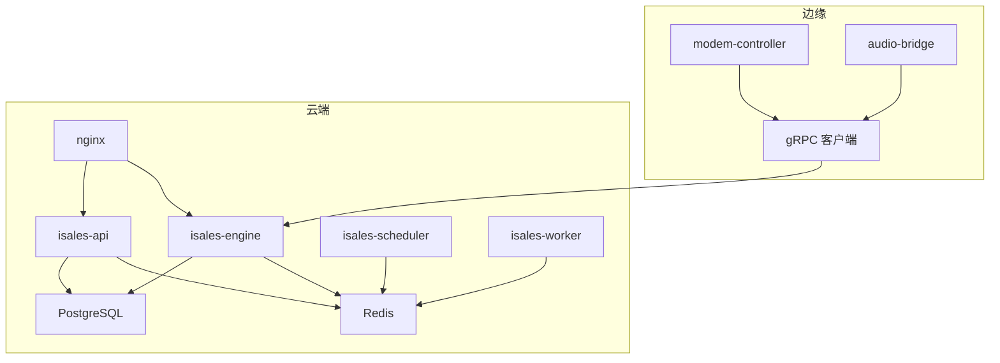
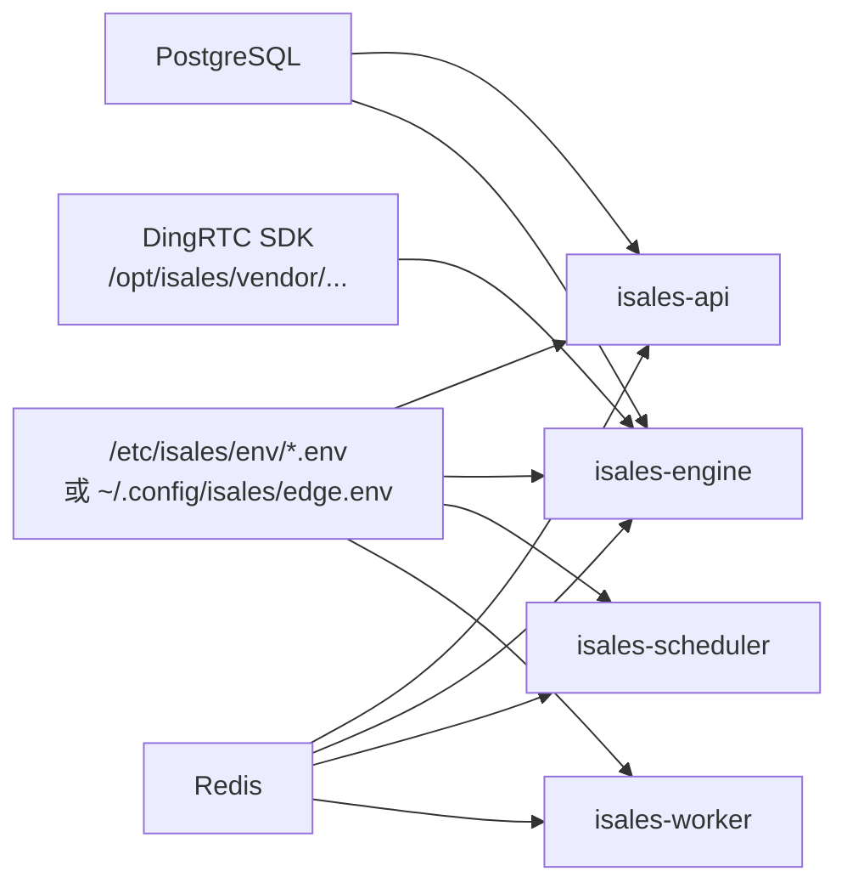

# 故障排查

<cite>
**本文引用的文件**
- [RUNBOOK.md](file://deploy/RUNBOOK.md)
- [RUNBOOK-cloud.md](file://deploy/RUNBOOK-cloud.md)
- [RUNBOOK-edge.md](file://deploy/RUNBOOK-edge.md)
- [cloud/README.md](file://deploy/cloud/README.md)
- [edge/README.md](file://deploy/edge/README.md)
- [macos/README.md](file://deploy/macos/README.md)
- [monitoring/README.md](file://deploy/monitoring/README.md)
- [cloud/monitoring/README.md](file://deploy/cloud/monitoring/README.md)
- [cloud/scripts/install-dingrtc-sdk.sh](file://deploy/cloud/scripts/install-dingrtc-sdk.sh)
- [edge/scripts/install.sh](file://deploy/edge/scripts/install.sh)
- [linux/scripts/_lib.sh](file://deploy/linux/scripts/_lib.sh)
- [macos/scripts/_lib.sh](file://deploy/macos/scripts/_lib.sh)
- [cloud/env/api.env.example](file://deploy/cloud/env/api.env.example)
- [cloud/env/engine.env.example](file://deploy/cloud/env/engine.env.example)
</cite>

## 目录
1. [简介](#简介)
2. [项目结构](#项目结构)
3. [核心组件](#核心组件)
4. [架构总览](#架构总览)
5. [详细组件分析](#详细组件分析)
6. [依赖关系分析](#依赖关系分析)
7. [性能考量](#性能考量)
8. [故障排查指南](#故障排查指南)
9. [结论](#结论)
10. [附录](#附录)

## 简介
本指南面向 iSales 生产环境的故障排查，覆盖 Linux systemd 与 macOS launchd 两种平台，聚焦数据库连接、Redis 内存溢出、调制解调器设备断开、认证失败等典型问题，并提供跨平台日志查看、硬件相关诊断、一键式排查命令、预防与监控建议以及升级与应急流程。

## 项目结构
iSales 采用“单主机”和“云-边分离”两种拓扑：
- 单主机（Linux systemd / macOS launchd）：服务进程与调制解调器/音频桥接在同一主机。
- 云-边分离（A2）：云端 ECS 运行 API/Engine/Scheduler/Worker/Nginx，边缘 Mac mini 仅运行 telephony 客户端（含 modem-controller + audio-bridge + gRPC 客户端）。

```mermaid
graph TB
subgraph "云端 ECSUbuntu 22.04"
API["isales-api<br/>:8000"]
ENG["isales-engine<br/>:50051"]
SCH["isales-scheduler<br/>:8003"]
WRK["isales-worker<br/>:8004"]
Nginx["nginx<br/>:443/:50051"]
RDS["RDS PostgreSQL 16"]
REDIS["Redis/Tair"]
OSS["OSS"]
end
subgraph "边缘 Mac minimacOS 14+"
EDGE["com.isales.telephony<br/>LaunchAgent"]
MODEM["modem-controller"]
AUDIO["audio-bridge"]
GCLIENT["cloud-edge gRPC client"]
end
Nginx --> API
Nginx --> ENG
API <- --> SCH
API <- --> WRK
ENG <- --> SCH
ENG <- --> WRK
API --- RDS
API --- REDIS
ENG --- RDS
ENG --- REDIS
ENG --- OSS
EDGE --> MODEM
EDGE --> AUDIO
EDGE --> GCLIENT
GCLIENT --> ENG
```

图表来源
- [cloud/README.md:10-53](file://deploy/cloud/README.md#L10-L53)
- [edge/README.md:10-40](file://deploy/edge/README.md#L10-L40)

章节来源
- [cloud/README.md:1-118](file://deploy/cloud/README.md#L1-L118)
- [edge/README.md:1-99](file://deploy/edge/README.md#L1-L99)

## 核心组件
- 服务单元与日志
  - Linux：systemd 单元（isales-api、isales-engine、isales-scheduler、isales-worker、isales-telephony-api、isales-modem-controller），日志通过 journalctl 查看。
  - macOS：launchd LaunchAgent（com.isales.telephony），日志通过 log show 与统一日志系统查看。
- 数据存储
  - PostgreSQL（RDS 或本地）与 Redis（Tair 或本地）分别用于持久化与缓存队列。
- 网络与媒体
  - Nginx 反代 + TLS；engine 通过 gRPC 与边缘通信；DingRTC SDK 用于媒体面。
- 环境与密钥
  - 集中式 /etc/isales/env/*.env（Linux/macOS）或用户级 ~/.config/isales/edge.env（边缘）；Fernet 主密钥一致性至关重要。

章节来源
- [RUNBOOK.md:17-115](file://deploy/RUNBOOK.md#L17-L115)
- [macos/README.md:10-32](file://deploy/macos/README.md#L10-L32)
- [cloud/README.md:10-53](file://deploy/cloud/README.md#L10-L53)
- [edge/README.md:10-40](file://deploy/edge/README.md#L10-L40)

## 架构总览
云-边分离拓扑下，边缘设备通过 gRPC 与云端 engine 交互，engine 与 API/Scheduler/Worker 通过 Redis/PostgreSQL 协作，Nginx 提供 TLS 终止与反向代理。



图表来源
- [cloud/README.md:10-53](file://deploy/cloud/README.md#L10-L53)
- [edge/README.md:10-40](file://deploy/edge/README.md#L10-L40)

## 详细组件分析

### 数据库连接问题（PostgreSQL）
- 症状
  - psql: connection refused
  - 连接池打满导致调度/引擎压力告警
- 首选排查步骤
  - 检查 PostgreSQL 服务状态与磁盘空间
  - 查看最近错误日志
  - 核对数据库连接字符串与凭据
- 后续处理
  - 修复磁盘空间/权限后重启服务
  - 若为连接池压力，调整各服务连接池上限或优化查询
- 关键日志指标
  - systemd 状态与 journalctl 错误级别日志
  - Prometheus/PG Exporter 指标（如连接数、慢查询）

章节来源
- [RUNBOOK.md:167](file://deploy/RUNBOOK.md#L167)
- [RUNBOOK-cloud.md:592](file://deploy/RUNBOOK-cloud.md#L592)

### Redis 内存溢出（OOM）
- 症状
  - OOM command not allowed
  - 队列堆积、任务卡住
- 首选排查步骤
  - 查看内存使用与最大内存配置
  - 检查键空间与过期策略
- 后续处理
  - 调整 maxmemory 与驱逐策略
  - 清理无用键空间或扩容
- 关键日志指标
  - redis-cli info memory
  - 队列长度（engine:*）

章节来源
- [RUNBOOK.md:168](file://deploy/RUNBOOK.md#L168)
- [RUNBOOK.md:195](file://deploy/RUNBOOK.md#L195)

### 调制解调器设备断开（Linux/macOS）
- 症状
  - modem-controller “device disconnected”
  - 启动即退出并提示需要串口路径
  - 生产环境出现 MockATClient 日志
- 首选排查步骤
  - Linux：udevadm 监听内核事件，检查 USB 事件是否产生
  - macOS：ioreg/system_profiler 查看设备，确认串口路径
  - 重新插拔 USB，检查端口变化
- 后续处理
  - 设置正确的 ISALES_MODEM_SERIAL_PATH
  - 避免在生产开启允许模拟模式（ISALES_ALLOW_MOCK_AT）
- 关键日志指标
  - journalctl -u isales-modem-controller
  - log stream（macOS）或 systemd 日志

章节来源
- [RUNBOOK.md:169-171](file://deploy/RUNBOOK.md#L169-L171)
- [RUNBOOK.md:350-355](file://deploy/RUNBOOK.md#L350-L355)

### 认证失败（API 登录/JWT）
- 症状
  - API 登录失败
  - JWT 校验失败（跨服务）
- 首选排查步骤
  - 检查 ISALES_ADMIN_PASSWORD_HASH（bcrypt）
  - 核对 ISALES_JWT_SECRET 是否一致
- 后续处理
  - 重新生成哈希并重启 isales-api
  - 保持跨服务 JWT_SECRET 一致并重启相关服务

章节来源
- [RUNBOOK.md:176-177](file://deploy/RUNBOOK.md#L176-L177)

### 引擎拨号队列堆积
- 症状
  - engine:dial 队列深度 > 500
- 首选排查步骤
  - 检查队列长度
  - 确认引擎服务状态
- 后续处理
  - 重启 isales-engine（若处于活动状态）

章节来源
- [RUNBOOK.md:172](file://deploy/RUNBOOK.md#L172)

### Worker 卡住（Celery）
- 症状
  - sumamrize_call 未运行
- 首选排查步骤
  - 查看 Celery active inspect
  - 检查 engine:worker:call-ended 列表是否为空
- 后续处理
  - 重启 worker；清理异常任务

章节来源
- [RUNBOOK.md:173](file://deploy/RUNBOOK.md#L173)

### Nginx 502（API/WS）
- 症状
  - /api/ 502；/ws/ 502
- 首选排查步骤
  - curl 直连 8000/healthz 验证 API
  - 查看 isales-api 的错误日志
- 后续处理
  - 重启 isales-api；检查上游配置

章节来源
- [RUNBOOK.md:174-175](file://deploy/RUNBOOK.md#L174-L175)

### 备份计划未运行
- 症状
  - 备份 cron 未触发
- 首选排查步骤
  - 检查 cron 服务与日志标签
- 后续处理
  - 修正权限与计划任务

章节来源
- [RUNBOOK.md:178](file://deploy/RUNBOOK.md#L178)

### 云-边 gRPC 连接与心跳
- 症状
  - 边缘全量离线；边缘单台离线；流频繁断开
- 首选排查步骤
  - 检查 nginx 50051 访问日志
  - 使用 grpcurl 检查鉴权与连通性
  - 查看 worker watchdog 日志
- 后续处理
  - 修复安全组/SLB idle-timeout；确保 keepalive 参数一致

章节来源
- [RUNBOOK-cloud.md:327-393](file://deploy/RUNBOOK-cloud.md#L327-L393)
- [RUNBOOK-cloud.md:588-596](file://deploy/RUNBOOK-cloud.md#L588-L596)

### 边缘设备离线缓冲与硬件诊断
- 症状
  - 离线事件积压；拨号失败；音频质量差
- 首选排查步骤
  - 检查 SQLite 离线缓冲表统计
  - 检查 gRPC 与 DNS/TLS 可达性
  - 检查 modem 串口与 SIM 状态
- 后续处理
  - 清理缓冲（谨慎）；重插 USB 更新串口路径；重试拨号

章节来源
- [RUNBOOK-edge.md:136-195](file://deploy/RUNBOOK-edge.md#L136-L195)
- [RUNBOOK-edge.md:241-251](file://deploy/RUNBOOK-edge.md#L241-L251)

## 依赖关系分析
- 环境一致性
  - 云端各服务（api/engine/scheduler/worker）共享数据库/Redis/JWT/Fernet 主密钥，任一不一致会导致鉴权/连接失败。
- 介质与 SDK
  - engine 使用 DingRTC SDK（C++ + pybind11 binding），需正确设置 SDK 路径与 LD_LIBRARY_PATH。
- 平台差异
  - Linux 使用 systemd；macOS 使用 launchd；日志与服务管理命令不同。



图表来源
- [cloud/env/api.env.example:8-21](file://deploy/cloud/env/api.env.example#L8-L21)
- [cloud/env/engine.env.example:8-54](file://deploy/cloud/env/engine.env.example#L8-L54)
- [cloud/scripts/install-dingrtc-sdk.sh:83-157](file://deploy/cloud/scripts/install-dingrtc-sdk.sh#L83-L157)

章节来源
- [cloud/env/api.env.example:1-24](file://deploy/cloud/env/api.env.example#L1-L24)
- [cloud/env/engine.env.example:1-76](file://deploy/cloud/env/engine.env.example#L1-L76)
- [cloud/scripts/install-dingrtc-sdk.sh:1-158](file://deploy/cloud/scripts/install-dingrtc-sdk.sh#L1-L158)

## 性能考量
- 管道延迟预算
  - engine 端提供管道超时与无进展容忍阈值，P95 超过阈值需降级（减少并发角色 N）。
- 连接池与压力
  - 数据库连接池上限需根据负载调整，避免打满。
- 监控与告警
  - 单主机与云-边分别提供模板与仪表盘，建议尽快实现各服务 /metrics 端点以完善可观测性。

章节来源
- [RUNBOOK-cloud.md:591](file://deploy/RUNBOOK-cloud.md#L591)
- [monitoring/README.md:30-48](file://deploy/monitoring/README.md#L30-L48)
- [cloud/monitoring/README.md:9-37](file://deploy/cloud/monitoring/README.md#L9-L37)

## 故障排查指南

### 通用流程（症状识别 → 初步诊断 → 根因定位）
- 1) 症状识别
  - 明确错误现象（502、队列堆积、设备断开、登录失败、音频异常等）
- 2) 初步诊断
  - 平台区分（Linux systemd vs macOS launchd）
  - 服务状态与日志快速扫描（最近 5 分钟错误日志）
- 3) 根因定位
  - 依据“首选排查步骤”逐项验证
  - 结合关键日志指标与监控告警
- 4) 处理与验证
  - 执行“后续处理”，观察指标回落与日志收敛
- 5) 预防与复盘
  - 补充监控、加固配置、形成 SOP

### 跨平台日志查看方式
- Linux（systemd）
  - 查看服务状态与最近错误日志
  - 查看 iSales 服务状态概览
- macOS（launchd）
  - 查看 LaunchAgent 状态与 PID
  - 使用 log show 过滤统一日志
  - 查看 brew 服务列表（macOS 专用）

章节来源
- [RUNBOOK.md:184-189](file://deploy/RUNBOOK.md#L184-L189)
- [RUNBOOK.md:361-379](file://deploy/RUNBOOK.md#L361-L379)
- [macos/README.md:71-83](file://deploy/macos/README.md#L71-L83)

### 一键式排查命令
- Linux
  - 查看所有 iSales 服务状态
  - 查看最近 5 分钟错误日志
  - 查看活跃通话数与队列深度
- macOS
  - 查看所有 iSales 服务状态（LaunchAgent）
  - 查看最近 5 分钟错误日志（统一日志）
  - 查看 brew 服务列表

章节来源
- [RUNBOOK.md:184-196](file://deploy/RUNBOOK.md#L184-L196)
- [RUNBOOK.md:361-379](file://deploy/RUNBOOK.md#L361-L379)

### 硬件相关问题排查
- USB 设备识别（Linux/macOS）
  - Linux：udevadm 监听内核事件，确认设备热插拔事件
  - macOS：ioreg/system_profiler 查看设备，确认串口路径
- 音频设备配置（macOS）
  - 使用 Python sounddevice 查询设备，确认音频设备可见
  - 在 modem-controller.env 中设置 ISALES_AUDIO_DEVICE_NAME 以消除歧义
- 串口占用（macOS）
  - lsof 检查 /dev/cu.usbmodem* 是否被系统服务占用（如 usbmuxd/commcenter）
  - 长期解决：参考设计文档中的 SIP/kext 黑名单方案

章节来源
- [RUNBOOK.md:349-357](file://deploy/RUNBOOK.md#L349-L357)

### 云-边拓扑专项
- gRPC 连通性
  - 使用 grpcurl 带 Bearer Token 调用 list
  - 检查 nginx 50051 访问日志
- RTC 房间探测
  - 在 ECS 上运行 PCM 单边入会脚本，观察 inbound 帧计数
- 边缘离线与心跳
  - 查看 worker watchdog 指标与 edge 设备心跳

章节来源
- [RUNBOOK-cloud.md:337-443](file://deploy/RUNBOOK-cloud.md#L337-L443)
- [cloud/monitoring/README.md:13-24](file://deploy/cloud/monitoring/README.md#L13-L24)

### 环境与密钥一致性
- 云端各服务数据库/Redis/JWT/Fernet 主密钥必须一致
- macOS launchd 通过 install.sh 将 /etc/isales/env/*.env 内联到 plist 的 EnvironmentVariables，修改 env 后需重新安装或 bootout/bootstrap

章节来源
- [cloud/env/api.env.example:3-21](file://deploy/cloud/env/api.env.example#L3-L21)
- [cloud/env/engine.env.example:3-27](file://deploy/cloud/env/engine.env.example#L3-L27)
- [macos/README.md:85-91](file://deploy/macos/README.md#L85-L91)

### 一键式排查命令（汇总）
- Linux
  - 查看 iSales 服务状态
  - 查看最近 5 分钟错误日志
  - 查看活跃通话数与队列深度
- macOS
  - 查看 iSales 服务状态（LaunchAgent）
  - 查看最近 5 分钟错误日志（统一日志）
  - 查看 brew 服务列表

章节来源
- [RUNBOOK.md:184-196](file://deploy/RUNBOOK.md#L184-L196)
- [RUNBOOK.md:361-379](file://deploy/RUNBOOK.md#L361-L379)

### 故障升级与应急响应流程
- 一级（登录失败/鉴权失败）：核对密码哈希与 JWT_SECRET，重启相关服务
- 二级（数据库/Redis 连接异常）：检查服务状态与磁盘/内存，必要时扩容或调整策略
- 三级（引擎/队列异常）：重启引擎/worker，观察队列回落
- 四级（gRPC/边缘离线）：检查安全组/SLB/keepalive，必要时回滚至稳定版本
- 五级（媒体面异常）：确认 DingRTC SDK 路径与绑定，检查 RTC 房间入会

章节来源
- [RUNBOOK.md:165-179](file://deploy/RUNBOOK.md#L165-L179)
- [RUNBOOK-cloud.md:584-599](file://deploy/RUNBOOK-cloud.md#L584-L599)

## 结论
通过标准化的故障排查流程、跨平台日志与命令、硬件与介质专项检查，以及完善的监控与告警，可显著缩短 iSales 生产故障恢复时间。建议尽快补齐各服务 /metrics 端点，强化环境一致性校验与自动化巡检，持续优化连接池与管道预算，确保在高负载下稳定运行。

## 附录

### 常用命令与路径速查
- Linux
  - journalctl -u isales-* -n 50 --no-pager
  - systemctl status isales-*
  - redis-cli dbsize / keys ...
  - psql -c "select count(*) from ...;"
- macOS
  - log show --predicate 'subsystem BEGINSWITH "com.isales."'
  - launchctl print system/<label>
  - brew services list
- 云端 ECS
  - nginx -t && systemctl reload nginx
  - systemctl restart isales-engine
- 边缘 Mac
  - sqlite3 ~/Library/Application\ Support/isales/sqlite/edge_buffer.db "select count(*) from events;"
  - log stream --predicate 'subsystem == "isales.telephony"'

章节来源
- [RUNBOOK.md:184-196](file://deploy/RUNBOOK.md#L184-L196)
- [RUNBOOK.md:361-379](file://deploy/RUNBOOK.md#L361-L379)
- [cloud/README.md:70-92](file://deploy/cloud/README.md#L70-L92)
- [edge/README.md:55-75](file://deploy/edge/README.md#L55-L75)