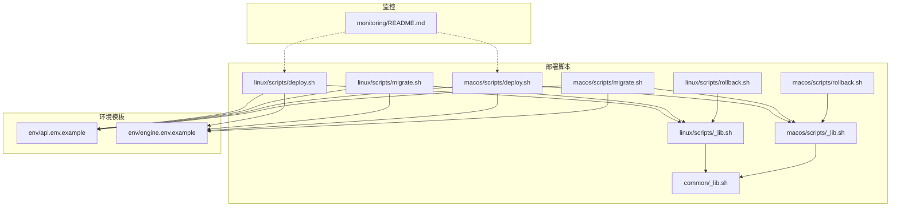
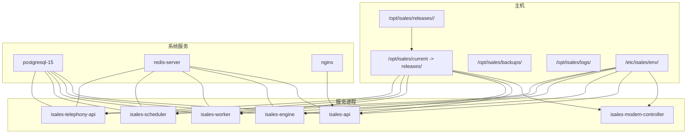
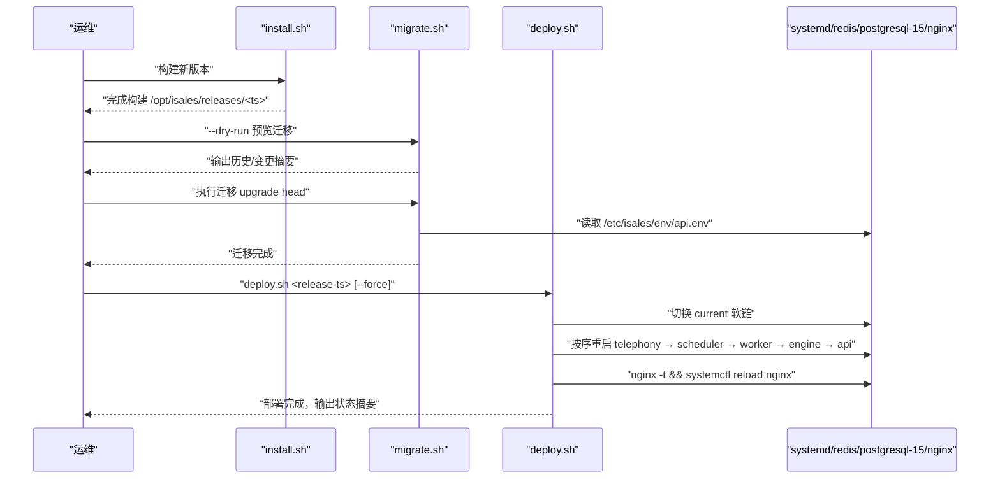
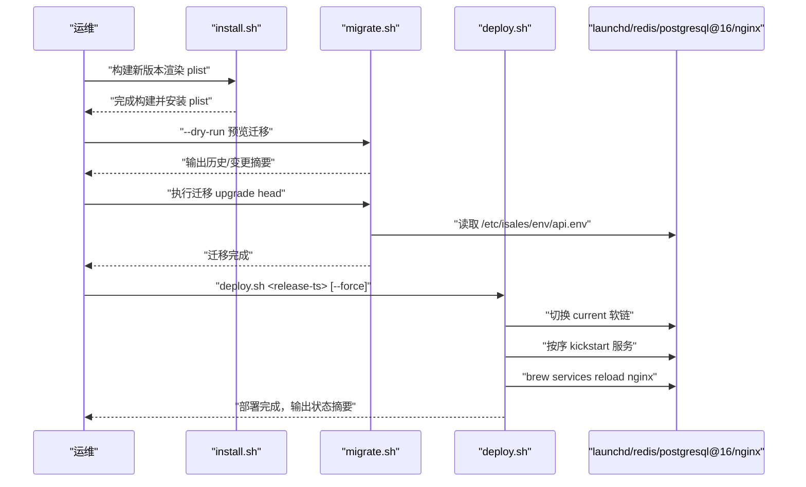
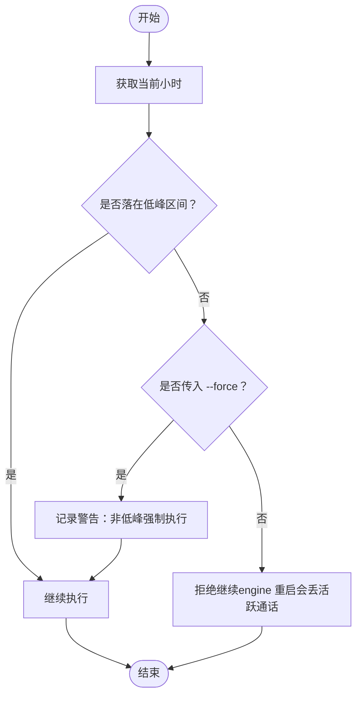
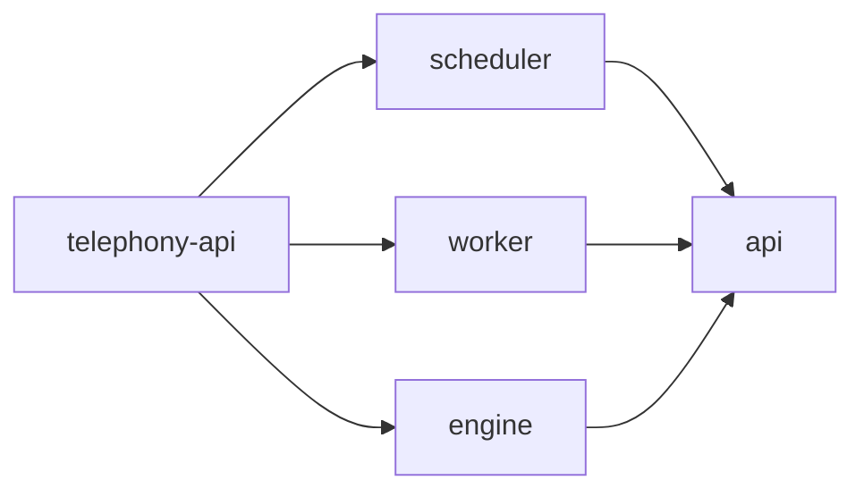
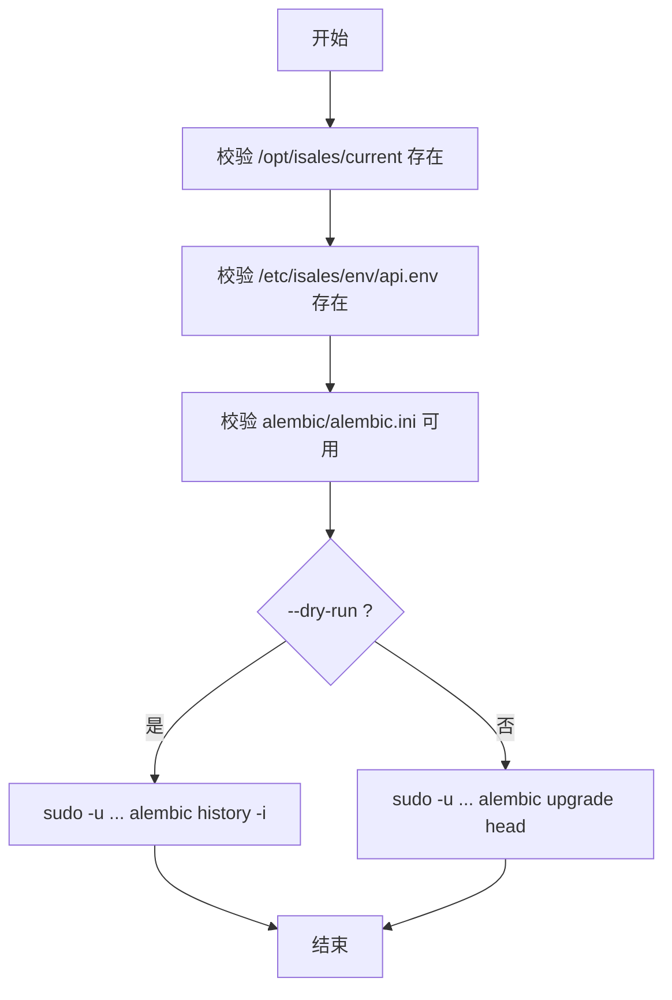
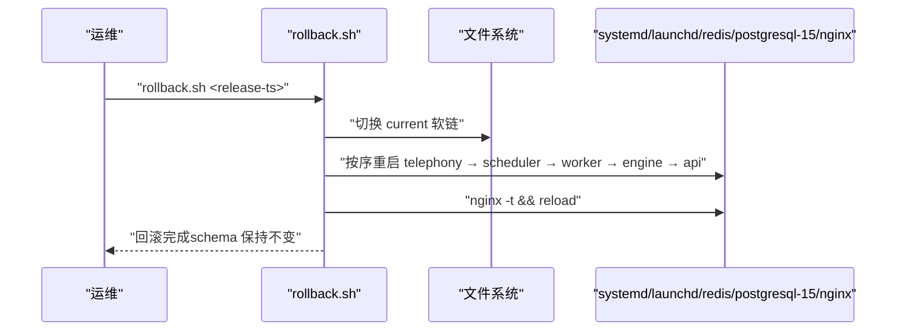
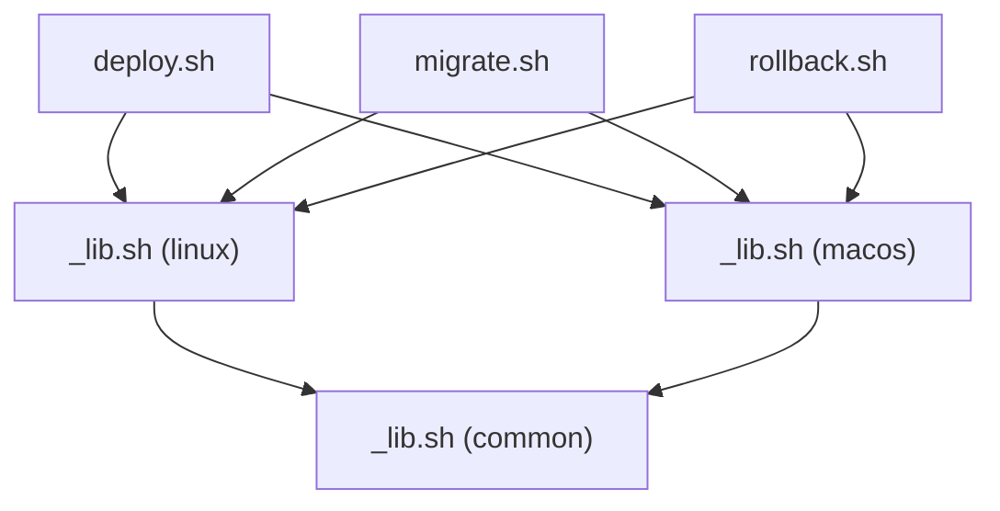

# 日常部署

<cite>
**本文引用的文件**
- [deploy/README.md](file://deploy/README.md)
- [deploy/RUNBOOK.md](file://deploy/RUNBOOK.md)
- [deploy/RUNBOOK-cloud.md](file://deploy/RUNBOOK-cloud.md)
- [deploy/monitoring/README.md](file://deploy/monitoring/README.md)
- [deploy/linux/scripts/deploy.sh](file://deploy/linux/scripts/deploy.sh)
- [deploy/linux/scripts/migrate.sh](file://deploy/linux/scripts/migrate.sh)
- [deploy/linux/scripts/rollback.sh](file://deploy/linux/scripts/rollback.sh)
- [deploy/linux/scripts/_lib.sh](file://deploy/linux/scripts/_lib.sh)
- [deploy/macos/scripts/deploy.sh](file://deploy/macos/scripts/deploy.sh)
- [deploy/macos/scripts/migrate.sh](file://deploy/macos/scripts/migrate.sh)
- [deploy/macos/scripts/rollback.sh](file://deploy/macos/scripts/rollback.sh)
- [deploy/macos/scripts/_lib.sh](file://deploy/macos/scripts/_lib.sh)
- [deploy/common/_lib.sh](file://deploy/common/_lib.sh)
- [deploy/env/api.env.example](file://deploy/env/api.env.example)
- [deploy/env/engine.env.example](file://deploy/env/engine.env.example)
</cite>

## 目录
1. [简介](#简介)
2. [项目结构](#项目结构)
3. [核心组件](#核心组件)
4. [架构总览](#架构总览)
5. [详细组件分析](#详细组件分析)
6. [依赖关系分析](#依赖关系分析)
7. [性能考量](#性能考量)
8. [故障排查指南](#故障排查指南)
9. [结论](#结论)
10. [附录](#附录)

## 简介
本指南面向 iSales v1 单主机部署（Linux + systemd 或 macOS 14+ + launchd）的日常发布流程，覆盖版本构建、迁移预览、服务重启顺序与部署验证；解释低峰时段窗口管理与强制部署选项；阐述数据库迁移的安全执行；对比 Linux 与 macOS 平台差异；提供部署后的验证、监控与性能确认方法，并给出最佳实践、回滚策略与常见问题快速解决路径。

## 项目结构
- 部署脚本与模板位于 deploy/ 下，按平台拆分：
  - Linux：deploy/linux/scripts/*
  - macOS：deploy/macos/scripts/*
  - 通用函数：deploy/common/_lib.sh
- 环境变量模板：deploy/env/*.env.example
- 监控模板：deploy/monitoring/*
- 运维手册：deploy/RUNBOOK.md（Linux/macOS 折叠章节）
- 云边部署手册：deploy/RUNBOOK-cloud.md（云端 ECS 场景）

**图表来源**
- [deploy/linux/scripts/deploy.sh:1-139](file://deploy/linux/scripts/deploy.sh#L1-L139)
- [deploy/linux/scripts/migrate.sh:1-61](file://deploy/linux/scripts/migrate.sh#L1-L61)
- [deploy/linux/scripts/rollback.sh:1-114](file://deploy/linux/scripts/rollback.sh#L1-L114)
- [deploy/linux/scripts/_lib.sh:1-47](file://deploy/linux/scripts/_lib.sh#L1-L47)
- [deploy/macos/scripts/deploy.sh:1-201](file://deploy/macos/scripts/deploy.sh#L1-L201)
- [deploy/macos/scripts/migrate.sh:1-73](file://deploy/macos/scripts/migrate.sh#L1-L73)
- [deploy/macos/scripts/rollback.sh:1-129](file://deploy/macos/scripts/rollback.sh#L1-L129)
- [deploy/macos/scripts/_lib.sh:1-69](file://deploy/macos/scripts/_lib.sh#L1-L69)
- [deploy/common/_lib.sh:1-181](file://deploy/common/_lib.sh#L1-L181)
- [deploy/env/api.env.example:1-14](file://deploy/env/api.env.example#L1-L14)
- [deploy/env/engine.env.example:1-21](file://deploy/env/engine.env.example#L1-L21)
- [deploy/monitoring/README.md:1-65](file://deploy/monitoring/README.md#L1-L65)

**章节来源**
- [deploy/README.md:1-112](file://deploy/README.md#L1-L112)

## 核心组件
- 版本构建与安装
  - Linux：install.sh（克隆 7 仓、构建 web、创建虚拟环境、放置于 /opt/isales/releases/<ts>/）
  - macOS：install.sh（渲染 6 份 launchd plist、安装每日备份计划）
- 数据库迁移
  - migrate.sh：在 /opt/isales/current 上执行 alembic upgrade head，读取 /etc/isales/env/api.env
- 发布切换与重启
  - deploy.sh：原子切换 current 软链，按依赖顺序重启服务，nginx reload（systemd 或 brew services）
- 回滚
  - rollback.sh：切换 current 软链至历史版本，重启相同顺序的服务
- 通用工具
  - common/_lib.sh：日志、参数解析、权限校验、确认交互、运行包装、环境文件引导等
- 平台差异
  - Linux：systemd 管理服务、apt 包管理、systemctl/redis-server/postgresql-15/nginx
  - macOS：launchd 管理服务、brew 包管理、brew services、_isales 用户、Apple Silicon 要求

**章节来源**
- [deploy/RUNBOOK.md:56-81](file://deploy/RUNBOOK.md#L56-L81)
- [deploy/linux/scripts/deploy.sh:1-139](file://deploy/linux/scripts/deploy.sh#L1-L139)
- [deploy/macos/scripts/deploy.sh:1-201](file://deploy/macos/scripts/deploy.sh#L1-L201)
- [deploy/linux/scripts/migrate.sh:1-61](file://deploy/linux/scripts/migrate.sh#L1-L61)
- [deploy/macos/scripts/migrate.sh:1-73](file://deploy/macos/scripts/migrate.sh#L1-L73)
- [deploy/common/_lib.sh:1-181](file://deploy/common/_lib.sh#L1-L181)

## 架构总览
下图展示单主机部署的目录骨架、服务与系统组件关系，以及日常发布的关键步骤。

**图表来源**
- [deploy/README.md:12-49](file://deploy/README.md#L12-L49)

## 详细组件分析

### 日常发布流程（Linux）
- 步骤概览
  1) 构建新版本：install.sh
  2) 迁移预览（可选）：migrate.sh --dry-run
  3) 执行迁移：migrate.sh
  4) 切换 current 并重启：deploy.sh <release-ts>
  5) 部署后验证：journalctl/systemctl/status
- 低峰时段与强制部署
  - 默认低峰窗口 22:00–08:00（主机时区）
  - 非低峰窗口需传入 --force，否则拒绝继续（engine 重启会丢活跃通话）
- 重启顺序
  - isales-telephony-api → isales-scheduler → isales-worker → isales-engine → isales-api
  - nginx reload（systemd reload）
  - modem-controller 默认跳过（硬件耦合），可通过 --include-modem 显式重启

**图表来源**
- [deploy/RUNBOOK.md:56-76](file://deploy/RUNBOOK.md#L56-L76)
- [deploy/linux/scripts/deploy.sh:10-16](file://deploy/linux/scripts/deploy.sh#L10-L16)
- [deploy/linux/scripts/deploy.sh:80-114](file://deploy/linux/scripts/deploy.sh#L80-L114)
- [deploy/linux/scripts/migrate.sh:9-14](file://deploy/linux/scripts/migrate.sh#L9-L14)

**章节来源**
- [deploy/RUNBOOK.md:56-76](file://deploy/RUNBOOK.md#L56-L76)
- [deploy/linux/scripts/deploy.sh:1-139](file://deploy/linux/scripts/deploy.sh#L1-L139)
- [deploy/linux/scripts/migrate.sh:1-61](file://deploy/linux/scripts/migrate.sh#L1-L61)

### 日常发布流程（macOS）
- 步骤概览
  1) 构建新版本：install.sh（渲染 6 份 plist，安装到 /Library/LaunchDaemons/）
  2) 迁移预览（可选）：migrate.sh --dry-run
  3) 执行迁移：migrate.sh
  4) 切换 current 并重启：deploy.sh <release-ts>
  5) 部署后验证：launchctl/print + log show
- 低峰时段与强制部署
  - 逻辑与 Linux 一致，默认 22:00–08:00；非低峰需 --force
- 重启顺序
  - com.isales.telephony-api → com.isales.scheduler → com.isales.worker → com.isales.engine → com.isales.api
  - nginx reload 通过 brew services（以 $SUDO_USER 身份执行）

**图表来源**
- [deploy/RUNBOOK.md:270-293](file://deploy/RUNBOOK.md#L270-L293)
- [deploy/macos/scripts/deploy.sh:17-24](file://deploy/macos/scripts/deploy.sh#L17-L24)
- [deploy/macos/scripts/deploy.sh:119-171](file://deploy/macos/scripts/deploy.sh#L119-L171)
- [deploy/macos/scripts/migrate.sh:9-19](file://deploy/macos/scripts/migrate.sh#L9-L19)

**章节来源**
- [deploy/RUNBOOK.md:270-293](file://deploy/RUNBOOK.md#L270-L293)
- [deploy/macos/scripts/deploy.sh:1-201](file://deploy/macos/scripts/deploy.sh#L1-L201)
- [deploy/macos/scripts/migrate.sh:1-73](file://deploy/macos/scripts/migrate.sh#L1-L73)

### 低峰时段窗口与强制部署
- 窗口定义
  - 默认低峰：LOW_PEAK_START=22, LOW_PEAK_END=8（主机时区）
  - is_low_peak() 判断当前小时是否落入 [LOW_PEAK_START, LOW_PEAK_END)（跨午夜）
- 强制部署
  - 非低峰窗口：未传 --force 时拒绝继续
  - 传入 --force：继续执行，但会记录警告（engine 重启会丢活跃通话）

**图表来源**
- [deploy/linux/scripts/deploy.sh:53-68](file://deploy/linux/scripts/deploy.sh#L53-L68)
- [deploy/macos/scripts/deploy.sh:62-77](file://deploy/macos/scripts/deploy.sh#L62-L77)

**章节来源**
- [deploy/linux/scripts/deploy.sh:27-68](file://deploy/linux/scripts/deploy.sh#L27-L68)
- [deploy/macos/scripts/deploy.sh:35-77](file://deploy/macos/scripts/deploy.sh#L35-L77)

### 服务重启顺序与原因
- 顺序
  - Linux：telephony-api → scheduler → worker → engine → api
  - macOS：com.isales.telephony-api → com.isales.scheduler → com.isales.worker → com.isales.engine → com.isales.api
- 原因
  - 依赖链：api 依赖 scheduler/worker/engine；engine 依赖 telephony-api；worker/scheduler 依赖 telephony-api 与 redis/postgresql
  - 顺序保证：先启动上游（telephony-api），再启动下游（scheduler/worker/engine），最后启动 api，确保依赖就绪
  - nginx：在 systemd 或 brew services 下 reload，避免中断已有连接

**图表来源**
- [deploy/RUNBOOK.md:70-71](file://deploy/RUNBOOK.md#L70-L71)
- [deploy/linux/scripts/deploy.sh:82-88](file://deploy/linux/scripts/deploy.sh#L82-L88)
- [deploy/macos/scripts/deploy.sh:92-98](file://deploy/macos/scripts/deploy.sh#L92-L98)

**章节来源**
- [deploy/RUNBOOK.md:70-71](file://deploy/RUNBOOK.md#L70-L71)
- [deploy/linux/scripts/deploy.sh:82-88](file://deploy/linux/scripts/deploy.sh#L82-L88)
- [deploy/macos/scripts/deploy.sh:92-98](file://deploy/macos/scripts/deploy.sh#L92-L98)

### 数据库迁移预览与安全执行
- 迁移预览
  - migrate.sh --dry-run：执行 alembic history -i，查看待应用/已应用版本
- 安全执行
  - migrate.sh：在 /opt/isales/current 上执行 alembic upgrade head
  - 读取 /etc/isales/env/api.env（任何服务 env 均可，约定使用 api.env）
  - 以 isales 用户执行 alembic，避免权限问题
- 平台差异
  - Linux：sudo -u isales
  - macOS：sudo -u "$ISALES_USER"（_isales）

**图表来源**
- [deploy/linux/scripts/migrate.sh:32-60](file://deploy/linux/scripts/migrate.sh#L32-L60)
- [deploy/macos/scripts/migrate.sh:38-73](file://deploy/macos/scripts/migrate.sh#L38-L73)

**章节来源**
- [deploy/linux/scripts/migrate.sh:1-61](file://deploy/linux/scripts/migrate.sh#L1-L61)
- [deploy/macos/scripts/migrate.sh:1-73](file://deploy/macos/scripts/migrate.sh#L1-L73)

### 回滚策略
- 默认行为
  - rollback.sh：切换 current 软链至目标版本，重启相同顺序服务，nginx reload
  - 不触碰数据库 schema（默认保持 forward-applied）
- schema 回退（手动、危险）
  - 若旧版本需要旧 alembic revision，先备份数据库，再执行 downgrade -1
- macOS 行为
  - 与 Linux 一致，但使用 launchctl kickstart 重启服务

**图表来源**
- [deploy/linux/scripts/rollback.sh:78-114](file://deploy/linux/scripts/rollback.sh#L78-L114)
- [deploy/macos/scripts/rollback.sh:84-129](file://deploy/macos/scripts/rollback.sh#L84-L129)

**章节来源**
- [deploy/RUNBOOK.md:84-115](file://deploy/RUNBOOK.md#L84-L115)
- [deploy/linux/scripts/rollback.sh:1-114](file://deploy/linux/scripts/rollback.sh#L1-L114)
- [deploy/macos/scripts/rollback.sh:1-129](file://deploy/macos/scripts/rollback.sh#L1-L129)

### 平台差异（Linux vs macOS）
- 服务管理
  - Linux：systemd（systemctl restart/reload）
  - macOS：launchd（launchctl kickstart -k）
- 包管理器
  - Linux：apt（postgresql-15, redis-server, nginx, python3.12, nodejs）
  - macOS：brew（postgresql@16, redis, nginx, python@3.12, node@20）
- 用户与目录
  - Linux：isales:isales（无 shell）
  - macOS：_isales:_isales（UID/GID 350，Apple Silicon）
- nginx
  - Linux：systemctl reload nginx
  - macOS：brew services reload nginx（以 $SUDO_USER 身份）
- 环境变量
  - Linux：EnvironmentFile=/etc/isales/env/*.env
  - macOS：launchd plist 内嵌 EnvironmentVariables（需 reinstall 更新）

**章节来源**
- [deploy/README.md:51-60](file://deploy/README.md#L51-L60)
- [deploy/linux/scripts/_lib.sh:17-39](file://deploy/linux/scripts/_lib.sh#L17-L39)
- [deploy/macos/scripts/_lib.sh:23-56](file://deploy/macos/scripts/_lib.sh#L23-L56)
- [deploy/RUNBOOK.md:220-294](file://deploy/RUNBOOK.md#L220-L294)

## 依赖关系分析
- 脚本依赖
  - 平台脚本均依赖 common/_lib.sh（日志、参数、运行、确认、环境引导）
  - Linux 脚本依赖 linux/scripts/_lib.sh（apt 包列表、env 模板目录）
  - macOS 脚本依赖 macos/scripts/_lib.sh（brew 前缀、包列表、用户/组、macOS 校验）
- 环境变量一致性
  - api.env 与 engine.env 示例强调跨服务一致性（DATABASE_URL、REDIS_URL、JWT_SECRET）

**图表来源**
- [deploy/common/_lib.sh:1-181](file://deploy/common/_lib.sh#L1-L181)
- [deploy/linux/scripts/_lib.sh:1-47](file://deploy/linux/scripts/_lib.sh#L1-L47)
- [deploy/macos/scripts/_lib.sh:1-69](file://deploy/macos/scripts/_lib.sh#L1-L69)
- [deploy/linux/scripts/deploy.sh:20-22](file://deploy/linux/scripts/deploy.sh#L20-L22)
- [deploy/macos/scripts/deploy.sh:28-30](file://deploy/macos/scripts/deploy.sh#L28-L30)
- [deploy/linux/scripts/migrate.sh:18-20](file://deploy/linux/scripts/migrate.sh#L18-L20)
- [deploy/macos/scripts/migrate.sh:23-25](file://deploy/macos/scripts/migrate.sh#L23-L25)
- [deploy/linux/scripts/rollback.sh:17-19](file://deploy/linux/scripts/rollback.sh#L17-L19)
- [deploy/macos/scripts/rollback.sh:22-24](file://deploy/macos/scripts/rollback.sh#L22-L24)

**章节来源**
- [deploy/env/api.env.example:4-13](file://deploy/env/api.env.example#L4-L13)
- [deploy/env/engine.env.example:4-6](file://deploy/env/engine.env.example#L4-L6)

## 性能考量
- 低峰窗口
  - 默认 22:00–08:00，避免 engine 重启导致活跃通话中断
- nginx reload
  - Linux：systemctl reload nginx
  - macOS：brew services reload nginx（以 $SUDO_USER 身份）
- 监控与告警
  - Prometheus + Grafana 模板（/metrics 端点尚未在所有服务实现）
  - 建议关注队列深度、设备标记率、回调失败率、PG 连接压力等指标

**章节来源**
- [deploy/RUNBOOK.md:58-60](file://deploy/RUNBOOK.md#L58-L60)
- [deploy/monitoring/README.md:30-48](file://deploy/monitoring/README.md#L30-L48)

## 故障排查指南
- 常见症状与步骤
  - psql 连接被拒：检查 postgresql 状态与磁盘空间
  - Redis OOM：检查内存使用，调整 maxmemory 或淘汰策略
  - modem-controller 设备断开：检查 USB 事件、重插、查看日志
  - JWT 不一致：核对 ISALES_JWT_SECRET 在 api 与 telephony-api 一致
  - nginx 502：curl 直连 127.0.0.1:8000/healthz，检查 isales-api 状态
- 一键命令
  - Linux：systemctl 状态汇总、最近错误日志、活动通话数、队列深度
  - macOS：launchctl 状态、统一日志、brew services 概览、活动通话数

**章节来源**
- [deploy/RUNBOOK.md:163-197](file://deploy/RUNBOOK.md#L163-L197)
- [deploy/RUNBOOK.md:345-381](file://deploy/RUNBOOK.md#L345-L381)

## 结论
本文基于仓库中的部署脚本与运维手册，系统梳理了 iSales v1 单主机部署的日常发布流程，明确了低峰窗口、强制部署、迁移预览、服务重启顺序与回滚策略，并对比了 Linux 与 macOS 平台差异。建议在每次发布前进行迁移预览，严格遵循重启顺序，结合监控与告警进行部署后验证，确保服务稳定性与可追溯性。

## 附录
- 部署后验证清单
  - 服务状态：systemctl status 或 launchctl print
  - 日志：journalctl -u isales-engine -n 50
  - 健康检查：curl -sf http://localhost/api/healthz
  - 队列与并发：redis-cli get isales:concurrency:active；redis-cli llen engine:dial
- 监控与仪表盘
  - Prometheus 抓取 5 服务 + node_exporter + postgres_exporter
  - Grafana 导入 overview 仪表盘 JSON
- 云边部署参考
  - ECS 资源开通、公网入口、首次部署、常规发版、回滚、备份恢复演练、调试与告警

**章节来源**
- [deploy/RUNBOOK.md:200-217](file://deploy/RUNBOOK.md#L200-L217)
- [deploy/monitoring/README.md:16-29](file://deploy/monitoring/README.md#L16-L29)
- [deploy/RUNBOOK-cloud.md:1-599](file://deploy/RUNBOOK-cloud.md#L1-L599)