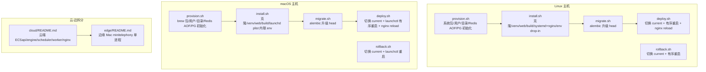
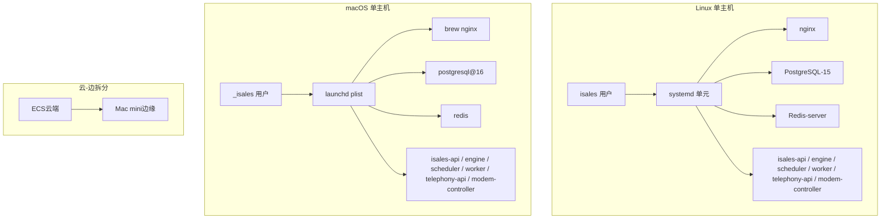
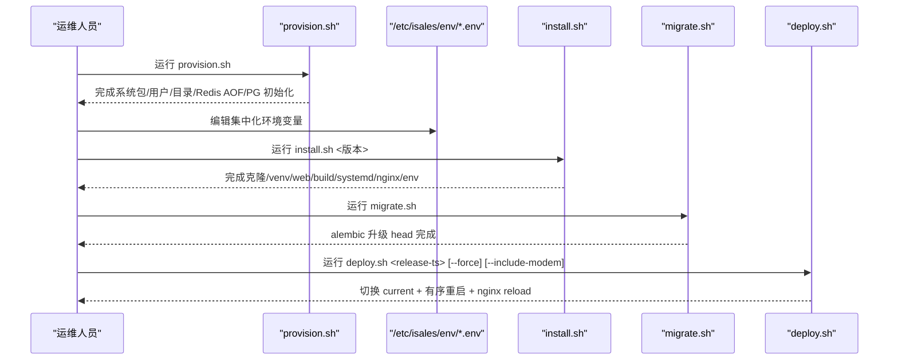
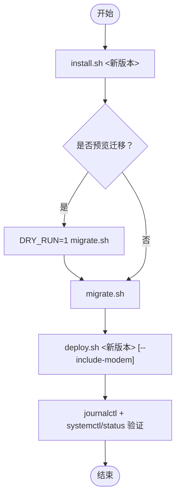
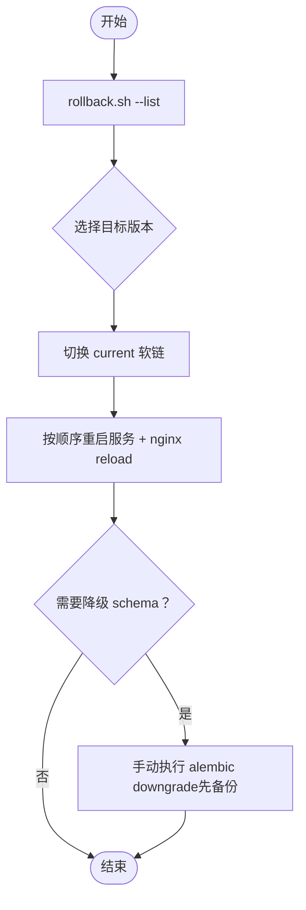
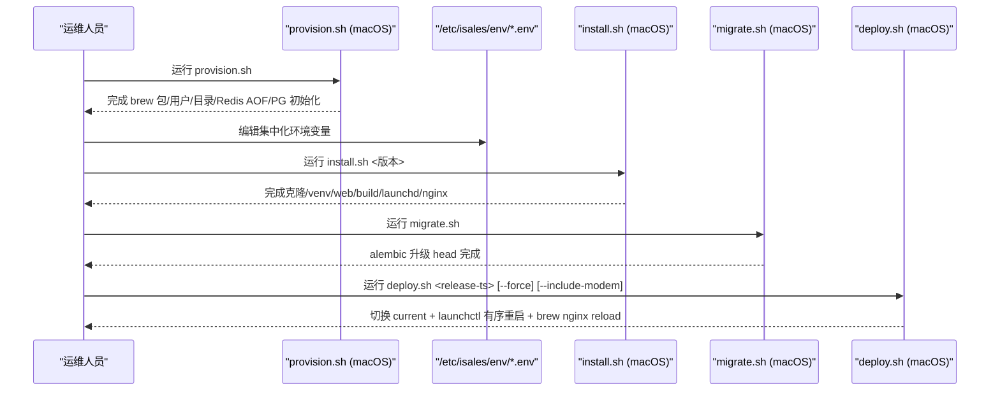
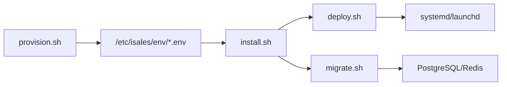

# 部署操作

<cite>
**本文引用的文件**
- [deploy/README.md](file://deploy/README.md)
- [deploy/RUNBOOK.md](file://deploy/RUNBOOK.md)
- [deploy/cloud/README.md](file://deploy/cloud/README.md)
- [deploy/macos/README.md](file://deploy/macos/README.md)
- [deploy/edge/README.md](file://deploy/edge/README.md)
- [deploy/linux/scripts/provision.sh](file://deploy/linux/scripts/provision.sh)
- [deploy/linux/scripts/install.sh](file://deploy/linux/scripts/install.sh)
- [deploy/linux/scripts/deploy.sh](file://deploy/linux/scripts/deploy.sh)
- [deploy/linux/scripts/migrate.sh](file://deploy/linux/scripts/migrate.sh)
- [deploy/linux/scripts/rollback.sh](file://deploy/linux/scripts/rollback.sh)
- [deploy/macos/scripts/provision.sh](file://deploy/macos/scripts/provision.sh)
- [deploy/macos/scripts/install.sh](file://deploy/macos/scripts/install.sh)
- [deploy/macos/scripts/deploy.sh](file://deploy/macos/scripts/deploy.sh)
- [deploy/macos/scripts/migrate.sh](file://deploy/macos/scripts/migrate.sh)
- [deploy/macos/scripts/rollback.sh](file://deploy/macos/scripts/rollback.sh)
</cite>

## 目录
1. [简介](#简介)
2. [项目结构](#项目结构)
3. [核心组件](#核心组件)
4. [架构总览](#架构总览)
5. [详细组件分析](#详细组件分析)
6. [依赖关系分析](#依赖关系分析)
7. [性能考量](#性能考量)
8. [故障排查指南](#故障排查指南)
9. [结论](#结论)
10. [附录](#附录)

## 简介
本指南面向 iSales v1 生产部署与日常发布，覆盖两类单主机部署形态：Linux + systemd 与 macOS 14+ + launchd。文档基于仓库中的部署脚本与运行手册，系统性梳理首次部署、环境变量、服务安装、数据库迁移、发布窗口与重启顺序、回滚与备份恢复、平台差异（包管理与服务管理）、以及部署前后检查清单与常见问题处理。

## 项目结构
- 部署目录按平台与拓扑划分：
  - Linux 单主机：`deploy/linux/scripts/*` 提供 provision/install/deploy/migrate/rollback/backup 等脚本。
  - macOS 单主机：`deploy/macos/scripts/*` 提供等效脚本，差异在于 launchd、包管理（brew）、环境注入方式与 nginx 配置。
  - 云-边拆分：`deploy/cloud/` 提供云端 ECS 部署（不含 modem-controller），边缘 Mac mini 通过 gRPC 与云端通信。
  - 边缘单机：`deploy/edge/` 提供边缘 Mac mini 的 telephony 单进程模式。
- 通用工具：`deploy/common/_lib.sh` 与 `deploy/linux/scripts/_lib.sh` 提供跨平台公共函数（日志、权限、参数解析、文件写入等）。

图表来源
- [deploy/README.md:14-49](file://deploy/README.md#L14-L49)
- [deploy/cloud/README.md:12-53](file://deploy/cloud/README.md#L12-L53)
- [deploy/edge/README.md:12-40](file://deploy/edge/README.md#L12-L40)

章节来源
- [deploy/README.md:1-112](file://deploy/README.md#L1-L112)
- [deploy/cloud/README.md:1-118](file://deploy/cloud/README.md#L1-L118)
- [deploy/macos/README.md:1-98](file://deploy/macos/README.md#L1-L98)
- [deploy/edge/README.md:1-99](file://deploy/edge/README.md#L1-L99)

## 核心组件
- provision（一次性主机准备）
  - Linux：安装系统包、创建 isales 用户、目录骨架、Redis AOF、初始化 PostgreSQL 角色/数据库与随机密钥，并可选安装 udev 规则。
  - macOS：brew 安装系统包、创建 _isales 用户、目录骨架、Redis AOF、初始化 PostgreSQL 角色/数据库与随机密钥。
- install（构建新发布）
  - Linux：克隆 7 个仓库、创建共享 venv、构建 isales-web、同步 systemd 单元与 nginx 配置、写入 EnvironmentFile drop-in、安装备份 cron。
  - macOS：克隆 7 个仓库、创建共享 venv、构建 isales-web、渲染并安装 6 个 launchd plist（内联 /etc/isales/env/*）、安装备份 launchd、重写 nginx 配置以适配 brew。
- migrate（数据库迁移）
  - 读取 /etc/isales/env/api.env 的数据库连接，对当前 release 执行 alembic 升级 head；支持 dry-run 查看迁移历史。
- deploy（发布上线）
  - Linux：切换 current 软链，按 telephony-api → scheduler → worker → engine → api 顺序重启，nginx reload；可选重启 modem-controller。
  - macOS：切换 current 软链，按相同顺序通过 launchctl 重启；nginx 通过 brew 服务 reload；可选重启 modem-controller。
- rollback（回滚）
  - 切换 current 软链至目标 release，按相同顺序重启服务；默认不触碰数据库 schema，如需降级请参考 RUNBOOK。
- 备份与恢复
  - Linux：每日 cron 触发 PG dump 与 Redis AOF 复制。
  - macOS：每日 launchd 任务触发 PG dump 与 Redis AOF 复制；支持恢复演练。

章节来源
- [deploy/linux/scripts/provision.sh:1-224](file://deploy/linux/scripts/provision.sh#L1-L224)
- [deploy/linux/scripts/install.sh:1-275](file://deploy/linux/scripts/install.sh#L1-L275)
- [deploy/linux/scripts/migrate.sh:1-61](file://deploy/linux/scripts/migrate.sh#L1-L61)
- [deploy/linux/scripts/deploy.sh:1-139](file://deploy/linux/scripts/deploy.sh#L1-L139)
- [deploy/linux/scripts/rollback.sh:1-114](file://deploy/linux/scripts/rollback.sh#L1-L114)
- [deploy/macos/scripts/provision.sh:1-280](file://deploy/macos/scripts/provision.sh#L1-L280)
- [deploy/macos/scripts/install.sh:1-417](file://deploy/macos/scripts/install.sh#L1-L417)
- [deploy/macos/scripts/migrate.sh:1-73](file://deploy/macos/scripts/migrate.sh#L1-L73)
- [deploy/macos/scripts/deploy.sh:1-201](file://deploy/macos/scripts/deploy.sh#L1-L201)
- [deploy/macos/scripts/rollback.sh:1-129](file://deploy/macos/scripts/rollback.sh#L1-L129)

## 架构总览
- Linux 单主机拓扑：systemd 管理 6 个服务（api/engine/scheduler/worker/telephony-api/modem-controller），系统服务包括 postgresql-15、redis-server、nginx；目录骨架与 env 集中式于 /opt/isales 与 /etc/isales/env。
- macOS 单主机拓扑：launchd 管理 6 个服务与每日备份；brew 管理 postgresql@16、redis、nginx；目录与 env 结构一致。
- 云-边拆分：云端 ECS 仅运行 api/engine/scheduler/worker/nginx，边缘 Mac mini 运行 telephony 单进程并通过 gRPC 与云端通信。
- 边缘单机：边缘 Mac mini 运行 telephony 单进程（modem-controller + audio-bridge + gRPC client + telephony-api loopback），无公网暴露。

图表来源
- [deploy/README.md:14-49](file://deploy/README.md#L14-L49)
- [deploy/macos/README.md:9-32](file://deploy/macos/README.md#L9-L32)
- [deploy/cloud/README.md:12-53](file://deploy/cloud/README.md#L12-L53)
- [deploy/edge/README.md:12-40](file://deploy/edge/README.md#L12-L40)

## 详细组件分析

### Linux 首次部署流程
- 步骤概览
  1) provision：安装系统包、创建 isales 用户、目录骨架、Redis AOF、初始化 PG 角色/数据库并生成随机密钥。
  2) 编辑集中化 env（/etc/isales/env/*.env），设置管理员账号与密码哈希。
  3) install：克隆 7 仓库、创建共享 venv、构建 isales-web、同步 systemd 单元与 nginx 配置、写入 EnvironmentFile drop-in、安装备份 cron。
  4) migrate：对当前 release 执行 alembic 升级 head。
  5) deploy：切换 current 软链并按顺序重启服务，nginx reload；首次部署可加 --force。
  6) 冒烟测试：访问 /api/healthz 与 /，确认返回健康状态与 SPA 页面。
- 发布窗口与重启顺序
  - 低峰窗口默认 22:00–08:00；engine 重启会中断活跃通话，非窗口期需 --force。
  - 重启顺序：telephony-api → scheduler → worker → engine → api；nginx reload。
  - modem-controller 默认跳过，如涉及变更需在维护窗口传入 --include-modem。

图表来源
- [deploy/linux/scripts/provision.sh:1-224](file://deploy/linux/scripts/provision.sh#L1-L224)
- [deploy/linux/scripts/install.sh:1-275](file://deploy/linux/scripts/install.sh#L1-L275)
- [deploy/linux/scripts/migrate.sh:1-61](file://deploy/linux/scripts/migrate.sh#L1-L61)
- [deploy/linux/scripts/deploy.sh:1-139](file://deploy/linux/scripts/deploy.sh#L1-L139)

章节来源
- [deploy/README.md:61-81](file://deploy/README.md#L61-L81)
- [deploy/RUNBOOK.md:17-52](file://deploy/RUNBOOK.md#L17-L52)
- [deploy/linux/scripts/deploy.sh:10-16](file://deploy/linux/scripts/deploy.sh#L10-L16)

### Linux 日常发布流程
- 步骤概览
  1) install 新版本：install.sh <新版本>。
  2) 可选：预览迁移（DRY_RUN=1）→ migrate。
  3) promote：deploy.sh <新版本>。
  4) 验证：查看 engine 日志与各服务状态。
- 硬件耦合与 modem-controller
  - deploy.sh 默认跳过 modem-controller；若新版本涉及 modem-controller 变更，需在维护窗口传入 --include-modem。

图表来源
- [deploy/RUNBOOK.md:56-76](file://deploy/RUNBOOK.md#L56-L76)
- [deploy/linux/scripts/deploy.sh:10-16](file://deploy/linux/scripts/deploy.sh#L10-L16)

章节来源
- [deploy/RUNBOOK.md:56-81](file://deploy/RUNBOOK.md#L56-L81)

### Linux 回滚流程
- 列出历史版本：rollback.sh --list。
- 回滚至指定版本：rollback.sh <旧版本>；默认不触碰数据库 schema。
- 如需降级，请参考 RUNBOOK 的 rollback-schema 手动执行 alembic downgrade，并提前进行 PG dump 备份。

图表来源
- [deploy/linux/scripts/rollback.sh:1-114](file://deploy/linux/scripts/rollback.sh#L1-L114)
- [deploy/RUNBOOK.md:84-114](file://deploy/RUNBOOK.md#L84-L114)

章节来源
- [deploy/linux/scripts/rollback.sh:1-114](file://deploy/linux/scripts/rollback.sh#L1-L114)
- [deploy/RUNBOOK.md:84-114](file://deploy/RUNBOOK.md#L84-L114)

### macOS 首次部署流程
- 步骤概览
  1) provision：brew 安装系统包、创建 _isales 用户、目录骨架、Redis AOF、初始化 PG 角色/数据库并生成随机密钥。
  2) 编辑集中化 env（/etc/isales/env/*.env），设置管理员账号与密码哈希。
  3) install：克隆 7 仓库、创建共享 venv、构建 isales-web、渲染并安装 6 个 launchd plist（内联 env）、安装备份 launchd、重写 nginx 配置。
  4) migrate：对当前 release 执行 alembic 升级 head。
  5) deploy：切换 current 软链，按顺序通过 launchctl 重启服务，nginx 通过 brew services reload；首次部署可加 --force。
  6) 冒烟测试：访问 /api/healthz。
- 与 Linux 的关键差异
  - 服务管理：systemctl vs launchctl；状态查询与日志查询方式不同。
  - 环境注入：systemd 的 EnvironmentFile= vs launchd 内联 EnvironmentVariables。
  - 包管理：apt vs brew；brew 需以非 root 身份运行，脚本通过 sudo -u "$SUDO_USER" 反向。
  - nginx：systemd reload vs brew services reload；macOS 默认监听 8080。
  - 备份：cron vs launchd；备份触发时间与日志标签不同。

图表来源
- [deploy/macos/scripts/provision.sh:1-280](file://deploy/macos/scripts/provision.sh#L1-L280)
- [deploy/macos/scripts/install.sh:1-417](file://deploy/macos/scripts/install.sh#L1-L417)
- [deploy/macos/scripts/migrate.sh:1-73](file://deploy/macos/scripts/migrate.sh#L1-L73)
- [deploy/macos/scripts/deploy.sh:1-201](file://deploy/macos/scripts/deploy.sh#L1-L201)

章节来源
- [deploy/macos/README.md:48-69](file://deploy/macos/README.md#L48-L69)
- [deploy/RUNBOOK.md:220-267](file://deploy/RUNBOOK.md#L220-L267)

### macOS 日常发布流程
- 步骤概览
  1) install.sh <新版本>。
  2) 可选：预览迁移（DRY_RUN=1）→ migrate。
  3) promote：deploy.sh <新版本>。
  4) 验证：查看 engine 日志与各服务状态。
- 特殊注意
  - 修改 /etc/isales/env/* 后需重新 install.sh 或对单个 plist 执行 bootout + bootstrap，否则 launchd 不会读取新值。
  - nginx reload 使用 brew services reload，需确保 SUDO_USER 设置正确。

章节来源
- [deploy/RUNBOOK.md:270-293](file://deploy/RUNBOOK.md#L270-L293)
- [deploy/macos/scripts/deploy.sh:17-24](file://deploy/macos/scripts/deploy.sh#L17-L24)

### 云-边拆分部署
- 云端 ECS（Linux）：运行 api/engine/scheduler/worker/nginx，使用阿里云 RDS/Redis/Tair/OSS，边缘通过 gRPC 与云端通信。
- 边缘 Mac mini（macOS）：运行 telephony 单进程（modem-controller + audio-bridge + gRPC client + telephony-api loopback），无公网暴露。
- 云端 DingRTC SDK：install-dingrtc-sdk.sh 从 OSS 拉取并解压到 /opt/isales/vendor/。

章节来源
- [deploy/cloud/README.md:1-118](file://deploy/cloud/README.md#L1-L118)
- [deploy/edge/README.md:1-99](file://deploy/edge/README.md#L1-L99)

## 依赖关系分析
- 脚本间耦合
  - install 与 deploy：install 负责构建与配置，deploy 负责切换 current 与重启；两者配合保证原子性。
  - provision 与 install：provision 生成 /etc/isales/env/*.env，install 将其应用到 systemd/launchd 配置。
  - migrate 与 deploy：migrate 与 deploy 解耦，便于回滚时跳过 schema 变更。
- 外部依赖
  - Linux：systemd、system packages、postgresql-15、redis-server、nginx。
  - macOS：brew、postgresql@16、redis、nginx、Python@3.12、Node@20。
  - 云-边：阿里云 RDS/Redis/Tair/OSS、阿里 RTC PaaS、gRPC。

图表来源
- [deploy/linux/scripts/provision.sh:180-186](file://deploy/linux/scripts/provision.sh#L180-L186)
- [deploy/linux/scripts/install.sh:208-236](file://deploy/linux/scripts/install.sh#L208-L236)
- [deploy/linux/scripts/deploy.sh:82-114](file://deploy/linux/scripts/deploy.sh#L82-L114)
- [deploy/linux/scripts/migrate.sh:38-60](file://deploy/linux/scripts/migrate.sh#L38-L60)

章节来源
- [deploy/linux/scripts/provision.sh:180-186](file://deploy/linux/scripts/provision.sh#L180-L186)
- [deploy/linux/scripts/install.sh:208-236](file://deploy/linux/scripts/install.sh#L208-L236)
- [deploy/linux/scripts/deploy.sh:82-114](file://deploy/linux/scripts/deploy.sh#L82-L114)
- [deploy/linux/scripts/migrate.sh:38-60](file://deploy/linux/scripts/migrate.sh#L38-L60)

## 性能考量
- 低峰窗口
  - 默认 22:00–08:00；engine 重启会丢弃活跃通话，非窗口期需 --force。
- 重启顺序
  - 严格遵循 telephony-api → scheduler → worker → engine → api，避免服务间依赖未就绪导致启动失败。
- nginx
  - Linux reload；macOS 通过 brew services reload，避免权限问题。
- Redis
  - AOF appendonly yes + appendfsync everysec，兼顾持久性与性能；内存不足时需调整 maxmemory 或策略。

章节来源
- [deploy/RUNBOOK.md:58-80](file://deploy/RUNBOOK.md#L58-L80)
- [deploy/linux/scripts/deploy.sh:10-16](file://deploy/linux/scripts/deploy.sh#L10-L16)
- [deploy/macos/scripts/deploy.sh:17-24](file://deploy/macos/scripts/deploy.sh#L17-L24)

## 故障排查指南
- 常见症状与处置
  - PostgreSQL 连接被拒：检查 postgresql 服务状态与磁盘空间。
  - Redis OOM：查看内存信息，调整 maxmemory 或策略；必要时执行 RDB 恢复演练。
  - modem-controller 设备断开：检查 udev 监听与 USB 事件，重插 USB；查看服务日志。
  - modem-controller 误入 mock 模式：检查 env 是否设置了允许 mock 的标志，移除后重启服务。
  - engine dial 队列积压：检查 engine 是否运行，查看 Redis 队列长度。
  - worker celery 卡住：检查 Celery active 任务，重启 worker 并确认队列非空。
  - nginx 502：直接访问 127.0.0.1:8000/healthz 排查 api 服务；WebSocket 工作进程数为 1 为预期。
  - API 登录失败：检查 api.env 中的管理员密码哈希是否为 bcrypt。
  - api ↔ telephony-api JWT 不匹配：确保双方 env 中 JWT_SECRET 一致。
  - 备份 cron 未运行：检查 cron 状态与日志标签。
- macOS 专用
  - brew 服务/launchd 服务异常：使用 brew services list 与 launchctl print 查看状态；查看统一日志。
  - USB 调制解调器未识别：使用 ioreg/system_profiler 检查，重插并确认 pyserial 端口列表。
  - AT 端口被系统占用：检查 lsof，必要时终止冲突进程；长期方案见设计文档风险说明。
  - Core Audio 错误：使用 sounddevice 查询设备，设置音频设备名以消除歧义。
  - nginx bind 权限：macOS brew nginx 默认 8080，可改端口或使用 sudo（不推荐）。

章节来源
- [deploy/RUNBOOK.md:163-197](file://deploy/RUNBOOK.md#L163-L197)
- [deploy/RUNBOOK.md:345-381](file://deploy/RUNBOOK.md#L345-L381)

## 结论
本指南基于仓库脚本与运行手册，总结了 iSales v1 在 Linux 与 macOS 上的单主机部署与发布流程，明确了环境变量集中化、服务安装与重启顺序、数据库迁移与回滚策略、备份恢复演练、平台差异与故障排查方法。建议在生产环境中严格执行低峰窗口发布、预览迁移、冒烟测试与恢复演练，并根据 RUNBOOK 的硬性门禁完成上线前检查。

## 附录

### 部署前检查清单（Linux/macOS 通用）
- [ ] 主机满足 OS/Python/Node/系统包要求。
- [ ] provision 成功完成，isales 用户与目录骨架存在。
- [ ] /etc/isales/env/*.env 填写完整（含数据库密码、JWT/fernet 密钥、管理员账号与密码哈希）。
- [ ] install 完成，systemd/launchd 单元与 nginx 配置已同步。
- [ ] migrate 成功，数据库 schema 升级至最新。
- [ ] 备份计划已部署并验证（cron/launchd）。
- [ ] 监控与告警已部署（Prometheus/Grafana 模板）。
- [ ] 至少一次完整的 install → deploy → rollback → deploy 循环验证。

章节来源
- [deploy/README.md:51-60](file://deploy/README.md#L51-L60)
- [deploy/RUNBOOK.md:200-217](file://deploy/RUNBOOK.md#L200-L217)

### 部署后验证步骤
- [ ] 冒烟测试：curl /api/healthz 与 / 返回健康状态与 SPA 页面。
- [ ] 服务状态：systemctl status 或 launchctl print 检查各服务 active。
- [ ] 日志验证：查看 engine 最近日志与错误级别日志。
- [ ] 队列与并发：检查 Redis 队列深度与活跃通话数。
- [ ] 备份验证：确认当日备份文件存在且可解压。

章节来源
- [deploy/RUNBOOK.md:47-50](file://deploy/RUNBOOK.md#L47-L50)
- [deploy/RUNBOOK.md:180-197](file://deploy/RUNBOOK.md#L180-L197)

### 常用命令参考（Linux）
- provision：sudo bash deploy/linux/scripts/provision.sh [--with-modem]
- install：sudo bash deploy/linux/scripts/install.sh <版本>
- migrate：sudo bash deploy/linux/scripts/migrate.sh
- deploy：sudo bash deploy/linux/scripts/deploy.sh <release-ts> [--force] [--include-modem]
- rollback：sudo bash deploy/linux/scripts/rollback.sh <release-ts>
- 备份：sudo bash deploy/linux/scripts/backup_pg.sh；sudo bash deploy/linux/scripts/backup_redis.sh

章节来源
- [deploy/README.md:88-96](file://deploy/README.md#L88-L96)
- [deploy/RUNBOOK.md:17-52](file://deploy/RUNBOOK.md#L17-L52)

### 常用命令参考（macOS）
- provision：sudo bash deploy/macos/scripts/provision.sh
- install：sudo bash deploy/macos/scripts/install.sh <版本>
- migrate：sudo bash deploy/macos/scripts/migrate.sh
- deploy：sudo bash deploy/macos/scripts/deploy.sh <release-ts> [--force] [--include-modem]
- rollback：sudo bash deploy/macos/scripts/rollback.sh <release-ts>
- 备份：sudo launchctl kickstart -k system/com.isales.backup；log show --predicate 'subsystem == "isales-backup"' --last 5m

章节来源
- [deploy/macos/README.md:54-69](file://deploy/macos/README.md#L54-L69)
- [deploy/RUNBOOK.md:236-267](file://deploy/RUNBOOK.md#L236-L267)

### 发布窗口与紧急发布
- 默认低峰窗口：22:00–08:00；engine 重启会丢活。
- 窗口外发布：需 --force；建议在维护窗口进行涉及 modem-controller 的变更。
- 紧急发布：优先评估影响面，必要时采用 rollback 或回滚 schema（经备份与评审）。

章节来源
- [deploy/RUNBOOK.md:58-80](file://deploy/RUNBOOK.md#L58-L80)
- [deploy/linux/scripts/deploy.sh:15-16](file://deploy/linux/scripts/deploy.sh#L15-L16)
- [deploy/macos/scripts/deploy.sh:23-24](file://deploy/macos/scripts/deploy.sh#L23-L24)

### 平台差异速查（Linux vs macOS）
- 服务管理：systemctl vs launchctl；状态/日志查询方式不同。
- 环境注入：systemd EnvironmentFile= vs launchd 内联 EnvironmentVariables。
- 包管理：apt vs brew；brew 需非 root 身份运行。
- nginx：systemd reload vs brew services reload；macOS 默认 8080。
- 备份：cron vs launchd；触发时间与日志标签不同。
- USB/音频：Linux pyudev vs macOS pyserial 轮询；Linux ALSA vs macOS Core Audio。

章节来源
- [deploy/README.md:71-84](file://deploy/README.md#L71-L84)
- [deploy/macos/README.md:71-94](file://deploy/macos/README.md#L71-L94)