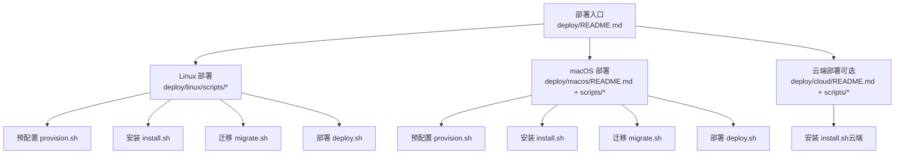
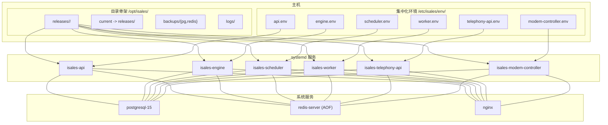
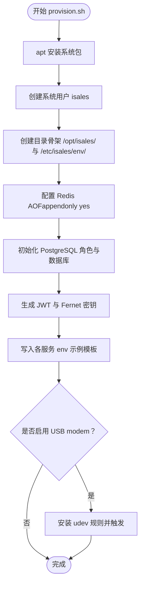
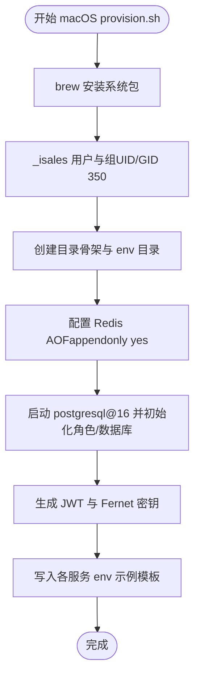
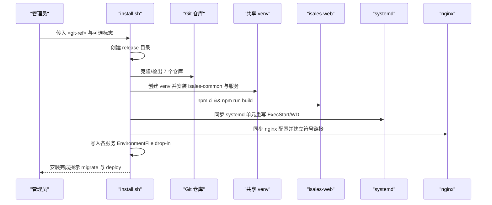
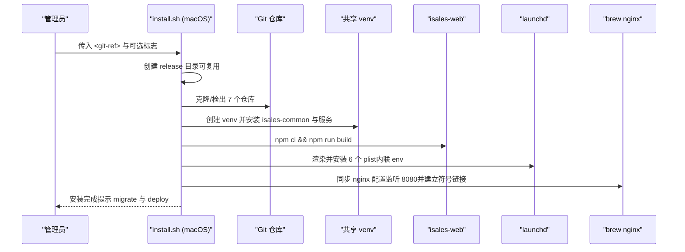
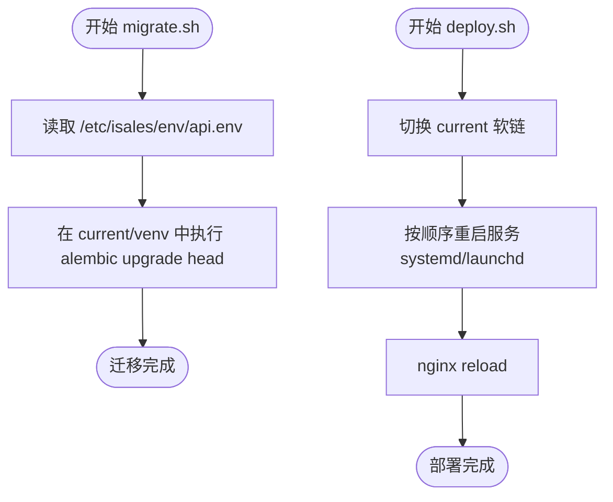
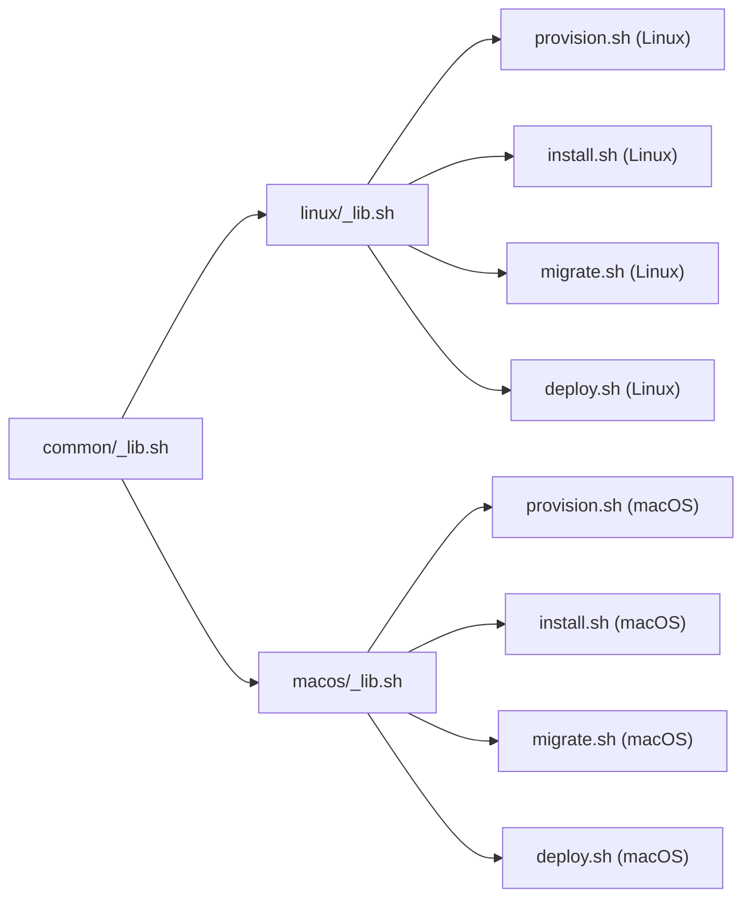

# 首次部署

<cite>
**本文引用的文件**
- [deploy/README.md](file://deploy/README.md)
- [deploy/linux/scripts/provision.sh](file://deploy/linux/scripts/provision.sh)
- [deploy/linux/scripts/install.sh](file://deploy/linux/scripts/install.sh)
- [deploy/linux/scripts/migrate.sh](file://deploy/linux/scripts/migrate.sh)
- [deploy/linux/scripts/deploy.sh](file://deploy/linux/scripts/deploy.sh)
- [deploy/linux/scripts/_lib.sh](file://deploy/linux/scripts/_lib.sh)
- [deploy/macos/README.md](file://deploy/macos/README.md)
- [deploy/macos/scripts/provision.sh](file://deploy/macos/scripts/provision.sh)
- [deploy/macos/scripts/install.sh](file://deploy/macos/scripts/install.sh)
- [deploy/macos/scripts/deploy.sh](file://deploy/macos/scripts/deploy.sh)
- [deploy/macos/scripts/_lib.sh](file://deploy/macos/scripts/_lib.sh)
- [deploy/cloud/README.md](file://deploy/cloud/README.md)
- [deploy/cloud/scripts/install.sh](file://deploy/cloud/scripts/install.sh)
- [deploy/env/api.env.example](file://deploy/env/api.env.example)
- [deploy/env/engine.env.example](file://deploy/env/engine.env.example)
- [deploy/common/_lib.sh](file://deploy/common/_lib.sh)
</cite>

## 目录
1. [简介](#简介)
2. [项目结构](#项目结构)
3. [核心组件](#核心组件)
4. [架构总览](#架构总览)
5. [详细组件分析](#详细组件分析)
6. [依赖关系分析](#依赖关系分析)
7. [性能注意事项](#性能注意事项)
8. [故障排查指南](#故障排查指南)
9. [结论](#结论)
10. [附录](#附录)

## 简介
本指南面向 iSales v1 的首次部署，覆盖从零开始的完整流程，包括系统预配置（Linux systemd 或 macOS launchd）、用户与目录结构、Redis AOF 配置、PostgreSQL 初始化、环境变量配置（API 管理员账户、JWT 密钥、加密密钥）、多服务仓库克隆与 Web 构建、数据库迁移、首次发布部署，以及 Linux 与 macOS 的差异化流程对比。同时提供部署前检查清单、环境准备要求与常见问题解决方案。

## 项目结构
- 部署支持两类单主机模型：
  - Linux + systemd（主线）
  - macOS 14+ + launchd（Apple Silicon 场景）
- 云端拆分形态（cloud-edge split）另提供独立部署说明与脚本。
- 所有部署脚本位于 deploy/linux/scripts/ 与 deploy/macos/scripts/，公共逻辑在 deploy/common/_lib.sh。

图表来源
- [deploy/README.md:1-112](file://deploy/README.md#L1-L112)
- [deploy/linux/scripts/provision.sh:1-224](file://deploy/linux/scripts/provision.sh#L1-L224)
- [deploy/linux/scripts/install.sh:1-275](file://deploy/linux/scripts/install.sh#L1-L275)
- [deploy/linux/scripts/migrate.sh:1-61](file://deploy/linux/scripts/migrate.sh#L1-L61)
- [deploy/linux/scripts/deploy.sh:1-139](file://deploy/linux/scripts/deploy.sh#L1-L139)
- [deploy/macos/README.md:1-98](file://deploy/macos/README.md#L1-L98)
- [deploy/macos/scripts/provision.sh:1-280](file://deploy/macos/scripts/provision.sh#L1-L280)
- [deploy/macos/scripts/install.sh:1-417](file://deploy/macos/scripts/install.sh#L1-L417)
- [deploy/macos/scripts/deploy.sh:1-201](file://deploy/macos/scripts/deploy.sh#L1-L201)
- [deploy/cloud/README.md:1-118](file://deploy/cloud/README.md#L1-L118)
- [deploy/cloud/scripts/install.sh:1-300](file://deploy/cloud/scripts/install.sh#L1-L300)

章节来源
- [deploy/README.md:1-112](file://deploy/README.md#L1-L112)
- [deploy/macos/README.md:1-98](file://deploy/macos/README.md#L1-L98)
- [deploy/cloud/README.md:1-118](file://deploy/cloud/README.md#L1-L118)

## 核心组件
- 预配置（provision）：安装系统包、创建服务用户与目录骨架、配置 Redis AOF、初始化 PostgreSQL 角色与数据库，并生成初始环境变量模板与随机密钥。
- 安装（install）：拉取 7 个服务仓库、创建共享虚拟环境、构建 isales-web、同步 systemd/launchd 单元、写入环境变量 drop-in、安装备份计划。
- 迁移（migrate）：在当前版本运行 alembic 升级。
- 部署（deploy）：原子切换 current 软链并按依赖顺序重启服务，支持低峰窗口与包含/排除 modem 的控制。

章节来源
- [deploy/linux/scripts/provision.sh:1-224](file://deploy/linux/scripts/provision.sh#L1-L224)
- [deploy/linux/scripts/install.sh:1-275](file://deploy/linux/scripts/install.sh#L1-L275)
- [deploy/linux/scripts/migrate.sh:1-61](file://deploy/linux/scripts/migrate.sh#L1-L61)
- [deploy/linux/scripts/deploy.sh:1-139](file://deploy/linux/scripts/deploy.sh#L1-L139)
- [deploy/macos/scripts/provision.sh:1-280](file://deploy/macos/scripts/provision.sh#L1-L280)
- [deploy/macos/scripts/install.sh:1-417](file://deploy/macos/scripts/install.sh#L1-L417)
- [deploy/macos/scripts/deploy.sh:1-201](file://deploy/macos/scripts/deploy.sh#L1-L201)

## 架构总览
下图展示 Linux 单主机部署的目录骨架、服务与中间件的关系，以及 systemd 管理的服务顺序。

图表来源
- [deploy/README.md:14-49](file://deploy/README.md#L14-L49)
- [deploy/linux/scripts/install.sh:128-194](file://deploy/linux/scripts/install.sh#L128-L194)
- [deploy/linux/scripts/deploy.sh:10-13](file://deploy/linux/scripts/deploy.sh#L10-L13)

章节来源
- [deploy/README.md:14-49](file://deploy/README.md#L14-L49)

## 详细组件分析

### 系统预配置（Linux）
- 步骤要点
  - apt 安装系统包（PostgreSQL 15、Redis、Nginx、Git、pkg-config、libudev-dev、libasound2-dev、Python 3.12、Node.js、npm 等）
  - 创建系统用户 isales:isales（无 shell）
  - 创建目录骨架：/opt/isales/releases、backups、logs、/etc/isales/env
  - 配置 Redis AOF（appendonly yes，appendfsync everysec），并确保服务可用
  - 初始化 PostgreSQL：创建角色 isales 与数据库 isales；生成随机 JWT 与 Fernet 密钥；写入各服务的 env 示例模板
  - 可选：安装 USB GSM modem 的 udev 规则（--with-modem）

图表来源
- [deploy/linux/scripts/provision.sh:45-208](file://deploy/linux/scripts/provision.sh#L45-L208)

章节来源
- [deploy/linux/scripts/provision.sh:1-224](file://deploy/linux/scripts/provision.sh#L1-L224)
- [deploy/linux/scripts/_lib.sh:17-38](file://deploy/linux/scripts/_lib.sh#L17-L38)

### 系统预配置（macOS）
- 步骤要点
  - Homebrew 安装系统包（postgresql@16、redis、nginx、python@3.12、node@20、pkg-config、git）
  - 创建系统用户 _isales:_isales（UID/GID 350，隐藏用户）
  - 创建目录骨架与集中化 env 目录
  - 配置 Redis AOF（/opt/homebrew/etc/redis.conf），必要时通过 redis-cli live CONFIG SET 生效
  - 初始化 PostgreSQL（brew postgresql@16 服务需先启动），创建角色与数据库，生成随机密钥并写入 env 模板
  - 通过 dscl 管理用户与组属性，保证幂等性

图表来源
- [deploy/macos/scripts/provision.sh:48-265](file://deploy/macos/scripts/provision.sh#L48-L265)

章节来源
- [deploy/macos/scripts/provision.sh:1-280](file://deploy/macos/scripts/provision.sh#L1-L280)
- [deploy/macos/scripts/_lib.sh:17-68](file://deploy/macos/scripts/_lib.sh#L17-L68)

### 多服务仓库克隆与 Web 构建（Linux）
- install.sh 流程
  - 解析参数与 dry-run/force
  - 创建 release 目录并设置权限
  - 克隆/检出 7 个仓库到 releases/<ts>/
  - 创建共享 venv，pip 安装 isales-common 与 5 个服务
  - npm ci 与 npm run build 生成 isales-web/dist
  - 同步 systemd 单元（重写 ExecStart/WorkingDirectory 指向 current）
  - 同步 nginx 配置并建立 /var/www/isales-web → current/isales-web/dist 符号链接
  - 写入各服务的 EnvironmentFile drop-in（指向 /etc/isales/env/<svc>.env）
  - 安装每日备份 cron

图表来源
- [deploy/linux/scripts/install.sh:15-272](file://deploy/linux/scripts/install.sh#L15-L272)

章节来源
- [deploy/linux/scripts/install.sh:1-275](file://deploy/linux/scripts/install.sh#L1-L275)

### 多服务仓库克隆与 Web 构建（macOS）
- install.sh 流程
  - 解析参数（支持 --skip-clone、--release-dir=...）
  - 若未启用 --skip-clone，则克隆/检出 7 个仓库
  - 使用 $BREW_PREFIX/opt/python@3.12/bin/python3.12 创建 venv，pip 安装 isales-common 与服务（telephony 安装 [macos] extras）
  - npm ci 与 npm run build 生成 isales-web/dist
  - 渲染并安装 6 个 launchd plist，将 /etc/isales/env/<svc>.env 内联到 <EnvironmentVariables>（使用系统 Python3 的 plistlib）
  - 同步 nginx 配置（macOS 下将监听 8080 并重写 docroot 路径），建立符号链接
  - 安装每日备份 launchd 作业

图表来源
- [deploy/macos/scripts/install.sh:21-414](file://deploy/macos/scripts/install.sh#L21-L414)

章节来源
- [deploy/macos/scripts/install.sh:1-417](file://deploy/macos/scripts/install.sh#L1-L417)

### 数据库迁移与首次发布部署
- 迁移（Linux/macOS）
  - migrate.sh 读取 /etc/isales/env/api.env 中的 ISALES_DATABASE_URL，进入 /opt/isales/current/venv 执行 alembic upgrade head
  - 支持 --dry-run 查看历史（history -i）
- 首次发布部署（Linux）
  - deploy.sh 原子切换 current 软链，按依赖顺序重启服务（telephony-api → scheduler → worker → engine → api），nginx reload
  - 支持 --include-modem 重启 modem-controller；低峰窗口限制（默认 22:00–08:00）外需 --force
- 首次发布部署（macOS）
  - deploy.sh 原子切换 current 软链，按依赖顺序重启 launchd 服务（telephony-api → scheduler → worker → engine → api）
  - nginx reload 通过 brew services（user/<uid>）直接 kickstart
  - 支持 --include-modem 重启 modem-controller；低峰窗口限制外需 --force

图表来源
- [deploy/linux/scripts/migrate.sh:32-60](file://deploy/linux/scripts/migrate.sh#L32-L60)
- [deploy/linux/scripts/deploy.sh:70-114](file://deploy/linux/scripts/deploy.sh#L70-L114)
- [deploy/macos/scripts/deploy.sh:79-171](file://deploy/macos/scripts/deploy.sh#L79-L171)

章节来源
- [deploy/linux/scripts/migrate.sh:1-61](file://deploy/linux/scripts/migrate.sh#L1-L61)
- [deploy/linux/scripts/deploy.sh:1-139](file://deploy/linux/scripts/deploy.sh#L1-L139)
- [deploy/macos/scripts/deploy.sh:1-201](file://deploy/macos/scripts/deploy.sh#L1-L201)

### 环境变量配置（API 管理员账户、JWT 密钥、加密密钥）
- provision.sh 会在首次运行时生成随机 JWT 与 Fernet 密钥，并写入 /etc/isales/env/<svc>.env（0640，属主为 root:isales 或 root:isales_group）
- api.env 示例中包含：
  - ISALES_DATABASE_URL：需与 engine/scheduler/worker/telephony-api 保持一致
  - ISALES_REDIS_URL：需与 engine/scheduler/worker 保持一致
  - ISALES_JWT_SECRET：需与 telephony-api 保持一致（HS256 签发/校验对）
  - ISALES_ADMIN_USER：默认 admin
  - ISALES_ADMIN_PASSWORD_HASH：需在首次部署前手动设置为安全的哈希值
- engine.env 示例中包含数据库与 Redis 连接字符串及引擎相关配置项

章节来源
- [deploy/common/_lib.sh:150-180](file://deploy/common/_lib.sh#L150-L180)
- [deploy/linux/scripts/provision.sh:169-186](file://deploy/linux/scripts/provision.sh#L169-L186)
- [deploy/macos/scripts/provision.sh:252-265](file://deploy/macos/scripts/provision.sh#L252-L265)
- [deploy/env/api.env.example:1-14](file://deploy/env/api.env.example#L1-L14)
- [deploy/env/engine.env.example:1-21](file://deploy/env/engine.env.example#L1-L21)

### 云端部署（可选：cloud-edge split）
- 云端仅部署 4 个服务（api/engine/scheduler/worker）与 isales-web，边缘仅部署 modem-controller + audio-bridge
- install.sh（云端）负责：
  - 克隆云端仓库、创建共享 venv、构建 isales-web
  - 安装 DingRTC Linux SDK 至 /opt/isales/vendor/，并在当前 release venv 中编译 pybind11 绑定
  - 同步 systemd 单元、nginx 配置（需要设置 ISALES_DOMAIN 进行域名替换）
  - 写入环境变量 drop-in
  - 支持 --activate 切换 current 并重启服务
- 数据库迁移仍由 deploy/linux/scripts/migrate.sh 在云端执行

章节来源
- [deploy/cloud/README.md:1-118](file://deploy/cloud/README.md#L1-L118)
- [deploy/cloud/scripts/install.sh:1-300](file://deploy/cloud/scripts/install.sh#L1-L300)

## 依赖关系分析
- Linux 与 macOS 的共同点
  - 都使用共享 venv（Linux 与 macOS 均在 releases/<ts>/venv）
  - 都通过 /etc/isales/env/<svc>.env 注入环境变量
  - 都在 install.sh 中同步 nginx 配置并建立符号链接
- 差异点
  - 包管理器：Linux 使用 apt，macOS 使用 brew
  - 服务管理：Linux 使用 systemd，macOS 使用 launchd
  - Redis AOF 配置位置与激活方式不同
  - PostgreSQL 初始化方式与用户/组不同
  - nginx 监听端口与路径差异（macOS 默认 8080）
  - 备份计划：Linux 使用 cron，macOS 使用 launchd

图表来源
- [deploy/common/_lib.sh:1-181](file://deploy/common/_lib.sh#L1-L181)
- [deploy/linux/scripts/_lib.sh:1-47](file://deploy/linux/scripts/_lib.sh#L1-L47)
- [deploy/macos/scripts/_lib.sh:1-69](file://deploy/macos/scripts/_lib.sh#L1-L69)

章节来源
- [deploy/common/_lib.sh:1-181](file://deploy/common/_lib.sh#L1-L181)
- [deploy/linux/scripts/_lib.sh:1-47](file://deploy/linux/scripts/_lib.sh#L1-L47)
- [deploy/macos/scripts/_lib.sh:1-69](file://deploy/macos/scripts/_lib.sh#L1-L69)

## 性能注意事项
- 低峰窗口部署：engine 重启会中断活动通话，deploy.sh 默认限制在 22:00–08:00 之间；超出需 --force
- Redis AOF：每秒 fsync，兼顾持久化与性能；生产建议监控磁盘写入与 AOF 重写
- nginx：Linux 使用 systemd 管理，macOS 使用 brew services；reload 时注意权限与用户上下文
- 数据库连接：ISALES_DATABASE_URL 与 ISALES_REDIS_URL 需在所有服务间保持一致，避免连接抖动

## 故障排查指南
- provision 失败
  - Linux：确认 apt 可用且网络可达；检查 /etc/redis/redis.conf 是否存在 include 指令；PostgreSQL 服务是否可用
  - macOS：确认 Homebrew 安装路径与 SUDO_USER 设置；PostgreSQL@16 服务是否已启动；dscl 操作权限
- install 失败
  - venv 创建失败：检查 Python 3.12 与 venv 是否可用；pip 安装权限
  - Web 构建失败：检查 npm 与 Node 版本；isales-web/package.json 依赖
  - systemd/launchd 同步失败：检查单元文件路径与权限；macOS plist 内联 env 是否成功
- migrate 失败
  - alembic 未找到或不可执行：确认 current/venv 中 alembic 存在；ISALES_DATABASE_URL 是否正确
- deploy 失败
  - 服务未激活：查看 journalctl（Linux）或 log show（macOS）；确认 restart 顺序与低峰窗口
  - nginx 无法 reload：核对配置语法与监听端口；macOS 下 brew nginx 用户上下文

章节来源
- [deploy/linux/scripts/deploy.sh:90-114](file://deploy/linux/scripts/deploy.sh#L90-L114)
- [deploy/macos/scripts/deploy.sh:119-171](file://deploy/macos/scripts/deploy.sh#L119-L171)
- [deploy/linux/scripts/migrate.sh:32-60](file://deploy/linux/scripts/migrate.sh#L32-L60)

## 结论
首次部署的关键在于：先完成系统预配置与数据库初始化，再进行多服务克隆与 Web 构建，随后执行数据库迁移，最后在低峰窗口进行首次发布部署。Linux 与 macOS 的主要差异体现在包管理器、服务管理器、Redis/PostgreSQL 配置细节与 nginx 监听端口上。云端部署（cloud-edge split）将服务拆分为云端与边缘，需单独处理 SDK 与绑定构建。

## 附录

### 部署前检查清单
- Linux
  - Ubuntu 22.04 LTS（amd64），具备 apt 访问能力
  - 系统包：postgresql-15、redis-server、nginx、git、pkg-config、libudev-dev、libasound2-dev、python3.12、python3.12-venv、nodejs、npm
  - 硬盘空间：满足 7 个仓库与 venv、web 构建、日志与备份目录
- macOS
  - macOS 14+（Apple Silicon），Homebrew 安装于 /opt/homebrew
  - 系统包：postgresql@16、redis、nginx、python@3.12、node@20、pkg-config、git
  - 权限：sudo 可用，SUDO_USER 设置正确
- 通用
  - 网络：可访问 GitHub 仓库与外部依赖（npm、pip）
  - 时间：确保系统时间准确（影响日志与 TLS 证书）
  - 环境变量：编辑 /etc/isales/env/api.env，设置 ISALES_ADMIN_USER 与 ISALES_ADMIN_PASSWORD_HASH

### 常用命令示例（Linux）
- 主机预配置
  - sudo bash deploy/linux/scripts/provision.sh
  - 可选：--with-modem 安装 udev 规则
- 编辑环境变量
  - sudoedit /etc/isales/env/api.env
  - 其余服务：/etc/isales/env/{engine,scheduler,worker,telephony-api,modem-controller}.env
- 安装新版本
  - sudo -u isales bash deploy/linux/scripts/install.sh <git-ref>
- 数据库迁移
  - sudo -u isales bash deploy/linux/scripts/migrate.sh
- 首次发布部署
  - sudo bash deploy/linux/scripts/deploy.sh <release-ts>

章节来源
- [deploy/README.md:61-81](file://deploy/README.md#L61-L81)
- [deploy/linux/scripts/provision.sh:1-224](file://deploy/linux/scripts/provision.sh#L1-L224)
- [deploy/linux/scripts/install.sh:1-275](file://deploy/linux/scripts/install.sh#L1-L275)
- [deploy/linux/scripts/migrate.sh:1-61](file://deploy/linux/scripts/migrate.sh#L1-L61)
- [deploy/linux/scripts/deploy.sh:1-139](file://deploy/linux/scripts/deploy.sh#L1-L139)

### 常用命令示例（macOS）
- 主机预配置
  - sudo bash deploy/macos/scripts/provision.sh
- 安装新版本
  - sudo bash deploy/macos/scripts/install.sh <git-ref>
- 数据库迁移
  - sudo bash deploy/macos/scripts/migrate.sh
- 首次发布部署
  - sudo bash deploy/macos/scripts/deploy.sh <release-ts>

章节来源
- [deploy/macos/README.md:48-69](file://deploy/macos/README.md#L48-L69)
- [deploy/macos/scripts/provision.sh:1-280](file://deploy/macos/scripts/provision.sh#L1-L280)
- [deploy/macos/scripts/install.sh:1-417](file://deploy/macos/scripts/install.sh#L1-L417)
- [deploy/macos/scripts/deploy.sh:1-201](file://deploy/macos/scripts/deploy.sh#L1-L201)

### 云端部署（可选）命令示例
- 安装新版本
  - sudo bash deploy/cloud/scripts/install.sh <git-ref>
- 指定域名
  - ISALES_DOMAIN=cloud.isales.example.com bash deploy/cloud/scripts/install.sh <git-ref>
- 激活发布
  - sudo bash deploy/cloud/scripts/install.sh --activate <release-ts>

章节来源
- [deploy/cloud/README.md:69-92](file://deploy/cloud/README.md#L69-L92)
- [deploy/cloud/scripts/install.sh:1-300](file://deploy/cloud/scripts/install.sh#L1-L300)