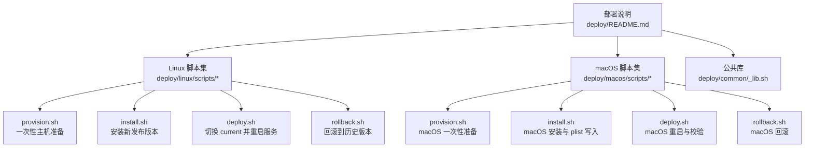
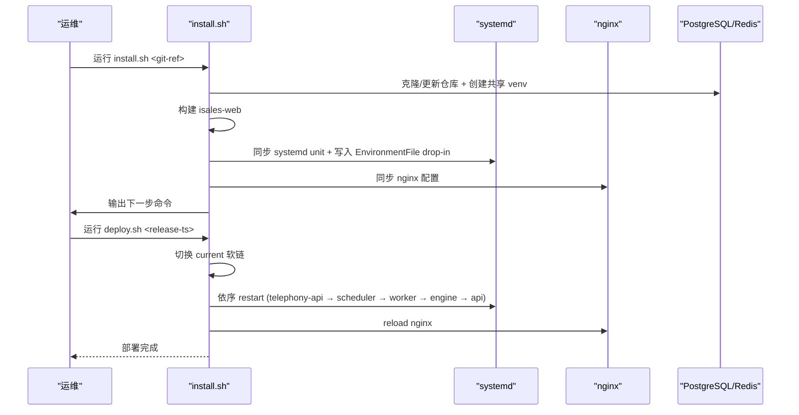
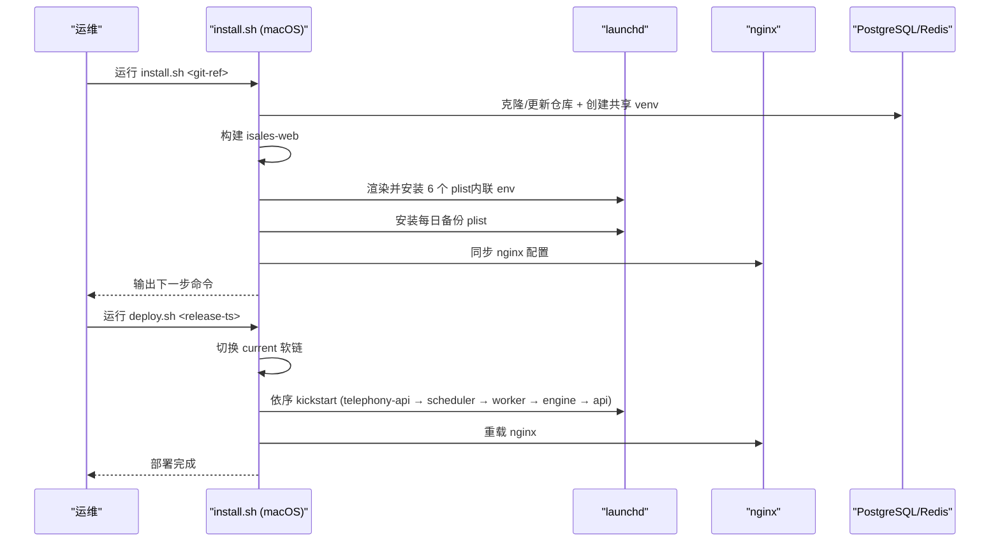
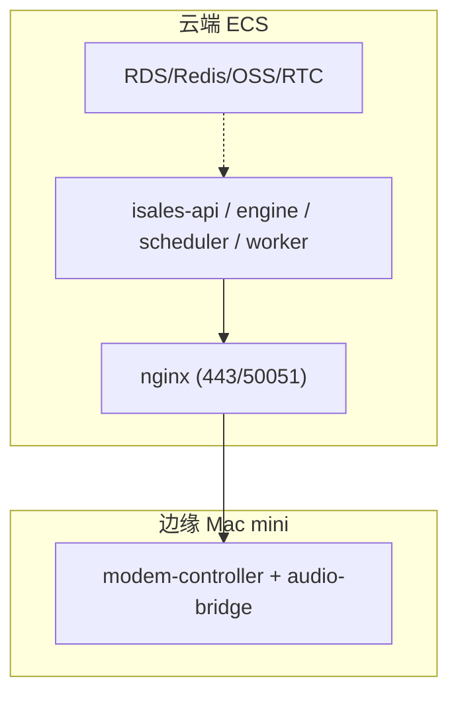
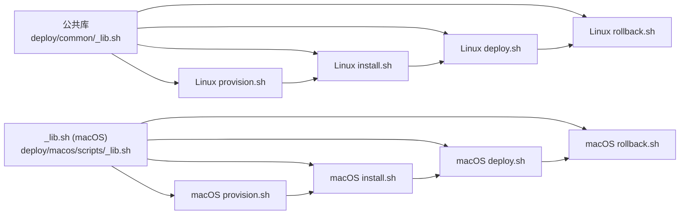

# 部署配置指南

<cite>
**本文档引用的文件**
- [deploy/README.md](file://deploy/README.md)
- [deploy/cloud/README.md](file://deploy/cloud/README.md)
- [deploy/macos/README.md](file://deploy/macos/README.md)
- [deploy/RUNBOOK.md](file://deploy/RUNBOOK.md)
- [deploy/RUNBOOK-cloud.md](file://deploy/RUNBOOK-cloud.md)
- [deploy/RUNBOOK-edge.md](file://deploy/RUNBOOK-edge.md)
- [deploy/linux/scripts/provision.sh](file://deploy/linux/scripts/provision.sh)
- [deploy/linux/scripts/install.sh](file://deploy/linux/scripts/install.sh)
- [deploy/linux/scripts/deploy.sh](file://deploy/linux/scripts/deploy.sh)
- [deploy/linux/scripts/rollback.sh](file://deploy/linux/scripts/rollback.sh)
- [deploy/macos/scripts/provision.sh](file://deploy/macos/scripts/provision.sh)
- [deploy/macos/scripts/install.sh](file://deploy/macos/scripts/install.sh)
- [deploy/macos/scripts/deploy.sh](file://deploy/macos/scripts/deploy.sh)
- [deploy/macos/scripts/rollback.sh](file://deploy/macos/scripts/rollback.sh)
- [deploy/common/_lib.sh](file://deploy/common/_lib.sh)
- [deploy/macos/scripts/_lib.sh](file://deploy/macos/scripts/_lib.sh)
</cite>

## 目录
1. [简介](#简介)
2. [项目结构](#项目结构)
3. [核心组件](#核心组件)
4. [架构总览](#架构总览)
5. [详细组件分析](#详细组件分析)
6. [依赖关系分析](#依赖关系分析)
7. [性能考虑](#性能考虑)
8. [故障排查指南](#故障排查指南)
9. [结论](#结论)
10. [附录](#附录)

## 简介
本指南面向运维工程师，提供 iSales v1 生产环境的完整部署配置说明，覆盖 Linux systemd 与 macOS Apple Silicon 两种部署模型。内容包括部署前准备、环境变量配置、服务管理、监控设置、日常发版与回滚、备份恢复、故障排查等。文档严格基于仓库中的部署脚本与运行手册，确保操作可追溯、可复现。

## 项目结构
iSales 部署相关的核心目录与文件：
- deploy/README.md：总体部署说明与拓扑
- deploy/cloud/：云-边分离形态的部署说明与脚本
- deploy/macos/：macOS 部署说明与脚本
- deploy/RUNBOOK.md：单主机（Linux）运维手册
- deploy/RUNBOOK-cloud.md：云-边形态运维手册
- deploy/RUNBOOK-edge.md：边缘 Mac mini 运维手册
- deploy/linux/scripts/*：Linux 部署脚本（provision/install/deploy/rollback）
- deploy/macos/scripts/*：macOS 部署脚本（provision/install/deploy/rollback）
- deploy/common/_lib.sh：跨平台公共函数库
- deploy/macos/scripts/_lib.sh：macOS 特定常量与校验

**图表来源**
- [deploy/README.md:12-112](file://deploy/README.md#L12-L112)
- [deploy/linux/scripts/provision.sh:1-224](file://deploy/linux/scripts/provision.sh#L1-L224)
- [deploy/linux/scripts/install.sh:1-275](file://deploy/linux/scripts/install.sh#L1-L275)
- [deploy/linux/scripts/deploy.sh:1-139](file://deploy/linux/scripts/deploy.sh#L1-L139)
- [deploy/linux/scripts/rollback.sh:1-114](file://deploy/linux/scripts/rollback.sh#L1-L114)
- [deploy/macos/scripts/provision.sh:1-280](file://deploy/macos/scripts/provision.sh#L1-L280)
- [deploy/macos/scripts/install.sh:1-417](file://deploy/macos/scripts/install.sh#L1-L417)
- [deploy/macos/scripts/deploy.sh:1-201](file://deploy/macos/scripts/deploy.sh#L1-L201)
- [deploy/macos/scripts/rollback.sh:1-129](file://deploy/macos/scripts/rollback.sh#L1-L129)

**章节来源**
- [deploy/README.md:12-112](file://deploy/README.md#L12-L112)

## 核心组件
- 服务管理
  - Linux：systemd 单主机模型，7 个服务进程与系统服务（PostgreSQL、Redis、nginx）统一管理
  - macOS：launchd 模型，6 个服务进程与系统服务（PostgreSQL@16、Redis、nginx）统一管理
- 发布与原子切换
  - install.sh：克隆/更新 7 个仓库、创建共享虚拟环境、构建前端、同步 systemd/launchd 配置
  - deploy.sh/rollback.sh：通过 /opt/isales/current 原子软链接切换，按依赖顺序重启服务
- 环境变量与集中化
  - /etc/isales/env/ 下的 *.env 文件集中注入各服务（Linux 使用 EnvironmentFile，macOS 使用 plist 内联）
- 备份与恢复
  - Linux：cron 定时备份 PostgreSQL 与 Redis
  - macOS：launchd 计划任务每日备份
- 监控与告警
  - 提供 Prometheus/Grafana 配置模板与告警规则示例

**章节来源**
- [deploy/README.md:14-112](file://deploy/README.md#L14-L112)
- [deploy/cloud/README.md:10-118](file://deploy/cloud/README.md#L10-L118)
- [deploy/macos/README.md:7-98](file://deploy/macos/README.md#L7-L98)
- [deploy/RUNBOOK.md:17-394](file://deploy/RUNBOOK.md#L17-L394)
- [deploy/RUNBOOK-cloud.md:446-457](file://deploy/RUNBOOK-cloud.md#L446-L457)

## 架构总览
iSales v1 支持两种单主机部署模型，目录骨架与 env 模板一致，差异在于服务管理与包管理器。

```mermaid
graph TB
subgraph "Linux 单主机"
L1["systemd 进程<br/>isales-api / engine / scheduler / worker / telephony-api / modem-controller"]
L2["系统服务<br/>postgresql-15 / redis-server / nginx"]
L3["目录布局<br/>/opt/isales/releases/current/backups/logs<br/>/etc/isales/env/*.env"]
end
subgraph "macOS 单主机"
M1["launchd 进程<br/>com.isales.api / engine / scheduler / worker / telephony-api / modem-controller"]
M2["系统服务<br/>postgresql@16 / redis / nginx"]
M3["目录布局<br/>/opt/isales/releases/current/backups/logs<br/>/etc/isales/env/*.env"]
end
subgraph "云-边分离ECS"
C1["云端服务<br/>isales-api / engine / scheduler / worker"]
C2["托管中间件<br/>RDS/Redis/OSS/RTC"]
C3["反向代理<br/>nginx (443/50051)"]
end
L1 --> L2 --> L3
M1 --> M2 --> M3
C1 --> C2 --> C3
```

**图表来源**
- [deploy/README.md:14-49](file://deploy/README.md#L14-L49)
- [deploy/macos/README.md:9-32](file://deploy/macos/README.md#L9-L32)
- [deploy/cloud/README.md:12-53](file://deploy/cloud/README.md#L12-L53)

## 详细组件分析

### Linux 部署流程
- 主机准备（一次性）
  - apt 包安装、创建 isales 用户、目录骨架、Redis AOF、PostgreSQL 初始化与随机密钥生成
  - 可选安装 udev 规则（modem 相关）
- 安装新发布版本
  - 克隆/更新 7 个仓库、创建共享虚拟环境、构建前端
  - 同步 systemd unit、写入 EnvironmentFile drop-in、同步 nginx 配置、安装备份 cron
- 切换与重启
  - 原子切换 current 软链，按依赖顺序重启服务，nginx 重载
  - 低峰窗口限制：默认 22:00–08:00，engine 重启会丢弃活动通话
- 回滚
  - 切换 current 软链，按相同顺序重启服务，不触碰数据库 schema

**图表来源**
- [deploy/linux/scripts/install.sh:154-173](file://deploy/linux/scripts/install.sh#L154-L173)
- [deploy/linux/scripts/install.sh:196-236](file://deploy/linux/scripts/install.sh#L196-L236)
- [deploy/linux/scripts/install.sh:175-194](file://deploy/linux/scripts/install.sh#L175-L194)
- [deploy/linux/scripts/deploy.sh:80-114](file://deploy/linux/scripts/deploy.sh#L80-L114)

**章节来源**
- [deploy/linux/scripts/provision.sh:13-224](file://deploy/linux/scripts/provision.sh#L13-L224)
- [deploy/linux/scripts/install.sh:15-275](file://deploy/linux/scripts/install.sh#L15-L275)
- [deploy/linux/scripts/deploy.sh:10-139](file://deploy/linux/scripts/deploy.sh#L10-L139)
- [deploy/linux/scripts/rollback.sh:1-114](file://deploy/linux/scripts/rollback.sh#L1-L114)

### macOS 部署流程（Apple Silicon）
- 主机准备（一次性）
  - Homebrew 包安装、创建 _isales 用户、目录骨架、Redis AOF、PostgreSQL 初始化与随机密钥生成
- 安装新发布版本
  - 克隆/更新 7 个仓库、创建共享虚拟环境、构建前端
  - 渲染并安装 6 个 launchd plist（将 /etc/isales/env/<svc>.env 内联到 EnvironmentVariables）、安装每日备份 plist、同步 nginx 配置
- 切换与重启
  - 原子切换 current 软链，按依赖顺序 kickstart 服务，nginx 通过 launchctl 重载
  - 低峰窗口限制与 Linux 相同
- 回滚
  - 切换 current 软链，按相同顺序 kickstart 服务，nginx 重载

**图表来源**
- [deploy/macos/scripts/install.sh:188-320](file://deploy/macos/scripts/install.sh#L188-L320)
- [deploy/macos/scripts/deploy.sh:89-171](file://deploy/macos/scripts/deploy.sh#L89-L171)

**章节来源**
- [deploy/macos/scripts/provision.sh:18-280](file://deploy/macos/scripts/provision.sh#L18-L280)
- [deploy/macos/scripts/install.sh:21-417](file://deploy/macos/scripts/install.sh#L21-L417)
- [deploy/macos/scripts/deploy.sh:17-201](file://deploy/macos/scripts/deploy.sh#L17-L201)
- [deploy/macos/scripts/rollback.sh:1-129](file://deploy/macos/scripts/rollback.sh#L1-L129)

### 云-边分离（ECS）部署
- 拓扑与依赖
  - 云端：isales-api/engine/scheduler/worker + nginx（443/50051 反代）
  - 中间件：RDS/Redis/OSS/RTC（阿里云）
  - 边缘：Mac mini 上的 modem-controller + audio-bridge
- 资源开通与入口
  - ECS、VPC/安全组、RDS/Redis/OSS、RTC 应用
  - v1.0 默认 IP 直连，后续可切换到域名 + Let's Encrypt
- 首次部署与发版
  - provision.sh（单主机逻辑复用）+ install.sh（含 DingRTC SDK 安装）+ migrate.sh + activate
  - 前端独立发版：仅替换静态工件并 reload nginx
- 调试与监控
  - gRPC 流连通性、keepalive 配置、告警指标（边缘离线、重连风暴、音频反压、引擎延迟）

**图表来源**
- [deploy/cloud/README.md:12-53](file://deploy/cloud/README.md#L12-L53)
- [deploy/RUNBOOK-cloud.md:123-172](file://deploy/RUNBOOK-cloud.md#L123-L172)

**章节来源**
- [deploy/cloud/README.md:10-118](file://deploy/cloud/README.md#L10-L118)
- [deploy/RUNBOOK-cloud.md:1-599](file://deploy/RUNBOOK-cloud.md#L1-599)

### 环境变量与配置
- Linux
  - /etc/isales/env/*.env 通过 systemd EnvironmentFile 注入
  - provision.sh 一次性生成随机密钥并写入 api/engine/scheduler/worker/telephony-api/modem-controller 的 env 模板
- macOS
  - install.sh 将 /etc/isales/env/*.env 解析后内联到 /Library/LaunchDaemons/com.isales.<svc>.plist 的 EnvironmentVariables 字典
  - 编辑 env 后需重新 install.sh 或 bootout/bootstrap 该 plist 才生效
- 云-边形态
  - engine.env 需要 RTC AppId/AppKey、Fernet 主密钥、gRPC 绑定地址等
  - provider 凭据迁移到 DB SSOT，env 中仅保留主密钥

**章节来源**
- [deploy/linux/scripts/provision.sh:129-186](file://deploy/linux/scripts/provision.sh#L129-L186)
- [deploy/macos/scripts/install.sh:204-237](file://deploy/macos/scripts/install.sh#L204-L237)
- [deploy/RUNBOOK-cloud.md:129-142](file://deploy/RUNBOOK-cloud.md#L129-L142)

### 备份与恢复
- Linux
  - cron 定时备份 PostgreSQL 与 Redis，保留 14 天
  - 恢复演练：分离实例还原 + 校验 alembic 版本与表行数
- macOS
  - launchd 计划任务每日备份，日志通过 unified logging 标记
  - 恢复演练：brew psql/pg_restore + redis-cli 替换 dump.rdb
- 云-边
  - RDS/Redis/OSS 备份链路验证，OSS 跨地域复制与版本化策略

**章节来源**
- [deploy/RUNBOOK.md:118-160](file://deploy/RUNBOOK.md#L118-L160)
- [deploy/RUNBOOK.md:312-342](file://deploy/RUNBOOK.md#L312-L342)
- [deploy/RUNBOOK-cloud.md:300-323](file://deploy/RUNBOOK-cloud.md#L300-L323)

### 监控与告警
- Prometheus/Grafana 配置模板与告警规则示例
- 关键指标（云-边形态）
  - 边缘设备离线、重连风暴
  - RTC 推流反压、引擎管道延迟预算
- 低峰窗口与健康检查
  - deploy.sh 在低峰窗口外拒绝 engine 重启，需 --force
  - 首次部署与回滚后进行 smoke test

**章节来源**
- [deploy/RUNBOOK.md:200-217](file://deploy/RUNBOOK.md#L200-L217)
- [deploy/RUNBOOK-cloud.md:446-457](file://deploy/RUNBOOK-cloud.md#L446-L457)

## 依赖关系分析

**图表来源**
- [deploy/common/_lib.sh:1-181](file://deploy/common/_lib.sh#L1-L181)
- [deploy/macos/scripts/_lib.sh:1-69](file://deploy/macos/scripts/_lib.sh#L1-L69)
- [deploy/linux/scripts/provision.sh:25-26](file://deploy/linux/scripts/provision.sh#L25-L26)
- [deploy/linux/scripts/install.sh:30-31](file://deploy/linux/scripts/install.sh#L30-L31)
- [deploy/linux/scripts/deploy.sh:21-22](file://deploy/linux/scripts/deploy.sh#L21-L22)
- [deploy/linux/scripts/rollback.sh:18-19](file://deploy/linux/scripts/rollback.sh#L18-L19)
- [deploy/macos/scripts/provision.sh:28-30](file://deploy/macos/scripts/provision.sh#L28-L30)
- [deploy/macos/scripts/install.sh:38-41](file://deploy/macos/scripts/install.sh#L38-L41)
- [deploy/macos/scripts/deploy.sh:28-30](file://deploy/macos/scripts/deploy.sh#L28-L30)
- [deploy/macos/scripts/rollback.sh:22-24](file://deploy/macos/scripts/rollback.sh#L22-L24)

**章节来源**
- [deploy/common/_lib.sh:50-104](file://deploy/common/_lib.sh#L50-L104)
- [deploy/macos/scripts/_lib.sh:57-69](file://deploy/macos/scripts/_lib.sh#L57-L69)

## 性能考虑
- 低峰窗口
  - deploy.sh 默认 22:00–08:00 重启 engine，避免影响通话；其他服务重启顺序保证依赖链
- 系统资源
  - Redis AOF 持久化（everysec）降低刷盘开销
  - nginx 作为反向代理，静态资源由 isales-web 构建产物提供
- 云-边形态
  - gRPC keepalive 参数与网络设备 idle-timeout 配置，确保长连接稳定
  - RTC SDK 与媒体面分离，减少 CPU 占用

[本节为通用指导，无需特定文件引用]

## 故障排查指南
- Linux
  - PostgreSQL/Redis/网络问题：systemctl 状态、journalctl 日志、磁盘空间
  - modem-controller 设备断连：udev 事件、USB 重插、日志检查
  - API 登录失败：核对 ISALES_ADMIN_PASSWORD_HASH（bcrypt）
  - JWT 不匹配：核对 ISALES_JWT_SECRET 一致性
  - 备份未运行：检查 cron 状态与日志标签
- macOS
  - brew 服务/launchd 服务：brew services list、launchctl print、日志查看
  - USB modem 识别：ioreg/system_profiler、串口占用（usbmuxd/commcenter）
  - Core Audio：设备列表查询、ISALES_AUDIO_DEVICE_NAME 设置
  - nginx 权限：端口 8080 或 root 权限
- 云-边
  - gRPC 流连通性：grpcurl 测试、nginx 50051 访问日志
  - RTC 房间探测：DingRTC SDK 绑定的 PCM 监听脚本
  - 证书续期：certbot renew --dry-run

**章节来源**
- [deploy/RUNBOOK.md:163-197](file://deploy/RUNBOOK.md#L163-L197)
- [deploy/RUNBOOK.md:345-381](file://deploy/RUNBOOK.md#L345-L381)
- [deploy/RUNBOOK-cloud.md:584-599](file://deploy/RUNBOOK-cloud.md#L584-L599)

## 结论
本指南基于仓库中的部署脚本与运行手册，提供了 Linux systemd 与 macOS Apple Silicon 的完整部署操作手册，并补充了云-边分离形态的运维要点。通过标准化的 provision/install/deploy/rollback 流程、集中化环境变量管理、自动化备份与监控配置，可确保 iSales v1 在生产环境的稳定交付与持续演进。

[本节为总结性内容，无需特定文件引用]

## 附录

### 部署前准备与依赖检查
- Linux
  - Ubuntu 22.04 LTS（amd64）、Python 3.12、Node.js ≥ 20、系统包（postgresql-15/redis-server/nginx/git/pkg-config/libudev-dev/libasound2-dev）
  - 一次性 provision.sh：apt 包、isales 用户、目录骨架、Redis AOF、PostgreSQL 初始化
- macOS
  - macOS 14+（Apple Silicon）、Homebrew、Python@3.12、Node@20、系统包（postgresql@16/redis/nginx/pkg-config/git）
  - 一次性 provision.sh：brew 包、_isales 用户、目录骨架、Redis AOF、PostgreSQL 初始化
- 云-边
  - ECS、VPC/安全组、RDS/Redis/OSS、RTC 应用
  - DingRTC SDK 上传 OSS、vendor layout 校验

**章节来源**
- [deploy/README.md:51-66](file://deploy/README.md#L51-L66)
- [deploy/macos/README.md:34-46](file://deploy/macos/README.md#L34-L46)
- [deploy/RUNBOOK-cloud.md:23-57](file://deploy/RUNBOOK-cloud.md#L23-L57)

### 日常发版与回滚流程
- Linux
  - install.sh → migrate.sh → deploy.sh（低峰窗口）
  - rollback.sh 列表/回滚，不触碰 schema
- macOS
  - install.sh → migrate.sh → deploy.sh（低峰窗口）
  - rollback.sh 列表/回滚，不触碰 schema
- 云-边
  - install.sh（含 DingRTC SDK）→ migrate.sh → activate
  - 前端独立发版：构建 + scp + nginx reload

**章节来源**
- [deploy/RUNBOOK.md:56-81](file://deploy/RUNBOOK.md#L56-L81)
- [deploy/RUNBOOK.md:270-293](file://deploy/RUNBOOK.md#L270-L293)
- [deploy/RUNBOOK-cloud.md:230-279](file://deploy/RUNBOOK-cloud.md#L230-L279)

### 环境变量配置要点
- Linux
  - /etc/isales/env/*.env（EnvironmentFile=）
  - provision.sh 生成随机密钥（PG 密码/JWT/Fernet），需手动设置管理员账号与密码哈希
- macOS
  - /etc/isales/env/*.env 内联到 plist 的 EnvironmentVariables
  - 编辑 env 后需重新 install.sh 或 bootout/bootstrap
- 云-边
  - engine.env：ISALES_ENGINE_CLOUD_EDGE_GRPC_BIND、RTC AppId/AppKey、Fernet 主密钥
  - provider 凭据：DB SSOT，env 仅保留主密钥

**章节来源**
- [deploy/linux/scripts/provision.sh:129-186](file://deploy/linux/scripts/provision.sh#L129-L186)
- [deploy/macos/scripts/install.sh:204-237](file://deploy/macos/scripts/install.sh#L204-L237)
- [deploy/RUNBOOK-cloud.md:129-142](file://deploy/RUNBOOK-cloud.md#L129-L142)

### 监控与告警配置
- Prometheus/Grafana 配置模板与告警规则示例
- 云-边关键指标：边缘离线、重连风暴、RTC 推流反压、引擎管道延迟预算
- 建议：至少 2/4 告警具备实际目标阈值，其余为 TODO

**章节来源**
- [deploy/RUNBOOK-cloud.md:446-457](file://deploy/RUNBOOK-cloud.md#L446-L457)