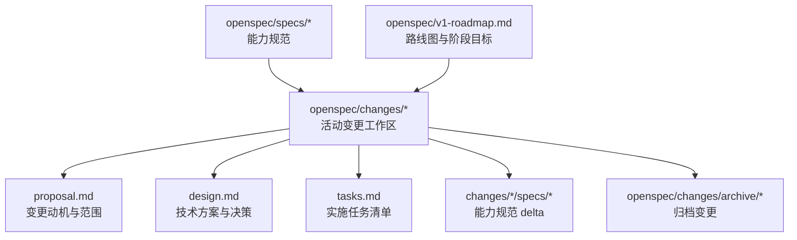
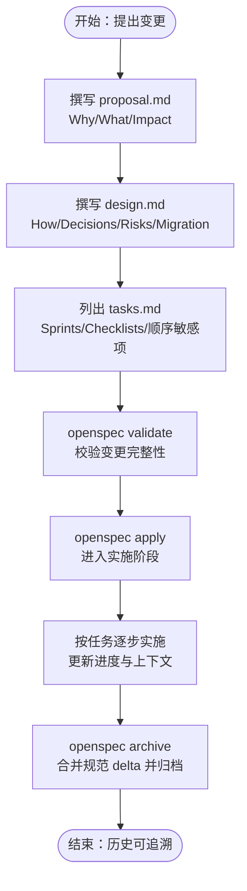
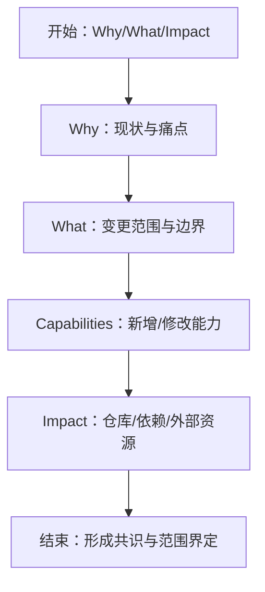
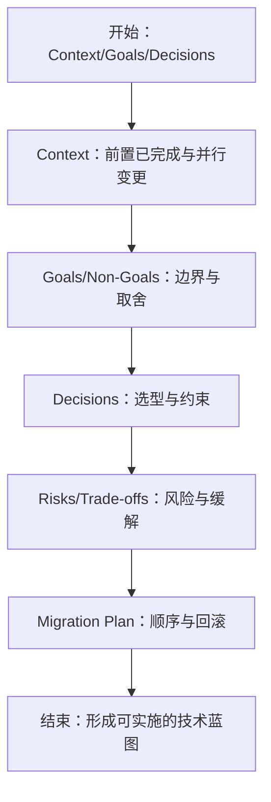
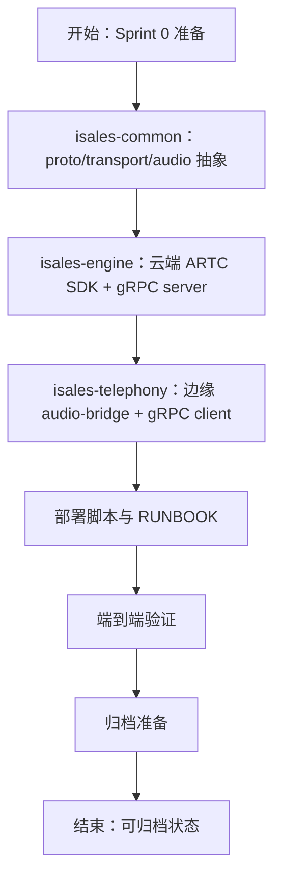
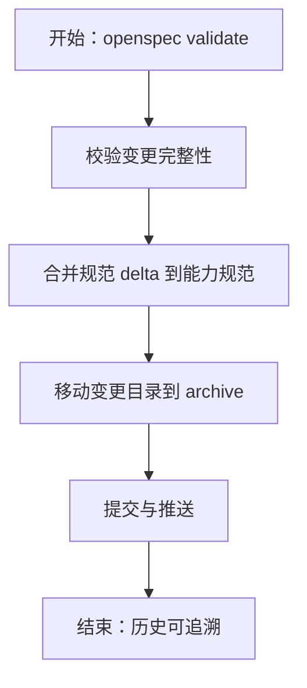
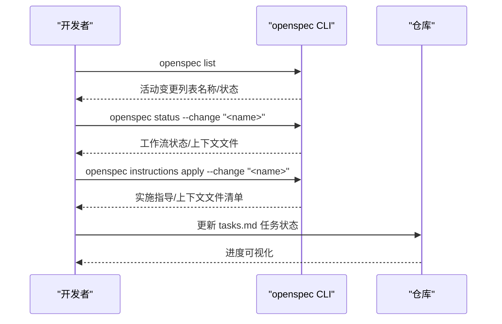
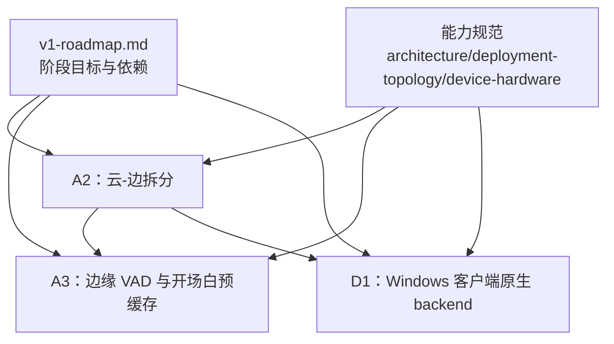

# OpenSpec 工作流程

<cite>
**本文引用的文件**
- [openspec/changes/arch-cloud-edge-split/.openspec.yaml](file://openspec/changes/arch-cloud-edge-split/.openspec.yaml)
- [openspec/changes/arch-cloud-edge-split/proposal.md](file://openspec/changes/arch-cloud-edge-split/proposal.md)
- [openspec/changes/arch-cloud-edge-split/design.md](file://openspec/changes/arch-cloud-edge-split/design.md)
- [openspec/changes/arch-cloud-edge-split/tasks.md](file://openspec/changes/arch-cloud-edge-split/tasks.md)
- [openspec/specs/architecture/spec.md](file://openspec/specs/architecture/spec.md)
- [openspec/changes/campaign-fixed-greeting/.openspec.yaml](file://openspec/changes/campaign-fixed-greeting/.openspec.yaml)
- [openspec/changes/campaign-fixed-greeting/proposal.md](file://openspec/changes/campaign-fixed-greeting/proposal.md)
- [openspec/changes/campaign-fixed-greeting/design.md](file://openspec/changes/campaign-fixed-greeting/design.md)
- [openspec/changes/campaign-fixed-greeting/tasks.md](file://openspec/changes/campaign-fixed-greeting/tasks.md)
- [openspec/v1-roadmap.md](file://openspec/v1-roadmap.md)
- [.claude/skills/openspec-propose/SKILL.md](file://.claude/skills/openspec-propose/SKILL.md)
- [.claude/skills/openspec-apply-change/SKILL.md](file://.claude/skills/openspec-apply-change/SKILL.md)
- [.claude/skills/openspec-explore/SKILL.md](file://.claude/skills/openspec-explore/SKILL.md)
</cite>

## 目录
1. [简介](#简介)
2. [项目结构](#项目结构)
3. [核心组件](#核心组件)
4. [架构总览](#架构总览)
5. [详细组件分析](#详细组件分析)
6. [依赖分析](#依赖分析)
7. [性能考量](#性能考量)
8. [故障排查指南](#故障排查指南)
9. [结论](#结论)
10. [附录](#附录)

## 简介
本文件系统化阐述 iSales 系统的 OpenSpec 工作流程，围绕“规范驱动开发”的理念，给出从变更提案到归档的完整生命周期，包括变更（Change）、设计（Design）、任务（Tasks）、归档（Archive）四阶段的协同机制。文档还总结了 active changes 的管理与跟踪方法、常用 OpenSpec 命令的使用指南、变更历史与版本控制策略、规范编写标准与最佳实践，帮助开发者高效参与系统的规范制定与演进。

## 项目结构
OpenSpec 在仓库中的组织遵循“能力规范 + 变更提案 + 实施任务”的分层结构：
- openspec/specs：能力规范（Capability Specs），描述系统能力边界与要求
- openspec/changes：变更工作区，包含 proposal、design、tasks 以及各能力下的 spec delta
- openspec/changes/archive：已归档的变更，包含历史版本与合并后的规范
- openspec/v1-roadmap.md：整体路线图与阶段目标，串联多个 OpenSpec 变更

**图表来源**
- [openspec/specs/architecture/spec.md](file://openspec/specs/architecture/spec.md)
- [openspec/changes/arch-cloud-edge-split/proposal.md](file://openspec/changes/arch-cloud-edge-split/proposal.md)
- [openspec/changes/arch-cloud-edge-split/design.md](file://openspec/changes/arch-cloud-edge-split/design.md)
- [openspec/changes/arch-cloud-edge-split/tasks.md](file://openspec/changes/arch-cloud-edge-split/tasks.md)
- [openspec/v1-roadmap.md](file://openspec/v1-roadmap.md)

**章节来源**
- [openspec/specs/architecture/spec.md](file://openspec/specs/architecture/spec.md)
- [openspec/changes/arch-cloud-edge-split/proposal.md](file://openspec/changes/arch-cloud-edge-split/proposal.md)
- [openspec/changes/arch-cloud-edge-split/design.md](file://openspec/changes/arch-cloud-edge-split/design.md)
- [openspec/changes/arch-cloud-edge-split/tasks.md](file://openspec/changes/arch-cloud-edge-split/tasks.md)
- [openspec/v1-roadmap.md](file://openspec/v1-roadmap.md)

## 核心组件
- 规范（Specs）
  - 以能力为单位的规范文档，定义系统能力边界、要求与约束，是设计与实现的依据
  - 示例：architecture、deployment-topology、device-hardware、service-communication 等
- 变更（Changes）
  - 从 proposal 到 design、再到 tasks 的完整工作流，确保每次改动都有据可依
- 归档（Archive）
  - 变更完成后，将相关规范 delta 合并回能力规范，并迁移至 archive 目录，形成历史可追溯的版本

**章节来源**
- [openspec/specs/architecture/spec.md](file://openspec/specs/architecture/spec.md)
- [openspec/changes/arch-cloud-edge-split/proposal.md](file://openspec/changes/arch-cloud-edge-split/proposal.md)
- [openspec/changes/arch-cloud-edge-split/design.md](file://openspec/changes/arch-cloud-edge-split/design.md)
- [openspec/changes/arch-cloud-edge-split/tasks.md](file://openspec/changes/arch-cloud-edge-split/tasks.md)

## 架构总览
OpenSpec 工作流以“规范驱动”为核心，强调“先规范、后实现、可追溯”。下图展示了从变更提案到归档的端到端流程：

**图表来源**
- [.claude/skills/openspec-propose/SKILL.md](file://.claude/skills/openspec-propose/SKILL.md)
- [.claude/skills/openspec-apply-change/SKILL.md](file://.claude/skills/openspec-apply-change/SKILL.md)
- [.claude/skills/openspec-explore/SKILL.md](file://.claude/skills/openspec-explore/SKILL.md)

## 详细组件分析

### 变更提案（Proposal）
- 目的：阐明“为什么需要这个变更”、“变更内容是什么”、“对仓库与依赖的影响”
- 关键要素：Why（背景与动机）、What（变更范围与影响面）、Capabilities（新增/修改的能力）、Impact（仓库/依赖/外部资源）
- 示例：云-边拆分变更的 proposal 明确了部署拓扑变更、新增云-边控制面与媒体面、端到端时延预算等

**图表来源**
- [openspec/changes/arch-cloud-edge-split/proposal.md](file://openspec/changes/arch-cloud-edge-split/proposal.md)

**章节来源**
- [openspec/changes/arch-cloud-edge-split/proposal.md](file://openspec/changes/arch-cloud-edge-split/proposal.md)

### 设计（Design）
- 目的：给出“如何实现”的技术方案，记录关键决策、权衡、风险与迁移计划
- 关键要素：Context（背景与前置条件）、Goals/Non-Goals（目标与非目标）、Decisions（关键决策）、Risks/Trade-offs（风险与权衡）、Migration Plan（迁移与回滚）
- 示例：云-边拆分变更的 design 明确了阿里 RTC PaaS 选型、云-边音频拓扑、gRPC 控制面协议、端到端时延预算与工程实施顺序

**图表来源**
- [openspec/changes/arch-cloud-edge-split/design.md](file://openspec/changes/arch-cloud-edge-split/design.md)

**章节来源**
- [openspec/changes/arch-cloud-edge-split/design.md](file://openspec/changes/arch-cloud-edge-split/design.md)

### 任务（Tasks）
- 目的：将设计转化为可执行的任务清单，标注 Sprint 顺序、依赖与顺序敏感项
- 关键要素：Sprint 0 准备、公共抽象（proto/transport/audio）、云端/边缘实现、部署脚本、端到端验证、归档准备
- 示例：云-边拆分变更的 tasks 明确了 isales-common 的 proto 定义、云端 ARTC SDK 接入、边缘 audio-bridge 与 gRPC client、部署脚本与 RUNBOOK、端到端验证与归档准备

**图表来源**
- [openspec/changes/arch-cloud-edge-split/tasks.md](file://openspec/changes/arch-cloud-edge-split/tasks.md)

**章节来源**
- [openspec/changes/arch-cloud-edge-split/tasks.md](file://openspec/changes/arch-cloud-edge-split/tasks.md)

### 归档（Archive）
- 目的：将变更相关的规范 delta 合并回能力规范，并迁移至 archive 目录，形成历史版本
- 关键要素：openspec validate 校验、合并规范 delta、移动变更目录、提交与推送
- 示例：campaign-fixed-greeting 变更在归档时将 data-model 与 web-admin-ui 的规范变更合并回对应能力规范，并移动到 archive 目录

**图表来源**
- [openspec/changes/campaign-fixed-greeting/tasks.md](file://openspec/changes/campaign-fixed-greeting/tasks.md)

**章节来源**
- [openspec/changes/campaign-fixed-greeting/tasks.md](file://openspec/changes/campaign-fixed-greeting/tasks.md)

### active changes 的管理与跟踪
- 使用 openspec list 查看活动变更列表及其状态
- 使用 openspec status 查看具体变更的工作流状态与上下文文件
- 使用 openspec instructions apply 获取当前变更的实施指导与上下文文件清单
- 在 tasks.md 中以勾选标记任务完成情况，形成可视化进度

**图表来源**
- [.claude/skills/openspec-explore/SKILL.md](file://.claude/skills/openspec-explore/SKILL.md)
- [.claude/skills/openspec-apply-change/SKILL.md](file://.claude/skills/openspec-apply-change/SKILL.md)

**章节来源**
- [.claude/skills/openspec-explore/SKILL.md](file://.claude/skills/openspec-explore/SKILL.md)
- [.claude/skills/openspec-apply-change/SKILL.md](file://.claude/skills/openspec-apply-change/SKILL.md)

### 常用 OpenSpec 命令使用指南
- openspec list
  - 用途：列出活动变更，便于快速掌握当前工作重点
  - 输出：变更名称、schema、状态等
- openspec status
  - 用途：查看具体变更的工作流状态与上下文文件
  - 输出：schema 名称、任务所在文件、进度等
- openspec instructions apply
  - 用途：获取当前变更的实施指导与上下文文件清单
  - 输出：动态指令、上下文文件路径、任务进度
- openspec validate
  - 用途：校验变更完整性，确保 proposal/design/tasks 等文件齐全
- openspec archive
  - 用途：合并规范 delta 并归档变更目录
  - 输出：合并后的规范、目录迁移、历史版本

**章节来源**
- [.claude/skills/openspec-propose/SKILL.md](file://.claude/skills/openspec-propose/SKILL.md)
- [.claude/skills/openspec-apply-change/SKILL.md](file://.claude/skills/openspec-apply-change/SKILL.md)
- [.claude/skills/openspec-explore/SKILL.md](file://.claude/skills/openspec-explore/SKILL.md)

### 变更历史管理与版本控制策略
- 规范版本：能力规范以“能力 + 规范”为粒度，变更通过 spec delta 记录，归档后合并回主规范
- 变更目录：活动变更位于 openspec/changes/<name>，归档后迁移至 openspec/changes/archive/<timestamp-name>
- 路线图：openspec/v1-roadmap.md 串联多个 OpenSpec 变更，形成阶段目标与依赖关系
- 依赖与冲突：并行变更（如 A2 与 D1）在归档时通过手工 merge 处理 spec delta 冲突

**章节来源**
- [openspec/v1-roadmap.md](file://openspec/v1-roadmap.md)
- [openspec/changes/arch-cloud-edge-split/tasks.md](file://openspec/changes/arch-cloud-edge-split/tasks.md)

### 规范编写标准与最佳实践
- 规范驱动：先有规范（proposal/design），再有实现（tasks），确保改动可追溯
- 明确边界：Goals/Non-Goals 清晰界定目标与非目标，避免范围蔓延
- 决策记录：Design 中记录关键决策、权衡与风险，便于回溯与审计
- 顺序敏感：Tasks 中标注顺序敏感项（如数据库迁移顺序），防止部署失败
- 可验证性：设计与任务均包含端到端验证与验收点，确保行为一致性
- 并行处理：并行变更在归档时通过手工 merge 处理冲突，确保规范一致性

**章节来源**
- [openspec/changes/arch-cloud-edge-split/proposal.md](file://openspec/changes/arch-cloud-edge-split/proposal.md)
- [openspec/changes/arch-cloud-edge-split/design.md](file://openspec/changes/arch-cloud-edge-split/design.md)
- [openspec/changes/arch-cloud-edge-split/tasks.md](file://openspec/changes/arch-cloud-edge-split/tasks.md)
- [openspec/changes/campaign-fixed-greeting/proposal.md](file://openspec/changes/campaign-fixed-greeting/proposal.md)
- [openspec/changes/campaign-fixed-greeting/design.md](file://openspec/changes/campaign-fixed-greeting/design.md)
- [openspec/changes/campaign-fixed-greeting/tasks.md](file://openspec/changes/campaign-fixed-greeting/tasks.md)

## 依赖分析
OpenSpec 变更之间存在依赖关系，主要体现在：
- 路线图依赖：v1-roadmap.md 将多个变更串联为阶段目标，A2（云-边拆分）为 A3/D1 等下游变更奠定基础
- 并行变更：A2 与 D1（Windows 客户端原生 backend）并行推进，在归档时通过手工 merge 处理 spec delta 冲突
- 规范依赖：变更通过能力规范（如 architecture、deployment-topology、device-hardware）进行约束与指导

**图表来源**
- [openspec/v1-roadmap.md](file://openspec/v1-roadmap.md)
- [openspec/specs/architecture/spec.md](file://openspec/specs/architecture/spec.md)

**章节来源**
- [openspec/v1-roadmap.md](file://openspec/v1-roadmap.md)
- [openspec/specs/architecture/spec.md](file://openspec/specs/architecture/spec.md)

## 性能考量
- 端到端时延预算：云-边拆分变更将端到端 P95 时延预算设定为 ≤ 800 ms，涵盖 modem → RTC → 云端引擎 → TTS 下行的完整链路
- 媒体面与控制面分离：媒体面采用阿里 RTC PaaS，控制面采用 gRPC 双向流，降低跨厂商网络成本与复杂度
- 降级策略：若多角色 PK 管线在 800 ms 预算内不达标，可将默认并发降至 1，保时延达标作为运行时降级策略

**章节来源**
- [openspec/changes/arch-cloud-edge-split/design.md](file://openspec/changes/arch-cloud-edge-split/design.md)

## 故障排查指南
- 部署顺序错误：campaign-fixed-greeting 变更强调“先跑 migration → SQL UPDATE → SCP 代码 → restart”，顺序错误会导致短暂走 LLM 路径
- 离线事件补发：边缘断网期间的 CallEvent/HardwareAlert 通过本地 SQLite buffer 顺序补发，需检查 buffer 容量与清理策略
- gRPC 鉴权与心跳：云端 engine 通过 bearer token 鉴权，心跳周期与离线判定需与边缘保持一致
- 端到端验证：通过本地 Mac mini + 云 ECS 的 QA 环境进行回声测试与 AI 开场白验证，确保音频通路与业务逻辑正确

**章节来源**
- [openspec/changes/campaign-fixed-greeting/design.md](file://openspec/changes/campaign-fixed-greeting/design.md)
- [openspec/changes/campaign-fixed-greeting/tasks.md](file://openspec/changes/campaign-fixed-greeting/tasks.md)
- [openspec/changes/arch-cloud-edge-split/design.md](file://openspec/changes/arch-cloud-edge-split/design.md)
- [openspec/changes/arch-cloud-edge-split/tasks.md](file://openspec/changes/arch-cloud-edge-split/tasks.md)

## 结论
OpenSpec 工作流程以“规范驱动”为核心，通过 proposal、design、tasks、archive 四阶段闭环，确保每次系统演进都有据可依、可追踪、可验证。开发者可通过 openspec CLI 快速管理 active changes，结合规范编写标准与最佳实践，高效参与系统的规范制定与演进过程。并行变更与归档策略进一步提升了协作效率与历史可追溯性。

## 附录
- 变更模板与技能
  - openspec-propose：一键生成 proposal、design、tasks，准备实施
  - openspec-apply-change：按任务逐步实施，动态指导与上下文文件
  - openspec-explore：探索模式，辅助思考与澄清需求
- 变更示例
  - 云-边拆分（A2）：定义阿里 RTC PaaS、gRPC 控制面、端到端时延预算与工程实施顺序
  - 固定开场白（campaign-fixed-greeting）：将 spec 声明的能力在数据与 UI 层落地，删除技术债

**章节来源**
- [.claude/skills/openspec-propose/SKILL.md](file://.claude/skills/openspec-propose/SKILL.md)
- [.claude/skills/openspec-apply-change/SKILL.md](file://.claude/skills/openspec-apply-change/SKILL.md)
- [.claude/skills/openspec-explore/SKILL.md](file://.claude/skills/openspec-explore/SKILL.md)
- [openspec/changes/arch-cloud-edge-split/proposal.md](file://openspec/changes/arch-cloud-edge-split/proposal.md)
- [openspec/changes/arch-cloud-edge-split/design.md](file://openspec/changes/arch-cloud-edge-split/design.md)
- [openspec/changes/arch-cloud-edge-split/tasks.md](file://openspec/changes/arch-cloud-edge-split/tasks.md)
- [openspec/changes/campaign-fixed-greeting/proposal.md](file://openspec/changes/campaign-fixed-greeting/proposal.md)
- [openspec/changes/campaign-fixed-greeting/design.md](file://openspec/changes/campaign-fixed-greeting/design.md)
- [openspec/changes/campaign-fixed-greeting/tasks.md](file://openspec/changes/campaign-fixed-greeting/tasks.md)