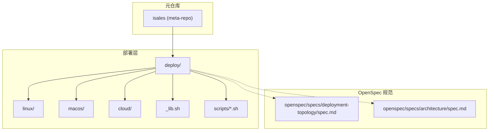
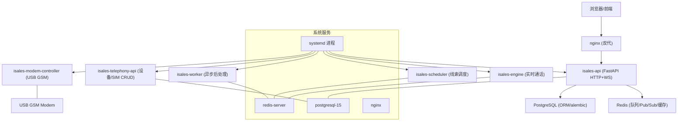
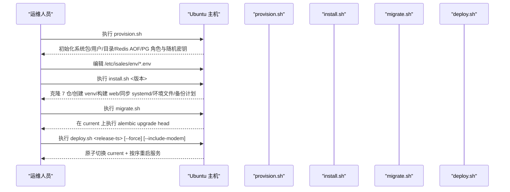
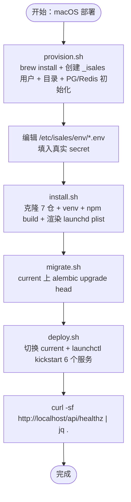
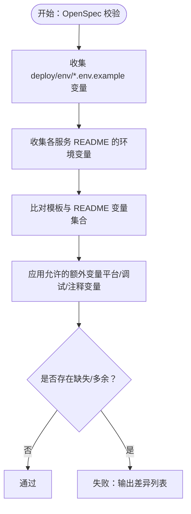
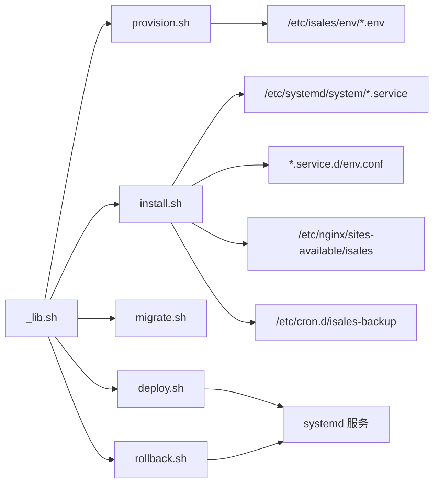

# 快速开始部署指南

<cite>
**本文引用的文件**
- [deploy/README.md](file://deploy/README.md)
- [deploy/linux/scripts/provision.sh](file://deploy/linux/scripts/provision.sh)
- [deploy/linux/scripts/install.sh](file://deploy/linux/scripts/install.sh)
- [deploy/linux/scripts/migrate.sh](file://deploy/linux/scripts/migrate.sh)
- [deploy/linux/scripts/deploy.sh](file://deploy/linux/scripts/deploy.sh)
- [deploy/linux/scripts/rollback.sh](file://deploy/linux/scripts/rollback.sh)
- [deploy/common/_lib.sh](file://deploy/common/_lib.sh)
- [deploy/env/api.env.example](file://deploy/env/api.env.example)
- [openspec/specs/deployment-topology/spec.md](file://openspec/specs/deployment-topology/spec.md)
- [openspec/specs/architecture/spec.md](file://openspec/specs/architecture/spec.md)
- [deploy/RUNBOOK.md](file://deploy/RUNBOOK.md)
- [deploy/macos/README.md](file://deploy/macos/README.md)
- [deploy/cloud/README.md](file://deploy/cloud/README.md)
- [deploy/linux/scripts/check_env_consistency.py](file://deploy/linux/scripts/check_env_consistency.py)
- [scripts/test_all.sh](file://scripts/test_all.sh)
</cite>

## 目录
1. [简介](#简介)
2. [项目结构](#项目结构)
3. [核心组件](#核心组件)
4. [架构总览](#架构总览)
5. [详细组件分析](#详细组件分析)
6. [依赖分析](#依赖分析)
7. [性能考虑](#性能考虑)
8. [故障排除指南](#故障排除指南)
9. [结论](#结论)
10. [附录](#附录)

## 简介
本指南面向 iSales v1 生产部署，提供两种单主机部署模型的完整快速开始流程：
- Linux + systemd 主线部署（Ubuntu 22.04 LTS amd64）
- macOS 14+ Apple Silicon + launchd 部署（作为门店/现场拨号工作站）

目标是帮助新用户在 30 分钟内完成环境准备、安装、迁移、部署与验证，并掌握跨仓测试与 OpenSpec 校验工具的使用。

## 项目结构
iSales 采用“元仓库 + 多子仓”的 7 仓库微服务架构，部署脚本集中于 deploy/ 目录，按平台拆分（linux、macos、cloud），并通过公共库 _lib.sh 提供跨平台通用能力。

**图表来源**
- [deploy/README.md:1-112](file://deploy/README.md#L1-L112)
- [openspec/specs/deployment-topology/spec.md:1-414](file://openspec/specs/deployment-topology/spec.md#L1-L414)
- [openspec/specs/architecture/spec.md:1-168](file://openspec/specs/architecture/spec.md#L1-L168)

**章节来源**
- [deploy/README.md:1-112](file://deploy/README.md#L1-L112)
- [openspec/specs/architecture/spec.md:1-168](file://openspec/specs/architecture/spec.md#L1-L168)

## 核心组件
- provision.sh：一次性主机初始化，安装系统包、创建 isales 用户与目录骨架、配置 Redis AOF、初始化 PostgreSQL 角色/数据库与随机密钥，并可选安装 USB GSM modem 的 udev 规则。
- install.sh：拉取 7 个服务仓库、创建共享 venv、构建 isales-web、同步 systemd 单元、写入 EnvironmentFile drop-in、安装 nginx 配置与备份 cron。
- migrate.sh：在当前 release 上执行 alembic 升级 head，读取 /etc/isales/env/api.env 中的数据库连接。
- deploy.sh：原子切换 current 软链并按依赖顺序重启服务，支持低峰期门禁与 --force 强制部署，支持 --include-modem。
- rollback.sh：回滚到指定 release，保持 schema 不变，按相同顺序重启服务。
- _lib.sh：跨平台日志、参数解析、权限校验、确认交互、文件写入、随机密钥生成、环境文件引导等通用能力。
- env 模板：集中化环境变量文件（api.env、engine.env、scheduler.env、worker.env、telephony-api.env、modem-controller.env），权限 0640 root:isales。

**章节来源**
- [deploy/linux/scripts/provision.sh:1-224](file://deploy/linux/scripts/provision.sh#L1-L224)
- [deploy/linux/scripts/install.sh:1-275](file://deploy/linux/scripts/install.sh#L1-L275)
- [deploy/linux/scripts/migrate.sh:1-61](file://deploy/linux/scripts/migrate.sh#L1-L61)
- [deploy/linux/scripts/deploy.sh:1-139](file://deploy/linux/scripts/deploy.sh#L1-L139)
- [deploy/linux/scripts/rollback.sh:1-114](file://deploy/linux/scripts/rollback.sh#L1-L114)
- [deploy/common/_lib.sh:1-181](file://deploy/common/_lib.sh#L1-L181)
- [deploy/env/api.env.example:1-14](file://deploy/env/api.env.example#L1-L14)

## 架构总览
v1 单主机部署将 7 个服务进程通过 systemd 管理，PostgreSQL 与 Redis 作为系统服务，nginx 反代 isales-web 静态资源。目录骨架与环境文件集中化，确保幂等与可回滚。

**图表来源**
- [deploy/README.md:14-49](file://deploy/README.md#L14-L49)
- [openspec/specs/architecture/spec.md:130-168](file://openspec/specs/architecture/spec.md#L130-L168)

**章节来源**
- [deploy/README.md:14-49](file://deploy/README.md#L14-L49)
- [openspec/specs/architecture/spec.md:130-168](file://openspec/specs/architecture/spec.md#L130-L168)

## 详细组件分析

### Linux + systemd 部署模型（主线）
- 主机依赖：Ubuntu 22.04 LTS amd64，系统包 postgresql-15、redis-server、nginx、git、pkg-config、libudev-dev、libasound2-dev，用户 isales:isales（无 shell）。
- 快速开始命令序列：
  - provision：一次性主机初始化
  - 编辑 /etc/isales/env/*.env（填入真实 secret）
  - install：克隆 7 仓 + 建 venv + 构建 web + 同步 systemd/环境文件/备份计划
  - migrate：在 current 上执行 alembic upgrade head
  - deploy：切换 current 软链 + 按序重启服务（默认跳过 modem-controller，可通过 --include-modem）
- 低峰期门禁：默认 22:00–08:00，非低峰期需 --force，否则拒绝 engine 重启（会中断活跃通话）。

**图表来源**
- [deploy/README.md:61-81](file://deploy/README.md#L61-L81)
- [deploy/linux/scripts/provision.sh:1-224](file://deploy/linux/scripts/provision.sh#L1-L224)
- [deploy/linux/scripts/install.sh:1-275](file://deploy/linux/scripts/install.sh#L1-L275)
- [deploy/linux/scripts/migrate.sh:1-61](file://deploy/linux/scripts/migrate.sh#L1-L61)
- [deploy/linux/scripts/deploy.sh:1-139](file://deploy/linux/scripts/deploy.sh#L1-L139)

**章节来源**
- [deploy/README.md:51-81](file://deploy/README.md#L51-L81)
- [deploy/linux/scripts/deploy.sh:51-68](file://deploy/linux/scripts/deploy.sh#L51-L68)

### macOS 14+ Apple Silicon + launchd 部署模型
- 主机依赖：macOS 14+ Sonoma（arm64），Homebrew（/opt/homebrew），系统包 postgresql@16、redis、nginx、git、pkg-config，用户 _isales:_isales（UID 350，隐藏用户）。
- 与 Linux 的关键差异：
  - 服务管理：launchctl kickstart -k system/<label>；状态查询：launchctl print system/<label>；日志：log show --predicate 'subsystem == "com.isales.*"' --last 5m
  - 环境注入：install.sh 用 plistlib 内联写入 <EnvironmentVariables>，编辑 /etc/isales/env/*.env 后需重跑 install.sh 或 bootout/bootstrap 单个 plist
  - 包管理：brew install（必须以 sudo -u "$SUDO_USER" 反向 elevates）
  - nginx：brew services reload nginx
  - 备份：com.isales.backup（StartCalendarInterval 02:30 daily）
  - USB 监听：pyserial.tools.list_ports 1 Hz 轮询 + diff；音频后端：Core Audio（sounddevice/PortAudio）

**图表来源**
- [deploy/macos/README.md:48-69](file://deploy/macos/README.md#L48-L69)
- [deploy/macos/README.md:71-98](file://deploy/macos/README.md#L71-L98)

**章节来源**
- [deploy/macos/README.md:1-98](file://deploy/macos/README.md#L1-L98)

### 部署脚本详解

#### provision.sh（主机一次性初始化）
- 功能要点：
  - apt install 系统包（postgresql-15、redis-server、nginx、git、pkg-config、libudev-dev、libasound2-dev）
  - 创建系统用户 isales（无 shell）
  - 创建目录骨架 /opt/isales/ 与 /etc/isales/env/
  - 配置 Redis AOF（appendonly yes / appendfsync everysec）
  - 初始化 PostgreSQL 角色/数据库，生成随机密钥并写入 /etc/isales/env/*.env
  - 可选安装 USB GSM modem 的 udev 规则（--with-modem）
- 参数：
  - --with-modem：安装 udev 规则并触发 udevadm reload/trigger
  - --dry-run：仅打印将执行的操作（不实际变更）

**章节来源**
- [deploy/linux/scripts/provision.sh:1-224](file://deploy/linux/scripts/provision.sh#L1-L224)

#### install.sh（安装新 release）
- 功能要点：
  - 解析 <git-ref>，创建 /opt/isales/releases/<ts>/ 目录
  - 以 isales 用户身份克隆/检出 7 个仓库
  - 创建共享 venv，pip install -e isales-common 与 5 服务
  - npm ci && npm run build isales-web
  - 同步 systemd 单元（重写 ExecStart/WorkingDirectory 指向 current）
  - 写入 EnvironmentFile drop-in（集中化 env）
  - 同步 nginx 配置并建立 /var/www/isales-web → current/isales-web/dist 符号链接
  - 安装备份 cron（/etc/cron.d/isales-backup）
- 环境变量：
  - ISALES_GIT_BASE（默认：https://github.com/tommax-bai）
  - ISALES_REPOS（默认：7 个标准仓库）
- 参数：
  - <git-ref>：如 v0.1.0
  - --dry-run：仅打印将执行的操作

**章节来源**
- [deploy/linux/scripts/install.sh:1-275](file://deploy/linux/scripts/install.sh#L1-L275)

#### migrate.sh（数据库迁移）
- 功能要点：
  - 读取 /etc/isales/env/api.env 中的 ISALES_DATABASE_URL
  - 在 /opt/isales/current/venv/bin/alembic -c current/isales-common/alembic.ini 执行 upgrade head
  - --dry-run：history -i 预览迁移
- 依赖：
  - current 软链存在且 venv/bin/python 可执行
  - alembic.ini 存在且可读

**章节来源**
- [deploy/linux/scripts/migrate.sh:1-61](file://deploy/linux/scripts/migrate.sh#L1-L61)

#### deploy.sh（发布与重启）
- 功能要点：
  - 低峰期门禁：默认 22:00–08:00，非低峰期需 --force
  - 原子切换 current 软链
  - 按序重启：isales-telephony-api → isales-scheduler → isales-worker → isales-engine → isales-api
  - nginx reload（非 restart）
  - 可选重启 isales-modem-controller（--include-modem）
- 参数：
  - <release-ts>：必需
  - --include-modem：包含 modem-controller
  - --force：强制部署（非低峰期）
  - --dry-run：仅打印将执行的操作

**章节来源**
- [deploy/linux/scripts/deploy.sh:1-139](file://deploy/linux/scripts/deploy.sh#L1-L139)

#### rollback.sh（回滚）
- 功能要点：
  - 列出 releases：--list
  - 回滚到指定 release：交换 current 软链并重启服务
  - schema 不动（如需降级，参考 RUNBOOK 的 rollback-schema）
- 参数：
  - <release-ts>：必需
  - --list：仅列出
  - --include-modem：包含 modem-controller
  - --force/--dry-run：通用参数

**章节来源**
- [deploy/linux/scripts/rollback.sh:1-114](file://deploy/linux/scripts/rollback.sh#L1-L114)

### OpenSpec 校验与跨仓测试

#### OpenSpec 环境变量一致性校验
- 工具：deploy/linux/scripts/check_env_consistency.py
- 目标：确保 deploy/env/<service>.env.example 的变量集合与各服务 README 的“环境变量”章节一致（允许模板多余少量调试/平台变量）
- 使用：make deploy-check（在元仓库根目录执行）

**图表来源**
- [deploy/linux/scripts/check_env_consistency.py:118-156](file://deploy/linux/scripts/check_env_consistency.py#L118-L156)

**章节来源**
- [deploy/linux/scripts/check_env_consistency.py:1-161](file://deploy/linux/scripts/check_env_consistency.py#L1-L161)

#### 跨仓测试工具
- 工具：scripts/test_all.sh
- 目标：顺序运行 6 个 Python 仓库与 1 个 JS 仓库的测试套件，输出汇总统计
- 使用：在元仓库根目录执行 make test-all 或 bash scripts/test_all.sh

**章节来源**
- [scripts/test_all.sh:1-145](file://scripts/test_all.sh#L1-L145)

## 依赖分析
- 平台抽象：_lib.sh 提供跨平台日志、参数解析、权限校验、确认交互、文件写入、随机密钥生成、环境文件引导等，被各平台脚本复用。
- 服务依赖：7 个服务共享 isales-common，依赖 PostgreSQL 与 Redis；engine/scheduler/worker 共享 Redis，api/engine/scheduler/worker 共享数据库连接。
- 目录与权限：/opt/isales/releases/<ts>/ 与 /etc/isales/env/ 为集中化部署与环境注入的核心路径，权限严格控制（env 0640 root:isales）。

**图表来源**
- [deploy/common/_lib.sh:1-181](file://deploy/common/_lib.sh#L1-L181)
- [deploy/linux/scripts/install.sh:196-236](file://deploy/linux/scripts/install.sh#L196-L236)
- [deploy/linux/scripts/deploy.sh:80-114](file://deploy/linux/scripts/deploy.sh#L80-L114)

**章节来源**
- [deploy/common/_lib.sh:1-181](file://deploy/common/_lib.sh#L1-L181)
- [openspec/specs/deployment-topology/spec.md:40-74](file://openspec/specs/deployment-topology/spec.md#L40-L74)

## 性能考虑
- 低峰期部署：engine 重启会中断活跃通话，建议在 22:00–08:00 低峰期进行，避免业务影响。
- 重启顺序：严格按拓扑依赖顺序重启，避免下游在上游未就绪时启动产生连接风暴。
- 备份策略：PG 每日 02:30 备份，Redis 每日 02:30 AOF/RDB 备份，保留 14 天，失败写 syslog 告警。
- 监控基线：Prometheus / Grafana 配置模板提供最小告警集与仪表盘建议，建议尽快落地。

**章节来源**
- [deploy/linux/scripts/deploy.sh:51-68](file://deploy/linux/scripts/deploy.sh#L51-L68)
- [openspec/specs/deployment-topology/spec.md:76-113](file://openspec/specs/deployment-topology/spec.md#L76-L113)

## 故障排除指南
- PostgreSQL 连接被拒：检查 postgresql 服务状态与磁盘空间，查看日志。
- Redis OOM：检查内存使用，调整 maxmemory 或策略；或提升 Redis 内存上限。
- modem-controller 设备断开：检查 USB 事件是否触发，重插 USB，查看日志。
- modem-controller 生产环境出现 MockATClient：检查是否误将 ISALES_ALLOW_MOCK_AT=1 写入生产 env。
- engine:dial 队列深度 > 500：检查 engine 是否宕机，必要时重启。
- worker celery 卡住：检查 worker 服务状态与 engine:worker:call-ended 队列。
- nginx 502 from /api/：直连 127.0.0.1:8000/healthz 检查 api 服务状态。
- API 登录失败：检查 /etc/isales/env/api.env 中 ISALES_ADMIN_PASSWORD_HASH 是否为 bcrypt 哈希。
- JWT 校验失败：确保 isales-api 与 telephony-api 的 ISALES_JWT_SECRET 一致。
- 备份 cron 未运行：检查 cron 服务状态与 /etc/cron.d/isales-backup 权限。

macOS 特有问题：
- brew 服务/launchd 服务异常：使用 brew services list 与 launchctl print system/<label> 定位状态。
- USB modem 未识别：使用 ioreg/ioreg -p IOUSB 或系统信息查看，确认 pyserial 可枚举。
- Core Audio 设备不可用：在 venv 中运行 python3 -c 'import sounddevice as sd; print(sd.query_devices())'，设置 ISALES_AUDIO_DEVICE_NAME。
- plist 环境变量陈旧：编辑 /etc/isales/env/*.env 后需重跑 install.sh 或 bootout/bootstrap 单个 plist。

**章节来源**
- [deploy/RUNBOOK.md:163-197](file://deploy/RUNBOOK.md#L163-L197)
- [deploy/RUNBOOK.md:345-381](file://deploy/RUNBOOK.md#L345-L381)

## 结论
通过本指南，您可以在 Linux 或 macOS 上完成 iSales v1 的单主机生产部署。遵循“provision → install → migrate → deploy”的标准流程，并结合 OpenSpec 校验与跨仓测试工具，可显著降低部署风险。建议在低峰期进行首次部署，并完成备份恢复演练与预上线硬性门禁，确保系统稳定运行。

## 附录

### 环境变量模板与一致性
- 模板位置：/etc/isales/env/*.env（权限 0640 root:isales）
- 示例：api.env.example 展示了数据库 URL、Redis URL、JWT Secret、管理员用户名与密码哈希等关键变量
- 一致性校验：check_env_consistency.py 用于确保模板与各服务 README 的环境变量声明一致

**章节来源**
- [deploy/env/api.env.example:1-14](file://deploy/env/api.env.example#L1-L14)
- [deploy/linux/scripts/check_env_consistency.py:118-156](file://deploy/linux/scripts/check_env_consistency.py#L118-L156)

### 云-边拆分形态（可选）
- 云端 ECS（阿里云）：5 个无硬件耦合服务（api/engine/scheduler/worker/web nginx），边缘 Mac mini 仅跑 modem-controller + audio-bridge
- 与 Linux 单主机形态的主要差异：云端不含 modem-controller/telephony-api，engine 需集成 DingRTC SDK，nginx 需监听 50051 用于 cloud-edge gRPC

**章节来源**
- [deploy/cloud/README.md:1-118](file://deploy/cloud/README.md#L1-L118)