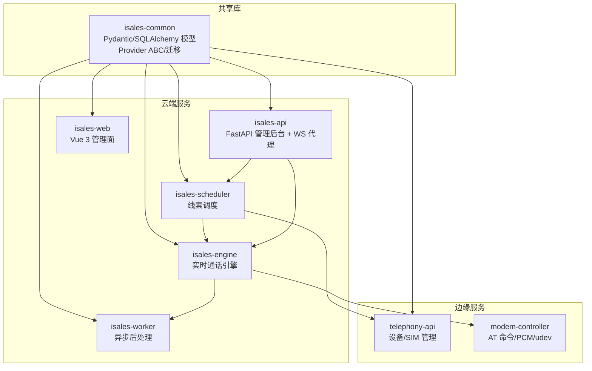
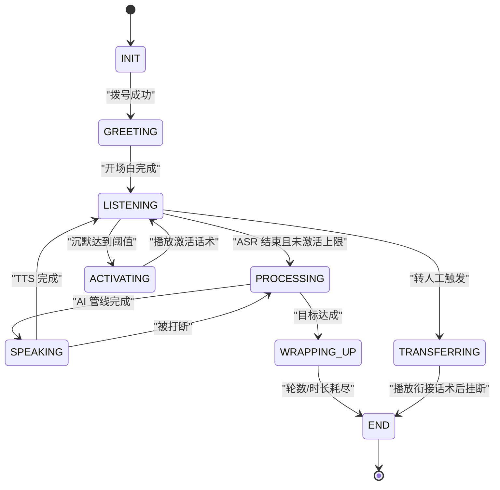
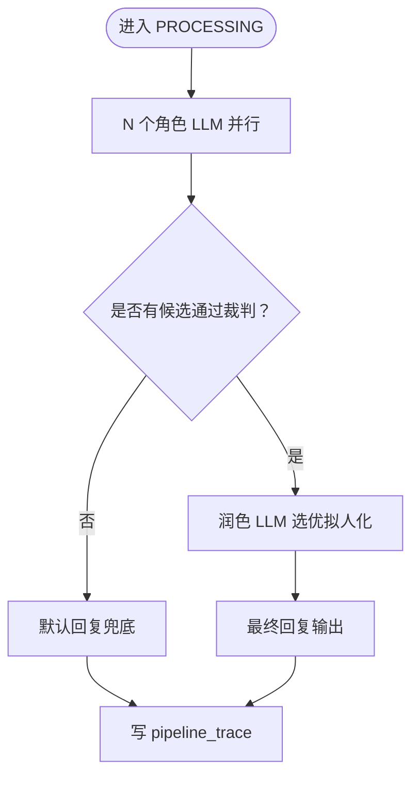
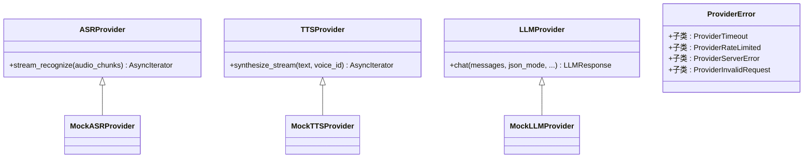
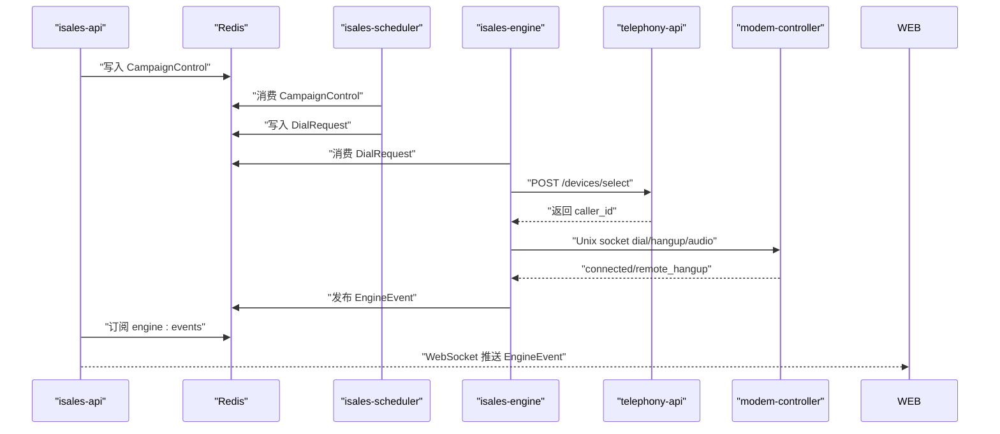
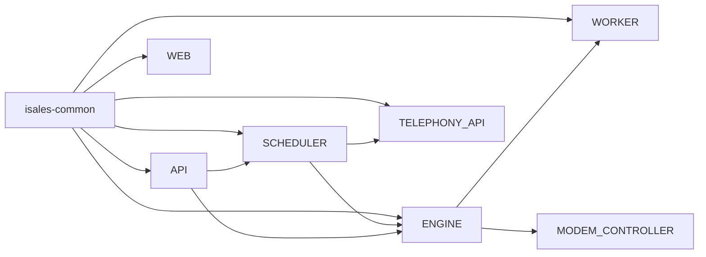

# 技术架构概览

<cite>
**本文档引用的文件**
- [README.md](file://README.md)
- [DESIGN.md](file://DESIGN.md)
- [IMPLEMENTATION_PLAN.md](file://IMPLEMENTATION_PLAN.md)
- [openspec/specs/architecture/spec.md](file://openspec/specs/architecture/spec.md)
- [openspec/specs/deployment-topology/spec.md](file://openspec/specs/deployment-topology/spec.md)
- [openspec/specs/service-communication/spec.md](file://openspec/specs/service-communication/spec.md)
- [openspec/specs/call-state-machine/spec.md](file://openspec/specs/call-state-machine/spec.md)
- [openspec/specs/ai-pipeline/spec.md](file://openspec/specs/ai-pipeline/spec.md)
- [openspec/specs/provider-abc/spec.md](file://openspec/specs/provider-abc/spec.md)
- [openspec/specs/message-contract/spec.md](file://openspec/specs/message-contract/spec.md)
- [deploy/cloud/env/engine.env.example](file://deploy/cloud/env/engine.env.example)
- [deploy/env/api.env.example](file://deploy/env/api.env.example)
- [deploy/cloud/systemd/isales-engine.service](file://deploy/cloud/systemd/isales-engine.service)
</cite>

## 目录
1. [简介](#简介)
2. [项目结构](#项目结构)
3. [核心组件](#核心组件)
4. [架构总览](#架构总览)
5. [详细组件分析](#详细组件分析)
6. [依赖分析](#依赖分析)
7. [性能考虑](#性能考虑)
8. [故障排查指南](#故障排查指南)
9. [结论](#结论)
10. [附录](#附录)

## 简介
本文件面向 iSales 系统的技术架构概览，基于 OpenSpec 的规范驱动设计，系统性阐述 7 个微服务的职责边界、相互关系与协作模式，以及云-边分离的部署拓扑与实时音频处理路径。核心技术栈包括 Python FastAPI、Vue 3、PostgreSQL、Redis、实时音频处理（AliRTC/ARTC），并采用事件驱动架构、状态机模式、Provider 抽象等设计模式，确保可扩展、可观测与可运维。

## 项目结构
iSales 采用“7 仓库微服务 + isales-common 共享库”的组织方式，isales-common 作为跨服务共享的模型、Schema、Provider 抽象与迁移脚本，其余 6 个服务独立演进，通过 OpenSpec 变更流程进行协同演进。



图表来源
- [openspec/specs/architecture/spec.md:130-167](file://openspec/specs/architecture/spec.md#L130-L167)
- [README.md:3-14](file://README.md#L3-L14)

章节来源
- [README.md:3-14](file://README.md#L3-L14)
- [openspec/specs/architecture/spec.md:1-168](file://openspec/specs/architecture/spec.md#L1-L168)

## 核心组件
- isales-common：提供 SQLAlchemy 模型、Pydantic Schema、Provider ABC（ASR/TTS/LLM）、Alembic 迁移与工具函数，作为 6 个服务的稳定依赖面。
- isales-api：FastAPI 管理后台，提供 Campaign/Lead/Role/Voice/Analytics/Callback 等 CRUD，WebSocket 代理与 Redis Pub/Sub 转发。
- isales-engine：实时通话引擎，包含状态机、AI 三层管线、打断/沉默/垫词、Provider 实现与与 modem-controller 的 IPC 集成。
- isales-scheduler：线索调度器，按时间窗口与并发限制分发到 engine 队列，打包历史摘要并触发选号。
- isales-worker：异步后处理，包含摘要生成、字段提取、Webhook 回调与指标聚合。
- isales-telephony：包含 telephony-api（HTTP）与 modem-controller（守护进程），负责设备/SIM 管理与硬件控制。
- isales-web：Vue 3 管理面，提供任务/线索/音色/设备/数据看板/通话监控/通话记录/回调配置等界面。

章节来源
- [IMPLEMENTATION_PLAN.md:95-147](file://IMPLEMENTATION_PLAN.md#L95-L147)
- [openspec/specs/architecture/spec.md:30-38](file://openspec/specs/architecture/spec.md#L30-L38)

## 架构总览
iSales 采用“云-边分离”的部署拓扑：云端运行 isales-api、isales-engine、isales-scheduler、isales-worker、isales-web，边缘侧运行 isales-telephony（telephony-api + modem-controller）。服务间通过 Redis 队列与 Pub/Sub 协作，数据库与缓存统一由 isales-common 管理，确保一致性与可观测性。

```mermaid
graph TB
subgraph "云端"
WEB["isales-web<br/>Vue 3 SPA"]
API["isales-api<br/>FastAPI"]
SCHED["isales-scheduler"]
WORK["isales-worker"]
ENG["isales-engine"]
REDIS["Redis"]
PG["PostgreSQL"]
NGINX["nginx<br/>SPA + 反代"]
end
subgraph "边缘"
TAPI["telephony-api"]
MOD["modem-controller"]
MODEM["USB GSM Modem"]
end
WEB --> NGINX --> API
API <- --> REDIS
API <- --> PG
SCHED --> REDIS
SCHED --> TAPI
ENG --> REDIS
ENG --> MOD
MOD --> MODEM
WORK --> REDIS
WORK --> PG
```

图表来源
- [openspec/specs/deployment-topology/spec.md:1-414](file://openspec/specs/deployment-topology/spec.md#L1-L414)
- [openspec/specs/service-communication/spec.md:11-24](file://openspec/specs/service-communication/spec.md#L11-L24)

章节来源
- [openspec/specs/deployment-topology/spec.md:6-414](file://openspec/specs/deployment-topology/spec.md#L6-L414)
- [openspec/specs/service-communication/spec.md:1-150](file://openspec/specs/service-communication/spec.md#L1-L150)

## 详细组件分析

### 状态机与实时行为（isales-engine）
- 状态机定义了 INIT/GREETING/LISTENING/SPEAKING/INTERRUPTED/FILLER/PROCESSING/WRAPPING_UP/ACTIVATING/TRANSFERRING/END 等状态及合法转换，非法转移将记录 state_error 事件。
- 关键实时模块：打断检测（基于 ASR 中间结果）、沉默激活（阈值触发）、垫词播放（与 PROCESSING 并行）、转人工（标记+通知+主动挂断）、WRAPPING_UP 简化管线。
- 与 Provider 抽象配合：ASR/TTS/LLM 通过 ABC 接入，支持流式接口与统一错误模型，保障降级与可观测性。



图表来源
- [openspec/specs/call-state-machine/spec.md:46-145](file://openspec/specs/call-state-machine/spec.md#L46-L145)

章节来源
- [openspec/specs/call-state-machine/spec.md:1-190](file://openspec/specs/call-state-machine/spec.md#L1-L190)

### AI 三层管线（isales-engine）
- 编排：N 角色并行 PK → N×M 裁判并行审查 → 1 润色选优拟人化；Layer 1 与垫词同时启动覆盖延迟。
- 兜底与降级：全部裁判否决走默认回复；润色失败取首个通过候选；全部角色解析失败走默认回复；异常路径仍写 pipeline_trace。
- 简化管线：WRAPPING_UP 期间单角色+润色，不启用 PK/裁判。



图表来源
- [openspec/specs/ai-pipeline/spec.md:7-166](file://openspec/specs/ai-pipeline/spec.md#L7-L166)

章节来源
- [openspec/specs/ai-pipeline/spec.md:1-166](file://openspec/specs/ai-pipeline/spec.md#L1-L166)

### Provider 抽象与统一错误模型（isales-common + isales-engine）
- Provider ABC：ASRProvider/TTSProvider/LLMProvider 定义统一接口，支持异步流式与 JSON Mode。
- 统一错误模型：ProviderError 基类 + RateLimited/ServerError/Timeout/InvalidRequest 子类，确保业务层可预期地进行降级与重试。
- 变更治理：破坏性变更需经 OpenSpec 变更流程，确保所有实现同步升级并通过契约测试。



图表来源
- [openspec/specs/provider-abc/spec.md:20-131](file://openspec/specs/provider-abc/spec.md#L20-L131)

章节来源
- [openspec/specs/provider-abc/spec.md:1-131](file://openspec/specs/provider-abc/spec.md#L1-L131)

### 服务通信与消息契约（isales-common + 各服务）
- 通信通道矩阵：Redis Queue 用于“必须送达”的工作派发；Redis Pub/Sub 用于“实时可丢失”的事件广播；HTTP 仅用于必要同步调用（如 scheduler → telephony-api）。
- 消息契约：统一在 isales-common 定义 Pydantic 模型，包含 schema_version/message_id/created_at 等基础字段，支持非破坏性与破坏性演进。
- WebSocket 代理：isales-api 将 Redis Pub/Sub 的 EngineEvent 转发给前端，前端以 discriminated union 解析消息类型。



图表来源
- [openspec/specs/service-communication/spec.md:11-150](file://openspec/specs/service-communication/spec.md#L11-L150)
- [openspec/specs/message-contract/spec.md:10-85](file://openspec/specs/message-contract/spec.md#L10-L85)

章节来源
- [openspec/specs/service-communication/spec.md:1-150](file://openspec/specs/service-communication/spec.md#L1-L150)
- [openspec/specs/message-contract/spec.md:1-85](file://openspec/specs/message-contract/spec.md#L1-L85)

### 云-边分离部署拓扑与边缘协作
- 云端：isales-api、isales-engine、isales-scheduler、isales-worker、isales-web，统一通过 systemd 管理，PostgreSQL 与 Redis 作为同主机系统服务。
- 边缘：telephony-api（HTTP）+ modem-controller（守护进程），modem-controller 通过 Unix socket 与 engine 通信，驱动 USB GSM Modem 实现真实拨号。
- nginx：作为 isales-web SPA 的静态服务与 isales-api 的反向代理，提供同源访问与长连接支持。
- 环境变量：通过 /etc/isales/env/<service>.env 注入，跨服务一致性由架构规范约束。

```mermaid
graph TB
subgraph "云端主机"
subgraph "服务进程"
API["isales-api"]
ENG["isales-engine"]
SCHED["isales-scheduler"]
WORK["isales-worker"]
WEB["isales-web"]
end
REDIS["Redis"]
PG["PostgreSQL"]
NGINX["nginx"]
end
subgraph "边缘主机"
subgraph "telephony 进程"
TAPI["telephony-api"]
MOD["modem-controller"]
end
MODEM["USB GSM Modem"]
end
WEB --> NGINX --> API
API < --> REDIS
API < --> PG
SCHED --> REDIS
SCHED --> TAPI
ENG --> REDIS
ENG --> MOD
MOD --> MODEM
WORK --> REDIS
WORK --> PG
```

图表来源
- [openspec/specs/deployment-topology/spec.md:1-414](file://openspec/specs/deployment-topology/spec.md#L1-L414)

章节来源
- [openspec/specs/deployment-topology/spec.md:6-132](file://openspec/specs/deployment-topology/spec.md#L6-L132)
- [deploy/cloud/systemd/isales-engine.service:1-42](file://deploy/cloud/systemd/isales-engine.service#L1-L42)
- [deploy/cloud/env/engine.env.example:1-76](file://deploy/cloud/env/engine.env.example#L1-L76)
- [deploy/env/api.env.example:1-14](file://deploy/env/api.env.example#L1-L14)

## 依赖分析
- 组件耦合与内聚：isales-common 作为稳定依赖面，其余服务通过消息契约与 Provider 抽象解耦；服务间通过 Redis 队列/Pub/Sub 与 HTTP 同步调用形成清晰边界。
- 外部依赖：PostgreSQL/Redis 由 isales-common 统一管理；Provider 实现与硬件控制通过 ABC 与 IPC 解耦。
- 潜在循环依赖：通过“共享库先行、服务独立演进”的实施顺序避免；OpenSpec 变更流程确保跨仓库职责清晰。



图表来源
- [openspec/specs/architecture/spec.md:26-86](file://openspec/specs/architecture/spec.md#L26-L86)

章节来源
- [openspec/specs/architecture/spec.md:26-86](file://openspec/specs/architecture/spec.md#L26-L86)

## 性能考虑
- 端到端延迟：通过垫词覆盖管线延迟、流式 ASR/TTS 首包尽快返回、并发计数器与队列深度监控，结合压测与告警阈值保障 SLA。
- 并发控制：Redis 原子计数器用于跨实例全局并发控制，避免计数器泄漏与异常清理。
- 数据持久化：PostgreSQL 与 Redis 的日级别备份与持久化策略，确保数据安全与可恢复性。
- 监控与可观测性：Prometheus 指标暴露与 Grafana 仪表盘，覆盖在播/队列深度/接通率/错误日志等关键指标。

## 故障排查指南
- 服务启停顺序：按 systemd 顺序重启，避免上游未就绪导致连接风暴；engine 重启需在低峰期执行。
- 环境变量一致性：通过 deploy-check 校验 env 与服务 README 的环境变量列表一致性。
- 备份与回滚：PG/Redis 的每日备份与可逆回滚脚本，确保 schema 回滚由运维手工执行。
- 通信故障容错：Redis/DB/modem-controller 短暂不可用时的重连与优雅清理策略，确保受影响的 call_session 正常结束。

章节来源
- [openspec/specs/deployment-topology/spec.md:62-132](file://openspec/specs/deployment-topology/spec.md#L62-L132)
- [README.md:57-86](file://README.md#L57-L86)

## 结论
iSales 基于 OpenSpec 的规范驱动架构，通过 isales-common 提供稳定依赖面，7 个微服务各司其职并通过 Redis/HTTP/Pub/Sub 协作，实现云-边分离的实时外呼系统。事件驱动、状态机与 Provider 抽象确保系统具备高内聚、低耦合、可扩展与可观测性，满足 v1 的并发目标与部署约束，并为 v2 的多实例扩展与多主机部署预留演进空间。

## 附录
- 术语
  - ASR：自动语音识别
  - TTS：文本转语音
  - LLM：大语言模型
  - RTC：实时通信（AliRTC/ARTC）
  - IPC：进程间通信（Unix socket/WebSocket）
- 参考
  - OpenSpec 规范：architecture、deployment-topology、service-communication、call-state-machine、ai-pipeline、provider-abc、message-contract
  - 部署与运维：RUNBOOK、脚本幂等与可回滚、监控与告警