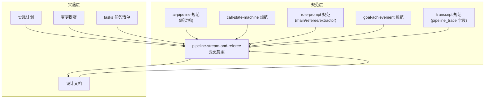
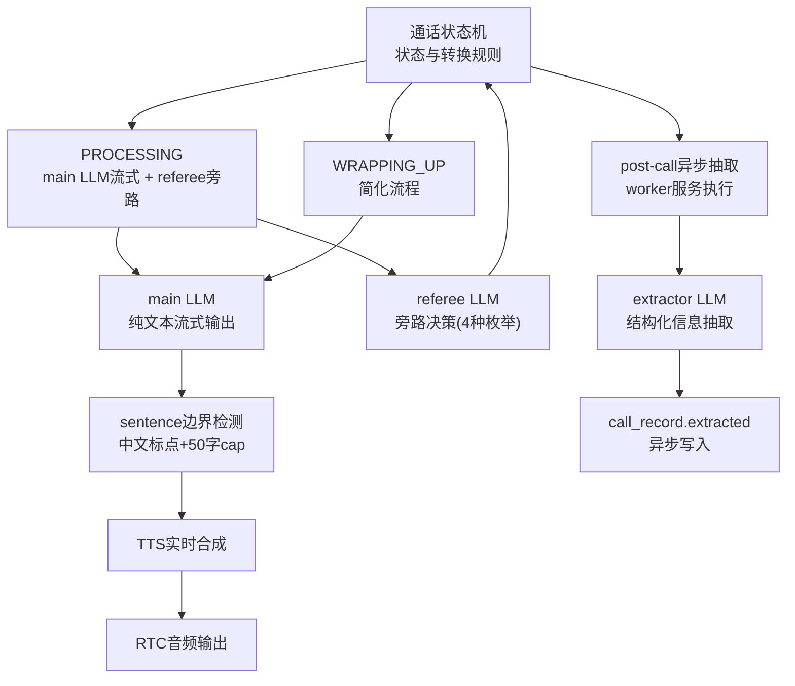
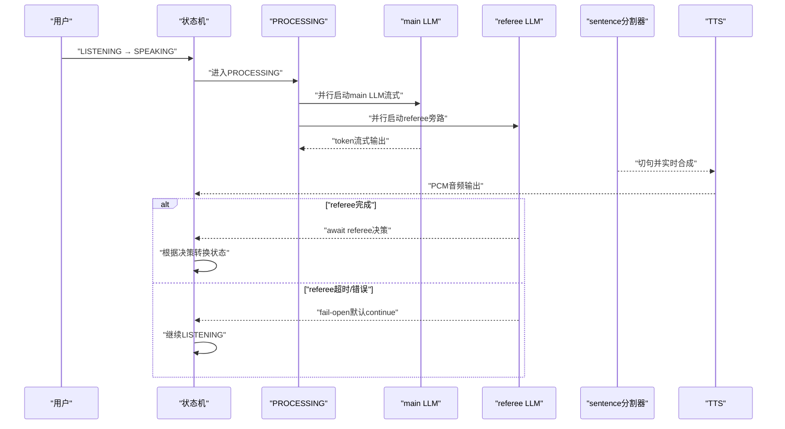
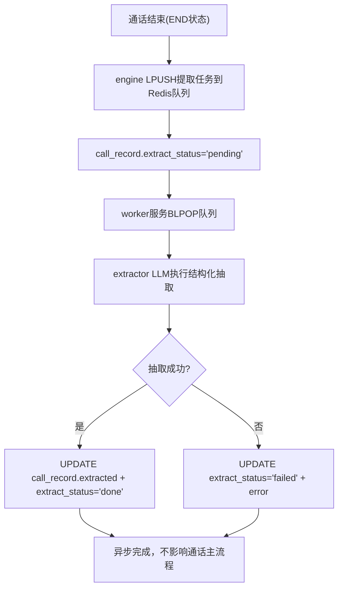
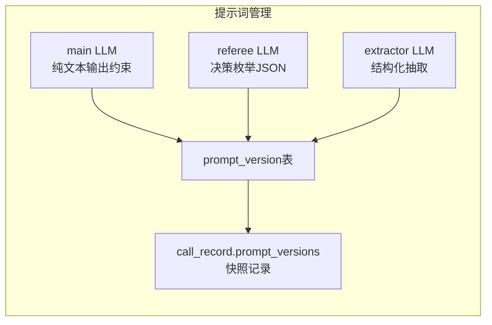
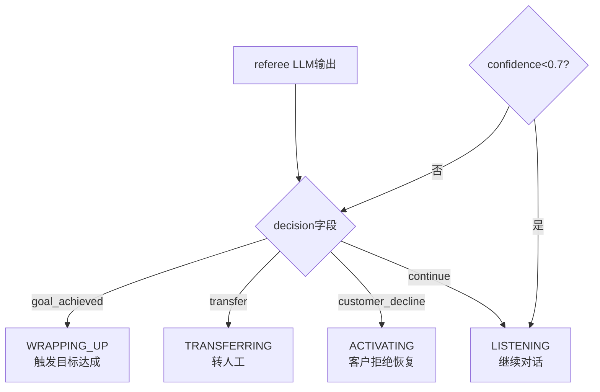
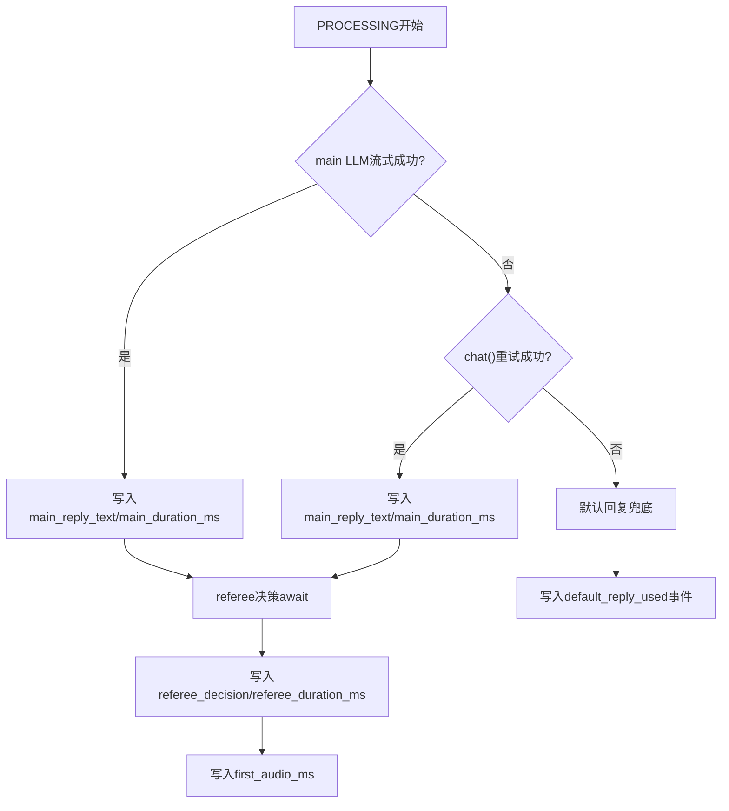
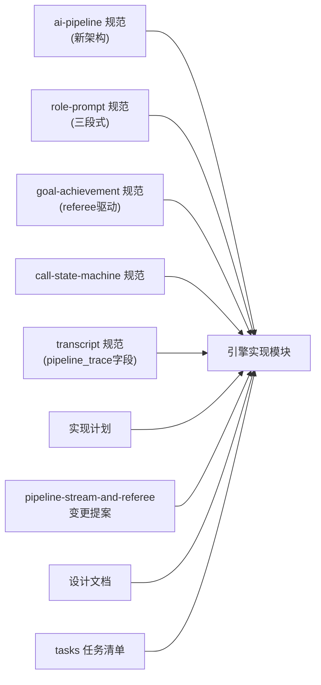

# AI智能对话系统

<cite>
**本文引用的文件**
- [ai-pipeline 规范](file://openspec/changes/pipeline-stream-and-referee/specs/ai-pipeline/spec.md)
- [call-state-machine 规范](file://openspec/specs/call-state-machine/spec.md)
- [role-prompt 规范](file://openspec/changes/pipeline-stream-and-referee/specs/role-prompt/spec.md)
- [goal-achievement 规范](file://openspec/changes/pipeline-stream-and-referee/specs/goal-achievement/spec.md)
- [transcript 规范](file://openspec/changes/pipeline-stream-and-referee/specs/transcript/spec.md)
- [data-model 规范](file://openspec/changes/pipeline-stream-and-referee/specs/data-model/spec.md)
- [provider-abc 规范](file://openspec/specs/provider-abc/spec.md)
- [实现计划](file://IMPLEMENTATION_PLAN.md)
- [变更提案](file://openspec/changes/pipeline-stream-and-referee/proposal.md)
- [设计文档](file://openspec/changes/pipeline-stream-and-referee/design.md)
- [tasks 任务清单](file://openspec/changes/pipeline-stream-and-referee/tasks.md)
</cite>

## 更新摘要
**变更内容**
- 更新架构总览以反映从三层judge+polish管道到双LLM架构的重大转变
- 新增referee旁路决策机制的详细说明
- 新增post-call异步抽取机制的完整流程
- 重新设计AI管线编排以适应新的双LLM架构
- 更新角色/裁判/润色提示词管理为main/referee/extractor三段式
- 修订目标达成检测算法以基于referee决策而非polish输出
- 更新性能优化策略以支持流式架构和旁路决策
- 新增sentence边界检测器组件的详细说明

## 目录
1. [简介](#简介)
2. [项目结构](#项目结构)
3. [核心组件](#核心组件)
4. [架构总览](#架构总览)
5. [详细组件分析](#详细组件分析)
6. [依赖关系分析](#依赖关系分析)
7. [性能考虑](#性能考虑)
8. [故障排查指南](#故障排查指南)
9. [结论](#结论)
10. [附录](#附录)

## 简介
本文件面向iSales AI智能对话系统，围绕"单main LLM流式架构 + referee旁路决策 + post-call异步抽取"展开，系统性阐述新的AI架构设计思想。新架构通过main LLM纯文本流式输出与referee旁路决策分离，实现首音频延迟从6.5-9.5秒降至500-1500毫秒的显著提升；通过post-call异步抽取机制，将客户信息提取从通话主流程中剥离，确保通话实时性的同时保持数据完整性。文档详细解释新架构下的角色配置、提示词模板管理、对话上下文维护、目标达成检测算法、性能优化策略、错误处理机制与通话状态机的集成方式。

## 项目结构
- 顶层规范目录：openspec/changes/pipeline-stream-and-referee/specs 下包含新架构的ai-pipeline、role-prompt、goal-achievement、transcript等规范文件，形成系统设计契约。
- 变更提案：openspec/changes/pipeline-stream-and-referee 目录展示了重大架构变更的详细设计与实施计划。
- 实施计划：IMPLEMENTATION_PLAN.md 明确了引擎模块划分与职责边界。
- 规范演进：从传统的三层管线规范到新的双LLM架构规范，体现了系统架构的根本性变革。

**图示来源**
- [变更提案](file://openspec/changes/pipeline-stream-and-referee/proposal.md)
- [设计文档](file://openspec/changes/pipeline-stream-and-referee/design.md)
- [tasks 任务清单](file://openspec/changes/pipeline-stream-and-referee/tasks.md)

## 核心组件
- **通话状态机**：定义状态集合、转换规则与关键边界（WRAPPING_UP、TRANSFERRING、ACTIVATING），是引擎实时行为模块的统一入口。
- **单main LLM流式架构**：main LLM纯文本流式输出，配合sentence boundary detector切句与TTS实时合成，实现低延迟响应。
- **referee旁路决策**：与main LLM并行运行的小模型决策器，负责目标达成检测、转人工决策和客户拒绝识别，输出结构化决策枚举。
- **post-call异步抽取**：通话结束后由worker服务异步执行的结构化信息抽取，确保通话主流程不受数据处理影响。
- **三段式提示词管理**：main LLM、referee LLM、extractor LLM三类提示词完全独立配置，支持Campaign自定义。
- **流式sentence边界检测**：专门的sentence boundary detector实现中文标点切句与50字cap机制，平衡TTS延迟与自然度。
- **pipeline_trace追踪**：每轮PROCESSING完成后写入pipeline_trace，覆盖成功、兜底、降级、异常等路径。

**章节来源**
- [ai-pipeline 规范](file://openspec/changes/pipeline-stream-and-referee/specs/ai-pipeline/spec.md)
- [role-prompt 规范](file://openspec/changes/pipeline-stream-and-referee/specs/role-prompt/spec.md)

## 架构总览
系统采用"状态机驱动 + 单main LLM流式架构"的新架构。main LLM与referee LLM在PROCESSING状态下并行启动，main LLM负责纯文本流式回复生成，referee负责旁路决策。TTS实时合成播放，首音频延迟大幅降低。通话结束后由worker服务异步执行extractor LLM进行结构化信息抽取。

**图示来源**
- [ai-pipeline 规范](file://openspec/changes/pipeline-stream-and-referee/specs/ai-pipeline/spec.md)
- [设计文档](file://openspec/changes/pipeline-stream-and-referee/design.md)

## 详细组件分析

### 1) 单main LLM流式架构与referee旁路决策

**更新** 新架构完全摒弃了三层judge+polish管道，采用main LLM纯文本流式输出与referee旁路决策分离的设计。

- **main LLM流式输出**：通过`chat_stream`接口返回token AsyncIterator，实时切句并喂给TTS，实现"第一句出来就播放"的低延迟体验。
- **referee旁路决策**：与main LLM并行spawn，输入用户最后一句话和最近3轮对话历史，输出结构化决策枚举（continue、goal_achieved、customer_decline、transfer）。
- **fail-open机制**：referee超时（>2.0s）或返回非法JSON/confidence<0.7时，默认决策为continue，确保通话不被阻塞。
- **决策驱动状态机**：referee决策在SPEAKING状态结束前await，驱动WRAPPING_UP、TRANSFERRING、ACTIVATING等状态转换。

**图示来源**
- [ai-pipeline 规范](file://openspec/changes/pipeline-stream-and-referee/specs/ai-pipeline/spec.md)
- [设计文档](file://openspec/changes/pipeline-stream-and-referee/design.md)

**章节来源**
- [ai-pipeline 规范](file://openspec/changes/pipeline-stream-and-referee/specs/ai-pipeline/spec.md)
- [设计文档](file://openspec/changes/pipeline-stream-and-referee/design.md)

### 2) post-call异步抽取机制

**新增** post-call异步抽取机制是新架构的重要创新，将结构化信息抽取从通话主流程中剥离。

- **异步执行**：engine在END状态前LPUSH Redis队列`isales:extract`，worker服务BLPOP队列异步执行extractor LLM。
- **数据解耦**：engine与extractor完全解耦，engine不等待extractor结果，确保通话主流程不受影响。
- **失败处理**：worker失败时更新`extract_status='failed'`，支持手动重试，避免雪崩效应。
- **状态管理**：engine LPUSH时同时更新`call_record.extract_status='pending'`，确保数据一致性。

**图示来源**
- [ai-pipeline 规范](file://openspec/changes/pipeline-stream-and-referee/specs/ai-pipeline/spec.md)

**章节来源**
- [ai-pipeline 规范](file://openspec/changes/pipeline-stream-and-referee/specs/ai-pipeline/spec.md)

### 3) 三段式提示词管理

**更新** 提示词管理从传统的role/judge/polish三段式简化为main/referee/extractor三段式。

- **main LLM提示词**：纯文本输出约束，system prompt末段包含"不要输出markdown/emoji/JSON"等约束，不再强制JSON模式。
- **referee LLM提示词**：严格指定输出JSON schema和4种决策枚举的语义说明，包含confidence评分机制。
- **extractor LLM提示词**：基于完整通话记录抽取结构化字段，字段定义完全由Campaign自定义。
- **prompt版本管理**：每个LLM类型独立管理prompt版本，通话开始时写入快照记录。

**图示来源**
- [role-prompt 规范](file://openspec/changes/pipeline-stream-and-referee/specs/role-prompt/spec.md)

**章节来源**
- [role-prompt 规范](file://openspec/changes/pipeline-stream-and-referee/specs/role-prompt/spec.md)

### 4) 目标达成检测算法

**更新** 目标达成检测算法从polish LLM的JSON字段改为referee LLM的决策枚举。

- **实时判定**：referee LLM在PROCESSING入口与main LLM并行运行，输出包含`decision`、`goal_type`、`confidence`字段的JSON。
- **决策语义**：
  - `goal_achieved`：客户明确同意外呼目标，触发WRAPPING_UP状态
  - `transfer`：客户要求转人工，触发TRANSFERRING状态  
  - `customer_decline`：客户明确拒绝或强烈反感，触发ACTIVATING状态
  - `continue`：客户正常对话，回到LISTENING状态
- **confidence阈值**：confidence<0.7时默认continue，避免误触发。

**图示来源**
- [ai-pipeline 规范](file://openspec/changes/pipeline-stream-and-referee/specs/ai-pipeline/spec.md)

**章节来源**
- [ai-pipeline 规范](file://openspec/changes/pipeline-stream-and-referee/specs/ai-pipeline/spec.md)

### 5) 管线追踪与错误处理

**更新** pipeline_trace schema从三层管线改为单main LLM流式架构的字段组合。

- **新增字段**：`main_reply_text`、`main_duration_ms`、`referee_decision`、`referee_goal_type`、`referee_duration_ms`、`first_audio_ms`
- **删除字段**：`role_candidates`、`judge_results`、`polish_input`、`polish_output`、`polish_duration_ms`、`final_selected_candidate_index`
- **兜底策略**：main LLM流式异常时使用非流式chat()重试一次，两次失败则走默认回复兜底。
- **默认回复**：从`campaign.default_replies`数组随机抽取，TTS一次性合成播放。

**图示来源**
- [ai-pipeline 规范](file://openspec/changes/pipeline-stream-and-referee/specs/ai-pipeline/spec.md)

**章节来源**
- [ai-pipeline 规范](file://openspec/changes/pipeline-stream-and-referee/specs/ai-pipeline/spec.md)

### 6) 与通话状态机的集成

**更新** 与状态机的集成更加紧密，referee决策直接影响状态转换。

- **状态转换驱动**：referee决策在SPEAKING状态结束前await，驱动WRAPPING_UP、TRANSFERRING、ACTIVATING状态转换。
- **WRAPPING_UP简化**：进入WRAPPING_UP后仅运行main LLM流式，不再启动referee，post-call extractor仍正常运行。
- **连续打断保护**：支持short_reply和listen_only两种策略，与main streaming兼容。
- **完整轮次重置**：SPEAKING完整播放且未被打断后重置连续打断计数器。

**章节来源**
- [ai-pipeline 规范](file://openspec/changes/pipeline-stream-and-referee/specs/ai-pipeline/spec.md)

### 7) sentence边界检测器

**新增** sentence边界检测器是新架构中关键的实时处理组件。

- **切句逻辑**：累积main LLM yield的token到buffer，命中下列条件之一时切一句送TTS：
  - 命中标点`。？！`或换行`\n\n`
  - buffer累积超过50字（防单句过长，TTS延迟回弹）
  - stream结束时buffer不空，整体作为末句flush
- **中文标点处理**：能够正确识别中文标点符号，确保自然的语音停顿
- **50字cap机制**：防止单句过长导致TTS延迟回弹，平衡延迟与自然度

**章节来源**
- [ai-pipeline 规范](file://openspec/changes/pipeline-stream-and-referee/specs/ai-pipeline/spec.md)

## 依赖关系分析
- **规范驱动**：新的ai-pipeline、role-prompt、goal-achievement规范共同定义了双LLM架构的行为契约；call-state-machine定义状态边界。
- **实施映射**：实现计划明确了引擎模块划分（状态机、会话管理、流式管线编排、实时模块、转人工、收尾管理、JSON解析、队列消费者、事件发布）。
- **架构演进**：从archive的三层管线到pipeline-stream-and-referee的双LLM架构，体现了系统架构的根本性变革。

**图示来源**
- [变更提案](file://openspec/changes/pipeline-stream-and-referee/proposal.md)
- [设计文档](file://openspec/changes/pipeline-stream-and-referee/design.md)
- [tasks 任务清单](file://openspec/changes/pipeline-stream-and-referee/tasks.md)

**章节来源**
- [变更提案](file://openspec/changes/pipeline-stream-and-referee/proposal.md)
- [设计文档](file://openspec/changes/pipeline-stream-and-referee/design.md)
- [tasks 任务清单](file://openspec/changes/pipeline-stream-and-referee/tasks.md)

## 性能考虑
- **首音频延迟**：从6.5-9.5秒降至500-1500毫秒，实现5-8倍性能提升。
- **LLM成本优化**：main LLM从N个减少到1个，配合judge/polish删除，token成本下降约70%。
- **并行化优化**：main LLM与referee LLM并行运行，不互相阻塞，最大化利用计算资源。
- **TTS实时性**：sentence boundary detector确保切句及时，TTS实时合成播放，避免等待。
- **异步抽取**：post-call extractor异步执行，不影响通话主流程实时性。
- **缓存与预热**：referee小模型延迟≤500ms，适合缓存预热策略。

**章节来源**
- [变更提案](file://openspec/changes/pipeline-stream-and-referee/proposal.md)
- [ai-pipeline 规范](file://openspec/changes/pipeline-stream-and-referee/specs/ai-pipeline/spec.md)

## 故障排查指南
- **main LLM流式异常**：捕获chat_stream异常后使用chat()重试一次，两次失败走默认回复兜底。
- **referee决策超时**：referee超时（>2.0s）或返回非法JSON/confidence<0.7时，默认continue，确保通话不被阻塞。
- **pipeline_trace写入失败**：使用try/except包裹，失败仅记录ERROR日志，不影响通话主路径。
- **post-call抽取失败**：worker失败时更新extract_status='failed'，支持手动重试，避免雪崩。
- **sentence边界检测**：50字cap防止单句过长导致TTS延迟回弹，中文标点确保自然切分。

**章节来源**
- [ai-pipeline 规范](file://openspec/changes/pipeline-stream-and-referee/specs/ai-pipeline/spec.md)
- [设计文档](file://openspec/changes/pipeline-stream-and-referee/design.md)

## 结论
iSales AI智能对话系统通过"单main LLM流式架构 + referee旁路决策 + post-call异步抽取"的新架构，实现了从6.5-9.5秒到500-1500毫秒的首音频延迟革命性提升。新架构通过main LLM纯文本流式输出与referee旁路决策分离，既保证了通话的实时性，又保持了目标达成检测和结构化信息抽取的完整性。post-call异步抽取机制进一步提升了系统的可扩展性和可靠性。通过三段式提示词管理和严格的pipeline_trace追踪，系统具备了更好的可观测性和可维护性。新架构在提升用户体验的同时，显著降低了LLM成本，为大规模部署奠定了坚实基础。

## 附录
- **业务评估方法建议**：
  - 首音频延迟：衡量新架构性能提升效果
  - 通话成功率与平均时长：评估系统稳定性与效率
  - 目标达成率与类型分布：评估referee决策准确性
  - 收尾完成率与用户反馈：评估WRAPPING_UP流程的自然度
  - LLM成本：监控token用量与成本下降效果
  - post-call抽取成功率：评估异步抽取机制可靠性
  - pipeline命中率与失败原因分布：指导架构优化