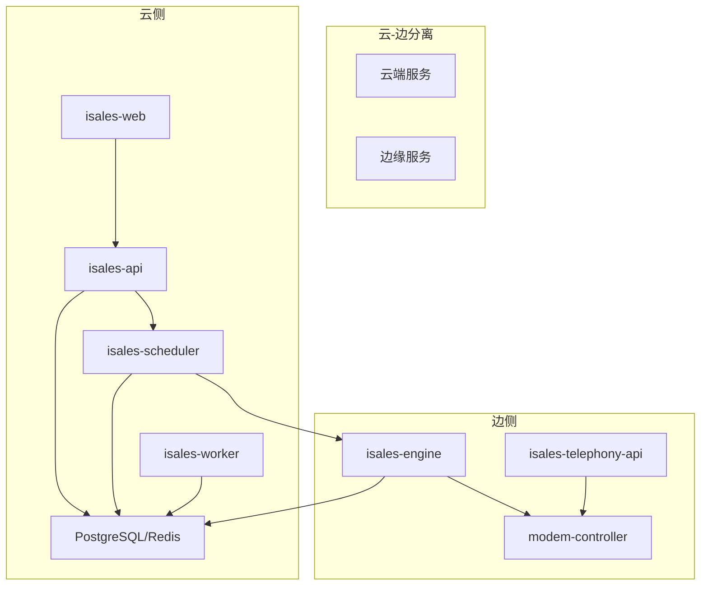
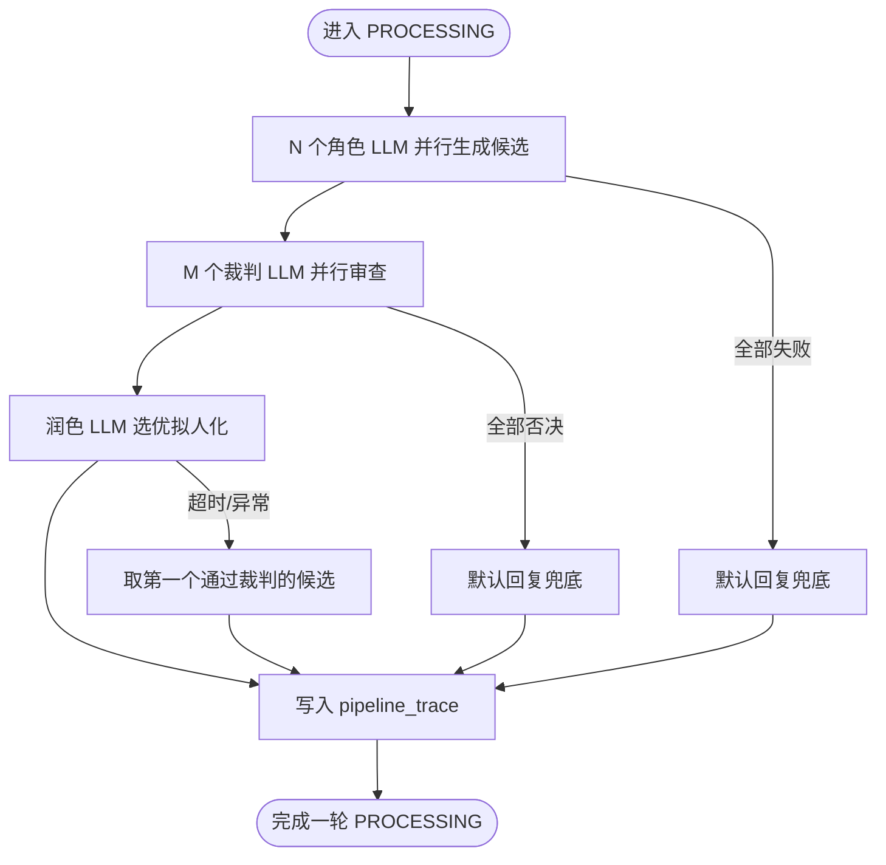
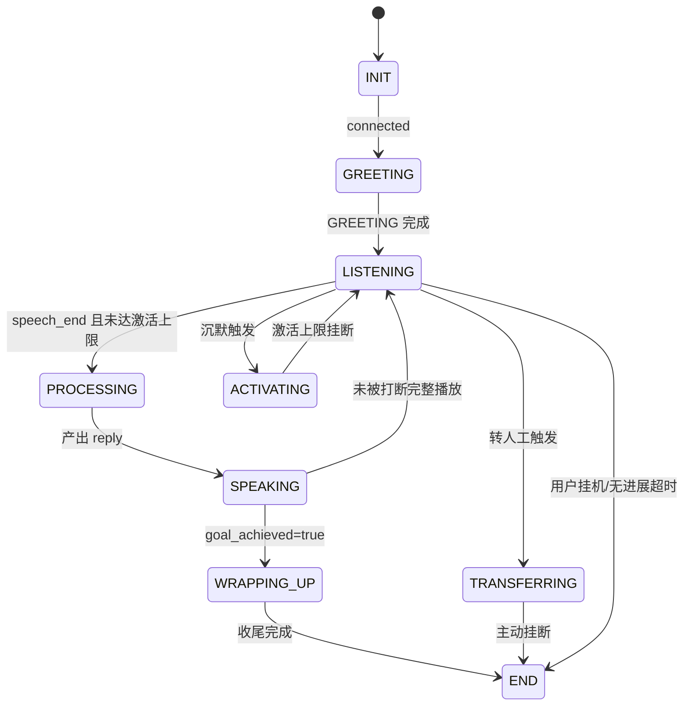
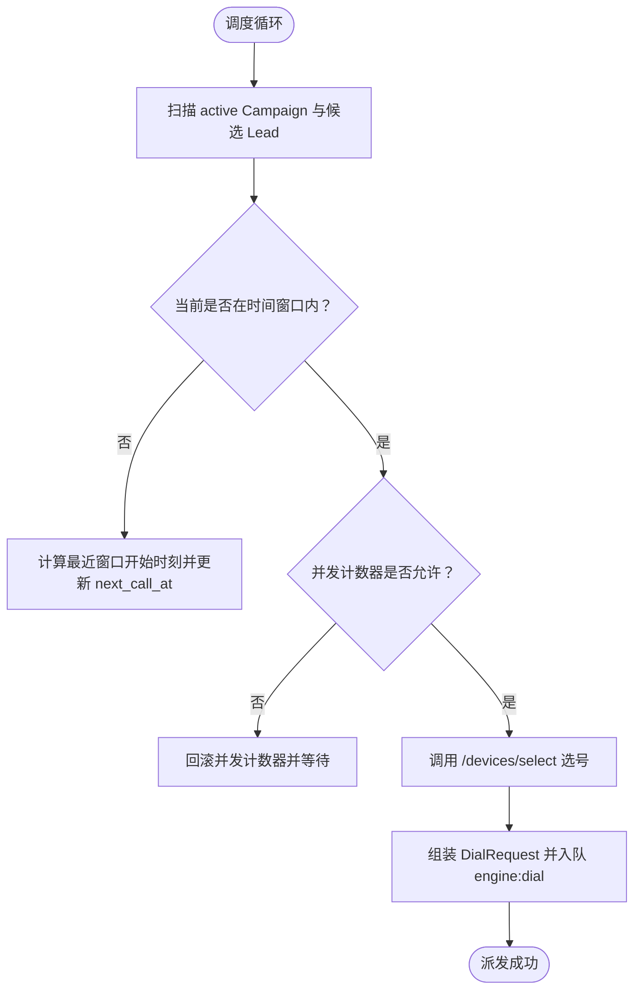
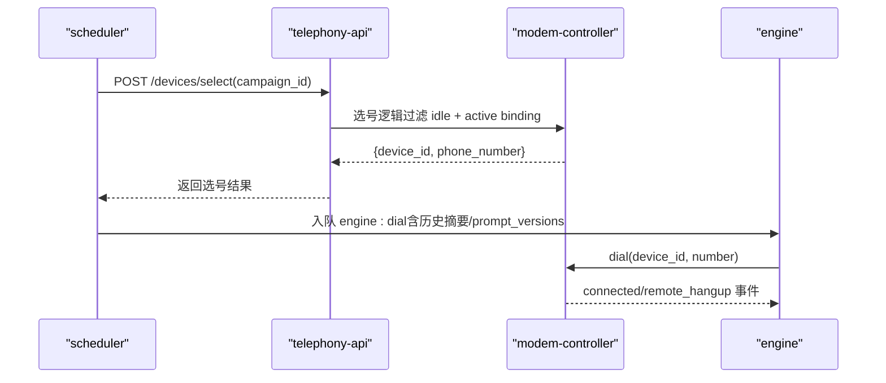
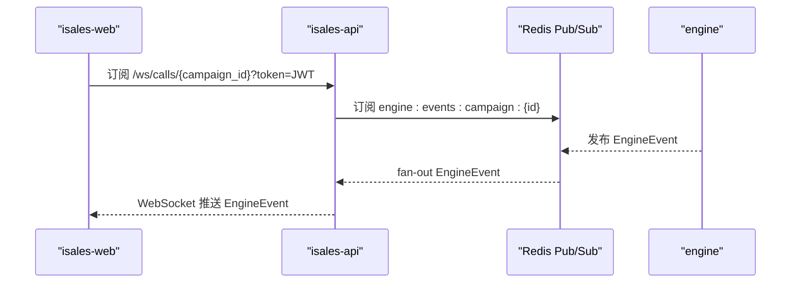
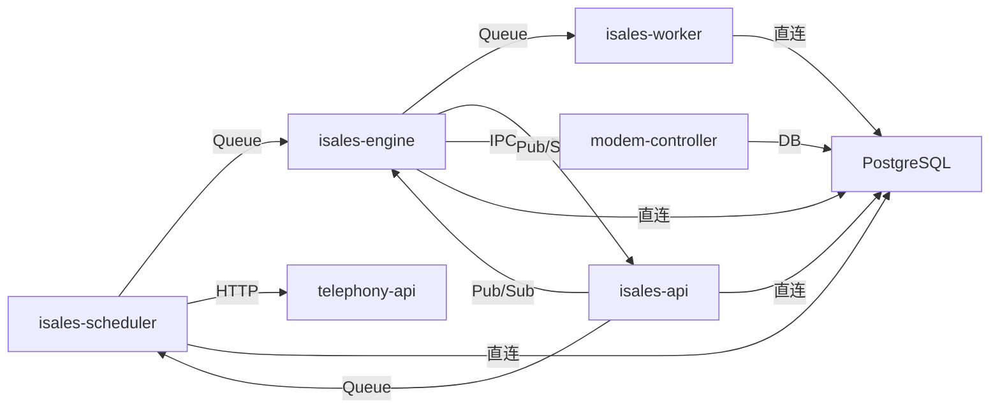

# 系统简介与核心特性

<cite>
**本文引用的文件**
- [README.md](file://README.md)
- [DESIGN.md](file://DESIGN.md)
- [openspec/specs/architecture/spec.md](file://openspec/specs/architecture/spec.md)
- [openspec/specs/deployment-topology/spec.md](file://openspec/specs/deployment-topology/spec.md)
- [openspec/specs/ai-pipeline/spec.md](file://openspec/specs/ai-pipeline/spec.md)
- [openspec/specs/call-state-machine/spec.md](file://openspec/specs/call-state-machine/spec.md)
- [openspec/specs/data-model/spec.md](file://openspec/specs/data-model/spec.md)
- [openspec/specs/device-hardware/spec.md](file://openspec/specs/device-hardware/spec.md)
- [openspec/specs/service-communication/spec.md](file://openspec/specs/service-communication/spec.md)
- [openspec/specs/webhook-callback/spec.md](file://openspec/specs/webhook-callback/spec.md)
- [openspec/specs/retry-followup/spec.md](file://openspec/specs/retry-followup/spec.md)
- [openspec/specs/time-window/spec.md](file://openspec/specs/time-window/spec.md)
- [deploy/README.md](file://deploy/README.md)
</cite>

## 目录
1. [系统简介](#系统简介)
2. [项目结构](#项目结构)
3. [核心组件](#核心组件)
4. [架构总览](#架构总览)
5. [详细组件分析](#详细组件分析)
6. [依赖关系分析](#依赖关系分析)
7. [性能考量](#性能考量)
8. [故障排查指南](#故障排查指南)
9. [结论](#结论)
10. [附录](#附录)

## 系统简介
iSales 是一个基于 OpenSpec 规范驱动开发的云-边分离智能外呼销售系统，面向企业销售团队提供高效率、高转化的电话外呼能力。系统通过“AI 三层管线”实现自然流畅的客户对话，结合“实时通话引擎”“线索管理”“设备管理”“管理后台”“实时音频处理”“可扩展的 AI 服务集成”等能力，显著提升销售转化率与运营效率。

系统采用 7 个独立微服务仓库协同工作，形成“云-边分离”的部署与运行模式：云端负责管理后台、调度与数据持久化，边缘侧负责实时通话引擎与设备控制，二者通过 gRPC/HTTP/Redis 等通道协作，既满足单主机部署的易用性，也为未来多主机扩展预留空间。

应用场景包括：
- 企业销售团队的自动化外呼与线索跟进
- 基于 AI 的自然语言对话，降低人工成本并提升转化
- 严格的合规与安全控制（JWT/HMAC/加密凭据）
- 丰富的 webhook 回调与 CRM 集成，支撑业务闭环

## 项目结构
系统以 OpenSpec 多文件规范为核心，围绕“总体架构”“部署拓扑”“AI 三层管线”“通话状态机”“数据模型”“设备硬件”“服务通信”等能力域进行分层设计。7 个微服务仓库分别承担不同职责，通过统一的共享库与通信协议协同工作。

```mermaid
graph TB
subgraph "云端"
API["isales-api<br/>管理后台 + WS 代理"]
SCHED["isales-scheduler<br/>线索调度"]
WORKER["isales-worker<br/>异步后处理"]
WEB["isales-web<br/>Vue 3 管理面"]
end
subgraph "边缘"
ENGINE["isales-engine<br/>实时通话引擎"]
TELEPHONY_API["isales-telephony-api<br/>设备/SIM 管理"]
MODEM["modem-controller<br/>USB GSM 守护进程"]
end
COMMON["isales-common<br/>共享库"]
REDIS["Redis"]
PG["PostgreSQL"]
WEB --> API
API --> SCHED
SCHED --> ENGINE
ENGINE --> WORKER
API <- --> REDIS
SCHED --> REDIS
ENGINE --> REDIS
WORKER --> REDIS
API --> PG
SCHED --> PG
ENGINE --> PG
WORKER --> PG
ENGINE --> MODEM
TELEPHONY_API --> MODEM
TELEPHONY_API --> PG
WEB --> API
```

图表来源
- [openspec/specs/architecture/spec.md](file://openspec/specs/architecture/spec.md)
- [openspec/specs/deployment-topology/spec.md](file://openspec/specs/deployment-topology/spec.md)
- [openspec/specs/service-communication/spec.md](file://openspec/specs/service-communication/spec.md)

章节来源
- [README.md:1-14](file://README.md#L1-L14)
- [DESIGN.md:36-44](file://DESIGN.md#L36-L44)
- [openspec/specs/architecture/spec.md:130-168](file://openspec/specs/architecture/spec.md#L130-L168)

## 核心组件
- 管理后台（isales-api）：提供 Campaign/Lead/Role/Voice/Analytics/Callback 等管理能力，承载 WebSocket 代理，统一 JWT 鉴权与 HMAC 密钥分发。
- 实时通话引擎（isales-engine）：核心状态机与 AI 三层管线，负责打断/沉默/垫词/目标达成/转人工/收尾等实时行为编排。
- 线索调度（isales-scheduler）：按时间窗口与重试/跟进策略派发外呼任务，选号与并发控制。
- 异步后处理（isales-worker）：通话结束后的摘要/字段提取/回调派发/数据聚合。
- 设备管理（isales-telephony + modem-controller）：USB GSM Modem 控制、SIM 管理、设备状态机、心跳与失联探测。
- 管理前端（isales-web）：Vue 3 管理界面，提供任务/线索/角色/音色/设备/数据看板/通话监控。
- 共享库（isales-common）：Pydantic/SQLAlchemy 模型、Provider ABC、Alembic 迁移、工具函数。

章节来源
- [README.md:7-13](file://README.md#L7-L13)
- [openspec/specs/architecture/spec.md:30-38](file://openspec/specs/architecture/spec.md#L30-L38)
- [openspec/specs/data-model/spec.md:28-51](file://openspec/specs/data-model/spec.md#L28-L51)

## 架构总览
系统采用“云-边分离”与“微服务”相结合的架构：
- 云侧：统一管理后台、调度与数据持久化，提供前端 SPA 与 API；通过 Redis/HTTP/gRPC 与边缘侧交互。
- 边侧：实时通话引擎与设备控制，负责拨号、音频、状态机与 AI 管线；通过本地 IPC 与 modem-controller 通信。
- 共享库：isales-common 作为跨服务共享的稳定接口与模型，统一数据模型与迁移。



图表来源
- [openspec/specs/architecture/spec.md](file://openspec/specs/architecture/spec.md)
- [openspec/specs/deployment-topology/spec.md](file://openspec/specs/deployment-topology/spec.md)

章节来源
- [openspec/specs/architecture/spec.md:45-58](file://openspec/specs/architecture/spec.md#L45-L58)
- [openspec/specs/deployment-topology/spec.md:6-39](file://openspec/specs/deployment-topology/spec.md#L6-L39)

## 详细组件分析

### 实时通话引擎（AI 三层管线）
- 三层并行管线：N 个角色 LLM 并行候选 → M 个裁判 LLM 并行审查 → 1 个润色 LLM 选优拟人化。
- 连续打断保护：支持“短回复”“仅监听”两种策略，避免过度打断影响体验。
- 简化管线：收尾阶段（WRAPPING_UP）走单角色 + 润色，不启用 PK/裁判/垫词。
- 兜底与降级：全部角色失败、全部裁判否决、润色失败等均有兜底与降级路径，保证通话稳定性。
- 管线追踪：每轮 PROCESSING 写入 pipeline_trace，包含候选、裁判、润色等完整信息，便于审计与分析。



图表来源
- [openspec/specs/ai-pipeline/spec.md](file://openspec/specs/ai-pipeline/spec.md)

章节来源
- [openspec/specs/ai-pipeline/spec.md:7-19](file://openspec/specs/ai-pipeline/spec.md#L7-L19)
- [openspec/specs/ai-pipeline/spec.md:131-158](file://openspec/specs/ai-pipeline/spec.md#L131-L158)

### 通话状态机
- 状态集合：INIT/GREETING/LISTENING/SPEAKING/INTERRUPTED/FILLER/PROCESSING/WRAPPING_UP/ACTIVATING/TRANSFERRING/END。
- 关键转换：拨号成功 → 开场白；LISTENING → PROCESSING；SPEAKING → WRAPPING_UP；沉默激活/转人工/无进展挂断等。
- 非法转移：状态机对非法转移抛异常并记录事件，保障运行时一致性。
- 连续打断保护：连续打断计数器清零与保护策略，避免用户被过度打断。



图表来源
- [openspec/specs/call-state-machine/spec.md](file://openspec/specs/call-state-machine/spec.md)

章节来源
- [openspec/specs/call-state-machine/spec.md:5-21](file://openspec/specs/call-state-machine/spec.md#L5-L21)
- [openspec/specs/call-state-machine/spec.md:110-118](file://openspec/specs/call-state-machine/spec.md#L110-L118)

### 线索调度与重试/跟进
- 重试：针对技术失败（no_answer/user_busy/network_out_of_order/temporary_failure）按指数退避策略重试，达到上限后标记失败。
- 跟进：针对通话完成但目标未达成的情况，按固定间隔进行多次跟进，支持上下文增强提示。
- 窗口与节假日：按 Campaign 配置的时间窗口与节假日表进行调度，窗外推迟到下一个窗口。
- 勿打识别：关键词命中或独立 LLM 判定均可触发勿打，礼貌告别后挂断并清理未来任务。



图表来源
- [openspec/specs/retry-followup/spec.md](file://openspec/specs/retry-followup/spec.md)
- [openspec/specs/time-window/spec.md](file://openspec/specs/time-window/spec.md)

章节来源
- [openspec/specs/retry-followup/spec.md:119-159](file://openspec/specs/retry-followup/spec.md#L119-L159)
- [openspec/specs/time-window/spec.md:51-78](file://openspec/specs/time-window/spec.md#L51-L78)

### 设备与硬件控制
- 自研控制层：modem-controller 负责 udev 监听、AT 命令通道、PCM 音频管道，与 engine 通过本地 IPC 协议通信。
- 设备状态机：unknown/detected/registered/idle/dialing/in_call/offline/flagged/error。
- SIM 管理：SIM 卡资料化、绑定历史、热插拔变更。
- 心跳与失联探测：modem-controller 每 30s 心跳，worker 每 30s watchdog，超过 120s 置 offline。
- 选号算法：按 idle 且 active 绑定的设备选择，按 last_call_at 最早优先，保证负载均衡。



图表来源
- [openspec/specs/device-hardware/spec.md](file://openspec/specs/device-hardware/spec.md)
- [openspec/specs/service-communication/spec.md](file://openspec/specs/service-communication/spec.md)

章节来源
- [openspec/specs/device-hardware/spec.md:26-44](file://openspec/specs/device-hardware/spec.md#L26-L44)
- [openspec/specs/device-hardware/spec.md:171-193](file://openspec/specs/device-hardware/spec.md#L171-L193)

### 管理后台与实时监控
- JWT/HMAC：isales-api 为唯一签发方，telephony-api 仅验证；HMAC 密钥通过环境变量注入。
- WebSocket 代理：/ws/calls/{campaign_id} 将 Redis Pub/Sub 的 EngineEvent 转发给前端。
- Webhook 回调：JsonLogic 触发 + Jinja2 渲染 + HMAC-SHA256 签名 + 指数退避重试，支持失败回溯与幂等重试。
- SPA 部署：nginx 反代 + SPA 静态资源，避免 CORS。



图表来源
- [openspec/specs/service-communication/spec.md](file://openspec/specs/service-communication/spec.md)
- [openspec/specs/webhook-callback/spec.md](file://openspec/specs/webhook-callback/spec.md)

章节来源
- [openspec/specs/service-communication/spec.md:106-131](file://openspec/specs/service-communication/spec.md#L106-L131)
- [openspec/specs/webhook-callback/spec.md:5-18](file://openspec/specs/webhook-callback/spec.md#L5-L18)

## 依赖关系分析
- 服务间通信：Redis Queue/Pub/Sub 用于工作派发与事件广播；HTTP 仅用于设备选择；数据库直连通过 isales-common 模型。
- 共享库：isales-common 统一数据模型与迁移，其他服务仅通过依赖使用。
- 并发控制：全局并发用 Redis 原子计数器，避免泄漏与跨实例一致性问题。
- 容错策略：Redis/PG/modem-controller 短暂不可用时具备重连与优雅清理能力。



图表来源
- [openspec/specs/service-communication/spec.md](file://openspec/specs/service-communication/spec.md)
- [openspec/specs/data-model/spec.md](file://openspec/specs/data-model/spec.md)

章节来源
- [openspec/specs/service-communication/spec.md:31-44](file://openspec/specs/service-communication/spec.md#L31-L44)
- [openspec/specs/data-model/spec.md:5-18](file://openspec/specs/data-model/spec.md#L5-L18)

## 性能考量
- 三层管线并行：Layer 1 与垫词同时启动，覆盖管线延迟，提高响应速度。
- 简化管线：收尾阶段（WRAPPING_UP）走单角色 + 润色，减少不必要的计算。
- 并发控制：Redis 原子计数器保障全局并发，避免过载。
- 音频处理：边缘侧 8kHz/16kHz 重采样与 PCM 音频管道，降低端到端延迟。
- 队列与 Pub/Sub：队列保证可靠投递，Pub/Sub 适配实时事件广播，兼顾吞吐与延迟。

## 故障排查指南
- 首次上线与常规发版：参考 RUNBOOK，按 provision → install → migrate → deploy 顺序执行。
- 回滚：rollback.sh 切回历史 release 软链，不自动执行数据库回滚。
- 备份恢复：每日备份 PG 与 Redis，提供恢复演练步骤。
- 监控告警：Prometheus/Grafana 模板，最小告警集覆盖队列深度、设备异常比例、回调失败率、PG 连接数。
- 设备问题：modem-controller 心跳与 watchdog 联动，超过 120s 置 offline；udev 拔出与心跳缺失互为兜底。
- webhook 失败：指数退避重试，失败类型与错误信息记录在 callback_log，支持失败回溯。

章节来源
- [deploy/README.md:61-81](file://deploy/README.md#L61-L81)
- [openspec/specs/deployment-topology/spec.md:76-94](file://openspec/specs/deployment-topology/spec.md#L76-L94)
- [openspec/specs/device-hardware/spec.md:208-236](file://openspec/specs/device-hardware/spec.md#L208-L236)
- [openspec/specs/webhook-callback/spec.md:100-133](file://openspec/specs/webhook-callback/spec.md#L100-L133)

## 结论
iSales 通过 OpenSpec 规范驱动的云-边分离架构与 7 个微服务协同，构建了高可用、可扩展、可审计的智能外呼系统。AI 三层管线与实时通话引擎确保对话自然流畅，调度与重试/跟进机制提升转化效率，设备与硬件控制保障通话质量，管理后台与 webhook 回调打通 CRM 业务闭环。系统在安全性、可靠性与可运维性方面均具备成熟实践，适合企业销售团队规模化应用。

## 附录
- 部署模型：Linux systemd 与 macOS launchd 两种单主机部署模型，目录骨架与环境变量模板一致。
- 环境变量：集中化注入，明文 secret 仅落于受控目录，权限严格控制。
- 运维手册：RUNBOOK 涵盖首次上线、日常发版、回滚、备份恢复、故障排查与上线前 gate。

章节来源
- [deploy/README.md:12-112](file://deploy/README.md#L12-L112)
- [openspec/specs/deployment-topology/spec.md:40-61](file://openspec/specs/deployment-topology/spec.md#L40-L61)