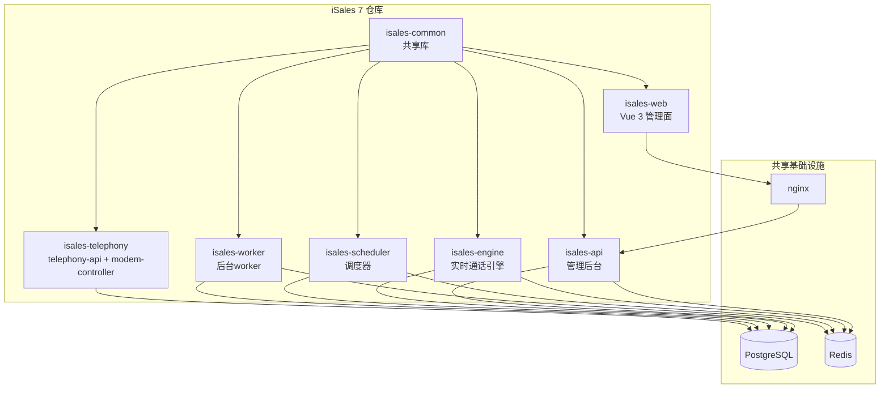
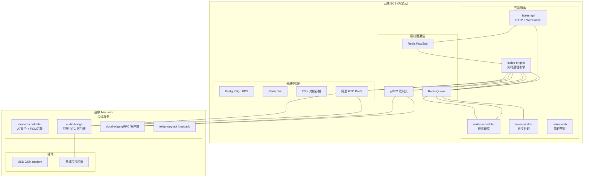
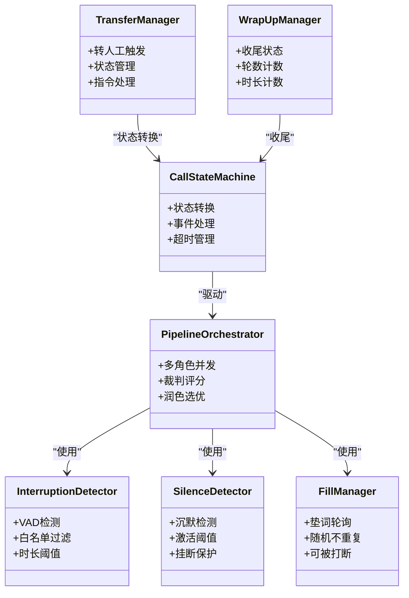
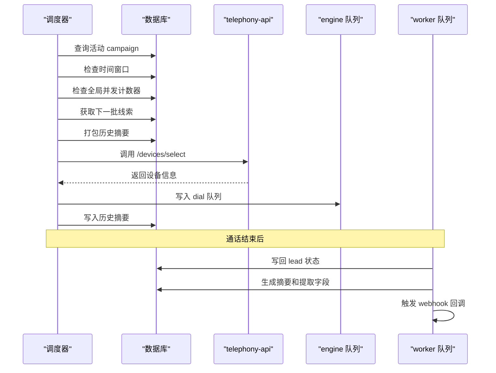
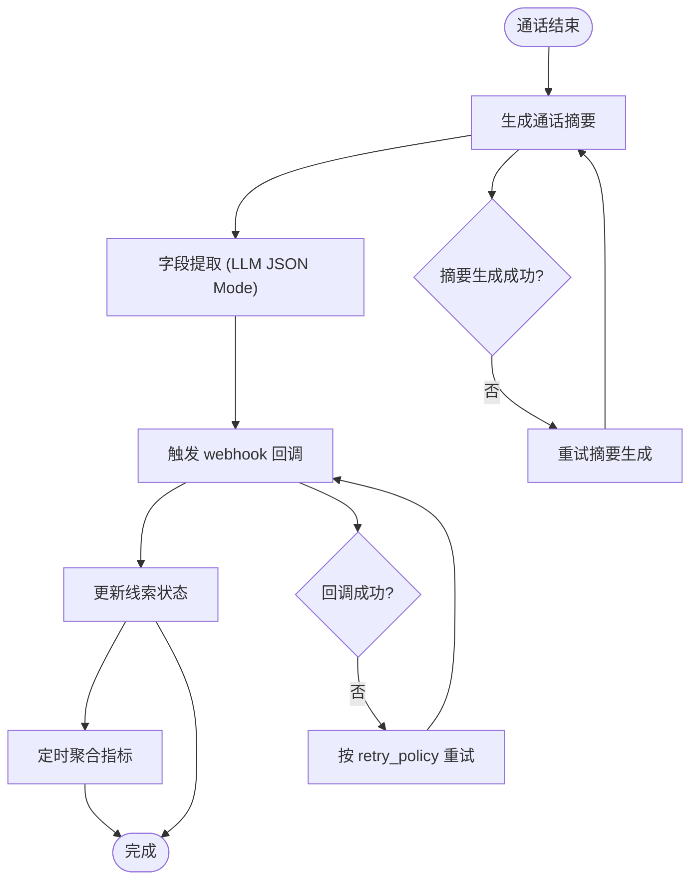
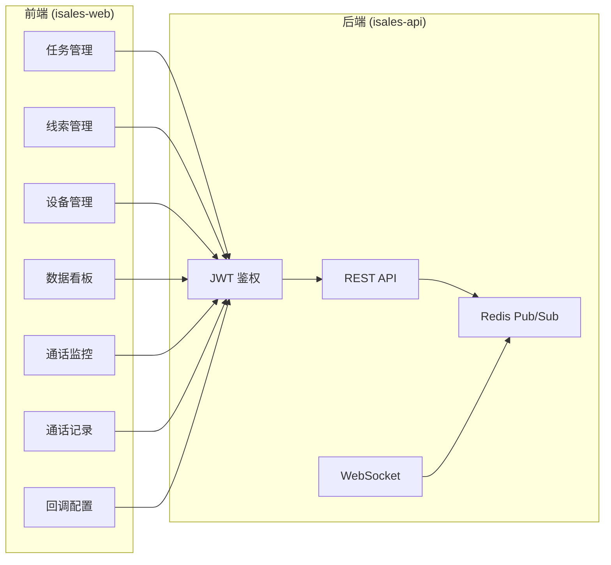
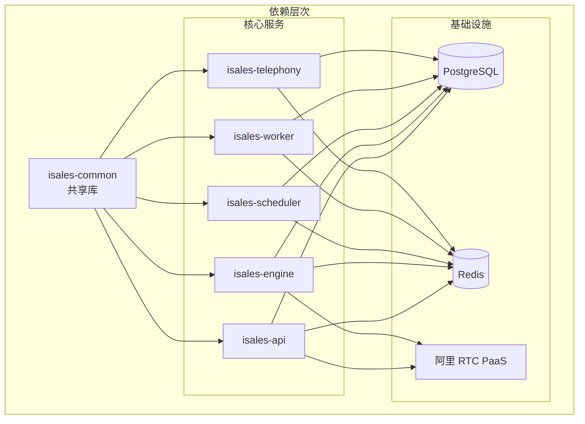

# 项目概述

<cite>
**本文档引用的文件**
- [README.md](file://README.md)
- [DESIGN.md](file://DESIGN.md)
- [IMPLEMENTATION_PLAN.md](file://IMPLEMENTATION_PLAN.md)
- [deploy/cloud/README.md](file://deploy/cloud/README.md)
- [deploy/edge/README.md](file://deploy/edge/README.md)
- [deploy/RUNBOOK.md](file://deploy/RUNBOOK.md)
- [openspec/specs/architecture/spec.md](file://openspec/specs/architecture/spec.md)
- [openspec/specs/deployment-topology/spec.md](file://openspec/specs/deployment-topology/spec.md)
- [openspec/specs/service-communication/spec.md](file://openspec/specs/service-communication/spec.md)
- [openspec/specs/data-model/spec.md](file://openspec/specs/data-model/spec.md)
- [openspec/v1-roadmap.md](file://openspec/v1-roadmap.md)
- [scripts/test_all.sh](file://scripts/test_all.sh)
- [Makefile](file://Makefile)
</cite>

## 目录
1. [简介](#简介)
2. [项目结构](#项目结构)
3. [核心组件](#核心组件)
4. [架构总览](#架构总览)
5. [详细组件分析](#详细组件分析)
6. [依赖分析](#依赖分析)
7. [性能考虑](#性能考虑)
8. [故障排查指南](#故障排查指南)
9. [结论](#结论)
10. [附录](#附录)

## 简介
iSales 是一个基于 OpenSpec 的规范驱动开发的云-边分离智能外呼销售系统。系统采用 7 个独立微服务仓库协同工作，通过规范化的 OpenSpec 工作流进行设计、实施与归档，确保跨仓库的一致性与可追溯性。系统提供从线索管理、任务编排、实时通话引擎到前端管理界面的完整能力，并支持 Linux systemd 与 macOS Apple Silicon 两种生产部署形态。

系统的核心目标是通过 AI 驱动的智能外呼提升销售效率，提供可配置的 AI 目标达成能力、流式 ASR/LLM/TTS 管线、打断检测与沉默激活等关键技术特性，同时保证端到端的稳定性与可运维性。

## 项目结构
iSales 采用多仓库微服务架构，7 个核心仓库分工明确，通过 isales-common 共享库实现跨服务的稳定接口与数据模型。



**图表来源**
- [openspec/specs/architecture/spec.md:130-168](file://openspec/specs/architecture/spec.md#L130-L168)
- [openspec/specs/deployment-topology/spec.md:1-414](file://openspec/specs/deployment-topology/spec.md#L1-L414)

**章节来源**
- [README.md:1-14](file://README.md#L1-L14)
- [openspec/specs/architecture/spec.md:1-168](file://openspec/specs/architecture/spec.md#L1-L168)

## 核心组件
系统由 7 个独立的微服务组成，每个服务都有明确的职责边界：

### 核心服务职责
- **isales-common**: SQLAlchemy 模型、Pydantic Schema、Provider ABC、Alembic 迁移、工具函数
- **isales-api**: 管理后台 CRUD、WebSocket 代理、JWT 鉴权
- **isales-engine**: 实时通话引擎、状态机、AI 三层管线、打断/沉默/垫词处理
- **isales-scheduler**: 线索分发、时间窗口、重试与跟进策略
- **isales-worker**: 通话结束后的摘要、字段提取、Webhook 回调、数据聚合
- **isales-telephony**: telephony-api(HTTP) + modem-controller(守护进程)
- **isales-web**: Vue 3 前端管理界面

### 数据模型与通信
系统采用统一的数据模型管理，所有服务通过 isales-common 的 SQLAlchemy 模型访问 PostgreSQL，通过 Redis 实现服务间通信。核心数据表包括 campaign、lead、call_record、device、sim_card 等，涵盖完整的业务生命周期。

**章节来源**
- [openspec/specs/architecture/spec.md:30-38](file://openspec/specs/architecture/spec.md#L30-L38)
- [openspec/specs/data-model/spec.md:28-51](file://openspec/specs/data-model/spec.md#L28-L51)
- [openspec/specs/service-communication/spec.md:11-24](file://openspec/specs/service-communication/spec.md#L11-L24)

## 架构总览
iSales 采用云-边分离的部署架构，将实时通话处理与硬件控制分离到边缘设备，云端负责 AI 推理、数据处理与管理界面。



**图表来源**
- [deploy/cloud/README.md:12-53](file://deploy/cloud/README.md#L12-L53)
- [deploy/edge/README.md:12-40](file://deploy/edge/README.md#L12-L40)
- [openspec/specs/deployment-topology/spec.md:456-491](file://openspec/specs/deployment-topology/spec.md#L456-L491)

## 详细组件分析

### 实时通话引擎 (isales-engine)
引擎是系统的核心，负责处理实时通话的完整生命周期，包括状态机管理、AI 三层管线、打断检测与沉默激活等。



**图表来源**
- [DESIGN.md:13-21](file://DESIGN.md#L13-L21)
- [IMPLEMENTATION_PLAN.md:190-223](file://IMPLEMENTATION_PLAN.md#L190-L223)

引擎采用分层架构设计，包含状态机、AI 管线编排、实时处理模块等子系统。状态机管理通话的完整生命周期，AI 管线实现多角色并发推理、裁判评分和润色选优，实时处理模块负责打断检测、沉默激活、垫词管理和转人工处理。

**章节来源**
- [IMPLEMENTATION_PLAN.md:190-223](file://IMPLEMENTATION_PLAN.md#L190-L223)
- [DESIGN.md:13-21](file://DESIGN.md#L13-L21)

### 调度器 (isales-scheduler)
调度器负责从数据库中捞取待拨线索，根据时间窗口和并发限制进行分发，是系统的核心协调组件。



**图表来源**
- [IMPLEMENTATION_PLAN.md:153-171](file://IMPLEMENTATION_PLAN.md#L153-L171)
- [openspec/specs/service-communication/spec.md:13-18](file://openspec/specs/service-communication/spec.md#L13-L18)

调度器的核心流程包括 campaign 扫描、时间窗口检查、并发控制、线索获取、历史摘要打包、设备选择和队列写入。通过 Redis 全局并发计数器确保系统稳定性，通过历史摘要提高对话质量。

**章节来源**
- [IMPLEMENTATION_PLAN.md:153-171](file://IMPLEMENTATION_PLAN.md#L153-L171)

### 后台 worker (isales-worker)
worker 负责通话结束后的异步处理，包括摘要生成、字段提取、回调触发和数据聚合。



**图表来源**
- [IMPLEMENTATION_PLAN.md:173-186](file://IMPLEMENTATION_PLAN.md#L173-L186)

worker 采用 Celery 异步任务框架，通过 Redis broker 实现任务分发。核心任务包括摘要生成、字段提取、回调触发和指标聚合，所有任务都具备重试机制和错误处理能力。

**章节来源**
- [IMPLEMENTATION_PLAN.md:173-186](file://IMPLEMENTATION_PLAN.md#L173-L186)

### 管理后台 (isales-api + isales-web)
管理后台提供完整的业务管理界面，包括任务管理、线索管理、设备管理、数据看板等功能。



**图表来源**
- [IMPLEMENTATION_PLAN.md:127-147](file://IMPLEMENTATION_PLAN.md#L127-L147)
- [openspec/specs/service-communication/spec.md:106-131](file://openspec/specs/service-communication/spec.md#L106-L131)

管理后台采用前后端分离架构，前端使用 Vue 3 + Vite + Element Plus，后端提供 REST API 和 WebSocket 实时推送。通过 JWT 鉴权确保安全性，通过 Redis Pub/Sub 实现实时监控。

**章节来源**
- [IMPLEMENTATION_PLAN.md:127-147](file://IMPLEMENTATION_PLAN.md#L127-L147)

## 依赖分析
系统采用严格的依赖管理策略，确保各组件间的松耦合和高内聚。



**图表来源**
- [openspec/specs/architecture/spec.md:73-86](file://openspec/specs/architecture/spec.md#L73-L86)
- [openspec/specs/data-model/spec.md:5-18](file://openspec/specs/data-model/spec.md#L5-L18)

### 通信协议与数据流
系统通过多种通信协议实现服务间协作，包括 Redis 队列、Pub/Sub、HTTP 和 gRPC。

**章节来源**
- [openspec/specs/service-communication/spec.md:7-25](file://openspec/specs/service-communication/spec.md#L7-L25)

## 性能考虑
系统在设计时充分考虑了性能优化，采用多项技术手段确保高并发场景下的稳定性。

### 并发控制
- 全局并发计数器使用 Redis 原子操作，避免计数器泄漏
- 通话结束立即递减计数器，防止资源占用
- 系统提供定期对账机制，确保计数器准确性

### 流式处理
- ASR/TTS/LLM 全面采用流式处理，减少端到端延迟
- 边缘 VAD 检测提前停止播放，配合云端取消机制
- 预缓存开场白减少冷启动延迟

### 缓存策略
- Redis 作为多用途缓存层，支持队列、缓存和计数器
- 对象存储缓存开场白和高频短语
- 本地 SQLite 缓冲离线事件

## 故障排查指南
系统提供完善的运维手册和故障排查流程，确保快速定位和解决问题。

### 常见故障处理
- **数据库连接问题**: 检查 PostgreSQL 服务状态和磁盘空间
- **Redis 内存溢出**: 调整 maxmemory 配置或优化键空间
- **modem 设备问题**: 检查 USB 事件和串口占用情况
- **引擎队列积压**: 监控 engine:dial 队列深度，检查引擎状态

### 监控与告警
系统提供完整的监控指标，包括在播通话数、队列深度、设备状态、回调成功率等关键指标。

**章节来源**
- [deploy/RUNBOOK.md:163-197](file://deploy/RUNBOOK.md#L163-L197)
- [openspec/specs/deployment-topology/spec.md:95-113](file://openspec/specs/deployment-topology/spec.md#L95-L113)

## 结论
iSales 智能外呼销售系统通过 OpenSpec 规范驱动开发，实现了云-边分离的现代化架构。系统采用 7 个独立微服务仓库协同工作，通过 isales-common 共享库确保接口一致性，通过 Redis 和 PostgreSQL 实现高效的数据交换和持久化。

系统的核心优势包括：
- **规范驱动**: 通过 OpenSpec 工作流确保设计、实施和归档的完整性
- **云边分离**: 将实时处理与硬件控制分离，提升系统可扩展性
- **流式处理**: 采用流式 ASR/LLM/TTS 技术，提供低延迟的用户体验
- **可运维性**: 完善的监控、告警和故障排查机制
- **跨平台支持**: 同时支持 Linux systemd 和 macOS Apple Silicon 部署

该系统为销售团队提供了智能化的外呼解决方案，通过 AI 驱动的对话能力和完善的管理界面，显著提升了销售效率和客户体验。

## 附录

### 快速开始指南

#### Linux 生产部署 (systemd)
```bash
# 1. 主机准备
sudo bash deploy/linux/scripts/provision.sh

# 2. 编辑环境变量
sudo -e /etc/isales/env/api.env
sudo -e /etc/isales/env/engine.env

# 3. 安装新版本
sudo bash deploy/linux/scripts/install.sh v0.1.0

# 4. 数据库迁移
sudo bash deploy/linux/scripts/migrate.sh

# 5. 切换并重启服务
sudo bash deploy/linux/scripts/deploy.sh <release-ts>
```

#### macOS Apple Silicon 部署 (launchd)
```bash
# 1. 主机准备
sudo bash deploy/macos/scripts/provision.sh

# 2. 编辑环境变量
sudo -e /etc/isales/env/api.env

# 3. 安装新版本
sudo bash deploy/macos/scripts/install.sh v0.1.0

# 4. 数据库迁移
sudo bash deploy/macos/scripts/migrate.sh

# 5. 切换并重启服务
sudo bash deploy/macos/scripts/deploy.sh <release-ts>
```

### OpenSpec 工作流程
```bash
# 查看活动变更
openspec list

# 查看单个变更进度
openspec status --change <name>

# 提议新变更
/opsx:propose <name>

# 应用变更
/opsx:apply <name>

# 归档变更
/opsx:archive <name>
```

### 跨仓测试
```bash
# 运行所有仓库测试
make test-all

# 过滤特定测试
make test-all PYTEST_ARGS="-k modem"

# 验证 OpenSpec 制品
make spec-validate

# 部署脚本一致性检查
make deploy-check
```

**章节来源**
- [README.md:32-86](file://README.md#L32-L86)
- [deploy/cloud/README.md:69-93](file://deploy/cloud/README.md#L69-L93)
- [deploy/edge/README.md:55-75](file://deploy/edge/README.md#L55-L75)
- [scripts/test_all.sh:1-145](file://scripts/test_all.sh#L1-L145)
- [Makefile:1-30](file://Makefile#L1-L30)